# 2\. 放轻松

本章我们将通过实际操作来轻松入门 SwiftUI。如果觉得节奏慢，那很好！打好基础的最佳时机就是刚开始的时候，而且基础必须扎实——坚如磐石。就像数学、口语或其他许多技能一样，如果现在不打好基础，后面就会迷失方向。

## 代码 + 界面

如果你过去曾在 Xcode 中进行过界面开发，你就会知道将界面设计与代码结合起来是可行的。然而，它们并不能热替换。你无法在代码中将背景颜色改为红色，然后打开 Interface Builder 就看到那个变化。至少，在没有特殊编码的情况下不行。

使用 SwiftUI，你可以将代码和界面视为一体。实际上，它们就是一体。过去，界面会被转换成 XML，这种格式既不易读，也难以正确编辑。现在，界面是由 SwiftUI 代码生成的。当你修改代码时，预览会同步更新以显示更改。

此外，如果你在预览画布中修改界面，代码也会同步更新。让我们从一个新项目开始，来看一个例子。

## 你的第一个 SwiftUI 应用

我们将从模板创建一个项目开始，分析创建的内容，然后根据自己的需求更改界面。

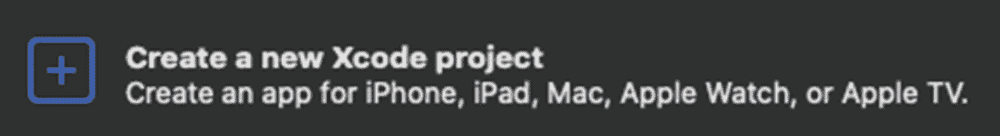

图 2-1

在 Xcode 中创建新项目选项

1.  打开 Xcode 并开始一个新项目（图 2-1）。

如果 Xcode 已经在运行，请选择 `File ➤ New… ➤ Project`（`⇧⌘N`）。

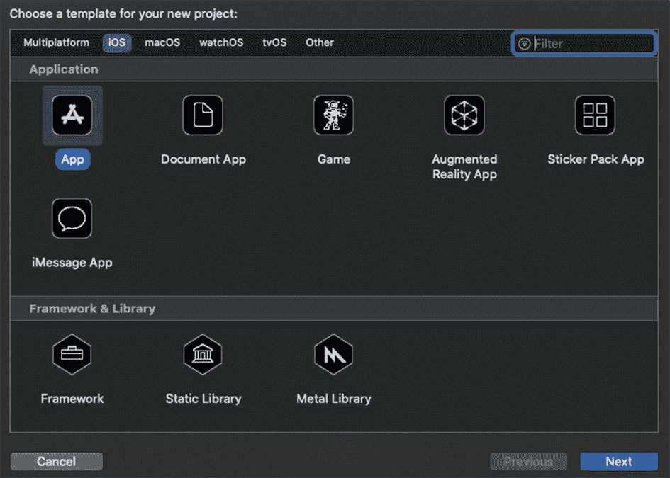

图 2-2

iOS App 模板

1.  选择 iOS App 模板，然后点击 Next（图 2-2）。

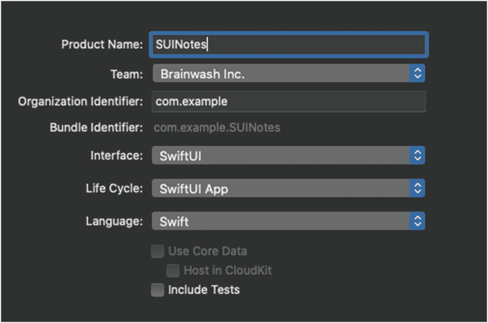

图 2-3

项目选项

1.  设置你的产品名称和其他详细信息，包括语言（`Swift`）、用户界面（`SwiftUI`）和生命周期（`SwiftUI App`）（图 2-3）。

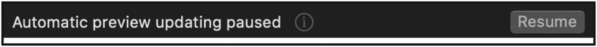

图 2-4

恢复自动预览

1.  项目创建后，预览更新可能会暂停。如果是这样，请点击 Resume 按钮（图 2-4）。

预览更新后，你将看到你的第一个 SwiftUI 应用。恭喜。没人比我更以你为傲。

## 你好，SwiftUI

当然，这是典型的“Hello World”示例。让我们简单逐行看一下我们得到了什么。

我们在第 9 行导入了 `SwiftUI`。这是新内容。显然，各种 SwiftUI 组件都在此定义。

第 11 行是我们新应用的第一行代码。我们有一个名为 `ContentView` 的结构体，它实现了一个名为 `View` 的协议。我们可以通过 `⌃⌘ + 点击 "View"` 来查看该协议的定义。

所以，任何实现 `View` 的类型都需要有一个名为 `body` 的属性。该属性必须有一个 getter，其返回类型由 `Body` 的关联类型指定：即某种实现了 `View` 的类型。

回到代码中，我们看到 `ContentView` 实现了 `View`。返回类型是 `some View`，而这个计算属性 `body` 的主体是一个 `Text`。

> **注意**  
> 我们将在后面深入讲解 `some View` 和不透明类型。现在，只需知道从我们的 `body` 计算属性返回的任何内容都必须实现 `View`。

你可能已经猜到 `Text` 类似于一个标签。我们用一个 `String` 来创建它，然后它就会显示在界面上。

## 修饰符

与其他界面开发方法一样，SwiftUI 元素可以被修饰。`Text` 拥有诸如字体、颜色、对齐等修饰符。

我们可以为 `Text` 元素添加一个修饰符来将字体变成红色，如下所示（图 2-5）：


图 2-5

带有红色前景色的 Text

```
Text("Hello, World!")
.foregroundColor(.red)
```

你会注意到预览中的界面同步更新了。

类似地，我们可以通过链式调用另一个修饰符来将文本加粗。为了代码整洁，我们可能希望将它们分成多行（图 2-6）。


图 2-6

带有加粗、红色前景色的 Text

```
Text("Hello, World!")
.foregroundColor(.red)
.bold()
```

可想而知，你可以在给定的界面元素上实现多种视觉变化。这意味着有大量的修饰符以及许多参数。这需要学习和记忆的内容非常多。


## SwiftUI 检查器

幸运的是，你并不需要记住所有的修饰符。Xcode 会来帮忙！

如果你`⌘` + 点击 `Text` 项目，就会看到一个弹出菜单。从中选择“显示 SwiftUI 检查器…”（图 2-7）。

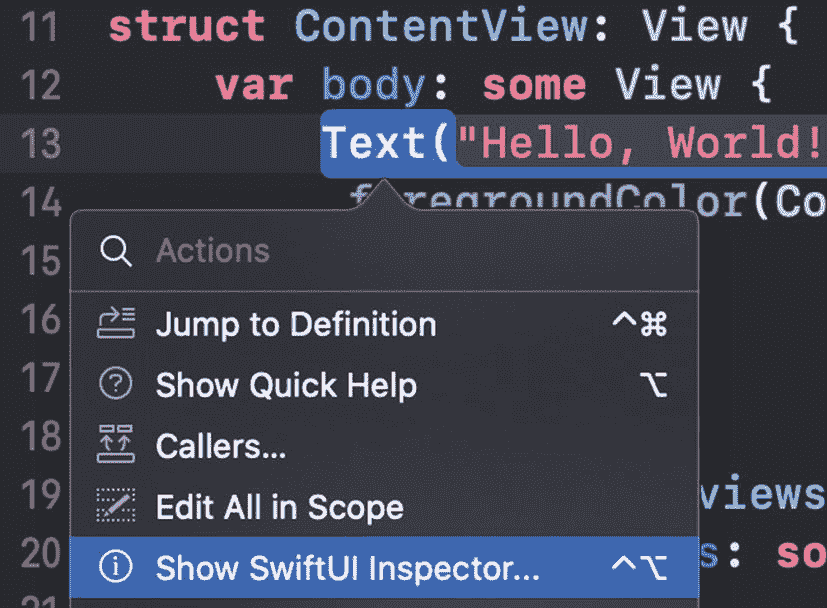

图 2-7

SwiftUI 检查器菜单项

> **注意：** 你也可以通过 `⌃⌥` + 点击 `Text` 直接打开 SwiftUI 检查器。

SwiftUI 检查器显示后，我们可以看到有许多可以通过修饰符设置的属性。

不仅如此，我们还可以通过底部的下拉菜单添加修饰符（图 2-8）。

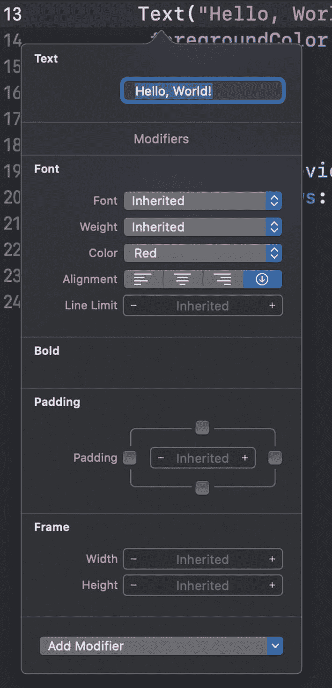

图 2-8

SwiftUI 检查器

当你对这些修饰符的控件进行选择时，你的代码会同步更新以反映你的选择。

注意那个名为“粗体”的空部分。它之所以存在，是因为我们手动添加了那个修饰符，但它没有任何设置。

更好的加粗文本的方法是通过检查器中“字体”部分的修饰符。

练习时间到！

**使用修饰符修改**

在这个练习中，我希望你使用 SwiftUI 检查器中的修饰符，让你的“Hello World”文本与以下示例匹配。请在查看步骤前自己尝试一下。同时，删除 `.bold()` 这行代码，以获得更好的起点。

```
Text("Hello, World!")
.foregroundColor(Color.red)
```

以下是我希望你的文本在仅使用 SwiftUI 检查器后看起来的样子（图 2-9）。

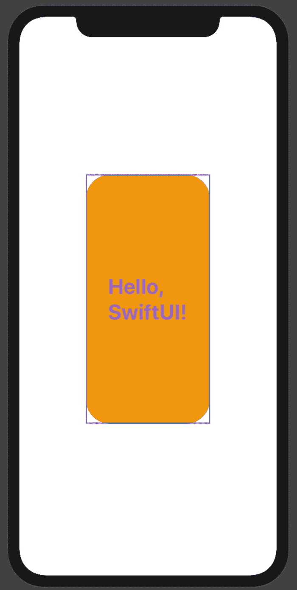

图 2-9

更新后的 UI 预览

你可以轻松地看到有几项发生了变化：

1.  文本（`“Hello, SwiftUI!”`）
2.  字体颜色
3.  字体大小
4.  字重
5.  单词间距
6.  `Text` 的大小
7.  背景颜色
8.  圆角半径

请随意尝试各种修饰符及其值的设置。通过这些类型的实践，你会更熟练、更自然地进行这些修改。

理想情况下，你最终会达到无需停下来思考、疑惑和搜索正确设置的程度。

以下是我在 SwiftUI 检查器中使用的、以达到我想要的 `Text` 项目效果的设置：

我在“字体”区域做了三项更改：字体本身、字重和颜色。

我将内边距更改为 30（你可以直接点击数字进行编辑）。

我还手动将框架的宽度和高度分别更改为 200 和 400。

我使用“添加修饰符”下拉列表添加了另外两个修饰符：Background 和 Corner Radius。添加后，我就可以设置它们的值了。

以下是这些更改后的代码：

```
Text("Hello, SwiftUI!")
.font(.largeTitle)
.fontWeight(.bold)
.foregroundColor(Color.purple)
.padding(30.0)
.frame(width: 200.0, height: 400.0)
.background(Color.orange)
.cornerRadius(40.0)
```

再次强调，请熟练使用这些控件，并将更改与代码和 UI 关联起来。接下来，我们将研究完成这些任务的其他一些方法。

### 属性检查器

你可以像在代码中操作 `Text` 一样，`⌃⌥` + 点击 UI 项目。不过，SwiftUI 检查器可能看起来不一样。

请注意，在这种情况下，弹出菜单中只有几个可用的选项（图 2-10）。

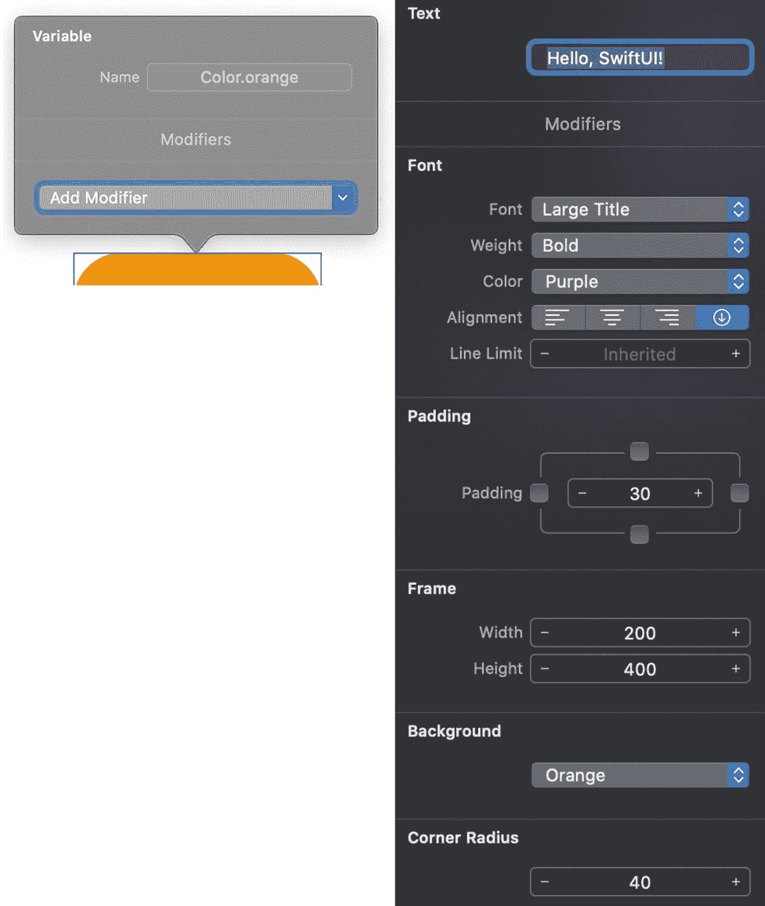

图 2-10

画布中的弹出菜单

要查看之前看到的所有相同修饰符，属性检查器是一个可靠的选择。

**属性检查器**

在这个练习中，我们将看到相同的修饰符可以通过画布中的可视化 UI 设计进行访问。但是，无需将你的思维从“在代码中工作”切换到“在 UI 中工作”。它们是一样的。代码就是 UI。

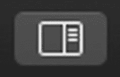

图 2-11

检查器面板按钮

1.  使用 Xcode 窗口右上角的这个按钮打开检查器面板（右侧）（图 2-11）。


图 2-12

属性检查器标签页

1.  选择检查器面板顶部的属性检查器（图 2-12）。

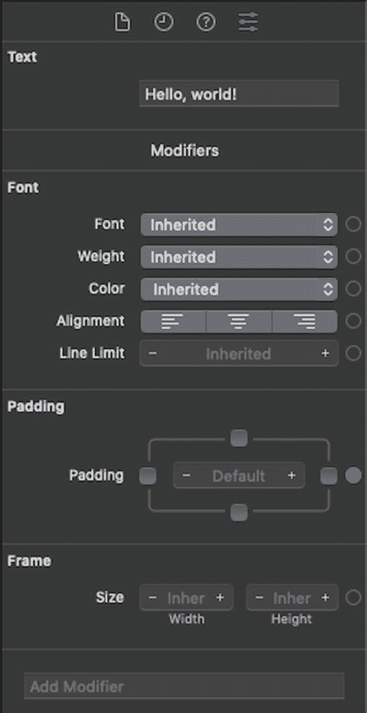

图 2-13

属性检查器

1.  点击 UI 或代码中的“Hello, SwiftUI!” `Text` 项目，以便在属性检查器中显示其属性（图 2-13）。

如果并非所有修饰符都显示出来，请点击代码中的该项目。

注意这些值与之前相同。另外，“添加修饰符”下拉列表也是可用的。

从这里开始，你就可以进行相同的选择和修改了。

1.  更改背景颜色、文本和其他设置，并在 UI 和代码中验证更改。

你可能已经看到，有多种方式可以完成相同的事情。你可以编辑代码，在 SwiftUI 检查器和属性检查器中进行修改。

希望你正将代码和 UI 视为一体：理想情况下，代码 *就是* UI。

## 堆叠中的堆叠

一个应用中只有一个元素的屏幕算不上什么用户界面，也不常见。但计算属性 `body` 只能返回一个元素。我们该怎么办呢？

大多数情况下，我们返回的这一个项目会包含许多其他项目。所以它是一个其他项目的容器。而且，正如我们将看到的，它常常是一个包含其他项目容器的容器，以此类推。

我们将会遇到的两个常见容器是水平堆栈（`HStack`）和垂直堆栈（`VStack`）。

水平堆栈是水平堆叠。你可能已经猜到垂直堆栈是垂直堆叠。如果你熟悉 Interface Builder 中的堆栈视图，你可能已经知道我要说什么了。

将一个项目嵌入堆栈的一种简单方法是通过 `⌘` + 点击的弹出菜单（见图 2-14）。

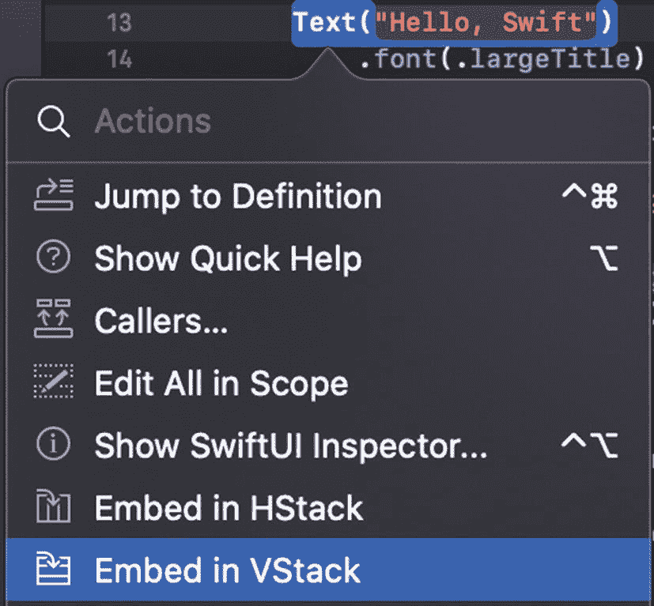

图 2-14

带有嵌入选项的上下文弹出菜单

这只是在代码中用相应的 `HStack` 或 `VStack` 代码包裹一个项目。将其包裹在 `VStack` 中看起来是这样的：

```
var body: some View {
VStack {
Text("Hello, Swift")
.font(.largeTitle)
.fontWeight(.bold)
.foregroundColor(Color.blue)
.padding(30.0)
.frame(width: 200.0, height: 400.0)
.background(Color.green)
.cornerRadius(40.0)
}
}
```

你应该不会注意到 UI 有任何变化，因为堆栈里只有一个项目。我们之前只有一个项目的 UI 会将其居中放置。新的堆栈也是如此。

然而，如果我们添加更多项目（例如，在当前项目下方再添加一个 `Text` 项目），它就会将它们垂直堆叠起来。

如果我在当前项目下方再添加一个 `Text` 项目，它看起来会像图 2-15 那样。


## 重点来了

我希望你已经开始明白这部分是如何运作的了。代码和用户界面 —— 砰 —— 合为一体！用户界面由代码构建而成，而不是像过去那样，你实例化一个按钮、设置其属性，然后将其添加到屏幕上（图 2-15）。

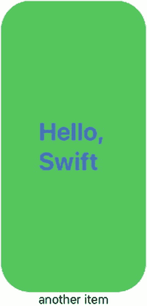

**图 2-15** – 底部带有附加文本的用户界面

现在，框架内嵌了代码，期望你通过代码来实现用户界面。由于 `View` 协议等机制的存在，一个计算属性 `body` 会返回“`some View`”，并且该视图会被显示出来。

因此，我们必须实现该协议，返回一个符合 `View` 协议的内容。`Text` 和其他元素都符合该协议，所以我们可以创建这些元素并返回它们。

此外，单表达式闭包会自动返回该表达式的结果。所以，我们直接开始编码吧！

无论我们创建一个 `Text` 元素，还是一个包含子元素的 `VStack` 或 `HStack`，它们都会被返回。

对于创建的元素，我们可以添加修改器来更改颜色、间距、字体、内边距等。这些修改既可以在代码中添加，也可以通过检查器面板完成。

`SwiftUI Inspector` 可以通过菜单栏使用 **⌘ + 点击** 来显示，或者直接使用 **⌃⌥ + 点击** 打开。

`Attributes Inspector` 通过右侧面板（检查器）显示，并选中 `Attributes Inspector` 标签页按钮。在用户界面或代码中选中的每个元素，都会显示其相关的属性。在某些情况下，在代码中选中元素效果最佳。

## 用户界面练习

我希望你使用现有的项目（或者创建一个新项目），并使用户界面看起来像下图所示（图 2-16）。

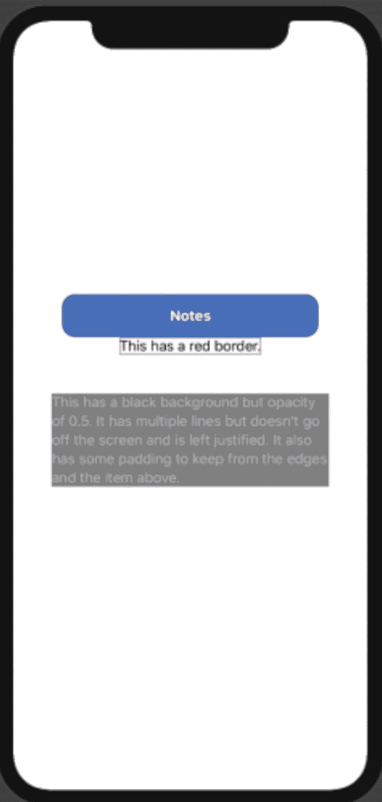

**图 2-16** – 练习的用户界面

接下来，我会给你一些提示，然后给出解决方案。但首先，请尝试通过添加元素和修改器来重现这个界面，看看你是否能调整出正确的效果。

文本本身也包含一些提示。

以下是提示：

*   所有三个元素都是 `Text` 元素。这一点没有新意。
*   第二个元素只有一个修改器：`.border`
*   第三个元素有两个文本中提到的修改器：`.padding` 和 `.opacity`
*   三个元素都包含在一个 `VStack` 中。

我希望你在添加元素和修改器的练习中有所收获。我想鼓励你总是去尝试。试着添加像 `Blur` 或 `Shadow` 这样的修改器，看看效果如何。

以下是解决方案代码：

```
VStack {
Text("Notes")
.fontWeight(.bold)
.foregroundColor(Color.white)
.padding(30.0)
.frame(width: 300.0, height: 50.0)
.background(Color.blue)
.cornerRadius(15.0) Text("This has a red border.")
.border(Color.red, width: 1)
Text("This has a black background but opacity of 0.5\. It has multiple lines but doesn't go off the screen and is left justified. It also has some padding to keep from the edges and the item above.")
.foregroundColor(Color.white)
.background(Color.black)
.multilineTextAlignment(.leading)
.opacity(0.5)
.padding(45)
}
```

### 章节总结

在本章中，我们探讨了从其他概念转向 SwiftUI 时所需的思想转变。SwiftUI 的代码*就是*用户界面，就像过去的 nib/xib/storyboard XML 是用户界面一样。

我们学习了 `View` 协议以及该类型中定义的 `body` 计算属性。

我们检查了一个单视图应用的模板定义。`ContentView` 结构体通过一个包含 `Text` 元素的单表达式闭包实现了 `View` 协议。

使用 `SwiftUI Inspector` 和 `Attributes Inspector`，我们看到了如何在修改器上添加和更改值。并且，通过弹出菜单，我们了解了如何将一个元素嵌入到 `VStack` 或 `HStack` 中。

在下一章中，我们将超越基础的 `Text` 元素，使用更广泛的、为 UI 开发提供的各种 UI 元素。

