# 3. SwiftUI 构建块

在本章中，我们将介绍 SwiftUI 提供的各种构建块。与 UIKit 一样，SwiftUI 也提供了各种元素，我们可以用来构建用户界面。我们已经见过了 `Text` UI 元素。那仅仅是个开始。

## 老友与新交

如果你之前使用过 Xcode 进行开发，你可能已经熟悉许多标准的 UI 元素。`Switch`、`Segmented Control`、`Picker View` 等长期以来一直是我们的好朋友。

别担心——你依然会见到它们。不过，你将用不同的方式来创建它们。当然，是的，它会在代码中完成。但它也将采用更声明式的方法。所谓声明式，是指你将告诉 SwiftUI *做什么*，但不一定需要告诉它*怎么做*。

让我们来看看 `Button`。


## 按钮

几乎每个用户界面都包含按钮。用户点击它，代码就会执行。很简单。它在某种程度上体现了功能。按钮主要需要两样东西：点击时要调用的代码以及在按钮上显示的内容（文本、图片或两者兼具）。

那么现在就开始吧！

### 在用户界面中创建一个按钮

在本练习中，我们将使用关键字 `Button` 向用户界面添加一个按钮。我们将调用一个初始化器来传入要调用的代码以及在按钮上显示的内容。在本例中，我们将使用文本。

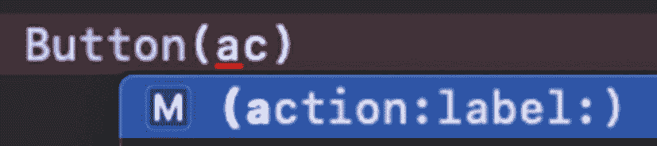

**图 3-2：** 按钮自动补全代码

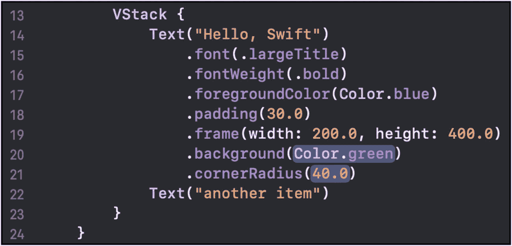

**图 3-1：** 计算属性 Body 内容

1. 打开一个项目（新建或现有），点击 `ContentView.swift` 文件进行编辑。我使用的是现有代码，我的 `body` 属性当前看起来像图 3-1。我有一个 `VStack`，垂直包裹两个 `Text` 项。

我想在两个 `Text` 项之间添加一个按钮，并在定义它的位置直接内联调用代码。你也可以提供一个方法名称来调用，而不是创建一个闭包。

2. 在第 21 行下方输入 `Button(ac`（这看起来有些奇怪的文本指定了我们想要的用于代码补全的 `Button` 初始化器）（图 3-2）。注意 `action`（要调用的代码）和 `label`（要显示的内容 – 实现了我们在前一章讨论过的 `View` 协议）这两个参数。按 Return 键自动补全代码。

对于代码，我们将其内联定义，因此按 Tab 键直至代码占位符（`() -> Void`）被高亮（在我的编辑器里是蓝色显示），然后按 Return 键来生成闭包模板。

我们还不想运行任何实际功能，所以只放一些虚拟代码。

3. 在闭包的主体中输入 `print("tapped!")`（替换 `code` 占位符）。

第二个参数 `Label` 是 `Button` 中的一个泛型，需要实现 `View` 协议。我们在上一章通过 `Text` 项看到了这一点。类似地，它的修饰符会返回该类型，因此我们可以将它们链式调用。

我们可能想在按钮上显示一张图片或各种其他项。但文本很常见，所以我们使用一个 `Text` 元素。

4. 将第二个参数占位符替换为一个返回 `Text` 项的单表达式闭包。这实现了 `View` 协议，因此它符合返回类型。

现在两个之前的 `Text` 项之间的代码应如下所示：

```
Button(action: {
print ("tapped!")
}, label: { Text("Tap Me") })
```

预览现在也应包含一个位于两个已有 `Text` 项之间的按钮。注意 `VStack` 只是按从上到下的顺序放置这些项。

我们可以预期，如果在模拟器或设备上运行此代码 (⌘R)，我们可以点击这个新按钮（图 3-3）。此外，我们应该会看到输出（`tapped!`）打印到调试输出控制台。

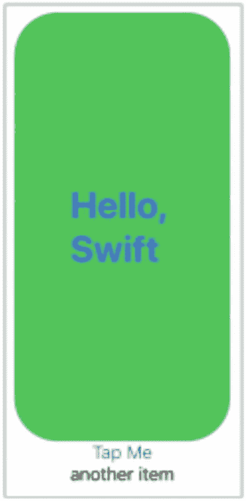

**图 3-3：** 按设计实现的用户界面

5. 试试看！运行它并点击按钮以查看输出。

### 本练习中我们做了什么？

在一个现有（或新建）项目中，我们添加了一个按钮。为了创建按钮，我们使用了带有两个参数的 `Button` 结构体初始化器。

第一个参数是不接受参数且无返回值的闭包（内联或方法名）。第二个参数实现了 `View` – 这是按钮的可视化部分。我们使用了 `Text`，正如我们在前一章中看到的，它满足了这个要求。

预览显示我们的新按钮，并且执行代码允许我们点击该按钮并查看输出。很简单！

**额外提示**：我鼓励你尝试使用按钮上的各种修饰符。你可以将修饰符应用于按钮本身或第二个参数的 UI 项（在我们的例子中是 `Text` 项）。看看旋转效果 (`.rotationEffect`) 做了什么 – 你可以使用 `.degrees` 来创建需要传入的角度。

### 按钮参数

我们看到一个 `Button` 接受两个参数：`action` 和 `label`。`Action` 是点击按钮时要执行的代码的闭包。`Label` 是一个返回要在 `Button` 上显示的 UI（实现了 `View` 协议的内容，通常是 `Text` 或 `Image`）的闭包。

接下来我们看看 `Image`。

## 图像

另一个常见的用户界面项是用于显示图像的东西。在 UIKit 中，它是 `UIImageView`。在 SwiftUI 中，它被命名为 `Image` 并实现了 `View` 协议。就像 `Text` 或 `Button` 项一样，`Image` 可以作为 `View` 返回类型返回。

### SF Symbols

要显示图像，我们首先输入 `Image`。之后我们有几个选项，包括提供 `name`（来自 Assets 目录的图像文件名）和 `systemName`（在此处查看关于 SF Symbols 的更多信息：[`developer.apple.com/design/human-interface-guidelines/sf-symbols/overview/`](https://developer.apple.com/design/human-interface-guidelines/sf-symbols/overview/)）。

让我们使用系统名称 `camera` 创建一个 `Image` 项。

#### 添加一个图像

在本练习中，我们将使用 `Image` 结构体向我们的用户界面添加一个图像。这就像我们之前看到的项一样，实现了 `View` 协议。

1. 打开一个项目（新建或现有），点击 `ContentView.swift` 文件进行编辑。我使用上一个练习中的现有代码。

2. 在 `body` 属性的底部添加一个 `Image` 项，使用接受系统图像名称的初始化器。传入 `camera` 作为参数值。代码应如下所示：

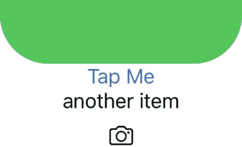

**图 3-4：** 用户界面中的相机图像

3. 如有需要，恢复预览并验证图像已显示（图 3-4）。

```
Image(systemName: "camera")
```

你的 UI 现在应显示一个图像。如果你使用了现有代码，你的 UI 应将图像放在其他可视化元素的下方。

可以随意添加更多 `Image` 项并使用其他系统图像名称。将一个图像添加到你的 `Assets.xcassets` 目录，并用如下代码显示它：

```
Image("brainwashIcon")
```

你可能还想设置其尺寸。使用 `Resizable` 修饰符，然后使用 `Frame` 修饰符来设置尺寸：

```
Image("brainwashIcon")
.resizable()
.frame(width: 100, height: 100,
alignment: .center)
```

另外，尝试使用各种修饰符。查看 `Color Invert` 修饰符 (`.colorInvert()`)。注意 `Image` 有一些初始化器接受其他值，包括 `Text`。看看它们会做什么！

### 图像创建

显示图像的核心能力基于指定要显示哪个图像。我们使用一个系统名称（SF Symbols）创建了一个图像。你也可以使用来自 Assets 目录的图像名称创建图像。还有其他选项和修饰符可用于自定义外观。


## 开关

`Toggle` 是展示 SwiftUI 声明式特性的绝佳示例。创建开关时，我们不会使用 "Switch" 或 "UISwitch"。而是直击本质，以声明式的方式说明"要做什么"，而非关注"如何做"。因此我们使用 `Toggle`。

使用 toggle 这个术语告诉系统我们想要做什么：为用户提供一个开/关类型的控件。这里可以看到一个接受两个参数的初始化器（图 3-5）。

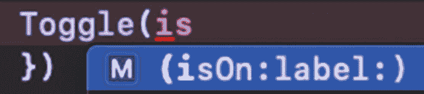

图 3-5：Toggle 自动补全

该声明展示了初始化器的更多细节：

```
public init(isOn: Binding,
@ViewBuilder label: () -> Label)
```

第一个参数是开关的初始状态：开或关。但请注意，它不仅仅是一个 `Bool`。参数类型是 `Binding`，指定所使用的泛型是 `Bool`。

第二个参数与 `Button` 类似，是一个名为 `Label` 的泛型。`Toggle` 代码定义了这个泛型必须遵循 `View` 协议。

### 绑定

我们将在后续章节中深入探讨其工作原理。现在，只需理解它是将传入的参数绑定到 UI。因此，如果属性（例如 `isReady`）的值发生变化，`Toggle` 也需要相应更新。

此外，如果 `Toggle` 需要更新，那么 UI 也需要更新，以便重新创建并重新显示。

因此，`Toggle` 和属性是绑定在一起的。当一方改变时，另一方也随之改变。

我们像这样声明属性：

```
@State private var isReady : Bool = false
```

### `@State` 属性包装器

为了将我们的属性 `isReady` 绑定到 UI 元素，我们需要使用 `@State` 属性包装器。这为我们完成了以下几件事。

它为属性创建了一个包装器。因此，虽然 `isReady` 被设置为 false，甚至被声明为 `Bool` 类型，但访问它时需要通过包装器。实际上，如果在执行期间深入查看 `isReady`，你会看到类似图 3-6 所示的内容。

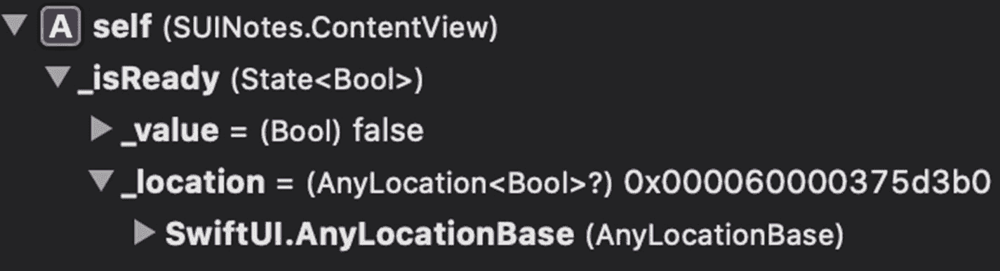

图 3-6：调试器中的属性包装器

注意类型是 `State<Bool>`。值存储在其下方。此外，位置显示为 `SwiftUI`。这是因为 UI 负责存储和管理该值。

`@State` 旨在为特定于某个视图的值创建"数据源"。这就是为什么我们也看到它被标记为 `private` —— 它仅用于此视图。这是推荐的做法。

要在 UI 中创建绑定，例如为我们的 `Toggle`，需要在属性前加上 `$` 前缀（例如 `$isReady`）。在其他情况下，比如检查值或以编程方式设置值，则像往常一样操作（例如，有点像可选类型：`isReady = true`）。

这里需要理解的关键点是，我们不是通过 `Toggle` 上的操作来设置值，而是绑定值。因此，我们将自己的值交给了 `Toggle` 来更新。此外，如果值通过其他方式发生变化，`Toggle` 会在视觉上得到更新。

### Toggle 标签

第二个参数是一个标签。这基本上与我们之前在 `Button` 中看到的一样。第二个参数是要显示的内容。在这种情况下，它显示在 `Toggle` 旁边，而不是像 `Button` 那样显示在上面。

如果你查看 `Label` 参数的声明，你会看到这样一条注释：

```
一个描述切换 `isOn` 效果的视图。
```

这太棒了！它让我们能够利用现有元素的定义和外观。如果标准 `Toggle` 日后发生更改或用于其他设备，它可以根据该系统进行适配。如果你是为 iPhone 设计的，但后来要为 Apple Watch 构建，UI 会自动适配。

我们只需声明我们想要什么（即 `Toggle`），并将其绑定到它所代表的属性（即 `isReady`），以及我们想要显示的任何描述切换效果的 UI（例如 `Text`）。

我们真正想要提供的是与开关一起用来描述其功能的东西。那么……让我们……

## Toggle 练习

在本练习中，我们将向 UI 添加一个 `Toggle`。它将绑定到一个属性，因此我们将把它作为 `isReady` 添加到 `ContentView` 中，该属性将是一个 `Bool`。

1. 打开一个项目（现有或新建），点击 `ContentView.swift` 文件进行编辑。

2. 在 "`var body...`" 属性行上方添加一个属性：

   ```
   @State private var isReady = false
   ```

   这将为 `isReady` 的 `Bool` 值创建一个属性包装器，初始值为 false。

3. 编辑 `body` 计算属性，并在返回值的底部添加一个 `Toggle`。它有两个参数：

   - `isOn` – 传入 `isReady` 的绑定，使用 `$isReady`
   - `label` – 传入一个 `Text` 项，用于在 `Toggle` 上显示。你的 Toggle 代码可能如下所示：

     ```
     Toggle(isOn: $isReady,
     label: {
         Text("Ready: " + (isReady ? "Yes" : "No"))
     })
     ```

   在这种情况下，`Text` 还会指示该设置的值。在实际应用中这可能是多余的，但就我们目前的目的而言，这是对值的验证。

   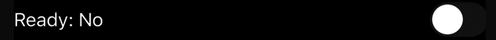

   图 3-7：Toggle 设置为关/False

4. 运行你的应用，并验证初始时 Toggle 处于关闭状态，因为 `isReady` 为 false（图 3-7）。

   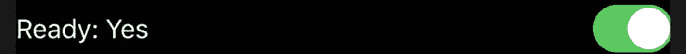

   图 3-8：Toggle 设置为开/True

5. 将 Toggle 打开，并验证 `Text` 元素已更新，包含 "Yes"（如果你定义了类似于上面的 `Text` 元素）（图 3-8）。

6. 添加一个 `Button`（或修改现有的 `Button`），并在按钮被点击时切换 `isReady` 的值。

7. 运行应用，并验证当按钮被点击时，UI 会根据切换后的值进行更新。

希望你能轻松完成这个练习，并看到相同乃至更多的结果！

### 当前代码

以下是我在完成所有这些练习后，`body` 属性的当前代码，其中包括我资源目录中一个 png 文件的 `Image`：

```
var body: some View {
    VStack {
        Text("Hello, Swift")
            .font(.largeTitle)
            .fontWeight(.bold)
            .foregroundColor(Color.blue)
            .padding(30.0)
            .frame(width: 200.0, height: 400.0)
            .background(Color.green)
            .cornerRadius(40.0)
        Button(action: {
            print ("tapped!")
            self.isReady.toggle()
        }, label: { Text("Tap Me") })
        Text("another item")
        Image(systemName: "camera")
        Image("brainwashIcon")
            .resizable()
            .frame(width: 100, height: 100, alignment: .center)
            .colorInvert()
        Toggle(isOn: $isReady,
               label: {
                   Text("Ready: " +
                       (isReady ? "Yes" : "No"))
               })
            .padding([.leading, .trailing], 100.0)
    }
}
```

图 3-9 展示了它在预览中的样子。

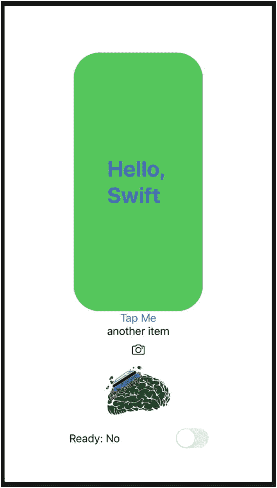

图 3-9：画布中的当前 SwiftUI 代码

几点值得注意：

- `Button` 操作会打印 "tapped!" 并切换 `isReady` 的值。
- 第二个 `Image` 项上有三个修饰符。`resizable` 修饰符的输出上调用了 `.frame`。
- 我还在同一个 `Image` 上调用了 `.colorInvert`。这可以在 `Image` 上调用，但其返回类型不响应 `.resizable()`。在某些情况下，顺序很重要。
- `Toggle` 对 `isOn` 值使用了绑定，但除此之外，`isReady` 被视为普通属性。
- 我在 `Toggle` 上使用了 `.padding` 使其远离边缘。


## TextField

另一个非常常见的控件是 `TextField`。它允许用户输入姓名、电子邮件、电话号码、密码或其他基于文本的值。

还有其他用于用户输入的 UI 控件，但我们已经介绍过的控件加上 `TextField` 可能是最广泛使用的。

如果我们打开视图库（右上角的 + 按钮，见图 3-10）或使用快捷键 ⌘⇧L，我们可以添加一个 `TextField`。

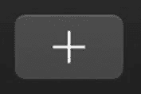

**图 3-10** — 对象库按钮

接下来，搜索“text”，我们会看到 `Text` 和 `TextField` 条目。然后，我们可以通过预览窗格（图 3-11）将 `TextField` 拖入我们的 UI。

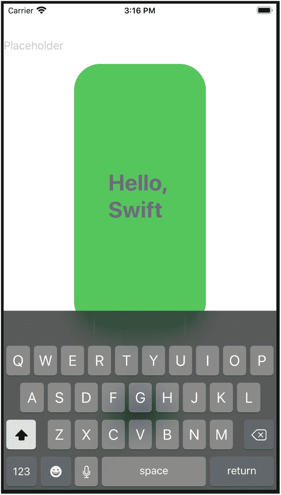

**图 3-12** — 用户界面中的 `TextField`

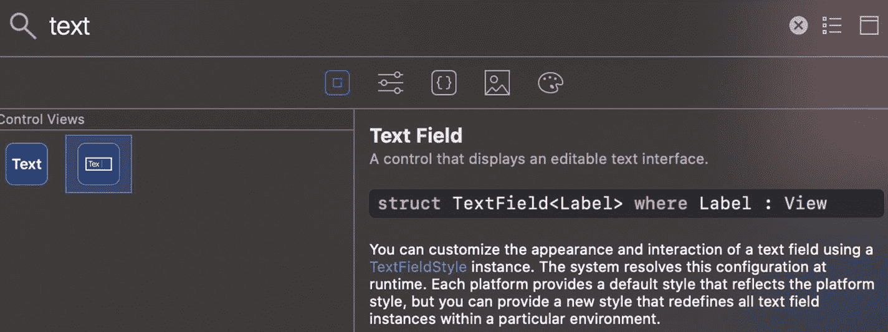

**图 3-11** — 对象库中的 `TextField`

代码会根据 UI 元素拖放的顺序更新，包含以下内容：

```
TextField("Placeholder", text:Value)
```

这个 `Value` 是一个占位符。如果你在其他编辑器中查看 `.swift` 文件，你会看到其中包含一些 Xcode 的标记语言。这个 `Value` 占位符会解析为一个空字符串（`""`）。在这种情况下，你实际上可以直接编译并运行此代码而无需任何修改：

```
TextField(/*@START_MENU_TOKEN@*/"Placeholder"/
*@END_MENU_TOKEN@*/, text: /*@START_MENU_TOKEN@*//
*@PLACEHOLDER=Value@*/.constant("")/
*@END_MENU_TOKEN@*/)
```

我将 `TextField` 放在了 `VStack` 的顶部，这样键盘就不会遮挡它（见图 3-12）。

我想做几件事让这个 `TextField` 更符合我们的预期。首先，我想替换占位符文本。我会将占位符改为类似“Name”、“Email”或类似的内容。其次，我想添加一些内边距使其离两侧稍远一点。最后，我想将属性值绑定到文本上。

这种绑定与 `Toggle` 非常相似。我们将创建一个带有 `@State` 属性包装器的 `String` 属性。然后使用 `$` 前缀将其绑定到 `TextField` 的 `text` 参数。

让我们把它作为一个练习来尝试。我会列出要做什么，你试试看能否不按步骤完成……

### 添加一个 `TextField`

以下是此练习的目标列表。首先，试着不看步骤完成这些目标。无论你是否完成，准备好后查看下面的详细步骤。

目标：

1. 打开你正在进行的项目（或创建一个新项目）。
2. 在 `ContentView` 结构体中添加一个属性。它应该满足：
    - 带有 `@State` 属性包装器
    - 声明为 `private`
    - 是一个变量
    - 类型为字符串
    - 命名为 `username`
    - 默认值为空字符串（`""`）
3. 从视图库中拖入一个 `TextField`。
4. 将 `TextField` 的占位符设置为“Username”。
5. 将 `TextField` 初始化器的 `text` 参数设置为 `username` 属性的绑定。
6. 为 `TextField` 添加内边距，值为 30。
7. 奖励：在另一个 UI 元素上使用 `.disabled(Bool)` 修饰符。传入的 `Bool` 值为 `self.username` 的长度是否为 0（即，如果没有用户输入，则禁用其他控件）。

希望你没有遇到太多困难就完成了这个练习。我们正在将越来越多的项目和概念组合在一起。我们将继续在此基础上逐步构建。

根据你的起点，你的 UI 可能类似于图 3-13。

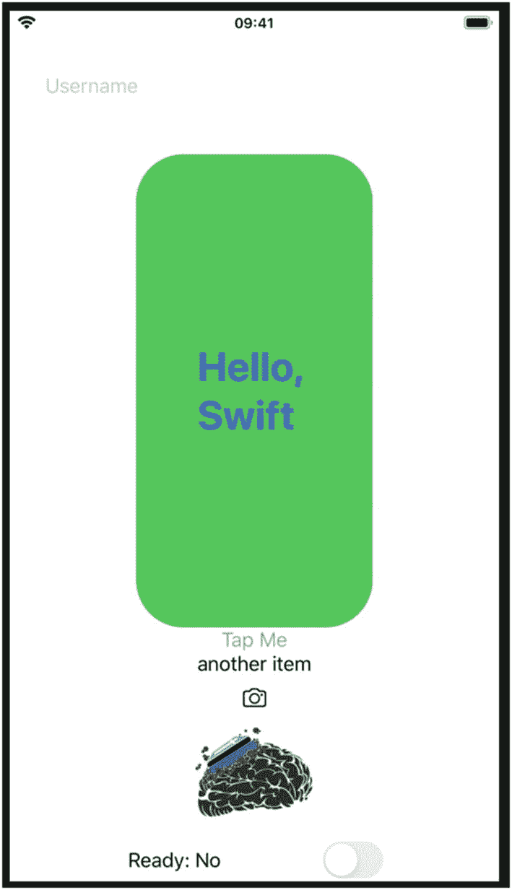

**图 3-13** — 练习的起始 UI

它看起来实际上与一个毫无意义的 `TextField` 没有太大区别。但我们知道，在幕后，它绑定到了 `username` 属性。因此，如果该属性发生变化，我们的 `TextField` 需要更新，整个 UI 将重新渲染。

另外请注意，“Tap Me”按钮是禁用的。这是因为 `username` 的长度为 0。一旦用户在 `TextField` 中输入内容（或者 `username` 值以其他方式变为非空），该按钮将启用。

以下是详细步骤：

1. 像这样添加属性：

```
@State private var username = ""
```

2. 打开视图库（⌘⇧L），搜索“text”，并将其拖到预览画布上。代码应该如下所示：

```
TextField("Placeholder", text:Value)
```

3. 将“Placeholder”文本改为“Username”。
4. 将第二个参数（当前为“Value”）改为对 `username` 属性的绑定，如下所示：

```
TextField("Username", text: $username)
```

5. 使用 `.padding(30)` 添加内边距修饰符。
6. 在下方添加一个 `Text` 项，用于显示输入时的值。

```
Text(username)
```

7. 对于其他某个控件，添加 `.disabled` 修饰符。传入的 `Bool` 值为 `self.username.count == 0`。

最终代码应如下所示：

```
@State private var username = ""
var body: some View {
    VStack {
        TextField("Username", text: $username)
            .padding(30)
        Text("Hello, Swift")
            .font(.largeTitle)
            .fontWeight(.bold)
            .foregroundColor(Color.blue)
            .padding(30.0)
            .frame(width: 200.0, height:400.0)
            .background(Color.green)
            .cornerRadius(40.0)
        Button(action: {
            print ("tapped!")
            self.isReady.toggle()
        }, label: { Text("Tap Me") })
            .disabled(self.username.count == 0)
    }
}
```

要在实时预览中运行应用，请点击画布中 UI 上方的图标栏中的播放按钮（图 3-14）。

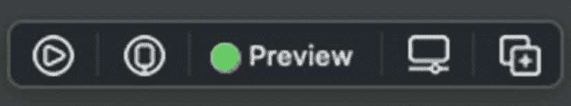

**图 3-14** — 画布中的按钮栏

如果你按照步骤操作，应该可以在 `TextField` 中输入内容，并在下方的 `Text` 项中看到相同的值（图 3-15）。

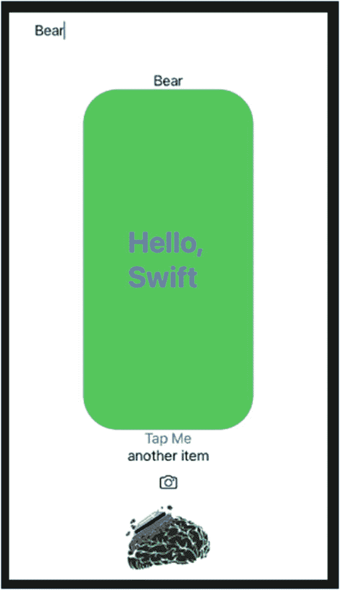

**图 3-15** — 练习的最终 UI

此外，“Tap Me”按钮只有在 `TextField` 中有文本时才应启用。

### 章节总结

我们在本章中探讨的每个控件在 SwiftUI 开发中都非常常见。熟悉它们及其修饰符非常重要。

随着我们覆盖更多内容，我们将看到一些控件如何组合和重叠，以及我们拥有的其他修饰符、手势、事件等。

我们还将介绍更多概念，例如来自 Combine 框架的绑定。`@State` 属性包装器和绑定只是其中的一小部分。这可能是一个新概念并且容易混淆，所以我们会循序渐进。但它也非常强大，是真正掌握 SwiftUI 的关键概念。

我想鼓励你对我们本章所做的一切进行更多练习。启动一个新项目，添加各种 UI 元素，探索修饰符，从视图库中拖入项目，并普遍练习我们所学的内容。

