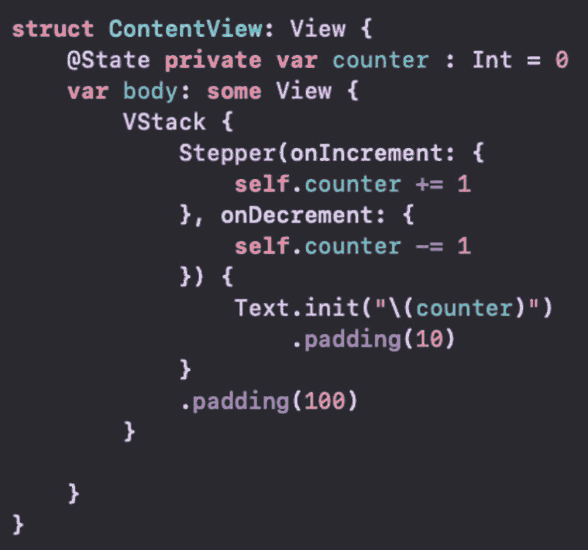
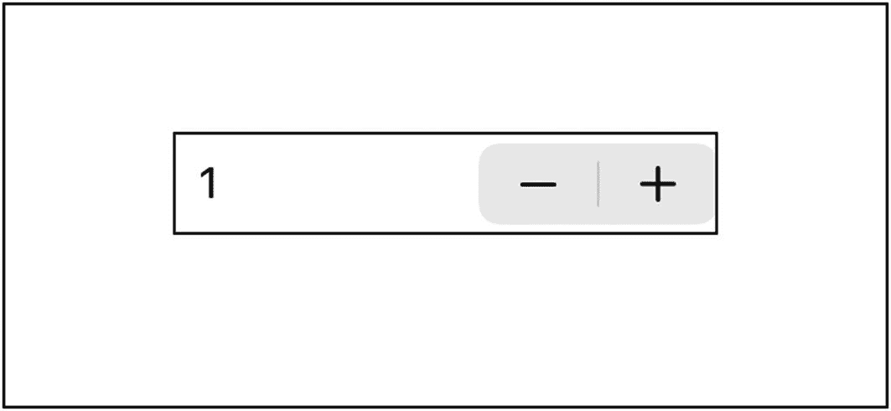
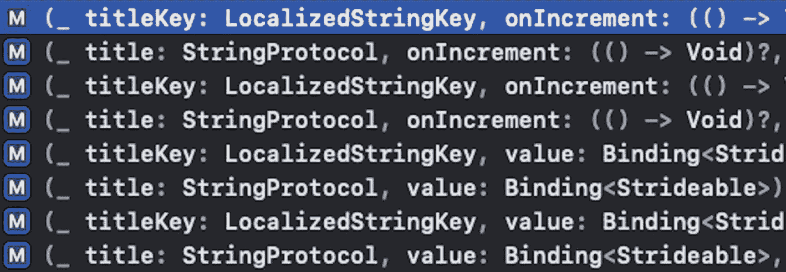
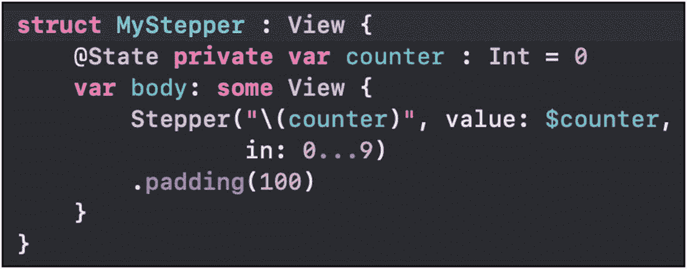
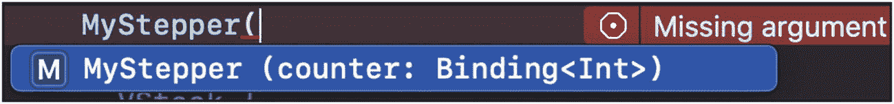
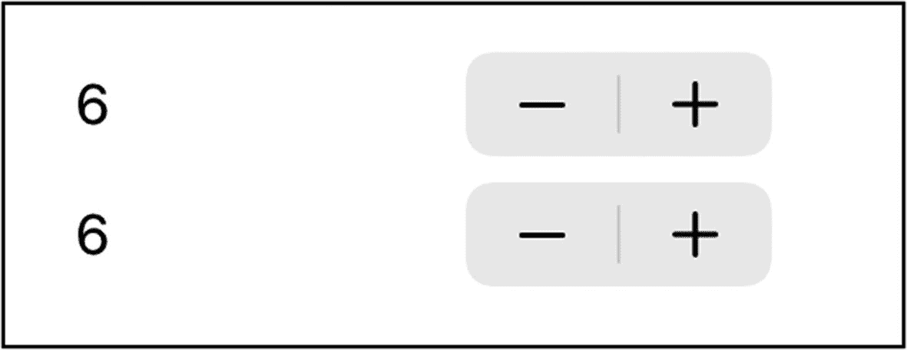
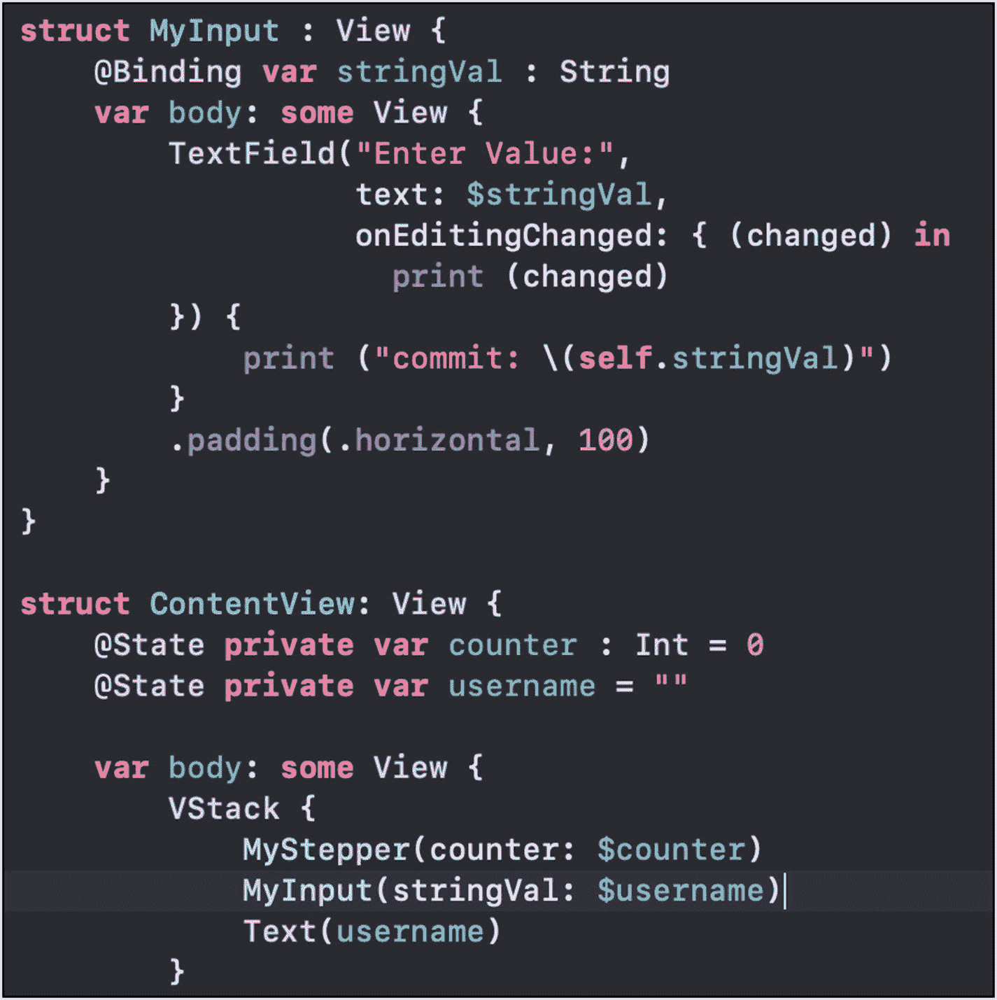
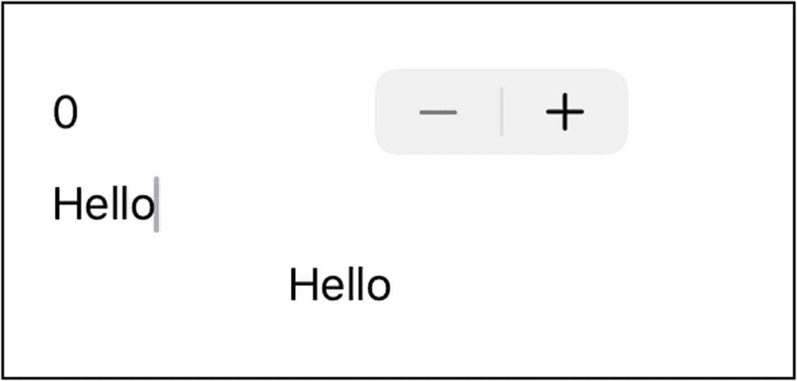

# 4. 绑定数据源

我们在上一章介绍了 `@State`。这里我们将简要回顾一下，并讨论更多关于 SwiftUI 中数据流的概念。


## 数据驱动 UI

在应用开发中，UI 通常代表数据与状态。当用户点击按钮或拨动开关时，事件会触发一个方法调用。在该方法中，我们通常编写用于更新当前数据的代码。

上一章中，我们了解了如何使用 `@State` 为切换开关指定数据源。通过将 `isReady` 布尔变量绑定到开关，我们发现拨动开关会更新该值。这一点通过标签文本的更新得到了验证。

同时，更改数据源（即 `isReady`）的值也会触发 UI 重新渲染。这包括让开关反映来自数据源的新布尔值。

通过属性包装器（Property Wrapper），将此数据源（值）与 UI 绑定，可使两者自动保持同步。

## 流程步骤

上述过程包含几个步骤。这些步骤对用户和开发者来说大多是后台自动完成的。

让我们再次快速查看状态变量和绑定的代码：

```
@State private var isReady = false
Toggle(isOn: $isReady,
label: {
Text("Ready: " + (isReady ? "Yes" : "No"))
})
```

`isReady` 变量是`Toggle`的数据源。当其值变化时，UI 会重新渲染，这会导致开关以及`Text`标签都得到更新。

该过程的步骤如下：

1. 用户操作 – 点击开关。
2. 值更新 – `isReady` 被切换。
3. 视图更新 – `Toggle`和`Text`发生变化。
4. UI 显示 – 界面在屏幕上渲染。

每当绑定的属性发生变化时，UI 就会在屏幕上渲染出更新后的内容。框架负责管理这种依赖关系。

我们来看看如何使用`Stepper`（步进器）。`Stepper`可以接受多个闭包——一个用于处理用户点击减号(`-`)递减，一个用于处理点击加号(`+`)递增。以下是一个使用`Stepper`对属性进行增减的示例（图 4-1）。



**图 4-1** Stepper 代码

在这个例子中，我们有一个`Stepper`和一个显示当前计数的标签。由于`Stepper`是唯一的 UI 元素，它不需要放在`VStack`中。但假设后续会添加更多 UI 元素，那么很可能在某个时候需要某种形式的堆栈。应用运行时，界面如图 4-2 所示。



**图 4-2** Stepper UI

然而，我们无需在闭包中编写值更改的逻辑，而是可以直接将计数器属性绑定到`Stepper`上。

### UI 中的计数器更新

在本练习中，我们将添加代码，将一个`@State`属性绑定到`Stepper`上。这将使用一个不同的初始化器。我们需要的初始化器接收要绑定的值。



**图 4-3** Stepper 初始化器

1. 打开一个项目（现有或新建），点击`ContentView.swift`文件进行编辑。我们从一个空的`ContentView`的 body 定义开始。
2. 创建一个`Stepper`实例，并注意代码补全的选项（图 4-3）。

之前的示例使用了第一个初始化器。它接受两个闭包和一个标签参数。这次，我们将使用接受`StringProtocol`类型、一个值和一个范围的初始化器。该范围是`Stepper`值的闭区间数字。

代码如下所示：

```
Stepper("\(counter)", value: $counter, in: 0...9)
```

这段代码为我们做了几件事：

1.  在`Stepper`旁边显示当前的计数器值。
2.  将计数器作为数据源绑定到`Stepper`的值上。
3.  将`Stepper`的值限制在 0 到 9 之间。

UI 看起来与之前几乎相同。功能也一样。但是，我们不再需要在代码中维护计数器值的更新逻辑。

框架为我们完成了更新状态并在 UI 中渲染变更的工作。

## 可步进类型 (Strideable)

你可能已经注意到，初始化器的 value 参数接受一个`Binding`类型。这就是为我们管理`@State`值的属性包装器。

`Binding`是一个包装值的结构体。被包装的值必须遵循`Strideable`协议。`Strideable`扩展了`Comparable`协议，而`Comparable`又扩展了`Equatable`协议。

因此，值属性必须实现以下所有方法：

*   `==` (`Equatable`)
*   `<` (`Comparable`)
*   `<=` (`Comparable`)
*   `>` (`Comparable`)
*   `>=` (`Comparable`)
*   `distance(to other: Self) -> Self.Stride`
*   `advanced(by n: Self.Stride) -> Self`

相等性比较和比较运算符非常直观。`distance`和`advanced`函数来自`Strideable`协议。

`distance`函数接收一个与`@State`绑定变量相同类型的值（例如，在我们的例子中是`Int`），并返回与另一个值之间的“距离”。`Int`是遵循`Strideable`的，所以 `5.distance(to: 100)` 返回 `95`。

`Strideable` 有一个关联类型 `Stride`，它被定义为实现了 `Comparable` 和 `SignedNumeric` 的类型。因此，从 `distance` 返回 `Self.Stride` 将是一个数字。对于 `Int` 的 `Strideable` 实现，`Stride` 类型也是 `Int`：

```
public typealias Stride = Int
```

`advanced` 函数返回与其被调用值相同的类型（例如，在 `Int` 上调用 `advanced` 返回一个 `Int`）。它接收一个 `Self.Stride` 参数，该参数同样由该类型定义。所以对于 `Int`，调用 `advanced` 需要传入一个 `Int`，并返回一个按该值递增后的 `Int`。因此 `5.advanced(by: 5)` 返回 `10`。

我们的计数器属性是一个 `Int`，它实现了所有这些方法，并且完全适用于我们的值参数。其他 Swift 数值类型如 `Double`、`Float` 和 `Decimal` 也实现了 `Strideable`。

其他控件也使用绑定，但 `Binding` 包装的类型可能是其他类型。例如，`Textfield` 接受一个包装 `String` 的 `Binding`。这是我们熟知的一种类型！

## 属性包装器 (Property Wrapper)

`@State` 属性包装器背后的类型是 `Binding`。如果你深入研究其定义，你会发现它是一个结构体，泛型参数 `Value` 即它所包装的值。和可选类型类似，它定义了各种初始化器、函数和扩展。

然而，由于我们将让框架来管理属性包装器的内存和处理，我们通常除了进行绑定之外，无需做其他事情。后续的值的包装和解包都将由系统处理。我们可以设置值（或者让 UI 元素来设置），剩下的工作就由系统代劳了。


### `@Binding`

另一个用于绑定的指令是`@Binding`。这允许你指定另一个对象中的属性，以绑定到传入的内容。

我们可能希望将一个或多个 UI 元素提取到单独的结构体中。这样可以在整个代码中重用。但我们也可能希望该值基于使用我们新元素的上下文进行绑定。

例如，如果我们想要像练习中设计的那样实现步进器控件，我们可以这样做。我们只需要创建一个实现`View`协议的新结构体，并将步进器控件放入其中，如图 4-4 所示。



**图 4-4**  
MyStepper 结构体

这里，我们有一个名为`MyStepper`的新结构体。它可以位于同一个文件或另一个文件中。在我们原始的`ContentView`中，可以通过`MyStepper()`在 UI 中包含此结构体，以替代我们之前的步进器代码。

你可以像使用`Button`、`Text`或其他任何视图一样，在代码中包含任意数量的此类自定义视图类型。这有助于编写更清晰、更易于维护的代码，并且非常适合复用。

然而，在图 4-4 中，我们将计数器作为本地属性。我们真正想要的是能够将计数器基于外部数据源。

`@State`适用于给定结构体内部。在这种情况下，数据源位于`MyStepper`实现之外。为此，我们使用`@Binding`指令。

因此，我们将`@State`替换为`@Binding`，从这样：

```
@State private var counter : Int = 0
```

变成这样：

```
@Binding var counter : Int
```

我们不需要提供默认值，因为它将在创建`MyStepper`时传入。注意，它不再是私有的，因为它需要被外部访问。Swift 中的结构体会自动生成一个成员逐一初始化器。在我们的例子中，这个初始化器包含`counter`值。因此，创建`MyStepper`时的代码补全看起来像图 4-5 所示。



**图 4-5**  
带有`counter`参数的 MyStepper 初始化器

该属性的类型是一个`Binding<Int>`（属性包装器）。就像使用可选类型一样，我们可以直接传入类型（`Int`）。在我们的代码中，可以像这样传入原始的`counter`属性：

```
MyStepper(counter: $counter)
```

现在，我们的`counter`属性作为属性包装器传入`MyStepper`并由系统管理。通过`MyStepper`更改值会更新我们本地的`counter`属性。

如果我们想要两个步进器呢？我们可以像添加第一个一样，精确地添加第二个`MyStepper`。

如果我们将`counter`绑定到这两个步进器，会发生什么？试试看。提示：使用`VStack`或类似容器来对`MyStepper`实例进行分组。

```
MyStepper(counter: $counter)
MyStepper(counter: $counter)
```

由于两个`MyStepper`实例绑定到同一个值，它们都会更新同一个数据源。更新其中一个将会改变另一个的值。UI 渲染将反映这些变化，如图 4-6 所示。



**图 4-6**  
具有相同绑定的 MyStepper 实例

我将内边距改为仅在水平方向上，以使它们更靠近。除此之外，UI 符合预期：两个`MyStepper`通过同一个绑定保持同步。

那么文本输入框（`TextField`）的绑定呢？如前所述，`TextField`使用`String`而不是数值。这有什么不同吗？从表面和实践来看，并无区别。参数类型不再是`Binding<Strideable>`，而是`Binding<String>`。

让我们尝试创建另一个包含`TextField`的视图类型，并从`ContentView`进行绑定。

**文本输入结构体**

在这个练习中，我们将在 UI 中添加一个`TextField`。我们将创建另一个名为`MyTextInput`的结构体（可以在同一个文件或另一个文件中）。它需要一个文本输入框和一个用于绑定的属性。

创建一个名为`MyInput`的新结构体（在同一个文件或另一个文件中），如下所示：

```
struct MyInput : View {
}
```

它需要包含两部分：计算属性`body`和在创建时用于绑定的属性。

在结构体声明下方添加绑定属性，如下所示：

```
@Binding var stringVal : String
```

现在，在其下方开始编写`body`属性，如下所示：

```
var body: some View {
}
```

使用至少包含标题和绑定的`TextField`元素来充实`body`属性，如下所示：

```
TextField("Enter Value:",
text: $stringVal,
onEditingChanged: { (changed) in
print(changed)
}) {
print("commit: \(self.stringVal)")
}
```

注意，这里提供了多个初始化器可供选择。其中包括一些带有闭包的初始化器，用于处理编辑状态的变化（开始编辑和结束编辑）。这个`onEditingChanged`闭包接受一个`Bool`参数，其中`true`表示值正在被编辑，`false`表示编辑结束。

另一个闭包是`onCommit`，当用户点击回车键时被调用。

可选地为元素添加一些内边距，以匹配`MyStepper`的外观。

```
.padding(.horizontal, 100)
```

在`ContentView`中添加一个`String`属性，用于绑定到`MyInput`。

```
@State private var username = ""
```

在 UI 中，将带有`String`属性的`MyInput`添加到`MyStepper`下方。

```
MyInput(stringVal: $username)
```

在 UI 中，在`MyInput`下方添加一个显示该`String`属性的`Text`元素。

```
Text(username)
```

代码（不包括`MyStepper`部分）应类似于图 4-7 所示。



**图 4-7**  
MyInput 结构体及更新后的 ContentView body 属性

UI 应类似于图 4-8 所示，文本输入框中的文本会显示在`Text`标签中。



**图 4-8**  
包含 MyStepper、MyInput 和 Text 的 UI

我们可以看到，可以通过从创建它们的元素处进行绑定，来创建额外的 UI 元素。当然，我们也可以将多个 UI 元素绑定到我们创建的同一个绑定。

### 章节总结

在本章中，我们回顾了在给定结构体中使用`@State`作为属性包装器的概念。使用内置 UI 元素来管理和同步值可以减少编码工作，并避免因数据未同步而产生的 bug。

我们还了解了数值类型的绑定如何与`Binding`结构体及其`Strideable`和`Stride`类型配合工作。同时，我们对`TextField`使用了`String`类型的绑定。

`@State`和`@Binding`有助于将值保存在单一数据源中。无需复制、更新或同步值。当用户更新其输入时，这些值会自动更新，UI 会重新创建，渲染显示出新的状态。

让框架为我们完成这些工作，可以减少编码时间和代码量。同时，代码也更具可维护性，并能受益于框架未来的更新。

我希望你同意，以这些方式使用绑定是简化 UI 及其与相关值之间关系的良好开端。

我们将在后续内容中继续构建这些概念。我鼓励你练习我们所学的内容，并探索更多选项。尝试其他 UI 元素，如`Slider`、`Button`、`Toggle`、`Image`等。


