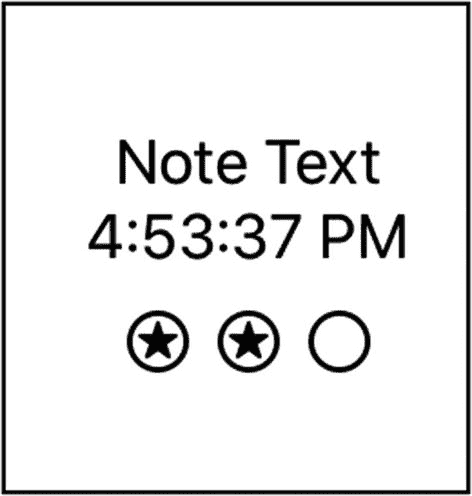
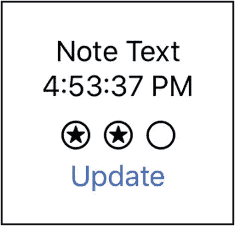
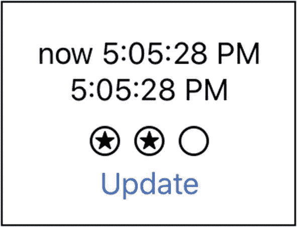
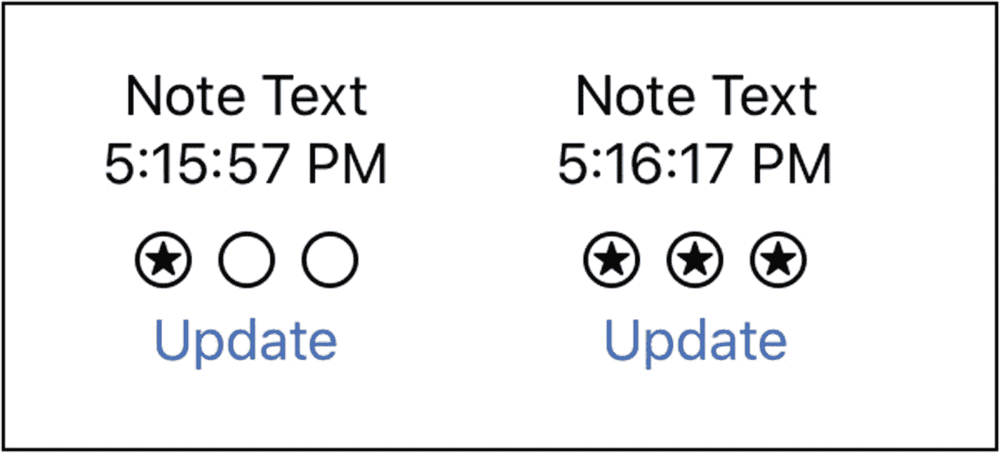

# 5. 可观察对象

在前面的章节中，我们使用了独立的属性来存储值。但在实际开发中，我们通常会遇到更复杂的模型。我们通常需要处理包含多个属性、用于表示数据的结构体或类。

在本章中，我们将探讨如何观察引用类型对象的属性更新。当属性发生变化时，用户界面将收到通知并进行更新。

为了实现这一点，我们将使用 Combine 框架的部分功能。我们会在后面的章节中更详细地介绍该框架。现在，我们只需了解它如何满足我们绑定的需求。

我们将继续在 `SUINotes` 项目中进行开发。我们会在现有代码中添加一些新对象。对于 `ContentView` 结构体，我们将移除当前的属性和 body 实现，然后重新开始。

## 典型模型

我们都熟悉结构体和类。下面是一个表示笔记对象的典型类：

```
enum Priority : Int {
case low, medium, high
}
class Note {
var text = ""
var updateAtTime = Date()
var priority = Priority.medium
}
```

这里，我们定义了一个 `Note` 类，它包含三个属性，类型分别为 `String`、`Date` 和 `Priority`。`Priority` 被定义为一个枚举，包含 low、medium 和 high 三个值。它还有一个底层类型 `Int`，因此 low、medium 和 high 分别映射到 0、1 和 2。这有助于进行优先级值的比较。

另外，`Note` 的所有属性都有默认值，所以我们不需要定义初始化器。

我们希望在用户界面上显示笔记对象的内容，因此需要一个 `Note` 实例。由于 `Note` 类包含一个 `Date` 属性，我们还需要创建一个 `DateFormatter`。

在移除所有之前的属性后，`ContentView.swift` 中的 `ContentView` 结构体属性如下所示：

```
struct ContentView: View {
var note = Note()
var df = DateFormatter()
...
```

但是我们需要为 `df` 实例设置样式。为此，我们将为 `ContentView` 创建一个初始化器。它看起来像这样：

```
init() {
df.dateStyle = .none
df.timeStyle = .medium
note.text = "Note Text"
}
```

注意，我还将 `note.text` 属性设置为一个非空字符串值。这样，用户界面上就有内容可以显示了。

显示 `Note` 实例的内容相当简单。我们可以使用两个 `Text` 项来显示文本和 `createdAt` 属性。`DateFormatter` 会为我们的 `Date` 生成一个格式美观的 `String`。

### 构建笔记界面

在本练习中，我们将按照当前定义的方式来构建显示模型的用户界面。这包括两个 `Text` 项作为起始。

1.  如果尚未定义，请按前面所示定义 `Priority` 枚举和 `Note` 类。

2.  将 body 实现替换为 `VStack` 中的两个 `Text` 项：一个用于显示文本，另一个用于显示 `updatedAtTime`。

代码如下：

```
var body: some View {
VStack {
Text(note.text)
Text(df.string(from: note.updatedAtTime))
}
}
```

对于优先级，我们希望使用比纯文本更具视觉表现力的方式。让我们使用星形图像。SF Symbols 为此提供了多种选项。我们将使用 `star.circle` 图像。

3.  为优先级的 `star.circle` 图像添加一个 `HStack`：

```
HStack {
Image(systemName: "star.circle")
Image(systemName: note.priority.rawValue > 0
? "star.circle" : "circle")
Image(systemName: note.priority.rawValue > 1
? "star.circle" : "circle")
}
```

4.  运行应用程序 (`⌘+r`) 并验证用户界面是否按预期显示。

对于默认优先级为 `.medium` 的笔记，用户界面将如图 5-1 所示。



图 5-1 笔记界面

你可以随意调整用户界面，使其以不同的方式显示。这将是我们后续实现模型变化时更新用户界面的基础。

如果笔记发生变化，我们希望显示这些变化。这些变化可能是文本、日期或优先级。我们将为 `Note` 的文本和优先级属性添加观察者：

```
class Note : ObservableObject {
var text = "" {
didSet {
self.updatedAtTime = Date()
}
}
var updatedAtTime = Date()
var priority = Priority.medium {
didSet {
self.updatedAtTime = Date()
}
}
}
```

每当文本或优先级发生变化时，`updatedAtTime` 也会随之更新。

让我们添加一个按钮来更新笔记的文本：

```
Button(action: {
let newTime = self.df.string(from:Date())
self.note.text = "now \(newTime)"
print(self.note.text)
}) {
Text("Update")
}
```

现在用户界面如图 5-2 所示。



图 5-2 带更新按钮的笔记界面

我还会打印出新的文本值，以验证它是否正在更新。

如果我们运行它，会看到输出显示 `updatedAtTime` 被设置为当前时间（例如，“now 4:53:39 PM”），但用户界面并没有更新。这是为什么呢？

## 绑定？

你可能认为这是因为没有绑定到该值。确实如此。然而，与 `Toggle` 或类似控件不同，`ContentView` 并没有一个需要传递的值。更重要的是，`Note` 可能由其他对象创建并传入 `ContentView`。

如果你在处理现有代码库，模型可能已经定义并实现了。我们不想开始要求类变成结构体，某些值带有 `@Binding` 并被传入，可能还需要新的初始化器等等。

不，相反，我们希望尽可能少地改动模型。

## 观察引用对象

这就是 Combine 框架的用武之地。我们稍后会花更多时间研究它。现在，我们只需要理解它可以用于发布更新。

当你拥有可以在整个代码中传递的**引用类型**时，这非常有用。它可能在你不知情的情况下随时发生变化。但是通过使用 `ObservableObject`，你的用户界面可以保持最新状态。

当我们研究 `State`/`Binding` 时，数据源位于我们的 `ContentView` 中。我们使用属性包装器将该值传递给另一个对象。变化发生在其他代码中，但数据源仍然是源并得到更新。

对于绑定对象，情况实际上是相反的。相关的对象是数据源，我们想知道何时发生了变化。怎么做呢？

`ObservableObject` 协议就是答案。在我们的例子中，就是 `Note` 类——这也是我们使用类对象来表示 `Note` 的部分原因。它需要是一个引用类型。

## ObservableObject 协议

`ObservableObject` 协议继承自 `AnyObject` 协议。这意味着它只能由类（而不是结构体或枚举）实现。

因此，让我们声明 `Note` 类遵循 `ObservableObject`。首先，我们需要在文件顶部导入 Combine 框架：

```
import Combine
```

然后，我们像这样更新 `Note` 类代码：

```
class Note : ObservableObject {...
```

注意，你不会收到任何警告或错误。这总是件好事。`ObservableObject` 中没有必需的、同时又没有提供默认实现的东西。

对 `Note` 的更改需要发布，并且系统已经为我们创建了一个默认的发布者！

我们还需要修改 `ContentView` 中的 note 属性。这里我们将像使用 `State` 和 `Binding` 一样使用另一个属性包装器。它叫做 `ObservedObject`，我们需要像这样将它添加到我们的 note 属性上：

```
@ObservedObject var note = Note()
```

我们已经告诉编译器，`Note` 类是可观察的。当然，没有人强制要求观察它。我们的 `ContentView` 想要观察它，并且已经如此声明了。现在只差最后一步了。


### 发布更新

有两种简单的方法可以接收对`ObservedObject`上值变更的更新。这两种方法都由实现`ObservableObject`的对象控制。

这意味着`ObservableObject`控制着发布什么内容以及何时发布。

在我们的示例中，我们最关心的是`Note`中`text`属性的变化。我之前提过，`ObservableObject`对其所需的组成部分有默认实现。其中之一是一个发布器，属性名为`objectWillChange`。

利用这个默认发布器，我们可以在任何内容发生变化时发送新值。我们在`Note`的`text`属性上已经有一个`didSet`观察器。那是发布变更的理想位置。代码如下所示：

```
var text = "" {
    didSet {
        self.updatedAtTime = Date()
        self.objectWillChange.send()
    }
}
```

现在当我们点击更新按钮时，`text`和`updatedAtTime`的文本框都会更新。更新效果如图 5-3 所示。



**图 5-3**  
带有更新的 Note 界面

在发布器上调用`.send`无疑是发送更新的简便方法。当你只希望在关键时间点发布变更时，这种方法尤其出色。也许你想等到特定事件发生（比如写入数据库）之后才发布值。

你可能有一个类只在特定时间间隔发布更新。或者你可能只想在属性达到某个阈值或其他条件满足时才发布。在这些情况下，发布器上的`.send`调用非常有用。

在我们的例子中，我们希望每当设置新`text`值时都能发布。在`didSet`观察器中调用`.send`可以很好地满足这个需求。另一个针对属性所有变更的处理方式是使用`@Published`属性。

## @Published

属性上的`@Published`属性会创建一个该类型的发布器。我们可以将此属性添加到`Note`中的`text`属性上。同时，我们现在可以移除`didSet`观察器中对`.send`的调用。

在我们的示例中，结果将是相同的。在界面中点击更新按钮将更新`text`，随后发布该更新，界面也会随之更新。

现在的代码如下所示：

```
@Published var text = "" {
    didSet {
        self.updatedAtTime = Date()
    }
}
```

我们可能还想为其他属性添加`@Published`。在我们的示例中，发布`priority`是合理的。而发布`updatedAtTime`可能是最有意义的做法。这种情况下，如果代码编写得当，只要对象被更新，它就会发布。

让我们尝试点别的。

**用于更改优先级的定时器**

让我们修改`Note`类，使其在特定时间后自动创建优先级。我们将为`Note`添加一个带有`Timer`的`init`方法。当定时器触发时，每次会将优先级提升一级。

1.  将`Note`的默认优先级更改为`.low`：

2.  为`Note`类添加一个初始化器：

    ```
    init() {
    }
    ```

3.  在`init`中添加一个`Timer`，每隔 X 秒（例如 10 秒）触发一次并重复执行。`Timer`闭包的主体应将优先级提升一级。

    ```
    Timer.scheduledTimer(withTimeInterval: 10.0,
                         repeats: true) { (timer) in
        self.priority = Priority(rawValue:
            self.priority.rawValue + 1) ??
            Priority.high
        if self.priority == .high {
            timer.invalidate()
        }
    }
    ```

```
var priority = Priority.low {...
```

每 10 秒，定时器会触发一次。它会根据当前优先级的原始值加 1 来创建一个新的优先级。如果该数值过高，则默认为 `Priority.high`。

如果优先级设置为 `.high`，定时器将失效。我们可能希望保持定时器运行，以防用户将优先级设回较低级别。当前界面中没有此功能，因此暂时无需考虑。

1.  运行应用并验证优先级是否每 10 秒增加一次，直到变为高优先级。

第一个和最后一个结果应如图 5-4 所示。



**图 5-4**  
自动更新界面：初始和最终状态

通过这个练习，我们看到无论变更是由用户交互还是其他方式触发，这些变更都会被发布。

## 本章小结

使用 `ObservableObject` 协议允许引用类型对象发布其更改。你可以通过少量修改，让新的或现有的模型类实现 `ObservableObject`。

这使得对现有代码的改动非常微小。如果你曾经给遗留代码添加过 `Codable` 协议，你就知道这能有多简单。

对于需要关注更新的代码，添加的内容也很少。可能只需为属性添加`@ObservedObject`属性。

本章我们介绍了一些结合 Combine 的复杂概念。虽然幕后有很多操作，但我们只需执行几个步骤：

1.  导入 Combine。
2.  为 `Note` 添加 `@ObservableObject`。
3.  为 `note` 属性添加 `@ObservedObject`。
4.  决定是：
    - 在发布器上调用 `.send`，还是
    - 为属性添加 `@Published`

