# 6. 环境值

到目前为止，我们已经了解了如何在给定视图中使用`State`属性包装器处理值。我们还了解了如何通过`Binding`将局部值绑定到外部变量。

在这两种情况下，我们的代码都需要创建和控制这些值。这些值通过属性包装器进行传递。以这种方式使用属性包装器可以保持数据源的孤立性和同步性。

但是，那些可能在别处创建的值呢？那些可能影响整个应用或设备的值呢？

SwiftUI 也通过环境值和对象提供了解决方案。


## 环境值

使用 SwiftUI 可以轻松获取各种环境值。如果您的界面基于这些值，那么更改这些值将使当前视图失效。这意味着会为用户创建并渲染一个新视图。综上所述，这意味着您界面中使用的值的更改将触发必要的更新。

SwiftUI 提供了可从环境中访问的丰富值列表。这些值涵盖辅助功能设置、配色方案、控件属性，甚至 CoreData 等领域。

您可以在此处查看 SwiftUI 中所有可用的变量：[`https://developer.apple.com/documentation/swiftui/environmentvalues`](https://developer.apple.com/documentation/swiftui/environmentvalues)。

让我们以配色方案为例进行简单说明。要在代码中访问该值，我们需要为变量使用 `@Environment` 属性包装器。我们指定所需特定值的键路径。代码如下所示：

```
@Environment(\.colorScheme) var lightOrDark
```

现在，我们将配色方案值存储在一个名为 `lightOrDark` 的属性中。在我们的界面中，我们可以根据此值调整界面。然后，如果该值发生变化，我们的界面就会更新。

假设我们希望按钮标题“更新”在普通模式下为蓝色，在深色模式下为绿色。现在，我们可以使用 `lightOrDark` 的值来确定这一点。

使用上一章的项目，我将使用 `lightOrDark` 来设置强调色。

```
Text ("更新")
.accentColor(lightOrDark == .light ?
.blue : .green)
```

在模拟器中运行时，如果深色模式关闭，界面将显示一个蓝色标题的按钮。如果我们在支持深色模式的模拟器/设备上切换到深色模式（⇧⌘A），按钮将切换到绿色，如图 6-1 所示。

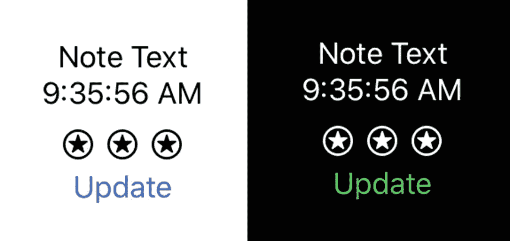

图 6-1

界面更新为深色模式

我们的 `Text` 项目是使用默认设置创建的。默认情况下，它使用系统标签颜色。该颜色会根据深色模式设置而变化。如果您检查或打印出 `UIColor.label.cgColor`，它也会根据当前的深色模式设置而变化。

这两个 `Text` 项目会自动更新。按钮文本项目也是如此。因此，默认情况下，这些项目会根据深色模式设置进行更新。或者，我们也可以像前面的代码那样，以自定义方式处理。

### 每个视图的设置

每个视图都继承其父视图的环境设置。但是，您可以在创建视图时覆盖这些设置。

我们的 `Button` 有一个用于标题的 `Text` 项目。在上一节中，我们根据 `lightOrDark` 值设置了该标题的颜色。对于当前我们整个（小型）应用，我们都在使用相同的环境设置。

当我们的 `ContentView` 被创建时，环境被继承并传播到它的所有视图：`Text`、`Button` 等等。但是，我们可以改变这一点。我们可以在创建视图时修改环境。

要修改环境，我们在视图创建的返回值上使用 `.environment` 修饰符。假设我们想强制我们的顶部 `Text` 项目始终处于深色模式。当然，当背景为白色时，白色文本将不可见，因此我还会添加一个灰色的背景修饰符。

```
Text(note.text)
.environment(\.colorScheme, .dark)
.background(Color.gray)
```

我使用 `.environment` 修饰符指定配色方案的键路径和一个值（即 `.dark`）。该枚举的另一个值选项是 `.light`。现在，界面强制此 `Text` 使用深色模式。运行应用并切换到深色模式，看起来如图 6-2 所示。

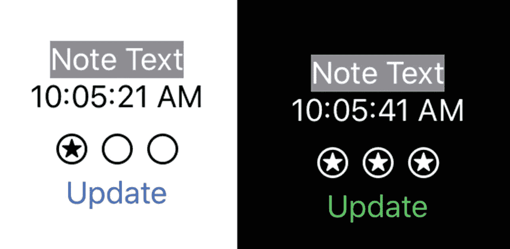

图 6-2

界面更新为深色模式

使用方法链，我们可以同时调用 `.environment` 和 `.background` 修饰符。类似地，我们可以调用多个 `.environment` 修饰符并更改不同的值。

这些更改随后将被该视图创建的所有子视图继承。在我们的例子中，这似乎不适用。然而，我们无法控制 `Text`，也不知道它创建了什么。如果我们查看视图层次结构渲染（调试 ➤ 视图调试… ➤ 捕获视图层次结构），如图 6-3 所示，我们会发现 `Text` 项目可能比我们想象的更复杂。

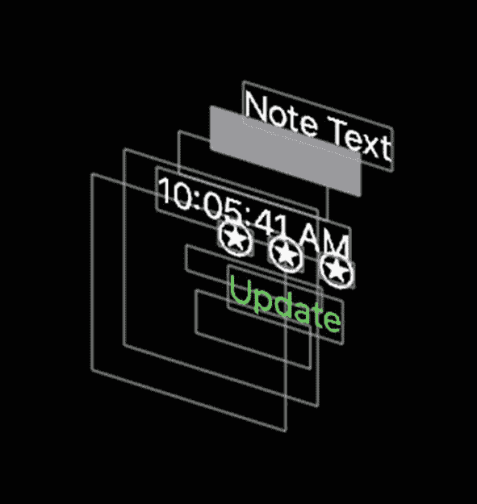

图 6-3

界面的 3D 渲染

这里值得学习的一点是，外观可能比看起来更复杂。因此，虽然仅设置一个值（例如 `accentColor`）可能看似可行，但您应该考虑核心更改应该是什么（例如 `colorScheme`）。

早些时候，我们研究了将环境设置传递到 `Text` 元素中。如果我们先将界面的一部分提取到单独的结构体中，也可以做同样的事情。

注意 带环境的视图

在本练习中，我们将提取显示 `Note` 的界面项。我们将它们放入一个新的 `View` 中，并让该结构体控制笔记详细信息的显示。

然而，我们希望创建元素（即我们应用中的 `ContentView`）来控制环境。除了 `Note` 实例和 `.environment` 修饰符之外，我们不希望 `ContentView` 控制新创建的 `NoteView` 的界面其他方面。

在浅色（左）和深色（右）模式下，我们希望界面看起来如图 6-4 所示。

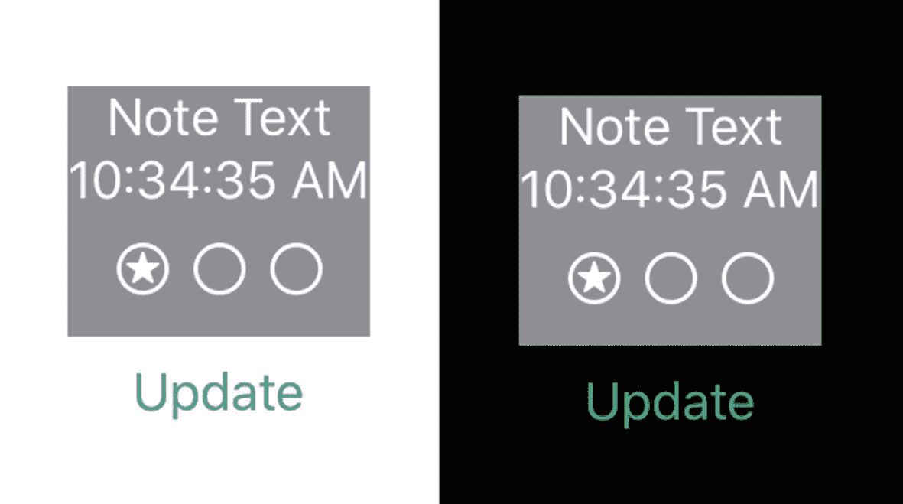

图 6-4

浅色（左）和深色（右）模式下的 NoteView

您可以尝试在查看以下步骤和代码之前自行解决。简而言之，您需要将与 `Note` 相关的界面元素放入一个符合 `View` 协议的新 `NoteView` 结构体中。将 `.environment` 修饰符分开，并在新创建的 `NoteView` 元素上调用它。

1.  创建一个名为 `NoteView` 的新结构体，使其符合 `View`：

```
    struct NoteView : View {
    }
```

2.  在 `NoteView` 中添加一个包含 `VStack` 的计算属性 `body`：

```
    var body: some View {
    VStack {
    }
    }
```

3.  在 `VStack` 的底部，添加 `.background` 修饰符：

1.  将 `ContentView` 的 `body` 中的两个 `Text` 元素和包含 `Image` 项目的 `HStack` 剪切并粘贴到 `NoteView` 的 `VStack` 中。


```swift
Text(note.text)
Text(df.string(from: note.updatedAtTime))
HStack {
    Image(systemName: "star.circle")
    Image(systemName: note.priority.rawValue > 0
        ? "star.circle" : "circle")
    Image(systemName: note.priority.rawValue > 1
        ? "star.circle" : "circle")
}
```

```swift
}.background(Color.gray)
```

"Update"按钮位于`ContentView`的 body 中。

1. 向`NoteView`添加一个`Note`属性：

```swift
var note : Note
```

该属性将被传入，因此不要将其设置为任何值。

2. 类似地，添加一个将被传入的`DateFormatter`属性：

```swift
var df : DateFormatter
```

`NoteView`结构体已定义并可投入使用（图 6-5）。它包含了`Note`和`DateFormatter`这两个属性。我们在`ContentView`中已经有了这些属性。我们将使用`ContentView`中的这两个值来创建`NoteView`。

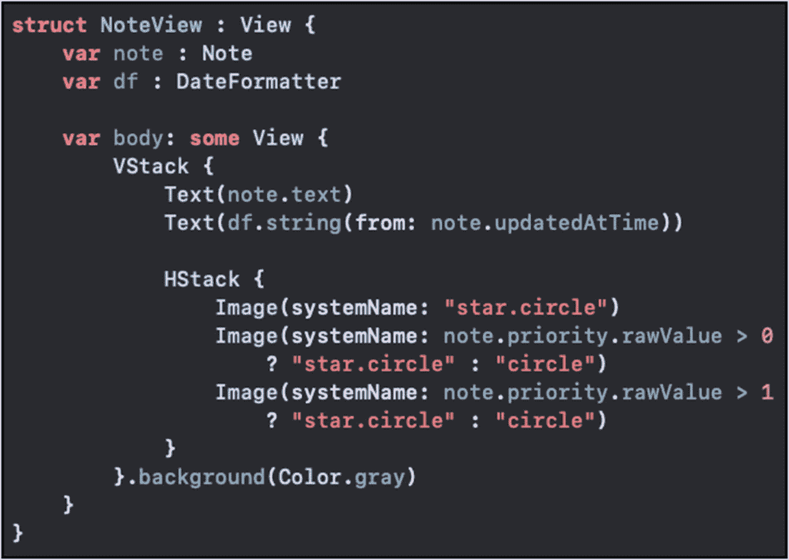

*图 6-5：NoteView 及其属性和从 ContentView 的 VStack 中移出的 UI 元素*

3. 在`ContentView`的 body 属性中，创建一个新的`NoteView`实例。它应该放在之前`NoteView`的 body 中放置两个`Text`项和`Image`的`HStack`的位置（就在`Button`上方）：

```swift
NoteView(note: self.note, df: df)
```

现在我们已经定义了自己的 UI 元素。我们可以像之前对`Text`所做的那样，将环境设置传递给我们的`NoteView`。

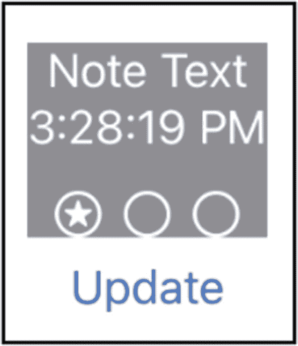

*图 6-6：NoteView UI*

4. 将之前应用于`Text`项的相同`.environment`修饰符添加到`NoteView`上。步骤 7 和 8 合并后如下所示：

```swift
NoteView(note: self.note, df: df)
    .environment(\.colorScheme, .dark)
```

5. 更新 Canvas 中`NoteView`的预览，它应该看起来像图 6-6。

基本上，这就是我们想要的效果。我们展示了可以创建一个`NoteView`来自我控制，同时让父视图控制其环境。

然而，有两个问题。底部的内边距不太美观。此外，如果你在模拟器中运行它，可能会注意到优先级星星不再更新。

这两个问题都很容易解决。对于内边距问题，我们仍然可以通过`.padding`修饰符在`NoteView`中控制 UI。如果我们在`NoteView`的`VStack`上添加内边距，它会在底部产生一个白色空间。这是因为内边距位于视图外部。这不是我们想要的效果。

相反，如果我们将内边距添加到最后一个 UI 项（即如下代码中的`HStack`），它就会显示正确：

```swift
HStack {
    Image(systemName: "star.circle")
    Image(systemName: note.priority.rawValue > 0
        ? "star.circle" : "circle")
    Image(systemName: note.priority.rawValue > 1
        ? "star.circle" : "circle")
}
.padding(.bottom)
```

为了使`Note`的优先级更新，我们需要在 UI 中使用与在`ContentView`中创建的相同的`Note`实例。我们可以在`NoteView`中使用`ObservedObject`属性包装器。

6. 在`NoteView`中添加一个`ObservedObject`：

```swift
@ObservedObject var note : Note
```

既然我们现在让`NoteView`控制 UI 以更新笔记实例，我们可以从`ContentView`的属性中移除`@ObservedObject`：

```swift
struct ContentView: View {
    var note = Note()
```

一旦我们创建了`Note`（如上）并将其传递给`NoteView`，更改将发布到`NoteView`而不是`ContentView`。

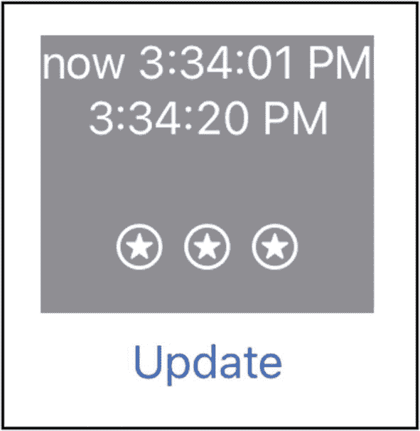

*图 6-7：带优先级更新的 NoteView*

7. 再次运行应用程序，验证优先级星星是否如图 6-7 所示更新。

暗黑模式的变化也已处理，如图 6-8 所示。请确保你使用的是支持暗黑模式的模拟器/设备。

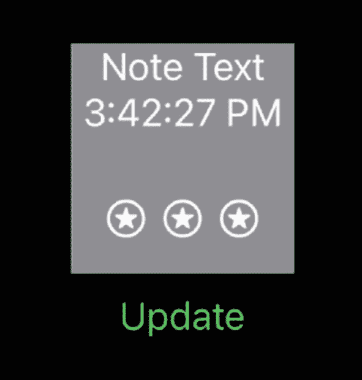

*图 6-8：暗黑模式下的 NoteView UI*

**加分项**：作为额外练习，在`colorScheme`设置之后添加另一个`.environment`修饰符。尝试使用`\.font`键路径并为`NoteView`的环境设置字体。你可以将其设置为类似：

```swift
Font.system(.largeTitle)
```

在这个练习中，我们看到了如何让一个给定的视图控制自己的 UI。但我们也可以从父视图通过`.environment`修饰符来控制环境。

### 应用环境

就像我们在创建`NoteView`时调用`.environment`修饰符一样，我们也可以在其他地方这样做。在模板为你创建的`SUINotesApp.swift`文件（根据项目名称命名）中，我们的`ContentView`被创建用于在模拟器/设备上运行应用程序（与 Canvas 相对）。

就像我们创建`NoteView`一样，我们也可以为`ContentView`设置一些环境设置。因此，如果我们希望应用程序在暗黑模式下运行、使用固定字体、设置截断模式或其他各种设置，我们都可以在那个地方完成。

但请记住，这意味着你正在为该视图及其子视图设置环境。如果你将`colorScheme`设置为暗黑（或明亮）而系统处于明亮（或暗黑）模式，你只是为你的`ContentView`及其子视图更改了它——而不是为整个设备更改。但你的应用程序会一直以暗黑模式运行，无论用户如何设置设备。

或者，在你的`ContentView`实例上，你可以设置像`Font`这样的属性，它将会传播：

```swift
ContentView()
    .environment(\.font, Font.system(.largeTitle))
```

如果你在`ContentView_Previews`代码中这样创建`ContentView`，你的预览将在 Canvas 中使用此设置。

如果你在`SUINotesApp.swift`文件的`ContentView`创建代码中这样做，那么在模拟器或设备上运行时将使用这些设置。


## `EnvironmentObject` 属性包装器

有时，你想要监视变化的对象并非直接来自父视图。如果为了将其传递到最终的目标视图而经过多层视图传递，可能是一种糟糕的设计。

在我们的应用中，`Note` 实例是在 `ContentView` 中创建的，但这可能并非最佳或正确的位置。也许我们有一个在其他地方管理的模型。`ContentView` 可能没有理由处理它，更不用说创建它了。

在这种情况下，我们可以在 `NoteView` 中对 `Note` 使用 `@EnvironmentObject` 属性包装器。我们的 `NoteView` 可以像之前一样请求 `Note` 实例。`ContentView` 就无需再处理 `Note` 了。

这意味着我们可以从 `ContentView` 中移除 `note` 属性。此外，我们还需要从 `ContentView` 结构体代码中删除所有对它的引用。至此，我们的 `ContentView` 变得相当精简，如图 6-9 所示。

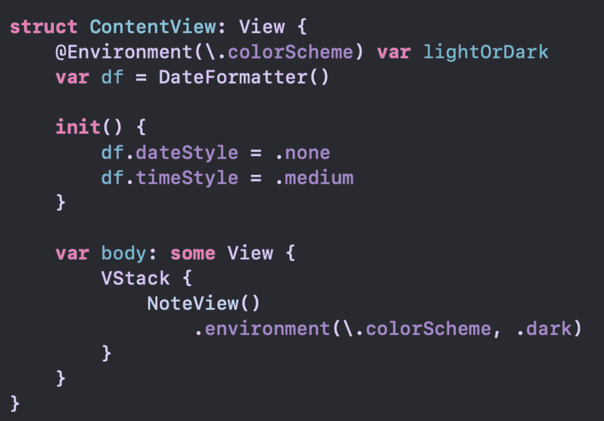

图 6-9  
不含 `Note` 的 `ContentView` 代码

类似地，我们可以将 `DateFormatter` 移到 `NoteView`（下方）中，`ContentView` 则变得更加精简，如图 6-10 所示。如果你之前添加了 `lightOrDark` 属性，也可以一并移除。

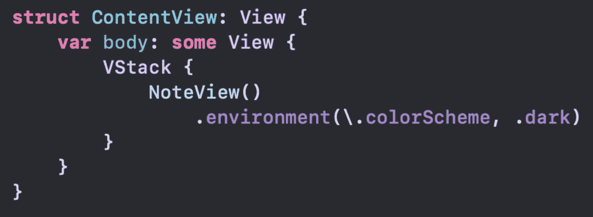

图 6-10  
不含 `DateFormatter` 的 `ContentView` 代码

我们的 `NoteView` 因为加入了 `DateFormatter` 而变得稍显臃肿，但这可能正是它该在的位置——具体取决于需求（见图 6-11）。由于创建 `NoteView` 时没有传入 `note`，也没有通过初始化器设置它，我们遇到了一个错误。我们将通过更改属性包装器，以及设置 `note` 属性的方式来解决这个问题。

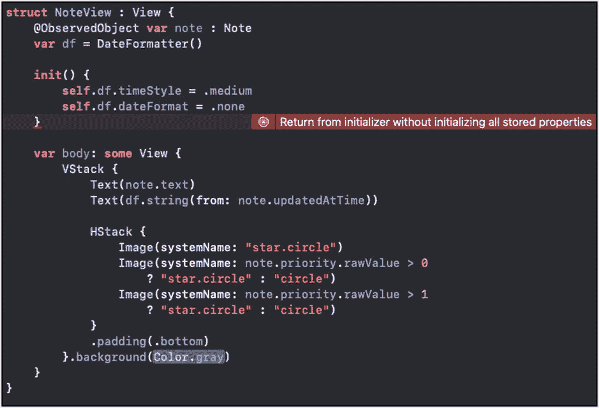

图 6-11  
包含 `DateFormatter` 且报错的 `NoteView`

`ContentView` 与模型 `Note` 实例无关。然而，`NoteView` 需要它，因此我们遇到了编译错误。这就是 `@EnvironmentObject` 发挥作用的地方。我们将告诉 `NoteView` 从环境中获取它。

因此，在我们的 `note` 声明中添加属性包装器：

```
@EnvironmentObject var note : Note
```

我们将在第 15 章详细讨论这一点。简而言之，由于 `Note` 结构体已经被定义为 `ObservableObject`，因此使用 `@EnvironmentObject` 包装器声明它的属性是可行的。

现在，`NoteView` 中的 `note` 已经处理好了。但是，`Note` 实例实际上从未被设置。如果我们运行应用，它会因以下错误而崩溃：

```
Fatal error: No ObservableObject of type
Note found. A View.environmentObject(_:)
for Note may be missing as an ancestor of
this view.: file SwiftUI, line 0
```

我们需要在环境中设置一个 `Note`。它不再由创建者传入。这意味着我们可以在 `NoteView` 创建之前的任何时候在环境中定义和设置它。这可以在模型管理类或结构体中完成，或者在任何其他地方进行。为了演示，我们换一个地方来定义和设置它。

我们将在 `SUINotesApp.swift` 中使用 `.environmentObject` 修饰器来完成。首先，我们创建一个 `Note` 实例作为 `SUINotesApp` 结构体的属性：

```
struct SUINotesApp: App {
var note : Note {
let aNote = Note()
aNote.text = "SUINotesApp.swift"
return aNote
}
```

在 body 属性的 `WindowGroup` 中，我们将像之前一样创建我们的 `ContentView`，但要为 `Note` 实例添加 `.environmentObject` 调用：

```
ContentView()
.environment(\.font,
Font.system(.largeTitle))
.environmentObject(note)
```

如果我们现在在模拟器或设备（而非 Canvas 预览）中运行应用，它会使用来自环境的这个 `note`。由于我们在 `SUINotesApp` 结构体中执行此操作，这些更改不会影响 Canvas 中的预览。要实现预览同步，我们需要在 `CodeView_Previews` 中添加类似的代码，我们将在下一节中完成。

更新（例如，优先级星标）仍然会传递到 UI，如图 6-12 所示。

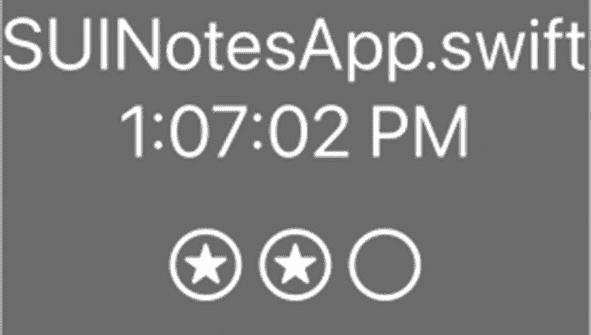

图 6-12  
使用环境中 `Note` 的 UI

你注意到什么隐藏细节了吗？我们刚刚在环境中设置了一个 `Note`，`NoteView` 就获取到了它。没有键值，没有访问器。它就这样获取到了我们想要的那个实例。

还记得我们之前看到的错误信息吗？它说“找不到类型为 `Note` 的 `ObservableObject`。”它是“按类型”查找的。所以当 `NoteView` 被创建时，它获取了类型为 `Note` 的那个（唯一的）条目。

因此，如果我们稍后替换它，或者在 `ContentView` 中运行 `.environmentObject` 修饰器来覆盖通常继承的环境，`NoteView` 将获取到新的那个。

如果你需要多个笔记，你可能需要在环境中添加一个数组、管理器类或某个单例。或者你会发现，将条目存储在环境中并不适合你的需求。

### 预览环境

你可能也注意到你的预览无法工作了。由于我们现在是在 `SUINotesApp` 结构体中创建 `Note`，我们的 `ContentView_Previews` 无法获得那个环境设置。

我们可以在 `ContentPreview` 的预览计算属性中设置它，但这有点棘手。

一方面，`previews` 属性是静态的。如果 `Note` 实例是在它外部创建的，那么这个实例也需要是静态的，如下所示：

```
struct ContentView_Previews: PreviewProvider {
static var note = Note()
static var previews: some View {
ContentView()
.environmentObject(note)
}
}
```

但由于它是静态的，我们没有机会初始化 `note` 的 `text` 属性。所以在这个例子中，文本项将是空的。

也可以像下面这样将其定义为静态的计算属性：

```
static var note : Note {
let note = Note()
note.text = "Static Computed"
return note
}
```

你也可以在 `.environmentObject` 调用中直接创建实例，如下所示：

```
.environmentObject(Note())
```

根据你希望预览呈现的效果，你有多种选择。类似地，我们已经看到在选择何时创建对象、如何传递或访问它、什么是事实来源以及其他相关可能性方面，也存在多种选项。


### 用法

接下来要探讨的问题是，在何种情况下应使用哪种类型的属性包装器和可观察绑定。

`@State` 属性包装器最适合用于单个视图内的值。如果你有一个计数器或计时器的起始值，并且希望 UI 保持同步，那么 `@State` 可能正好合适。

`@Binding` 适用于数据真实来源位于其他位置的情况。`MyStepper` 视图使用此属性包装器来修改自身外部的数据真实来源。任何创建 `MyStepper` 实例的对象都需要使用 `$` 符号来传递数据真实来源以进行绑定。

`@ObservedObject` 适用于声明为遵循 `ObservableObject` 协议的引用类型（例如类）。如果你使用 `@ObservedObject` 包装器声明属性实例，则需要编写类的实现代码来发布更新。这可以通过调用发布者（例如 `self.objectWillChange.send()`）或使用 `@Published` 声明属性来实现。

因此，`@ObservedObject` 最适合用于需要监控更新以刷新 UI 的引用类型。如果你的应用中已有引用类型模型，并且正在转换为 SwiftUI，这也是一个不错的选择。它对现有模型代码的改动要求很小。

`@Environment` 适合根据内置键路径常量（如 `.colorScheme`）来获取和设置环境变量。这些设置在视图创建时会向下传递。视图的环境设置可以在创建时通过视图上的 `.environment` 修改器进行设置。

环境设置非常适合跨应用或沿应用路径访问值。它们不需要专门传递——只需继承即可。

`@EnvironmentObject` 用于声明一个按“类型”从环境中加载的对象。关键的是，这个值必须实际设置，否则应用会崩溃。与环境设置类似，这些值可以在视图创建时设置，并通过继承向下传递。环境对象通过 `.environmentObject` 修改器进行设置。

环境对象与环境设置类似。如果你需要在应用的多个位置访问某个对象，但又不便四处传递该对象，环境对象是一个不错的选择。

## 自定义环境值

向环境中添加自己的值并不困难。你需要一个遵循 `EnvironmentKey` 的结构体，该结构体有一个必需的、只读的静态计算属性：

```
static var defaultValue: Self.Value { get }
```

实现该属性后，只需让 `defaultValue` 返回默认值即可。如果我们想存储 `Note` 文本字段的默认值，其类型应为 `String`。那么我们的环境键可以这样写：

```
struct NoteInitialTextEnvironmentKey: EnvironmentKey{
    static var defaultValue: String = "Default Note"
}
```

在扩展的 `EnvironmentValues` 中，我们可以添加一个计算属性，使用该键来获取和设置我们的值。我们给该属性起的名字就是我们用来访问它的键路径。我们将其命名为 `defaultNoteText`：

```
extension EnvironmentValues {
    var defaultNoteText: String {
    }
}
```

我们在此定义的键将用于 `EnvironmentValues` 的下标访问中：

```
get {
    return self[NoteInitialTextEnvironmentKey.self]
}
set {
    self[NoteInitialTextEnvironmentKey.self] = newValue
}
```

定义好上述代码后，我们可以使用 `.environment` 修改器设置默认的 Note 文本：

```
.environment(\.defaultNoteText, "New Default")
```

并且我们可以像获取其他环境属性一样获取该值：

```
@Environment(\.defaultNoteText) var defaultText: String
```

或者直接使用 `EnvironmentValues` 实例上的下标来获取它，如下所示：

```
EnvironmentValues()[NoteInitialTextEnvironmentKey.self]
```

如果你觉得只为可能被一个类需要的值在环境中存储这么一大段代码工作量不小，我同意这种看法。在这种情况下，使用一个简单的常量，或者在 `UserDefaults` 中设置一个值，就足够了。

但希望你能理解其工作原理。这样，当它更适用时，你就会明白如何在代码中使用它。

现在我们已经有了一个默认值，我们的 note 实例在创建时就拥有了一个非空的 `String` 值。这也修复了预览中空白的 Textfield。

### 章节总结

在本章中，我们学习了环境。它是一个方便的地方，可以找到应用运行环境的各种值。你也可以设置自己的自定义值。要注意避免过度设计，将 `Environment` 和 `EnvironmentValues` 用在不必要的地方。

我们了解了 `.environment` 修改器的设置是如何沿视图层级向下传播给创建的视图。

`.environmentObject` 修改器也用于在环境中设置引用类型的对象。请记住，这些对象是按类型访问的。这一特性有两个重要影响。首先，如果这个值在关联环境中未设置，应用将崩溃。其次，如果再次设置该值，它将被替换。

SwiftUI 为我们提供了多种通过框架访问值的工具。在许多情况下，框架替我们完成工作非常有用。但重要的是要根据数据的需求以及特定情况下哪种机制最合适来做出选择。

