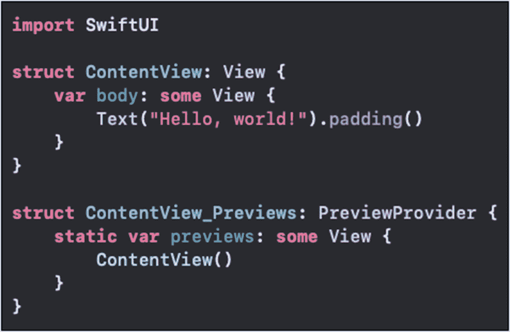
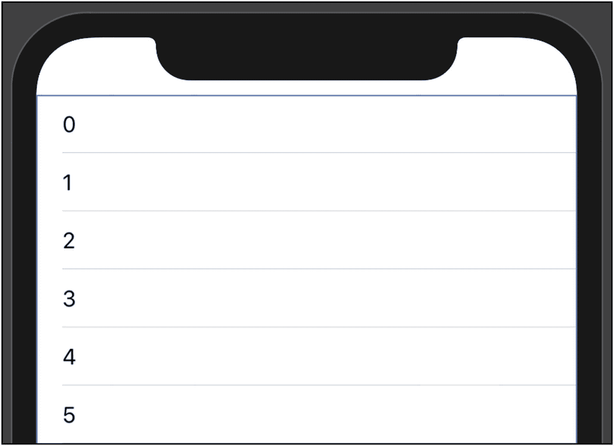
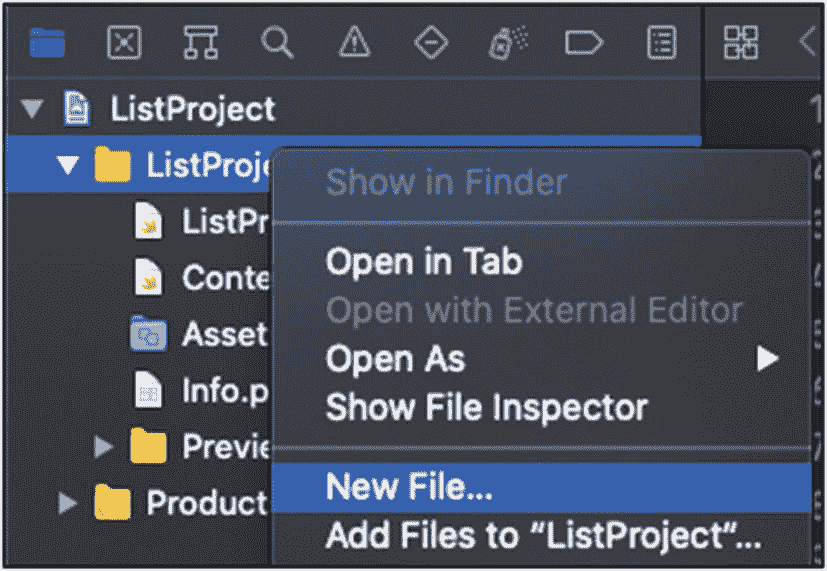
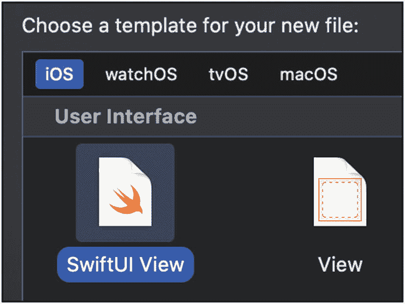
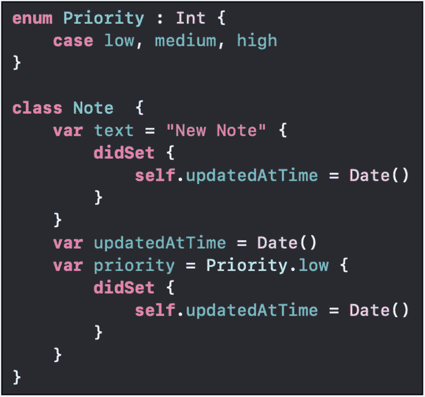
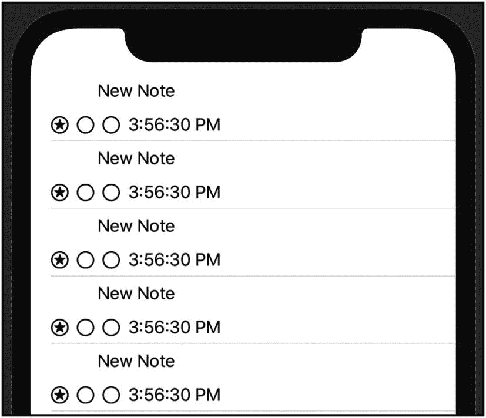
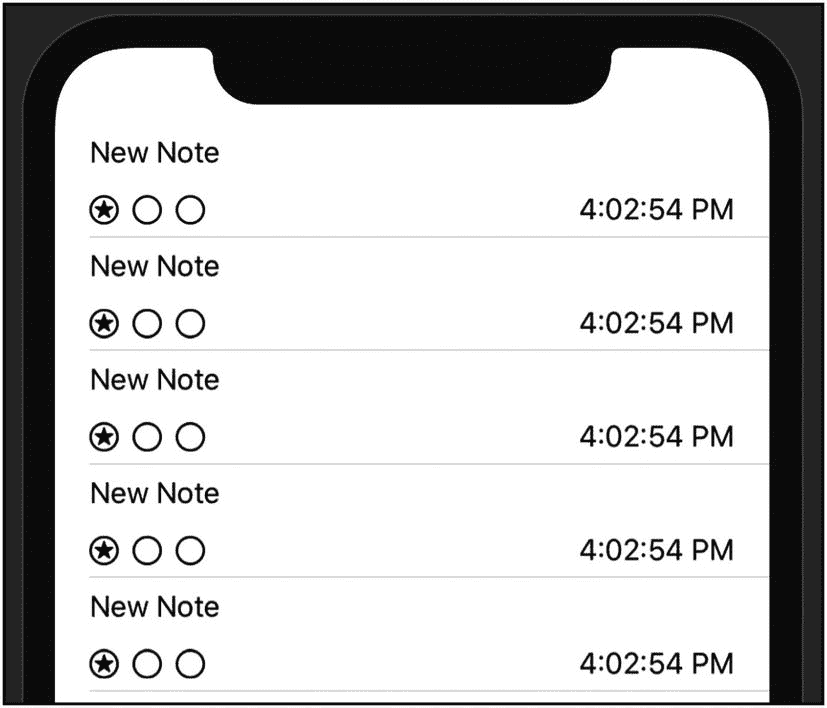
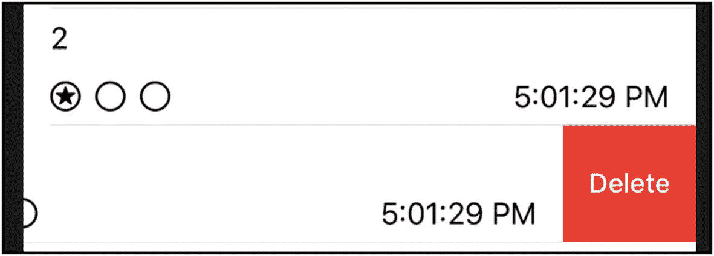

# 7. 项目列表

在本章中，我们将把注意力转回 UI 的可视元素方面。我们已经了解了如何添加像 `Text` 和 `Button` 这样的简单元素。现在，我们将研究如何列出项目。

如果你以前使用过 UIKit，那么你一定对 `UITableView` 及其一系列相关类非常熟悉：`UITableViewController`、`UITableViewDataSource`、`UITableViewDelegate` 和 `UITableViewCell`。

在 SwiftUI 中，我们将使用 `List` 来替代 `UITableView`。对于行，我们将像之前一样使用视图。听起来是不是简单多了？不需要原型单元格。没有来回的表格询问单元格、你的代码请求出列单元格以及在其他地方返回单元格高度这样的操作。

## List

创建一个视觉上的项目列表，感觉更像是在写一个循环，而不是创建 UI。这是因为它会遍历你告诉它的值。循环的每次迭代都会创建一个要显示的视图。

让我们在一个新的 iOS 应用项目中从一个简单的例子开始。创建项目时，接口选择 SwiftUI，生命周期选择 SwiftUI App。你的 `ContentView` 代码应该如图 7-1 所示。



图 7-1：默认的新项目代码

让我们创建一个包含若干项目的简单列表。首先，我们删除“Hello, World!”的 `Text` 项目。在它的位置，我们添加一个列表，如下所示：

```
var body: some View {
    List(0..<19) { index in
        Text("\(index)")
    }
}
```

这会创建一个包含 20 个项目的列表。每个创建的项目都是一个 `Text` UI 元素，显示循环中的索引编号 (`Int`)。预览画布的顶部如图 7-2 所示。



图 7-2：带有数字的文本项列表

这个概念与我们之前看到的非常相似。与使用 `HStack` 或 `VStack` 不同，我们的 body 属性返回一个 `List`。我们向 `List` 传递一个范围 `0..<19`，每次遍历都会创建一个 `Text` 元素。

我们传递给 `List` 调用的闭包接受一个参数，我将其命名为 `index`。它是 `Int` 类型，表示当前迭代在范围内的数字。

很简单。没有在 Interface Builder 中定义的单元格、索引路径或出列的原型单元格。

但如果我们想要更复杂的东西呢？我们可以创建任何我们想要的，而不只是 `Text` 元素。我们一直在处理 `Note` 对象，所以让我们创建一个包含它们的列表。


### NoteRow 视图

我们将从为独立视图创建一个新文件开始。这有助于我们在设计行时预览其效果。

右键点击项目的主文件夹，选择“新建文件…”，如图 7-3 所示。



图 7-3

新建文件…

在弹出的窗口中，筛选视图类型并选择 SwiftUI View，如图 7-4 所示。点击“下一步”，将其命名为 `NoteRow`，然后点击“创建”。



图 7-4

SwiftUI View

初始状态下，`NoteRow` 的 `body` 属性会是另一个显示“Hello, World!”的 `Text`。我们将把它替换成更符合列表行风格的内容。

当然，我们的 `NoteRow` 需要引用一个 `Note` 对象，但该对象尚未在此项目中定义（假设你和我一样使用了新项目）。我将基于前几章的内容定义一个 `Note` 类。它看起来会很像图 7-5 所示。



图 7-5

在 `NoteRow.swift` 中定义的 `Note`

这是对我们之前使用版本的略微简化和清理。对于当前任务来说，它足够好用。

如果 `NoteRow` 视图拥有一个 `Note` 实例，它就能生成一个在笔记列表中看起来不错的视图。在之前的项目中，`NoteView` 的布局并不适合列表。它更偏向方形和厚重感。我们更希望得到一个宽度大于高度、并且在滚动浏览时视觉效果良好的布局。

我们甚至可能不会选择展示 `Note` 的全部信息。根据应用的不同，`updatedAtTime` 对用户来说可能并不实用。在本例中，我们会将所有信息展示在界面上，但实际情况并不总是如此。

## 创建笔记列表

我们需要创建 `NoteRow` 来展示 `Note` 的所需数据。一旦我们得到了满意的效果，就可以用 `NoteRows` 来替换 `List` 的创建。

1. 像这样为 `NoteRow` 添加属性和初始化器：

```
    var note : Note
    let df = DateFormatter()
    init() {
    df.dateStyle = .none
    df.timeStyle = .medium
    }
```

与之前一样，这会强制要求创建 `NoteRow` 时必须传入一个 `Note`。很好。

2. 从 `NoteRow` 的 `body` 属性中删除 `Text` 项。

此时你会看到一些错误，但我们很快就会解决它们。

3. 在 `body` 属性内，创建一个 `VStack`，其中包含一个用于显示笔记文本的 `Text` 项：

```
    var body: some View {
    VStack {
    Text(note.text)
    }
    }
```

此时，`body` 属性是有效的，但预览却无法工作。这是因为 `NoteRow_Previews` 中创建 `NoteRow` 时没有传入 `Note`。

4. 更新 `NoteRow_Previews`，传入一个 `Note`：

```
NoteRow(note: Note())
```

如果你重新开始预览，应该会看到“New Note”而不是“Hello, World!”。

这对于一个 `List` 来说技术上是足够的，但在进入列表之前，让我们再完善一下。当然，随时欢迎你自行尝试！

5. 在 `NoteRow` 的 `body` 中文本项的下方，像之前一样添加一个包含优先级星形图片的 `HStack`：

```
    HStack {
    Image(systemName: "star.circle")
    Image(systemName: note.priority.rawValue > 0 ?
    "star.circle" : "circle")
    Image(systemName: note.priority.rawValue > 1 ?
    "star.circle" : "circle")
    }
```

6. 在第 5 步添加的图片下方，再添加一个用于显示 `Date` 值的 `Text` 项：

```
Text(df.string(from: note.updatedAtTime))
```

现在，我们已经准备好创建 `List` 了！



图 7-6

笔记列表

7. 回到 `ContentView`，从 `body` 中的 `List` 里删除 `Text` 项，并替换为创建 `NoteRow` 的代码：

```
    var body: some View {
    List(0..<19) { index in
    NoteRow(note: Note(), df: self.df)
    }
    }
```

如果你运行应用或更新预览，它应该会像图 7-6 所示。

成功啦！我们有了一个包含 `Note` 项的 `List`。代码清晰明了地表达了所做的事，而 `List` 的代码基本上只有一行。

但它当然还能更好看。笔记文本最好左对齐。优先级和更新时间之间有些间距也会更好看。

让我们回到 `NoteRow`，根据这些想法做一些修改。

8. 回到 `NoteRow` 的 `VStack`，让我们添加一个对齐参数：

9. 在最后一张星形图片和用于显示日期的 `Text` 项之间添加一个 `Spacer`：

```
VStack(alignment: .leading) {
```



图 7-7

使用更新后的 `NoteRow` 的笔记列表

10. 运行应用或回到 `ContentView` 刷新预览。它应该会像图 7-7 所示。

```
Spacer()
```

这才像样。一个真正的列表！它算不上惊艳，但相当酷且易于制作。我们基本上是将已经掌握的许多技术，通过循环调用 `List` 的方式组合运用了起来。


### 模型列表

虽然你不需要经常列出数字循环，但列出 `Array` 中的项目却是常见需求。我们无需向 `List` 传入一个数字范围，而是可以传入一个 `Note` 实例的集合。

`List` 有多种带有不同参数的初始化器。让我们修改应用，使用 `Note` 的 `Array`。为此，我们需要添加一个 `Note` 数组作为属性。

接下来，我们在 `Note` 对象上创建一个 `createTestNotes` 函数。我们将它设为静态方法，这样就能在类上调用：

```swift
static func createTestNotes() -> [Note] {
    var items = [Note]()
    for i in 0..<19 {
        let note = Note()
        note.text = "\(i)"
        items.append(note)
    }
    return items
}
```

将这个数组的生成逻辑放在 `ContentView` 外部，可以避免 `ContentView` 结构体的可变性问题。

现在我们可以为 `ContentView` 添加一个属性来持有这些 `Note`。我们希望该属性使用 `@State` 属性包装器，这样对列表的更新就能实时反映出来。

```swift
struct ContentView: View {
    let df = DateFormatter()
    @State private var notes = Note.createTestNotes()
```

现在我们可以更新 `List`，让其使用 `notes` 数组。`List` 的第一个参数是我们的数组：`notes` 属性。第二个参数是一个闭包。该闭包会为每个元素调用一次，并将对应的 `Note` 传入闭包。我们只需创建 `NoteRow`，这部分我们已经知道如何操作：

```swift
List(notes) { note in
    NoteRow(note: note, df: self.df)
}
```

这会产生错误，因为 `Note` 元素需要是可识别的。`List` 要求其元素支持随机访问。我们只需要让 `Note` 遵循 `Identifiable` 协议即可。

该协议要求提供一个 `id` 属性。我们将添加该属性，并将其初始化为一个 `UUID`。

```swift
class Note : Identifiable { 
    var id = UUID()
```

现在编译就干净无错了。我们的代码与上次运行时看起来略有不同，但用户界面是一样的（除了便签文本内容）。

然而，现实需求往往更复杂。通常，当你看到自己创建的数据列表（比如便签）时，你期望能够从中删除内容。`List` 本身没有用于处理删除的修饰符，但 `ForEach` 提供了。让我们看看具体如何实现。

## 在列表中删除项目

我们仍然会使用 `List`，但不会让它来遍历我们的元素。之前，我们使用 `List` 为数组中的每个项目创建 `NoteRow`。现在我们仍会用 `List` 来显示所有创建的行，但会通过另一种迭代方式来创建它们。

1.  将 `List` 的调用改为 `ForEach`：

    ```swift
    ForEach(notes) { note in
        NoteRow(note: note, df: self.df)
    }
    ```

    这一步应该仍能编译和运行，但效果不太好看。:)

2.  将 `ForEach` 调用包裹在一个新的 `List` 调用中：

    ```swift
    List {
        ForEach(notes) { note in
            NoteRow(note: note, df: self.df)
        }
    }
    ```

    现在应用和预览应该看起来好多了。接下来实现删除功能！

    如我之前提到的，`List` 没有用于删除元素的修饰符，但 `ForEach` 有。我们可以添加 `onDelete` 修饰符，它会传入要删除元素的偏移量。恰好，我们的数组有一个接受该偏移量的 `remove` 函数。

3.  为 `ForEach` 添加 `onDelete` 修饰符：

    ```swift
    ForEach(notes, id: \.id) { note in
        NoteRow(note: note, df: self.df)
    }
    .onDelete { offsets in
        self.notes.remove(atOffsets: offsets)
    }
    ```

借助 `ForEach` 处理删除操作，系统会像图 7-8 一样，在左滑时提供“删除”选项。



图 7-8 – 列表行上的删除操作

点击“删除”会触发 `onDelete` 定义中传入闭包的调用。这将从 `notes` 数组中移除对应行。由于我们的 `notes` 数组使用了 `@State` 属性包装器，`List` 会重新渲染显示。

请注意，动画会自动执行，整个过程流畅且效果出色！

## 本章小结

在本章中，我们学习了 `List` 视图结构。通过定义属性的模型，添加 `List` 变得非常容易。其核心代码就是遍历数组并为每个元素创建一个视图。

我们的 `Note` 对象与前面章节中的非常相似。不过，我们通过添加 `id` 属性使其遵循了 `Identifiable` 协议。此外，我们还添加了一个静态方法来创建测试用的 `Note` 实例数组。

我们创建了一个用于在 `List` 中显示的 `NoteRow` 视图。这可以是任何实现了 `View` 的组件。理想情况下，它会是一个在列表中看起来效果不错的视图。

通过将 `List` 的实现改为使用 `ForEach`，我们能够轻松地添加删除处理功能。一旦 `notes` 数组使用了 `@State` 属性包装器，删除元素就能让用户界面与模型保持同步。

`List` 功能强大，用途广泛，在大多数应用中像表格视图一样被使用。为了更好地发挥其全部效能，建议多学习 `List` 的各种修饰符和选项。

