# 8. SwiftUI Canvas 预览

设计出色的用户界面可能不是你的任务。但既然你在阅读本书，那么用 SwiftUI 代码实现用户界面设计很可能就是你的工作。如果你过去使用过 Interface Builder 甚至纯代码进行开发，很可能用过 Storyboard 的预览功能。它能展示用户界面在各种设备上的呈现效果。

然而，更常见的情况是，你会通过运行模拟器或真机来测试真实数据和交互。当然，这需要更多时间：编译、安装、运行、导航，然后修改界面或代码，再重复以上流程。

Canvas 预览功能让你能在代码旁边直接看到用户界面。不仅如此，它还会实际编译你的代码，并展示运行时界面将如何呈现。这包括用于确定用户界面的数据和功能。这个过程被称为“动态替换”。

预览显示在 Canvas 中。后续我将继续把这两个术语混用。

让我们详细了解 Canvas/预览的细节。

## 编译

如前所述，Xcode 会编译你的实际代码来在 Canvas 中创建并显示预览。Xcode 知道你正在处理哪个文件以及哪些更改需要编译。它只编译必要部分，以尽可能加快过程。

在某些情况下，比如更改字面量值，甚至无需重新编译，更改会非常快速且自动完成。

对于更重大的更改，例如向相关对象添加属性，自动更新会暂停。在这些情况下，你会在 Canvas 左上角看到类似图 8-1 的消息。

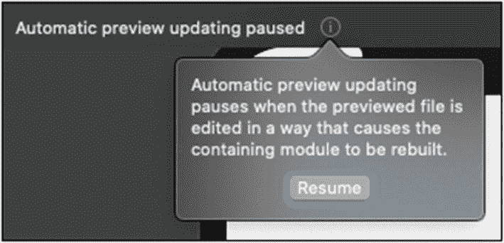

图 8-1 – 预览更新已暂停

要继续更新预览，请点击弹出消息中的“恢复”按钮，或点击 Canvas 右上角的“恢复”按钮。

这个预览的绝妙之处在于，它*实际上*就是用户界面。这是你编译后的 SwiftUI 代码生成的预览。这意味着，它就是你运行时使用所有与呈现相关的数据和功能后，界面实际会呈现的样子。

在你进行更改时，预览会实时反映这些变化。无需再经历构建、运行、点击等繁琐流程。


## 预览提供器

在上一章中，我们处理了一个包含 `Note` 项目的 `List`。当我们使用默认的 `ContentView` 结构体创建项目时，系统还会在其下方自动提供一个 `ContentView_Previews` 结构体：

```swift
struct ContentView_Previews: PreviewProvider {
    static var previews: some View {
        ContentView()
    }
}
```

我们的 `NoteRow` 也是如此。Xcode 正是通过这些结构体来指导预览的具体编译和渲染。

`PreviewProvider` 是一个协议，它要求实现一个名为 `previews` 的计算属性。这与我们之前使用的 `View` 协议所要求定义的计算属性非常相似。

我们的 `previews` 属性需要返回一个实现了 `View` 协议的内容，就像 `body` 属性一样。因此，一个简单的方法（默认实现也是这样做的）就是返回我们结构体的一个实例（例如 `ContentView`）。

如果初始化器需要参数（就像我们的 `NoteRow` 那样），我们也可以传入这些参数：

```swift
struct NoteRow_Previews: PreviewProvider {
    static var previews: some View {
        NoteRow(note: Note(), df: DateFormatter())
    }
}
```

## 预览设备

改变画布中预览的一种方法是更改运行目标。你可以从活动方案（Xcode 左上角）右侧的下拉菜单中选择不同的模拟器，以指定预览中使用的设备（见图 8-2）。

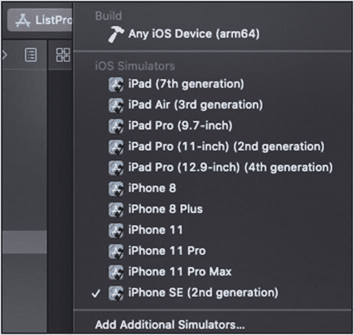

图 8-2 运行目标选择

在这里选择不同的模拟器将更新画布中的预览，使其使用该设备。这是一种在不同设备尺寸上快速检查 UI 的简便方法。

然而，预览 API 也允许你通过 `.previewDevice` 修饰符在代码中实现同样的效果。

我当前选择了 iPhone 11 Pro Max，但我想看看它在 iPhone 8 上的效果。只需在预览代码中的 `ContentView()` 上添加 `.previewDevice` 修饰符：

```swift
struct ContentView_Previews: PreviewProvider {
    static var previews: some View {
        ContentView()
            .previewDevice("iPhone 8")
    }
}
```

现在，我的预览在画布中显示为 iPhone 8，如图 8-3 所示。

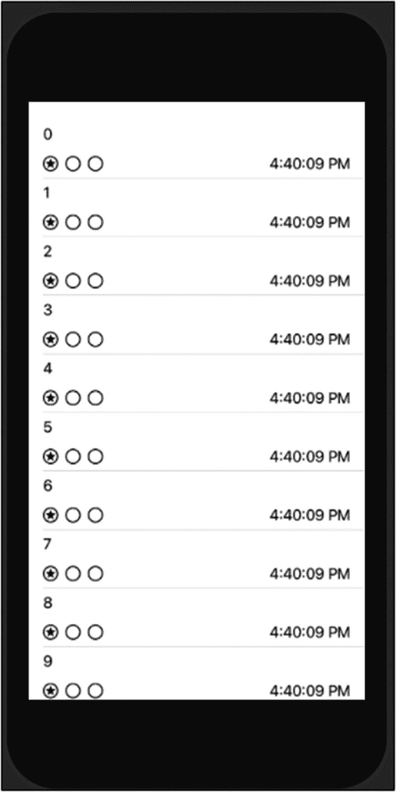

图 8-3 iPhone 8 预览

类似地，你可以将多个 `ContentView` 实例包装在一个 `Group` 中，在画布中同时显示多种设备类型。这样你就可以实时看到 UI 在不同设备上的表现。

将项目嵌入 `Group` 的快捷方式是按下 ⌘ + 点击，然后选择 Group 选项。

现在，你的预览可以返回一个包含多个 `ContentView` 的组，每个都使用不同的预览设备。

如果我想同时预览 iPhone 8 和 iPhone 11，可以在代码中分别为这两个 `ContentView` 实例使用 `.previewDevice` 修饰符，如下所示：

```swift
Group {
    ContentView()
        .previewDevice("iPhone 8")
    ContentView()
        .previewDevice("iPhone 11")
}
```

现在，我可以在画布中看到这两种设备，并在修改 SwiftUI 代码时实时查看更新。当你处理占据整个屏幕的 UI 部分时，这尤其有用。

然而，有时显示整个设备并非最有帮助的方式。

## 环境

除了多种设备，我们可能还想了解各种环境设置对 UI 的影响。同时查看深色模式等多种选项会非常方便。

就像我们串联使用 `.previewDevice` 一样，我们也可以串联调用 `.environment`。我将为代码中的其中一个设备添加深色模式：

```swift
ContentView()
    .previewDevice("iPhone 8")
    .environment(\.colorScheme, .dark)
ContentView()
    .previewDevice("iPhone 11")
```

现在，我的 iPhone 8 预览将显示为深色模式。

你可能还想了解 UI 在不同文字大小选择下的样子；你可以像这样模拟其他文字大小：

```swift
.environment(\.sizeCategory, .extraExtraExtraLarge)
```

通过使用多种设置的不同 `ContentView` 预览，你可以在设计阶段准确地了解应用运行时的 UI 外观。

如果你有一组值，例如 `colorScheme` 和 `ContentSizeCategory`，你可能希望全部查看。正如我们在 `List` 中看到的，我们可以使用 `ForEach`。和我们使用过的许多其他东西一样，`ForEach` 实际上返回一个 `View`。

`ForEach` 的每次迭代都需要返回一个 `View`，然后用于 UI。之前，我们在 `List` 中使用了它。每次迭代返回一个 `NoteRow`。现在，我们可以在预览中使用它。

```swift
ForEach(ContentSizeCategory.allCases,
        id: \.self) { sizeCat in
    ContentView()
        .environment(\.colorScheme, .dark)
        .environment(\.sizeCategory, sizeCat)
}
```

与之前在 `List` 中使用 `ForEach` 一样，我们必须为每个项目提供一种标识方式。在这种情况下，这一点尤其关键，因为 Xcode 需要知道根据情况更新哪个预览。我们将使用 `.self` 作为标识。

使用 `List` 时，我们将 `ForEach` 每次返回的内容（一个 `NoteRow`）都包含在列表中。在上面的代码中，我们为 `ContentSizeCategory` 中的每个值创建了一个完整的预览。这意味着系统文本可设置的每种字号（超过十种预览），在画布中都将会有一个对应的预览。

对于这种实际上仅在 `NoteRow` 视图上发生的文字变化，用这么多完整的 UI 预览显得有些过头了。因此，更好的做法是将这种变化添加到 `NoteView` 的预览中，而不是 `ContentView`。


### 预览布局

当您处理一个仅占屏幕一部分的视图时，您只会希望看到这部分内容。在我们的例子中，`NoteRow` 在画布中并不需要整个设备的屏幕。同时显示多个设备也没有帮助。

在这些情况下，使用 `.previewLayout` 修改器效果可能更好。您可能不仅不希望看到多个设备版本，甚至可能根本不需要设备。

我们的 `NoteRow` 就是一个很好的例子。我们实际上并不需要看到整个设备（或多个设备）才能了解 `NoteRow` 的外观。

我修改了 `NoteRow_Previews` 的代码，为 `DateFormatter` 添加了一个静态计算属性。

```
static var dateFormatter : DateFormatter {
let df = DateFormatter()
df.dateStyle = .none
df.timeStyle = .medium
return df
}
```

现在，我的预览在创建 `NoteRow` 时可以传入这个新属性。我在 `NoteRow_Previews` 中的预览只需返回：

```
NoteRow(note: Note(),
df: dateFormatter)
```

UI 看起来如图 8-4 所示。对于一个列表中的行来说，这显得有点多余。让我们使用 `.previewLayout` 来使其更合理，并更精确地符合我们的设计。

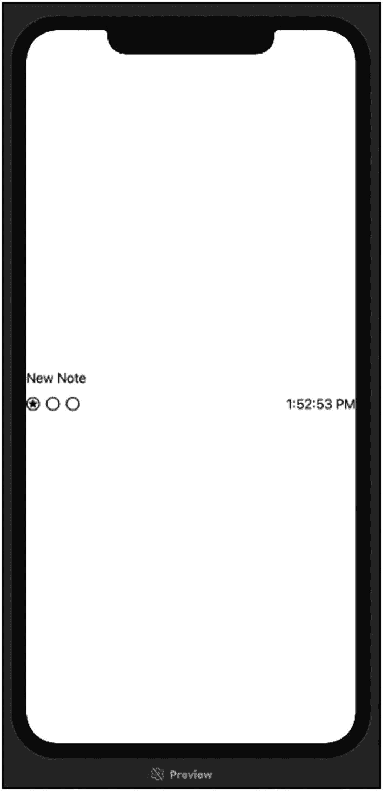

**图 8-4** 预览中的 NoteRow

在预览属性中创建 `NoteRow` 之后，我们将调用 `.previewLayout`，并选择其三个参数选项之一，如图 8-5 所示。

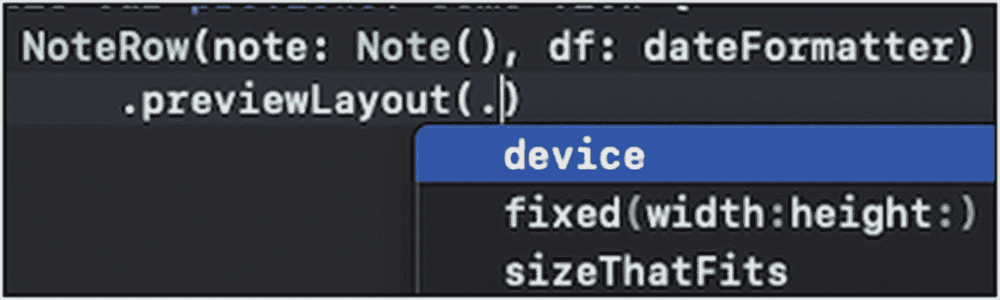

**图 8-5** 预览布局自动补全选项

如您所见，当选择了设备选项时，描述说明它将在预览中居中显示在设备上。这基本上就是我们一直以来的效果。如果您深入查看 `.previewDevice`，可以看到支持的设备列表，例如：

```
/// "iPhone 7"
/// "iPhone 7 Plus"
/// "iPhone 8"
/// "iPhone 8 Plus"
/// "iPhone SE"
/// "iPhone X"
/// "iPhone Xs"
/// "iPhone Xs Max"
/// "iPhone Xʀ"
/// "iPad mini 4"
/// "iPad Air 2"
/// "iPad Pro (9.7-inch)"
```

固定选项（fixed）需要指定宽度和高度。这对于为您的项目指定具体的宽度和高度非常有用。如果您知道正在设计的元素将是固定大小，那么这是您按实际大小预览它的方法。

如果我设置宽度为 200、高度为 80，我的 `NoteRow` 将如图 8-6 所示。

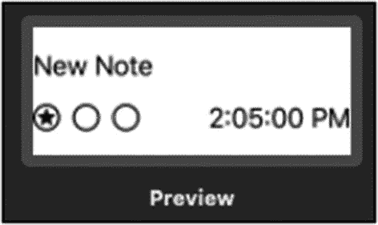

**图 8-6** 固定宽度和高度的 NoteRow

```
NoteRow(note: Note(), df: dateFormatter)
.previewLayout(.fixed(width: 200, height: 80))
```

实际上，我可能希望它更宽一些，但您明白我的意思。我可以给它一个更大的宽度并继续设计。我会选择一种有助于我将其视为列表元素的外观。

这个尺寸的一个特定问题是 `Spacer` 没有太大作用。我无法判断它会扩展并对设计产生更大影响。

另一个选项是 `PreviewLayout` 的 `sizeThatFits` 值。当然，这个选项会让预览使用创建视图所需的尺寸。

```
NoteRow(note: Note(), df: dateFormatter)
.previewLayout(.sizeThatFits)
```

如果我使用这个选项，UI 预览看起来如图 8-7 所示。

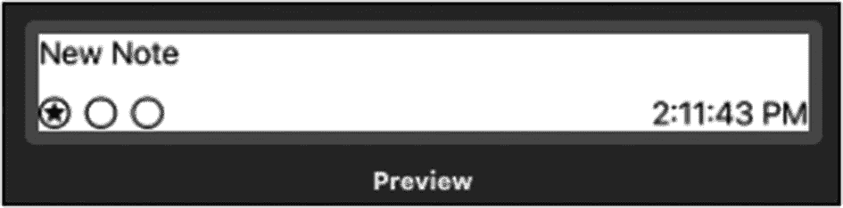

**图 8-7** 使用 sizeThatFits 的预览布局

您可能想知道它是如何确定宽度的。我们有一个 `Spacer`，所以理论上宽度可以是任何尺寸。它使用了我们选择的模拟器。如果我们为运行目标选择 iPad，`NoteRow` 将会宽得多。

而 `.environment` 修改器允许我们指定用户可能使用的环境设置的其他变体。

让我们在我们的 `NoteRow` 视图中将这些功能结合起来使用。

## NoteRow 中的文本大小

在本练习中，我们将在 `NoteRow` 中添加一个 `ForEach`，以便查看它在每个内容大小类别值下的预览。

1.  在 `NoteRow_Previews` 中添加一个 `ForEach`：

    1.  将闭包参数设置为 `sizeCat`：

```
ForEach(ContentSizeCategory.allCases,
id: \.self) {
}
```

    1.  在闭包内部，创建 `NoteRow`：

```
ForEach(ContentSizeCategory.allCases,
id: \.self) { sizeCat in
}
```

    1.  为 `NoteRow` 添加 `.previewLayout` 并设置为 `.sizeThatFits`：

```
ForEach(ContentSizeCategory.allCases,
id: \.self) { sizeCat in
NoteRow(note: Note(), df: dateFormatter)
}
```

    1.  使用 `sizeCat` 参数为 `.sizeCategory` 键路径添加环境设置：

```
NoteRow(note: Note(), df: dateFormatter)
.previewLayout(.sizeThatFits)
```

```
NoteRow(note: Note(), df: dateFormatter)
.previewLayout(.sizeThatFits)
.environment(\.sizeCategory, sizeCat)
```

更新预览以确保显示多个 `NoteRow` —— 每个大小类别各一个。

让我们更进一步，为画布中的每个项添加一个显示名称来区分它们。

1.  链式调用 `.previewDisplayName`，并再次传入 `sizeCat`。

```
.previewDisplayName("\(sizeCat)")
```

部分显示效果如图 8-8 所示。

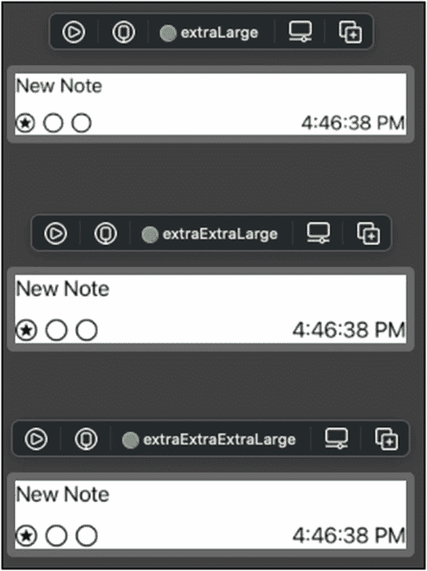

**图 8-8** 具有各种文本大小的 NoteRow

我们已经隔离了一个可以在整个应用中使用的 UI 元素。通过在预览元素中使用修改器，我们可以看到多种显示方式。

## 固定预览

从所有这些选项中，我们可能想要做一些更改。如果可能，您希望在所有情况下都让 UI 看起来很棒。这可能需要对 `NoteRow` 或 `ContentView` 进行修改。

通常，在画布中查看 `ContentView` 预览的同时看到 `NoteRow` 的变化会很有帮助。这可以通过固定预览来实现。

要固定预览，请在画布中保持想要保留的预览。然后点击画布左下角的“固定预览”按钮，如图 8-9 所示。


**图 8-9** 固定预览按钮

当预览被固定时，图标会变为蓝色（或您为 macOS 系统高亮色设置的任何颜色）。您可以通过再次点击来取消固定预览，即使是在其他预览中也可以。

这将导致在您导航到其他视图元素时，`ContentView` 预览会保持在画布顶部。当您对 `NoteRow` 进行更改时，您将看到它在 `NoteRow` 本身以及 `ContentView` 列表中的外观。

如果我更改 `updatedAtTime` 文本，为其添加 `.thin` 字体修改器，我可以看到它在 `ContentView` 列表中的显示效果，如图 8-10 所示。

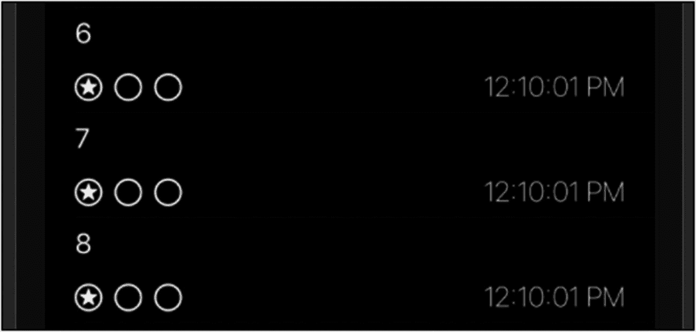

**图 8-10** ContentView 预览中更新后的 NoteRow

```
Text(df.string(from: note.updatedAtTime))
.fontWeight(.thin)
```

### 章节总结

在本章中，我们了解了如何为各种视图项创建预览项。使用修改器可以让我们看到 UI 在不同设备、环境和布局中的显示效果。

我们还使用了 `ForEach` 来为画布中的项展示多种预览。这可以通过避免在构建、安装、运行和导航检查用户界面上花费时间，大大加快开发速度。只需少量代码，您就可以看到 UI 在不同配色方案、文本大小、区域设置等下的效果。

通过将数据（一个 `Note` 实例）传递给我们的 `NoteRow`，我们为行提供了数据。然而，每次传入的都是相同的数据。接下来，我们将研究如何使用预览内容（Preview Content）和其他工具来使用更真实的数据。


## 为预览而设计

`Canvas` 是设计应用用户界面时的强大工具。然而，它的功能远不止于此。由于 `Canvas` 中显示的预览就是实际的用户界面，因此不应将其视为传统意义上的“预览”。同样地，由于它运行相关代码，也不应仅将其视为用户界面。

`Canvas` 中的预览比过去的模拟器更接近真实状态。过去使用 `Interface Builder` 时，用户界面仅仅是界面的设计稿，而以往的预览也只是一个毫无生命力的界面呈现。

正如在 `SwiftUI` 中用户界面设计已被转化为代码一样，`Canvas` 将模拟器引入了开发流程。这不仅改变了你开发应用视觉元素的方式，更应改变你组织代码的思维方式。

我们需要在开发代码时充分考虑预览功能，才能充分发挥预览的强大能力。

### 预览内容

迄今为止，在我们的应用中一直在使用默认数据。我们的预览也体现了这一局限性。如果使用更真实的数据，效果不是更好吗？但我们现在可能还无法访问数据库或服务器 API。即便能访问，我们真的希望在 `Canvas` 中每次渲染界面时都使用这些数据吗？答案很可能是否定的。

`SwiftUI` 在新项目中提供了一个名为“Preview Content”的组（见图 9-1）。

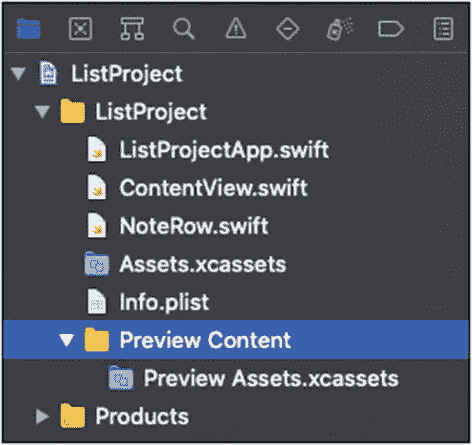

图 9-1：项目中的 `Preview Content` 组

> **注意**：  
> 对于多平台项目，不存在此组。

`Preview Content` 组内已创建了一个素材目录。你可以将用于预览的图片放入此目录。也可以将其他与预览相关的文件放入 `Preview Content` 中供预览使用。

默认情况下，根据构建设置，此组不会包含在 `Debug` 和 `Release` 构建中（见图 9-2）。

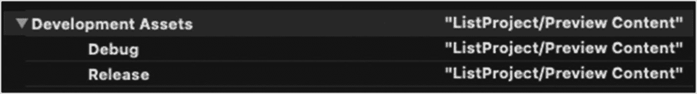

图 9-2：开发资源的构建设置

注意，被排除构建的是 `Preview Content` 组。因此，你在该组下添加的任何内容（例如文件、其他组、更多素材目录）都不会包含在测试版或发布版的构建中。

### 预览 JSON

模拟数据（尤其是来自 API 的数据）的一个好方法是使用 JSON 文件。我们可以向 `Preview Content` 中添加一个 JSON 文件供预览使用。这样我们就拥有了随时可用的数据来构建预览，并且这些数据会自动从构建中排除。

以下是一些可用于我们笔记的 JSON 数据：

```json
[
{
  "id": "FAF80C6A-F1C3-44D9-9539-D6113777520C",
  "text": "我是笔记 0",
  "updatedAtTime": 1000,
  "priority": 2,
  "image": "note1",
  "dueDate": 1598923198
},
{
  "id": "FAF80C6A-F1C3-44D9-9539-D6113777520B",
  "text": "我是笔记 1",
  "updatedAtTime": 2000,
  "priority": 1,
  "image": "note2",
  "dueDate": 620606310
}
]
```

你可能注意到，其中有一些字段是我们当前的 `Note` 类中没有的。新增的字段是 `image` 和 `dueDate`。

这些字段之前未被用于我们的界面，因此我们不需要它们，但现在我们要将它们添加进来。我们可以将其创建为文本文件并添加到项目中，或者通过右键点击 `Preview Content` 选择“New File…”菜单选项来创建（此例中选择 Empty File）。我将其命名为 `Data.json`。

### 模型

我们需要对模型稍作修改以反映这些新增内容。我们需要添加一个 `String` 类型的 `image` 属性和一个 `Date` 类型的 `dueDate` 属性。

我们可以将它们初始化为空字符串（`""`）和一个遥远的未来日期（`Date.distantFuture`）。

趁此机会，我们还可以删除 `CreateTestNotes` 函数，如图 9-3 所示。接下来我们将以不同的方式加载测试笔记。

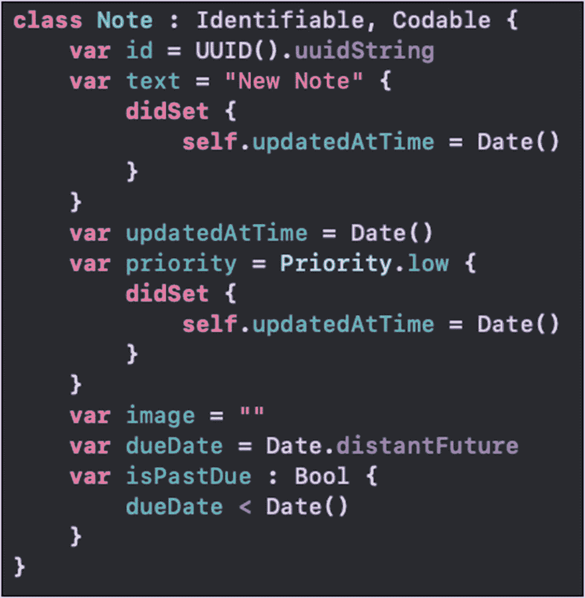

图 9-3：作为模型的 `Note` 类

由于我们要根据 JSON 文件加载 `Note` 对象的实例，我们需要让它们遵循 `Codable` 协议。属性名称与 JSON 字段名称已经匹配，因此我们只需在声明中指定即可。

我们的 `Priority` 枚举也需要通过简单地向声明中添加协议来使其遵循 `Codable`：

```swift
enum Priority : Int, Codable
```

当然，`isPastDue` 属性是计算属性。它不在 JSON 中，也不会从数据文件中解析。

现在我们的模型只关注数据。我们正在尝试将模型和视图进一步分离。这将使我们能够隔离模型、视图以及要显示的数据：即视图模型。

在处理枚举时，让我们为其添加 `CaseIterable` 协议的实现。该协议使我们能够通过名为 `allCases` 的数组属性访问枚举的各个值。我们可以用它来返回枚举的最大值。

```swift
enum Priority : Int, Codable, CaseIterable {
    case low, medium, high
    static var max : Int {
        Priority.init(rawValue:
            Priority.allCases.count - 1)!
            .rawValue
    }
}
```


### 视图模型

视图模型负责将模型中的数据映射为要显示的数据。例如，我们的优先级是一个枚举，分别映射为 0、1 和 2，对应低、中、高三个等级。但在视觉上，我们希望将其显示为星形和圆形图片。视图模型将完成这一映射工作。

新的 `NoteViewModel` 类将包含与 `Note`（模型）类相关的属性。这些属性将有效定义模型数据到视图的映射。例如，我们不再使用 priority 属性，而是使用 `priorityImages` 属性。它是一个字符串数组，代表 UI 要显示的图片名称。

此外，由于视图模型负责映射各种值，因此我们可以在此处存储 `DateFormatter`。这些属性的定义如图 9-4 所示。

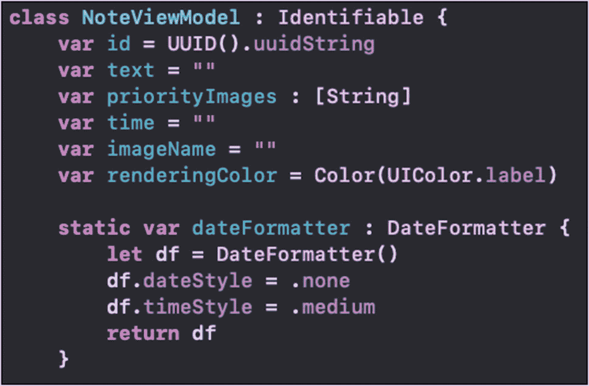

图 9-4

`NoteViewModel` 作为视图模型类

我们将遍历一个 `NoteViewModel` 实例数组，因此它需要遵循 `Identifiable` 协议，并包含一个 UUID 字符串类型的 `id` 属性。

注意 `renderingColor` 属性。我们将根据笔记中的 `isPastDue` 值来设置此值。默认的渲染颜色是 `UIColor.label`。这样可以使渲染在浅色模式下为深色，反之亦然。

显然，`NoteViewModel` 的初始化方法需要传入一个 `Note` 实例：

```
init(model : Note) {
    text = model.text
    time = NoteViewModel.dateFormatter.string(from: model.updatedAtTime)
    renderingColor = model.isPastDue ? Color.red : renderingColor
    imageName = model.image
    priorityImages = Array(repeating: "star.circle", count: model.priority.rawValue + 1)
    priorityImages += Array(repeating: "circle", count: Priority.max – model.priority.rawValue)
}
```

我们的初始化方法会存储传入的模型（`Note`）中的 `text` 属性。然后，它会根据 `Note` 中的 `updatedAtTime` 来格式化并设置 `time` 属性。

`renderingColor` 的值基于 `isPastDue`。如果已超过截止日期，则为红色；否则使用现有的默认颜色。

图片值存储在 `imageName` 属性中。

对于 `priorityImages`，我们希望重复 `star.circle` 图片，重复次数为优先级的原始值加一。因此，对于低优先级（0），我们想要一颗星。然后，用圆圈填充剩余部分（最大值减去优先级原始值）。

视图模型最后需要的是一个加载 JSON 数据的方法。我们可以在代码的其他位置执行此操作，但由于我们的目标是生成用于测试的 `NoteViewModel` 实例，因此我倾向于将其放在 `NoteViewModel` 类中，如图 9-5 所示。

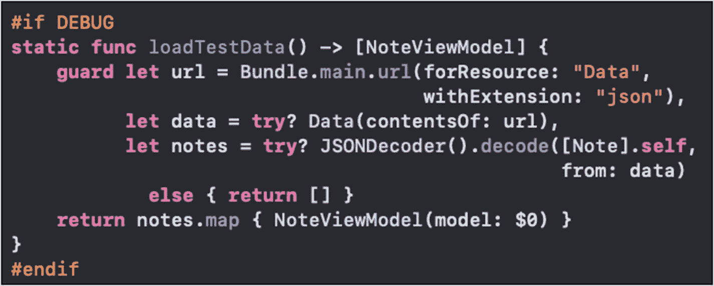

图 9-5

将测试数据加载到视图模型实例中

类似地，所有这些类、结构体和枚举都可以组织到其他文件中。你可能希望将模型类放在它们自己的组中。视图模型对象也可以放在 `ViewModel` 组中。

此方法会获取文件的 URL，将其加载到 `Data` 实例中，解析为 `Note` 实例，并将这些 `Note` 映射为 `NoteViewModel` 实例的数组。

这是一个静态函数，因此无需拥有 `NoteViewModel` 实例即可调用。

另外，请注意 `#if DEBUG` 编译条件。Swift 没有预处理器，但它在编译期间确实会处理相同的标志。在这种情况下，我们不希望将此函数包含在发布版本中。

现在我们已加载模型（`Note`）并将其转换为我们的视图模型（`NoteViewModel`）。我们需要更新视图（`NoteRow`）以使用模型视图。

### 视图

我们的 `NoteRow` 无论是所需的数据，还是将数据转换为 UI 的过程，都将得到简化。它不再需要 `DateFormatter` 对象。它只需要一个 `NoteViewModel`：

```
struct NoteRow: View {
    var noteVM : NoteViewModel
```

UI 仍将包含相同的项目：文本、优先级星形、间隔符以及更新时间。但是，现在 `NoteRow` 只需从 `NoteViewModel` 获取所需内容，并仅就布局做出决策。

使用其 `NoteViewModel` 属性，它可以获取 `text`，显示 `priorityImages` 中的三张图片，并从视图模型的 `time` 属性设置 `time`。

`NoteRow` 还将对星形和时间使用 `renderingColor`。视图模型已根据其自身逻辑确定了颜色。`body` 属性代码如下所示，如图 9-6 所示。

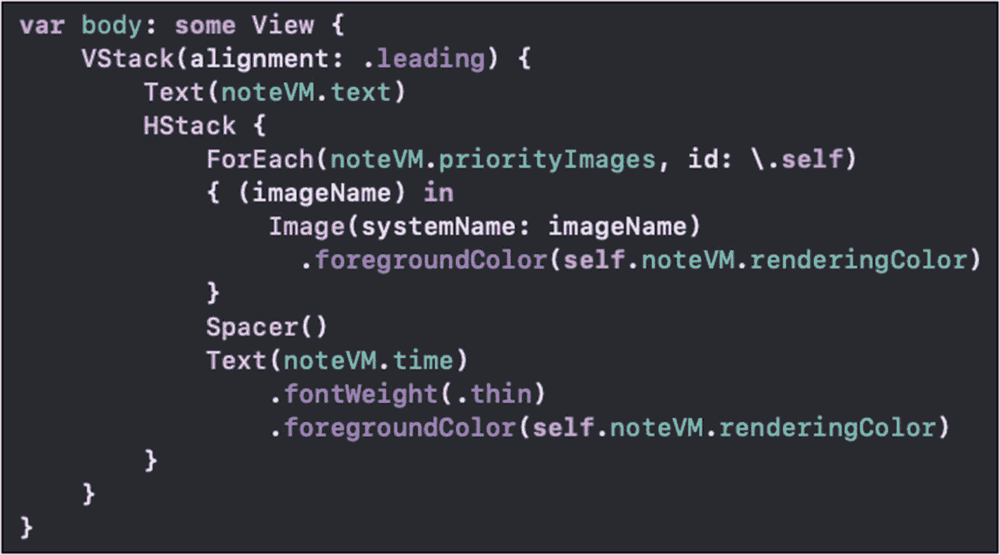

图 9-6

使用 `NoteViewModel` 属性的 `NoteRow` 的 `body` 属性

再次注意，`NoteRow` 仅根据 UI 的布局做出决策：`VStack`、`HStack`、`ForEach`、`Spacer` 等。

所有这些工作都是为了根据模型、视图和视图模型的角色来分离类。目前看来我们的收获似乎不大，但在预览方面，我们确实有所收获。

### 预览

我们的 `NoteRow_Previews` 可以变得相当简单，并且对模型和视图模型保持无关性。它基本上只需要关联并返回它们。

此外，我们可以在 `ForEach` 循环中为 JSON 数据中的每个项目创建一行。这有什么好处呢？这意味着我们可以在测试数据中创建模拟真实数据可能出现的各种变化。当数据出现新的变化（例如，一个新的优先级值）时，我们可以创建测试数据来表示它，并查看 UI 如何反应。

## 预览测试数据

在本练习中，我们将更新 `NoteRow_Previews` 结构体，以显示我们的测试 JSON 数据。我们需要加载该数据，并为文件中的每个项目创建一个 `NoteRow`。

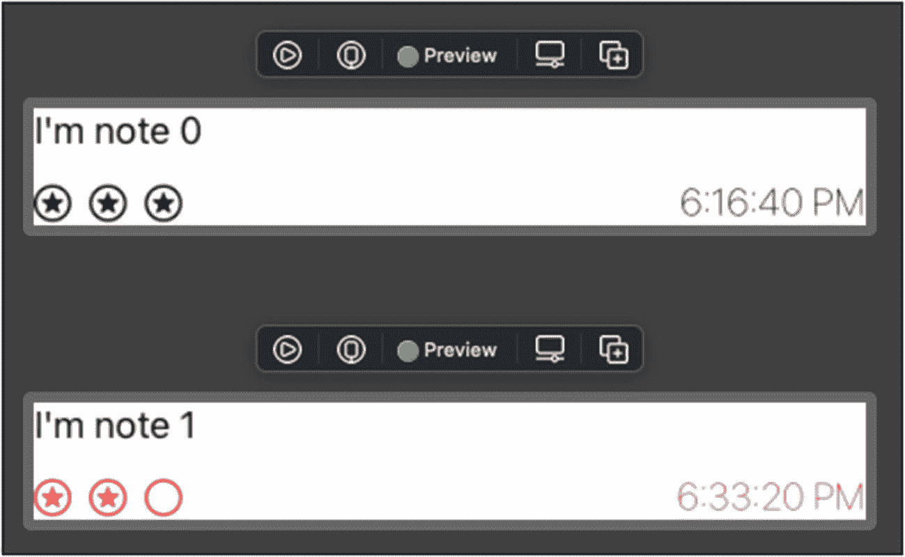

图 9-7

`NoteRow_Previews` 的预览

1.  验证预览在画布中的显示是否符合预期，如图 9-7 所示。

2.  清除 `NoteRow_Previews` 中的预览计算属性：

    ```
    static var previews: some View {
    }
    ```

3.  使用 `NoteViewModel.loadTestData()` 调用添加一个 `ForEach`：

    ```
    ForEach(NoteViewModel.loadTestData(), id: \.id)
    { (noteVM) in }
    ```

4.  在 `ForEach` 循环中，传入视图模型创建 `NoteRow` 实例：

    ```
    { (noteVM) in
        NoteRow(noteVM: noteVM)
    }
    ```

5.  使用 `previewLayout`（和/或其他修饰符）按需要显示每一行：

    ```
    NoteRow(noteVM: noteVM)
        .previewLayout(.sizeThatFits)
    ```

    **注意**：你可能需要注释掉 `ContentView` 的大部分内容才能使项目编译。对于你的 `body` 和预览计算属性，你可以暂时只返回一个 `Text` 项目。

在我的测试数据中，我使用了这样的日期：我的第一条笔记未过期，但第二条笔记已过期。

现在，我们已经加载了测试数据，并将其渲染到 `NoteRow` 的预览中。你可以创建更多的 JSON 项目，以在画布中查看行的更多变化。


### 预览资源

你可能已经意识到我们还没有使用 JSON 数据中的图片值。为了实现这一点，我们需要图片。我的测试数据包含两个 `Note` 项目，其图片值分别为 `note1` 和 `note2`。我们希望在行中也显示它们。

首先，我们需要在项目中包含这些名称的图片。我们将它们添加到预览内容组中的“Preview Assets.xcassets”目录中。这样，这些图片将不会包含在用于测试和发布的构建中。

我拖放了两张图片到“Preview Assets.xcassets”中，分别命名为 `note1` 和 `note2`，如图 9-8 所示。

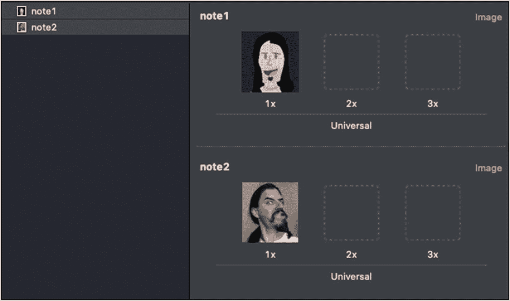

图 9-8

位于“Preview Assets.xcassets”中的 `Note1` 和 `Note2` 图片

对于我的 UI，我希望图片出现在行的左侧。为此，我将把 `VStack` 嵌入到 `HStack` 中。我可以使用 ⌘ + 单击 `VStack`，然后选择“Embed in HStack”，如图 9-9 所示。

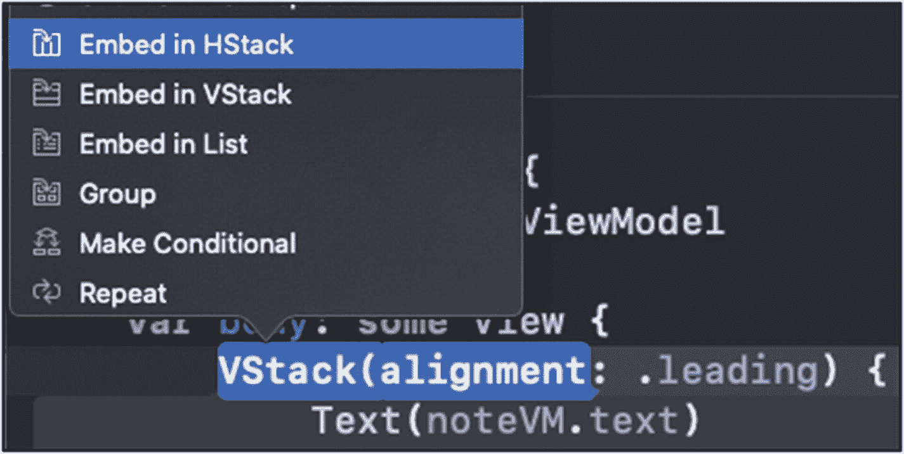

图 9-9

将 `VStack` 嵌入 `HStack`

在已嵌入的 `VStack` 上方，我将基于 `NoteViewModel` 的 `imageName` 属性添加图片。

```swift
Image(noteVM.imageName)
```

由于我的两张图片尺寸不同，预览在画布中看起来有些错位，如图 9-10 所示。

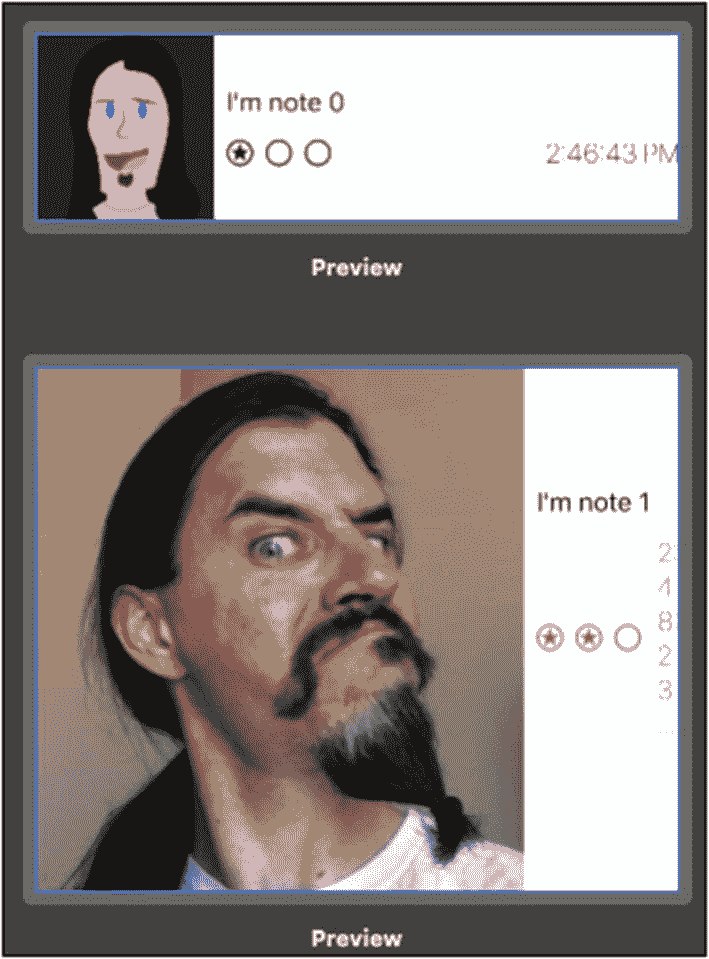

图 9-10

`NoteRow` 中的图片

我们可以对 `Image` 使用一些修饰符来使其更统一。首先，我们需要让图片可调整大小。这将确保当我们改变图片的框架时，图片也会随之调整大小。我们可以选择性地传入一些内边距和调整模式，但我们这里使用默认值。可以随意尝试这些参数。

`Resizable` 是 `Image` 元素的一个修饰符，所以我们需要先调用它。

```swift
Image(noteVM.imageName)
.resizable()
.frame(width: 100.0,height:100)
```

从 `resizable` 返回的 `Image` 也遵循 `View` 协议，因此我们可以对其使用 `.frame` 修饰符。将宽度和高度设置为合理的值将使行再次看起来很好，如图 9-11 所示。

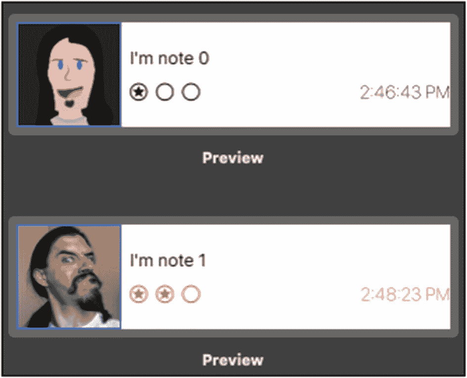

图 9-11

`NoteRow` 中图片尺寸均匀

现在，我们只需要在 `ContentView` 中使用它！

## 在 ContentView 中使用 NoteRow

我们将基本上重新开始编写 `ContentView`。起始代码可以如下所示：

```swift
struct ContentView: View {
    var body: some View {
    }
}

struct ContentView_Previews: PreviewProvider {
    static var previews: some View {
        ContentView()
    }
}
```

我们的代码将相当简单。`ContentView` 需要显示的数据。我们将使用一个 `NoteViewModel` 实例的数组。`body` 将根据数组中的视图模型创建 `NoteRow` 的 `List`。

1. 在 `ContentView` 中创建一个属性，用于存储 `NoteViewModel` 实例的数组。
2. 在 `body` 中，创建一个 `List` 项，并在其中使用 `ForEach` 循环遍历步骤 1 中的数组属性。

```swift
List {
    ForEach(items, id: \.id)
    { }
}
```

3. 在 `ForEach` 的闭包中，使用从循环传入的 `NoteViewModel`（我使用简写参数名，即 `$0`）创建 `NoteRow` 的实例。

```swift
ForEach(items, id: \.id)
{ NoteRow(noteVM: $0) }
```

```swift
@State private var items = [NoteViewModel]()
```

更新你的预览。注意没有行显示。为什么？我们没有加载测试数据。我们可以在 `ContentView_Previews` 中初始化数据，但该属性是私有的。

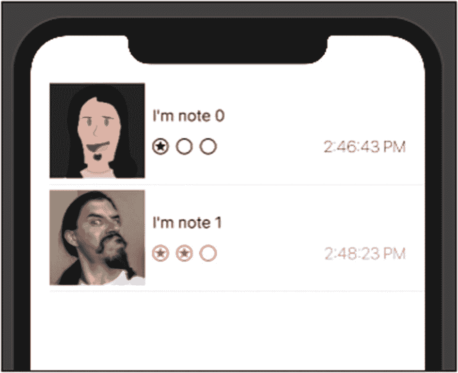

图 9-12

包含 `NoteRows` 的 `ContentView` 预览

4. 为你的 `ForEach` 添加一个 `.onDelete` 修饰符。

```swift
ForEach(items, id: \.id)
{ NoteRow(noteVM: $0) }
.onDelete { offsets in
    self.items.remove(atOffsets: offsets)
}
```

5. 使用编译条件初始化 `NoteViewModel` 实例。

```swift
#if DEBUG
@State private var items =
    NoteViewModel.loadTestData()
#else
@State private var items = [NoteViewModel]()
#endif
```

现在，当我们在调试模式下运行 App 时，它将加载测试数据。用于测试和发布的构建不会包含此编译内容，因此没有风险。

稍后，当你想针对真实数据进行测试时，可以删除或相应修改此代码。

6. 刷新预览并查看生成的单元格，如图 9-12 所示。

这看起来开始像一个真正的 App 了！它基于测试数据，但谁能说我们的数据不会存储在 App 内的一个 JSON 文件中呢？在 `ContentView` 中看到它，我们现在已经实现了 Model、View 和 View Model 的端到端工作。

## 实时模式

如果我们想看到它的实际运行效果，可以点击“实时预览”按钮。该按钮位于预览上方图标栏的右侧。它显示为一个播放按钮，如图 9-13 所示。

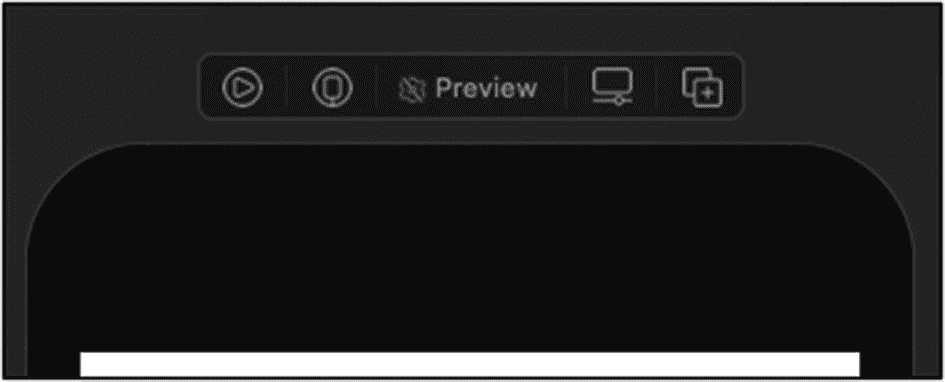

图 9-13

图标栏中的实时预览按钮

预览的变化不大。实时预览按钮从“播放”图标变为“停止”图标。但预览本身是实时的。我们可以像在模拟器或物理设备上一样与之交互。

我们可以通过滑动来删除项目，如图 9-14 所示。

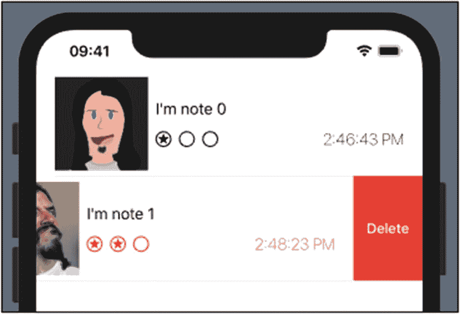

图 9-14

实时预览交互

### 章节总结

在本章中，我们向项目中的“预览内容”组添加了内容、图片和数据。我们在预览中使用了这些数据，但它不会包含在我们的构建中。正如其名称所示，它仅用于预览。

我们重构了代码，将需要从 JSON 文件存储的数据拆分到我们的 Model 类 `Note` 中。这个类与任何功能关系不大，并且与 UI 完全无关。

我们新的 `NoteViewModel` 类包含了要由 UI 显示的数据版本。这个类对属性进行了一些处理，以用于正确的视觉元素。在我们的例子中，我们将 `Note` 中的优先级设置存储为一系列用于星星/圆形图片的字符串。它还根据 `Note` 中的 `isPastDue` 确定渲染颜色。

我们的 `NoteViewModel` 通过一个 `Note` 实例创建，以获取其所需的所有数据。其 `loadTestData` 函数加载 JSON 文件数据，并创建 notes 和 `NoteViewModels` 以供预览。

我们类似地重构了 `NoteRow`，使其专注于 UI 方面。它所做的决策仅与 UI 相关。所有数据都由 View Model 提供。

现在，`NoteRow_Previews` 只是加载测试数据，并根据 View Model 实例创建 `NoteRows`。

`ContentView` 受益于这一切，现在只需拥有一个 `NoteViewModels` 数组，循环遍历它并在 `List` 中创建 `NoteRows`。

通过分离模型、视图模型和视图组件，我们可以更轻松地分别关注每个部分。这使我们能够编辑和预览各个部分，就像它们将在各自的预览中显示一样。正如我们所看到的，预览（尤其是实时模式）基本上就是 App 本身。

这带来了一些思维方式的转变。我们不再需要将开发 App 视为 UI、功能和执行。我们基本上可以同时完成这三件事。

通过专注于为预览设计代码，我们正在以精简且无缝的方式处理整个 App。


