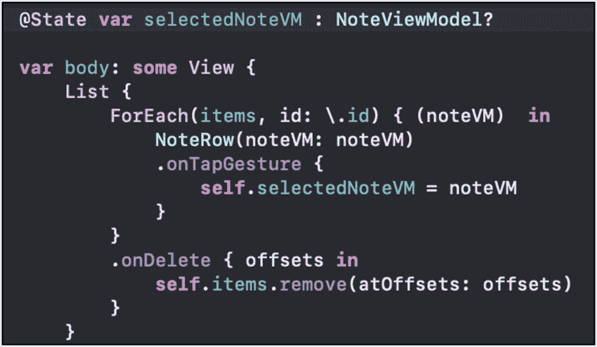
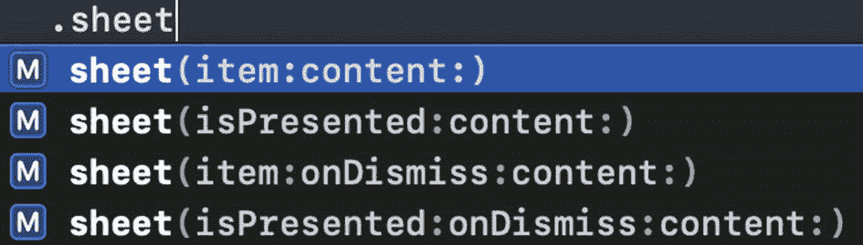
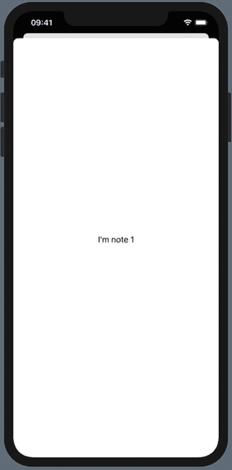
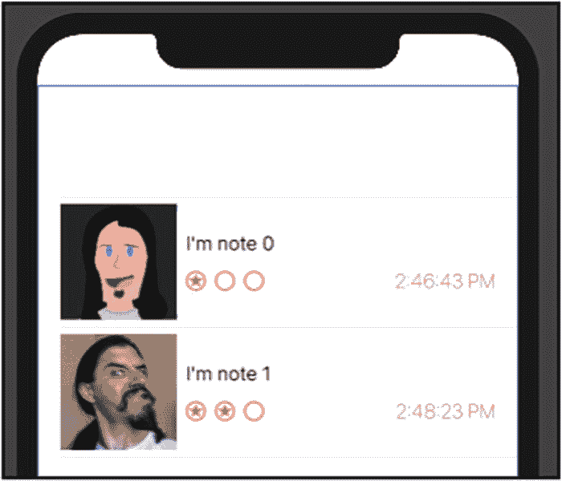
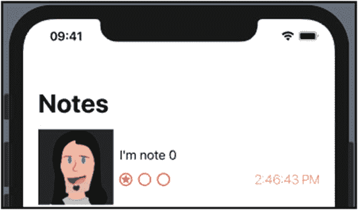
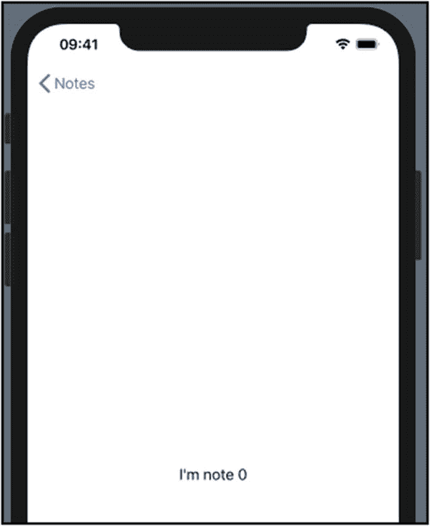

# 10. SwiftUI 导航

我们通常不希望仅仅列出项目。我们希望允许用户点击这些项目，以显示详情或编辑项目。以我们的备忘录应用为例，我们希望在点击列表项时显示详情。

毫无疑问，你对应用中的常见导航约定已经很熟悉了。我们将探讨两种最常见的方式。首先，我们来看看如何点击一行项目，并从底部以模态方式向上滑出一个视图。

其次，我们将研究如何为应用添加导航视图。这将允许视图从右侧滑入进行导航。这是查看选中项详情的标准“下钻”导航方式。

在两种情况下，我们都需要知道用户点击的是哪一行。

## 点击手势

要允许视图向上滑出，我们需要知道用户何时点击了某个项目。然后，根据选中的项目，我们需要显示相关信息。

这可以分为三个步骤：点击、识别被点击的数据，以及显示数据。

对于点击操作，我们可以在创建每一行时添加 `.onTapGesture` 修饰符。此时上下文仍在作用域内。因此，在点击手势的代码中，我们可以访问用于创建该行的相同数据。

在我们的 `ListProject ContentView` 中，有一个 `List`。为 `NoteRow` 添加点击手势的代码如下所示：

```
ForEach(items, id: \.id) { (noteVM)  in
NoteRow(noteVM: noteVM)
.onTapGesture {
self.selectedNoteVM = noteVM
}
}
```

注意，我们现在在点击手势代码中访问了备忘视图模型项目。因此，简写的参数名（`$0`）不再同时适用于两个作用域，所以我添加了 `noteVM` 参数名。

前面的代码还将 `noteVM` 存储到了 `ContentView` 的一个属性中。我们现在正是通过这个属性来保存用户所选的数据。在我们的代码中，可以像这样添加该属性：

```
var selectedNoteVM : NoteViewModel?
```

你会注意到，现在会出现一个编译错误。错误提示是“self”是不可变的。确实如此。那我们该怎么办？

幸运的是，我们最终希望基于这次点击来更新 UI。这意味着我们希望 UI 根据这次点击失效并重新渲染。简而言之，我们希望状态发生改变，以便界面得到更新。

正如我们之前所见，这里真正应该使用的是属性的绑定包装器，而不是属性本身。首先，我们需要指定该属性是选中项的数据源。

```
@State var selectedNoteVM : NoteViewModel?
```

到目前为止，代码的整体改动非常基础。我们添加了一个新属性，并在创建 `NoteRow` 时添加了点击手势，如图 10-1 所示。



图 10-1

列表项上的点击手势

现在我们有了用户选中的数据，我们需要显示一个新视图。

## 模态导航

要模态显示一个视图，我们将使用 `.sheet` 修饰符。这将是我们返回的 `View` 项上的一个修饰符。在我们的 `ListProject` 中，这个视图就是 `List` 项。因此，`.sheet` 修饰符放在 `body` 属性中 `List` 项的右花括号之后。

如果你开始在 `List` 的右花括号之后输入 `.sheet`，你会看到自动补全选项，如图 10-2 所示。



图 10-2

Sheet 修饰符的自动补全选项

第一个参数是一个绑定，可以是 `Identifiable`（项目）或 `Bool`（`isPresented`）。两者都需要一个返回 `View` 的内容闭包。如果选择 `Identifiable`，它也会被传入内容闭包中。

它们还有一个可选的 `onDismiss` 闭包。当 sheet 被关闭时，会调用该闭包。

如果你的 `@State` 属性是布尔值，你可以在需要展示 sheet 时将其设置为 `true`。然后，内容闭包将在没有参数的情况下被调用。闭包返回的视图需要在没有数据或其他属性设置的情况下创建。

在我们的例子中，我们已经有了一个用于 `selectedNoteVM` 的数据源绑定；我们可以直接用它作为绑定。一旦它被设置，sheet 闭包就会带着这个绑定被调用。在我们的例子中，这个绑定就是该行的备忘视图模型。我们可以用它来创建并返回一个视图。

例如，我们可以创建一个显示备忘视图模型文本的 `Text` 项。

```
.sheet(item: $selectedNoteVM) { (noteVM)
in Text(noteVM.text)
}
```

当点击一行时，`selectedNoteVM` 会在点击手势闭包中被设置。这个设置动作会导致 `.sheet` 闭包被调用。`selectedNoteVM` 会作为 `noteVM` 参数传入。新的 `Text` 视图就会显示出来，如图 10-3 所示。



图 10-3

点击行后显示的文本项

我们在 `List` 中的 `NoteRow` 视图上添加了一个 `.onTapGesture` 修饰符。在该闭包被调用时，我们将选中的备忘视图模型项目存储到 `@State` 数据源属性中。

当该属性被设置后，`.sheet` 闭包会带着该项目被调用。该闭包返回一个视图（在我们的例子中是 `Text` 项）以模态方式显示。要返回到之前的视图，向下滑动该视图即可将其关闭。

你可能想显示一个“关于页面”或类似的、不需要选中数据的页面。在这种情况下，布尔值绑定可能是更好的选择。

此外，你可能还想在视图关闭时执行某些操作。在这种情况下，你也可以将 `onDismiss` 闭包作为参数提供。

但是，如何处理从右侧滑入视图的导航呢？为此，我们需要一个 `NavigationView`。

## 导航视图

使用导航视图来显示详情并不复杂。然而，它与我们之前看到的模态方式截然不同。

我们不使用 `.sheet` 修饰符，因此不需要 `@State` 属性包装器。既然不需要那个，我们也就无需设置它。这意味着我们不需要 `.onTapGesture` 修饰符。所以我们可以移除所有这些：`selectedNoteVM` 属性以及 `.sheet` 和 `.onTapGesture` 修饰符。

`ContentView` 中的 `body` 属性现在又回到了只有 `List` 和带有 `.onDelete` 修饰符的 `ForEach`。

```
var body: some View {
List {
ForEach(items, id: \.id) { (noteVM) in
NoteRow(noteVM: noteVM)
}
.onDelete { offsets in
self.items.remove(atOffsets: offsets)
}
}
}
```

我们希望将用作导航起点的任何视图包裹在一个 `NavigationView` 中。由于它是一个 `View`，我们可以从 `body` 属性中将其返回。

如果我们简单地将 `List` 包裹在 `NavigationView` 中，预览效果在画布上会如图 10-4 所示。



图 10-4

包裹列表的导航视图

注意，现在顶部出现了一个导航栏，但它是空的。标题是通过对 `NavigationView` 中包含的项添加修饰符来设置的。

在我们的 `ListProject` 中，`List` 就是被包含的项。我们使用带有字符串（例如 `Notes`）的 `.navigationTitle` 在导航栏中设置标题。

```
NavigationView {
List {
ForEach(items, id: \.id) { (noteVM) in
NoteRow(noteVM: noteVM)
}
.onDelete { offsets in
self.items.remove(atOffsets: offsets)
}
}.navigationTitle("Notes")
}
```

现在，我们的导航栏就有了标题，如图 10-5 所示。



图 10-5

导航栏标题

导航栏还有其他修饰符。除了标题之外，还有用于设置样式、返回按钮、左右项目等等的修饰符。

现在我们有了 `NavigationView`，让我们来看看如何进行导航。


### 导航链接

对于模态导航，我们使用了 `.onTapGesture` 修饰符。在相关的闭包中，我们设置了一个状态属性。这将调用 `.sheet` 修饰符，并显示其闭包返回的视图。

对于 `NavigationView`，我们将创建 `NavigationLink`。`NavigationLink` 遵循 `View` 协议。这意味着我们可以在 `List` 中使用它。我们将返回 `NavigationLink` 实例，而不是 `NoteRow`。并且每个 `NoteRow` 都将位于 `NavigationLink` 内部。

`NavigationLink` 的初始化方法允许设置多个参数。具体来说，它们接收目标（destination）和标签（label）。目标是在点击项目时显示的视图。在我们的 `ListProject` 中，我们希望显示选中笔记行的一些详细信息。

标签参数是一个闭包。该闭包返回一个视图，作为可点击的项目来显示。在我们的例子中，这个视图就是行本身。

## 为 ListProject 添加导航

本练习将逐步指导你为 `ListProject` 应用程序添加导航。添加的导航将从右侧滑入以显示详细信息。

我们将在本练习中使用 `NavigationView` 和 `NavigationLink`。

前两个步骤是实现前面讨论过的内容。如果你一直在跟随学习，可能已经完成了这些步骤。

1.  将现有的 `List` 项包裹在 `NavigationView` 中（除非你之前跟随学习时已经这样做了）。

1.  为 `List` 视图添加导航栏标题修饰符（除非你之前跟随学习时已经这样做了）。

```
NavigationView {
List {
ForEach(items, id: \.id) { (noteVM)   in
NoteRow(noteVM: noteVM)
}
.onDelete { offsets in
self.items.remove(atOffsets: offsets)
}
}
}
```

1.  更新预览，并验证其看起来是否与图 10-5 相似。

2.  在 `List` 的 `ForEach` 内部，创建一个 `NavigationLink`，其目标是一个 `Text` 视图，标签闭包返回 `NoteRow`。

```
NavigationView {
List {
ForEach(items, id: \.id) { (noteVM)   in
NoteRow(noteVM: noteVM)
}
.onDelete { offsets in
self.items.remove(atOffsets: offsets)
}
}.navigationTitle("笔记")
}
```



图 10-6：应用内导航

1.  运行应用程序（模拟器、真机或实时预览模式），验证点击项目是否显示如图 10-6 所示的详细信息。

```
NavigationLink(destination: Text(noteVM.text)) {
NoteRow(noteVM: noteVM)
}
```

请注意，导航会自动包含返回按钮。并且返回按钮的标题与导航栏标题相同。

正如你所期望的，点击返回按钮会返回到上一个视图。

本练习展示了如何快速便捷地将导航从 `List`（或其他视图）添加到应用程序中。

### 章节总结

在本章中，我们探讨了应用中两种常见的导航方式。对于模态导航，我们使用了 `.sheet` 修饰符。我们将此修饰符添加到了 body 参数返回的视图上。

`.sheet` 修饰符通过绑定到一个属性来确定何时显示。我们使用了一个 `@State` 属性包装器来包装笔记视图模型，以设置此条件。

为了确定用户何时点击了某一行，我们在每一行上使用了 `.onTapGesture` 修饰符。这提供了一种重新显示用户界面并将必要数据传递给 `.sheet` 闭包的方法。

对于使用视图栈的分层/下钻式导航，我们使用了 `NavigationView`。`NavigationView` 中包含的视图使用 `.navigationTitle` 修饰符来设置视图的标题。

`NavigationView` 提供了导航的手段。`NavigationLink` 提供了用户交互能力。列表项的 `ForEach` 创建行视图。`NavigationLink` 也实现了 `View` 协议，可以作为行项使用。

`NavigationLink` 需要知道显示什么标签（视图）供用户点击。它还需要一个目标（视图），在点击时显示。我们使用 `NoteRow` 作为可点击区域。当被点击时，我们提供一个包含笔记文本的 `Text` 项来显示。

我们提供了一个简单的视图（即 `Text`）作为目标。当然，你也可以使用更有用、更有趣的视图来代替。

