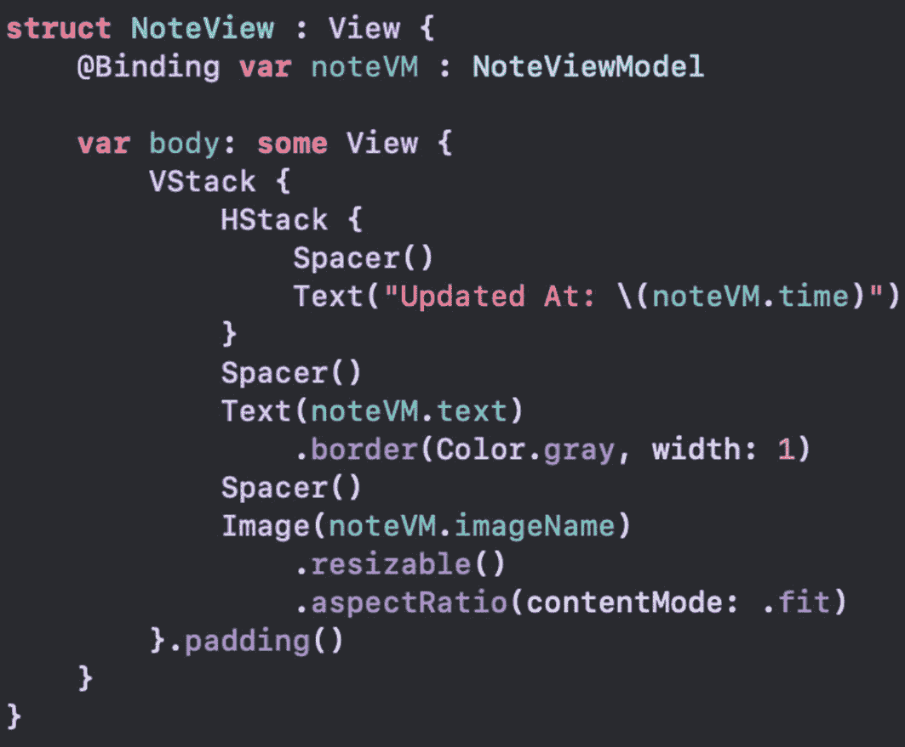
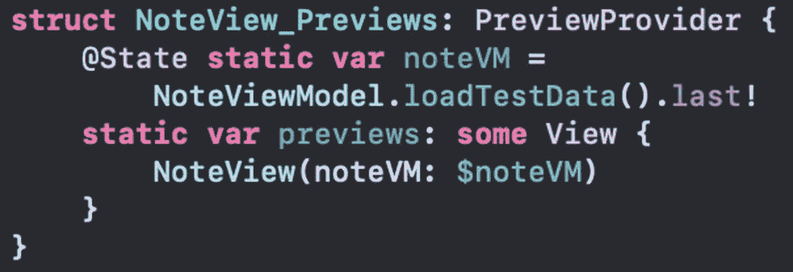
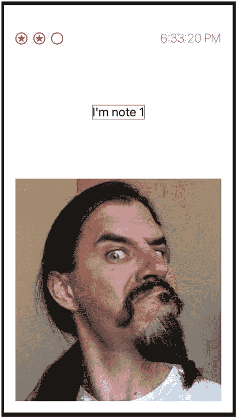
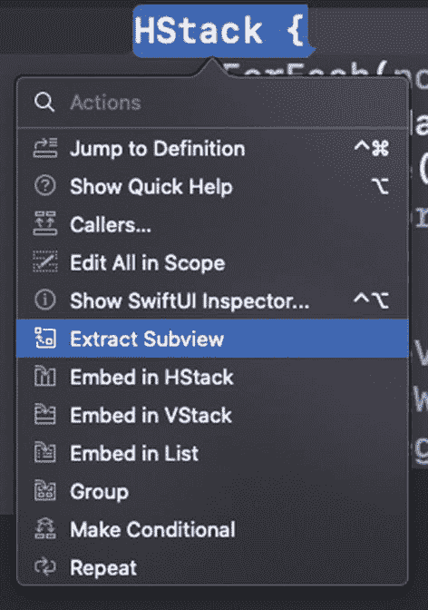
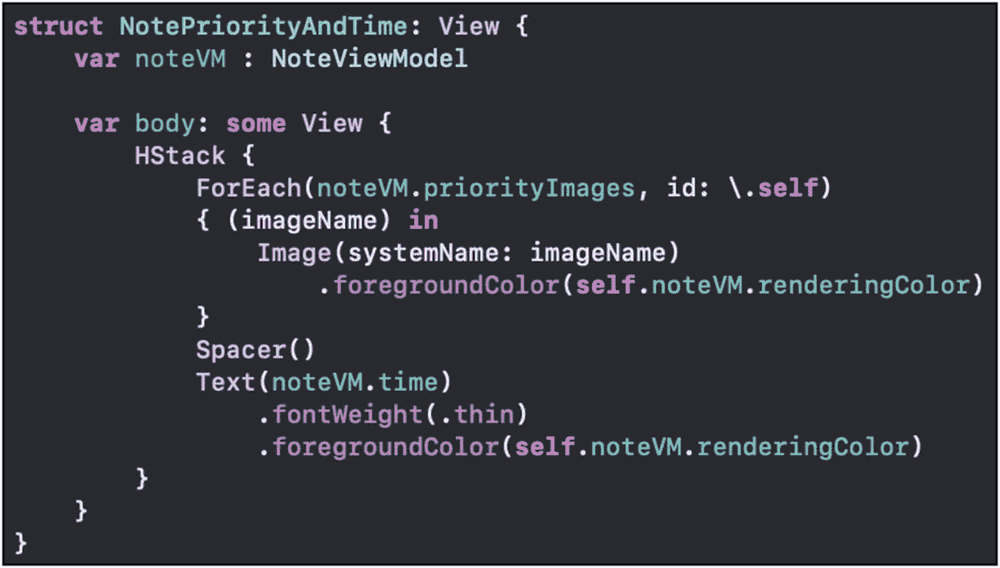
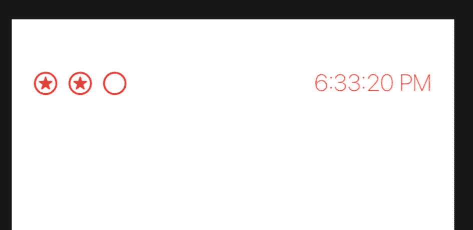
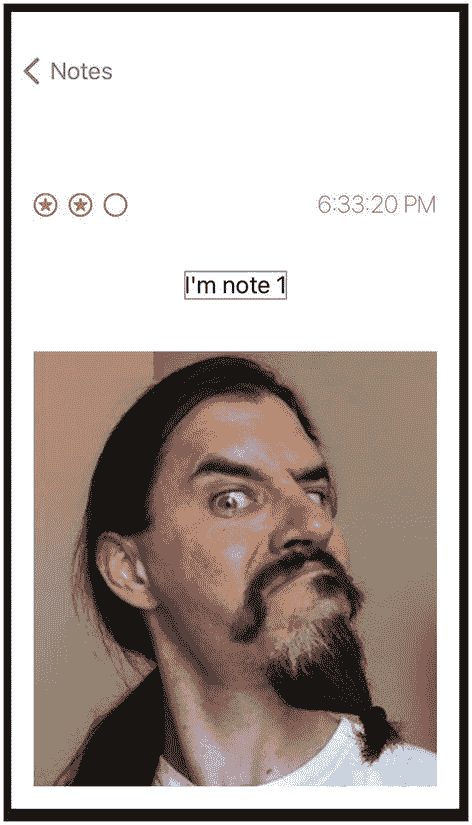
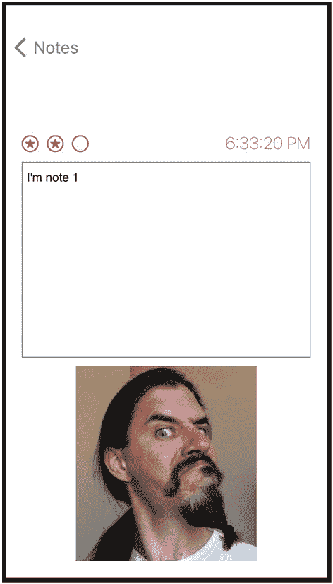

# SwiftUI 中的 UIKit

由于各种原因，你可能会有在 SwiftUI 应用中使用 UIKit 的时候。这没问题。

你可能有一个需要使用的现有 UI。也许你没有时间更新它，或者根本不想更新它。无论是现有的视图还是你自定义的视图，都可以实现。此外，任何现有的约束都会得到尊重。

在本章中，我们将探讨如何将现有的 UIKit 类整合到 SwiftUI 中。这已经为你考虑过了。这不是一个临时的解决方案，甚至也不被反对。

虽然有一些工作要做，但步骤已经为你规划好了。

## `UIViewRepresentable`

SwiftUI 提供了一个专门用于将 `UIView` 实例纳入代码的协议。基本上，我们将创建一个视图结构体，它返回一个 `UIView` 类。

`UIViewRepresentable` 协议继承了 `View`。然而，它指定要成为一个不实现 `body` 计算属性的视图。所以它是一个视图，但和我们之前见过的不同。

相反，该协议定义了一个需要实现的函数。`makeUIView` 函数将 UIKit 类整合到 SwiftUI 中，需要返回一个 `UIView`。就这么简单。

它还接收一个上下文（Context）参数，用于检索你可能需要的任何值。

当状态发生变化并且需要更新 UI 时，还有另一个函数：`updateUIView`。当任何绑定发生变化时，会调用此函数。在函数代码中，你将根据这些变化以编程方式更新 UI。

可选地，你可以实现 `dismantleUIView`。这在清理内存时被调用。如果你需要在 `UIView` 被移除时执行任何最后时刻的操作，这正是时机。

我们不再在点击行时显示笔记的文本，而是显示笔记的详细信息。

如果你在 macOS 上工作，类似的协议是 `NSViewRepresentable`。类似地，WatchKit 视图可以与 `WKInterfaceObjectRepresentable` 一起使用。


### `NoteView`

我已在项目中添加了`NoteView`。它是一个基础的`View`结构体，用于显示部分`Note`信息，如图 11-1 所示。



**图 11-1** `NoteView` 代码

`NoteView`有一个用于`NoteViewModel`的绑定属性。它在主体中用于显示详细信息。`VStack`包含用于更新时间和笔记文本的`Text`项，以及用于相关图片的`Image`项。

预览代码会加载测试数据并显示一个条目。代码如图 11-2 所示。



**图 11-2** `NoteView` 预览代码

Canvas 中的预览如图 11-3 所示。



**图 11-3** `NoteView`

现在，让我们在`List`中点击某一行时使用这个视图。

### 使用`NoteView`显示详情

目前，`ContentView`中的`ForEach`在点击某一行时使用`Text`项来显示笔记文本。我们想将其改为使用`NoteView`。

但是，如果你仅将目标改为`NoteView`，就会收到一个错误。

```
NavigationLink(destination:
NoteView(noteVM: noteVM)) {
NoteRow(noteVM: noteVM)
}
```

这是因为`ForEach`中的`noteVM`不可绑定。它只是一个局部作用域的参数。它需要是 items 数组属性中绑定实例的一个副本。

1. 将`ForEach`改为遍历数组的索引。

2. 将目标参数改为`NoteView`。

```
NavigationLink(destination:
NoteView(noteVM: self.$items[noteIndex])) {
NoteRow(noteVM: noteVM)
}
```

3. 将`NoteRow`的创建改为使用索引。

```
NavigationLink(destination:
NoteView(noteVM: self.$items[noteIndex])) {
NoteRow(noteVM: self.items[noteIndex])
}
```

4. 运行应用并验证列表看起来相同，详情如图 11-3 所示。

```
ForEach(items.indices) { (noteIndex) in
```

通过创建一个相当简单的新视图，我们可以显示`Note`的详情。我们必须修改`ForEach`以使用模型数据，这样绑定才能生效。

## 提取视图

我们的笔记详情中缺少的一项内容是优先级。当然，如果能加上它会更好。但如果我们能重用已经写好的代码，那就更好了。

我们可以通过将`NoteRow`的那部分提取到它自己的`View`结构体中来实现这一点。在`NoteRow`中，我们有一个`HStack`，它包含了优先级星标图片和更新时间。如果我们按住 Command 键并点击（⌘ + 点击）`HStack`，会看到一个菜单，如图 11-4 所示。



**图 11-4** 按住 Command 键点击菜单

我们想要提取视图，菜单中正好有一个名为“提取视图”的项。点击该项，它就会提取代码，并让我们为新的`View`结构体设置名称。我将它命名为`NotePriorityAndTime`。

但是，我们的新`View`无法访问`noteVM`值，因此会出现编译错误。这没问题。我们可以为该视图以及创建它的调用添加这个属性。新结构体的代码如图 11-5 所示。



**图 11-5** `NotePriorityAndTime` 视图结构体

记得要在`NoteRow`的`VStack`中用新的`noteVM`参数更新创建语句。

```
NotePriorityAndTime(noteVM: noteVM)
```

如果你现在运行应用，它应该看起来和之前一样。此外，我们现在有了一个新的`View`，可以将其包含在`NoteView`界面中。根据你选择组织代码的方式，你可能需要为这个`View`创建一个新文件。

在`NoteView`中，让我们替换当前的`HStack`代码。

```
HStack {
Spacer()
Text("Updated At: \(noteVM.time)")
}
```

我们可以用刚刚创建的新`View`替换整个`HStack`。

```
NotePriorityAndTime(noteVM: noteVM)
```

之前只有时间的地方，现在我们有了使用渲染颜色的优先级和时间，如图 11-6 所示。



**图 11-6** `NoteView` 预览中的 `NotePriorityAndTime`

如果我们运行应用并点击某一行，就会看到笔记的详情。现在它包含了优先级和时间，以及文本和图片，如图 11-7 所示。



**图 11-7** 当前笔记详情界面

这对于显示详情来说可能还行，但效果并不太好。而且它也不允许编辑笔记。让我们回到`UIViewRepresentable`主题，使用`UITextView`来显示笔记文本。

## SwiftUI 中的 `UIView`

我们当前的`NoteView`使用`Text`来显示笔记视图模型中的文本。这不允许用户在应用中编辑文本。Swift 有一个用于此目的的`TextEditor`。然而，它仅在 iOS 14 中可用。

为了实现向后兼容，让我们使用一个在 iOS 13 中也能运行的解决方案。我们将使用`UITextView`。因为它属于 UIKit，我们可以使用`UIViewRepresentable`并将其封装在一个`View`结构体中。

### SwiftUI 中的 `UITextView`

为了在 SwiftUI 中使用`UIView`子类，我们需要使用`UIViewRepresentable`。因此，我们将创建一个符合该协议的新结构体。

1. 创建一个新的`TextView`结构体（这可以放在与`NoteView`相同的文件中，也可以放在另一个文件中）。

2. 为要显示的文本创建一个`@Binding`属性。

```
struct TextView: UIViewRepresentable {
@Binding var text: String
}
```

3. 实现`makeUIView`函数，返回`UITextView`。

```
func makeUIView(context: Context) -> UITextView {
return UITextView()
}
```

```
struct TextView: UIViewRepresentable {}
```

可选地，我们可以在返回之前设置文本视图的其他属性，例如字体、颜色等。

4. 实现`updateUIView`，如果文本属性在结构体外部被更新，则更新界面。

```
func updateUIView(_ tvNote: UITextView,
context: Context) {
tvNote.text = text
}
```

5. 将`NoteView`主体中的`Text`项替换为`TextView`。



**图 11-8** 包含`UITextView`的`NoteView`

6. 预览或运行应用，可以看到界面与图 11-8 相同。

```
TextView(text: $noteVM.text)
```

在这个练习中，我们在 SwiftUI 中添加了一个`UITextView`。通过创建一个实现`UIViewRepresentable`的新结构体，我们将`UIView`封装在了一个`View`中。通过实现该协议，我们提供了`UIView`（即`UITextView`），并在值可能发生变化时更新了界面。

你可能会注意到，你也可以在文本视图中编辑文本。但是，这些更改不会反映到之前的视图中。这是因为我们在`NoteRow`中使用了绑定属性包装器。因此，更改不会使该界面失效并被重新创建。我们将在下一章中更新这一点。


### 章节摘要

在某些情况下，你可能需要使用 UIKit 对象。SwiftUI 通过 `UIViewRepresentable` 提供了这一能力。

通过在结构体中实现该协议，你可以实现相应的方法，将 UIViews 作为 `View` 对象提供。当需要创建 `UIView` 时，会调用 `makeUIView` 函数。如果绑定值发生变化，则会调用 `updateUIView` 函数。

作为可选操作，你可以实现 `dismantleUIView`，以便在 `UIView` 从用户界面中移除时进行清理。

我们还练习了从现有代码中提取视图。

希望你能明白，无论你是要使用现有的视图，还是需要一个 UIKit 视图，在 SwiftUI 中都很容易实现。

在接下来的内容中，我们将探讨更多利用现有类与 SwiftUI 协同工作的方法。

