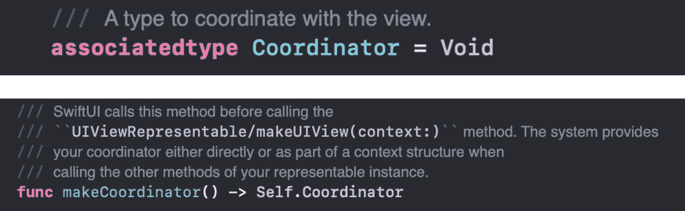
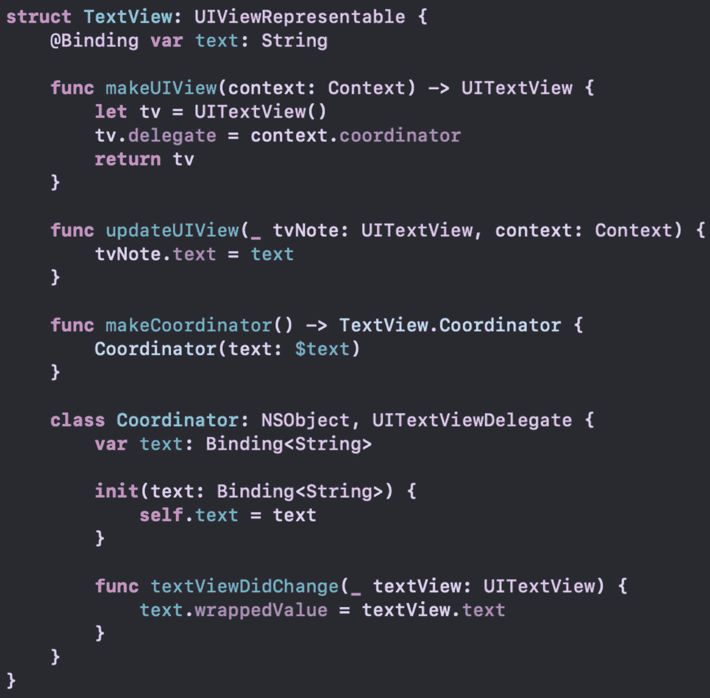
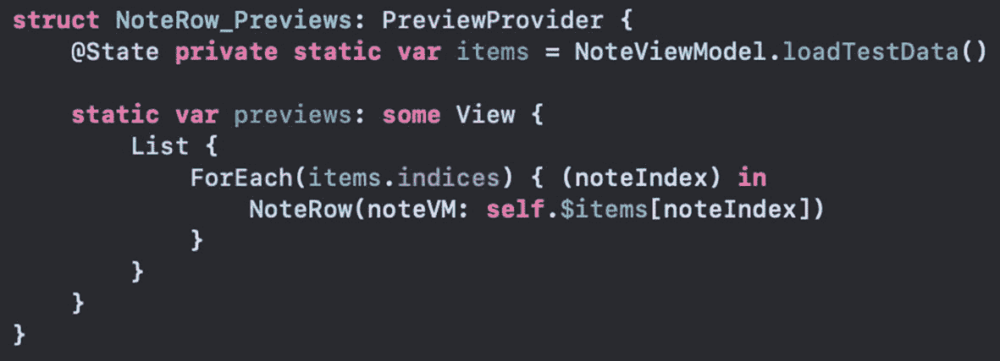
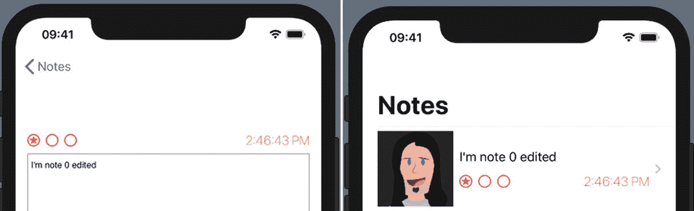

# 12. 通过协调器从 UIKit 获取数据

在上一章中，我们了解了如何在 SwiftUI 中使用 `UIView`。在我们的项目中，我们使用了 `UITextView`。这类视图允许应用显示文本。同时，它也允许用户编辑应用需要知晓的文本内容。

UIKit 提供了多种从 UI 获取用户数据的选项。在某些情况下，控件会使用带有目标/动作模式的事件。在其他情况下，例如文本视图，我们也有基于委托模式的机制。

上一章向我们展示了如何显示信息。在本章中，我们将探讨如何将 UIKit 控件的用户输入获取到 SwiftUI 代码中。

## UIViewPresentable 协议

你在上一章查看 `UIViewPresentable` 协议时，可能还注意到了其他一些东西。如果我们再次审视，会看到提到了 `Coordinator` 以及创建它的函数，如图 12-1 所示。



图 12-1

`UIViewPresentable` 中的 `Coordinator` 和 `makeCoordinator`

`makeCoordinator` 的定义返回一个 `Self.Coordinator`。你可以在上面的代码中看到 `Coordinator` 被类型别名为 `Void`。然而，在我们的代码中，我们将定义一个实际的 `Coordinator` 类。我们对 `makeCoordinator` 函数的实现将返回我们定义的类型。

## 协调器

协调器用于实现在 UIKit 中你可能熟悉的常见模式。它在 UIViews 和 SwiftUI 之间进行协调。通过使用协调器，我们可以采用 UIKit 中的委托、数据源以及目标/动作模式。

那么，我们需要我们的协调器做什么呢？在我们的 `ListProject` 应用中，我们使用了一个 `UITextView`。我们需要知道用户何时更改了文本视图中的文本。为此，我们可以使用 `UITextView` 的委托。

通常，你会将委托赋值给你的 `ViewController` 并实现 `UITextViewDelegate`。然后，你的控制器可以实现 `textViewDidChange` 函数并访问 `text` 属性。

在 SwiftUI 中，我们将让协调器作为委托。这意味着我们新的 `Coordinator` 类需要遵守该委托，并实现 `textViewDidChange`（以及可能的其他）函数。

我们类的声明可能像这样：

```
class Coordinator: UITextViewDelegate {...}
```

> **注意：** 我将我的 `Coordinator` 定义为一个**位于** `TextView` 结构体**内部**的类。

如果我们添加这个，会立即得到一个错误。`UITextViewDelegate` 继承自 `UIScrollViewDelegate`，而后者继承自 `NSObjectProtocol`。我们的 `Coordinator` 并不遵守 `NSObjectProtocol`。

我们可以添加大量代码来遵守 `NSObjectProtocol`，或者我们可以选择继承自 `NSObject`。由于我们的 `Coordinator` 并未继承自其他类，我们将选择后者。

```
class Coordinator: NSObject, UITextViewDelegate {...}
```

问题解决了。

## 绑定属性包装器

现在，我们的 `TextView` 有了一个协调器。我们的 `TextView` 实例对传入的文本有一个绑定。我们需要这个 `String` 在用户输入时被更新。这就是我们协调器的工作。

作为委托，`Coordinator` 将实现 `textViewDidChange`，并且需要存储更新后的文本。所以，我们的 `Coordinator` 类也需要一个对文本的绑定。

```
@Binding var text: String
```

为了确保属性被设置，我们需要一个将绑定作为参数的初始化器。我们之前接触的都是自动拥有成员逐一构造器的结构体。但我们的 `Coordinator` 不是这样，因为它是一个类。

不过，将绑定作为参数传入的语法略有不同。`@Binding` 属性包装器本身只是一个带有泛型的结构体。因此，我们的参数类型可以这样明确地写出初始化器。

```
init(text: Binding<String>) {...}
```

现在，我们的参数类型是 `Binding<String>`，但我们的属性是一个带有属性包装器的 `String`。如果我们尝试赋值给 `self.text`，会得到一个错误，提示我们无法将参数赋值给一个 `String`。

作为属性包装器，编译器会合成对应的后备存储属性。所以，我们的 "text" 属性有一个名为 "`_text`" 的后备存储属性，我们可以访问它。

```
init(text: Binding<String>) {
    _text = text
}
```

我们的协调器有一个绑定属性，并且在初始化器中进行了设置。由于我们声称遵守 `UITextViewDelegate`，我们可以实现我们感兴趣的函数：`textViewDidChange`。在函数中，我们可以设置属性包装器的包装值。

```
func textViewDidChange(_ textView: UITextView) {
    _text.wrappedValue = textView.text
}
```

当文本改变时，我们设置该属性的包装值。

## 将协调器作为委托

现在，我们有了一个能完成我们所需工作的协调器。我们需要实现 `makeCoordinator`。如果我们实现了它，它将在 `makeUIView` 之前被调用。协调器被设置为传递给 `makeUIView` 的 `Context` 上的一个属性。通过访问我们的 `Coordinator` 实例，我们可以将其设置为我们的 `UITextView` 的委托属性。

```
func makeUIView(context: Context) -> UITextView {
    let tv = UITextView()
    tv.delegate = context.coordinator
    return tv
}
```

> **注意：** 下面的返回类型是 `TextView.Coordinator`，因为 `Coordinator` 类被定义在 `TextView` 结构体**内部**。

```
func makeCoordinator() -> TextView.Coordinator {
    Coordinator(text: $text)
}
```

关键是，我们定义的 `Coordinator` 类就是 `UITextView` 的委托。创建协调器的机制通过协议函数 `makeCoordinator` 内建。访问已创建的 `Coordinator` 的机制由 `Context` 提供。

`Context` 还具有用于 `Transaction` 和 `Environment` 的属性。`Transaction` 包含动画信息。`Environment` 包含环境变量。这样，你的 `UIView` 就能像 SwiftUI 一样访问这些值。


## 替代语法

如果直接访问底层存储属性感觉不太对劲，那也没关系。还有另一种传入和访问属性的方法。对于 `text` 属性，我们可以不使用 `@Binding` 语法，而是采用与 `init` 参数相同的语法。

```
class Coordinator: NSObject, UITextViewDelegate {
var text: Binding
```

然后，初始化器和 `textViewDidChange` 可以更直接地使用该属性。

```
init(text: Binding) {
self.text = text
}
func textViewDidChange(_ textView: UITextView) {
text.wrappedValue = textView.text
}
```

无论是哪种情况，我们的 `TextView` 都不必有所变化。两种方式都可行，但现在代码感觉更清爽了。我们就在练习中使用这个版本吧。

## `TextView` 的协调器

我们将为 `TextView` 添加一个协调器。它将作为我们创建的 `UITextView` 的委托。`Coordinator` 将是一个独立的类，并在 `makeCoordinator` 协议函数中实例化。

**注意** 如果你一直在跟着更新代码，那么你已经完成了这个练习。否则，以下步骤将阐明 `TextView` 的 `Coordinator` 所需的更改。

1.  在 `TextView` 内部声明 `Coordinator` 类，使其继承自 `NSObject` 并遵循 `UITextViewDelegate` 协议。

1.  为 `Coordinator` 添加一个 `Binding<String>` 类型的 `text` 属性。

```
class Coordinator: NSObject, UITextViewDelegate {}
```

1.  在 `Coordinator` 中实现一个初始化器，该初始化器接收一个 `Binding<String>` 参数并将其赋值给类属性。

```
class Coordinator: NSObject, UITextViewDelegate {
var text: Binding
}
```

1.  在 `Coordinator` 中实现 `textViewDidChange` 以设置封装值。

```
init(text: Binding) {
self.text = text
}
```

1.  在 `TextView` 类中实现 `makeCoordinator`。

```
func textViewDidChange(_ textView: UITextView) {
text.wrappedValue = textView.text
}
```

1.  将上下文中的协调器设置为所创建 `UITextView` 的委托。

```
func makeCoordinator() -> TextView.Coordinator {
Coordinator(text: $text)
}
```

```
func makeUIView(context: Context) -> UITextView {
let tv = UITextView()
tv.delegate = context.coordinator
return tv
}
```

整个 `TextView` 结构体代码应如图 12-2 所示。



**图 12-2** — 包含 `Coordinator` 类的 `TextView`

1.  运行应用，并使用断点验证每个函数是否被调用以及文本是否更新。

现在，当文本发生变化时，你的 UI 会通过协调器更新 `TextView`。我们将该值存储在绑定属性中，该属性会传回给真相源。

## 更新列表

如前一章所述，列表并未使用编辑后的值更新行。在我们的 `ContentView` 的 `List` 中，我们并没有将笔记项传递给绑定属性包装器。

我们可以更改 `NoteRow`，使其 `noteVM` 属性具有 `@Binding` 属性。然而，这会导致代码在多个地方出错。别担心。我们可以做到。

主要只有两处更改。第一处是给 `NoteRow` 的属性添加 `@Binding`。

```
struct NoteRow: View {
@Binding var noteVM : NoteViewModel
```

这会破坏 `NoteRow` 的预览。你需要更新那段代码，也传入一个绑定属性。它可以模仿 `ContentView` 的 `ForEach` 现在使用索引的方式，如图 12-3 所示。



**图 12-3** — 更新后的 `NoteRow` 预览

请注意，现在创建 `NoteRow` 时传入了一个 `self.$items` 值。这个绑定也是我们在 `ContentView` 的 `List` 中所需要的。

在 `ContentView` 的 `List` 中，我们需要在列表创建时传入一个绑定。我们只需在创建 `NoteRow` 的项前面加一个 `$` 符号即可。

```
NoteRow(noteVM: self.$items[noteIndex])
```

现在，当我们运行应用并编辑一个笔记时，它将反映在 `List` 中，如图 12-4 所示。



**图 12-4** — 更新后的笔记

## 本章小结

通过使用 `UIViewRepresentable` 协议中的 `Coordinator` 机制，我们现在可以编辑笔记了。此更改也会反映在主 `ContentView` 的 `List` 中。

协调器的概念已内置于协议以及传递给相关函数的 `Context` 中。然而，我们创建的类能够满足我们的需求。在我们的例子中，它需要遵循 `UITextViewDelegate` 协议。这还需要遵循 `NSObjectProtocol` 协议，因此我们继承了 `NSObject`。

我们需要 `text` 属性来进行绑定，但我们也可以选择是否绑定其他属性。我们还可以实现其他协议，或者将该类用作其他 `UIView` 实例的委托或数据源。

就我们的用途而言，我们只是按规则行事。我们在需要时创建了协调器，将其设置为委托，并处理了文本更改。

你可能和我一样在想，如果在 `makeUIView` 中直接创建一个 `Coordinator` 实例并将其设置为委托，会怎么样？能行得通吗？答案是：既行得通也行不通。

问题在于文本视图的委托属性是弱引用。这意味着在 `makeUIView` 调用返回后，它会被立即释放。

如果我让协调器成为 `TextView` 的一个属性呢？可以，但是你无法在其中声明中实例化它，因为它需要 `text` 属性。

如果我让它成为一个可选属性，并在 `makeUIView` 中实例化它呢？可以，但这样你就修改了 `self` 的成员。而且如果你将 `makeUIView` 标记为 `mutating`，你就破坏了与 `UIViewRepresentable` 协议的适配。

如果我让 `Coordinator` 成为 `TextView` 外部的变量——也许是全局变量或类似的呢？是的，这也可以。虽然过程比较麻烦，但确实可行。如果你想传入一个 `Coordinator`，这或许是可行的方法。

这确实说明了一个有趣的点：我们使用的 `Coordinator` 设置并非必须的。可以通过其他方式实现。然而，协调器函数确实提供了帮助。此外，任何熟悉 `UIViewRepresentable` 的人可能都会预期采用这种路径。

既然我们已经看到了 UIKit 中的委托模式的使用，接下来我们将研究目标/动作模式。

