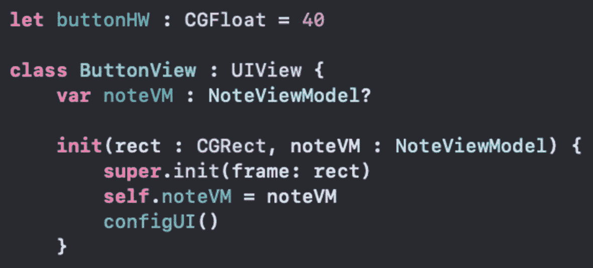
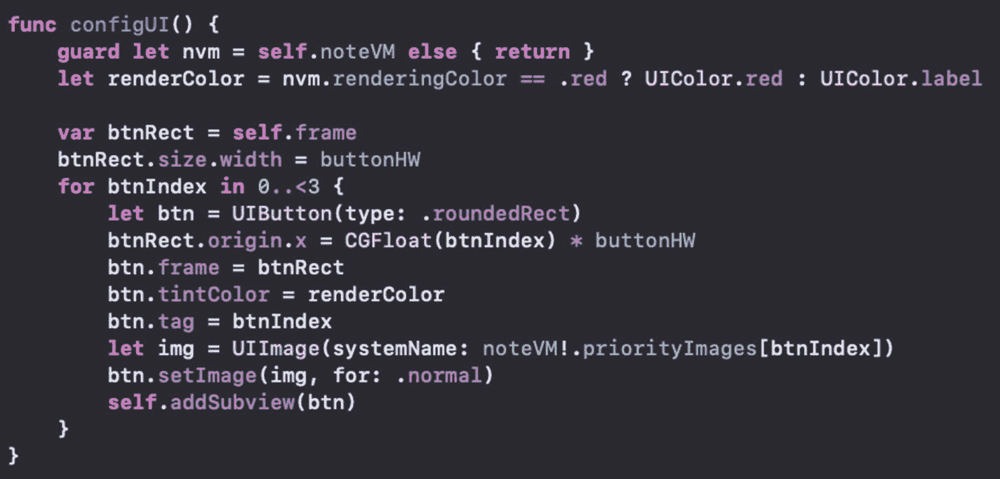
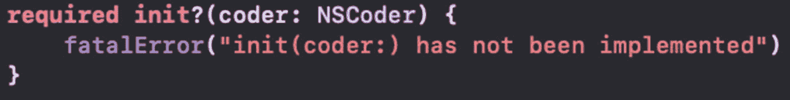
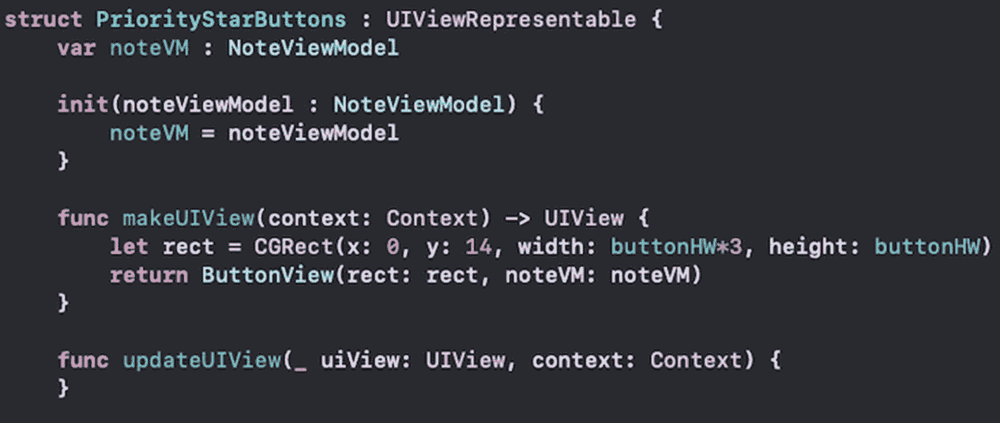
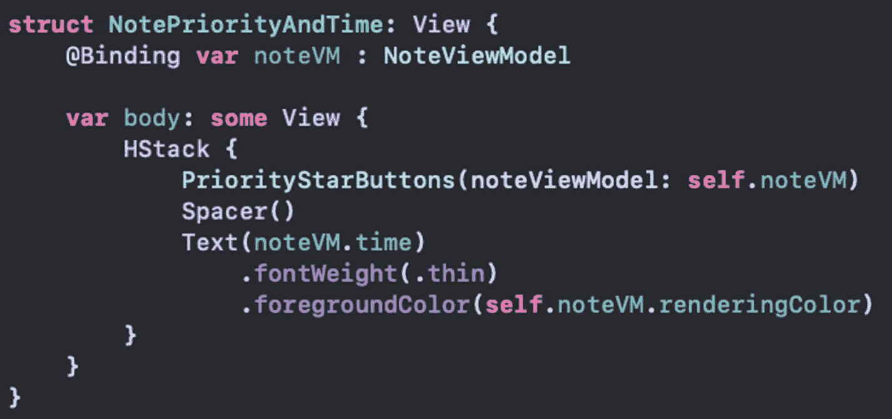
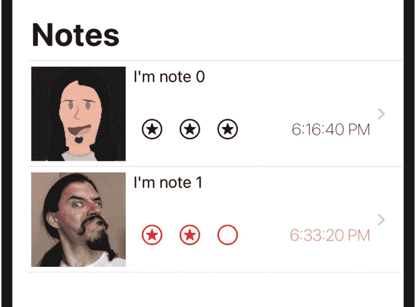
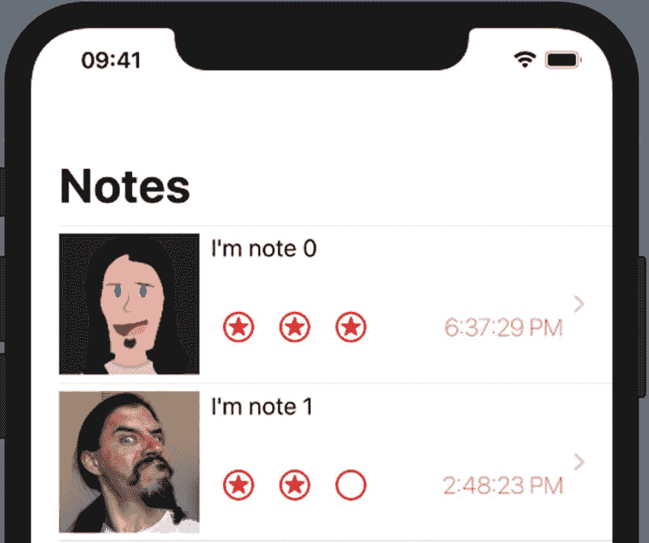

# 13. SwiftUI 中的目标/动作模式

在上一章中，我们使用 `Coordinator` 作为 `UITextView` 的委托。但我们也意识到协调器的设置只是一个有用的机制。

我们本可以为委托创建一个新类。或者我们本可以让协调器实现更多协议。我们命名为 `Coordinate` 的这个类也可以取别的名字。它可以继承自另一个类并实现我们所需的功能。

那么，我们可以将同样的机制用于目标/动作模式吗？答案是肯定的。

如果你有一个现有的 `UIView`，我们已经看到你可以通过 `UIViewRepresentable` 协议来使用它。像往常一样声明其属性（可能是绑定属性）。实现 `makeUIView` 来创建你的 `UIView` 实例并返回它。实现 `updateUIView` 来根据需要更新 UI。

如果你需要一个协调器，实现 `makeCoordinator` 来返回你的协调器类的一个实例。它将作为协调器属性在 `Context` 中传递。

总的来说，我认为最好将类名保留为 `Coordinator`。我的重点是，重要的是概念本身——而不是具体的名称、父类或你的协调器类遵循的协议。

我已经对代码做了相当多的更新。没什么特别有趣的，但你或许想要从本章的代码库开始。概念是相同的。然而，我将一些东西移到了它们自己的方法中。这将有助于重用和 UI 更新。下面我将回顾关键的更改。

让我们看看如何使用目标/动作模式和协调器。


### 目标/动作

如果你曾经在代码中创建过 UIKit 的按钮、滑块、开关等元素，你可能会对 `addTarget` 函数很熟悉。这里的唯一技巧是，协调器（coordinator）将成为动作的目标。这意味着要调用的函数也将位于协调器上。

如果你觉得这算不上什么技巧，那你是对的。每当你在 Swift 中添加目标时，你都需要指定实例、选择器和事件。这里并没有什么新东西。

同样，这里也没什么特别的。我们定义一个类，然后从 `makeCoordinator` 方法中返回它的一个实例。通读代码可能会让你觉得复杂，但其核心设置你很可能已经很熟悉了。

### ButtonView

在 `ListProject` 项目中，我在 `NoteRow.swift` 文件里有一个名为 `ButtonView` 的 `UIView` 子类。这将是我们从现有代码中导入视图的示例。它的声明和初始化方法如图 13-1 所示。



**图 13-1** ButtonView 声明与初始化器

我们有一个用于按钮高度和宽度的 `let` 常量、一个 `NoteViewModel` 属性以及一个初始化器。`init` 方法先调用父类的初始化方法，接着设置属性，然后调用 `configUI` 方法（见图 13-2）。



**图 13-2** configUI 方法

此方法会遍历并根据 `NoteViewModel` 属性的优先级图片创建三个按钮。它使用循环索引来设置按钮的 `tag` 属性。这在之后计算新优先级时会派上用场。

通常，我们也会向 `UIButton` 实例添加目标。不过，我们将使用协调器，这样代码就不会出现在前面的函数中。

还有一个用于 Storyboard 的必需 `init` 方法。由于我们并未使用 Storyboard，它只是如图 13-3 所示的样板代码。



**图 13-3** 必需的初始化方法（未使用）

因此，我们现在有了需要复用到 SwiftUI 代码中的 `UIView`。

### SwiftUI 中的 UIView

和之前一样，我们将创建一个实现 `UIViewRepresentable` 协议的结构体。我将其命名为 `PriorityStarButtons`。这个结构体将在 `makeUIView` 的实现中创建 `ButtonView`，并在 `updateUIView` 方法中根据需要更新视图。

它还需要一个要发送给 `ButtonView` 的 `NoteViewModel`。`NoteRow.swift` 中的代码如图 13-4 所示。



**图 13-4** PriorityStarButtons 类

之前我们在 `ForEach` 循环中创建星形图片的地方，现在将使用这个新类。因此，我们可以更新同一个文件中的 `NotePriorityAndTime`，改为使用我们的 `PriorityStarButtons`，如图 13-5 所示。



**图 13-5** 使用 PriorityStarButtons 的 NotePriorityAndTime

运行应用程序，外观应该仍然相似，但星形图片会有细微变化。它们现在是带有固定大小的按钮，如图 13-6 所示。



**图 13-6** 使用 PriorityStarButtons 的用户界面

### 添加协调器

目前，我们只是将 `UIView` 包裹在了新结构体中。我们希望更新代码，以便使用协调器来处理按钮的目标。除此之外，如果用户点击了星形按钮，我们还想更新 `NoteViewModel`。

理想情况下，无论我们是在主列表界面还是笔记详情页，我们都希望传播这个更改。这意味着我们需要添加绑定。

`PriorityStarButtons` 结构体和 `ButtonView` 类都有一个 `NoteViewModel` 属性。可以将其改为绑定类型。然后访问它会需要一些代码修改。

`PriorityStarButtons` 结构体遵循 `UIViewRepresentable` 协议。我们将在这里创建协调器。然后，协调器可以被传递给 `ButtonsView`，以建立按钮的目标关系。

**SWIFT 中的动作/目标**

在本练习中，我们将准备新的类和结构体，以处理 `NoteViewModel` 的绑定。然后，我们可以创建协调器并将其传递给 `ButtonsView` 作为目标。最后，我们将在协调器中处理按钮点击事件以更新模型。这也会导致用户界面得到更新。

1.  在 `NoteRow.swift` 文件中，将 `PriorityStarButtons` 的属性改为绑定类型。

```
var noteVM : Binding<NoteViewModel>
```

上述更改会导致一连串的错误。为了解决这个问题，我们需要传播被设置属性和被传递参数的类型。

2.  将 `PriorityStarButtons` 的 `init` 方法改为接受与步骤 1 中更改的属性相同的类型。

```
init(noteViewModel : Binding<NoteViewModel>) {
    noteVM = noteViewModel
}
```

在我们创建 `PriorityStarButtons` 实例的地方，需要更新 `NotePriorityAndTime`。目前，它在调用 `PriorityStarButtons` 的 `init` 方法时没有使用绑定。

3.  更改 `PriorityStarButtons` 的初始化调用，以传入笔记视图模型的绑定。

4.  在 `ButtonView` 中，更改属性和初始化参数的类型。

```
PriorityStarButtons(noteViewModel: self.$noteVM)
```

```
class ButtonView : UIView {
    var noteVM : Binding<NoteViewModel>?
    
    init(rect : CGRect,
         noteVM : Binding<NoteViewModel>) {
        // ...
    }
}
```

这应该能修复之前引起的编译错误。现在我们可以继续修复新的错误。

5.  在 `ButtonView` 的 `configUI` 方法中，访问 `renderingColor` 的包装值。

6.  并访问 `priorityImage` 数组元素的包装值。

```
let renderColor =
    nvm.renderingColor.wrappedValue
    == .red ? UIColor.red : UIColor.label
```

```
let img = UIImage(systemName:
    noteVM!.priorityImages[btnIndex].wrappedValue)
```

此时，我们拥有的基本上和之前一样，只是多了绑定。功能应该没有改变。运行你的应用程序，确保其外观仍然相同。

现在让我们创建协调器。这个新类也可以接受一个指向 `NoteViewModel` 的绑定。不过，为了有所变化，我们只对关心的特定值使用绑定：图片字符串和时间字符串。

7.  在 `PriorityStarButtons` 类内部，为协调器声明一个新类。同时也包含那两个绑定属性。

8.  为 `Coordinator` 类创建一个初始化器，该初始化器接受两个将要存储在属性绑定中的值。

```
class Coordinator : NSObject {
    var images : Binding<[String]>
    var time : Binding<String>
}
```

```
init(images : Binding<[String]>,
     time : Binding<String>) {
    self.images = images
    self.time = time
}
```

既然我们知道协调器类将作为按钮的目标，我们现在可以实现需要的方法了。

这个函数需要一个参数来表示按钮。另外，它需要暴露给 Objective-C，以便传入 `addTarget` 函数。

这个方法的功能将更新协调器属性中绑定的值。

9.  在协调器中创建一个函数，用于处理用户点击按钮时的事件。

```
@objc func priorityChange(sender : UIButton) {
    time.wrappedValue =
        NoteViewModel.dateFormatter.string(from: Date())
    let newPrority = Priority(rawValue: sender.tag)!
    images.wrappedValue =
        NoteViewModel.handlePriority(priority: newPrority)
}
```


我们将时间包裹值设置为一个新字符串。我们重用了`NoteViewModel`中的静态日期格式化器来创建当前更新时间。

我们使用`UIButton`的`tag`值创建一个新的优先级。然后，我们在`NoteViewModel`上使用一个新函数来处理新的优先级。该函数根据优先级重新创建图片名称字符串并返回它们。将这个逻辑放在单独的方法中，允许我们在创建新的`NoteViewModel`之外更改图片名称绑定。

1. 在`makeCoordinator`中创建协调器。

```
func makeCoordinator() -> Coordinator {
    return Coordinator(images: self.noteVM.priorityImages, time: self.noteVM.time)
}
```

现在，`noteVM`属性是一个绑定，我们可以在创建协调器时传入这些值。

目前，我们的`ButtonView`对协调器一无所知。当创建`ButtonView`时，它需要`Coordinator`实例来为按钮添加目标。

1. 在`makeUIView`方法中将协调器添加到`ButtonView`的创建中。

```
return ButtonView(rect: rect, noteVM: noteVM, coordinator: context.coordinator)
```

现在，我们需要在`ButtonView`的初始化器中接收协调器，并将其传递给`configUI`。

1. 将`Coordinator`参数添加到初始化器和对`configUI`的调用中。

1. 将`Coordinator`作为参数添加到`ButtonView`的`configUI`中。

```
init(rect: CGRect, noteVM: Binding<NoteViewModel>, coordinator: PriorityStarButtons.Coordinator) {
    super.init(frame: rect)
    self.noteVM = noteVM
    configUI(coordinator: coordinator)
}
```

1. 使用我们定义的选择器和`touchUpInside`事件，将按钮的目标设置为协调器。

```
func configUI(coordinator: PriorityStarButtons.Coordinator) {
    // ...
    btn.addTarget(coordinator, action: #selector(PriorityStarButtons.Coordinator.priorityChange(sender:)), for: .touchUpInside)
}
```

剩下的唯一事情是实现`updateUIView`。它的第一个参数是一个`UIView`。我们知道这是`ButtonView`，可以通过一个`guard`语句来验证。

一旦我们有了类型转换后的`ButtonView`，就可以更新 UI。然而，我们不想重新创建 UI。让我们在`ButtonView`中添加一个函数，基于`tag`更新按钮图片。

`tag`可以作为图片名称字符串数组中的索引。如果图片名称已正确更新，这将正常工作。

1. 在`ButtonView`中创建一个函数来更新按钮图片。

```
func configPriorityImages() {
    subviews.forEach { (btn) in
        guard let btn = btn as? UIButton else { return }
        let imageIndex = btn.tag
        let imageName = noteVM!.priorityImages[imageIndex].wrappedValue
        let img = UIImage(systemName: imageName)
        btn.setImage(img, for: .normal)
    }
}
```

调用此函数时，它会遍历子视图，查找`UIButton`。然后获取`tag`，并使用它从`priorityImages`数组中获取图片名称。它根据该名称创建一个图片，并将其设置在按钮上。

现在，我们只需在需要时调用该函数来更新 UI。

1. 在`updateUIView`中更新 UI。

```
func updateUIView(_ uiView: UIView, context: Context) {
    guard let v = uiView as? ButtonView else { return }
    v.configPriorityImages()
}
```

此函数通过`guard`语句验证`UIView`是否为`ButtonView`，然后调用其`configPriorityImages`方法。

这工作量真不小！我们获取了一个现有的`UIView`（即`ButtonView`），并将其包装在一个名为`PriorityStarButtons`的结构体中，该结构体实现了`UIViewRepresentable`。

该结构体有一个绑定类型的`NoteViewModel`，在其初始化器中设置。它的`makeUIView`函数创建一个`CGRect`，并用该矩形实例化`ButtonView`。它还将`NoteViewModel`绑定和来自上下文的协调器传入。

`ButtonView`的初始化器将绑定存储在`noteVM`中，并将协调器传递给`configUI`。该调用设置了 UI，包括为`Coordinator`向按钮添加目标。

`PriorityStarButtons`在`makeCoordinator`中创建协调器。它将优先级图片名称和时间（均来自`NoteViewModel`）传入。

`Coordinator`有两个绑定：`images`（字符串数组）和`time`（字符串）。这些都在初始化器中设置。它还有一个用于按钮动作调用的函数。这被作为目标添加到现有按钮上。

该目标函数更新时间与图片名称。这会导致 UI 更新，进而调用`updateUIView`，然后调用`configPriorityImages`来更新图片。

简而言之，`PriorityStarButtons`创建`ButtonView`，为其提供模型和协调器，并告诉`ButtonView`何时更新。

`ButtonView`创建其按钮，向协调器添加目标，并在收到指令时更新按钮图片。

由于我们使用绑定来传递数据，无论你是在列表还是详情屏幕中更改优先级，都会保持同步。

如果你运行应用，它应该会在你点击按钮时更新。如果你查看详情，它也应该如此。还要注意时间会更新，如图 13-7 所示。



**图 13-7** 当前 UI 与更新的时间

我们在本练习中做了很多工作。但我希望你能看到清晰的区分。正如我们之前所见，`UIViewRepresentable`结构体负责创建和更新 UI。

`Coordinator`是一个相当开放的类，作为协议函数的一部分被创建，并在上下文中传递。除此之外，它非常灵活。

我们对`ButtonView`的主要更改是将属性改为绑定，并向协调器添加目标。如果该 UI 是在代码中创建的，很可能已经包含了`addTarget`调用。我们只需要更改它。

### 章节总结

在本章中，我们了解了如何使用现有的`UIView`。我们将其包装在一个遵循`UIViewRepresentable`的结构体中。我们创建并更新了它，作为协议函数的一部分。

我们创建了一个协调器，它包含绑定和一个可用于`addTarget`选择器的函数。

为了让`ButtonView`不必了解`Coordinator`，它可以作为代码中定义的自定义协议传入。根据你具体的应用需求，你可以对这个概念进行多种变通。

我希望你记住几个要点。`UIViewRepresentable`负责创建和管理它所包装的`UIView`。如果需要绑定，没问题。我们现在对此已经很熟悉了。

协调器几乎可以是任何东西，并能满足你需要的任何目的。它在`makeCoordinator`中创建，从该函数返回，然后在上下文中传递。

现在，我们知道如何使用带有委托和目标/动作模式的`UIView`了！

