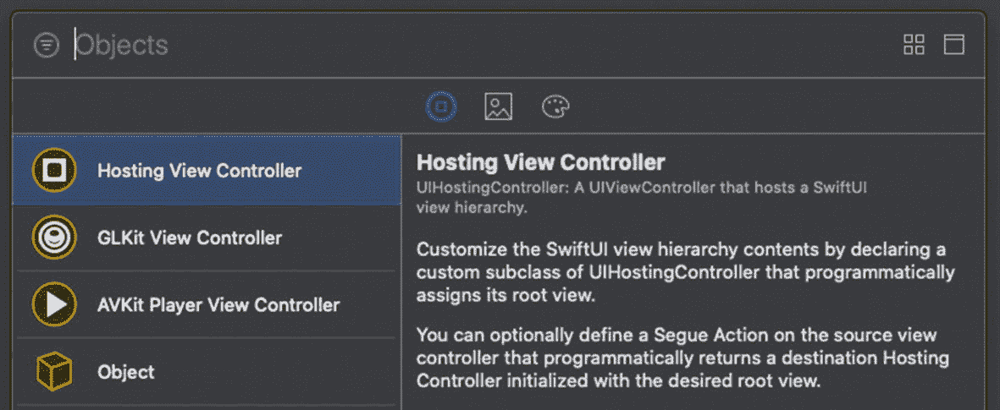
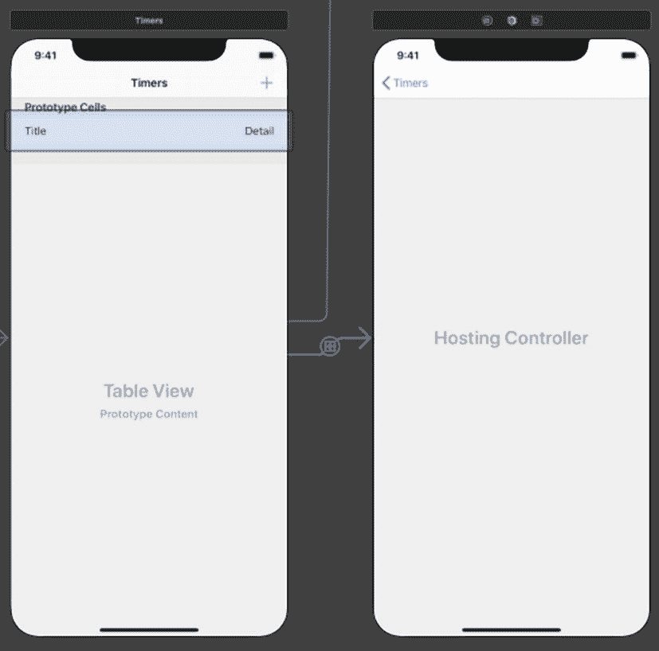
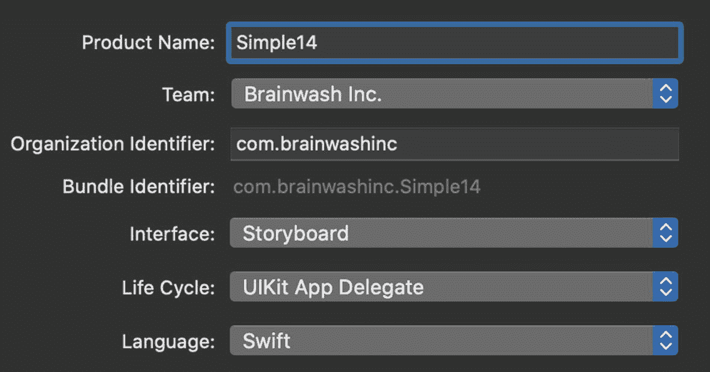
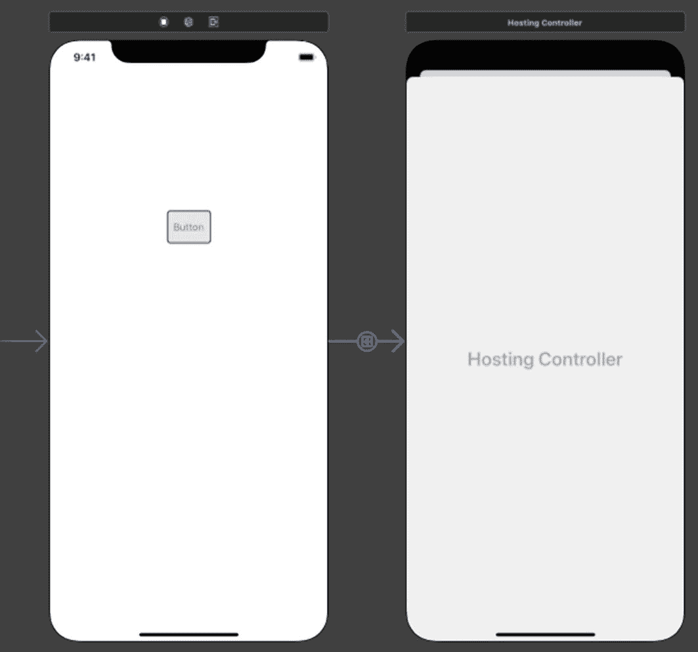
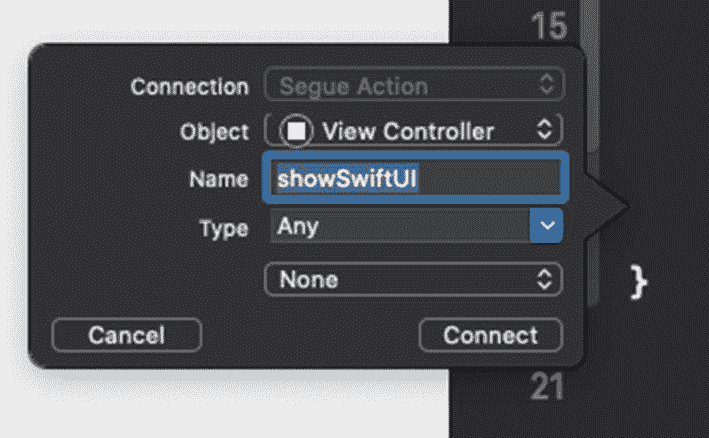
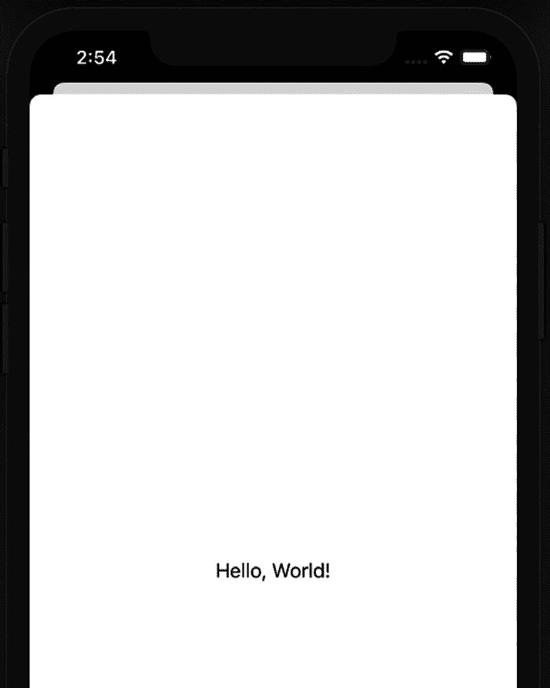
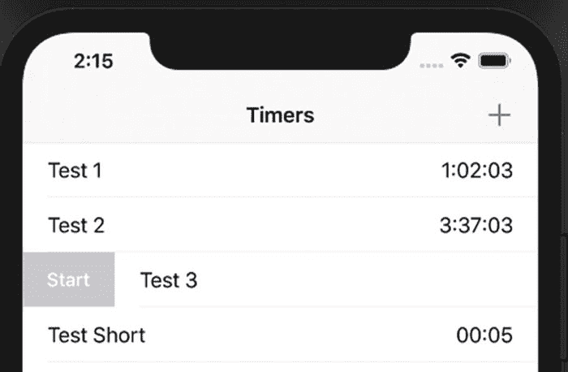
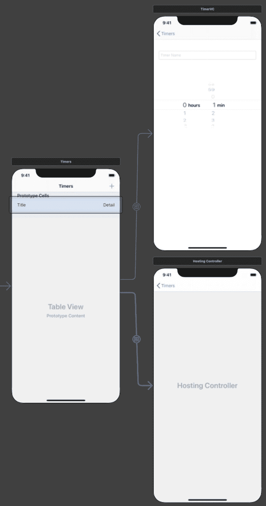
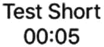
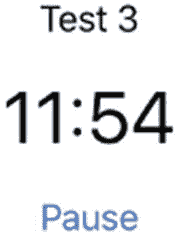

# 14. SwiftUI in UIKit

我们研究了如何在 SwiftUI 中使用现有的 UIKit 视图。现在，我们将研究如何在 UIKit 中使用 SwiftUI。

你可能有一个现有项目，希望使用 SwiftUI 添加新的 UI。因此，你已经为所有界面和导航设置了 Storyboard。实际上，将 SwiftUI 视图添加到项目中非常容易。

当我们在应用中集成一个`UIView`时，我们使用了`UIViewRepresentable`。该协议帮助我们创建`UIView`实例。

UIKit 提供了一种反向操作的机制。有一个名为`UIHostingController`的`UIViewController`子类。同样，对于 macOS 开发，有`NSHostingController`。WatchKit 版本名为`WKHostingController`。

`UIHostingController`在初始化器中接受一个 SwiftUI `View`。因此，你需要负责创建新的 SwiftUI `View`。你用它创建`UIHostingController`实例并呈现它。

在本章中，我们将研究如何做到这一点，包括与 Storyboard 的集成。


## `UIHostingController`

这个新控制器已包含在对象库中。这意味着你可以轻松地将其添加到现有的 Storyboard 中。它与其他控制器一起列在对象库中，如图 14-1 所示。



图 14-1 — 对象库中的 Hosting View Controller

用这个视图控制器更新 Storyboard 的方式与其他任何控制器相同。只需从对象库中将其拖放到 Interface Builder 中的 Storyboard 上即可。

创建指向这个新控制器的 segue 也是一样的。只需按住 Control 键，从按钮或表格视图拖拽到你的新视图控制器上。它就像其他任何视图控制器一样完美契合，如图 14-2 所示。



图 14-2 — 从 Storyboard 中的表格单元格到 Hosting Controller 的 Segue

Xcode 允许你按住 Control 键从 Storyboard 拖拽到源视图控制器的代码中。这会在 segue 触发时创建一个 `IBSegueAction`。这个 segue 动作的返回类型期望返回一个视图控制器。

```
@IBSegueAction func showDetails(_ coder: NSCoder)
-> UIViewController? {
return UIHostingController(coder: coder,
rootView: swiftUIView)
}
```

你生成的代码的返回类型可能没有设置为 `UIViewController`。如果是这样，你需要将其改为 `UIViewController`。

在实现中，你需要创建一个 `UIHostingController` 的实例。你需要传入被调用函数所接收的 `coder` 参数。第二个参数是你新建的 SwiftUI 视图。

上述代码仅展示了以 SwiftUI 视图占位符创建 `UIHostingController` 的过程。具体如何实例化，取决于你设计的视图。

## 向 UIKit 添加 SwiftUI 视图

让我们从一个基础练习开始。我们将创建一个简单的 Storyboard 应用，并添加一个 SwiftUI 视图。



图 14-3 — 使用 Storyboard 界面创建新的 iOS 应用项目

1.  使用 Storyboard 创建一个新的 iOS 应用模板项目，并将其命名为 `Simple14`，如图 14-3 所示。

2.  从对象库中向你的初始视图控制器添加一个按钮。

3.  从对象库中将一个 Hosting View Controller 拖放到你的 Storyboard 上，位于初始视图控制器的右侧。

4.  按住 Control 键，从按钮拖拽到你的 Hosting View Controller。

当你在 Hosting View Controller 上释放鼠标时，在 segue 选项弹出菜单的顶部选择“显示”（Show）。

你的 Storyboard 中的界面应该如图 14-4 所示。



图 14-4 — 从 Storyboard 中的初始视图控制器到 Hosting Controller 的 Segue

接下来，我们需要在代码中创建这个 segue 动作。



图 14-5 — 命名 Segue 动作

1.  打开辅助编辑器（编辑器 ➤ 辅助编辑器 或 ⌃⌥⌘⏎）以在右侧显示 `ViewController` 代码。

2.  按住 Control 键，从 segue 拖拽到 `ViewController` 代码中最后一个闭合大括号（`}`）的上方，然后释放鼠标。

3.  在出现的弹出窗口中，给你的 segue 动作函数命名（例如 `showSwiftUI`），如图 14-5 所示。

4.  点击“连接”（Connect）按钮并查看生成的代码。

至此，我们已经完成了 Storyboard 的操作，可以将其关闭。接下来，我们需要创建 SwiftUI 视图，以便有内容可以显示。

5.  向你的项目添加一个新文件（⌘+n）——选择“SwiftUI 视图”（SwiftUI View）类型，然后点击“下一步”（Next）。

6.  将文件命名为 `MySwiftUI`，然后点击“创建”（Create）。

预览不会工作，因为存在编译错误。我们的 segue 动作尚未实现。现在让我们回到 `ViewController` 类中修复它。

7.  打开 `ViewController.swift`，在 `ViewController` 类声明之前导入 `SwiftUI`。



图 14-6 — 模拟器中显示的 `MySwiftUIView`

8.  实现 `showSwiftUI` 函数，使其返回一个 `UIHostingController` 实例。传入 coder 和你新建的 `MySwiftUI` 结构体的实例。

```
    @IBSegueAction func showSwiftUI(_ coder: NSCoder)
    -> UIViewController? {
    return UIHostingController(coder: coder,
    rootView: MySwiftUI())
    }
```

9.  运行应用并点击按钮。SwiftUI 视图应该会显示出来，如图 14-6 所示。

```
import SwiftUI
```

恭喜！你已经成功地将一个 SwiftUI 视图集成到了 UIKit/Storyboard 应用中。

对于一个简单的项目来说，这很容易，对吧？对于复杂的项目，流程也差不多。这实际上完全取决于你创建的 SwiftUI 视图。如果它需要交互或数据，则会有更多内容需要处理。

接下来，我们将探讨类似这样的实现。

## 现有项目

我为你提供了一个章节开始（BOC）项目：`Ch14_BOC_Timers.zip`。该项目允许用户创建计时器。一个计时器包含名称和时长。用户可以启动和暂停计时器。

当计时器结束时，如果用户已授权，它会弹出一个本地通知。

向右滑动可以删除计时器。而向右轻扫会显示启动/暂停按钮，如图 14-7 所示。



图 14-7 — 通过向右滑动启动计时器

+ 按钮允许用户创建新的计时器。该代码中包含了一些为调试构建自动创建的测试计时器。

这是我们的起点。但是，我们想使用 SwiftUI 来添加界面。当用户点击列表中的某个计时器时，我们希望显示其详细信息。这个简单的详情界面将包含名称、时间以及启动/暂停按钮。

此外，随着计时器秒数的流逝，界面应该实时更新。


### 添加 SwiftUI

如同我们在上一个练习中所做的那样，我们需要在 Storyboard 中添加一个托管视图控制器。然后在 `TimerListVC` 代码中创建 segue 动作。在本例中，我们将从表格视图单元格开始操作。

再次与上一个练习相同，我们在 Storyboard 中只需完成这些操作。

生成的 segue 动作函数需要返回一个 `UIViewController`。与前次一样，我们将创建 SwiftUI 视图的实例。该实例以及传入的代码将用于创建要返回的托管视图控制器。因此，我们需要创建一个 SwiftUI 视图！

我们之前已经看到，`View` 结构体会获得一个成员逐一初始化器。在 Timers 项目中，这将包含用于显示详情的 `TimerItem`。

两个不太明显的部分是：更新时间的 UI，以及用于启动/暂停计时器的按钮。而且这些操作一点也不复杂。

## 将计时器视图添加到 UIKit

打开提供的 BOC 项目 `Ch14_BOC_Timers.zip`，并导航到 Storyboard。

1. 从对象库中向 Storyboard 添加一个托管视图控制器。

2. 按住 Control 键从表格视图单元格拖拽到新的托管视图控制器，松开鼠标，然后从弹出菜单中选择 Show。

你的 Storyboard 应该如图 14-8 所示。



图 14-8：包含托管视图控制器和 Segue 的 Storyboard

3. 打开助理编辑器（Editor ➤ Assistant 或 ⌃⌥⌘⏎）。

4. 按住 Control 键从 segue 拖拽到 `TimerListVC.swift` 代码中（位于 `makeTimer` 函数下方），松开鼠标，并将函数命名为 `timerDetails`。

现在我们需要创建 `TimerView` 来显示计时器详情。

5. 向项目中添加一个新的 SwiftUI 视图文件，命名为 `TimerView.swift`。

我们将用计时器详情替换 `body` 属性中的内容。当然，我们需要一个 `TimerItem` 来提供详情。

6. 添加 `TimerItem` 属性和 body 内容。

```
struct TimerView: View {
    var timer : TimerItem
    var body: some View {
        VStack {
            Text(timer.name)
            Text(timer.timeString)
        }
    }
}
```

7. 更新 `TimerView_Previews`，使其传入一个 `TimerItem`。

```
struct TimerView_Previews: PreviewProvider {
    static var timer = TimerItem(name: "Test Timer",
        seconds: 12)
    static var previews: some View {
        TimerView(timer: timer)
    }
}
```

预览不会显示，因为我们在需要创建 `UIHostingController` 的 `TimerListVC.swift` 代码中遇到了一个错误。

现在，我们可以在 `TimerListVC` 的 segue 动作中创建它并显示出来。

当用户在表格视图中选择一行时，会调用这个 segue。这意味着我们可以从表格视图中获取该行的行号。

8. 创建一个 `let` 常量，用于从数组中存储 `TimerItem`，并使用选中的行进行赋值。

9. 使用数组中的 timer 创建 `TimerView` 实例。

```
@IBSegueAction func timerDetails(_ coder: NSCoder)
    -> UIViewController? {
    let timer =
        timers[tableView.indexPathForSelectedRow!.row]
}
```

10. 返回使用 `coder` 和已创建的 `tView` 创建的 `UIHostingController` 实例（完整函数如下所示）。

```
@IBSegueAction func timerDetails(_ coder: NSCoder)
    -> UIViewController? {
    let timer =
        timers[tableView.indexPathForSelectedRow!.row]
    let tView = TimerView(timer: timer)
    return UIHostingController(coder: coder,
        rootView: tView)
}
```

既然我们已经添加了 `UIHostingController` 代码，那么就需要 SwiftUI。因此，我们需要导入 SwiftUI。

11. 取消文件顶部 SwiftUI 导入语句的注释。

```
let tView = TimerView(timer: timer)
```

现在运行应用，当点击某一行时会显示详情。UI 非常基础（见图 14-9），但这正是我们设计的。



图 14-9：模拟器中的 `MySwiftUIView`

这很简单，对吧？我们只是添加了托管视图控制器，并为 Storyboard 创建了 segue 动作。我们设计了一个简单的 SwiftUI 视图，用计时器创建了它，并返回了 `UIHostingController`。


### 传递 ObservableObject

你可能还记得，我们曾希望计时器能在 SwiftUI 视图上实时更新。此外，我们还想要一个“开始/暂停”按钮。如果你运行这个应用，会发现计时器并没有在我们新的视图中更新。

在之前的一些练习中，我们使用绑定（binding）来解决这类问题。但我们的 `TimerListVC` 中的模型是 `TimerItem` 实例。如果将其改为某种绑定类型，大量代码都需要修改。

绑定仅适用于值类型（结构体、枚举），而我们的 `TimerItem` 是引用类型（类）。

将 `TimerItem` 改为结构体以实现绑定，可能会对我们的代码产生诸多影响。有些代码可能依赖于通过传递引用来实现变更。

我们将保留其作为类。`ObservableObject` 协议就是为引用类型设计的，因此我们将使用它。

## 使 TimerItem 可观察

为此我们只需进行少量修改。我们需要声明 `TimerItem` 遵循 `ObservableObject` 协议。这样一来，我们可以通过 `@Published` 包装器声明要发布的属性。同时，我们需要在代码中告知何时发送变更。

`TimerView` 也需要进行更新，将其属性标记为 `ObservedObject`。我们还可以通过“开始/暂停”按钮来更新界面。

1. 打开 `TimerItem.swift` 文件，声明其实现 `ObservableObject` 协议。

1. 将 `timeString` 属性标记为“已发布”。

```
class TimerItem : ObservableObject {
```

1. 在 `start` 函数中，在定时器闭包的顶部（例如第 69 行），添加发送函数调用。

```
@Published var timeString = ""
```

```
self.objectWillChange.send()
```

现在 `TimerItem` 已经是可观察对象了，我们可以在 `TimerView` 中进行声明。

1. 在 `TimerView` 中，将 `timer` 属性声明为被观察对象。

```
@ObservedObject var timer : TimerItem
```

至此，计时器的持续时间将在 `TimerView` 中实时更新。不过，你需要在表格视图中启动计时器，然后才能查看其详情。

接下来，我们在 `TimerView` 中添加“开始/暂停”按钮。可以将其放在两个文本项下方。`Button` 需要提供一个操作以及按钮视觉部分显示的内容。

该操作可以检查计时器的 `isRunning` 属性。如果正在运行，则暂停计时器；否则，启动计时器。

对于标签参数，我们可以使用 `Text` 元素。

1. 在 `TimerView` 中，在两个 `Text` 项下方添加一个 `Button`。对于操作，检查 `isRunning` 参数，并根据其状态暂停或启动计时器。对于标签，创建一个 `Text` 元素。

```
    Button(action: {
        if self.timer.isRunning {
            self.timer.pause()
        }
        else {
            self.timer.start()
        }
    }) {
        Text(timer.isRunning ? "暂停" : "开始")
    }
```

为了稍微美化格式，我们对显示剩余时间的计时器添加几个修饰器。

1. 在第二个文本项（用于 `timer.timeString`）上，添加字体和间距修饰器。

```
    Text(timer.timeString)
        .font(.largeTitle)
        .padding()
```

现在查看计时器详情时，我们可以启动/暂停计时器。启动后，可以看到计时器倒计时显示剩余时间，如图 14-10 所示。



图 14-10

带按钮和剩余时间的计时器详情界面

请注意，当你点击“暂停”时，它并不会更新为“开始”。你认为这是为什么？`TimerItem` 中的 `pause` 函数会使定时器失效。但我们是在定时器的闭包中发布变更。

这可以通过两种方式修复：在 `pause` 函数中发送更新，或者将 `isRunning` 属性标记为 `@Published`。请尝试这些方法。

为界面添加变更更新的能力并没有花费太多修改。我们需要将 `TimerItem` 指定为 `ObservableObject`，然后将 `timeString` 标记为已发布，并调用 `send` 函数。

完成这些修改后，我们只需在 `TimerView` 中将该属性指定为被观察对象。我们还添加了“开始/暂停”按钮，并为 `Text` 项添加了修饰器。

## 本章小结

在本章中，我们重点探讨了如何在现有的基于 Storyboard 的项目中使用 SwiftUI 视图。提供的 `Hosting View Controller` 和转场动作使得这一过程变得简单。

通过将 `Hosting View Controller` 放入 Storyboard 并创建转场，我们在代码中实现了转场动作。该动作会传递一个编码器。我们需要创建 SwiftUI 视图实例。利用编码器和我们的视图，我们创建了 `Hosting View Controller`，并将其从转场动作中返回。

请注意，我们创建了要返回的视图控制器。这意味着我们可以在一处设置视图或视图控制器的其他属性。无需实现 `prepare(for:sender:)` 转场函数。

为了让 SwiftUI 能够动态更新，还需要进行一些额外的修改。由于我们的 `TimerItem` 是引用类型（类），我们选择使用 `ObservableObject` 协议。

我们声明它实现了该协议，指定了已发布的属性，并在必要时调用 `send` 函数。

剩下的工作就是将 `TimerView` 的属性标记为被观察对象。

在本章的第一个练习中，我们发现将 SwiftUI 显示在 UIKit 项目中只需极少的工作。第二个练习表明，即使界面更新和交互也不需要太多工作。

这种方法使得现有项目能够无缝受益于新的 SwiftUI 用户界面开发。

