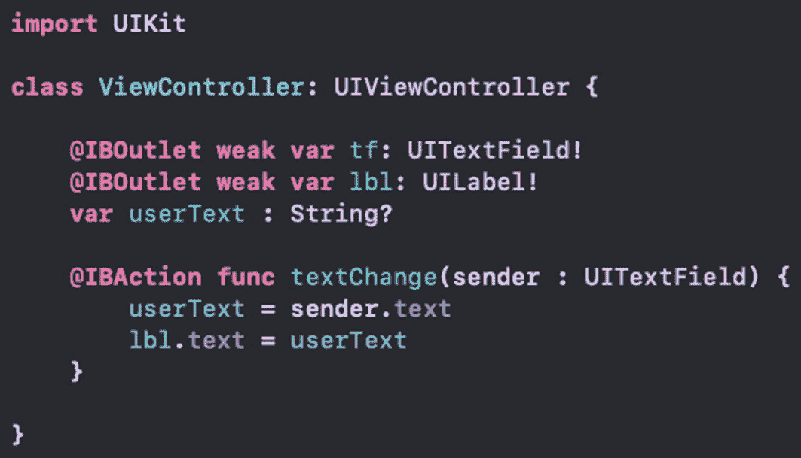
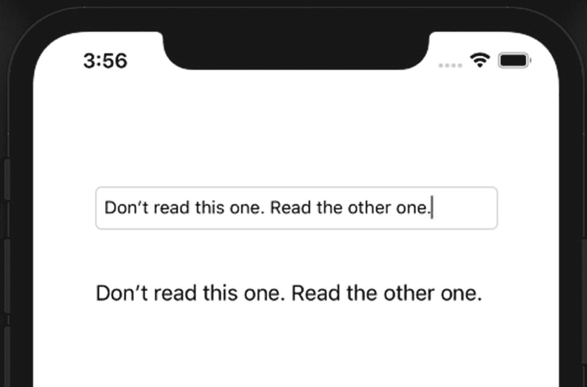
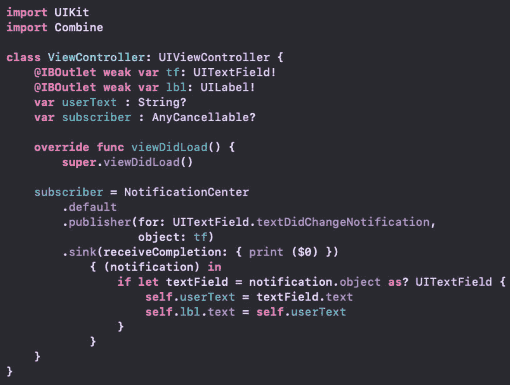

# 15. Combine 框架入门

我们其实已经大量使用了 Combine 框架。现在我们将暂时搁置 SwiftUI，更深入地研究一下 Combine。

苹果公司将该框架描述为“一个统一的、声明式的 API，用于随时间处理值”。我想重点强调的是“随时间处理值”这一部分。

我们目前正是这样使用 Combine 的。随着值随时间变化，我们的界面也随之更新。我们使用了 `@State`、`@Binding`、`@Published` 等。

在 SwiftUI 中使用这些包装器确实促进了界面中的变更反映。但很容易将 Combine 框架的这些方面与 SwiftUI 混淆。

Combine 框架可以在没有 SwiftUI 的情况下使用。这有助于你现有的应用，即使你不使用 SwiftUI。理解这个框架将全面提升你的应用。此外，它还能为你将来在更新现有应用时添加 SwiftUI 奠定基础。

## 常见概念

应用的构建基于一个基本概念：向用户显示界面。用户的输入存储在应用中，功能由这些操作和数据驱动。这一点我们都清楚。

因此，将用户的文本输入存储在 `String` 属性中是一种常见的模式。同样，我们可能会在完成某些功能后显示这些数据或其某种版本。

让我们看一个简单的例子。

假设我们有一个基本的界面设计，包含一个文本框和一个标签。我们在视图控制器中创建了它们的输出口。文本框还有一个 `editingChanged` 的动作。该函数会存储输入的文本并将其放入标签中。代码如图 15-1 所示。



图 15-1

使用文本框变更更新标签的基本界面视图控制器代码

如果你运行这个应用，当你输入文本框时，标签会实时更新。让我们看看如何使用 Combine 框架的概念来实现这一点。


### 发布者与订阅者

Combine 框架引入了发布者（Publisher）和订阅者（Subscriber）的概念。你可能对 `NotificationCenter` 并不陌生——它可以发送通知，而针对该通知名称添加的所有观察者都会通过调用关联函数收到通知。

发布者定义了其特定的输出类型（Output），即它在发布时发送的值。订阅者则定义了其特定的输入类型（Input），即它从发布者接收的数据类型。这两个类型必须匹配。后续我们会探讨当类型不匹配时如何对值进行映射。

发布者和订阅者各自还需要定义一个失败类型（Failure），这两个失败类型也必须匹配才能建立关联。

创建发布者有多种方式。我们首先看的是使用 `NotificationCenter` 的方式。这对许多人来说是一个熟悉的机制，因此是一个很好的起点。

一旦有了发布者，我们就可以为其添加订阅者，订阅者负责处理发布时传递的数据。

## 转换至 Combine

这个示例未必会更高效，代码量也不会减少——实际上代码量会更多。但目的是用一个熟悉的概念，演示它在全新概念下如何运作。

首先，我们需要将 Combine 框架导入代码中。然后从 `NotificationCenter` 获取一个发布者。我们将让 `ViewController` 订阅更新，因此它需要遵循 `Subscriber` 协议，并实现相应的各种要求。

在 `Subscriber` 的实现中，我们将获取输入的新文本值，并更新 UI。

我在 `Ch15_BOC_CombineFW.zip` 文件中提供了本示例的初始代码，它其实就是本章前面讨论的代码。

1.  将 Combine 框架导入代码。
2.  在 `viewDidLoad` 中从 `NotificationCenter` 获取一个发布者。

```swift
let publisher = NotificationCenter
    .default
    .publisher(for:
        UITextField.textDidChangeNotification,
        object: tf)
```

```swift
import Combine
```

这将返回一个针对文本框的发布者。每当文本框内容变化时，它就会发布新值。

3.  让 `ViewController` 订阅该发布者。由于我们要更新 UI，因此希望在主线程上接收更新。

```swift
publisher
    .receive(on: DispatchQueue.main)
    .subscribe(self)
```

另一种做法是在主线程上订阅，然后调用 `receive` 并传入订阅者。但我更喜欢上面的写法，因为它清晰明了：我打算在主线程上接收更新（用于 UI 更新），并订阅传入的指定实例。

至此，我们有了发布者并完成了订阅。基本上是。但我们的 `ViewController` 尚未实现 `Subscriber` 协议。

4.  在声明中添加 `Subscriber` 协议。

```swift
class ViewController: UIViewController, Subscriber {
```

5.  使用编译错误消息中的“修复”按钮快速生成存根代码。这通常只会添加所需的类型别名：`Input` 和 `Failure`。

```swift
typealias Input = type
typealias Failure = type
```

我们需要确定这两个类型的具体值。如果深入查看 `.publisher` 调用，会发现它返回的是 `NotificationCenter.Publisher`。跳转到该类型（就在发布者函数声明下方即可看到），会发现其输出类型是 `Notification`，失败类型是 `Never`。

我们的 `Input` 和 `Failure` 需要与之匹配。

```swift
typealias Input = Notification
typealias Failure = Never
```

此时仍有编译错误。再次使用“修复”按钮，它会生成所需的函数存根。

6.  实现 `receive(subscription:)` 函数，指定无限量的数据更新请求。

```swift
func receive(subscription: Subscription) {
    subscription.request(.unlimited)
}
```

7.  实现 `receive(_:)` 输入处理函数。

```swift
func receive(_ input: Input) -> Subscribers.Demand {
    if let textField = input.object as? UITextField {
        userText = textField.text
        lbl.text = userText
    }
    return .unlimited
}
```

由于我们的 `Input` 类型别名指定为 `Notification`，因此可以按此类型使用。当前我们处于 UI 线程，更新操作可以正常工作。

返回 `.unlimited` 表示希望继续接收无限量的响应。

8.  实现 `receive(completion:)` 函数。

```swift
func receive(completion:
    Subscribers.Completion) {
    print(completion)
}
```

在我们的场景中无需做任何处理，但在某些情况下，你可能需要在此时完成应用的某些收尾工作。

至此，我们的 `ViewController` 已订阅了针对文本框的 `NotificationCenter` 更新。运行应用，当我们在文本框中输入时，标签文本应随之更新。UI 应如图 15-2 所示。



*图 15-2 —— 将 TextField 输入内容设置为标签文本*

相信你会同意，这种方式比最初的解决方案更繁琐、代码量更大、复杂度更高。但再次强调，本示例的目的是引导我们熟悉 Combine 框架中发布者和订阅者的概念。后续会有更精炼的改进方案。

解决方案保存在 `CombineFW-Ex15-1.zip` 文件中。

## 改进优化

我们可以对代码做的一个简单改进，是在 `viewDidLoad` 中将 `subscribe` 调用与发布者调用链式连接起来。

```swift
NotificationCenter
    .default
    .publisher(for:
        UITextField.textDidChangeNotification,
        object: tf)
    .receive(on: DispatchQueue.main)
    .subscribe(self)
```

这样我们就不再需要存储发布者变量。但还有更好的方法！

Combine 提供了两个现成的订阅者，我们可以直接使用，而不必自定义类。它们会自动匹配所关联发布者的输出类型和失败类型。这其中的魔法是什么？就是 `sink` 和 `assign`。

## Sink 订阅者

`sink` 订阅者接受两个闭包。第一个闭包类似于我们之前编写的 `receive(completion:)` 函数。第二个闭包则类似于我们编写的获取更新值的函数。在我们的场景中，这个更新值是一个 `Notification` 实例。

`sink` 会自动请求无限量的更新，就像我们在 `receive(subscription:)` 函数中所做的那样。而且当 Combine 创建你的订阅者时，它会使用变更发生的线程。在我们的场景中，变更发生在 UI 上，因此它已经处于主线程。

如果使用 `sink`，我们可以移除对 `receive(on:)` 和 `subscribe` 的调用。不过，`sink` 有一个返回值需要考虑：它返回一个 `AnyCancellable` 实例。

我们可以将此实例存储在类属性中，确保它不会超出作用域而被从内存中移除。如果我们想取消订阅，只需对该实例调用 `.cancel` 方法。一旦超出作用域，它会被清理，并在其 `deinit` 中自动调用 `.cancel`。非常干净。

因此我们需要一个属性。

```swift
var subscriber: AnyCancellable?
```

然后我们在创建发布者和订阅者时使用它。

```swift
subscriber = NotificationCenter
    .default
    .publisher(for:
        UITextField.textDidChangeNotification,
        object: tf)
    .sink(receiveCompletion: { print($0) })
    { (notification) in
        if let textField = notification.object
            as? UITextField {
            self.userText = textField.text
            self.lbl.text = self.userText
        }
    }
```

我们像之前一样获取发布者，现在调用它的 `sink` 方法。`receiveCompletion` 闭包只是打印参数。更新值闭包所做的操作与之前一致（但属性访问时增加了 `self` 作用域指定）。

最好的地方在于：我们的 `ViewController` 不再需要实现 `Subscriber` 协议，我们可以移除所有相关代码！整个代码库瞬间简洁了许多，如图 15-3 所示（特别是当我们像我所做的那样，删除了 Storyboard 中文本框的连接之后）。



*图 15-3 —— 移除 Subscriber 协议并使用 Sink 后的 ViewController*

`sink` 还提供了一个不接受完成闭包的版本。所以如果你不需要处理完成事件，代码可以变得更简洁。


### 分配订阅者

Combine 提供的第二个订阅者是 `assign`。`Assign` 接受两个参数。第一个是某个属性的键路径，第二个是拥有该键路径的实例。

在我们项目中，键路径指向 `UILabel` 的文本元素。当然，第二个参数就是该标签本身。我们可以使用 `assign` 代替 `sink`，将值赋给属性。

```
.assign(to: \.userText, on: self)
```

现在我们的订阅者接收到发布的值，并将其赋给 `userText` 属性。但有一个问题：我们发布的值是一个通知，而不是 `String`。

要获取 `String` 值，我们必须从通知中提取对象。这个对象是 `UITextField`，从中我们可以获得文本。因此我们需要一个中间步骤。

## 操作符

幸运的是，Combine 中的 `Publisher` 拥有大量操作符。如果你熟悉标准的高阶函数，你会感到得心应手。

`Publisher` 提供了许多操作符，如 `map`、`flatMap`、`reduce`、`contains` 等。你可以在 Apple 关于 `Publisher` 的文档（[`developer.apple.com/documentation/combine/publisher`](https://developer.apple.com/documentation/combine/publisher)）中看到一长串列表。

在我们的发布者上，我们可以添加一个 `map` 来深入 `Notification` 内部，获取所需内容。

```
.map { notif in
  guard let tf = notif.object as? UITextField
  else { return "" }
  return tf.text ?? ""
}
.assign(to: \.userText, on: self)
```

现在当值被发布时，我们可以通过 `guard` 语句绑定文本字段，然后返回文本字段的值。由于我们的 `userText` 属性是可选类型，我们只需返回 `UITextField` 的文本。

`map` 返回 `Publisher`，因此它适合链式调用。但与具有闭包的 `sink` 不同，我们仅对 `userText` 进行赋值，标签并不会被更新。

`assign` 返回一个订阅者，因此我们无法为标签添加第二个 `assign` 调用。这正好引出另一个发布者示例的绝佳机会。

## @Published 属性包装器

我们已经在 SwiftUI 中使用过 `@Published` 属性包装器。不过，它也是 Combine 框架的一部分，因此我们也可以在此处使用。

这个属性包装器为任何属性添加了一个发布者！所以我们将创建第二个发布者和第二个订阅者。

1. 为 `userText` 属性添加 `@Published` 属性包装器。同时为其设置默认值，避免其为 `nil`。
2. 添加另一个订阅者属性，类型为 `AnyCancellable` 可选值。

```
@Published var userText : String? = ""
```

```
var subscriber2 : AnyCancellable?
```

现在，我们需要使用该发布者并对其进行订阅。我们将再次使用 `assign`。它将创建一个订阅者，将 `userText` 属性中的值赋给标签。

3. 在 `viewDidLoad` 中创建发布者和订阅者。

```
subscriber2 = $userText
  .assign(to: \.text, on: lbl)
```

就是这样！`$` 让我们能访问被包装的发布者。然后我们通过 `.assign` 指定键路径和对象来创建订阅者。

在这种情况下，发布的值是 `String` 可选类型，而这正是 `UILabel` 的 `text` 属性原本的类型。

功能已恢复至我们使用 `sink` 时的状态。根据代码不同，某一种方式可能比另一种更有意义。

### 章节总结

我们在此介绍了 Combine 框架中的一些重要概念。`Publisher` 发布更新后的值，`Subscriber` 接收更新后的值。再次回到 Apple 对 Combine 的描述：我们正在“随时间处理值”。

`Publisher` 有输出，`Subscriber` 有输入，两者的类型必须匹配。它们还定义了 `Failure` 类型，也必须匹配。我们在 `ViewController` 中实现了 `Subscriber` 并使其类型匹配。同时，我们还学习了 `sink` 和 `assign`，它们会自动匹配所创建的订阅者中的类型。

你需要保留对以 `AnyCancellable` 形式创建的订阅者的引用。这样可以在需要时取消订阅，同时也可避免手动清理订阅。`AnyCancellable` 会在其 `deinit` 方法中自动为你处理。

我们还看到 `Publisher` 支持多种操作符，如 `map`、`reduce` 等。它们返回相同的发布者，因此可以在创建订阅者之前进行链式调用。当需要将更新后的值转换为特定形式时，操作符尤其有用。

`@Published` 属性包装器为任何属性添加了发布者。要访问它，请在属性前使用 `$` 并继续调用。你可以像对待其他发布者一样添加操作符并进行订阅。

这些概念已经帮助我们在 SwiftUI 中进行了开发。但希望你也认同，这些概念在任何项目中都很有用。

