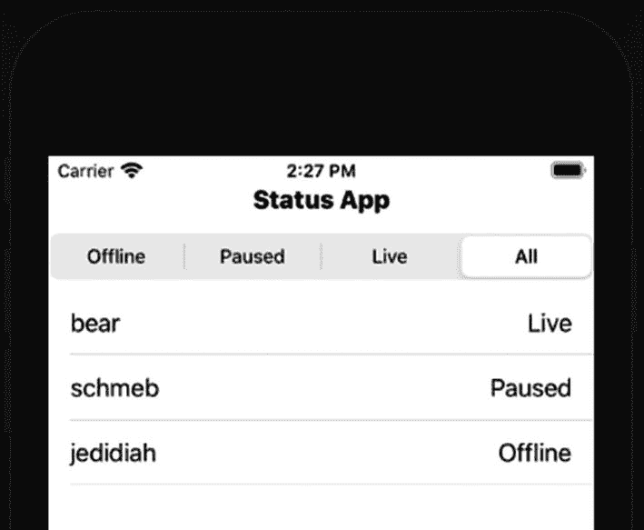
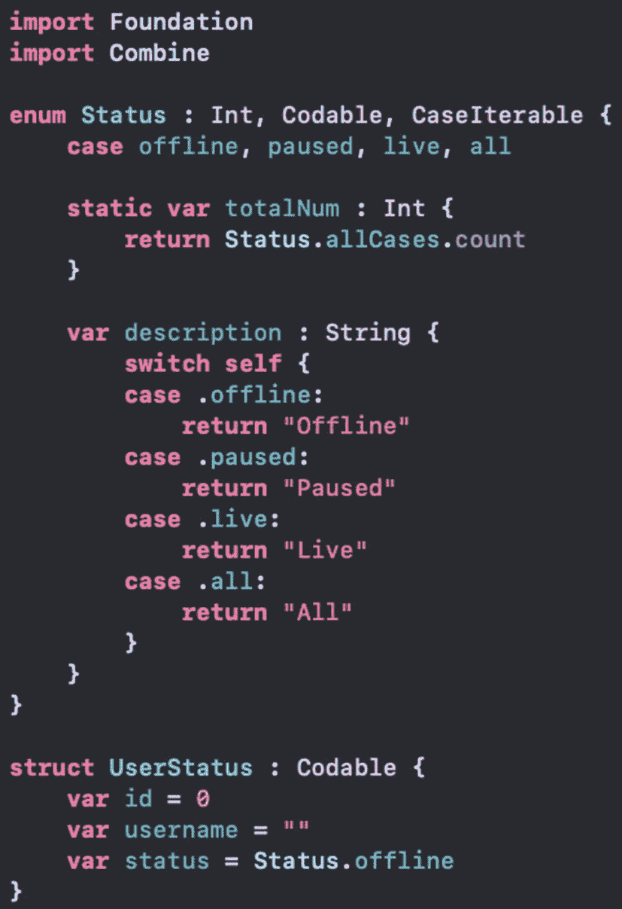
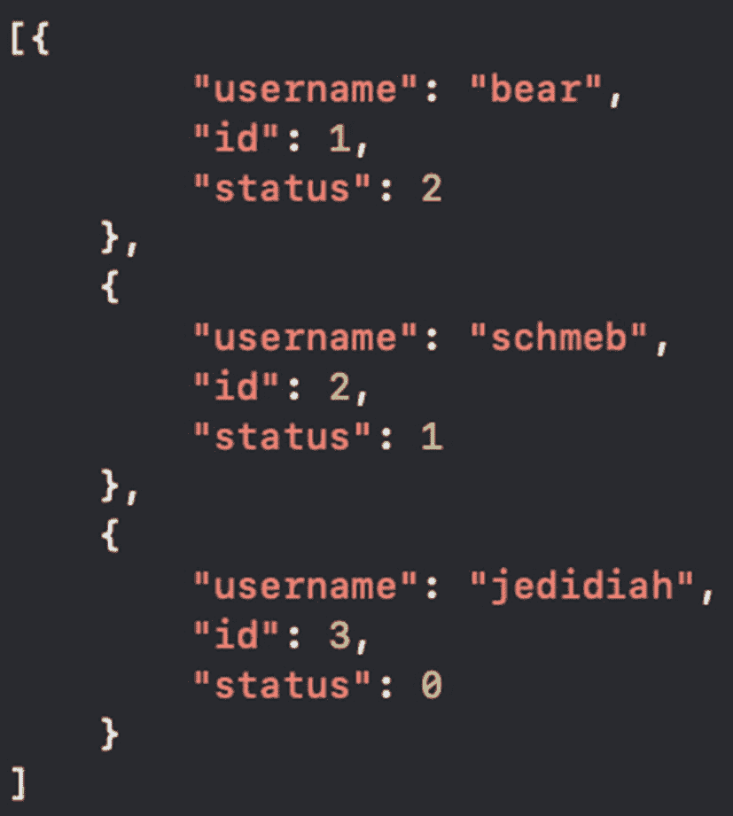
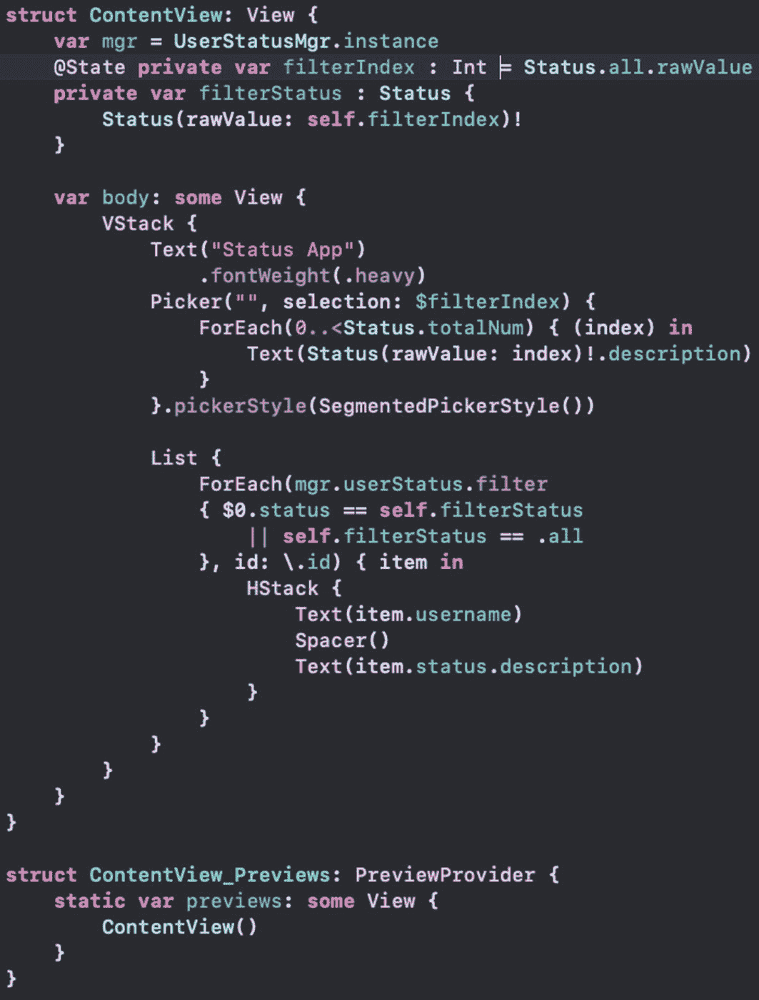
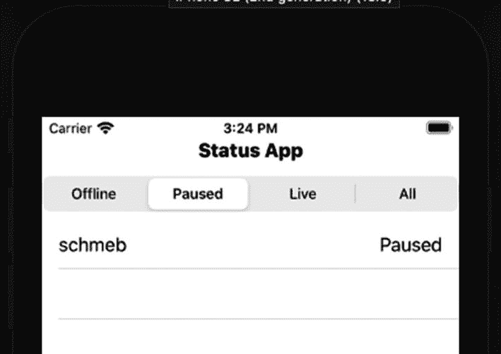
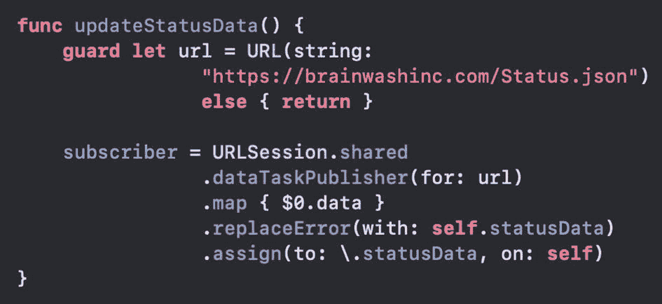
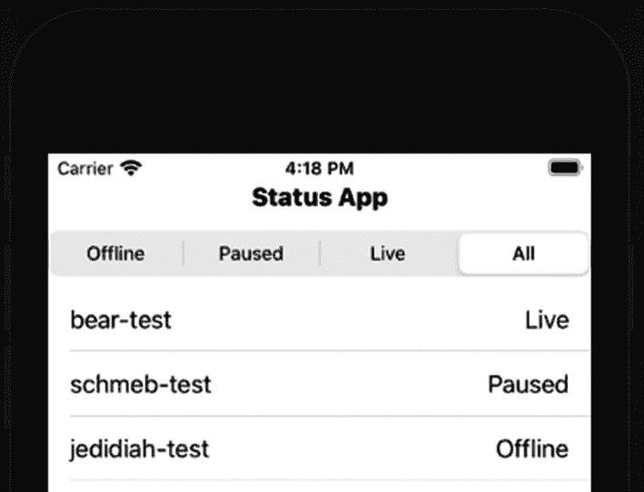

# 16. URLSession 发布者

虽然这不是一本关于 Combine 的书，但我确实想再介绍框架中的一些内容。希望本章能让你了解如何使用 Combine。同时，我也希望你能看到一条更直接的学习路径，以更好地掌握这个强大的框架。

在本章中，我们将讨论数据获取。我们将为此使用发布者和订阅者，从服务器获取数据，并更新 UI。为了测试/预览，我们也会从文件中加载数据。

## URLSession 发布者

如果你以前用过 `URLSession`，你会熟悉创建数据任务。`URLSession` 也提供了一个数据任务发布者。它接受一个 `URL` 作为参数，并返回发布者。

我们已经见过这在 `NotificationCenter` 和 `@Published` 包装属性中的工作方式。从这个意义上说，概念并不新鲜，但现在我们处理的是返回的数据。在我们的案例中，数据将代表 JSON。

解码 JSON 时可能会发生错误，因此我们也必须处理这些错误。

我提供了一个 `Ch16_BOC_StatusTracker.zip` 项目作为本章的起点。让我们看看代码。


### 状态跟踪器项目

我们将从 JSON 加载用户状态数据。JSON 中有三个字段：`id`、`username` 和 `status`。状态可以取三个值之一：`offline`、`paused` 和 `live`。

我们希望能够在列表中显示这些项目。我们还希望能够按状态值进行过滤。UI 将如图 16-1 所示。



图 16-1  
状态跟踪器应用 UI 设计

用户名将与它们关联的状态一起列出。状态选项显示在顶部的 `Picker`（类似于 UIKit 的 `Segmented Control`）中。

对于状态值，我们有一个枚举。数据模型是一个 `UserStatus` 结构体。两者都遵循 `Codable` 协议，如图 16-2 所示。



图 16-2  
模型代码

请注意，顶部我们导入了 `Combine`。它目前尚未使用，但我们知道我们会朝这个方向走。

`Status` 的底层类型是 `Int`。这可以在几个方面提供帮助。我们可以根据 `Picker` 所选索引创建 `Status` 值。此外，我们可以在 JSON 中存储整数，而不是传递字符串。

`Status` 也遵循 `Codable` 和 `CaseIterable` 协议。`CaseIterable` 允许我们访问值的 `allCases` 数组。访问 `allCases` 有助于遍历这些值或获取总数。我创建了一个 `totalNum` 计算属性来知道我们有多少个值。

请注意枚举中有一个 "all" 值。它应该仅用于过滤。

`description` 属性将值转换为 `String`。

这只是实现 `Status` 枚举的一种方式。我发现它清晰、有用且易于维护。

`UserStatus` 结构体有三个值，与 JSON 中的键匹配，如图 16-3 所示。



图 16-3  
JSON 数据

项目中包含一个类似文件用于测试数据。我们将从中加载数据，也会从服务器加载数据。

### 状态跟踪器 UI

状态跟踪器的 UI 使用了一些我们已经熟悉的元素和一个新的元素：`Picker`。这些元素位于一个 `VStack` 中，首先是一个 `Text` 元素。

`VStack` 中的第二个元素是 `Picker`。`Picker` 接收一个 `StringProtocol`、一个用于存储选择的选择项，以及用于选择的各个项。

我们还需要为选择器指定一个样式。如果不设置样式，它默认为 `WheelPickerStyle`，这类似于 UIKit 中的 `Picker View`。我们需要分段选择器样式。

最后是我们的列表。它将使用 `.filter` 遍历状态项目，以根据 `Picker` 中的选择仅查找我们感兴趣的项目。然后它为每个状态数组元素创建一个 `HStack` 和两个文本项。`ContentView` 代码如图 16-4 所示。



图 16-4  
ContentView 代码

请注意，`filterIndex` 有一个 `@State` 属性包装器，而 `Picker` 使用了这个绑定。当用户更改 `Picker` 选择时，这个 `Int` 将会更新。

`filterStatus` 属性是一个基于用户筛选选择的计算属性。它主要用于在用户列表的 `.filter` 调用中轻松检查。

预览代码与生成的代码相同。

### 模型管理器

我们的 `ContentView` 中的第一个属性是一个 `UserStatusMgr` 实例。它使用了该类中定义的单例。唯一使用它的地方是在我们 `List` 项的 `ForEach` 中。

如果我们只是遍历 `mgr.userStatus` 属性，它会列出所有项目。但我们希望匹配用户选择的筛选条件。我们遍历 `.filter` 中的项目，如果状态匹配或用户在选择器中选择了 "全部"，则包含它们。

当前的 `UserStatusMgr` 代码只有几个属性。

```
class UserStatusMgr {
    static let instance = UserStatusMgr()
    var userStatus = [UserStatus]()
}
```

它有单例属性和用于 `UserStatus` 项目的数组。我们需要添加用于从服务器加载数据的代码。

## 使用发布者获取数据

我们希望发布 `userStatus` 属性来更新 UI。因此，我们必须向该类添加 `ObservableObject` 协议，并使用 `@Published` 标记该属性。然后我们可以在 UI 中将该类设置为一个 `ObservedObject`。

我们还需要从服务器获取数据。然后我们可以解析它并更新 `userStatus` 属性以进行发布。

1.  声明 `UserStatusMgr` 类遵循 `ObservableObject` 协议。

1.  将 `@Published` 包装器添加到 `userStatus` 属性。

```
class UserStatusMgr : ObservableObject {
```

1.  为单例创建一个私有的 `init`，该初始化方法调用状态数据的更新函数（待编写）。

```
    private init() {
        updateStatusData()
    }
```

1.  创建一个名为 `updateStatusData` 的函数，用于创建 `URL` 实例。

```
    func updateStatusData() {
        guard let url = URL(string: "https://brainwashinc.com/Status.json")
        else { return }
    }
```

1.  在上述 `updateStatusData` 函数的 `guard` 之后，创建 `URLSession` 发布者。

```
    URLSession.shared
        .dataTaskPublisher(for: url)
```

`URLSession` 数据任务发布者的发布者定义了其输出和失败类型。输出是一个 `Data` 和 `URLResponse` 的元组。名称分别是 `data` 和 `response`。失败类型是 `URLError`。

在这种情况下，我们只想获取数据，但这只是元组的一部分。我们可以使用 `.map` 来稍微处理一下数据。

1.  向发布者添加 `.map`，以将响应元组转换为仅数据项。

```
    URLSession.shared
        .dataTaskPublisher(for: url)
        .map { $0.data }
```

```
@Published var userStatus = [UserStatus]()
```

`map` 的结果是一个仅向下游传递 `Data` 项的发布者。我们想要解码那个 `Data`，因为它是 JSON。由于这是一种常见操作，Combine 提供了一个 `.decode` 运算符。

1.  在 `.map` 之后添加 `.decode` 运算符。

```
URLSession.shared
    .dataTaskPublisher(for: url)
    .map { $0.data }
    .decode(type: [UserStatus].self,
            decoder: JSONDecoder())
```

`decode` 返回一个向下游传递 `Decodable` 的发布者，这很棒。但它的 `Failure` 类型是 `Error`。由于 JSON 解析可能失败，我们必须处理这种情况。

有多种方法可以处理这个问题。这里我们看一种简单的方法。使用 `.sink` 是另一个有用的选项，我鼓励你研究一下。

1.  在解码之后添加 `.replaceError`。

```
URLSession.shared
    .dataTaskPublisher(for: url)
    .map { $0.data }
    .decode(type: [UserStatus].self,
            decoder: JSONDecoder())
    .replaceError(with: self.userStatus)
```

现在，如果 `JSONDecoder` 出错，我们只需使用 `self.userStatus` 的当前值继续执行。这仍然返回一个发布者，所以我们需要继续到订阅者。

1.  添加 `.receive` 以在主线程上发布。

```
    URLSession.shared
        .dataTaskPublisher(for: url)
        .map { $0.data }
        .decode(type: [UserStatus].self,
                decoder: JSONDecoder())
        .replaceError(with: self.userStatus)
        .receive(on: DispatchQueue.main)
```

现在我们到达了发布者链的末端，需要创建订阅。

1.  创建一个名为 `subscriber` 的 `AnyCancellable` 作为 `UserStatusMgr` 类的属性。


1.  添加一个`.assign`修饰符来分配值，并将结果存储在第 10 步的属性中。

```
var subscriber : AnyCancellable?
```

```
subscriber = URLSession.shared
.dataTaskPublisher(for: url)
.map { $0.data }
.decode(type: [UserStatus].self,
decoder: JSONDecoder())
.replaceError(with: self.userStatus)
.receive(on: DispatchQueue.main)
.assign(to: \.userStatus, on: self)
```

此时运行应用程序可以工作，但它不会将数据加载到 UI 中。这是因为我们使用`UserStatusMgr`的初始值`userStatus`（为空）创建了 UI。

我们需要将`ContentView`的`mgr`属性标记为`ObservedObject`。这样当`userStatus`属性被发布时，我们就会收到更新，从而触发 UI 更新。

2.  在`ContentView`中为`mgr`属性添加`@ObservedObject`。

```
    struct ContentView: View {
    @ObservedObject var mgr = UserStatusMgr.instance
    ```

现在，应用程序会显示 UI，并在获取数据后得到更新。使用过滤器也能正常工作，如图 16-5 所示。



**图 16-5**  
带筛选列表的应用程序运行界面

这个发布者只运行一次。任务运行、发布然后停止。如果你再次调用`updateStatusData`，它会获取新数据并继续执行。

我们不仅了解了如何用发布者获取数据，还接触了一些其他操作符。我鼓励你自行研究 Combine 中的操作符，以了解所有可用的功能。

## 调试数据

在开发和测试过程中，我们可能不希望每次都访问服务器。相反，我们可以编写代码从项目包中读取测试文件。

一种选择是直接加载文件数据并将其解析到`userStatus`属性中。这种方法完全可以正常工作。

以下是一个解决方案，它在后台为调试构建加载数据，并在 UI 线程上发布。如果这段代码位于`updateStatusData`的顶部，它将针对调试构建运行。

**注意**：稍后我们会在项目中添加此代码的一个变体。除非你想尝试，否则现在无需添加。

```
#if DEBUG
guard let urlLocal = Bundle.main.url(
forResource: "Status",
withExtension: "json")
else { return }
DispatchQueue.global().async {
if let data = try? Data(contentsOf: urlLocal) {
DispatchQueue.main.async {
self.userStatus = (try? JSONDecoder()
.decode([UserStatus].self,
from: data))
?? self.userStatus
}
}
}
return
#endif
```

这段代码创建了包 URL，读取数据（在后台），并解码 JSON。当`userStatus`更新时，它会被发布。这没问题，但有点冗余，并且在测试时不会用到我们现有的代码。

我们可以想出一个更有趣的解决方案，使用另一个订阅。

首先，这将给我们一个机会来处理更多发布者-订阅者的例子。其次，我们可能能够重用代码，从而在测试中更多地去检验我们的生产代码。

让我们将加载的数据（服务器或本地）存储在一个属性中，并创建一个该属性的订阅者。在新的订阅者中，我们可以处理 JSON 数据并更新`userStatus`属性。

**使用本地测试数据**

我们需要一个新的属性来存储`Data`实例。另外，我们还需要另一个订阅者属性。我们可以更新`updateStatusData`，使其在调试构建时使用本地文件路径，以避免访问服务器。

1.  在`UserStatusMgr`中，创建两个新属性：`statusData`（类型为`Data`并初始化）和`subscriberData`（类型为`AnyCancellable?`）。

```
@Published var statusData = Data()
var subscriberData : AnyCancellable?
```

我们将 JSON 数据存储在`statusData`中。由于它是已发布的，我们可以为其创建订阅。然后，每当它被更新时，我们就处理新数据。

2.  在`UserStatusMgr`中创建一个新函数来创建发布者-订阅者。

```
    func createSubscription() {
    $statusData
    }
    ```

我之前提到过，还有其他方法可以处理`decode`的错误。一种方法是使用`.catch`操作符。这里的问题是，如果它捕获到错误，它会通过用一个新的发布者替换当前发布者来取消订阅。在我们的例子中，这可能没问题，因为我们的发布者应该只执行一次任务。

然而，如果我们想要支持持续的发布，我们不想让它被取消。相反，我们可以使用`.flatMap`。`.flatMap`调用接收上游的输入并返回一个发布者。在其中我们可以进行解码。如果解码失败，我们可以捕获它。

我们将在这里使用`.flatMap`来了解它的工作原理。

1.  向发布者添加`.flatMap`。

```
    func createSubscription() {
    $statusData
    .flatMap{ data in return Just(data)
    }
    }
    ```

此时，`flatMap`只获取数据并使用`Just`创建一个新的发布者。`Just`简单地发布数据并结束。

我们将在`Just`上添加操作符来解码 JSON 并捕获错误。如果有错误，我们可以使用另一个`Just`来发布`userStatus`的当前值。

1.  添加解码 JSON 和捕获可能错误的调用。

```
    func createSubscription() {
    $statusData
    .flatMap{ data in
    return Just(data)
    .decode(type: [UserStatus].self,
    decoder: JSONDecoder())
    .catch { _ in
    return Just(self.userStatus)
    }
    }
    }
    ```

现在我们拥有了我们想要的发布者。我们获取`statusData`属性的发布者，并使用`.flatMap`创建一个发布者。`.flatMap`获取数据并使用`Just`创建另一个发布者。该发布者上的操作符解码 JSON。


### 排版后的文本

如果解码数据时出现错误，我们会发布当前的 `self.userStatus`。 `catch` 会将当前的发布者（第一个 `Just`）替换为另一个 `Just`。

4. 添加 `.receive` 来创建我们发布者的最终版本。

1. 添加 `.assign` 来创建订阅。将订阅存储在步骤 1 中创建的新 `AnyCancellable` 属性中。

```
createSubscription() {
$statusData
.flatMap{ data in
return Just(data)
.decode(type: [UserStatus].self,
decoder: JSONDecoder())
.catch { _ in
return Just(self.userStatus)
}
}
.receive(on: DispatchQueue.main)
}
```

```
createSubscription() {
subscriberData =
$statusData
.flatMap{ data in
return Just(data)
.decode(type: [UserStatus].self,
decoder: JSONDecoder())
.catch { _ in
return Just(self.userStatus)
}
}
.receive(on: DispatchQueue.main)
.assign(to: \.userStatus, on: self)
}
```

基于来自 `.assign` 的结果发布者，我们创建了订阅。现在，一旦数据处理完毕，我们就会保存 `userStatus` 数组。这是一个已发布的属性，UI 将会随之更新。

回到我们的 `updateStatusData` 函数，我们不再需要设置 `userStatus`。相反，我们只使用 `Data` 值来设置 `statusData`。然后，我们创建的针对 `statusData` 的订阅将处理它，并且 `userStatus` 将会被发布。

`updateUserStatus` 中的订阅只需接收数据、进行映射、处理错误，并赋值给该属性。此外，由于我们不再触发 UI 数据的发布，因此不再需要 `.receive` 修饰符。



图 16-6

当前的 `updateStatusData` 函数

1. 更新 `updateStatusData` 函数，移除 JSON 解析和 `.receive` 修饰符。由于我们现在处理的是数据，`.assign` 需要设置 `statusData`（而不是 `userStatus`）。更新后的代码如图 16-6 所示。

我们需要确保调用了创建订阅的函数。

1. 在 `init` 中添加对 `createSubscription` 的调用。

```
    private init() {
    createSubscription()
    updateStatusData()
    }
```

如果你现在运行这个应用，它应该像以前一样工作，只不过现在有两个订阅。我们在 `updateStatusData` 中的原始订阅者仍然会接收服务器数据。但是，现在它只是将数据存储在 `statusData` 属性中。

`createSubscription` 中的新订阅者接收该 `Data` 实例并解析它。解析后的数据现在存储在我们的 `userStatus` 数组中，该数组在主线程上发布。

到目前为止，此练习中的步骤已将数据加载过程分为两部分。第一部分获取数据。第二部分解析数据。

现在我们可以添加从本地加载数据的选项。在调试构建时，这将替换第一部分中的服务器请求。第二部分的操作方式保持不变。当数据被存储时，针对它的订阅将解析数据并将其设置到数组中。

2. 在 `updateStatusData` 中，在函数顶部添加测试代码，以在 `DEBUG` 条件语句内从文件加载 JSON 数据。

```
    func updateStatusData() {
    #if DEBUG
    guard let urlLocal = Bundle.main.url(
    forResource: "Status",
    withExtension: "json")
    else { return }
    if let data = try? Data(contentsOf: urlLocal) {
    DispatchQueue.global().async {
    self.statusData = data
    }
    }
    return
    #endif
    ...
```

对于生产构建，我们有一个订阅来接收数据。对于调试，我们只需本地加载数据。无论数据是从服务器还是本地文件获取，解析都是通过对数据属性的订阅来完成的。

**注意** 为了避免编译器警告，你可以删除前面代码中的 `return`，将 `#endif` 改为 `#else`，并在函数末尾加上 `#endif`。详情请参阅本章的 EOC 代码。

如果你现在运行该应用，数据应该从文件加载并且 UI 会更新。本地数据在用户名后附加了“-test”，以区分加载的是哪部分数据，如图 16-7 所示。



图 16-7

使用本地测试数据的 UI

生产构建将忽略 `DEBUG` 条件语句，并从服务器加载数据。

### 章节总结

在本章的代码中，我们探讨了许多变化。我们看到了如何从 `URLSession` 创建一个发布者。生成的数据任务发布者可以像其他发布者一样使用运算符进行修改。我们可以映射数据、解码、替换错误、赋值等等。

我们还为本地测试数据创建了一个变体。此路径使用 `flatMap` 来解码数据并捕获任何错误。它在几个地方使用了 `Just`，并且还避免了在发生错误时取消订阅。

最后，我们有了两个已发布的属性和两个订阅者。

我们的 `ContentView` 将 `UserStatusMgr` 属性声明为被观察对象。这样，当更新发生时，我们的 UI 将反映这些变化。

第二个订阅者针对的是 `statusData` 属性。无论是通过本地数据加载还是服务器返回数据来更改它，我们的第二个订阅者都会处理它。现在我们有了一个统一的地方来解析数据、设置 `userStatus` 并发布给 UI。

正如我希望你理解的那样，有多种方法可以完成你需要做的事情。哪种解决方案最佳取决于你的具体需求。我的意图是向你展示多种方法。但是，重申一下，这不是一本关于 Combine 的书。

我们只看了运算符列表的一部分。通过进一步学习，其中一些会变得很熟悉，比如 `map`、`filter`、`reduce`、`compactMap`、`count`、`max`、`contains`、`drop` 等等。还有一些运算符与带有“try”前缀的运算符相关，例如 `tryMap`、`tryFilter`、`tryReduce` 等等。

一些运算符对你来说可能是新的，比如 `sink`、`zip`、`combineLatest` 和 `merge`。我希望你把它们都研究一下！

