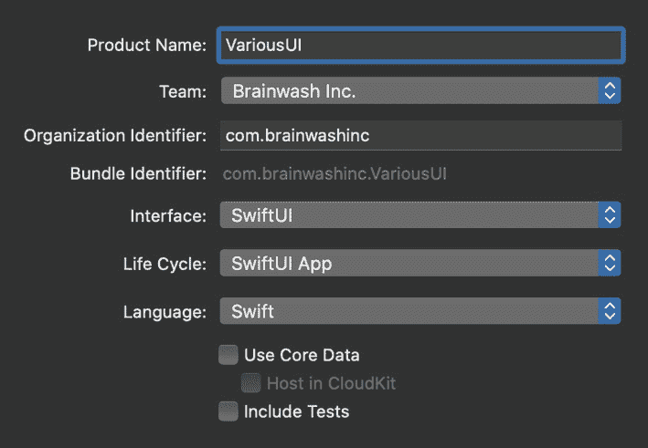
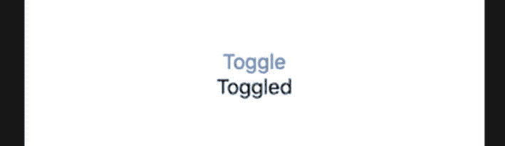
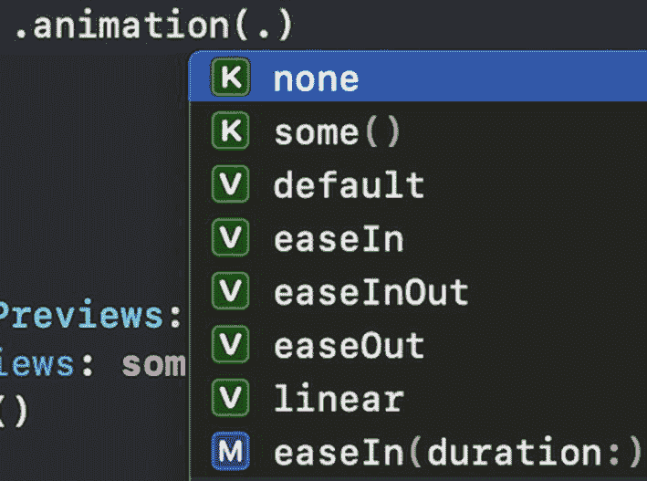
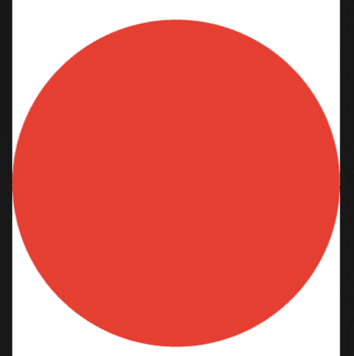
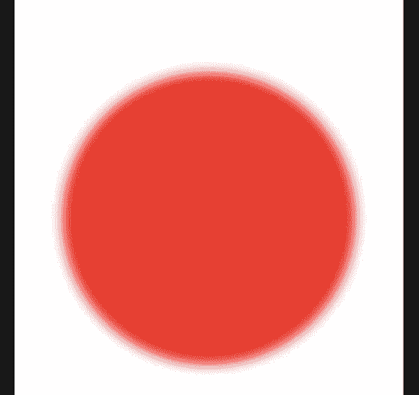
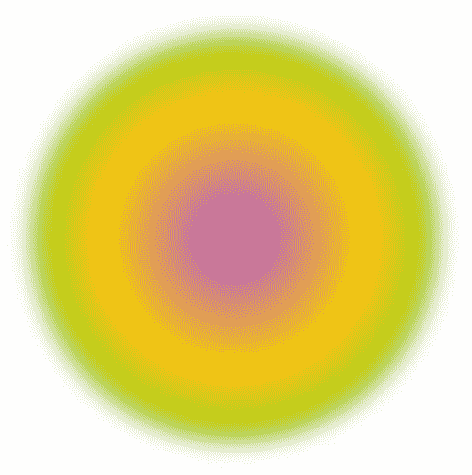
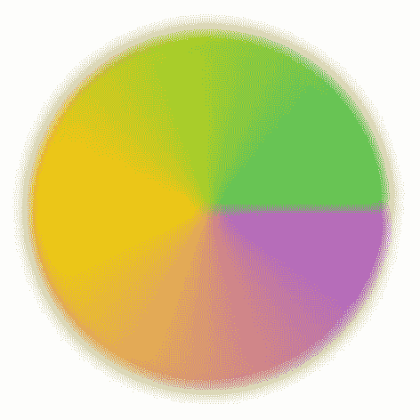
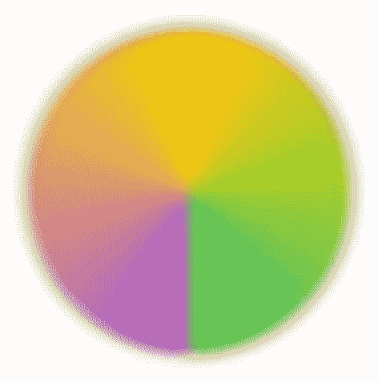
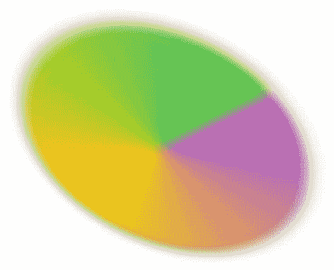
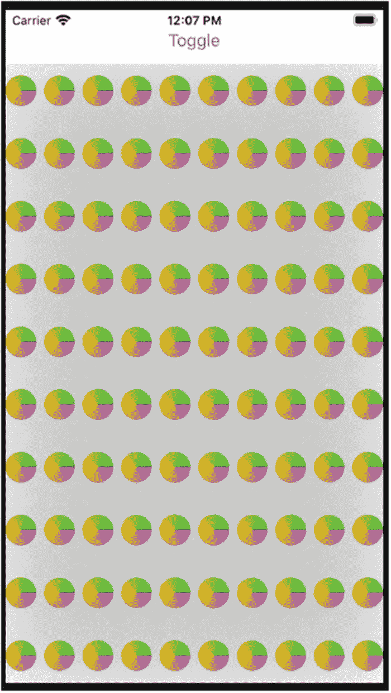

# 17. 过渡与动画

通常，当我亲自教授 iOS 开发时，我们会讨论各种 UI 动画的实现方式。动画领域有大量的方法和选项。然而，大多数时候，我们实际上并不试图做太复杂的事情。

我主要是为那些有业务需求的客户进行开发。这可能是一个面向客户的应用程序，一个他们网站的配套应用，或者一个用于查看数据的应用程序。

通常，动画的发挥空间很小。我可能会为了显示而淡入/淡出某些内容。有时，我需要移动菜单或类似元素。但华丽的动画通常不在考虑范围之内。

我之所以说这些，是因为虽然我想向大家展示如何在 SwiftUI 中制作动画，但重点应该放在选项上。本章希望能提供一些工具，让你了解一些可能的实现方式以及如何深入研究。只是不要以为我们会构建一个 3D 游戏或类似的东西。


### 过渡效果

过渡效果控制视觉元素如何从视图中插入或移除。插入和移除操作默认不会自动动画化，但可以通过设置实现动画效果。

SwiftUI 内置了一些常见展示效果的过渡动画，其中包括 `opacity`（透明度）、`move`（移动）、`scale`（缩放）和 `slide`（滑动）。`move` 过渡需要指定一个 `Edge`（边缘）值，以确定移动起始位置：`top`（顶部）、`bottom`（底部）、`leading`（前导）或 `trailing`（后沿）。

接下来，我们添加一些 UI 元素来观察过渡效果的实际运作。

## 文本的过渡效果

我们将从创建一个新的 SwiftUI 项目开始。首先添加一个 `Button`（按钮）来切换某个布尔值，然后根据该值在 UI 中添加一个 `Text`（文本）元素，最后为这个文本元素设置插入和移除时的过渡效果。



图 17-1 新建项目选项

1.  新建一个 SwiftUI 项目（我将其命名为 `VariousUI`），界面框架选择 SwiftUI，生命周期选择 SwiftUI App（见图 17-1）。
2.  在 `ContentView.swift` 文件的 `ContentView` 结构体中添加一个切换属性。



图 17-2 切换按钮与文本

3.  在 `ContentView` 的 `body` 计算属性中，将默认内容替换为 `VStack`。

    ```
    var body: some View {
    VStack {
    }
    }
    ```

4.  在 `VStack` 中，创建一个用于切换值的 `Button`。

    ```
    Button(action: {
    self.isToggled.toggle()
    }) {
    Text("Toggle")
    }
    ```

5.  在按钮下方添加另一个 `Text`，当属性值为 `true` 时显示“Toggled”。

    ```
    if isToggled {
    Text("Toggled")
    }
    ```

    现在运行应用，屏幕上会显示一个“Toggle”按钮。点击按钮后，会显示一个`Textfield`文本字段，如图 17-2 所示。

```
@State var isToggled = false
```

接下来，我们将为 `Text` 元素添加过渡效果，使其以不同方式呈现。

1.  为 `Text` 元素添加过渡效果。

    ```
    Text("Toggled")
    .transition(.move(edge: .top))
    ```

    如果现在运行应用，你仍然会看到 `Text` 元素突然出现和消失。我们需要添加一些动画效果。

2.  为 `Text` 元素添加动画。

    ```
    Text("Toggled")
    .transition(.move(edge: .top))
    .animation(.easeInOut)
    ```

`Animation` 提供了多种选项，如图 17-3 所示。



图 17-3 动画部分列表

欢迎尝试不同类型的动画。我个人非常喜欢 `spring`（弹簧动画）。

现在运行应用（或启用实时预览模式），你应该会看到 `Text` 元素在添加时从顶部移入，在移除时也移向顶部。

### 非对称过渡

通常，我们希望元素以某种方式进入屏幕，却以不同的方式离开屏幕。为此，我们可以创建非对称过渡。创建非对称过渡的函数需要两个参数：`insertion`（插入）和 `removal`（移除）。这里只涉及两种过渡。

因此，如果我们想用 `opacity`（淡入）插入一个 UI 元素，但用 `scale`（缩放）将其移除，这完全可行。

### 非对称过渡

让我们为 `Text` 元素创建一个非对称过渡。如果你之前尝试过不同的过渡效果，应该已经见过 `opacity` 和 `scale`。我们将使用这两个效果。

1.  将之前使用的过渡（即 `move(edge: .top)`）替换为调用 `.asymmetric`。
2.  对于 `insertion`，我们使用 `opacity`；对于 `removal`，传入 `slide`。

    ```
    Text("Toggled")
    .transition(
    .asymmetric(
    insertion: .opacity,
    removal: .slide))
    ```

```
Text("Toggled")
.transition(
.asymmetric(
```

运行应用。发生了什么？动画效果消失了！在这种隐式动画中，过渡效果不会自动产生动画。我们需要使用显式动画。

1.  在 `Button` 的 action 中，使用 `withAnimation` 为切换值的操作添加隐式动画。

    ```
    Button(action: {
    withAnimation(.easeInOut(duration: 1)) {
    self.isToggled.toggle()
    }
    ```

    这里我们传入了一秒作为动画时长。你可以自由传入你喜欢的任何时长（或者像之前那样不传参）。

    现在，过渡效果应该可以正常工作和动画化了。但如果我们希望元素淡入并移动，或者使用其他组合过渡呢？我们可以将它们组合起来。

2.  在 `opacity` 过渡上调用 `combine`，并传入一个 `move` 过渡。

    ```
    Text("Toggled")
    .transition(
    .asymmetric(
    insertion: AnyTransition
    .opacity
    .combined(with:
    .move(edge: .top)),
    removal: .slide))
    ```

现在过渡效果已按我们期望的方式工作，接下来进行代码清理。我们将为创建的过渡效果定义一个独立的过渡类型，可以通过扩展 `AnyTransition` 结构体来实现。

1.  创建 `AnyTransition` 的扩展（放在同一个文件中即可）。

    ```
    extension AnyTransition {
    }
    ```

2.  声明一个名为 `textTransition` 的静态变量，类型为 `AnyTransition`。
3.  实现 `textTransition` 的 `get`（无需关键字）方法，以创建我们在代码中使用的过渡效果。

    ```
    static var textTransition : AnyTransition {
    AnyTransition
    .asymmetric(
    insertion: AnyTransition
    .opacity
    .combined(with:
    .move(edge: .top)),
    removal: .slide)
    }
    ```

4.  现在使用新定义的过渡效果，替换掉原先移动到 `textTransition` 中的多行代码。

    ```
    Text("Toggled")
    .transition(.textTransition)
    ```

```
static var textTransition : AnyTransition
```

运行代码，验证过渡效果是否与之前一致。

通过这个练习，我们不仅组合了多种过渡效果，还创建了一个自定义过渡，以便在其他地方复用。


### 动画

我们已经了解了一点关于过渡动画的内容。还有一些其他动画效果我们也想探讨一下。

各种修饰符的更改都可以进行动画化。一些常见的属性包括尺寸/缩放、颜色、阴影、旋转和模糊。

修饰符的动画可以通过隐式或显式动画来实现。此外，你还可以针对不同的更改设置不同的隐式动画修饰符。

## 为更改添加动画

在本练习中，我们将研究如何对 UI 元素的各项更改进行动画处理。

1.  在 `VStack` 的底部，向 UI 添加一个圆形。
2.  将圆形的颜色设置为红色。

```
Circle()
.foregroundColor(.red)
```

```
Circle()
```

在预览中，你应该会在 UI 中看到一个大的红色圆形，如图 17-4 所示。



图 17-4：已添加到 UI 中的圆形

3.  为圆形添加 `shadow`、`scaleEffect` 和 `blur` 修饰符，所有这些都基于 `isToggle` 的值。

```
Circle()
.foregroundColor(.red)
.shadow(radius: isToggled ? 10 : 50)
.scaleEffect(isToggled ? 0.75 : 1)
.blur(radius: isToggled ? 5 : 0)
```

现在，当你运行应用并切换该值时，你应该会看到一个带有阴影、尺寸较小且应用了模糊效果的红色圆形，如图 17-5 所示。



图 17-5：切换值为 True 影响 UI

这样做效果不错，并且有了动画。但对于一个鲜红色的球体来说，看起来似乎不够生动。让我们添加一个动画修饰符来赋予它一些活力。

4.  在 `scaleEffect` 修饰符之后，添加一个动画修饰符。使用 `spring` 并传入阻尼分数 `0.5`。

```
Circle()
.foregroundColor(.red)
.shadow(radius: isToggled ? 10 : 50)
.scaleEffect(isToggled ? 0.5 : 1)
.animation(.spring(dampingFraction : 0.5))
.blur(radius: isToggled ? 5 : 0)
```

阻尼分数是应用于被动画属性的拖拽力大小。默认值是 `0.825`，不会产生太多弹跳效果。我们设置的 `0.5` 效果相当不错。如果将其设置成一个很小的值，比如 `0.15`，会使它在最终值附近振荡好几次。你可以尝试一下。

`spring` 还有许多其他参数可供传入。我鼓励你将来去查看一下。

运行应用时，你应该会注意到阴影和缩放的动画使用了弹簧动画，并且它们使用了自身的计时。显式调用的 `withAnimation` 仍然持续一秒，并应用于 `blur`。如果不明显，可以将 `withAnimation` 的持续时间设为五秒来测试一下。

## ViewModifier 协议

我们的红色圆形上应用了几个修饰符。如果我们喜欢这个组合，可能希望将其保存起来，以便在代码的其他地方使用。

对于我们的 `Transition`，我们是将其作为 `AnyTransition` 的一个扩展来实现的。我们声明的静态计算属性类型是 `AnyTransition`。对于我们的修饰符，它将是一个遵循 `ViewModifier` 协议的结构体。

`ViewModifier` 协议与 `View` 非常相似。然而，它的 `body` 是一个函数而不是一个属性。这个 `body` 函数接收一个 `Content` 并返回一个 `View`。这里的 `Content` 就是应用该修饰符的值。在我们的例子中，它是一个实现了 `View` 的类型。

### 创建视图修饰符

我们将创建一个实现了 `ViewModifier` 的结构体。我们有一个必需的 `body` 函数，它接收一个 `Content`（在我们的例子中，是一个实现 `View` 的类型）并返回一个 `View`。

1.  声明该结构体（在同一文件中即可）。

```
struct BouncyModifier : ViewModifier {
}
```

2.  声明一个用于控制 `View` 模糊量的属性。

```
struct BouncyModifier : ViewModifier {
    var blurFactor : CGFloat
}
```

3.  声明 `body` 函数。

```
struct BouncyModifier : ViewModifier {
    var blurFactor : CGFloat
    func body(content: Content) -> some View {
    }
}
```

4.  实现 `body` 函数，将修饰符添加到传入的参数上。

```
return content
    .shadow(radius: blurFactor > 0 ? 10 : 50)
    .scaleEffect(blurFactor > 0 ? 0.5 : 1.0)
    .animation(
        .spring(dampingFraction : 0.15))
    .blur(radius: blurFactor)
```

5.  使用新的修饰符替换之前的一串修饰符。

```
Circle()
    .foregroundColor(.red)
    .modifier(BouncyModifier(blurFactor:
        isToggled ? 5 : 0))
```

运行应用，你会发现动画效果相同，但弹跳感更强了一点。

除了使用 `.modifier` 来创建 `ViewModifier`，还有另一种选择。我们可以为 `View` 创建一个扩展来帮我们做到这一点。

最终，两者的作用是相同的，只是代码位置不同。这也有助于保持 `View` 代码的整洁。

6.  为 `View` 定义一个扩展（在同一文件中即可）。

```
extension View {
}
```

7.  定义一个 `bouncy` 函数，它接收一个 `CGFloat` 并返回一个 `View`。

```
extension View {
    func bouncy(blurFactor: CGFloat)
        -> some View {
    }
}
```

8.  返回一个使用传入参数创建的 `BouncyModifier` 修饰符。

```
extension View {
    func bouncy(blurFactor: CGFloat)
        -> some View {
        self.modifier(
            BouncyModifier(blurFactor: blurFactor))
    }
}
```

9.  在你的 `Circle` 上使用这个函数，而不是使用 `.modifier` 配合 `BouncyModifier`。

```
Circle()
    .foregroundColor(.red)
    .bouncy(blurFactor: isToggled ? 5 : 0)
```

通过创建 `ViewModifier` 和 `View` 的扩展，我们的代码变得更整洁了。我们可以在项目的其他地方复用这两者。此外，我们可以在一处进行更改，从而影响整个应用中的弹跳动画效果。

正如我所提到的，有一些动画函数可以影响动画的性能。其中一些用于控制动画时间的曲线。这些函数，`easeIn`、`easeOut`、`easeInOut` 和 `linear`，都提供了接受一个 `Double` 类型持续时间参数的形式。持续时间以秒为单位。

`timingCurve` 函数允许开发者将时间曲线指定为贝塞尔路径坐标和持续时间。

我们已经看到 `spring` 及其默认值 `response`、`dampingFraction` 和 `blendDuration`。还有 `interactiveSpring`。它基本相同，但为交互式动画提供了不同的默认值。`interpolatingSpring` 允许你指定（弹簧的）质量和刚度，以及阻尼和初始速度。

其他函数包括 `delay`、`speed`，以及两个用于重复动画的函数：`repeatCount` 和 `repeatForever`。

所有这些函数都允许你自定义动画。说实话，在我使用动画的大部分时间里，我都可以坚持使用很多默认值。有时，我需要一个特定的持续时间。在这些情况下，我通常会使用 `0.37`，这与许多系统动画（如键盘弹出）的持续时间匹配。我使用的另一个变化差不多只有 `spring`，用来增加一些弹跳效果。


### 渐变

让我们为圆形添加一些颜色。我们可以创建一个渐变来填充圆形。创建 `Gradient` 实例的一个简单方法是传入一些颜色。生成的 `Gradient` 会在颜色之间进行插值过渡。

要填充我们的圆形，我们将使用 `.fill` 修饰符。我们传入一个符合 `ShapeStyle` 协议的内容。`Color` 符合该协议，因此我们可以将一个颜色传入 `.fill`。

```
Circle().fill(Color.blue)
```

其他实现了 `ShapeStyle` 协议的结构体包括 `ForegroundStyle`、`ImagePaint`、`LinearGradient`、`RadialGradient` 和 `AngularGradient`。

## 为圆形添加颜色

我们将创建一个渐变并填充圆形。现在，通过为元素增加一些细节定义，我们的动画会变得更有活力。

1.  在 `ContentView` 中创建一个渐变属性。

    ```
    struct ContentView: View {
    @State var isToggled = false
    let gradient = Gradient(colors:
    [.purple, .yellow,
    .green])
    ```

2.  在 `body` 的顶部，`VStack` 之上，添加一个 `RadialGradient`。

    ```
    var body: some View {
    let radialGradient = RadialGradient(gradient:
    gradient,
    center: .center,
    startRadius: 1.0,
    endRadius: 250.0)
    VStack {...
    ```

3.  使用上一步创建的径向渐变，在 `Circle` 的 `.fill` 修饰符中替换掉 `.foreground`。

    ```
    Circle()
    .fill(radialGradient)
    .bouncy(blurFactor: isToggled ? 5 : 0)
    ```

运行应用，查看如图 17-6 所示的颜色效果。



图 17-6 — 动画后的径向渐变圆形

1.  在第二步的 `radialGradient` 下方，创建一个 `AngularGradient`。

    ```
    let angularGradient = AngularGradient(gradient:
    gradient,
    center: .center,
    angle: .degrees(0))
    ```

2.  在 `.fill` 中使用这个新的 `angularGradient`。

    ```
    Circle()
    .fill(angularGradient)
    ```

运行应用，查看如图 17-7 所示的新颜色填充效果。



图 17-7 — 动画后的径向渐变圆形

现在我们的圆形有了更多颜色，使其更具活力。

## 旋转

旋转 UI 元素是另一种常见的变换。它也是动画的一个很好的变化点。我们可以使用两个修饰符来轻松旋转圆形。

`rotationEffect` 修饰符接受两个参数。第一个参数是旋转的角度。第二个参数是可选的旋转中心点。默认的中心点是圆心。

```
.rotationEffect(.degrees(90))
```

注意：我们将在下一个练习中将这些旋转效果添加到代码中。

`rotation3DEffect` 同样接受旋转角度和旋转轴。`anchor`（默认为中心）、`anchorZ`（默认为 0）和 `perspective`（默认为 1）都有默认值，因此不是必需的。

轴参数指定要围绕旋转的一个或多个轴。如果我们只指定 Z 轴，它的行为将和 `.rotationEffect` 一样。

```
.rotation3DEffect(Angle(degrees: 90),
axis: (x: 0, y: 0, z: 1))
```

Z 轴是前后方向。X 轴是左右方向。Y 轴是上下方向。

让我们尝试一些操作。

### 添加旋转效果

我们首先添加旋转来让圆形旋转起来。然后我们再添加 3D 旋转，看看真正的效果。



图 17-8 — 动画后的圆形

1.  在我们自定义的 `.bouncy` 修饰符之后添加 `.rotationEffect`。

    基于 `isToggled` 属性进行旋转。

    ```
        Circle()
        .fill(angularGradient)
        .bouncy(blurFactor: isToggled ? 5 : 0)
        .rotationEffect(.degrees(isToggled ? 90 : 0))
    ```

    运行应用，可以看到圆形像图 17-8 那样旋转了。

2.  移除 `.rotationEffect`，改用 `.rotation3DEffect`，但仅针对 Z 轴。

    ```
    .rotation3DEffect(Angle(degrees: isToggled ? 90 : 0),
    axis: (x: 0, y: 0, z: 1))
    ```

    运行应用，结果应该与图 17-7 看起来一样。

3.  将轴改为 X 轴（其他两个轴设为 0）。

    ```
        .rotation3DEffect(Angle(degrees: isToggled ? 90 : 0),
        axis: (x: 1, y: 0, z: 0))
    ```

    如果你运行应用，会看到动画将圆形部分翻转，使其变平并不可见。

    使用 Y 轴会产生相同的效果，只是它会向另一个方向翻转。

4.  在旋转调用中使用所有三个轴，并将角度改为 300。

    ```
        .rotation3DEffect(Angle(degrees:
        isToggled ? 300 : 0),
        axis: (x: 1, y: 1, z: 1))
    ```

    现在运行代码会显示出更多的动作。它有点快，所以我们来放慢速度。

5.  在 `.rotation3DEffect` 之后添加一个带有 `.spring` 和速度设置的动画。

    ```
    .animation(.spring().speed(0.1))
    ```

    如果出现错误，是因为编译器无法确定上下文。在 `.spring` 前面加上 `Animation` 来帮助解决。

    ```
    .animation(Animation.spring().speed(0.1))
    ```

    `speed` 接收一个动画时间乘数。使用 `0.10` 会使动画耗时变为与动画本身速度相关的 10%。默认动画耗时是 `0.37` 秒，所以我们的旋转应该大约需要 4 秒钟。

最终结果应该如图 17-9 所示。



图 17-9 — 3D 旋转后的圆形

现在我们应用中有三个动画。第一个是在按钮动作中的隐式动画，用于为切换属性的变化添加动画效果。这为“Toggled”元素的文本添加了动画。

另一个动画处理了 `BouncyModifier`。它使用带阻尼分数参数的 `.spring`。

第三个动画作用于我们的 3D 旋转效果，我们使用了 `.spring` 和 `.speed`。

让我们对旋转动画再做一处修改。

6.  将 `.spring` 和 `.speed` 调用改为一个持续时间为 `0.75` 秒的 `.linear`。

    ```
        Circle()
        .fill(angularGradient)
        .bouncy(blurFactor: isToggled ? 5 : 0)
        .rotation3DEffect(Angle(degrees:
        isToggled ? 300 : 0),
        axis: (x: 1, y: 1, z: 1))
        .animation(.linear(duration: 0.75))
    ```

动画结束时的外观和之前一样。然而，动画耗时是固定的（不是带乘数的相对时间）。你可能会注意到旋转的开始和停止略显生硬。线性动画在动画过程中不会加速或减速。


## `DrawingGroup`

我们的圆形绘制和动画效果很好，但若同时运行大量动画，性能可能会下降。

假设我们在屏幕上放置 100 个圆形。这将涉及大量动画：旋转、阴影、缩放和模糊。

此时，使用绘图组（Drawing Group）有助于提升性能。将所有圆形放入一个绘图组后，它会先在屏幕外渲染`View`，再将结果呈现在屏幕上。这是一种更快的渲染方法。

此外，绘图组在底层使用 Metal 框架。它能更直接地与 GPU 协作，实现更快的图形处理。

### 在 SWIFT 中使用 METAL

在本练习中，我们将向用户界面添加 100 个圆形。我们会将它们分两列排列，但其余代码保持不变。动画过程中性能将显著下降。我们将通过使用绘图组来解决这个问题。



图 17-10  
用户界面中的一百个圆形

1.  用 100 个圆形替换单个圆形。为此，使用一个`VStack`，其中包含一个范围为 0 到 9 的`ForEach`。在`VStack`内部，创建一个`HStack`，其中包含另一个 0 到 9 的`ForEach`。在嵌套的`ForEach`内部，创建圆形。

    ```swift
    VStack {
        ForEach(0..<10, id: \.self) { index in
            HStack {
                ForEach(0..<10, id: \.self) { index2 in
                    Circle()
                        .fill(angularGradient)
                        .bouncy(blurFactor: self.isToggled ? 5 : 0)
                        .rotation3DEffect(Angle(degrees: self.isToggled ? 300 : 0), axis: (x: 1, y: 1, z: 1))
                        .animation(.linear(duration: 0.75))
                }
            }
        }
    }
    ```

    运行应用程序，确认如图 17-10 所示，100 个圆形已添加到用户界面。你会注意到圆形小了很多。然而，我们的阴影设置仍然很高。这导致阴影相互融合，覆盖了屏幕的大部分区域。

    如果你点击“Toggle”按钮，请注意动画的抖动现象。

2.  将`.drawingGroup`添加到步骤 1 中创建的圆形外层`VStack`（从步骤 1 创建）。

    ```swift
    ...}.drawingGroup()
    ```

    再次运行应用程序，注意动画变得多么流畅。

### 章节总结

在本章中，我们探讨了许多用户界面方面的内容。我们首先学习了用于在用户界面中添加/移除元素的过渡（Transitions）。为了给过渡添加动画效果，我们研究了各种类型的过渡以及`.animation`修饰符。

为了组合动画，我们在`Transition`上使用了非对称过渡和`.combine`函数。当过渡效果达到预期后，我们将其移入了`AnyTransition`扩展中的一个静态计算属性。

我们通过`Circle`扩展了用户界面，并学习了一些用于缩放、阴影和模糊的新修饰符。通过`.animation`调用来基于切换值对这些修饰符进行动画处理。

我们将组合的修饰符移入了一个名为`BouncyModifier`的`ViewModifier`结构体。我们还在`View`的扩展中定义了一个函数来创建`BouncyModifier`。该修饰符被添加到了我们的`Circle`上，而不是将代码直接写在原地。

使用`ViewModifier`还使得这些效果可以在代码的其他地方复用。

定义和使用渐变让我们的圆形更具立体感。而添加动画则让它更生动。我们探索了动画的各种选项，包括曲线、时间、弹簧以及三维空间中的坐标轴。

我们通过使用 Metal 框架的绘图组改进了 100 个圆形的性能。

综合所有这些内容，展示了你可以对 UI 元素进行的各种动画处理方法和更改。相同类型的修饰符和动画可以应用于`Text`、`Button`或其他视觉元素。

