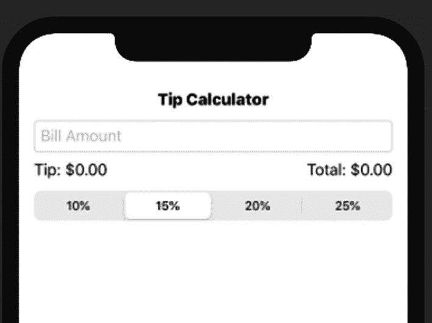
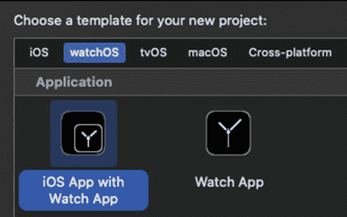
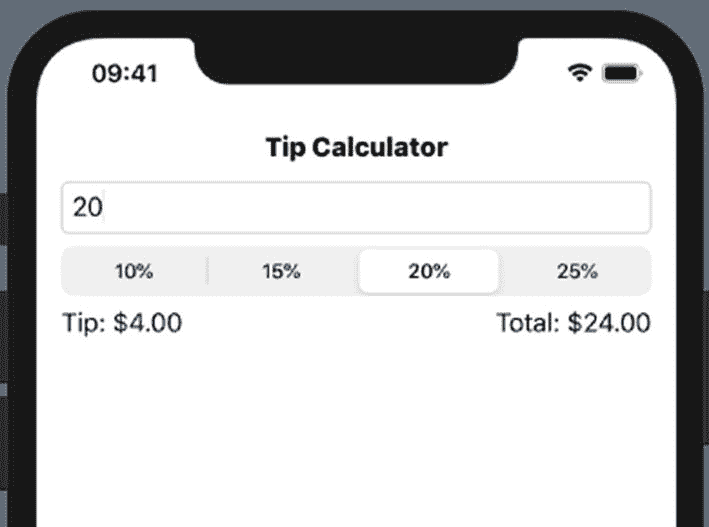
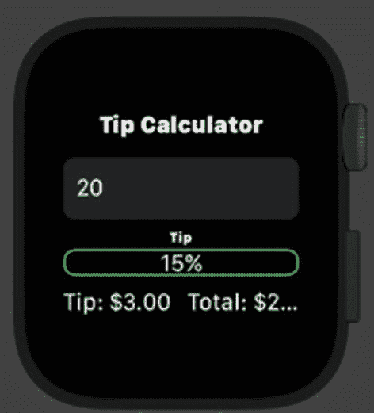

# 18. 包含 WatchKit 的应用

在本章中，我们将构建一个功能完整的小型应用。我们希望通过此练习来确保能够端到端地完成开发。

我们将构建一个小费计算器。这通常是我的“首选”项目——部分原因是其需求基本已体现在名称中。

这是一个很好的练习，需要获取用户输入、以某种方式处理输入（功能性），并更新用户界面。当然，我们需要的输入数据是账单金额和小费百分比。

我们可以通过多种方式从用户处获取这些信息：文本字段（TextField）、选择器（Picker）、滑块（Slider）等。我们计划使用`TextField`输入账单金额，使用`Picker`选择小费百分比。

功能将非常简单。事实上，我们甚至不需要通常意义上的函数或闭包。我们可以使用计算属性来代替。

我们希望用户界面如图 18-1 所示。



图 18-1  
小费计算器用户界面

你可以尝试不往下看，直接编写应用。或者先阅读接下来的属性和 UI 设计部分，然后再尝试。看看你是否能应用学到的绑定（Binding）、UI 元素等知识。

### 属性

如前所述，我们需要两个输入：账单金额和小费百分比。这些将是用`@State`属性包装器包装的属性，并随着输入变化而更新。

我们还将有一个属性来存储供用户选择的小费百分比数组。

向用户显示数值意味着我们需要计算这些值。这可以通过计算属性完成。我们至少需要两个计算属性：小费金额和总计。

此外，输出应显示为货币格式。`NumberFormatter`类非常适合此用途。我们可以再创建一个计算属性来创建和配置`NumberFormatter`。


### UI 设计

我们可以使用 `Text` 项来放置标题和两个输出区域。剩下的只有输入部分。我们可以使用之前提到的 `TextField` 和 `Picker`。它们各自通过绑定（binding）关联到相关属性。

在许多地方，我们会添加一些间距、内边距、字体粗细等，以使 UI 看起来更美观。

## 小费计算器

首先，我们需要创建一个新项目。接着，我们将属性添加到 `ContentView` 中。最后，我们将创建 `body` 计算属性的内容。



**图 18-2** iOS App with Watch App 模板

1.  创建一个名为 `TC` 的新项目，使用 watchOS 的“iOS App with Watch App”模板，如图 18-2 所示。界面使用 `SwiftUI`，生命周期使用 `SwiftUI App`。

2.  添加两个属性，作为用户输入的来源（source of truth）。

    ```
    struct ContentView: View {
    @State private var tipSelected = 1
    @State private var billInput = ""
    ```

3.  添加用户选择的小费百分比。

4.  添加一个数字格式化器的计算属性。

    ```
    private var numFormatter : NumberFormatter {
    let nf = NumberFormatter()
    nf.numberStyle = .currency
    nf.isLenient = true
    return nf
    }
    ```

5.  创建一个 `billAmount` 的计算属性（输入的账单金额的双精度值）。

    ```
    private var billAmount : Double {
    numFormatter.number(from:
    billInput)?
    .doubleValue ?? 0.0
    }
    ```

6.  使用第 5 步中定义的 `billAmount`，创建一个小费金额的计算属性。

    ```
    private var tipAmount : Double {
    billAmount * tipPercentages[tipSelected] }
    ```

7.  使用第 5 步的 `billAmount` 和第 6 步的 `tipAmount`，创建一个总金额的计算属性。

    ```
    private var tipPercentages = [0.1, 0.15,
    0.2, 0.25]
    ```

8.  用 `VStack` 和包含最后内边距的应用标题替换默认的 `body` 内容。

    ```
    var body: some View {
    VStack {
    Text("Tip Calculator")
    .fontWeight(.heavy)
    }.padding()
    ```

9.  添加一个绑定到 `billInput` 属性的 `TextField`。

    ```
    TextField("Bill Amount", text: $billInput)
    .textFieldStyle(RoundedBorderTextFieldStyle())
    ```

10. 创建一个 `Picker`，基于 `tipPercentages` 数组，通过 `ForEach` 绑定到 `tipSelected` 属性。

    ```
    Picker("Tip", selection: $tipSelected) {
    ForEach (tipPercentages.indices, id: \.self) {
    let dbl = Double(self.tipPercentages[$0])
    Text("\(Int(dbl * 100.0))%")
    }
    }
    .pickerStyle(SegmentedPickerStyle())
    ```

11. 添加一个包含输出 `Text` 项的 `HStack`，使用数字格式化器。

    ```
    HStack {
    let tipStr = numFormatter.string(for: tipAmount)
    Text("Tip: \(tipStr ?? "$0.00")")
    Spacer()
    let totalStr = numFormatter.string(for: total)
    Text("Total: \(totalStr ?? "$0.00")")
    }
    Spacer()
    ```

    ```
    private var total : Double { tipAmount + billAmount }
    ```

预览应如图 18-1 所示。如果我们运行应用并输入账单金额 20，应该会看到如图 18-3 所示的小费和总金额。



**图 18-3** 显示小费和总金额的小费计算器

UI 中添加了一些分隔符等。总的来说，这是一个具有简单 UI 的简单应用，但它能工作。希望每一步都让你感到熟悉和舒适。

### WatchKit

现在，我们希望将这个 UI 应用到 Watch 应用模块中。大多数情况下，这个 UI 在 watchOS 上的工作方式与在 iOS 上相同。

`SwiftUI` 中的许多 UI 项可以跨平台工作。然而，在某些情况下，某些变体是不存在的。对我们来说，这仅限于 `TextField` 和 `Picker`。

**WATCH 应用**

你会注意到，在当前项目中已经有一个“TC WatchKit App”和一个“TC WatchKit Extension”。我们将编辑扩展中的 `ContentView.swift` 文件。



**图 18-4** WatchKit 应用预览

1.  打开 TC iOS 应用（**不是扩展**）中的 `ContentView.swift` 文件。

2.  复制整个文件的内容。

3.  打开 TC WatchKit Extension 中的 `ContentView.swift` 文件。

4.  将复制的代码粘贴覆盖整个文件。

    会出现两个错误。这两个错误都关于样式——`TextField` 和 `Picker`。

5.  注释掉样式的代码。

    ```
    //.textFieldStyle(RoundedBorderTextFieldStyle())
    ...
    //.pickerStyle(SegmentedPickerStyle())
    ```

6.  刷新预览，画布应显示如图 18-4 所示的手表预览。

如果在 Live 模式下运行应用，请确保先在 Xcode（左上角）选择正确的目标和模拟器，如图 18-5 所示。


**图 18-5** WatchKit 的 Xcode 目标和模拟器

“Total”文本有点长，可能需要调整，但 UI 可以编译和显示。多亏了 `SwiftUI`，只需很少的改动，我们就可以拥有一个基于 iOS UI 的手表 UI。

### 章节总结

这个小费计算器项目让我们在一个小而真实的应用中使用了我们学到的一些东西。通过使用 `@State` 属性包装器，我们使用 UI 来更新属性。我们将其他属性用作数据和功能。

通过 `TextField` 和 `Picker`，我们允许用户输入他们的值。`Text` 项显示标题以及输出的小费和总金额。

还有少量的内边距、分隔符和其他修饰符来稍微调整 UI。

使用相同的 `SwiftUI` 代码，我们创建了一个 `WatchKit` UI。只需要两个小的改动就能使其编译通过。然后，我们可能希望稍微更新 UI 以使其更合适。但希望看到相同的代码能为另一个设备构建 UI 是件有趣的事。

