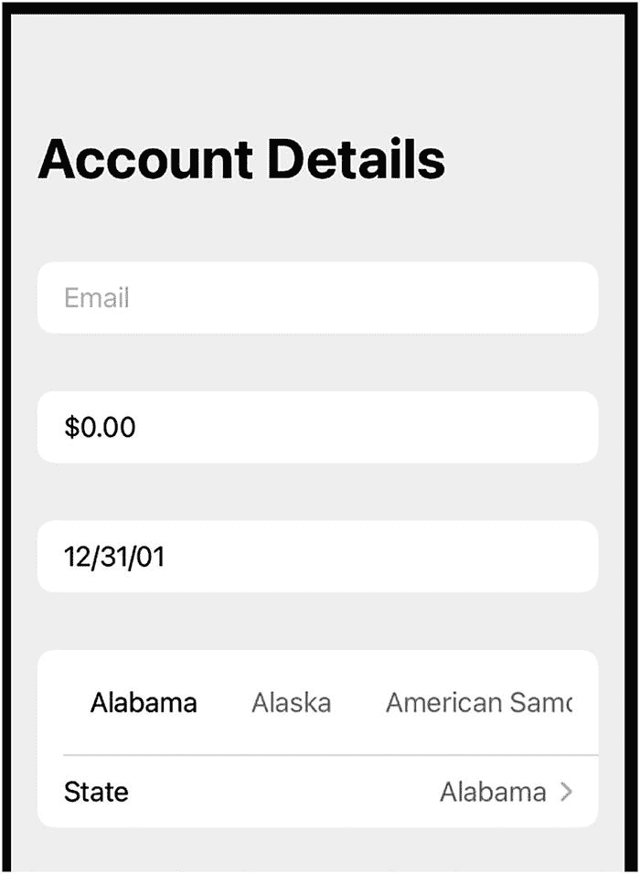
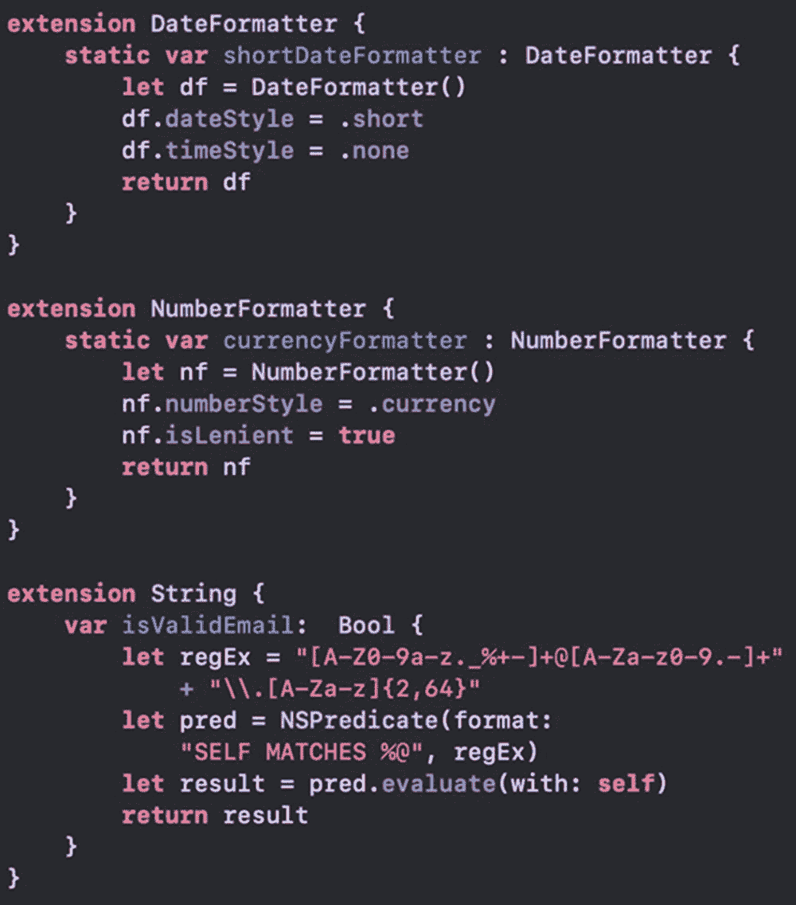
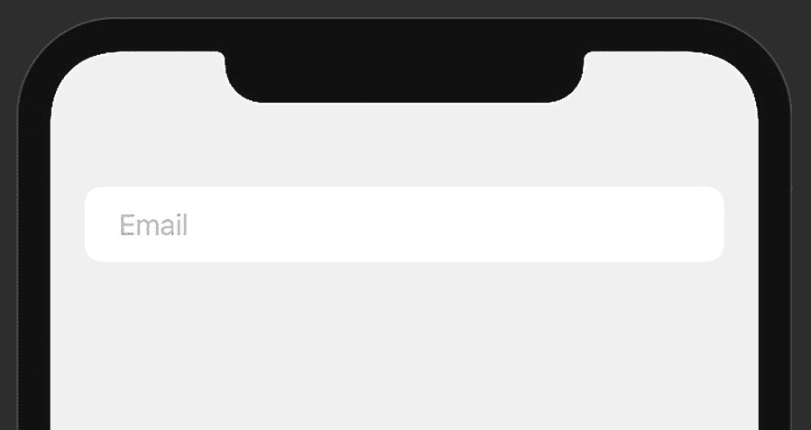
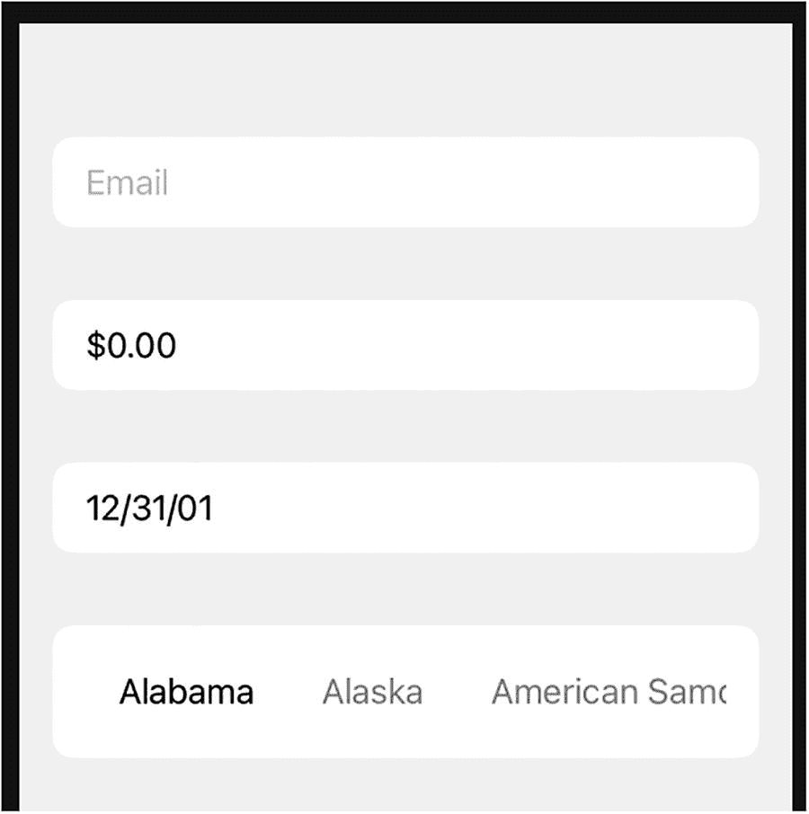
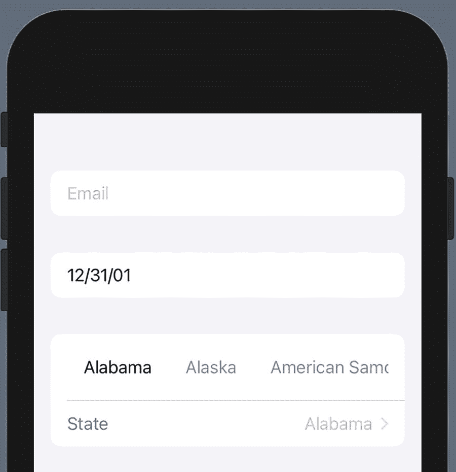
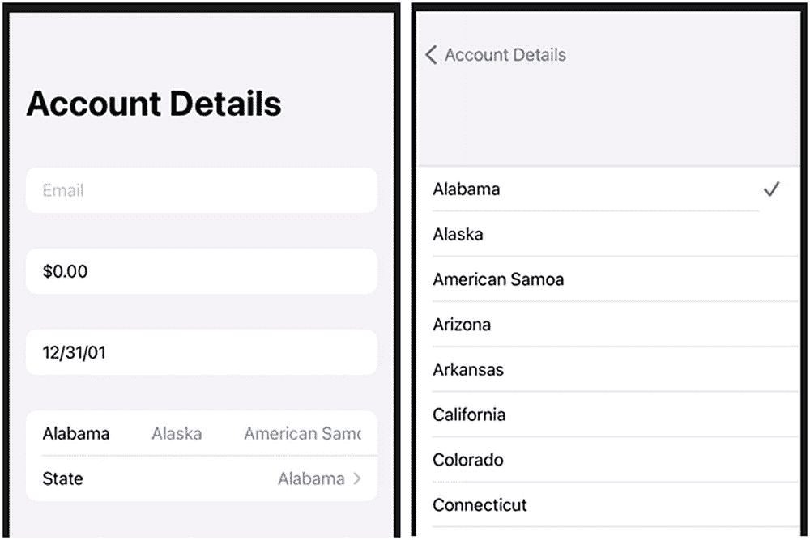
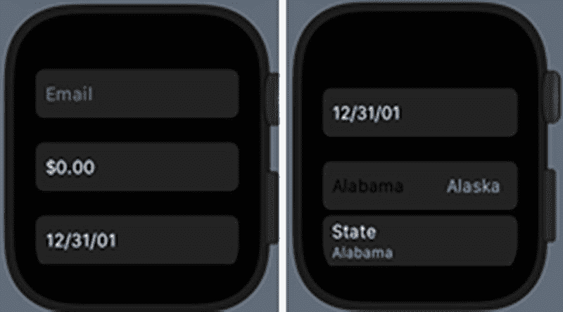

# 19. 用户输入表单

我们已经介绍了多种用于用户输入的项。其中一些将包含在本章中。它们可能会以不同的方式使用，或带有其他选项、参数等。

在本章中，我们将构建一个用户输入表单。我们将专注于各种输入项所需的方面。基于此，我们将创建用户界面。

输入基于应用中使用的常见数据类型。

*   电子邮件字符串
*   货币数字（显示为字符串/货币）
*   日期（显示为字符串/日期）
*   从列表中选择

这里的一个关键因素是，这些值不仅仅是普通的字符串和数字。它们需要被验证、格式化、列出以及进行其他处理。

我们的用户界面将是一个供人们输入信息的表单，如图 19-1 所示。



**图 19-1** 表单用户界面

## 表单

`Form` 是一个用于容纳 UI 项的容器。它被定义为一个符合 `View` 协议的结构体。就像 `HStack`、`VStack`、`Section` 或 `Group` 一样，`Form` 将其他 UI 元素包裹在其中，作为一个分组。

`Form` 除了典型的 `SwiftUI` 修饰符外，不接受任何参数或具有其他选项。

`Form` 的独特之处在于它在不同平台上的显示方式。正如 Apple 文档所述，`Form` 是一个“用于分组数据输入控件的容器”。

这正是我们在项目中要做的事情。如果一切顺利，我们可以在其他平台的应用中使用相同的代码。


## 分区

我们的表单将分为多个分区。`Section` 项正适合此用途。在 iOS 界面中，`Form` 看起来像 `List`，而 `Section` 则类似表格视图中的分区。

请参见图 19-1，您会看到五个分区。州选择分区中包含了两个项目，它们在同一分区内共同显示。

创建分区时可以带有页眉和/或页脚。除此之外，它与 `Group` 或 `Form` 非常相似：返回一个 `View` 用于显示。

在各个分区内部，我们将通过元素或在 `HStack` 等中的其他 UI 项目组来创建界面。

## 应用需求

我们来梳理一下本应用的一些需求。我们将输入电子邮件地址、金额数字和日期，并从列表中进行选择。我们希望验证电子邮件地址、将数字格式化为货币格式，并对日期进行格式化。

日期字段我们可以使用日期选择器，但这里我们将用一个 `String` 来输入，同时将其存储为 `Date`。

对于电子邮件，我们可以在 `String` 的扩展中编写一个验证函数。对于货币和日期字段，我们将分别使用 `NumberFormatter` 和 `DateFormatter`。我们可以在各个类的扩展中将其创建为计算属性。

对于列表选择，我们将选中的索引存储在一个数组中。因此，我们需要一个可供选择的值列表。

本次练习我提供了一个名为 `InputForm` 的入门项目。它位于名为 `Ch19_BOC_InputForm.zip` 的压缩文件中。其中包含了我们将用于格式化器和验证 `String` 是否为电子邮件地址的扩展（见图 19-2）。



图 19-2

BOC 项目中提供的扩展

基于表单的用户界面

打开 `Ch19_BOC_InputForm.zip` 中提供的 `InputForm` 项目。以此为基础，我们将创建用户输入表单。

1.  在 `ContentView` 结构体中，定义用于存储可选州列表以及电子邮件、所选州、用户收入和出生日期的属性。

**注意** 此处仅提供了部分州的列表。

1.  将当前的 body 内容替换为 `Form`。

```
let states = ["Alabama", "Alaska",
"American Samoa", "Arizona", "Arkansas",
"California", "Colorado", "Connecticut",
"Delaware", "District of Columbia"]
@State var email = ""
@State var selectedState = 0
@State var userIncome = 0.0
@State var dateOfBirth = Date.distantPast
```

```
var body: some View {
Form {
}
}
```

我们将添加的第一个 `Section` 用于输入电子邮件地址。用于此值的 `TextField` 将非常基础。属性已经定义好，我们只需添加 `TextField`。

1.  在 `Form` 内部创建一个 `Section`，其中包含一个绑定到 `$email` 的 `TextField`。

```
Section {
TextField("Email", text: $email)
{ (beingEdited) in
print (beingEdited)
} onCommit: {
}
}
```

第一个闭包 `onEditingChanged` 在内容开始和结束编辑时被调用。参数是一个布尔值，表示文本字段内容是否正在被编辑。

当用户开始在字段中键入时，将打印 `true`。当用户点击返回键时，将打印 `false`。

第二个闭包在内容提交时被调用（即用户点击了返回键）。

到目前为止，Canvas 预览中的 UI 应如图 19-3 所示。



图 19-3

包含电子邮件 TextField 的 UI

在 `onCommit` 闭包中，我们可以验证电子邮件地址。

1.  添加一个检查，用于在 `onCommit` 闭包中验证输入的电子邮件。

```
Section {
TextField("Email", text: $email)
{ (changed) in
} onCommit: {
if email.isValidEmail == false {
$email.wrappedValue = ""
}
}
}
```

如果用户输入了无效的电子邮件地址，此代码会清空文本字段。

1.  将键盘和内容类型设置为 `.emailAddress`。

1.  为收入输入创建另一个 `Section`，并使用 `NumberFormatter` 扩展中提供的货币格式化器。

```
Section {
TextField("Email", text: $email)
{ (changed) in
} onCommit: {
if email.isValidEmail == false {
$email.wrappedValue = ""
}
}
.keyboardType(.emailAddress)
.textContentType(.emailAddress)
}
```

```
Section {
HStack {
TextField("Income", value: $userIncome,
formatter: NumberFormatter.currencyFormatter)
}
}
```

该格式化器会将输入的数字保留为货币格式。

1.  为 `TextField` 添加一个 `.disabled` 修饰符，使其仅在用户已输入电子邮件地址时可用。

1.  再添加一个 `Section`，其中包含一个绑定到 `dateOfBirth` 并使用 `DateFormatter` 扩展中 `shortDateFormatter` 格式化器的文本字段。

```
TextField("Income", value: $userIncome,
formatter: NumberFormatter.currencyFormatter)
.disabled(self.email.count == 0)
```

```
Section {
TextField("DOB", value: $dateOfBirth,
formatter: DateFormatter.shortDateFormatter)
}
```

在此场景中，格式化器会将 `dateOfBirth` 属性（`Date` 类型）转换为使用短日期格式且不带时间样式的 `String` 类型。当用户输入新值时，格式化器会将该 `String` 转换回日期并存储到 `dateOfBirth` 属性中。

1.  再添加一个 `Section`，其中包含一个水平滚动视图，视图内放置一个 `HStack`。在 `HStack` 内部，为列表中的每个州创建 `Text` 项目。

```
Section {
ScrollView(.horizontal) {
HStack(spacing: 40) {
ForEach(states.indices) { index in
Text(self.states[index])
}
}
}
}
```

`HStack` 的间距值为 40，以使 `Text` 项目之间保持合适的间距。

1.  为 `ForEach` 中的 `Text` 项目添加一个点击手势，以设置 `selectedState` 属性。

```
Text(self.states[index])
.onTapGesture {
self.selectedState = index
}
```

现在，当用户点击州名称时，它将把该属性更新为对应的数组索引。

1.  更改 `selectedState` 项目的文本颜色。

```
Text(self.states[index])
.onTapGesture {
self.selectedState = index
}.foregroundColor(self.selectedState
== index ? .black : .gray)
```

拥有选定状态时的 UI 应如图 19-4 所示。



图 19-4

包含选定状态的 UI

选择州的另一个选项是使用 `Picker`。我们将定义一个选择器，同时还要添加一个 `NavigationView` 来实现向下钻取。

1.  在与 `ScrollView` 相同的 `Section` 中创建一个 `Picker`。

```
Picker(selection: $selectedState,
label: Text("State")) {
ForEach(self.states.indices, id: \.self) {
Text(self.states[$0])
}
}
```

现在界面看起来如图 19-5 所示。



图 19-5

分区中包含两个州项目的 UI

请注意，该分区中的第二个项目有一个详细信息指示符（`>`）。但是，如果您点击它，什么也不会发生。这是因为我们还没有为应用提供导航方式。

让我们添加一个 `NavigationView`，以允许应用向下钻取到州选择页面。为此，我们需要将 `Form` 嵌入 `NavigationView` 中。

1.  在 `Form` 之上添加一个 `NavigationView`。

1.  在 `Form` 之后添加一个闭合花括号，并为我们的输入表单添加一个导航标题。

```
var body: some View {
NavigationView {
Form {
```

```
}.navigationTitle("Account Details")
```

当点击州所在的行时，会跳转到一个 `List`（表格视图），如图 19-6 所示。



图 19-6

第二种州选择选项

我们现在拥有了一个允许用户输入值的表单。其中有多个基于文本的值。然而，每个值因其格式化器和/或验证逻辑的不同而行为各异。


### WatchKit

另一个很酷的地方是，我们之前看到的这个界面也能在手表上运行。只需进行少量修改，效果就如图 19-7 所示。



图 19-7 手表上的界面

`WatchKit` 不支持 `NavigationView`，因此需要将其注释掉或移除。同样，由于没有键盘支持，键盘类型和内容类型也需要移除。

### 章节总结

在这个应用中，我们有一个明确的设计目标。我们需要创建一个允许用户输入数值的应用。代码通过绑定来存储这些值。

除了存储值，我们还看到了 `TextField` 如何与日期或数字格式化器之类的关联格式化器配合使用。

我们还使用了 `Form` 来展示用户输入的机制。我们在 `Form` 中使用了 `Section`，它们以表格视图的形式呈现。

一个水平滚动视图让选择一个州的操作变得非常简单。我们使用了一个包含 `Text` 项的 `HStack`。这些项上的 `onTapGesture` 用于设置选择。

`Picker` 与 `NavigationView` 结合使用，让我们能够深入列表进行州的选择。

我们可能可以将这些组件中的许多拆分成各自遵循 `View` 协议的结构体。这留给读者作为练习。

