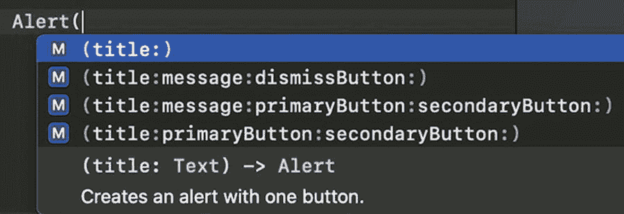
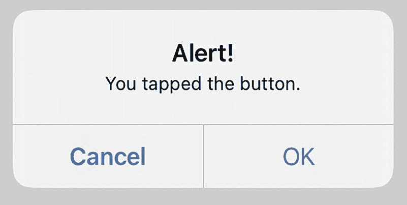
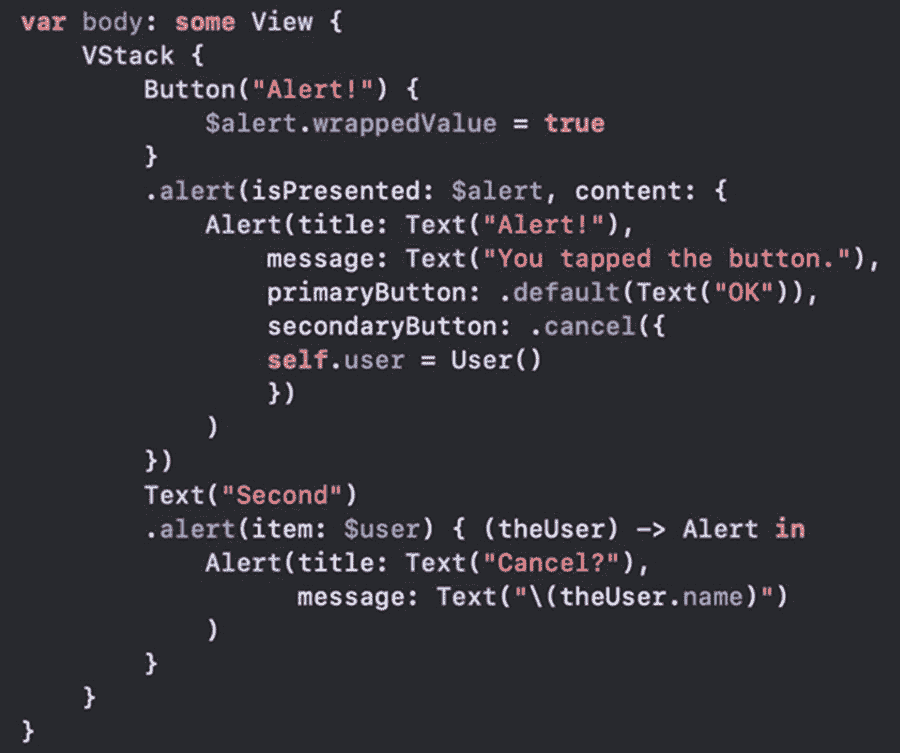
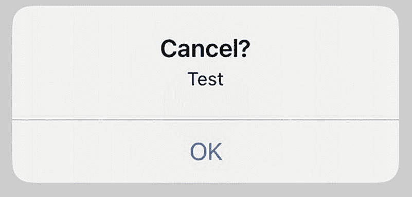
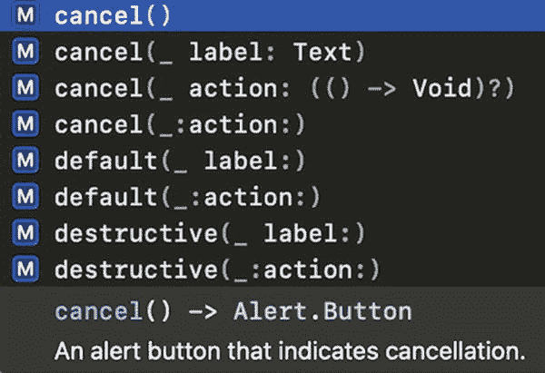
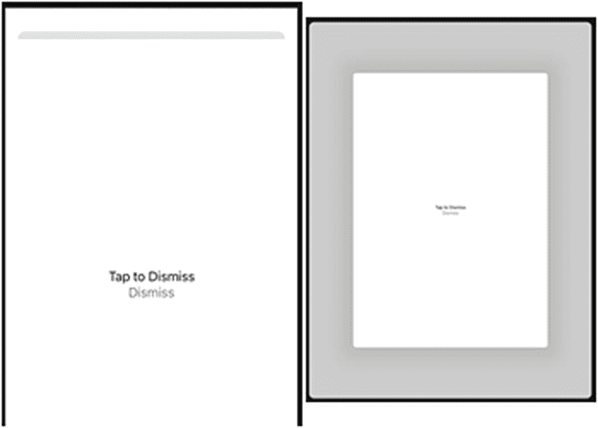
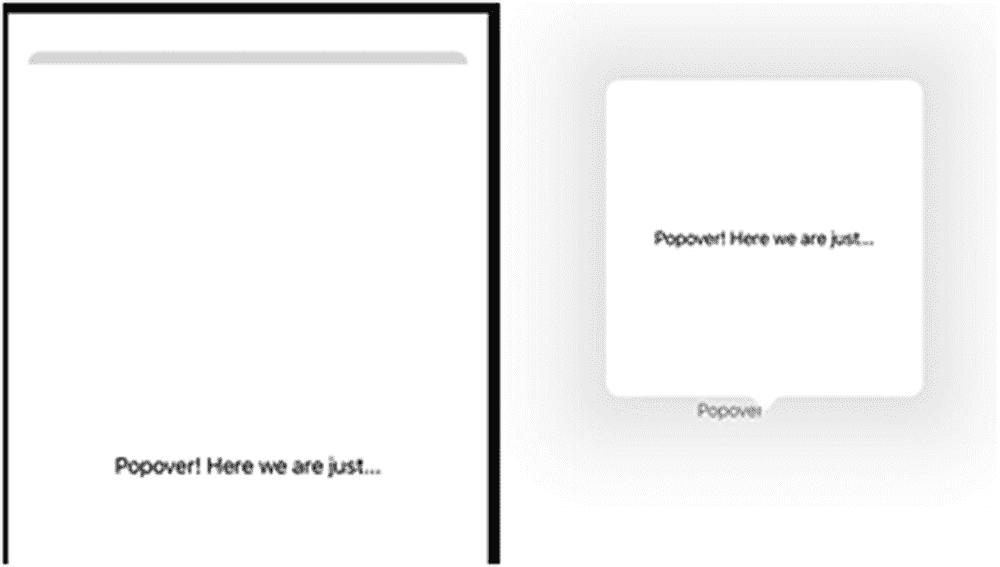

# 20. 呈现弹出窗口

很容易理解，我们需要让用户输入数据的方式。我们有文本字段、选择器、按钮以及更多让用户查看和选择项目的方法。

我们还需要向用户发出信息提醒的方式。如果用户输入了无效的电子邮件，我们需要告诉他们。我们可能需要向用户显示一些信息或帮助。因此，我们将使用一些向用户呈现消息的方法。

`Alert`、`ActionSheet`、`Sheet` 和 `Popover` 是将界面呈现给用户的绝佳方式，这些界面不属于应用的基础界面。它们各自有其特点和用户交互方式。

## 警告修饰器

`.alert` 修饰器接收一个绑定和一个闭包。绑定参数可以是布尔值（参数标签为 `isPresented`，如以下代码所示），也可以是实现 `Identifiable` 协议的可选项（参数标签为 `item`）。

如果使用布尔值调用，当该值变为 `true` 时，警告修饰器的闭包会被调用。如果使用可选项绑定而不是布尔值绑定，则当可选项被设置为非 nil 值时，闭包会被调用。

无论哪种情况，闭包都会返回一个 `Alert` 实例。

```
.alert(isPresented: $showAlert) { () -> Alert in
    Alert(title: Text("Alert!"))
}
```

警告修饰器

我们将创建一个新项目，并向其中添加各种类型的警告和弹出窗口。

1.  创建一个名为 `Pop-ups` 的新 iOS App 模板项目，界面使用 SwiftUI，生命周期使用 SwiftUI App。

我们想基于各种条件创建警告。首先，我们将基于一个布尔值创建一个警告。

2.  在 `ContentView` 结构体中添加一个名为 `alert` 的布尔属性。



图 20-1 警告初始化器的代码补全

1.  将 `body` 计算属性的当前实现替换为一个 `Button`。按钮的操作将改变 `alert` 属性的值。

```
Button("Alert!") {
    $alert.wrappedValue = true
}
```

2.  在按钮末尾添加一个 `.alert` 修饰器，并将其 `isPresented` 绑定到 `$alert`。

```
Button("Alert!") {
    $alert.wrappedValue = true
}
.alert(isPresented: $alert, content: {
})
```

对于内容，我们需要返回一个 `Alert` 实例。如图 20-1 所示，`Alert` 有各种初始化器。

```
@State var alert = false
```

如果你只需要用默认按钮显示一些文本，只需提供一个 `Text` 类型的标题。如果你还想显示一条消息，那也是 `Text` 类型。

对于要显示的任何按钮，你可以使用内置的 `Alert.Button` 类型：`default`、`destructive` 和 `cancel`。每个按钮都接受一个 `Text` 和一个可选的 action 闭包。

1.  从内容闭包中返回一个 `Alert`。

```
.alert(isPresented: $alert, content: {
    Alert(title: Text("Alert!"),
          message: Text("You tapped the button."),
          primaryButton: .default(Text("OK")),
          secondaryButton: .cancel({
              print (alert)
          })
    )
})
```

当按钮被点击时，警告显示如图 20-2 所示。



图 20-2 带有两个按钮的警告

请注意，次要按钮是 `cancel`。当它被点击时，它会打印 `alert` 值。它会始终打印 `false`。警告之所以出现，是因为我们将值设置为 `true`。当其中一个按钮被点击时，警告会消失并将 `alert` 设置为 `false`。

`destructive` 按钮使用红色文本以指示危险。如果你的警告是确认删除或类似操作，则应使用 destructive 类型按钮。

警告旨在向用户提供一些信息，并可能提示他们做出决定或回答问题。决策应围绕用户提供输入或仅提醒他们某些信息展开。

除了将 `.alert` 修饰器绑定到布尔值，它还可以绑定到一个可选项。当可选项被设置为非 nil 时，警告会显示。

### 带对象绑定的警告

这基本类似于使用 `isPresented` 的 `.alert` 修饰器。不过，我们将使用一个可选项。当它被设置为非 nil 时，警告会显示。与布尔值一样，当用户点击按钮解除警告时，该值会被设置回 `nil`。

1.  打开上一练习中的同一个项目。

2.  将 `body` 属性中的 `Button` 嵌入到一个 `VStack` 中。

3.  在按钮的 `.alert` 修饰器下方，添加一个 `Text` 项。

```
Text("Second")
```


我们将向这个 `Text` 元素添加 `.alert` 修饰符。我们将使用接受 `item` 的初始化器，而不是 `isPresented`。该 `item` 需要遵循 `Identifiable` 协议。让我们创建一个符合该协议的结构体。

1.  在 `ContentView` 结构体上方，创建一个名为 `User` 的新结构体，该结构体实现了 `Identifiable`。

```
struct User : Identifiable {
    var id = UUID()
    var name = "Test"
}
```

现在我们有了一个类型，可以在 `ContentView` 中将其用作 `Optional` 属性。

2.  向 `ContentView` 结构体添加一个可选的 `User` 类型属性。



**图 20-3**

包含两个警报的代码

1.  在之前警报的取消按钮中，将 `user` 设置为 `User` 的一个实例。

```
Alert(title: Text("警报!"),
    message: Text("你点击了按钮。"),
    primaryButton: .default(Text("确定")),
    secondaryButton: .cancel({
        self.user = User()
    })
```

最后三个步骤中的内容为我们创建警报奠定了基础。我们将使用 `user` 属性作为绑定，向 `Text` 元素添加一个 `.alert` 修饰符。当它在取消闭包中被设置为非 nil 时，警报将被触发。

2.  向 `Text` 元素添加 `.alert` 修饰符。

```
Text("第二个")
.alert(item: $user) { (theUser) -> Alert in
    Alert(title: Text("取消?"),
          message: Text("\(theUser.name)")
    )
}
```

现在 `body` 属性的代码看起来像图 20-3。

```
@State var user : User?
```

我们有一个绑定到 `user` 的 `.alert` 修饰符。当它被设置为非 nil 时，会调用闭包来创建 `Alert`。`user` 作为参数 `theUser` 传入。

标题是“取消?”，我们将消息设置为用户名。`Alert` 将使用自动提供的“确定”按钮来关闭它。

由于 `User` 结构体的 `name` 属性有一个默认值 `Test`，所以警报看起来像图 20-4。



**图 20-4**

带有默认“确定”按钮的警报

现在我们已经看到了 `.alert` 修饰符的两种绑定类型以及 `Alert` 的几个变体。

## 操作表修饰符

`.actionSheet` 修饰符与 `.alert` 修饰符非常相似。它可以使用布尔值（`isPresented`）或可选项（`item`）的绑定。第二个参数是一个闭包，但它返回的是 `ActionSheet` 而不是 `Alert`。

如果绑定值变为 `true`（对于布尔绑定）或非 nil（对于可选绑定），则会调用该闭包。

## 操作表

创建 `ActionSheet` 类似于创建 `Alert`。你可以传入一个 `Text` 元素作为 `title` 参数。如果你只提供了 `title` 参数值，操作表会自动包含一个取消按钮来移除操作表。

`message` 参数也是可选的 `Text` 类型。最后一个参数是一个按钮数组。你可以使用按钮的多种变体，如图 20-5 所示。



**图 20-5**

操作表按钮的变体

不带参数的取消按钮仅将操作表从用户界面中移除。`action` 参数允许你传入一个闭包，当按钮被点击时调用。其他所有按钮变体都需要一个用于在按钮上显示的 `Text` 元素，以及一个在按钮被点击时调用的可选闭包。

操作表修饰符

本练习基于上一个练习，并使用相同的项目。不过，新建一个项目也可以，因为本练习不依赖之前完成的任何内容。

1.  向 `ContentView` 添加一个新的布尔属性。

2.  在 `VStack`（如果是新项目则在 `body` 中）添加一个 `Button`。该按钮的操作将步骤 1 中的属性设置为 `true`。

```
Button("操作表") {
    $actionSheet.wrappedValue = true
}
```

3.  在 `Button` 的末尾添加一个 `.actionSheet` 修饰符。

```
.actionSheet(isPresented: $actionSheet, content: {
})
```

4.  从 `.actionSheet` 的 content 闭包中返回一个 `ActionSheet`。

```
.actionSheet(isPresented: $actionSheet, content: {
    ActionSheet(title: Text("操作"),
                message: Text("开始!"),
                buttons:
                    [.destructive(Text("删除"))]
    )
})
```

```
@State var actionSheet = false
```

运行代码会显示一个标题为“操作表”的按钮。当它被点击时，`actionSheet` 属性被设置为 `true`。

`.actionSheet` 修饰符绑定到该属性，并将被触发。

然后，创建的 `ActionSheet` 会显示按钮，在本例中只有一个破坏性按钮，显示在屏幕上，如图 20-6 所示。


**图 20-6**

带有一个按钮的操作表

警报和操作表之间有一个虽小但重要的区别。警报通常限制为一到两个按钮，并且侧重于提供信息。操作表应该会导致某种“操作”发生：保存数据、在线发送信息、删除用户帐户，以及基于用户选择的其他功能。

## Sheet 修饰符

Sheet 与我们之前看到的 `Alert` 和 `ActionSheet` 类似。它接受一个布尔值（`isPresented`）或可选项（`item`）的绑定。它还有一个可选的闭包，名为 `onDismiss`。如果传入此闭包，则当操作表从用户界面中移除时，该闭包会被调用。

最后一个参数是一个用于定义 Sheet 上用户界面的闭包。此闭包与 `body` 参数一样，返回一个实现了 `View` 的元素。所以它不是像 `Alert` 或 `ActionSheet` 这样的特定 UI 元素，而是任何实现了 `View` 的内容。

Sheet 修饰符

同样，这是在之前项目的基础上构建的，但并非必须。

1.  向 `ContentView` 添加一个布尔属性，用于绑定到 Sheet。

2.  添加一个按钮，将该属性设置为 `true`。

```
Button("Sheet") {
    $sheet.wrappedValue = true
}
```

3.  添加一个绑定到该属性的 `.sheet` 修饰符，并返回一个 `VStack`。

```
.sheet(isPresented: $sheet, content: {
    VStack {
    }
})
```

4.  在 `VStack` 中，添加一个 `Text` 和一个 `Button`，用于将属性设置回 `false`。

```
.sheet(isPresented: $sheet, content: {
    VStack {
        Text ("点击以关闭")
        Button("关闭") {
            $sheet.wrappedValue = false
        }
    }
})
```

```
@State var sheet = false
```

将属性设置回 `false` 将使 Sheet 关闭。UI 会适应其运行所在的设备/屏幕空间。在 iPhone 上，它看起来像图 20-7。在这种情况下，向下滑动也可以关闭 Sheet 的 UI。



**图 20-7**

在 iPhone 和 iPad 上显示的 Sheet UI

与 `Alert` 和 `ActionSheet` 相比，Sheet 是更模态化/全屏显示 UI 的一个不错选择。由于它只需要实现一个 `View`，因此显然可以更加自定义。


### 弹出视图修饰符

弹出视图的创建方式与我们之前看到的警告、操作表和 Sheet 类似。与 `Sheet` 一样，它接受一个布尔值（`isPresented`）或可选值（`item`）的绑定。它还需要一个闭包来返回要显示的 UI。

可选地，`.popover` 接受锚点（anchor point）和箭头边缘（arrow edge）参数。锚点定义了弹出视图的附着位置。它可以是一个点或一个矩形。箭头边缘则指定了弹出视图的箭头显示位置。

对于较小的 UI 设备（例如 iPhone），弹出视图将以模态方式显示，外观类似于图 20-7 中的 Sheet。无论锚点和箭头的值如何，情况都是如此。

在某些情况下，布局会阻止 UI 遵循锚点和箭头设置。在这种情况下，或者当未提供这些设置时，系统将自行决定如何显示弹出视图。

**弹出视图修饰符**

再次使用同一个项目，我们将创建新的属性、按钮和弹出视图修饰符。

1. 为 `ContentView` 添加一个新的布尔类型属性，用于绑定到 `.popover` 修饰符。

2. 在 `body` 的 `VStack` 中添加一个 `Button`，用于将属性设置为 `true`。

    ```
    Button("Popover") {
    $popover.wrappedValue = true
    }
    ```

3. 为 `Button` 添加一个 `.popover` 修饰符，该修饰符绑定到新属性，并设置附着锚点、箭头边缘以及返回符合 UI 项目的 `View` 的内容。

    ```
    .popover(isPresented: $popover,
    attachmentAnchor: .point(.trailing),
    arrowEdge: .leading,
    content: {
    Text("Popover! Here we are just...")
    .lineLimit(2)
    .frame(width: 300, height: 300,
    alignment: .center)
    })
    ```

```
@State var popover = false
```

在 iPhone 和小型设备/屏幕上，它看起来像一个 `Sheet`，但在 iPad/较大屏幕上，它会像图 20-8 一样带有一个上下文箭头弹出。



**图 20-8** 在 iPhone 和 iPad 上显示的弹出视图

弹出视图非常适合根据上下文显示信息。如果您需要根据 UI 中的某些内容向用户显示消息，那么弹出视图为您提供了一个很好的选择，尤其是在 iPad 上。

### 章节总结

警告、操作表、Sheet 和弹出视图都绑定到一个值，并根据该值（无论是布尔值还是 `Identifiable`）进行呈现。

这些项目在您的应用中有多种显示方式可供选择。

`.alert` 修饰符返回一个 `Alert`。它可以有一个或两个按钮，按钮可以带闭包也可以不带闭包。

`.actionSheet` 修饰符返回一个 `ActionSheet`，它可以包含多个按钮。如果按钮数量超出屏幕大小，它将滚动显示。

对于 `.sheet` 修饰符，我们有一个 `onDismiss` 闭包。`.sheet` 的 UI 没有特定的类型。它只是实现了 `View` 的东西，因此它可以是 `HStack`、`VStack`、`Text` 或各种其他元素。

与 `.sheet` 类似，`.popover` 有一个闭包，返回符合 `View` 的内容。在 UI 较小的情况下（例如，iPhone 或仅部分屏幕显示的 iPad），`.popover` 和 `.sheet` 的显示效果相同。但在较大的 UI 实例上，弹出视图会像标注一样显示在被点击的 UI 附近。它可能出现在侧面或顶部/底部，并有一个指向触发元素的箭头。

## 索引

A
- `ActionSheet` 修饰符变体
- `.addTarget` 函数
- `.alert` 修饰符
- `allCases`
- 动画
- App 需求
- 非对称过渡

B
- `@Binding`
  - `ContentView` 计数器属性
  - `MyStepper` 实现初始化器实例
  - 结构体 `Textfield` 绑定属性
- `body` 属性
  - `MyInput` 结构体
  - `MyStepper`
  - `MyTextInput`
  - `onCommit`
  - `onEditingChanged`
  - `String` 属性
  - `Text` 项目
  - UI
  - UI 元素
  - 视图类型
- 构建块，SwiftUI
  - 绑定
  - 按钮自动补全代码
  - 计算属性创建
  - 标签输出参数
  - `Text` 项目图像创建
  - SF 符号标准元素
  - `@State` 属性包装器
  - `TextField` 添加编译/运行
  - 对象库占位符
  - `String` 属性
  - `.swift` 文件
  - 视图库
  - 切换
  - `Toggle` 标签适配
  - `Button` 动作
  - `.colorInvert`
  - 当前代码，画布
  - 声明我的 body 属性
  - 内边距

C
- 画布/预览，SwiftUI
  - 编译
  - 设备环境
  - `.environment` 修饰符
  - 固定预览布局
  - `DateFormatter` 设备选项
  - 固定选项
  - `NoteRow` 选项
  - `.previewDevice`
  - `sizeThatFits` 值
  - `PreviewProvider`
- `CaseIterable` 协议
- Combine 框架
  - Apps 分配订阅者
  - 操作符 发布者/订阅者优化
  - sink 订阅者
  - UI `ViewController` 代码
- 计算属性

D
- 绘图组
- 动态替换

E
- `EnvironmentObject` 属性包装器
  - 添加 `CodeView_Previews`
  - `ContentView` 声明错误消息
  - 多个笔记
  - `Note` 实例
  - `NoteView`
  - `SUINotesApp.swift` 更新
- 环境值
  - 配色方案
  - 自定义深色模式
  - `.environment` 修饰符
  - 键路径
  - `lightOrDark` 预览
  - 按视图设置颜色
  - 链式调用方法
  - `ContentView` 深色模式
  - `.environment` 修饰符
  - `.light`
  - `Text` 项目 3D 渲染
  - `UIColor.label.cgColor`
  - 更新使用变量

F
- 表单
- 用户界面

G, H, I, J, K
- 渐变

L
- 项目列表
  - 添加
  - 创建项目索引模型
  - 列出笔记数组
  - `ContentView` `createTestNotes` 函数
  - 删除项目出错
  - `ForEach`
  - `Identifiable` 协议
  - `NoteRow` 参数
  - `@State` 属性包装器
  - `NoteRow` 视图创建
  - 新文件
  - `Note` 类
  - `Note` 实例
  - `NoteView`
  - SwiftUI 视图
  - `updatedAtTime`
  - `Text` 项目

M
- `makeCoordinator` 协议函数
- `makeUIView` 函数

N
- `NoteRow_Previews`
  - `Note` 视图
  - `ContentView` 创建元素
  - 深色模式
  - `.environment` 修饰符
  - 内边距优先级更新
  - 属性结构体
  - `UI`
  - `NoteViewModel` 属性
- `NSObjectProtocol`

O
- `ObservableObject` 协议
  - 创建绑定优先级
  - `observableObject` 协议
  - `@Published` 发布
  - 更新引用类型
  - 典型模型
  - `ContentView` 结构体
  - `DateFormatter` 初始化器
  - 笔记对象
  - `note.text` 属性
  - 笔记 UI 属性
  - `.onTapGesture` 修饰符

P, Q
- 弹出视图修饰符
- 预览
  - 资源
  - 画布
  - 内容数据 JSON
  - 实时模式
  - 模型-视图-视图模型

R
- 旋转 UI 元素

S
- `.sheet` 修饰符
- `@State` 属性包装器
- `@State`，SwiftUI 数据流步骤
  - 绑定属性
  - `isReady` 变量
  - 状态变量/绑定
- `Stepper` 代码
  - `Stepper` 初始化器
  - `Stepper` UI 更新切换
- `Strideable`
- Swift 导航链接模型导航点击手势视图
- SwiftUI
  - 添加协调器
  - 附加文本
  - 属性检查器
  - 构建块 (参见 构建块，SwiftUI)
  - `ButtonView`
  - 画布/预览 (参见 画布/预览，SwiftUI)
  - 代码+UI
  - 创建项目 Interface Builder
  - iOS App 模板预览项目选项
  - 开发 Combine 框架
  - 界面设计
  - 练习
  - 表达式
  - Hello World
  - 界面修饰符
  - 多个预览
  - 平台重新创建
  - 模拟器事实来源
  - 堆叠中的堆叠
  - `@State` (参见 `@State`，SwiftUI)
  - 同步更改
  - 目标/动作
  - `Text` 项目
  - `UIView`
  - 视图协议
  - SwiftUI 检查器
  - 空分区
  - Hello World 菜单

T
- 小费计算器 UI
- 过渡非对称
- UI 项目

U
- UI 设计
- `UIHostingController`
- UIKit
  - 添加 SwiftUI 替代语法
  - 绑定属性包装器
  - 协调器作为委托
  - 现有项目
  - 传递可观察对象
  - `UIHostingController`
  - `UIViewPresentable` 协议
  - 更新列表
- UIKit，SwiftUI 提取视图
  - `NoteView`
  - `UIView`
  - `UIViewRepresentable`
  - `UIViewRepresentable` 协议
- `URLSession` 发布者调试数据定义 JSON 模型管理器状态追踪器项目状态追踪器 UI `userStatus` 属性

V
- `ViewModifier` 协议

W, X, Y, Z
- WatchKit
