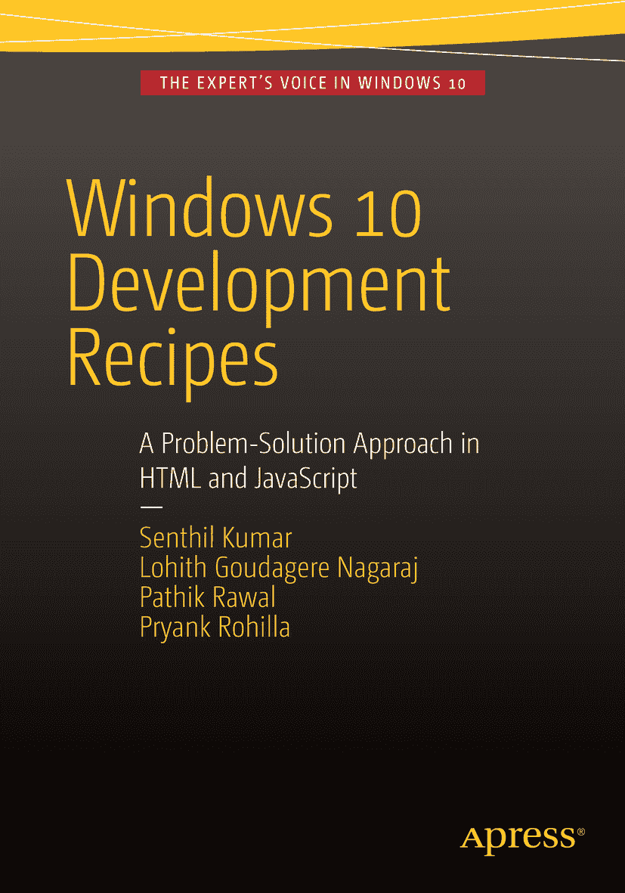

  
Senthil Kumar, Lohith Goudagere Nagaraj, Pathik Rawal 和 Pryank Rohilla  
*Windows 10 开发食谱*  
*基于 HTML 和 JavaScript 的问题解决方案*

作者在本文中引用的任何源代码或其他补充材料均可通过 [`www.apress.com`](http://www.apress.com/) 向读者提供。有关如何找到本书源代码的详细信息，请访问 [`www.apress.com/source-code/`](http://www.apress.com/source-code/)。

ISBN 978-1-4842-0720-8  
电子版 ISBN 978-1-4842-0719-2  
DOI 10.1007/978-1-4842-0719-2

© Apress 2016

*Windows 10 开发食谱：基于 HTML 和 JavaScript 的问题解决方案*

总经理：Welmoed Spahr  
主编：Gwenan Spearing  
技术审校：Fabio Claudio Ferracchiati  
编辑委员会：Steve Anglin, Pramila Balen, Louise Corrigan, Jim DeWolf, Jonathan Gennick, Robert Hutchinson, Celestin Suresh John, Michelle Lowman, James Markham, Susan McDermott, Matthew Moodie, Jeffrey Pepper, Douglas Pundick, Ben Renow-Clarke, Gwenan Spearing  
协调编辑：Melissa Maldonado  
文字编辑：Kim Burton  
排版：SPI Global  
索引编制：SPI Global  
插画：SPI Global

如需翻译相关信息，请发送电子邮件至 `rights@apress.com`，或访问 [`www.apress.com`](http://www.apress.com/)。

Apress 及 friends of ED 图书可批量购买，用于学术、企业或促销用途。大多数图书也提供电子版和许可证。更多信息，请参考我们的特别批量销售及电子版许可网页：[`www.apress.com/bulk-sales`](http://www.apress.com/bulk-sales)。

本作品受版权保护。出版商保留所有权利，涉及全部或部分材料，具体包括翻译权、重印权、插图重用权、朗诵权、广播权、微缩胶片或任何其他物理形式的复制权，以及通过电子方式改编、计算机软件或现已知或将来开发的类似或不同方法进行传输、信息存储与检索的权利。与评论或学术分析相关的简短摘录，或专为输入和运行于计算机系统而提供的材料（仅供购买者使用）不在此法律保留范围内。本出版物或其部分的复制仅在出版商所在地现行版权法的规定下允许，且使用许可必须始终从 Springer 获取。使用许可可通过 Copyright Clearance Center 的 RightsLink 获得。违规行为将依据相应版权法予以起诉。

本书中可能出现商标名称、标识和图像。对于商标名称、标识和图像的每次出现，我们未使用商标符号，仅以编辑方式使用并服务于商标所有者，无意侵犯商标权。本出版物中使用的商品名称、商标、服务标志及类似术语，即使未明确标识，也不应被视作对其是否受专有权利保护的立场表达。

尽管本书中的建议和信息在出版时被认为是真实准确的，但作者、编辑或出版商均不对可能存在的任何错误或遗漏承担法律责任。出版商对本书所包含的材料不作任何明示或暗示的担保。

本书由 Springer Science+Business Media New York 全球发行，地址：233 Spring Street, 6th Floor, New York, NY 10013。电话：1-800-SPRINGER，传真：(201) 348-4505，电子邮件：`orders-ny@springer-sbm.com`，或访问 `www.springer.com`。

Apress Media, LLC 是加利福尼亚州的一家有限责任公司，其唯一成员（所有者）为 Springer Science + Business Media Finance Inc (SSBM Finance Inc)。SSBM Finance Inc 是一家特拉华州公司。

谨以此书献给我已故的父亲 Shree. H.B Rawal  
—Pathik Rawal

