# 第一章：Windows 10 应用程序入门

Windows 10 是微软于 2015 年 7 月 29 日发布的新操作系统。自 Windows 8.1 以来，人们一直翘首以盼。对于应用程序开发者（应用商店和手机）来说，Windows 8.1 和 Visual Studio 2013 提供了一个独特的编程模型，称为通用 Windows 8 应用程序。通用 Windows 应用程序能够通过共享的代码库同时面向 Windows 和 Windows Phone。随着 Windows 10 的到来，它的目标超越了 Windows 和 Windows Phone，引入了一种名为通用 Windows 平台 (UWP) 的应用。借助这个新平台，您可以确保在各种设备上获得一致的核心 API 层。在 UWP 上开发的单个软件包可以安装到广泛的设备和设备系列上。设备系列包括桌面操作系统、移动操作系统（手机和平板电脑）、Xbox、物联网 (IoT) 设备以及无头设备系列。这意味着您的应用程序可以在各种设备上运行，包括手机、平板电脑、个人电脑、Xbox 主机等等。本章将介绍 Windows 10 通用 Windows 平台应用程序开发。

## 1.1 探究通用 Windows 平台

### 问题

您已决定开发一个面向个人电脑、手机、平板电脑和 Xbox 的通用 Windows 平台应用程序。您想了解通用 Windows 平台——设备系列和通用控件。

### 解决方案

让我们来了解一下通用 Windows 平台的一些亮点。

#### 一个 Windows 平台

Windows 10 带来了一个统一的 Windows 平台（见图 1-1）。在 Windows 10 中，操作系统经过了重构，现在在不同的 Windows 10 平台之间拥有了一个通用核心。这意味着您拥有一个通用的 Windows 内核、一个文件 I/O 栈和一个应用模型。简而言之，通用 Windows 平台是契约和版本的集合。在开发适用于 Windows Phone 8.1 和 Windows 8.1 的应用程序时，您必须面向特定的操作系统——Windows 或 Windows Phone；而对于通用 Windows 平台应用，您面向的是设备。

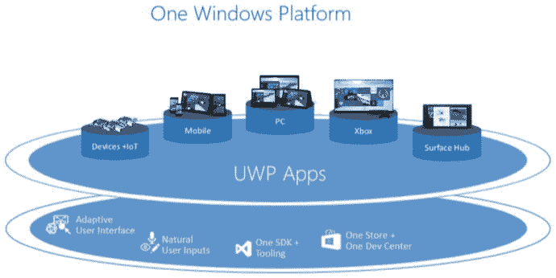

图 1-1. 通用 Windows 平台应用模型

UWP 应用可以运行在多种具有不同外形和输入机制的设备上。在开发 UWP 应用时，您需要确保针对每种设备量身打造体验，并充分利用各自设备的功能。Windows 10 上存在一个通用核心或内核。每个设备都会在基础层上添加自己的 API。因此，要访问设备的独有 API，您需要编写条件代码，以便在应用中提供设备特定的功能。

#### 设备系列

Windows 和 Windows Phone 是开发者针对 Windows 8.1 和 Windows Phone 8 应用程序进行开发的操作系统。但是，随着 Windows 10 现在可在各种设备上使用，UWP 应用面向的是特定的设备系列。设备系列定义了同一系列内各个设备共有的 API、特性和行为。它还决定了应用可以安装到哪些设备上。图 1-2 展示了设备系列的层次结构。

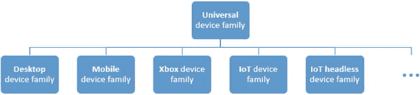

图 1-2. 通用设备系列层次结构

一组 API 拥有一个名称和一个版本号。这是设备系列操作系统的基础。例如，个人电脑运行桌面操作系统，并基于桌面设备系列。另一方面，手机和平板电脑拥有基于移动设备系列的移动操作系统。希望您现在对设备系列有了一个概念。

#### 通用控件

通过 UWP，应用可以在不同的外形尺寸、屏幕分辨率、DPI 以及其他设备特性上运行。应用必须适应这些不同的外形和分辨率。Windows 10 提供了新的通用控件、布局和工具，这些将帮助您根据应用运行的设备来调整应用 API。Windows 10 包含新的控件，例如 Calendar 和 Split View。原本专用于 Windows Phone 应用的 Pivot 控件，现在也可用于通用 Windows 平台应用。

#### 通用输入处理

对于 UWP 应用，通用控件现在支持各种输入方式，例如鼠标、键盘、触摸、触控笔和控制器（例如 Xbox 控制器）。该平台提供了一些核心 API，可在您的应用中使用来处理各种输入。以下是一些可用的输入 API。

*   `CoreInput`：允许您使用原始输入。
*   `PointerInput`：将原始触摸、鼠标和触控笔统一到一个一致的界面中。
*   `PointerDevice`：一种设备 API，允许您查询设备功能以了解可用的输入类型。

## 1.2 通用 Windows 平台的开发工具

### 问题

您想开始开发通用 Windows 平台应用。您想知道应该使用哪些工具进行开发。

### 解决方案

您的开发机器上需要安装 Windows 10 操作系统和 Visual Studio 2015 Community 版。

要安装 Windows 10，请访问微软网站 [`http://windows.microsoft.com/en-us/windows/buy`](http://windows.microsoft.com/en-us/windows/buy)。如果您已经在使用任何 Windows 操作系统，您都可以免费升级到 Windows 10。

要安装 Visual Studio 2015 (VS 2015) Community 版，您可以访问微软网站 [`https://www.visualstudio.com/en-us/downloads/visual-studio-2015-downloads-vs`](https://www.visualstudio.com/en-us/downloads/visual-studio-2015-downloads-vs)。安装 VS 2015 时，您需要确保选中了通用 Windows 应用开发工具（见图 1-3）。这位于可选功能列表中。

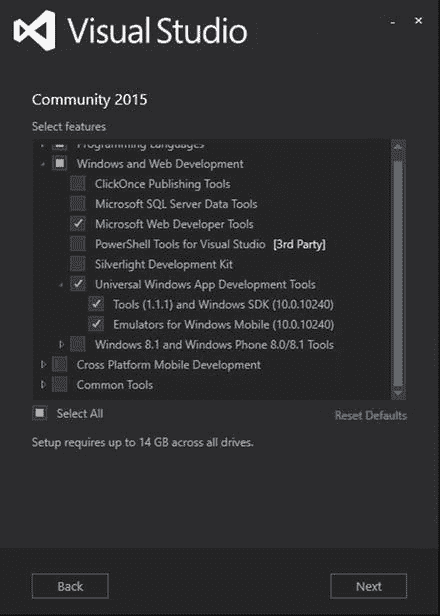

图 1-3. Visual Studio 2015 Community 版安装

## 1.3 创建通用 Windows 平台应用程序

### 问题

您想创建一个简单的通用 Windows 平台应用程序。

### 解决方案

Visual Studio 2015 附带了一个预安装的通用 Windows 平台应用程序项目模板。您将使用此模板来创建您的第一个应用程序。


### 工作原理

让我们看看如何使用 Visual Studio 2015 创建一个新的通用 Windows 平台应用。

打开 Visual Studio 2015 Community 版本。选择 **文件 ➤ 新建项目**。在 **新建项目** 对话框窗口中，从 **已安装模板** 部分选择 **模板 ➤ JavaScript ➤ Windows ➤ 通用**。从可用的项目模板中选择 **空白应用（通用 Windows）**（见图 1-4）。为应用提供名称和位置，然后点击 **确定**。

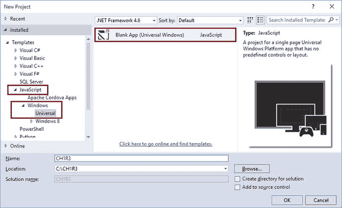

**图 1-4.** 新建项目模板

Visual Studio 将准备该项目。图 1-5 显示了新的解决方案的外观。

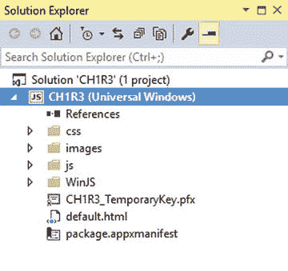

**图 1-5.** 解决方案资源管理器

作为项目模板的一部分，你会获得 `css`、`images`、`js` 和 `WinJS` 文件夹。你还会有一个预先创建的 `default.html` 页面来开始工作。

*   `css` 文件夹用于存放你的自定义样式表（`.css` 文件）。
*   `images` 文件夹包含你希望在应用中使用的任何图像。
*   `js` 是 JavaScript 文件夹，用于存放与应用相关的 `js` 文件。你会看到预先创建的 `default.js` 文件，其中包含以下代码。

```
(function () {
    "use strict";
    var app = WinJS.Application;
    var activation = Windows.ApplicationModel.Activation;
    app.onactivated = function (args) {
        if (args.detail.kind === activation.ActivationKind.launch) {
            if (args.detail.previousExecutionState !==
            activation.ApplicationExecutionState.terminated) {
                //应用初始化代码
            } else {
                //恢复应用会话状态
            }
            args.setPromise(WinJS.UI.processAll());
        }
    };
    app.oncheckpoint = function (args) {
        //在此处保存任何应用状态
    };
    app.start();
})();
```

该代码创建了一个 `WinJS.Application` 对象实例并启动应用。

在**解决方案资源管理器**中双击 `default.html` 文件将其打开。以下是你在文件中看到的默认代码：

```
<!DOCTYPE html>
<html>
<head>
    <meta charset="utf-8" />
    <title>Ch1R3</title>
    <link href="WinJS/css/ui-dark.css" rel="stylesheet" />
    <script src="WinJS/js/basejs"></script>
    <link href="/css/default.css" rel="stylesheet" />
    <script src="/js/default.js"></script>
</head>
<body class="win-type-body">
    <p>Content goes here</p>
</body>
</html>
```

它几乎是空的，只有一行文本写着“内容写在这里”。将此文本替换为“Hello World!”。这将是我们使用 UWP 的 Hello World 应用 ☺。

按下键盘上的 **Ctrl+Shift+B** 或选择 **生成 ➤ 生成解决方案**。Visual Studio 将生成该项目。

## 1.4 运行通用 Windows 平台应用

### 问题

你已创建了一个新的 UWP 应用，并且希望运行该应用以查看其实际效果。你想知道如何操作。

### 解决方案

Visual Studio 2015 提供了多种运行 UWP 应用的选项：

*   在 Windows Phone 10 模拟器上运行应用
*   在 Windows 10 模拟器上运行应用
*   在本地计算机上运行应用
*   在设备上运行应用

### 工作原理

当你安装 Visual Studio 2015 时，它还会安装 Windows Phone 10 模拟器和 Windows 10 模拟器。这些模拟器模拟了 Windows Phone 和 Windows 中的不同设备和屏幕尺寸。Visual Studio 2015 允许你选择其中一个选项来部署你的应用。你也可以直接从 Visual Studio 将应用部署到你的机器上，并作为本地应用运行。让我们逐一查看所有这些选项。

#### 在 Windows Phone 10 模拟器上运行应用

在 Visual Studio 中，从目标组合框中选择一个可用的 Windows 10 模拟器。图 1-6 显示了可用的模拟器列表。

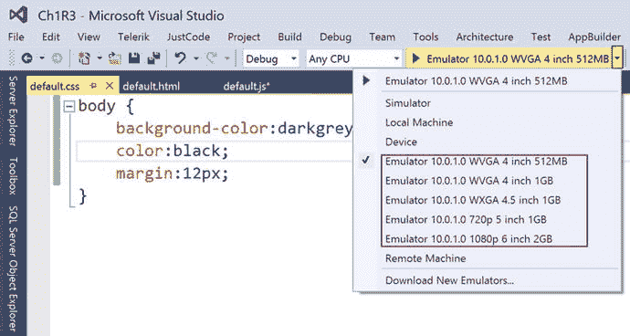

**图 1-6.** 目标 Windows Phone 10 模拟器

按下 **F5** 在选定的 Windows Phone 10 模拟器上运行应用。图 1-7 显示了 4 英寸 Windows Phone 10 上的屏幕截图。

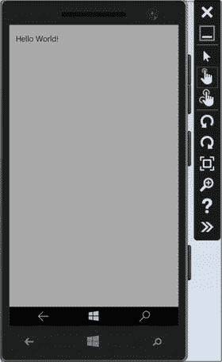

**图 1-7.** Windows Phone 10 模拟器上的 UWP 应用

#### 在 Windows 10 模拟器上运行应用

在 Visual Studio 中，从目标组合框中选择**模拟器**。此选项允许你将应用部署到 Windows 10 模拟器（见图 1-8）。

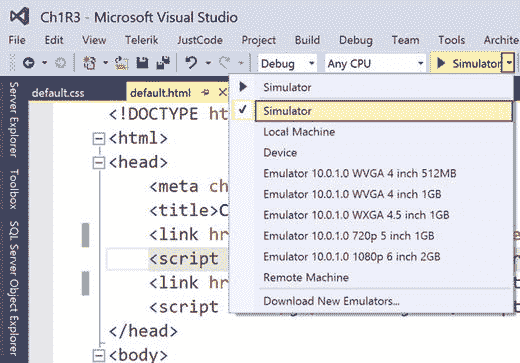

**图 1-8.** 目标 Windows 10 模拟器

按下 **F5** 在 Windows 10 模拟器上运行应用。图 1-9 是应用在模拟器上外观的屏幕截图。

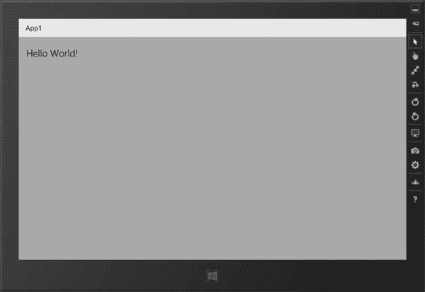

**图 1-9.** Windows 10 模拟器上的 UWP 应用

#### 在本地计算机上运行应用

通常，Windows 10 应用需要从 Windows 商店下载然后安装到你的计算机上。但此工作流仅适用于最终用户，不适用于开发人员。在应用开发期间，开发人员可以直接在其开发机器上部署和运行自己的应用。

在本地计算机上运行应用之前，你需要启用所谓的**开发人员模式**。

在你的计算机上，转到 **设置 ➤ 更新和安全 ➤ 针对开发人员**，如图 1-10 所示。

选择 **开发人员模式** 单选按钮。

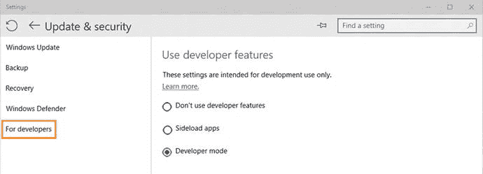

**图 1-10.** 开发人员功能设置

在 Visual Studio 中，从目标组合框中选择**本地计算机**，如图 1-11 所示。

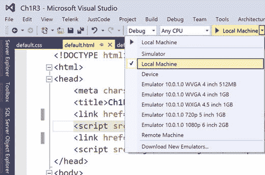

**图 1-11.** 目标本地计算机

按下 **F5** 在你的开发机器上运行应用。图 1-12 是应用在本地计算机上运行的屏幕截图。


**图 1-12.** 本地计算机上的 UWP 应用

#### 在设备上运行应用

如果你有 Windows 10 Mobile 设备，你可以直接在其上部署和运行你的 UWP 应用。但是，在你可以直接从 Visual Studio 将应用部署到设备之前，你需要启用你的手机以允许在开发期间安装应用。这也称为旁加载应用。此模式称为**开发人员模式**，并且是手机设置。在你的 Windows Phone 10 设备上，转到 **设置 ➤ 更新和安全 ➤ 针对开发人员**。选择**开发人员模式**，如图 1-13 所示。完成此步骤后，你的应用就可以直接从 Visual Studio 部署到你的设备上。

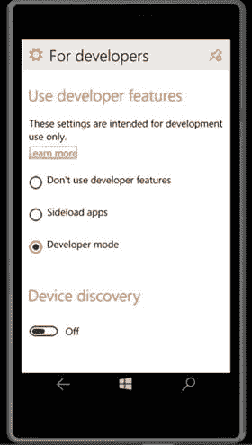

**图 1-13.** Windows Phone 设备上的开发人员模式设置

在 Visual Studio 中，选择**设备**作为你的目标，如图 1-14 所示。

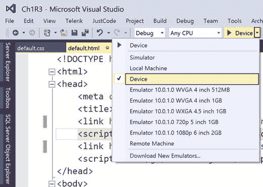

**图 1-14.** 目标设备

接下来，按下 **F5** 在你的设备上运行应用。输出应与你在模拟器中看到的类似。


