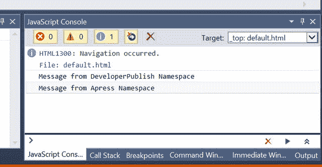
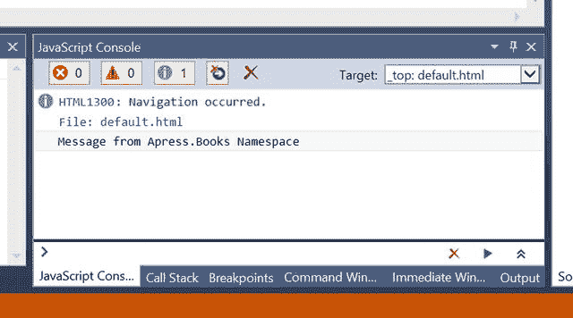
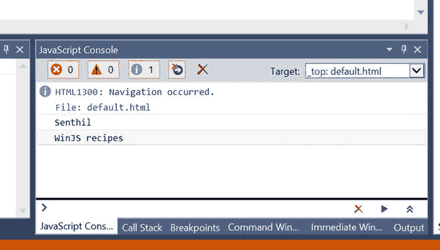
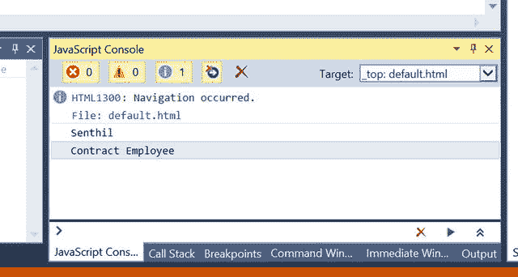
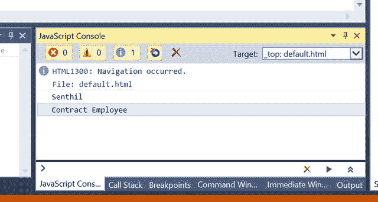
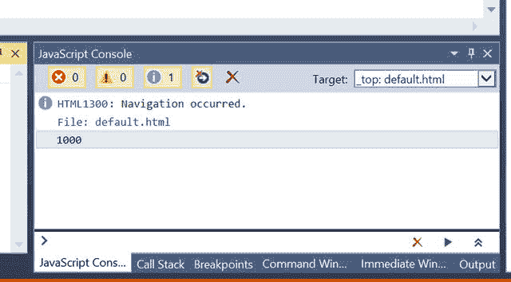
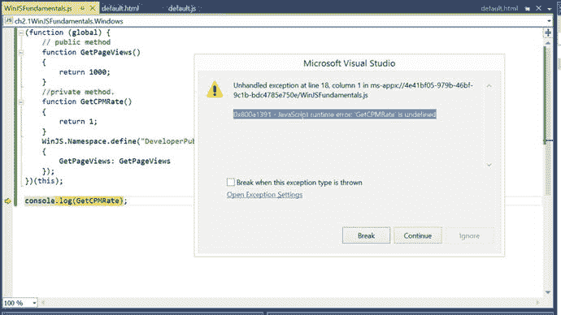
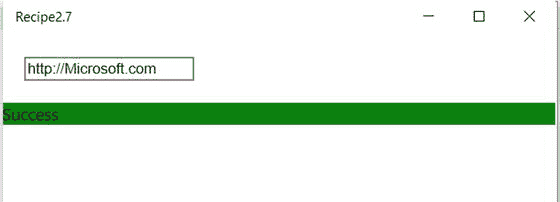

# 第 2 章：WinJS 基础

当使用平台库构建应用时，理解该库提供的功能至关重要。在本章中，你将了解 WinJS 为使用 JavaScript、HTML 和 CSS 构建 Windows 运行时应用所提供的各种功能。这些功能包括命名空间、模块、承诺和查询选择器。几乎在你使用 WinJS 构建的所有应用程序中都会用到这些功能。通过利用命名空间和模块等特性，你可以让应用更易于维护，而不是将所有内容都添加到全局命名空间下。

## 2.1 JavaScript 中的命名空间

### 问题

在使用 WinJS 库进行开发时，你需要对通用功能进行分组，并防止 JavaScript 代码中出现命名冲突。

### 解决方案

命名空间允许开发者更好地对通用功能进行分组或组织。其他编程语言——C#、VB.NET、Java 等——都提供了这一特性。许多 JavaScript 框架不支持命名空间，但 WinJS 提供了一项功能，开发者可以在其项目中使用命名空间。当你的应用使用了由不同开发者编写的多个库时，命名空间尤其有用。

开发者可以使用 `WinJS.Namespace.define` 方法来声明一个命名空间。

### 工作原理

WinJS 库允许开发者通过使用 `WinJS.Namespace.define` 方法来声明命名空间。

`WinJS.Namespace.define` 方法接受两个参数。

*   `Name`：这是第一个参数，代表新命名空间的名称。
*   `Members`：这是第二个参数，完全是可选的。此参数代表需要添加到所定义命名空间中的对象列表。

以下是使用 WinJS 在 Windows 应用商店通用应用中创建新命名空间的步骤。

启动 Visual Studio 2015，然后选择“文件”➤“新建项目”。在“新建项目”对话框中，从“已安装的模板”侧边栏中选择“JavaScript”➤“Windows”➤“通用”。选择“空白应用(通用 Windows)”模板，并将项目命名为 `ch2.1WinJSFundamentals`。单击“确定”按钮。这会在 Visual Studio 解决方案中创建必要的文件。

在 `ch2.1WinJSFundamentals` 项目中添加一个新的 JavaScript 文件，方法是右键单击项目的 `js` 文件夹，然后选择“添加”➤“新建项”。从“添加新项”对话框中选择“JavaScript 文件”，并将文件命名为 `WinJSFundamentals.js`。将以下代码添加到该文件中。

```
// 定义命名空间 Developerpublish
WinJS.Namespace.define("DeveloperPublish");
// 在 DeveloperPublish 命名空间中创建的工具
DeveloperPublish.Utilities = {
    DisplayMessage: function () {
        return "来自 DeveloperPublish 命名空间的消息";
    }
};
// 定义命名空间 Apress 并在其下创建工具。
WinJS.Namespace.define("Apress",
    {
        Utilities: {
            DisplayMessage: function () {
                return "来自 Apress 命名空间的消息";
            }
        }
    });
console.log(DeveloperPublish.Utilities.DisplayMessage());
console.log(Apress.Utilities.DisplayMessage());
```

在上面的代码片段中，`DeveloperPublish` 命名空间演示了仅使用一个参数调用 `WinJS.Namespace.define` 方法的用法。对象被添加到命名空间中，形式为“命名空间.对象名称”。

`Apress` 命名空间是使用两个参数创建的。第一个参数是命名空间的名称 `Apress`；而第二个参数是作为 `Apress` 命名空间一部分的对象。

打开 `default.html` 页面，并使用以下代码片段添加对 `WinJSFundamentals.js` 文件的引用：`<script src="js/WinJSFundamentals.js"></script>`

运行 Windows 应用。你会注意到，`Utilities` 类的 `DisplayMessage` 返回的字符串显示在控制台窗口中，如图 2-1 所示。



图 2-1. 在 Visual Studio 2015 控制台窗口中显示字符串

`WinJS.Namespace` 是默认的命名空间，它提供了诸如以下功能：

*   `promise` 对象
*   用于定义命名空间、`log` 和 `xhr` 的函数

以下是 `WinJS.Namespace` 中的对象和函数：

*   `promise`：此对象提供了在 JavaScript 代码中实现异步编程的机制。
*   `validation`：可以设置此属性来显示验证结果。
*   `define`：此函数使用指定的名称定义一个新的命名空间。
*   `defineWithParent`：此函数在指定的父命名空间下使用指定的名称定义一个命名空间。
*   `log`：此函数将输出写入 Visual Studio 2015 中的 JavaScript 控制台窗口。
*   `xhr`：此函数将对 `XMLHttpRequest` 的调用封装在一个承诺中。

请注意，你不应在命名空间定义之前引用它。当你尝试在命名空间定义之前访问它时，你会收到“命名空间未定义”的错误。

WinJS 库中包含命名空间功能，以便更好地处理与作用域相关的问题。WinJS 中命名空间实现的源代码位于你项目 `WinJS/js` 文件夹下的 `base.js` 文件中。

## 2.2 向现有命名空间添加子命名空间

### 问题

你需要向现有命名空间添加一个子命名空间，并定义你的功能。

### 解决方案

使用 `WinJS.Namespace.defineWithParent` 方法向 WinJS 中的现有命名空间添加子命名空间。

### 工作原理

`WinJS.Namespace.defineWithParent` 方法允许开发者向现有命名空间添加一个新命名空间。这类似于 `define` 方法；它允许你在现有命名空间下创建一个新命名空间。

`WinJS.Namespace.defineWithParent` 方法接受三个参数：

*   父命名空间：第一个参数是父命名空间的名称。
*   Name：这是要添加到父命名空间中的子命名空间的名称。
*   Members：要添加到新命名空间中的对象列表。这是一个可选参数。

让我们使用在方案 2.1 中创建的项目。打开项目中的 `WinJSFundamentals.js` 文件，并将其替换为以下代码片段。

```
WinJS.Namespace.define("Apress");
WinJS.Namespace.defineWithParent(Apress, "Books" ,
    {
        Utilities :
            {
                DisplayMessage: function () {
                    return "来自 Apress.Books 命名空间的消息";
                }
            }
    }
);
console.log(Apress.Books.Utilities.DisplayMessage());
```

运行 Windows 应用商店项目，你应该会看到字符串“来自 Apress.Books 命名空间的消息”显示在 Visual Studio JavaScript 控制台窗口中，如图 2-2 所示。



图 2-2. 在 Visual Studio 2015 的 JavaScript 控制台窗口中显示字符串

请注意，命名空间应仅包含类、函数、常量和其他命名空间。

## 2.3 在 WinJS 中创建类

### 问题

你需要在 Windows 运行时应用的 JavaScript 代码中创建一个类。

### 解决方案

使用 `WinJS.Class.define` 方法在 WinJS 中创建一个类。


### 工作原理

C# 和 VB.NET 是面向对象的语言。它们对语言中的面向对象概念有良好的实现和支持；其中一项功能就是类的创建。而另一方面，JavaScript 本身并不内置对类创建的支持。在 JavaScript 中，所有事物都被视为对象。

`WinJS` 允许开发者创建类并在其应用程序中使用这些类。

你可以使用 `WinJS.Class.define` 方法在 WinJS 中创建一个新类。

`WinJS.Class.define` 方法接受三个参数。

-   **构造函数**：第一个参数允许开发者初始化一个新对象。
-   **实例成员**：第二个参数是实例成员的集合，包括属性和方法。
-   **静态成员**：第三个参数包括静态属性和静态方法。

打开项目中的 `WinJSFundamentals.js` 文件，并将其替换为以下代码片段。

```
// Create a class called Author

var Author = WinJS.Class.define(

    function (name, title) {

        this.name = name;

        this.title = title;

    },

    {

        _Name: undefined,

        _title: undefined,

        name : {

            set :function(value)

            {

                this._Name = value;

            },

            get :function()

            {

                return this._Name;

            }

        },

        title : {

            set :function(value)

            {

                this._title = value;

            },

            get :function()

            {

                return this._title;

            }

        }

    });

// instantiate the author class by invoking the constructor with 2 parameters

var author1 = new Author("Senthil", "WinJS recipes");

// display the name and the title  in the console window.

console.log(author1.name);

console.log(author1.title);
```

在上述代码片段中，`Author` 类是使用 `WinJS.Class.define` 方法创建的。该方法的第一个参数是构造函数，它接受两个参数并初始化 `name` 和 `title`。

`Author` 类有两个属性。

-   `title` 及其后备字段 `_title`
-   `name` 及其后备字段 `_name`

这两个属性都包含一个 getter 方法和一个 setter 方法。例如，查看以下属性。

```
title : {

            set :function(value)

            {

                this._title = value;

            },

            get :function()

            {

                return this._title;

            }

        }
```

`title` 属性有一个 `set` 方法，允许开发者设置该属性的值。同样，你可以使用带有 `get` 方法的 `title` 属性来检索 `_title` 的值。从开发者的角度来看，调用 `<PropertyName>` 对象就足以获取或设置值。

运行 Windows 项目。你将看到实例化对象时使用的名称和标题，如图 2-3 所示。



**图 2-3.** 在 Visual Studio 2015 的 JavaScript 控制台窗口中显示名称和标题

`WinJS.Class` 命名空间提供了以下用于定义类的辅助函数。

-   `define`：该函数使用指定的构造函数和实例成员来定义一个类。
-   `derive`：该函数通过原型继承为指定类创建一个子类。
-   `mix`：该函数使用指定的构造函数定义一个类，并合并所有混入对象指定的实例成员集合。

## 2.4 在 WinJS 中派生类

### 问题

你需要在 WinJS 应用程序中应用继承概念。

### 解决方案

使用 `WinJS.Class.derive` 方法在 WinJS 中从一个类派生另一个类。

### 工作原理

WinJS 库提供了 `WinJS.Class.derive` 方法，允许开发者应用继承来从一个类派生另一个类。`WinJS.Class.derive` 方法接受以下参数。

-   **基类**：当前类需要继承的类。
-   **构造函数**：此参数指向一个 `构造函数` 函数，可用于初始化类成员。
-   **实例成员**：此参数定义实例成员，包括属性和方法。
-   **静态成员**：此参数定义静态属性和静态方法。

打开 `WinJSFundamentals.js` 文件并将代码替换为以下代码片段。

```
// Create a class called Employee

var Employee = WinJS.Class.define(

    function () {

        this.name = name;

        this.type = "Employee";

    },

    {

        _Name: undefined,

        _type: undefined,

        name : {

            set :function(value)

            {

                this._Name = value;

            },

            get :function()

            {

                return this._Name;

            }

        },

        type: {

            set :function(value)

            {

                this._type = value;

            },

            get :function()

            {

                return this._type;

            }

        }

    });

var ContractEmployee = WinJS.Class.derive(Employee,

    function (name) {

        this.name = name;

        this.type = "Contract Employee";

    });

var ContractEmployee1 = new ContractEmployee("Senthil");

// display the name and the title  in the console window.

console.log(ContractEmployee1.name);

console.log(ContractEmployee1.type);
```

此代码片段创建了一个名为 `Employee` 的类。随后，创建了另一个名为 `ContractEmployee` 的类；它继承自 `Employee` 类。创建了一个合同员工实例，并在控制台窗口中显示了该员工的 `name` 和雇佣 `type`。

从 Visual Studio 运行 Windows 应用商店项目。这将在 JavaScript 控制台窗口中显示名称和类型，如图 2-4 所示。



**图 2-4.** 在 Visual Studio 2015 的 JavaScript 控制台窗口中显示名称和雇佣类型

`WinJS.Class.derive` 函数的行为类似于 `WinJS.Class.define` 函数，不同之处在于它使用基类的原型（通过 `Object.create` 函数）来构造派生类。`Object.create` 方法通过原型化父对象从一个类型派生出另一个类型；它还会添加作为子对象一部分的属性。

## 2.5 在 WinJS 中创建混入

### 问题

你需要在不用 `WinJS.Class.derive` 方法的情况下组合多个 JavaScript 对象的方法和属性。

### 解决方案

使用 `WinJS.Class.mix` 方法在 WinJS 中组合多个 JavaScript 对象的方法和属性。


### 工作原理

`WinJS.Class.derive`方法使用原型继承，有其自身的优点和缺点。它需要额外的处理时间并影响性能。这可以通过使用`WinJS.Class.mix`方法来克服。

`WinJS.Class.mix`方法接收两个参数。

*   **构造函数**：第一个参数，用于初始化类成员。
*   **混入（Mixin）**：第二个参数是包含混入方法的数组。

打开项目中的`WinJSFundamentals.js`文件，并用以下代码片段替换其内容。

```javascript
// Create a class called Employee
var Employee = WinJS.Class.define(
    function () {
        this.name = name;
        this.type = "Employee";
    },
    {
        _Name: undefined,
        _type: undefined,
        name : {
            set :function(value)
            {
                this._Name = value;
            },
            get :function()
            {
                return this._Name;
            }
        },
        type: {
            set :function(value)
            {
                this._type = value;
            },
            get :function()
            {
                return this._type;
            }
        }
    });
var ContractEmployee = WinJS.Class.mix(
    function (name) {
        this.name = name;
        this.type = "Contract Employee";
    },Employee);
var ContractEmployee1 = new ContractEmployee("Senthil");
// display the name and the title  in the console window.
console.log(ContractEmployee1.name);
console.log(ContractEmployee1.type);
```

在此代码示例中，创建了一个`Employee`类，随后又创建了另一个名为`ContractEmployee`的类；它继承自`Employee`类。注意，这里使用了`mix`方法而不是`derive`方法。

代码看起来与使用`derive`方法的代码相似，但混入（mixin）增加了更多功能。其中一项功能就是对多重继承的支持。由于`mixin`方法中的第二个参数是一个混入数组，你可以让`ContractEmployee`类实现来自多个类的功能。

执行此程序时，你将看到员工的姓名和类型，如图 2-5 所示。



**图 2-5.** 在 Visual Studio 2015 的 JavaScript 控制台窗口中显示姓名和员工类型

混入（Mixin）可用于为你的类型添加功能。混入通常包含已实现的函数，这些函数可以添加到 WinJS 的许多类型中。

在 WinJS 中，你可以使用以下混入之一来管理事件以及进行绑定。

*   `WinJS.Utilities.eventMixin`：此混入可用于为定义的任何类型添加事件管理功能。它包含诸如`WinJS.Utilities.eventMixin.addEventListener`、`WinJS.Utilities.eventMixin.removeEventListener`和`WinJS.Utilities.eventMixin.dispatchEvent`之类的函数，用于引发和处理你定义的自定义事件。
*   `WinJS.Binding.dynamicObservableMixin`：此函数用于添加绑定管理功能，开发者可以借此将用户定义的对象绑定到能够在其属性值更改时通知侦听器的控件上。

## 2.6 WinJS 中的封装

### 问题

你想要构建一个库，并且只希望向外部访问公开其中的少数方法。你需要支持 WinJS 应用程序中的封装。

### 解决方案

利用函数和命名空间的功能来实现这一点。变量可以具有全局作用域或函数作用域。可以利用此特性在 JavaScript 中引入封装功能。

### 工作原理

当你创建自己的 JavaScript 库时，你可能希望同时创建公有方法和私有方法。公有方法可以作为 API 公开，供第三方开发者使用。

问题在于 JavaScript 不支持访问修饰符。JavaScript 中的变量具有以下作用域。

*   **全局作用域**：在整个应用程序中可用。
*   **函数作用域**：仅在函数内部可用。

函数作用域特性被用于 WinJS 中，用来隐藏方法，使其具有一定程度的私有性。通过手动将方法添加到命名空间，可以将方法公开为公有方法。

想象一下，你正在编写一个跟踪页面浏览量并显示每千次展示成本 (CPM) 的库。你希望向用户公开`GetPageViews`方法，但不公开`GetCPMRate`方法。具体操作如下……

打开共享项目中的`WinJSFundamentals.js`文件，并用以下代码片段替换其内容。

```javascript
(function (global) {
    // public method
    function GetPageViews()
    {
        return 1000;
    }
    //private method.
    function GetCPMRate()
    {
        return 1;
    }
    WinJS.Namespace.define("DeveloperPublish",
    {
        GetPageViews: GetPageViews
    });
})(this);
console.log(DeveloperPublish.GetPageViews());
```

这个自执行的匿名函数包含两个方法：`GetPageViews`和`GetCPMRate`。`DeveloperPublish`命名空间用于暴露或导出`GetPageViews`函数，并为其提供公共访问权限。另一方面，`GetCPMRate`是私有方法。你可以在全局作用域方法内调用`GetCPMRate`方法，但不能通过`DeveloperPublish`命名空间调用。例如，以下代码片段演示了一个场景，其中`GetPageViews`和`GetTotalRate`函数通过`DeveloperPublish`命名空间暴露；而`GetCPMRate`仅在`GetTotalRate`内部使用。

```javascript
(function (global) {
    // public method
    function GetPageViews() {
        return 1000;
    }
    //private method.
    function GetCPMRate() {
        return 2;
    }
    function GetTotalRate() {
        return GetPageViews() * GetCPMRate();
    }
    WinJS.Namespace.define("DeveloperPublish",
    {
        GetPageViews: GetPageViews,
        GetTotalRate: GetTotalRate
    });
})(this);
console.log(DeveloperPublish.GetPageViews());
console.log(DeveloperPublish.GetTotalRate());
```

运行 Windows 项目。在图 2-6 中，你会在 Visual Studio JavaScript 控制台窗口中看到`GetPageViews`方法显示 1000。



**图 2-6.** 在 Visual Studio 2015 的 JavaScript 控制台窗口中显示字符串

当你尝试在自执行匿名函数外部访问`GetCPMRate`方法时，会收到以下错误（另请参见图 2-7）。



**图 2-7.** 尝试访问私有方法时出错

`0x800a1391: JavaScript runtime error: 'GetCPMRate' is undefined.`

这是一个有用的特性，特别是在构建库并希望限制对 WinJS 中某些方法的访问时。

## 2.7 在 WinJS 中使用 Promise

### 问题

你需要异步执行代码，以便用户界面更具响应性。

### 解决方案

你可以在通用 Windows 应用中使用异步编程，以便某些方法的处理可以异步完成。这样，你的应用程序的 UI 线程将保持空闲，并能响应用户输入。


### 工作原理

在 WinJS 和通用 Windows 应用中，异步 API 以 promise 的形式呈现。WinJS 中 promise 的常见实现之一是 `xhr` 函数，它将 `XMLHttpRequest` 封装在 promise 中。当你提供 URL 和响应类型时，`xhr` 函数会返回一个 promise，该 promise 通过返回数据来实现，如果失败则返回错误。

在本教程中，你将构建一个简单的应用，它接受 URL 作为输入并尝试连接。结果将基于连接显示成功或失败。

在 Visual Studio 2015 中，启动上一个教程中构建的现有通用 Windows 应用。打开 `default.html` 页面，并在 body 部分添加以下 `div` 元素。这会在 `inputurl` 文本框中接受 URL，并在输出 `div` 标签中显示状态。

```html
<div>
    <input id="inputurl"/>
</div>
<div id="output">
</div>
```

你需要为输入元素添加 change 事件处理程序，该处理程序应在用户输入文本并按 Enter 键时触发。你可以将其添加到 `default.js` 文件中 `app.onactivated` 事件处理程序内的 `WinJS.Utilities.ready` 函数中，如下所示。

```javascript
WinJS.Utilities.ready(function () {
    var input = document.getElementById("inputurl");
    input.addEventListener("change", changeEvent);
}, false);
```

下一步是添加 `changeEvent` 函数，该函数需要通过传递用户输入的 URL 来调用 `xhr` 函数；这将相应地更新结果。`xhr` 函数的返回类型是 promise，允许开发者使用 promise 的 `then` 函数来异步更新 UI。

`then` 函数最多接受三个参数，包括：

*   如果 promise 成功执行且无错误，则执行 `completed` 函数
*   `error` 函数用于处理错误
*   `progress` 函数用于显示 promise 的进度

接下来，在 `app.onactivated` 事件之后，将 `changeEvent` 添加到 `default.js` 文件中，如下所示。

```javascript
function changeEvent(e) {
    var resultDiv = document.getElementById("output");
    WinJS.xhr({ url: e.target.value }).then(function completed(result) {
        if (result.status === 200) {
            resultDiv.style.backgroundColor = "Green";
            resultDiv.innerText = "Success";
        }
    },
        function error(e) {
            resultDiv.style.backgroundColor = "red";
            resultDiv.innerText = e.statusText;
        });
}
```

此代码包含 promise 的 `completed` 和 `error` 函数。它根据结果显示文本“Success”或“Error”，并更改输出 `div` 元素的颜色。

在本地计算机上生成并运行应用，输入 URL，然后按 Enter 键。如果 URL 有效，输出 `div` 标签将变为绿色并显示成功消息。如果出现错误，则会显示错误消息并带有红色背景，如图 2-8 所示。



**图 2-8.** 使用 `xhr` 函数演示 promise

你可以通过使用 promise 对象的 `cancel` 方法来停止当前正在执行的异步操作。

```javascript
xhrPromise.cancel();
```

请注意，你还可以通过在前一个 `then` 函数返回的 promise 上调用 `then` 来链式调用 promise 操作。

