# 第 3 章：基本 WinJS 控件

本章概述了 WinJS 库中可用的控件，开发者可以使用这些控件快速构建其 Windows 应用。它探讨了如何向页面添加 WinJS 控件，以及基本的 WinJS 控件，如 ToggleSwitch、Rating、DatePicker、TimePicker、工具提示、文本控件等。

WinJS 中还有一些高级控件，可用于列出记录、显示菜单或在应用中添加工具栏。（第 4 章涵盖了高级控件，如 ListView、Toolbar 和 AppBar。）

## 3.1 在页面上声明 WinJS 控件

### 问题

你需要在 Windows 应用的页面中添加或声明一个 WinJS 控件。

### 解决方案

使用 `div` 标签内的 `data-win-control` 属性在页面上添加 WinJS 控件。

### 工作原理

在 Microsoft Visual Studio 2015 中使用 Windows 通用（空白应用）模板创建一个新项目。这将创建一个通用应用，可以在运行 Windows 10 的 Windows 平板电脑和 Windows Mobile 上运行。

在 Visual Studio 解决方案资源管理器中，打开项目中的 `default.html` 页面。

通过使用 `data-win-control` 属性在页面中声明一个 WinJS 控件。例如，要在页面上声明 Rating 控件，请添加以下 `div` 标签。

```html
<div id="rating" data-win-control="WinJS.UI.Rating"></div>
```

在此代码片段中，`div` 标签充当 WinJS 控件的占位符。`data-win-control` 属性用于指示将要呈现的 WinJS 控件。

HTML 页面将如下所示。

```html
<!DOCTYPE html>
<html>
<head>
    <meta charset="utf-8" />
    <title>Recipe3.1</title>
    <!-- WinJS references -->
    <link href="WinJS/css/ui-light.css" rel="stylesheet" />
    <script src="WinJS/js/base.js"></script>
    <script src="WinJS/js/ui.js"></script>
    <!-- Recipe3.1 references -->
    <link href="/css/default.css" rel="stylesheet" />
    <script src="/js/default.js"></script>
</head>
<body class="win-type-body">
    <div id="rating" data-win-control="WinJS.UI.Rating"></div>
</body>
</html>
```

在页面上使用 WinJS 控件的主要要求是包含 JavaScript 和 CSS 文件。你应在 HTML 页面的 head 部分添加以下引用。

```html
<link href="WinJS/css/ui-light.css" rel="stylesheet" />
<script src="WinJS/js/base.js"></script>
<script src="WinJS/js/ui.js"></script>
```

WinJS 库提供了两个 CSS（层叠样式表）文件：`ui-dark.css` 和 `ui-light.css`。你可以分别通过更改为 `ui-light.css` 和 `ui-dark.css` 来在所有控件之间切换浅色主题和深色主题。

`base.js` 和 `ui.js` 文件是需要引用到 HTML 页面中才能使用 WinJS 控件的 JavaScript 文件。WinJS 控件的 JavaScript 源代码定义在这些 JavaScript 文件之一中。

在调用 `WinJS.UI.processAll` 方法之前，WinJS 控件（在此示例中为 Rating 控件）不会被呈现。此方法定义在项目 `js` 文件夹下的 `default.js` 文件中。`WinJS.UI.processAll` 方法的主要功能是解析 HTML 页面，识别带有 `data-win-control` 的属性，并相应地生成控件。

因此，有必要在页面上包含对 `default.js` 文件的引用。

现在，让我们生成通用应用并在 Windows 10 和 Windows Mobile 模拟器上运行它。

图 3-1 展示了 Rating 控件在 Windows 平板电脑上的外观。图 3-2 展示了 Rating 控件在 Windows Mobile 上的外观。

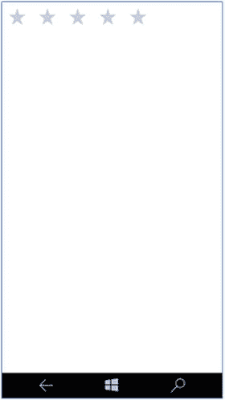

**图 3-2.** Windows Mobile 模拟器上的 Rating 控件

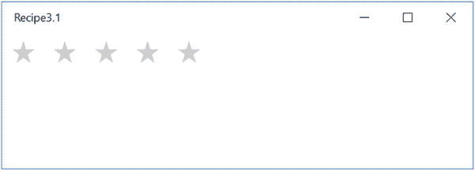

**图 3-1.** Windows 10 上的 Rating 控件

## 3.2 设置 WinJS 控件的选项

### 问题

你想为 HTML 页面上的 WinJS 控件设置附加选项或属性。

### 解决方案

使用 `data-win-options` 属性为控件设置附加选项或属性。


### 工作原理

大多数 `WinJS` 控件都支持通过 `options` 属性进行设置。例如，在页面上使用 `Rating` 控件时，你可能希望限制用户能够提供的最高评分。

你可以通过 `data-win-options` 属性来指定这一点。例如，以下 HTML 代码演示了如何将 `Rating` 控件的最高评分设置为 4。

```
<div id="rating" data-win-control="WinJS.UI.Rating"
     data-win-options="{maxRating:4}">
</div>
```

`data-win-options` 接受 JavaScript 格式的选项；传入时需包含属性名称，其值用花括号括起来。

这里的 `maxRating` 是一个属性。也可以同时传入多个属性及其值。例如，如果你需要与 `maxRating` 一起设置 `enableClear` 属性，你可以像下面这样通过 `data-win-options` 属性来设置。

```
<div id="rating" data-win-control="WinJS.UI.Rating"
         data-win-options="{maxRating:4,enableClear:false}">
    </div>
```

图 3-3 展示了在 Windows Mobile 模拟器上的界面及显示效果。

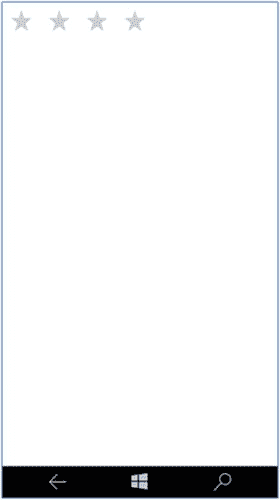

**图 3-3.** 最高评分为 4 的评分控件

如果 `enableClear` 属性设置为 `true`，那么用户可以向左滑动控件来清除评分值。

## 通过 JavaScript 代码添加 WinJS 控件

### 问题

你需要从 JavaScript 代码中添加一个 `WinJS` 控件，而不是在 HTML 页面中添加。

### 解决方案

你可以通过命令式地创建控件；即完全使用 JavaScript 来识别 `div` 元素，动态生成控件并将其添加到页面中。

### 工作原理

在 Visual Studio 2015 Community 中使用 Windows Universal (Blank App) 模板创建一个新项目。这会创建一个可以在 Windows 平板电脑或运行 Windows 10 的 Windows Mobile 上运行的 Windows 通用应用。

在 Visual Studio 解决方案资源管理器中打开项目的 `default.html` 页面。在页面主体部分添加一个 `div` 标签，用于呈现控件。

```
<div id="rating" >
    </div>
```

在解决方案资源管理器中，右键单击项目中的 `js` 文件夹。选择 **添加** ➤ **新建 JavaScript 文件** 并为文件命名。在本例中，我们将文件命名为 `controldemo.js`。这会将 `controldemo.js` 文件添加到项目的 `js` 文件夹下。

将以下代码添加到 `controldemo.js` 文件中。这段代码创建了一个新的 `Rating` 控件，并将其添加到评分 `div` 标签中。

```
(function () {
    "use strict";
    function AddControl()
    {
        var ratingDiv = document.getElementById("rating");
        var ratingCtrl = new WinJS.UI.Rating(ratingDiv);
    }
    document.addEventListener("DOMContentLoaded", AddControl);
})();
```

上面的代码创建了一个 `WinJS.UI.Rating` JavaScript 类的新实例。它是通过将评分 `div` 元素传递给 `Rating` 类的构造函数来创建的。

现在，你需要在 HTML 页面中添加对 `controldemo.js` 文件的引用。打开 `default.html` 文件，将以下代码片段添加到页面的头部区域。

```
<script src="/js/controldemo.js"></script>
```

`default.html` 页面将包含如下所示的代码。

```
<!DOCTYPE html>
<html>
<head>
    <meta charset="utf-8" />
    <title>Recipe3.3</title>
    <!-- WinJS references -->
    <link href="WinJS/css/ui-light.css" rel="stylesheet" />
    <script src="WinJS/js/base.js"></script>
    <script src="WinJS/js/ui.js"></script>
    <!-- Recipe3.3 references -->
    <link href="/css/default.css" rel="stylesheet" />
    <script src="/js/default.js"></script>
    <script src="/js/controldemo.js"></script>
</head>
<body class="win-type-body">
    <div id="rating">
    </div>
</body>
</html>
```

让我们在 Windows Mobile 模拟器上运行应用程序。图 3-4 展示了在 Windows Mobile 上的输出页面。

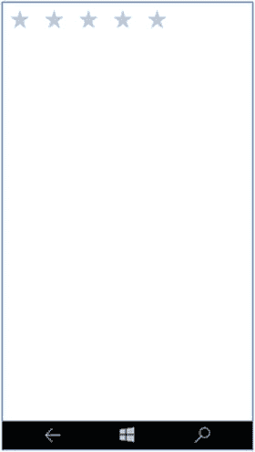

**图 3-4.** 通过 JavaScript 代码添加的评分控件

控件的选项或属性也可以通过 JavaScript 代码以命令式的方式进行设置。以下展示了如何创建一个 `Rating` 控件的实例，并通过 JavaScript 代码设置 `maxRating` 属性。

```
(function () {
    "use strict";
    function AddControl()
    {
        var ratingDiv = document.getElementById("rating");
        var ratingCtrl = new WinJS.UI.Rating(ratingDiv);
        ratingCtrl.maxRating = 4;
    }
    document.addEventListener("DOMContentLoaded", AddControl);
})();
```

这段代码片段展示了如何在构造函数之外设置 `maxRating` 属性。或者，你也可以通过将其作为第二个参数传入并用花括号括起来来设置它。

图 3-5 演示了在设置 `Rating` 控件属性时，Visual Studio 中的 IntelliSense 支持。

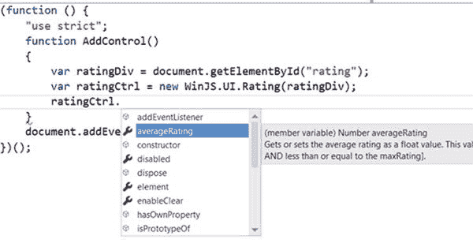

**图 3-5.** Visual Studio 2015 中的 IntelliSense 支持

`IntelliSense` 是 Microsoft Visual Studio 中一项出色的功能，它能提高开发人员的工作效率，并根据用户在 IDE 中的输入自动提供建议。

## 从 HTML 文档中获取 WinJS 控件

### 问题

你想要从 HTML 页面获取控件，并使用 JavaScript 代码设置属性。

### 解决方案

使用 `winControl` 属性从页面的 DOM 元素中获取控件。


### 工作原理

在 Visual Studio 2015 Community 中使用 Windows 通用（空白应用）模板创建一个新项目。这将创建一个可在运行 Windows 10 的 Windows 平板电脑和 Windows Mobile 上运行的 Windows 通用应用。在 Visual Studio 解决方案资源管理器中，打开项目中的 `default.html` 页面。

将 Rating 控件添加到页面的 body 区域。

```
<div id="rating" data-win-control="WinJS.UI.Rating" >
</div>
```

在解决方案资源管理器中，右键单击项目内的 `js` 文件夹。选择“添加” ➤ “新建 JavaScript 文件”，并为文件命名。在本示例中，我们将文件命名为 `controldemo.js`。这样会将 `controldemo.js` 文件添加到项目的 `js` 文件夹下。

将以下代码添加到 `controldemo.js` 文件中。

```
(function () {
    "use strict";
    function GetControl() {
        WinJS.UI.processAll().done(function () {
            var ratingControl = document.getElementById("rating").winControl;
            ratingControl.userRating = 2;
        });
    }
    document.addEventListener("DOMContentLoaded", GetControl);
})();
```

当调用 `document.getElementById` 方法时，您会获得 `DOM` 元素。您需要使用 `winControl` 属性来获取关联的控件。

这段代码需要包裹在 `WinJS.UI.processAll` 方法中，该方法会返回一个 promise。之所以要用 `processAll` 方法包裹您的逻辑，是因为您必须等待文档中所有控件都创建并解析完成后，才能尝试获取它们。

一旦获取到 Rating 控件，您就可以开始为 Rating 控件实例的属性设置值。在本示例中，您将用户评分设置为 2。

最后，您需要在 `default.html` 页面中添加对 `controldemo.js` 文件的引用。从 Visual Studio 解决方案资源管理器中打开 `default.html` 页面，并将以下代码添加到 head 标签中。

```
<script src="/js/controldemo.js"></script>
```

当您在 Windows Mobile 模拟器上运行该应用程序时，应该会看到如图 3-6 所示的界面。

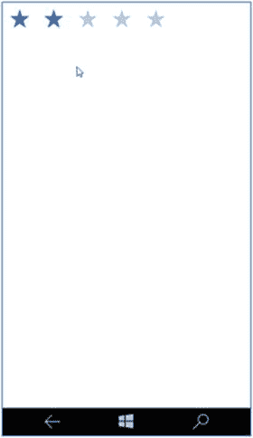

**图 3-6.** 显示值为 2 的 Rating 控件的 Windows Mobile 模拟器

## 3.5 ToggleSwitch 控件

### 问题

您需要为用户提供一个选项，使其能够在屏幕上执行二元操作。例如，您需要为用户提供一个开启或关闭服务的选项。

### 解决方案

使用 WinJS 中的 ToggleSwitch 控件。它类似于标准的复选框控件，但拥有更好的触摸支持。您只需在 ToggleSwitch 控件上滑动手指，即可选中或取消选中该选项。您可以在页面上使用 `WinJS.UI.ToggleSwitch` 值作为 `div` 元素的 `data-win-control` 属性来声明 ToggleSwitch 控件。

### 工作原理

以下展示了如何在页面上声明 ToggleSwitch 控件。

```
<div id="locationServices" data-win-control="WinJS.UI.ToggleSwitch"
         data-win-options="{
         title :'Location Services',
         labelOff: 'Disabled',
         labelOn:'Enabled',
         checked: true
         }">
</div>
```

在 Windows 平板电脑或 Windows Mobile 模拟器上执行时，上述代码片段将显示如图 3-7 所示。

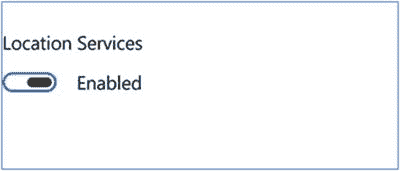

**图 3-7.** Windows Mobile 和 Windows 模拟器上的 ToggleSwitch

`data-win-options` 属性用于为 ToggleSwitch 控件设置附加属性。在上述示例中，使用了此属性来设置 `title`、`labelOff`、`labelOn` 和 `checked` 等属性。

`title` 设置 ToggleSwitch 的标题内容。`labelOff` 和 `labelOn` 属性根据控件的选中（On）和未选中（Off）状态，标识需要在 ToggleSwitch 旁边显示的文本。

ToggleSwitch 的当前状态（选中或未选中）可以通过控件的 `checked` 属性获知。

让我们在项目的 `js` 文件夹中添加一个新的 JavaScript 文件，并将其命名为 `controldemo.js`。打开 `default.html` 页面，添加 ToggleSwitch 控件以及一个用于在开关状态改变时显示消息的空 `div` 标签。

`default.html` 页面如下所示。

```
<!DOCTYPE html>
<html>
<head>
    <meta charset="utf-8" />
    <title>Recipe3.5</title>
    <!-- WinJS references -->
    <link href="WinJS/css/ui-light.css" rel="stylesheet" />
    <script src="WinJS/js/base.js"></script>
    <script src="WinJS/js/ui.js"></script>
    <!-- Recipe3.5 references -->
    <link href="/css/default.css" rel="stylesheet" />
    <script src="/js/default.js"></script>
    <script src="/js/controldemo.js"></script>
</head>
<body class="win-type-body">
    <div id="locationServices" data-win-control="WinJS.UI.ToggleSwitch"
         data-win-options="{
         title :'Location Services',
         labelOff: 'Disabled',
         labelOn:'Enabled',
         checked: true
         }">
    </div>
    <div id="info"></div>
</body>
</html>
```

为了能从 JavaScript 代码中识别出状态，您需要连接 ToggleSwitch 控件的 `change` 事件处理程序。当您更改控件的状态时，会触发此事件。

打开 `controldemo.js` 文件，并将其替换为以下代码。

```
(function () {
    "use strict";
    function GetControl() {
        WinJS.UI.processAll().done(function () {
            var toggleButton = document.getElementById("locationServices").winControl;
            var InfoElement = document.getElementById("info");
            toggleButton.addEventListener('change', function (args) {
                if (toggleButton.checked) {
                    InfoElement.innerHTML = "Location Services enabled";
                }
                else {
                    InfoElement.innerHTML = "Location Services disabled";
                }
            })
        });
    }
    document.addEventListener("DOMContentLoaded", GetControl);
})();
```

当您在 Windows 10 模拟器和 Windows Mobile 模拟器上运行该应用程序时，将看到如图 3-8 所示的界面。

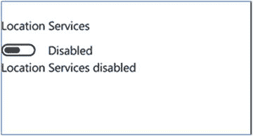

**图 3-8.** 带有 change 事件的 ToggleSwitch。

当您切换控件时，相应的消息会显示在 `info` `div` 元素中。

## 3.6 DatePicker 控件

### 问题

您希望允许用户从应用程序页面中选择一个日期。

### 解决方案

使用 WinJS DatePicker 控件，该控件允许用户选取日期。此控件显示三个列表：分别用于月份、日期和年份。


### 工作原理

你可以在页面上声明 `DatePicker` 控件，如下所示。

```
<div id="Birthday" data-win-control="WinJS.UI.DatePicker" ></div>
```

在本教程中，我们将尝试在页面上添加 `DatePicker` 控件，并在 JavaScript 代码中绑定事件，以在 `div` 元素中显示所选日期。

使用 Visual Studio 2015 中的 Windows 通用应用模板创建一个新项目。打开 `default.html` 页面，并将其替换为以下内容。

```
<!DOCTYPE html>
<html>
<head>
    <meta charset="utf-8" />
    <title>Recipe3.6</title>
    <!-- WinJS 引用 -->
    <link href="WinJS/css/ui-light.css" rel="stylesheet" />
    <script src="WinJS/js/base.js"></script>
    <script src="WinJS/js/ui.js"></script>
    <!-- Recipe3.6 引用 -->
    <link href="/css/default.css" rel="stylesheet" />
    <script src="/js/default.js"></script>
    <script src="/js/controldemo.js"></script>
</head>
<body class="win-type-body">
    <div id="Birthday" data-win-control="WinJS.UI.DatePicker">
    </div>
    <div id="info"></div>
</body>
</html>
```

`default.html` 页面包含 `DatePicker` 控件以及用于显示所选日期的名称信息 `div` 标签。页面引用了接下来要创建的 `controldemo.js` 文件。

在 Visual Studio 解决方案资源管理器中，向项目的 js 文件夹添加一个新的 JavaScript 文件，并将其命名为 `controldemo.js`。将以下 JavaScript 代码添加到 `controldemo.js` 文件中。

```
(function () {
    "use strict";
    function GetControl() {
        WinJS.UI.processAll().done(function () {
            var datepick = document.getElementById("Birthday").winControl;
            var InfoEelement = document.getElementById("info");
            datepick.addEventListener('change', function (args) {
                InfoEelement.innerHTML = "所选日期是 " +
                    datepick.current.toDateString();
            })
        });
    }
    document.addEventListener("DOMContentLoaded", GetControl);
})();
```

当您更改日期、月份或年份时，`DatePicker` 会立即触发 `change` 事件。您可以通过处理此事件来获取当前选中的日期。

在 JavaScript 代码中，使用 `document.getElementById` 的 `winControl` 属性从 HTML 页面获取 `DatePicker`。然后，从 `DatePicker` 控件调用 `addEventListener` 方法来订阅 `change` 事件。

选中的日期通过 `DatePicker` 的 `current` 属性获取。

在 Windows Mobile 或 Windows 10 上运行应用程序，将显示 `DatePicker` 并展示选中的日期，如图 3-9 所示。

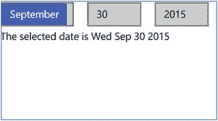

图 3-9. DatePicker 控件演示

您可以通过分配格式字符串来控制 `DatePicker` 控件的年、月、日字段的显示外观。

例如，可以将 `DatePicker` 格式化为显示缩写月份、年份以及两位数的日期，如下所示。

```
<div id="Birthday" data-win-control="WinJS.UI.DatePicker"
     data-win-options="{
        monthPattern : '{month.abbreviated}',
        datePattern: '{day.integer(2)}',
        yearPattern: '{year.abbreviated}'
     }">
</div>
```

格式通过 `monthPattern`、`datePattern` 和 `yearPattern` 属性设置。

`monthPattern` 属性定义月份的显示模式。您可以使用表 3-1 中所示的值之一来设置月份模式属性。

表 3-1. 日期选择器的月份模式

| 模式 | 描述 |
| --- | --- |
| month.full | 显示月份的全名。 |
| month.abbreviated(n) | 您可以使用带或不带参数的 `month.abbreviated`。参数指定月份的字母数。 |
| month.solo.full | 表示适合独立显示的月份。并且，`month.solo.abbreviated` 可以带参数或不带参数使用。 |
| month.integer(n) | `month.integer` 用于指定月份字段中显示的整数个数。 |

`datePattern` 属性用于获取或设置 `DatePicker` 控件中日期的显示模式。您可以使用表 3-2 中所示的值之一来设置 `datePattern`。

表 3-2. 日期选择器的日期模式

| 模式 | 描述 |
| --- | --- |
| day.integer(n) | 您可以使用带或不带参数的 `day.integer`。参数指定要包含的前导零；例如，如果值为 `day.integer (2)`，则显示 02。 |
| dayofweek.abbreviated | 此属性显示星期几。参数指定要显示的字母数。 |

`yearPattern` 属性获取或设置年份的显示模式。默认的年份模式是 `year.full`。您可以将其修改为表 3-3 中所示的任一值。

表 3-3. 日期选择器的年份模式

| 模式 | 描述 |
| --- | --- |
| year.full | 以数字形式显示完整年份 |
| year.abbreviated(n) | 显示指定位数集合的年份。 |

## 3.7 TimePicker 控件

### 问题

您希望允许用户从应用程序页面中选择时间。

### 解决方案

使用 WinJS `TimePicker` 控件，该控件允许用户选择时间。此控件显示三个列表：分别对应小时、分钟和时段（上午/下午）。


### 工作原理

你可以在页面上声明 `DatePicker` 控件，如下所示：

```
<div id="timeSelector" data-win-control="WinJS.UI.TimePicker"></div>
```

在本节中，我们将尝试在页面上添加 `TimePicker` 控件，并在 JavaScript 代码中绑定事件，以在 `div` 元素中显示所选时间。

在 Visual Studio 2015 中使用 Windows 通用应用模板创建一个新项目。打开 `default.html` 页面，并将其替换为以下内容：

```
<!DOCTYPE html>
<html>
<head>
    <meta charset="utf-8" />
    <title>BasicControls</title>
    <!-- WinJS references -->
    <link href="WinJS/css/ui-light.css" rel="stylesheet" />
    <script src="WinJS/js/base.js"></script>
    <script src="WinJS/js/ui.js"></script>
    <!-- Recipe3.7 references -->
    <link href="/css/default.css" rel="stylesheet" />
    <script src="/js/default.js"></script>
    <script src="/js/controldemo.js"></script>
</head>
<body class="win-type-body">
    <div id="timeSelector" data-win-control="WinJS.UI.TimePicker"></div>
    <div id="info"></div>
</body>
</html>
```

`default.html` 页面包含了 `TimePicker` 控件以及用于显示所选时间的名为 `info` 的 `div` 标签。页面中还引用了 `controldemo.js` 文件，你将在下一步中创建该文件。

从 Visual Studio 解决方案资源管理器中，向项目的 `js` 文件夹添加一个新的 JavaScript 文件，并将其命名为 `controldemo.js`。用以下 JavaScript 代码替换该文件的内容：

```
(function () {
    "use strict";
    function GetControl() {
        WinJS.UI.processAll().done(function () {
            var datepick = document.getElementById("timeSelector").winControl;
            var InfoEelement = document.getElementById("info");
            datepick.addEventListener('change', function (args) {
                InfoEelement.innerHTML = "The selected time is " +
                    datepick.current.toTimeString();
            })
        });
    }
    document.addEventListener("DOMContentLoaded", GetControl);
})();
```

当你更改小时、分钟或时段时，`TimePicker` 会立即引发 `change` 事件。你可以通过处理此事件来获取当前所选时间。

在 JavaScript 代码中，使用 `document.getElementById` 的 `winControl` 属性可从 HTML 页面获取 `TimePicker`。然后，从 `TimePicker` 控件调用 `addEventListener` 方法以订阅 `change` 事件。

所选时间通过 `TimePicker` 控件的 `current` 属性获取。

在 Windows Mobile 或 Windows 10 上运行应用程序时，将显示 `TimePicker` 并展示所选时间，如图 3-10 所示。

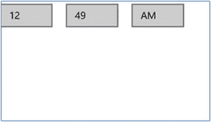

图 3-10.

TimePicker 控件演示

你可以通过使用 `data-win-options` 属性设置 `clock` 属性，使 `TimePicker` 支持 24 小时制格式，如下所示：

```
<div id="timeSelector" data-win-control="WinJS.UI.TimePicker"
         data-win-options="{
         clock : '24HourClock',
         minuteIncrement : 15
         }">
</div>
```

分钟列表的增量值可以通过 `minuteIncrement` 属性控制，如下所示。

当你在 Windows 10 或 Windows Mobile 10 上运行该页面时，将看到如图 3-11 所示的界面。

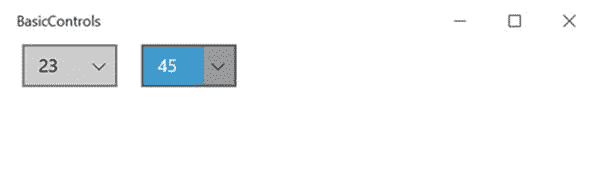

图 3-11.

采用 24 小时制格式并调整时间间隔的 TimePicker

你可以通过指定格式字符串来控制 `TimePicker` 控件的小时、分钟和时段字段的外观。

格式通过 `hourPattern`、`minutePattern` 和 `periodPattern` 属性设置。

`hourPattern` 属性获取或设置小时的显示模式。`hourPattern` 属性的默认值为 `hour.integer(2)`，你可以通过更改参数值来修改 `hourPattern` 属性。`minutePattern` 属性获取或设置分钟的显示模式。此属性的默认值为 `minute.integer(2)`，你可以通过更改参数中的整数位数来修改此模式。`periodPattern` 属性获取或设置时段的显示模式；此属性的默认值为 `period.abbreviated(2)`。你可以通过更改参数值来修改此属性的模式。

表 3-4.

TimePicker 中小时、分钟和时段的模式

| 模式 | 描述 |
| --- | --- |
| `hour.integer(n)` | 显示指定位数的小时。 |
| `minute.integer(n)` | 显示指定位数的分钟。 |
| `period.abbreviated(n)` | 根据作为参数传递的值显示时段的模式。 |

## 3.8 Tooltip 控件

### 问题

当用户悬停在页面上的任何元素上时，你需要显示一个工具提示。

### 解决方案

使用 WinJS `Tooltip` 控件在页面上的 HTML 元素上显示工具提示。当你将鼠标悬停在一个元素上时，工具提示会显示指定的秒数。当用户将光标移开该元素时，工具提示应消失。

### 工作原理

你可以像这样为按钮添加 `Tooltip` 控件：

```
<button id="btnSave"
            data-win-control="WinJS.UI.Tooltip"
            data-win-options="{
            innerHTML: 'Saves the <b>Employee</b> record'}">
    Save
</button>
```

通过 `data-win-options` 属性设置 `innerHTML` 属性，该属性为工具提示控件设置文本。此文本也可以包含 HTML 标签。

图 3-12 演示了工具提示在 Windows Mobile 10 和 Windows 10 平板电脑上的显示方式。

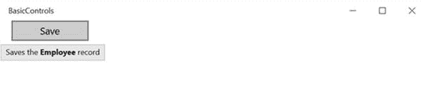

图 3-12.

在应用内显示的工具提示

你可以通过修改 `win-tooltip` CSS 类来自定义工具提示控件的样式。

从 CSS 文件夹打开 `default.css` 文件，并将以下代码添加到文件末尾：

```
.win-tooltip
{
    background-color: bisque;
    border-radius:30px;
    border-color:red;
}
```

图 3-13 演示了定义上述样式后工具提示控件的外观。

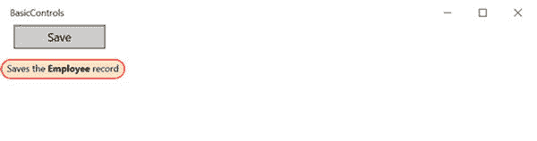

图 3-13.

应用样式的工具提示

请注意，当使用 `div` 元素作为工具提示的容器时，你需要将其 display 属性设置为 `inline-block`，因为 `div` 元素默认的 display 设置为 `block`。

## 3.9 显示文本

### 问题

你需要在 Windows 应用的页面上显示文本或标签。

### 解决方案

使用传统的 HTML 元素或标签在 Windows 应用的页面上显示文本。这些元素包括 `div`、`label`、段落、标题等。


### 工作原理

HTML 元素——如 `label`、`div`、`p`、`h1` 等——是使用 JavaScript 的 Windows 通用应用中用于显示只读文本的常见控件之一。

您可以定义一个简单的标签控件并设置其文本，如下所示。

```
<label>欢迎来到 Windows 10 应用开发世界</label>
```

```
<div>由 Microsoft MVPs 提供</div>
```

可通过两种方法之一对显示文本应用样式：内联样式或 CSS。

以下代码片段演示了如何使用内联样式属性来格式化文本。

```
<div style="font-family:Verdana">欢迎来到 Windows 10 应用开发世界</div>
```

```
<p style="margin:0px; color:blue; font-family:Arial; font-size:18px">欢迎来到 Windows 10 应用开发世界</p>
```

图 3-14 展示了使用内联样式属性的上述代码的输出结果。

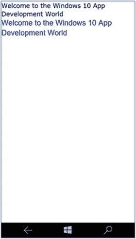

**图 3-14.** 为只读文本设置样式

CSS 允许开发者定义样式（仅一次且在一个位置），并随后将其复用于多个控件。

## 3.10 在应用中编辑文本

### 问题

您需要允许用户在 Windows 应用的页面中输入文本。

### 解决方案

使用 HTML 元素允许用户在页面中输入文本。这包括文本框、文本区域、密码输入框、富文本框等。

### 工作原理

使用 JavaScript 的 Windows 通用应用有四种不同类型的文本输入元素。

*   **文本框：** 此控件允许用户在一行中输入或编辑纯文本。
*   **文本区域：** 此控件支持多行，允许用户输入或编辑纯文本。
*   **密码输入框：** 此控件允许用户输入密码。
*   **富文本框：** 此控件允许用户编辑需要格式化的文本。

以下是简单文本框、文本区域和密码输入框的 HTML 代码。

```
<div><textarea id="textarea1" rows="2"></textarea></div>
```

```
<div><input type="text" /></div>
```

```
<div><input id="password" type="password" placeholder="输入密码" /></div>
```

图 3-15 展示了这些控件在 Windows Mobile 10 模拟器上的显示效果。

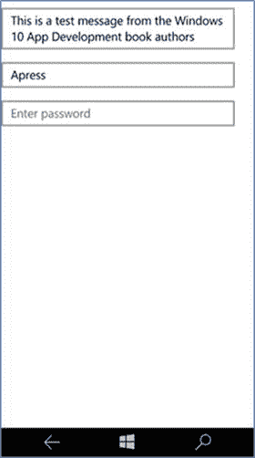

**图 3-15.** 可编辑控件

一旦用户执行某些操作（如按钮点击），您便可以从 JavaScript 代码中获取控件的内容，如方案 3-4 所示。

