# 第 4 章：列表控件、应用栏和工具栏

本章重点介绍与数据集合相关的控件，包括 `Repeater`、`FlipView` 和 `ListView`。本章还涵盖了与菜单相关控件的方案，例如 `AppBar`、`ToolBar`、`Flyouts`、`ContextMenu` 和 `MenuFlyouts`。

## 4.1 使用 Repeater 控件

### 问题

您需要使用 WinJS `Repeater` 控件在用户界面 (UI) 上显示数据集合。

### 解决方案

`Repeater` 控件是 WinJS 库中可用于在 UI 上显示数据集合的控件之一。您可以通过将容器的 `data-win-control` 属性设置为 `WinJS.UI.Repeater` 值来添加 `Repeater` 控件，然后使用 `data-win-bind` 属性将属性绑定到 UI 中的控件。


### 工作原理

为了演示 `Repeater` 控件的使用，让我们构建一个通用 Windows 应用，该应用以 HTML 表格形式显示员工列表，如图 4-1 所示。

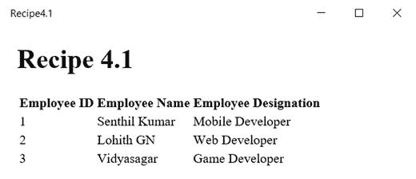

*图 4-1. 使用 Repeater 控件的 HTML 表格*

启动 Visual Studio 2015，并使用 JavaScript 模板创建一个新的 Windows 通用项目。

打开 `default.html` 页面，并将其替换为以下代码片段。

```html
<!DOCTYPE html>
<html>
<head>
    <meta charset="utf-8" />
    <title>Recipe4.1</title>
    <!-- WinJS references -->
    <link href="WinJS/css/ui-light.css" rel="stylesheet" />
    <script src="WinJS/js/base.js"></script>
    <script src="WinJS/js/ui.js"></script>
    <link href="/css/default.css" rel="stylesheet" />
    <script src="/js/default.js"></script>
    <script src="/js/data.js"></script>
</head>
<body style="margin:20px">
    <h1>Recipe 4.1</h1>
    <table>
        <thead>
            <tr>
                <th> Employee ID</th>
                <th> Employee Name</th>
                <th> Employee Designation</th>
            </tr>
        </thead>
        <tbody id="repeaterData" data-win-control="WinJS.UI.Repeater">
            <tr>
                <td data-win-bind="textContent:id"></td>
                <td data-win-bind="textContent:name"></td>
                <td data-win-bind="textContent:designation"></td>
            </tr>
        </tbody>
    </table>
</body>
</html>
```

在前面的代码片段中，`Repeater` 控件被添加到 body 部分；而 `Repeater` 控件的内部内容则用作模板。来自 repeater 数据的每一行都会显示在 HTML 表格的 body 部分。

前面的 HTML 页面引用了一个 `data.js` 页面。让我们将此文件添加到项目中。在项目的 `js` 文件夹中添加一个新的 JavaScript 文件，并将其命名为 `data.js`。以下代码片段包含了为 `Repeater` 控件设置数据源的 JavaScript 代码。

```javascript
(function () {
    "use strict";
    function Initialize() {
        WinJS.UI.processAll().done(function () {
            var repeaterControl1 = document.getElementById('repeaterData').winControl;
            var Employees = new WinJS.Binding.List([
                { id: 1, name: "Senthil Kumar", designation: "Mobile Developer" },
                { id: 2, name: "Lohith GN", designation: "Web Developer" },
                { id: 3, name: "Vidyasagar", designation: "Game Developer" }
            ]);
            repeaterControl1.data = Employees;
        })
    }
    document.addEventListener("DOMContentLoaded", Initialize);
})();
```

`WinJS.Binding.List` 用于绑定 `Repeater` 控件。在前面的代码片段中，`Repeater` 控件被绑定到员工列表，该列表表示员工数据的集合。员工对象包含以下属性：`id`、`name` 和 `designation`。数据通过 `Repeater` 控件的 `data` 属性进行绑定。

在 Windows Mobile 模拟器上运行该应用程序。你应该会看到如图 4-2 所示的屏幕。

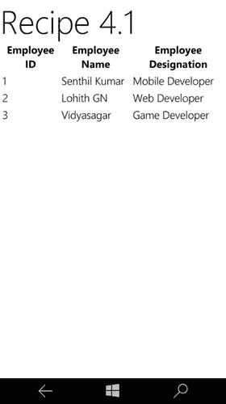

*图 4-2. Windows Mobile 10 中的 Repeater 控件*

如果希望 `Repeater` 控件中的项可调用或可选择，一种选择是在 `Repeater` 控件模板中使用 `ItemContainer` 控件。

以下示例演示了在 `Repeater` 控件中使用 `ItemContainer` 的用法，该控件绑定到员工列表。

```html
<div id="repeaterData" data-win-control="WinJS.UI.Repeater">
        <div data-win-control="WinJS.UI.ItemContainer" data-win-bind="dataset.name:name">
             <div data-win-bind="textContent:name"></div>
        </div>
</div>
```

`ItemContainer` 有一个名为 `data-win-bind="dataset.name: name"` 的属性，该属性将员工列表中每个项目的名称与 `ItemContainer` 关联起来。

`Repeater` 控件在 JavaScript 文件中被绑定到员工列表，如下所示。

```javascript
(function () {
    "use strict";
    function Initialize() {
        WinJS.UI.processAll().done(function () {
            var repeaterControl1 = document.getElementById('repeaterData').winControl;
            var Employees = new WinJS.Binding.List([
                { id: 1, name: "Senthil Kumar", designation: "Mobile Developer" },
                { id: 2, name: "Lohith GN", designation: "Web Developer" },
                { id: 3, name: "Vidyasagar", designation: "Game Developer" }
            ]);
            repeaterControl1.data = Employees;
            repeaterControl1.addEventListener("invoked",function(e)
            {
                var name = e.target.dataset.name;
                var message = new Windows.UI.Popups.MessageDialog(name);
                message.showAsync();
            })
        })
    }
    document.addEventListener("DOMContentLoaded", Initialize);
})();
```

当你在 Windows 中运行该应用程序时，你会看到三个项目被渲染出来。如果你点击一个项目，会显示一个消息框，其中包含该项目的名称，如图 4-3 所示。

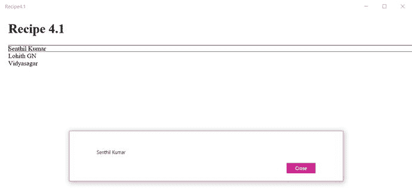

*图 4-3. Repeater 控件中可调用的项*

## 4.2 使用 FlipView 控件

### 问题

你需要只显示集合中的单个项目。

### 解决方案

使用 WinJS 中的 `FlipView` 控件，该控件一次只显示集合中的一个项目。`FlipView` 控件的一个用例是照片库应用，用户可以选择一张图片，然后在图片列表中滑动浏览。

尽管一次只显示一个项目，但 `FlipView` 控件会显示箭头，让你可以移动到数据源中的下一个或上一个项目。

你可以通过将 `div` 元素的 `data-win-control` 属性设置为 `WinJS.UI.ListView` 来向页面添加 `ListView` 控件。


### 工作原理

在 Visual Studio 2015 中创建一个新的 Windows 通用项目。将新的 JavaScript 文件命名为 `data.js`，并放在 `js` 文件夹下。该 JavaScript 文件将包含可在 ListView 中列出的数据。将以下代码片段添加到 `data.js` 文件中。

```
(function () {
    "use strict";
     var Employees = new WinJS.Binding.List([
         { id: 1, name: "Senthil Kumar", designation: "Mobile Developer" },
         { id: 2, name: "Lohith GN", designation: "Web Developer" },
         { id: 3, name: "Vidyasagar", designation: "Game Developer" }
         ]);
     WinJS.Namespace.define("recipeData",
         {
             Employees :Employees
         });
})();
```

前述 JavaScript 代码包含一个员工集合；每个员工拥有 `id`、`name` 和 `designation` 属性。

现在，你希望在你的 Windows 应用中一次显示一名员工。以下 HTML 代码片段展示了如何使用 FlipView 控件从员工列表中逐个显示员工信息。

请注意，页面引用了 `data.js` 文件，该文件包含了 FlipView 控件所需的数据。

```
<!DOCTYPE html>
<html>
<head>
    <meta charset="utf-8" />
    <title>Recipe4.2</title>
    <!-- WinJS references -->
    <link href="WinJS/css/ui-light.css" rel="stylesheet" />
    <script src="WinJS/js/base.js"></script>
    <script src="WinJS/js/ui.js"></script>
    <!-- Recipe4.2 references -->
    <link href="/css/default.css" rel="stylesheet" />
    <script src="/js/default.js"></script>
    <script src="/js/data.js"></script>
</head>
<body class="win-type-body" style="margin:20px">
    <h1>Recipe 4.2</h1>
    <div id="template" data-win-control="WinJS.Binding.Template">
        <div>
            <h4 data-win-bind="innerText: name"></h4>
            <h6 data-win-bind="innerText: designation"></h6>
        </div>
    </div>
    <div id="flipView1"
         data-win-control="WinJS.UI.FlipView"
         data-win-options="{itemTemplate: select('#template') ,
         itemDataSource : recipeData.Employees.dataSource}">
    </div>
</body>
</html>
```

当你在 Windows 上运行此应用时，你应该会看到如图 4-4 所示的页面。

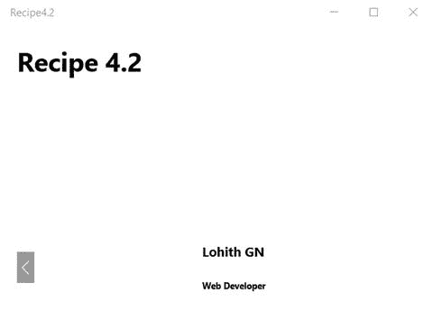

图 4-4.

WinJS 应用中的 FlipView

FlipView 通过以下 HTML 标签声明。

```
<div id="flipView1"
         data-win-control="WinJS.UI.FlipView"
         data-win-options="{itemTemplate: select('#template') ,
         itemDataSource : recipeData.Employees.dataSource}">
</div>
```

FlipView 通过 `itemDataSource` 属性绑定到员工列表。在上述代码片段中，FlipView 绑定到类型为 `WinJS.Binding.List` 的员工列表。

请注意，FlipView 显示来自实现了 `IListDataSource` 接口的数据源中的数据。此类数据源的示例包括 `WinJS.Binding.List` 和 `WinJS.UI.StorageDataSource`。

此外，FlipView 的 `itemTemplate` 属性被设置为 ID 为 `template` 的 TemplateControl。该模板用于格式化 ListView 中显示的员工详细信息。在此示例中，模板配置为显示 `name` 和 `designation`。

## 4.3 使用 ListView 控件

### 问题

你需要在页面上显示一个可交互的项目列表。

### 解决方案

使用 ListView 控件，它为开发者提供了大量选项来列出项目，同时还提供了其他选项，如选择、排序、筛选、分组等。你可以通过将 `data-win-bind` 属性设置为 `WinJS.UI.ListView` 值来将 ListView 添加到页面。


### 工作原理

`ListView`控件是 Windows 应用程序中最常用的控件之一。你可以将`ListView`控件绑定到实现了`IListDataSource`接口的数据源。目前，`WinJS`有两个实现了`IListDataSource`接口的对象：

- `WinJS.Binding.List`
- `WinJS.UI.StorageDataSource`

在本教程中，我们将重点介绍如何使用`WinJS.Binding.List`数据源。

让我们看看如何将`ListView`控件与`WinJS.Binding.List`数据源一起使用。

在 Visual Studio 2015 中创建一个新的 Windows 通用应用，并打开`default.html`页面。用以下代码替换它：

```html
<!DOCTYPE html>
<html>
<head>
    <meta charset="utf-8" />
    <title>Recipe4.3</title>
    <!-- WinJS references -->
    <link href="WinJS/css/ui-light.css" rel="stylesheet" />
    <script src="WinJS/js/base.js"></script>
    <script src="WinJS/js/ui.js"></script>
    <!-- Recipe4.3 references -->
    <link href="/css/default.css" rel="stylesheet" />
    <script src="/js/default.js"></script>
    <script src="/js/data.js"></script>
</head>
<body class="win-type-body">
    <h1>Recipe 4.3</h1>
    <div id="template" data-win-control="WinJS.Binding.Template">
        <div>
            <h4 data-win-bind="innerText: name"></h4>
            <h6 data-win-bind="innerText: designation"></h6>
        </div>
    </div>
    <div id="listView1"
         data-win-control="WinJS.UI.ListView"
         data-win-options="{itemTemplate: select('#template')}">
    </div>
</body>
</html>
```

以下代码用于将`ListView`控件添加到页面：

```html
<div id="listView1"
     data-win-control="WinJS.UI.ListView"
     data-win-options="{itemTemplate: select('#template')}">
</div>
```

上述代码片段中的`ListView`控件使用模板来显示每位员工。

请注意，你已在 HTML 页面中引用了`data.js`文件。该文件包含员工数组。向项目的`js`文件夹添加一个新的 JavaScript 文件，并将其命名为`data.js`。用以下代码替换`data.js`文件：

```javascript
(function () {
    "use strict";
    function Initialize() {
        WinJS.UI.processAll().done(function () {
            var listControl1 = document.getElementById('listView1').winControl;
            var Employees = new WinJS.Binding.List([
                { id: 1, name: "Senthil Kumar", designation: "Mobile Developer" },
                { id: 2, name: "Lohith GN", designation: "Web Developer" },
                { id: 3, name: "Vidyasagar", designation: "Game Developer" },
                { id: 4, name: "Michael", designation: "Architect" }
            ]);
            listControl1.itemDataSource = Employees.dataSource;
            listControl1.addEventListener("iteminvoked", function (e) {
                var index = e.detail.itemIndex;
                e.detail.itemPromise.then(function (item) {
                    var message = new Windows.UI.Popups.MessageDialog(item.data.name);
                    message.showAsync();
                })
            })
        })
    }
    document.addEventListener("DOMContentLoaded", Initialize);
})();
```

根据员工数组创建了一个列表，并通过`itemDataSource`属性将其绑定到`ListView`控件。

当你运行应用时，会看到列表视图中显示员工数据。

JavaScript 代码还包含了处理`ListView`的调用事件（invoked event）的代码，该事件会显示从列表中选择的员工。

`ListView`控件在内部为每个`ListView`项使用`ItemContainer`控件。你可以处理`ListView`控件的`item-invoked`事件，以检测何时点击了特定的`ListView`项。

图 4-5 展示了本教程中代码片段在 Windows 中渲染的屏幕。

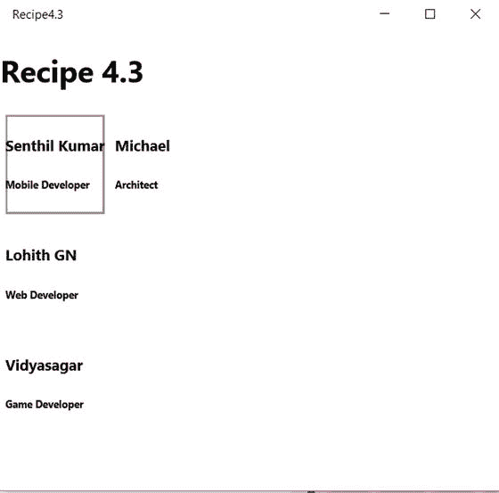

图 4-5. 带有调用事件处理的 Windows 应用中的`ListView`控件

`ListView`控件支持不同的布局，这些布局决定了控件的整体外观。这些布局包括：

- 网格布局
- 列表布局
- 跨单元格布局

网格布局以网格格式（包含行和列）显示`ListView`项。列表布局在单个列表中显示列表项。跨单元格布局以网格布局显示列表项，但支持多列单元格。

要将`ListView`设置为网格布局，需在`data-win-options`属性下将`layout`属性设置为`WinJS.UI.GridLayout`，如下所示：

```html
<div id="listView1"
         data-win-control="WinJS.UI.ListView"
         data-win-options="{itemTemplate: select('#template'),
         layout : {type:WinJS.UI.GridLayout,maximumRowsOrColumns : 1}}">
    </div>
```

图 4-6 展示了使用网格布局时渲染的 UI。

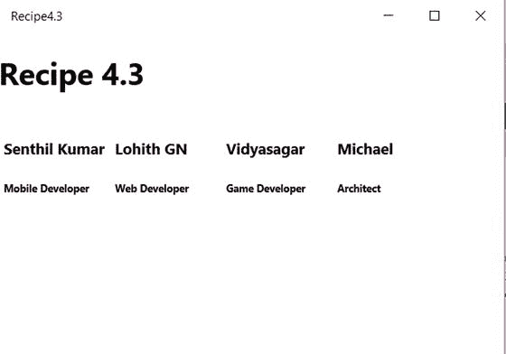

图 4-6. `ListView`中的网格布局

你也可以将布局设置为以下值：

- `WinJS.UI.cellSpanningLayout`
- `WinJS.UI.ListLayout`

## 4.4 在`ListView`控件中筛选项

### 问题

你需要通过从与`ListView`关联的数据源中进行筛选，来筛选`ListView`中显示的项。

### 解决方案

你可以使用设置为数据源的`WinJS.Binding.List`，然后通过`createFiltered`方法创建一个新的筛选列表。`createFiltered`函数根据列表中的输入项创建一个筛选后的投影。


### 工作原理

接下来演示 `ListView` 控件中的筛选功能。

在 Visual Studio 2015 中使用 JavaScript 模板创建一个新的通用 Windows 应用。从解决方案资源管理器中打开 `default.html` 页面，并将其替换为以下代码。

```
<!DOCTYPE html>
<html>
<head>
    <meta charset="utf-8" />
    <title>Recipe4.4</title>
    <!-- WinJS 引用 -->
    <link href="WinJS/css/ui-light.css" rel="stylesheet" />
    <script src="WinJS/js/base.js"></script>
    <script src="WinJS/js/ui.js"></script>
    <!-- Recipe4.4 引用 -->
    <link href="/css/default.css" rel="stylesheet" />
    <script src="/js/default.js"></script>
    <script src="/js/data.js"></script>
</head>
<body class="win-type-body">
    <h1>Recipe4.4</h1>
    <div>
        <input id="txtSearch" />
    </div>
    <div id="template" data-win-control="WinJS.Binding.Template">
        <h3 data-win-bind="innerText:name"></h3>
    </div>
    <div id="lstEmployees" data-win-control="WinJS.UI.ListView"
         data-win-options="{itemTemplate:select('#template')}">
    </div>
</body>
</html>
```

请注意其中包含了 `data.js` 文件，该文件用于设置数据源并执行筛选操作。此 HTML 页面包含一个 ID 为 `txtSearch` 的文本框和一个 `ListView` 控件。`ListView` 关联了一个自定义模板，用于以格式化方式显示数据。

接下来，将 JavaScript 文件添加到项目的 `js` 文件夹中，并将其命名为 `data.js`。将以下代码添加到 `data.js` 文件中。

```
(function () {
    "use strict";
    // 用作数据源的员工列表
    var lstEmployees = new WinJS.Binding.List([
        { id: 1, name: "Senthil Kumar" },
        { id: 2, name: "Lohith GN" },
        { id: 3, name: "Senthil Kumar B" },
        { id: 4, name: "Vidyasagar" },
    ]);

    function Initialize() {
        WinJS.UI.processAll().done(function () {
            // 从 DOM 中获取 ListView
            var lstControl = document.getElementById('lstEmployees').winControl;
            // 从 HTML 页面获取搜索文本
            var filterText = document.getElementById('txtSearch');
            lstControl.itemDataSource = lstEmployees.dataSource;
            filterText.addEventListener("keyup", function () {
                filterEmployee(lstControl, filterText.value);
            });
        });
    }

    // 筛选列表的函数
    function filterEmployee(listEmployee,searchtext)
    {
        var filtereddata = lstEmployees.createFiltered(function (item) {
            var result = item.name.toLowerCase().indexOf(searchtext);
            return item.name.toLowerCase().indexOf(searchtext) == 0;
        });
        listEmployee.itemDataSource = filtereddata.dataSource;
    }

    document.addEventListener("DOMContentLoaded", Initialize);
})();
```

这段 JavaScript 代码包含一个名为 `filterEmployee` 的方法，该方法接受一个 `ListView` 控件和一个用于筛选的搜索字符串。此函数对 `ListView` 进行筛选，并显示与搜索字符串匹配的员工信息。

以下是 `createFiltered` 方法中用于筛选 `ListView` 控件数据源的函数：

```
var fileteredData = lstEmployees.createFiltered(function (item) {
    var result = item.name.toLowerCase().indexOf(searchtext);
            return item.name.toLowerCase().indexOf(searchtext) == 0;
});
```

此函数的作用类似于实时筛选器，当项目以搜索文本字符串开头时，它会返回该项目。

在 Windows 上运行该应用。您应该会看到如图 4-7 所示的界面。

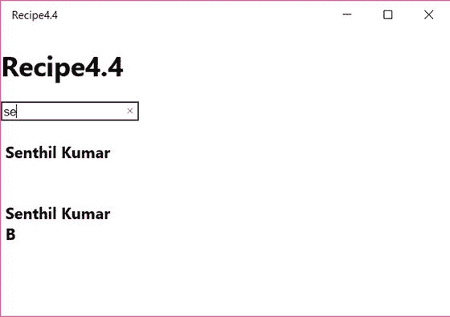

图 4-7.

筛选 ListView

当您在文本框中开始输入文本时，您会看到项目被筛选并显示在屏幕上。

## 4.5 在 ListView 控件中对项目进行分组

### 问题

需要按类别对 `ListView` 中的项目进行分组，而不是以平面列表形式显示。

### 解决方案

要对 `ListView` 中的项目进行分组，需要使用分组数据源。这可以通过使用 WinJS 中的 `WinJS.Binding.List.createGrouped()` 函数来实现。


### 工作原理

要在 WinJS 中对 `ListView` 控件中的项目进行分组，需要包含两个模板：一个用于组标题，一个用于单个项目。

让我们在 Visual Studio 2015 中创建一个新的 Windows 通用项目，并打开 `default.html` 页面。将其替换为以下代码片段。

```
<!DOCTYPE html>
<html>
<head>
    <meta charset="utf-8" />
    <title>Recipe4.5</title>
    <!-- WinJS 引用 -->
    <link href="WinJS/css/ui-light.css" rel="stylesheet" />
    <script src="WinJS/js/base.js"></script>
    <script src="WinJS/js/ui.js"></script>
    <!-- Recipe4.5 引用 -->
    <link href="/css/default.css" rel="stylesheet" />
    <script src="/js/default.js"></script>
    <script src="/js/data.js"></script>
</head>
<body class="win-type-body">
    <h1>配方 4.5</h1>
    <div id="GroupHeader" data-win-control="WinJS.Binding.Template">
        <h3 data-win-bind="innerText: technology"></h3>
    </div>
    <div id="employee" data-win-control="WinJS.Binding.Template">
        <h4 data-win-bind="innerText:name"></h4>
    </div>
    <div id="lvEmployees" data-win-control="WinJS.UI.ListView"
         data-win-options="{
         itemTemplate: select('#employee'),
         groupHeaderTemplate: select('#GroupHeader')
         }">
    </div>
</body>
</html>
```

此代码片段包含一个名为 `lvEmployees` 的 `ListView` 控件，该控件关联了组标题模板和 `itemTemplate`。

请注意对 `data.js` JavaScript 文件的引用。

在 Visual Studio 2015 解决方案资源管理器中，于 `js` 文件夹下新建一个 JavaScript 文件，并将其命名为 `data.js`。向其中添加以下代码片段。

```
(function () {
    "use strict";
    function Initialize() {
        WinJS.UI.processAll().done(function () {
            var listView1 = document.getElementById("lvEmployees").winControl;
            var employeeList = new WinJS.Binding.List([
                { id: 1, name: "Senthil Kumar", technology: "Mobile" },
                { id: 2, name: "Michael", technology: "Web" },
                { id: 3, name: "Lohith", technology: "Web" },
                { id: 4, name: "Stephen", technology: "Mobile" },
                { id: 5, name: "Vidyasagar", technology: "Game" },
                { id: 6, name: "Joseph", technology: "Mobile" },
            ]);
            var groupedEmployees = employeeList.createGrouped(
                function (item) {
                    return item.technology;
                },
                function (item) {
                    return { technology: item.technology }
                },
                function (group1, group2) {
                    return group1 > group2 ? 1 : -1;
                });
            listView1.groupDataSource = groupedEmployees.groups.dataSource;
            listView1.itemDataSource = groupedEmployees.dataSource;
        });
    }
    document.addEventListener("DOMContentLoaded", Initialize);
})();
```

此 JavaScript 代码创建了项目数据源以及分组数据源。该列表包含员工记录，每个项目包含 `id`、`name` 和 `technology` 属性。

分组数据源是使用 WinJS 的 `createGrouped` 方法创建的，该方法需要传入三个函数作为参数。

*   `GroupKey`：此函数用于将列表中的每个项目与一个组关联起来。前面的示例返回了与每个员工关联的 `technology` 属性。
*   `GroupData`：此函数返回由组标题显示的数据项。在前面的示例中，`GroupData` 返回了在标题中显示的该组的 `technology`。
*   `GroupSorter`：此函数处理组的排序顺序；例如，按升序列出标题中的组。

请注意，分组数据源是动态的，它同样可以与筛选后的数据源一起使用。

一旦项目数据源和分组数据源准备就绪，就分别将它们设置为 `ListView` 的 `groupDataSource` 属性和 `itemDataSource` 属性，如下所示。

```
listView1.groupDataSource = groupedEmployees.groups.dataSource;
listView1.itemDataSource = groupedEmployees.dataSource;
```

在 Windows 上运行该应用程序时，您将看到如图 4-8 所示的界面。

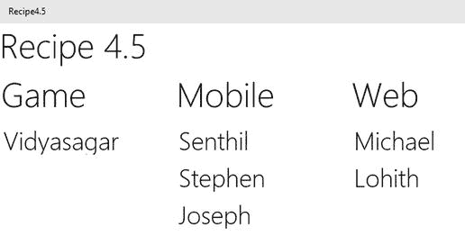

**图 4-8.** 带有分组数据的 ListView

请注意，项目已按技术分组并显示在页面上。

## 4.6 ListView 中的语义缩放

### 问题

您希望在使用 `ListView` 时，为用户提供一个选项，使其能够在两个不同的缩放级别查看数据。

### 解决方案

您可以在应用程序中使用 WinJS 的 `SemanticZoom` 控件来实现语义缩放功能。`SemanticZoom` 控件允许您在使用 `ListView` 时提供同一数据的两种不同视图。

您可以通过将 `div` 元素的 `data-win-control` 属性设置为 `WinJS.UI.SemanticZoom` 值来添加 `SemanticZoom`。


### 工作原理

语义缩放功能可通过 WinJS 中的 `SemanticZoom` 控件实现。设想一个场景：你有一个员工列表，可按其使用的技术进行分组。为了让用户能轻松在各项技术之间导航，你可以使用语义缩放功能——默认情况下，用户看到的是按类别分组的员工视图；当缩小视图时，则只显示技术列表。

在 Visual Studio 2015 中创建一个新的通用 Windows 应用，并打开 `default.html` 页面。将现有代码替换为以下内容。

```
<!DOCTYPE html>
<html>
<head>
    <meta charset="utf-8" />
    <title>Recipe4.6</title>
    <!-- WinJS references -->
    <link href="WinJS/css/ui-light.css" rel="stylesheet" />
    <script src="WinJS/js/base.js"></script>
    <script src="WinJS/js/ui.js"></script>
    <!-- Recipe4.6 references -->
    <link href="/css/default.css" rel="stylesheet" />
    <script src="/js/default.js"></script>
    <script src="/js/data.js"></script>
</head>
<body class="win-type-body">
    <h1>Recipe 4.6</h1>
    <!-- 放大视图 -->
    <div id="GroupHeader" data-win-control="WinJS.Binding.Template">
        <h1 data-win-bind="innerText: technology"></h1>
    </div>
    <div id="EmployeeTemplate" data-win-control="WinJS.Binding.Template">
        <h2 data-win-bind="innerText:name"></h2>
    </div>
    <!-- 缩小视图 -->
    <div id="TechnologyTemplate" data-win-control="WinJS.Binding.Template">
        <h6 data-win-bind="innerText: technology"></h6>
    </div>
    <div id="szEmployee" data-win-control="WinJS.UI.SemanticZoom">
        <!-- 放大视图 -->
        <div id="lvEmployees" data-win-control="WinJS.UI.ListView"
             data-win-options="{
         itemTemplate: select('#EmployeeTemplate'),
         groupHeaderTemplate: select('#GroupHeader')
         }">
        </div>
        <!-- 缩小视图 -->
        <div id="lvTechnologies" data-win-control="WinJS.UI.ListView"
             data-win-options="{
         itemTemplate: select('#TechnologyTemplate')
         }">
        </div>
    </div>
</body>
</html>
```

前面的页面包含一个 `SemanticZoom` 控件，其中含有两个 `ListView` 控件。以下是使用 `SemanticZoom` 控件和 `ListView` 的代码片段。

```
<div id="szEmployee" data-win-control="WinJS.UI.SemanticZoom">
        <!-- 放大视图 -->
        <div id="lvEmployees" data-win-control="WinJS.UI.ListView"
             data-win-options="{
         itemTemplate: select('#EmployeeTemplate'),
         groupHeaderTemplate: select('#GroupHeader')
         }">
        </div>
        <!-- 缩小视图 -->
        <div id="lvTechnologies" data-win-control="WinJS.UI.ListView"
             data-win-options="{
         itemTemplate: select('#TechnologyTemplate')
         }">
        </div>
</div>
```

`SemanticZoom` 控件包含两个具有不同缩放级别的 `ListView` 控件。当用户尝试放大或缩小时，系统会自动切换对应的 `ListView` 控件。

在项目的 `js` 文件夹下新建一个 JavaScript 文件，并将其命名为 `data.js`。该文件包含 `ListView` 的项目源和分组数据源。将以下代码添加到 `data.js` 文件中。

```
(function () {
    "use strict";
    function Initialize() {
        WinJS.UI.processAll().done(function () {
            var listView1 = document.getElementById("lvEmployees").winControl;
            var listView2 = document.getElementById("lvTechnologies").winControl;
            var employeeList = new WinJS.Binding.List([
                { id: 1, name: "Senthil Kumar", technology: "Mobile" },
                { id: 2, name: "Michael", technology: "Web" },
                { id: 3, name: "Lohith", technology: "Web" },
                { id: 4, name: "Stephen", technology: "Mobile" },
                { id: 5, name: "Vidyasagar", technology: "Game" },
                { id: 6, name: "Joseph", technology: "Mobile" },
            ]);
            // 分组数据源
            var groupedEmployees = employeeList.createGrouped(
                function (item) {
                    return item.technology;
                },
                function (item) {
                    return { technology: item.technology }
                },
                function (group1, group2) {
                    return group1 > group2 ? 1 : -1;
                });
            listView1.groupDataSource = groupedEmployees.groups.dataSource;
            listView1.itemDataSource = groupedEmployees.dataSource;
            listView2.itemDataSource = groupedEmployees.groups.dataSource;
        });
    }
    document.addEventListener("DOMContentLoaded", Initialize);
})();
```

运行应用程序时，您将看到如图 4-9 所示的界面。

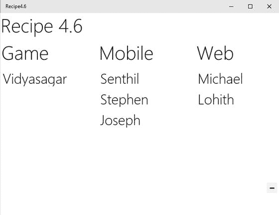

图 4-9.

默认视图下的语义缩放

点击屏幕右上角显示的“-”按钮，或使用拉伸手势进行缩小。

替代视图如图 4-10 所示。

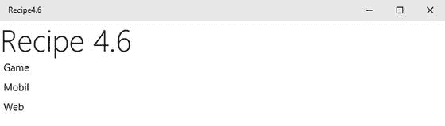

图 4-10.

使用语义缩放显示替代的 ListView

## 使用 AppBar 控件

### 问题

你需要提供对与当前页面或当前所选内容相关的常见任务的快速访问。

### 解决方案

你可以通过向页面添加应用栏，来提供对与当前页面或当前所选内容相关的常见任务的快速访问。可以通过为 `div` 元素设置 `data-win-control="WinJS.UI.AppBar"` 属性，将 `AppBar` 控件添加到页面中。


### 工作原理

应用栏是一个包含图标按钮和省略号的行，位于应用屏幕底部。当用户点击省略号时，会显示可用的带标签图标按钮和菜单项。

以下是将`AppBar`控件添加到 HTML 页面的语法。

```
<div data-win-control="WinJS.UI.AppBar"></div>
```

`AppBar`控件既可以使用 JavaScript 代码添加，也可以使用以下语法添加。

```
var object = new WinJS.UI.AppBar(element, options);
```

`AppBarCommand`添加在`AppBar`内部。它本质上是在`AppBar`中显示的命令或按钮。

```
<button data-win-control="WinJS.UI.AppBarCommand"></button>
```

通过将控件的`data-win-options`属性的`section`属性设置为`secondary`，可以指定`AppBarCommand`是否应以菜单形式显示。

让我们创建一个应用来演示`AppBar`的功能，其中包括以下功能：

*   `AppBarCommands`（按钮），用于演示“添加”和“删除”选项。
*   `AppBarCommands`（菜单项），用于演示用户点击省略号时显示的菜单项。

当用户点击按钮或菜单项时，会处理相应的事件并显示相应的消息。

在 Visual Studio 2015 中创建一个新的通用 Windows 项目，并打开 `default.html` 页面。将其内容替换为以下代码。

```
<!DOCTYPE html>
<html>
<head>
    <meta charset="utf-8" />
    <title>Recipe4.7</title>
    <!-- WinJS references -->
    <link href="WinJS/css/ui-light.css" rel="stylesheet" />
    <script src="WinJS/js/base.js"></script>
    <script src="WinJS/js/ui.js"></script>
    <!-- Recipe4.7 references -->
    <link href="/css/default.css" rel="stylesheet" />
    <script src="/js/default.js"></script>
    <script src="/js/appbarevents.js"></script>
</head>
<body class="win-type-body">
    <div id="appBar" data-win-control="WinJS.UI.AppBar">
        <button data-win-control="WinJS.UI.AppBarCommand"
                data-win-options="{id:'cmdAdd', label:'Add', icon:'add', section:'primary', tooltip:'Add'}"></button>
        <button data-win-control="WinJS.UI.AppBarCommand"
                data-win-options="{id:'cmdRemove', label:'Remove', icon:'remove', section:'primary', tooltip:'Remove'}"></button>
        <button data-win-control="WinJS.UI.AppBarCommand"
                data-win-options="{id:'cmdCamera', label:'Click Photo', icon:'camera', section:'secondary', tooltip:'click'}"></button>
    </div>
    <div id="Message"></div>
</body>
</html>
```

HTML 标记在主区域中添加了两个 `AppBarCommands`（添加、删除），并在辅助菜单中添加了一个 `AppBarCommand`（相机）。`data-win-options` 属性为控件提供了额外的选项。其中一些属性包括：

*   `Id`：唯一标识 `AppBarCommand`。
*   `label`：`AppBarCommand` 中显示的内容。
*   `icon`：`AppBarCommand` 的内置图标。
*   `section`：命令应在 `AppBar` 中显示的区域。该值可以是 `primary` 或 `secondary`。
*   `tooltip`：鼠标悬停在命令按钮上时显示的文本。

注意，页面包含对 `appbarevents.js` JavaScript 文件的引用。该文件包含了处理 `AppBarCommands` 事件的逻辑。让我们在项目的 `js` 文件夹下创建一个新的 JavaScript 文件，并将其命名为 `appbarevents.js`。向其中添加以下代码。

```
(function () {
    "use strict";
    WinJS.UI.Pages.define("default.html", {
        ready: function (element, options) {
            element.querySelector("#cmdAdd").addEventListener("click", AddMethod, false);
            element.querySelector("#cmdRemove").addEventListener("click", RemoveMethod, false);
            element.querySelector("#cmdCamera").addEventListener("click", CameraMethod, false);
        }
    });
    // 命令按钮函数
    function AddMethod() {
        var message = new Windows.UI.Popups.MessageDialog("添加按钮已按下");
        message.showAsync();
    }
    function RemoveMethod() {
        var message = new Windows.UI.Popups.MessageDialog("删除按钮已按下");
        message.showAsync();
    }
    function CameraMethod() {
        var message = new Windows.UI.Popups.MessageDialog("相机按钮已按下");
        message.showAsync();
    }
})();
```

上述 JavaScript 代码处理了 `AppBarCommand` 按钮的点击事件。点击按钮时，会显示一条消息。

在 Windows 上运行该应用。你应该会看到如图 4-11 所示的屏幕。

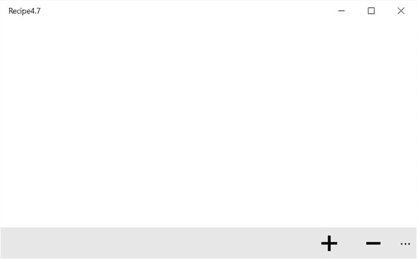

图 4-11.

包含 `AppBar` 的 Windows 应用

点击应用栏中的省略号按钮，会显示辅助区域，如图 4-12 所示。

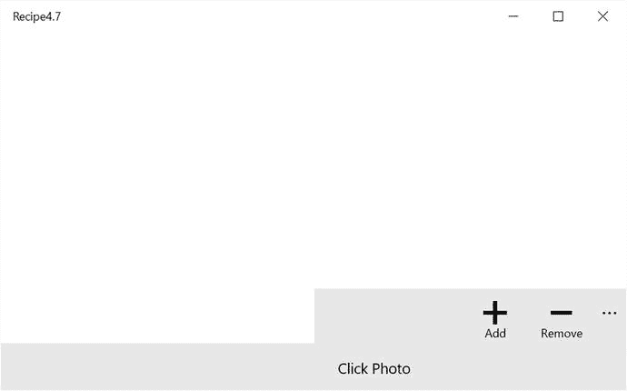

图 4-12.

包含 `AppBar` 和辅助区域的 Windows 应用

点击菜单按钮时，会显示相应的消息。

## 使用工具栏控件

### 问题

你需要显示一组可以出现在任何位置的命令；例如，浮出控件或屏幕顶部的应用栏。

### 解决方案

你可以使用 `ToolBar` 控件在操作区域中显示尽可能多的命令。此控件并不局限于应用内的单个位置。它可以在 splitView、浮出控件等中找到。


### 工作原理

在 Visual Studio 2015 中使用 JavaScript 模板创建一个新的通用 Windows 应用。打开 `default.html` 页面。

将 `default.html` 页面的内容替换为以下代码。

```
<!DOCTYPE html>
<html>
<head>
<meta charset="utf-8" />
<title>Recipe4.8</title>
<!-- WinJS references -->
<link href="WinJS/css/ui-light.css" rel="stylesheet" />
<script src="WinJS/js/base.js"></script>
<script src="WinJS/js/ui.js"></script>
<!-- Recipe4.8 references -->
<link href="/css/default.css" rel="stylesheet" />
<script src="/js/default.js"></script>
</head>
<body class="win-type-body">
<div class="basicToolbar" data-win-control="WinJS.UI.ToolBar">
<!-- Primary commands -->
<button data-win-control="WinJS.UI.Command" data-win-options="{
id:'cmdAdd',
label:'add',
section:'primary',
type:'button',
icon: 'add',
onclick: recipes.clickcommand}"></button>
<button data-win-control="WinJS.UI.Command" data-win-options="{
id:'cmdEdit',
label:'Edit',
section:'primary',
type:'button',
icon: 'edit',
onclick: recipes.clickcommand}"></button>
<button data-win-control="WinJS.UI.Command" data-win-options="{
id:'cmdDelete',
label:'delete',
section:'primary',
type:'button',
icon: 'delete',
onclick: recipes.clickcommand}"></button>
<!-- Secondary command -->
<button data-win-control="WinJS.UI.Command" data-win-options="{
id:'cmdShare',
label:'share',
section:'secondary',
type:'button',
onclick: recipes.clickcommand}"></button>
</div>
</body>
</html>
```

上述代码片段在主要命令中添加了三个按钮，在次要命令中添加了一个按钮（共享）。次要命令默认是隐藏的，点击省略号按钮时会显示出来。

通过将 `div` 元素的 `data-win-control` 属性设置为 `WinJS.UI.ToolBar` 值来添加工具栏控件。

你可以通过将 `data-win-control` 属性设置为 `WinJS.UI.Command` 值，在工具栏内部添加按钮。`data-win-options` 属性用于设置命令属性。以下是为命令设置的部分属性。

*   `id`：定义命令的标识符。
*   `label`：定义命令要显示的文本。
*   `section`：定义命令在工具栏中应出现的区域。该值可以是 "primary" 或 "secondary"。
*   `type`：该值设置为 "button" 以显示按钮控件。
*   `onClick`：触发并调用相应 JavaScript 方法的事件。
*   `icon`：显示命令的内置图标。

注意，我们已经为命令设置了 `OnClick` 事件。现在让我们为其添加事件。

打开项目 `js` 文件夹下的 `default.js` 文件。在 `args.setPromise` 方法之前添加以下代码。

```
WinJS.Namespace.define("recipes", {
clickcommand: WinJS.UI.eventHandler(function (ev) {
var command = ev.currentTarget;
if (command.winControl) {
var message = Windows.UI.Popups.MessageDialog(command.winControl.label);
message.showAsync();
}
})
});
```

上述代码片段定义了一个名为 `recipe` 的命名空间，并添加了一个名为 `clickcommand` 的事件处理程序。当事件被调用时，它会显示一个 `MessageDialog`。

现在，让我们在 Windows 上运行该应用。你应该会看到如图 4-13 所示的屏幕。

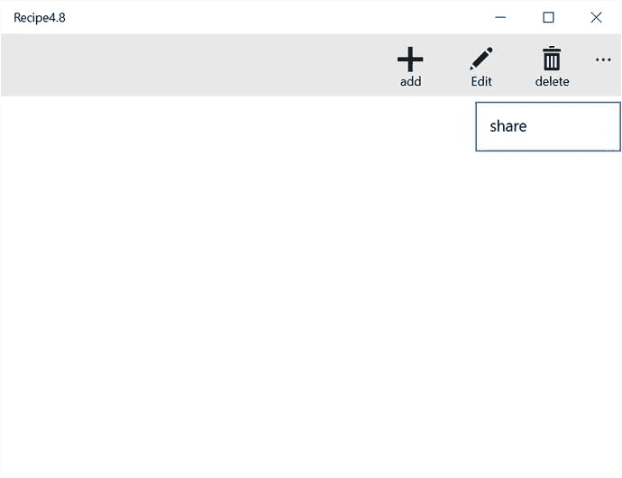

图 4-13. Windows 应用中的工具栏

当你点击命令按钮时，会看到一个消息对话框，描述被点击的按钮。

