# 第 5 章：数据绑定与导航

通常，当你查看任何应用程序时，它都由用户界面（UI）和底层业务逻辑组成。数据绑定是一个将应用程序 UI 与业务逻辑连接起来的过程。当数据值发生变化时，绑定到该数据的元素会自动反映这些变化；而当元素值发生变化时，底层数据也会相应更新并反映变化。

## 5.1 数据绑定到简单对象

### 问题

作为应用程序业务逻辑的一部分，你有一个包含数据属性的简单业务对象。你希望将该业务对象的数据属性绑定到 UI 上的 HTML 元素。

### 解决方案

数据绑定由 `WinJS.Binding` 命名空间提供。它提供了 `processAll()` 方法，该方法将对象的值绑定到任何 DOM 元素的值。DOM 元素必须使用 `data-win-bind` 属性，并提供需要绑定的属性名称。


### 工作原理

让我们看看如何在应用程序中执行简单的数据绑定。

打开 Visual Studio 2015。依次选择“文件”➤“新建项目”➤“JavaScript”➤“Windows”➤“通用”➤“空白应用（通用 Windows）”模板（见图 5-1）。

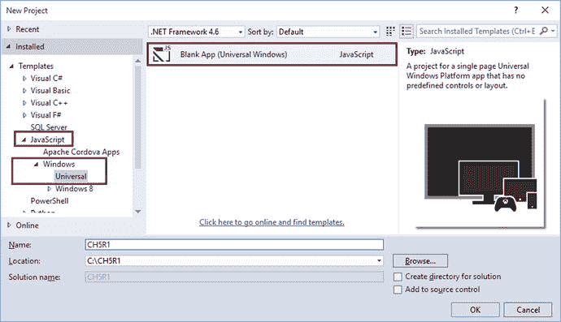

图 5-1。

“新建项目”对话框。Visual Studio 会创建通用 Windows 应用空白项目，并将所有必需的文件添加到解决方案中。打开 `js` 文件夹下的 `default.js`。在立即执行函数内部，`'use strict'` 指令之后添加以下代码行：

```
(function () {
    "use strict";
    //创建一个 person 对象
    var person = {
        name: "John Doe",
        age: 36,
        designation: "Technical Evangelist",
        city: "Boston",
    };
    var app = WinJS.Application;
    var activation = Windows.ApplicationModel.Activation;
    app.onactivated = function (args) {
        if (args.detail.kind === activation.ActivationKind.launch) {
            if (args.detail.previousExecutionState !== activation.ApplicationExecutionState.terminated) {
            } else {
            }
            args.setPromise(WinJS.UI.processAll());
        }
    };
    app.oncheckpoint = function (args) {
    };
    app.start();
})();
```

让我们将 `Person` 对象绑定到 HTML 中的一个 `div` 元素。

打开项目根目录下的 `default.html`。将 `<body>` 的内容替换为以下内容：

```
<div id="container">
    <h3>姓名：</h3>
    <h2><span data-win-bind="innerText: name"></span></h2>
    <h3>年龄：</h3>
    <h2><span data-win-bind="innerText: age"></span></h2>
    <h3>职位：</h3>
    <h2><span data-win-bind="innerText: designation"></span></h2>
    <h3>城市：</h3>
    <h2><span data-win-bind="innerText: city"></span> </h2>
</div>
```

你有一个 `span` 元素，并且为其定义了一个 `data-win-bind` 属性用于数据绑定。你将 `span` 元素的 `innerText` 属性绑定到了你在 `default.js` 中创建的 `Person` 对象的数据属性。

接下来，你需要修改 `onactivated` 函数并添加数据绑定调用。按如下所示修改 `app.onactivated`：

```
app.onactivated = function (args) {
        if (args.detail.kind === activation.ActivationKind.launch) {
            if (args.detail.previousExecutionState !== activation.ApplicationExecutionState.terminated) {
                // TODO: 此应用程序已重新启动。请在此处初始化你的应用程序。
            } else {
                // TODO: 此应用程序已从挂起状态重新激活。请在此处恢复应用程序状态。
            }
            var container = document.querySelector('#container');
            var prmise = WinJS.UI.processAll().then(function () {
                WinJS.Binding.processAll(container, person)
            })
            args.setPromise(prmise);
        }
    };
```

在 Visual Studio 中按 `F5` 生成并运行该应用程序。图 5-2 显示了 Windows Mobile 屏幕上的输出。

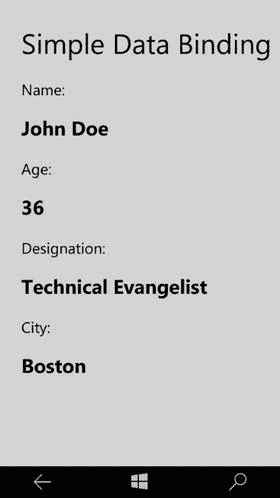

图 5-2。

Windows Mobile 输出快照。

如你所见，你将 `Person` 对象（定义在 `default.js` 中）的值绑定到了 HTML 元素。这是通过 `WinJS.Binding` 命名空间实现的。如果你还记得，我们在 `onactivated` 函数中调用了 `WinJS.Binding.processAll()` 方法。`processAll()` 方法会将对象的值绑定到具有 `data-win-bind` 属性的 DOM 元素的值。在示例代码中，你在输出姓名、年龄、职位和城市信息的 `div` 元素上设置了 `data-win-bind` 属性。

## 5.2 数据绑定 DOM 元素的样式属性

### 问题

HTML 元素可以通过 CSS 定义来设置样式。在运行时，样式属性需要绑定到底层业务对象的数据属性。

### 解决方案

除了提供对 DOM 元素属性的数据绑定之外，`WinJS` 数据绑定框架还提供了绑定 DOM 元素样式属性的选项。样式属性可以在 `data-win-bind` 属性中绑定到绑定对象的数据属性。

### 工作原理

打开 Visual Studio 2015。依次选择“文件”➤“新建项目”➤“JavaScript”➤“Windows”➤“通用”➤“空白应用（通用 Windows）”模板。这将创建一个通用 Windows 应用模板（见图 5-3）。

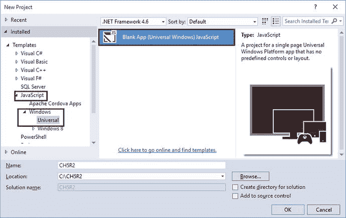

图 5-3。

“新建项目”对话框。打开 `js` 文件夹中的 `default.js`。在 `'use strict'` 指令之后，在立即执行函数内部添加以下代码：

```
(function () {
    "use strict";
    //创建 person 对象
    var person = {
        name: "John Doe",
        age: 36,
        designation: "Technical Evangelist",
        city: "Boston",
        favcolor: "orange"
    };
    //其他应用设置代码
})();
```

你为 `Person` 对象添加了一个 `favcolor` 属性。让我们将 `favcolor` 绑定到一个 `div` 元素的 `background-color` 样式属性。

打开项目根目录下的 `default.html`。将 `<body>` 内容替换为以下内容：

```
<h1>数据绑定属性</h1>
    <br />
    <div id="container">
        <h3>姓名：</h3>
        <h2><span data-win-bind="innerText: name"></span></h2>
        <h3>年龄：</h3>
        <h2><span data-win-bind="innerText: age"></span></h2>
        <h3>职位：</h3>
        <h2><span data-win-bind="innerText: designation"></span></h2>
        <h3>城市：</h3>
        <h2><span data-win-bind="innerText: city"></span> </h2>
        <h3>最喜欢的颜色：</h3>
        <div data-win-bind="style.background: favcolor" >
            <div class="favcolor" data-win-bind="innerText: favcolor"></div>
        </div>
    </div>
```

再次回到 `default.js` 文件。按如下方式修改 `onactivated` 方法：

```
app.onactivated = function (args) {
        if (args.detail.kind === activation.ActivationKind.launch) {
            if (args.detail.previousExecutionState !== activation.ApplicationExecutionState.terminated) {
                // TODO: 此应用程序已重新启动。请在此处初始化你的应用程序。
            } else {
                // TODO: 此应用程序已从挂起状态重新激活。请在此处恢复应用程序状态。
            }
            var container = document.querySelector("#container");
            var prmise = WinJS.UI.processAll().then(function () {
                WinJS.Binding.processAll(container, person)
            })
            args.setPromise(prmise);
        }
    };
```

你只需像往常一样在需要进行数据绑定的容器上调用 `WinJS.Binding.processAll()`。

接下来，在 Visual Studio 中按 `F5` 生成并运行该应用程序。Windows Mobile 屏幕上的输出如图 5-4 所示。

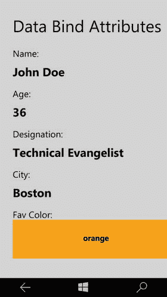

图 5-4。

Windows Mobile 输出快照。

## 5.3 使用模板进行数据绑定

### 问题

简单的数据绑定一次只能绑定一个数据项。当你有一个数据项列表时，简单的数据绑定方法就不够用了。


### 解决方案

使用简单数据绑定（Simple Data Binding），你可以将数据项绑定到 DOM 元素，该元素会显示数据属性的值。但若要处理项目列表，并允许用户切换查看不同的数据项，你需要使用模板。数据模板充当了蓝图，在运行时，它会绑定到提供的数据项，并在指定的 DOM 元素上渲染标记。

### 工作原理

打开 Visual Studio 2015。依次选择 “文件” ➤ “新建项目” ➤ “JavaScript” ➤ “Windows 通用” ➤ “空白应用（通用 Windows）” 模板。这将创建一个通用 Windows 应用模板（参见图 5-5）。

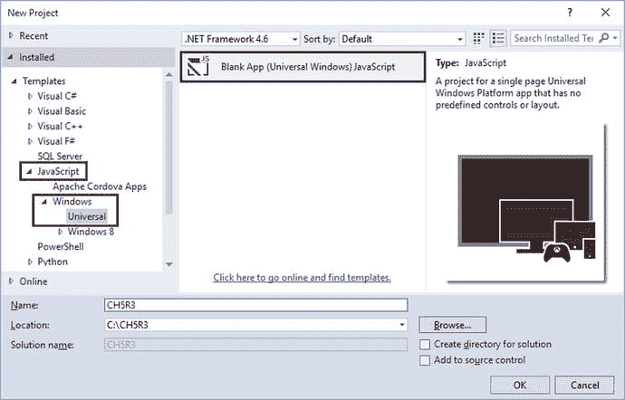

图 5-5.

“新建项目”对话框

打开 `js` 文件夹中的 `default.js`。在立即调用的函数内部，我们声明一个包含几个属性的 `Person` 对象。这次你将使用 `WinJS.Binding.define` 来声明 `Person` 对象。使用 `define` 会使所有属性变得可绑定。以下是 `Person` 对象的代码片段：

```
(function () {
    "use strict";
    var Person = WinJS.Binding.define({
        name: "",
        color: "",
        birthday: "",
        petname:"",
        dessert:""
    });
    //其他应用代码...
})();
```

打开项目根目录下的 `default.html`。将 `<body>` 标签中的内容替换为以下代码：

```
<h1>数据绑定模板</h1>
<div id="templateDiv" data-win-control="WinJS.Binding.Template">
    <div class="templateItem" data-win-bind="style.background: color" style="color:white">
        <ol>
            <li><span>姓名：</span><span data-win-bind="textContent: name"></span></li>
            <li><span>生日：</span><span data-win-bind="textContent: birthday"></span></li>
            <li><span>宠物名：</span><span data-win-bind="textContent: petname"></span></li>
            <li><span>甜点：</span><span data-win-bind="textContent: dessert"></span></li>
        </ol>
    </div>
</div>
<div id="renderDiv"></div>
```

你定义了一个 `id` 为 `templateDiv` 的 `div`，然后添加了一个值为 `WinJS.Binding.Template` 的 `data-win-control` 属性。这定义了可用于数据绑定的模板。接着，你有一个 `id` 为 `renderDiv` 的 `div`。在运行时，你将模板与数据进行数据绑定，并将输出渲染到 `renderDiv` DOM 元素。

为了本教程的需要，我们创建三个 `Person` 对象，并添加一个下拉列表，以便你可以选择需要显示详细信息的人员。在 `body` 标签中，紧跟在 `renderDiv` 元素之后，添加以下代码：

```
<fieldset id="templateControlObject">
    <legend>选择姓名：</legend>
    <select id="templateControlObjectSelector">
        <option value="0">显示 John Doe</option>
        <option value="1">显示 Jane Dow</option>
        <option value="2">显示 Jake Doe</option>
    </select>
</fieldset>
```

回到 `default.js` 文件，在 `Person` 对象定义之后，创建一个包含三个 `Person` 对象的数组，如下所示：

```
(function () {
    "use strict";
    var Person = WinJS.Binding.define({
        name: "",
        color: "",
        birthday: "",
        petname:"",
        dessert:""
    })
    var people = [
        new Person({ name: "John Doe", color: "red", birthday: "2/2/2002", petname: "Spot", dessert: "chocolate cake" }),
        new Person({ name: "Jane Doe", color: "green", birthday: "3/3/2003", petname: "Xena", dessert: "cherry pie" }),
        new Person({ name: "Jake Doe", color: "blue", birthday: "2/2/2002", petname: "Pablo", dessert: "ice cream" }),
    ];
    //其他应用代码...
})();
```

接下来，在 `default.js` 的 `onactivated` 方法中，为下拉列表的 `change` 事件添加一个监听器。以下是代码片段：

```
app.onactivated = function (args) {
    // 其他激活代码...
    var selector = document.querySelector("#templateControlObjectSelector");
          selector.addEventListener("change", handleChange, false);
    args.setPromise(WinJS.UI.processAll());
}
```

让我们为下拉列表的更改事件创建事件处理程序。选择包含模板的 `div` 以及你想要渲染标记的 `div`。在模板控件上调用 `render`。在 `default.js` 中创建一个 `handleChange` 函数，代码如下：

```
(function () {
    //其他应用代码...
    function handleChange(evt) {
        var templateElement = document.querySelector("#templateDiv");
        var renderElement = document.querySelector("#renderDiv");
        renderElement.innerHTML = "";
        var selected = evt.target.selectedIndex;
        var templateControl = templateElement.winControl;
        templateElement.winControl.render(people[selected], renderElement);
    }
})();
```

在 Visual Studio 中按 F5 生成并运行应用。当你在下拉列表中选择一个项目时，相应的数据会显示在其上方的 `div` 中。图 5-6 显示了 Windows Mobile 屏幕上的输出。

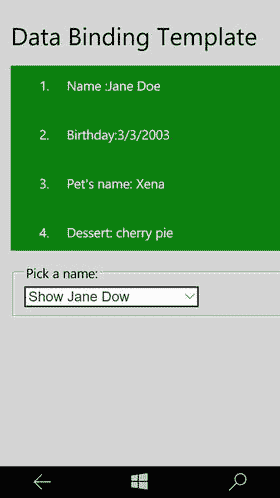

图 5-6.

Windows Mobile 屏幕上的数据绑定模板输出

## 5.4 数据绑定 WinJS 控件

### 问题

你有一个项目列表，并希望将该列表数据绑定到 WinJS 控件（例如 `ListView`）。

### 解决方案

使用 WinJS 数据绑定，你可以将任何 WinJS 控件绑定到数据源。对于显示每个单独的项目，你需要提供一个数据模板。在运行时，列表会与控件进行数据绑定，每个项目都会根据定义的模板进行渲染。


### 工作原理

打开 Visual Studio 2015。选择 **文件** ➤ **新建项目** ➤ **JavaScript** ➤ **Windows** ➤ **通用** ➤ **空白应用（通用 Windows）** 模板。这将创建一个通用 Windows 应用模板（见图 5-7）。

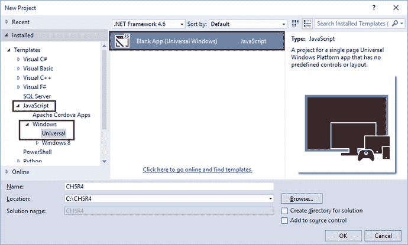

**图 5-7.** 新建项目对话框

让我们创建一个新的 JavaScript 文件，为`ListView`提供数据。右键点击`js`文件夹。选择 **添加** ➤ **新建项**。在“新建项”对话框中，选择 JavaScript 文件并将其命名为`data.js`。将以下代码添加到`data.js`文件中：

```
(function () {
    var flavors = [
        { title: "Basic banana", text: "Low-fat frozen yogurt" },
        { title: "Banana blast", text: "Ice cream" },
        { title: "Brilliant banana", text: "Frozen custard" },
        { title: "Orange surprise", text: "Sherbet" },
        { title: "Original orange", text: "Sherbet" },
        { title: "Vanilla", text: "Ice cream" },
        { title: "Very vanilla", text: "Frozen custard" },
        { title: "Marvelous mint", text: "Gelato" },
        { title: "Succulent strawberry", text: "Sorbet" }
    ];
    var flavorList = new WinJS.Binding.List(flavors);
    WinJS.Namespace.define("DataExample", {
        flavorList: flavorList
    });
})();
```

在项目根目录下的`default.html`中添加对`data.js`文件的引用：

```
<head>
    <!-- 其他文件引用... -->
    <!-- 你的数据文件。 -->
    <script src="/js/data.js"></script>
</head>
```

现在，在`default.html`中创建一个`ListView`，并将其绑定到你在`data.js`文件中创建的数据源。同时为列表视图项定义一个项模板。将以下代码添加到`default.html`中：

```
<h1>ListView 数据绑定</h1>
<div id="flavorItemTemplate" data-win-control="WinJS.Binding.Template">
    <div id="templateContainer">
        <div id="itemContainer">
            <h4 data-win-bind="innerText: title"></h4>
            <h6 data-win-bind="innerText: text"></h6>
        </div>
    </div>
</div>
<div id="basicListView" data-win-control="WinJS.UI.ListView"
     data-win-options="{itemDataSource : DataExample.flavorList.dataSource,
                        itemTemplate:select('#flavorItemTemplate'),
                        selectionMode: 'none',
                        layout:{type:WinJS.UI.ListLayout}}">
</div>
```

通过将`data-win-control`属性设置为`WinJS.UI.ListView`值来创建列表视图。使用`data-win-options`属性来设置控制选项，如项数据源、项模板和列表视图的布局。

接下来，你需要为列表视图和列表视图项添加一点样式。打开 Windows 和 Windows Mobile 项目中的`default.css`，并添加以下样式表定义：

```
#basicListView{
    height: 100%;
    margin-top: 10px;
    margin-right: 20px;
}
#templateContainer{
    display: -ms-grid;
    -ms-grid-columns: 1fr;
    min-height: 150px;
}
#itemContainer{
    background-color:lightgray;
    width:100%;
    padding:10px;
}
```

按`F5`在 Visual Studio 中生成并运行应用。图 5-8 显示了 Windows Mobile 屏幕上的输出。

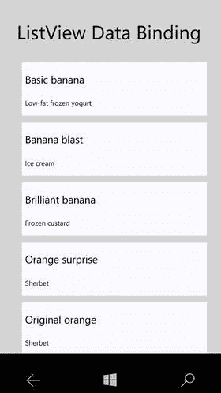

**图 5-8.** Windows Mobile 屏幕上的 ListView 数据绑定输出

## 5.5 UWP 应用中的导航结构

### 问题

你想将应用程序拆分为多个页面/屏幕以处理特定功能。你想了解应采用哪些导航结构，以在页面/屏幕间提供最佳体验。

### 解决方案

实际应用很少只有一个页面/屏幕，而是由许多页面/屏幕组成。每个页面/屏幕负责一项特定功能。将应用按功能划分并为每项功能分配专用页面/屏幕始终是更好的做法。UWP 应用中的导航基于导航结构、元素和系统级功能。通过在应用中提供正确的导航，你可以在页面之间或内容之间实现直观的用户体验。

应用中的每个页面将包含或满足特定的一组内容或功能。例如，一个联系人管理应用会有一个列出联系人的屏幕、一个创建联系人的屏幕、一个更新联系人的屏幕，以及一个删除联系人的屏幕。应用的导航结构由你如何组织应用的不同屏幕来定义。图 5-9 展示了 UWP 应用中可采用的不同导航结构。

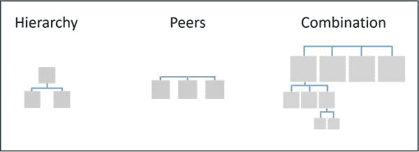

**图 5-9.** 导航结构

**层次结构**是一种树状结构。每个子页面只有一个父页面。要到达子页面，你需要经过父页面。

**同级结构**是一种页面并排存在的导航结构。你可以按任意顺序从一个页面导航到另一个页面。

**组合结构**同时使用层次结构和同级结构。页面组被组织为同级或层次结构。

## 5.6 UWP 应用中的导航元素

### 问题

你已经理解了导航结构。你想知道有哪些元素可用于实现应用的导航结构。

### 解决方案

用户可以通过许多导航元素找到他想看的内容。在某些情况下，导航元素会向用户指示内容在应用中的位置。导航元素可以用作内容元素或命令元素。因此，建议使用最适合你导航结构的导航元素。以下是 UWP 应用可用的部分导航元素：

*   **Pivot**：此控件用于显示指向同级页面的持久链接列表。当你采用同级导航结构时，可以使用此控件。
*   **SplitView**：此控件用于显示应用中顶级页面的链接列表。在需要同级导航结构的场景中可以使用此控件。
*   **Hub**：此控件用于显示子页面的预览/摘要。通过页面本身提供的链接或节标题导航到子页面。当你采用层次导航结构时，使用此控件。
*   **ListView**：此控件用于显示项目摘要的主列表。选择一个项目会在详细信息部分显示该项目的详细信息。这可用于你的层次导航结构场景。

## 5.7 UWP 应用中的 Pivot 导航

### 问题

在你的应用中，你已经确定导航结构是基于同级的。你想使用`Pivot`控件实现导航。

### 解决方案

当你需要频繁访问不同的内容类别时，可使用`Pivot`控件进行导航。`Pivot`由两个或多个内容窗格组成，每个窗格都有一个对应的类别标题。标题会持续显示在屏幕上，并且选择状态清晰可见，这使得用户易于知道他们选择了哪个类别。用户可以在标题上向左或向右滑动，从而导航到相邻的标题。他们也可以在内容上向左或向右滑动。


### 工作原理

打开 Visual Studio 2015。选择“文件” ➤ “新建项目” ➤ “JavaScript” ➤ “Windows” ➤ “通用” ➤ “空白应用（Windows 通用）”模板。这将创建一个通用 Windows 应用项目（见图 5-10）。

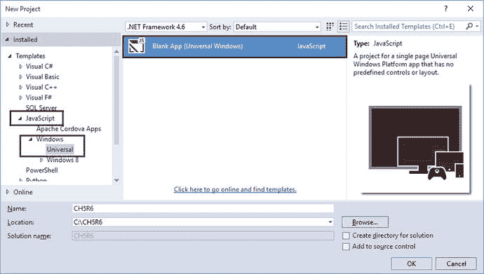

图 5-10. 新建项目对话框

打开项目根目录下的 `default.html`。将 `body` 的内容替换为以下内容：

```
<div data-win-control="WinJS.UI.Pivot" data-win-options="{ title: 'PIVOT Navigation', selectedIndex: 0 }">
    <div data-win-control="WinJS.UI.PivotItem" data-win-options="{ 'header': 'one'}">
        <p> Content - Item One </p>
    </div>
    <div data-win-control="WinJS.UI.PivotItem" data-win-options="{ 'header': 'two'}">
        <p> Content - Item Two </p>
    </div>
    <div data-win-control="WinJS.UI.PivotItem" data-win-options="{ 'header': 'three'}">
        <p> Content - Item Three </p>
    </div>
</div>
```

您放置了一个 `div` 并将其 `data-win-control` 属性设置为 `WinJS.UI.Pivot`。这将把该 `div` 转换为一个枢轴控件。然后，您使用 `data-win-options` 属性向该枢轴控件传递选项。您正在设置枢轴的标题以及将选中的项目。枢轴控件的项目以 `div` 形式放置，其 `data-win-control` 属性设置为 `WinJS.UI.PivotItem`。每个枢轴项目都有一个标头。使用 `data-win-options` 属性设置标头值。您可以根据应用的需要放置任意数量的项目。

接下来，按 F5 运行应用。图 5-11 是 Windows Mobile 输出的截图。

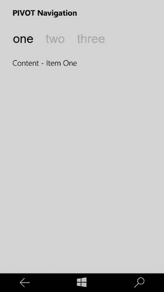

图 5-11. Windows Mobile 输出

如您所见，这里有三个枢轴项目。您可以点击枢轴项目的标头，或从左向右滑动，以导航到相邻的内容/项目。

## 5.8 UWP 应用中的 SplitView 导航

### 问题

在您的应用中，您已确定导航结构是基于对等项的。您希望提供一个包含顶层页面链接的菜单。您希望使用 SplitView 控件实现导航。

### 解决方案

SplitView 控件包含一个窗格和一个内容区域。窗格可以展开或折叠，而内容区域始终可见。窗格也可以保持打开状态，并且可以灵活地从应用的左侧或右侧显示。通常，导航链接放置在该窗格中。

### 工作原理

打开 Visual Studio 2015。选择“文件” ➤ “新建项目” ➤ “JavaScript” ➤ “Windows” ➤ “通用” ➤ “空白应用（Windows 通用）”模板。这将创建一个通用 Windows 应用项目（见图 5-12）。

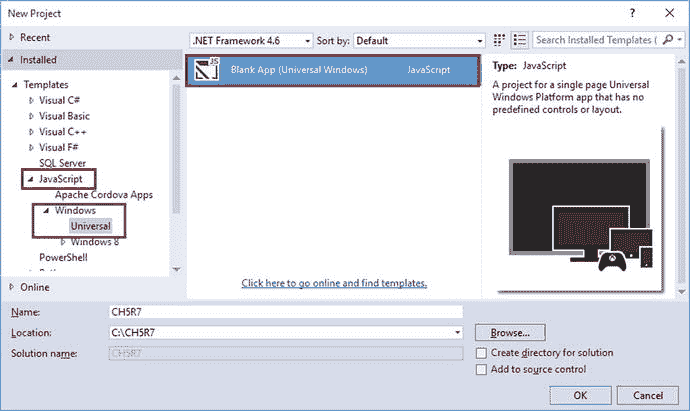

图 5-12. 新建项目对话框

打开项目根目录下的 `default.html`。将 `body` 的内容替换为以下代码片段：

```
<div id="app">
    <div class="splitView"
         data-win-control="WinJS.UI.SplitView"
         data-win-options="{closedDisplayMode:'none',
         openedDisplayMode:'overlay'}">
        <!-- 窗格区域 -->
        <div>
            <div class="header">
                <button class="win-splitviewpanetoggle"
                        data-win-control="WinJS.UI.SplitViewPaneToggle"
                        data-win-options="{ splitView: select('.splitView') }"></button>
                <div class="title">菜单</div>
            </div>
            <div id='navBar' class="nav-commands">
                <div data-win-control="WinJS.UI.NavBarCommand"
                     data-win-options="{ onclick:SplitViewHelper.homeClick,
                                         label: '主页',
                                         icon: 'home'}"></div>
                <div data-win-control="WinJS.UI.NavBarCommand"
                     data-win-options="{ onclick:SplitViewHelper.favClick,
                                         label: '收藏夹',
                                         icon: 'favorite'}"></div>
                <div data-win-control="WinJS.UI.NavBarCommand"
                     data-win-options="{ onclick:SplitViewHelper.settingsClick,
                                         label: '设置',
                                         icon: 'settings'}"></div>
            </div>
        </div>
        <!-- 内容区域 -->
        <button class="win-splitviewpanetoggle"
                data-win-control="WinJS.UI.SplitViewPaneToggle"
                data-win-options="{ splitView: select('.splitView') }"></button>
        <div class="contenttext"><h2>页面内容 </h2> </div>
    </div>
</div>
```

为了使用 SplitView，您需要放置一个 `div` 并将其 `data-win-control` 属性设置为 `SplitView`。然后，您需要创建两个 `div`。第一个 `div` 将用于导航窗格，第二个 `div` 将用作内容区域。您使用 `WinJS.UI.NavBarCommand` 来放置指向不同页面的链接。您正在侦听导航栏项目的点击事件，点击时将根据被点击的导航链接显示相应的内容。内容页面只是一个 `div`，在运行时，根据点击的导航链接，您将相应地更新内容。

接下来，打开 `js` 文件夹中的 `default.js`。将 `app.activated` 处理程序替换为以下代码片段：

```
app.onactivated = function (args) {
    if (args.detail.kind === activation.ActivationKind.launch) {
        if (args.detail.previousExecutionState !== activation.ApplicationExecutionState.terminated) {
        } else {
        }
        args.setPromise(
            WinJS.UI.processAll().done(function () {
                SplitViewHelper.splitView = document.querySelector(".splitView").winControl;
                new WinJS.UI._WinKeyboard(SplitViewHelper.splitView.paneElement); // 临时解决方法：在 NavBarCommands 上绘制键盘焦点视觉
            })
        );
    }
};
```

接下来，在 IIFE（立即调用函数表达式）声明之后，放置以下代码片段。您正在创建一个小的辅助类来处理导航点击事件。

```
(function () {
    "use strict";
    // 为简洁起见，省略了其他与应用相关的代码
})();

WinJS.Namespace.define("SplitViewHelper", {
    splitView: null,
    homeClick: WinJS.UI.eventHandler(function (ev) {
        document.querySelector('.contenttext').innerHTML = "<h2>SplitView 内容区域</h2>";
    }),
    favClick: WinJS.UI.eventHandler(function (ev) {
        document.querySelector('.contenttext').innerHTML = "<h2>收藏夹！</h2>";
    }),
    settingsClick: WinJS.UI.eventHandler(function (ev) {
        document.querySelector('.contenttext').innerHTML = "<h2>设置！</h2>";
    }),
});
```

在本示例中，您正在替换内容 `div` 的内部 HTML。如果您想完全加载一个新页面，可以通过使用 `WinJS.UI.Pages.render('<URI>',<内容宿主元素>);` 来实现。

现在，按 F5 运行应用。图 5-13 和图 5-14 显示了 Windows Mobile 上的输出。

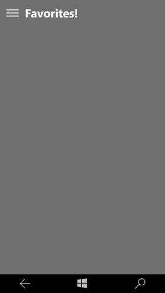

图 5-14. 内容区域

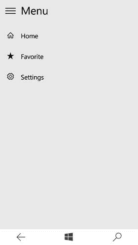

图 5-13. 导航窗格


## 5.9 UWP 应用中的 Hub 导航

### 问题

你已确定通用 Windows 平台（UWP）应用的导航结构本质上是层次化的。你希望在应用中使用 `Hub` 作为导航元素。

### 解决方案

`Hub` 控件适用于这样的导航场景：应用的内容可以被划分为不同细节层次、彼此关联但又各具特色的部分或类别。这种模式常用于需要按优先顺序遍历的关系型信息等场景。层次化导航模式适合那些提供多样化体验和内容，且本身具有组织性和结构性的应用。

### 工作原理

打开 Visual Studio 2015。选择 **文件** ➤ **新建项目** ➤ **JavaScript** ➤ **Windows** ➤ **通用** ➤ **空白应用（Windows 通用）** 模板。这将创建一个通用 Windows 应用项目（见图 5-15）。

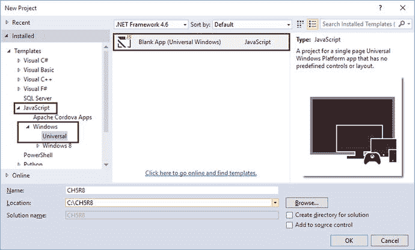

图 5-15. 新建项目对话框

打开项目根目录下的 `default.html` 文件。将 `<body>` 标签后的内容替换为以下代码片段：

```html
<div data-win-control="WinJS.UI.Hub">
    <div class="section1" data-win-control="WinJS.UI.HubSection"
         data-win-options="{header: 'Images', isHeaderStatic: true}">
        <div class="imagesFlexBox">
            
            
            
            
            
            
            
            
            
        </div>
    </div>
    <div id="list" class="section2" data-win-control="WinJS.UI.HubSection"
         data-win-options="{header: 'ListView', isHeaderStatic: true}">
        <div id="listView"
             class="win-selectionstylefilled"
             data-win-control="WinJS.UI.ListView"
             data-win-options="{
                itemDataSource: HubExample.data.dataSource,
                itemTemplate: smallListIconTextTemplate,
                selectionMode: 'none',
                tapBehavior: 'none',
                swipeBehavior: 'none'
            }">
        </div>
    </div>
</div>
<div id="smallListIconTextTemplate" data-win-control="WinJS.Binding.Template">
    <div class="smallListIconTextItem">
        
        <div class="smallListIconTextItem-Detail">
            <h4 data-win-bind="innerText: title"></h4>
            <h6 data-win-bind="innerText: text"></h6>
        </div>
    </div>
</div>
```

要创建 `Hub` 控件，需要在 `div` 上设置 `data-win-control` 属性，其值为 `WinJS.UI.Hub`。要在 `Hub` 内部创建分区，需要创建一个 `div`，并将其 `data-win-control` 属性设置为 `WinJS.UI.HubSection`。使用 `data-win-options` 属性来设置分区的标题，并在该属性内设置 `header` 属性。

上述代码中的第 2 个分区使用了 `ListView`。因此，我们来为列表视图创建一个数据源。打开 `js` 文件夹中的 `default.js` 文件。在立即执行函数表达式内部，`'use strict'` 语句之后，复制并粘贴以下代码片段：

```javascript
var myData = new WinJS.Binding.List([
    { title: "消防栓", text: "红色", picture: "/images/circle_list1.jpg" },
    { title: "消防栓", text: "黄色", picture: "/images/circle_list2.jpg" },
    { title: "井盖", text: "灰色", picture: "/images/circle_list3.jpg" },
    { title: "洒水器", text: "黄色", picture: "/images/circle_list4.jpg" },
    { title: "充电器", text: "黄色", picture: "/images/circle_list5.jpg" },
    { title: "旋钮", text: "红色", picture: "/images/circle_list6.jpg" },
    { title: "消防栓", text: "红色", picture: "/images/circle_list1.jpg" },
    { title: "消防栓", text: "黄色", picture: "/images/circle_list2.jpg" },
    { title: "井盖", text: "灰色", picture: "/images/circle_list3.jpg" },
    { title: "消防栓", text: "红色", picture: "/images/circle_list1.jpg" },
    { title: "消防栓", text: "黄色", picture: "/images/circle_list2.jpg" },
    { title: "井盖", text: "灰色", picture: "/images/circle_list3.jpg" }
]);
WinJS.Namespace.define("HubExample", {
    data: myData
});
```

要运行该应用，请在 Visual Studio 中按 F5 键。图 5-16 展示了在 Windows 移动设备上的输出效果。

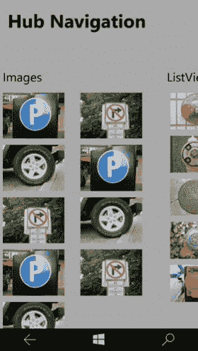

图 5-16. Hub 导航输出

## 5.10 在 UWP 应用中使用 ListView 进行主/从导航

### 问题

你已确定通用 Windows 平台（UWP）应用的导航结构本质上是层次化的。你希望使用主/从（Master/Detail）导航模式，并已确定 `ListView` 作为导航元素。

### 解决方案

`ListView` 是一个将数据项列表以垂直堆叠方式展示的控件。你可以将数据源绑定到列表视图，并提供一个模板来渲染每个数据项。

### 工作原理

打开 Visual Studio 2015。选择 **文件** ➤ **新建项目** ➤ **JavaScript** ➤ **Windows** ➤ **通用** ➤ **空白应用（Windows 通用）** 模板。这将创建一个通用 Windows 应用项目（见图 5-17）。

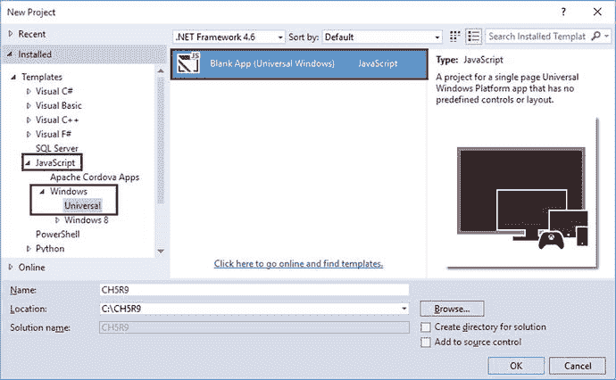

图 5-17.


打开“新建项目”对话框，打开位于项目根目录的`default.html`。将`body`的内容替换为以下代码片段：

```html
<h1>ListView Navigation</h1>
<div id="contentHost"></div>
```

现在你有了一个`div`，其`id`为`contentHost`。将其用作占位符，以便在运行时显示不同的页面；也就是说，将主页面和详细信息页面渲染到这个`contentHost`的`div`元素中。

接下来，打开位于`js`文件夹中的`default.js`。在`app.onactivated`函数定义之前，添加以下代码片段：

```javascript
WinJS.Navigation.addEventListener("navigating", function (args) {
    var url = args.detail.location;
    var host = document.getElementById("contentHost");
    host.winControl && host.winControl.unload && host.winControl.unload();
    WinJS.Utilities.empty(host);
    args.detail.setPromise(WinJS.UI.Pages.render(url, host, args.detail.state));
});
```

通过这段代码，你监听了页面上即将发生的导航事件，并为其提供了事件处理程序。在事件处理程序中，你拦截了导航调用，获取了目标页面的 URL，获取了内容宿主元素，并在该内容宿主元素内渲染了目标页面。

接下来，按如下方式修改`app.onactivated`方法：

```javascript
app.onactivated = function (args) {
    if (args.detail.kind === activation.ActivationKind.launch) {
        if (args.detail.previousExecutionState !==
            activation.ApplicationExecutionState.terminated) {
        } else {
        }
        args.setPromise( WinJS.UI.processAll().then(function () {
            return WinJS.Navigation.navigate("/master.html");
        })
       );
    }
};
```

在激活事件处理程序中，唯一做的事情就是导航到一个名为`master.html`的页面（你将在下一步创建此页面）。因此，当应用加载时，包含`ListView`控件的`master.html`将渲染在内容宿主中。

向项目中添加一个新的 HTML 文件，并将其命名为`master.html`。将`master.html`的内容替换为以下代码片段：

```html
<!DOCTYPE html>
<html>
<head>
    <title></title>
    <link href="/css/default.css" rel="stylesheet" />
    <!-- WinJS references -->
    <link href="WinJS/css/ui-dark.css" rel="stylesheet" />
    <script src="WinJS/js/base.js"></script>
    <script src="WinJS/js/ui.js"></script>
    <script src="js/data.js"></script>
    <script src="js/master.js"></script>
</head>
<body >
    <div class="smallListIconTextTemplate"
         data-win-control="WinJS.Binding.Template"
         style="display: none">
        <div class="smallListIconTextItem">
            
            <div class="smallListIconTextItem-Detail">
                <h4 class="win-h4" data-win-bind="textContent: title"></h4>
                <h6 class="win-h6" data-win-bind="textContent: text"></h6>
            </div>
        </div>
    </div>
    <div class="listView win-selectionstylefilled"
         data-win-control="WinJS.UI.ListView"
         data-win-options="{
                    itemDataSource: ListViewExample.data.dataSource,
                    itemTemplate: select('.smallListIconTextTemplate'),
                    tapBehavior: WinJS.UI.TapBehavior.directSelect,
                    layout: { type: WinJS.UI.ListLayout }
            }">
    </div>
</body>
</html>
```

在`master.html`中，你放置了一个列表视图，为其提供了数据源，并提供了渲染每个项目的项模板。该模板会显示数据项中的图片、标题和文本，这些数据将在运行时绑定。

接下来，在`js`文件夹中创建一个新的 JavaScript 文件，并将其命名为`master.js`。将以下代码片段添加到该 JavaScript 文件中：

```javascript
(function () {
    'use strict';
    WinJS.UI.Pages.define("/master.html", {
        ready: function (element, options) {
            var that = this;
            element.addEventListener("iteminvoked", function (evt) {
                evt.detail.itemPromise.then(function (item) {
                    WinJS.Application.sessionState.selectedItem = item.data;
                    WinJS.Navigation.navigate("/detail.html");
                });
            });
        }
    })
})();
```

让我们花点时间来解读这段代码。通过这个新的 JavaScript 文件，你为`master.html`创建了一个逻辑文件。使用`WinJS.UI.Pages.define()`方法定义了页面成员。你提供了一个`ready`方法，该方法会在页面加载时被调用。同时，你为`ListView`的项点击事件添加了监听器。当项被点击时，会将选中的项存储在应用程序会话状态中，然后导航到`detail.html`。

接下来，在`js`文件夹中创建一个名为`data.js`的新 JavaScript 文件。该文件为`master.html`中的`ListView`提供数据源。将以下代码片段粘贴到`data.js`中：

```javascript
var myData = new WinJS.Binding.List([
    { title: "Lemon", text: "Sorbet", picture: "/images/60Lemon.png" },
    { title: "Mint", text: "Gelato", picture: "/images/60Mint.png" },
    { title: "Orange", text: "Sorbet", picture: "/images/60Orange.png" },
]);
WinJS.Namespace.define("ListViewExample", {
        data : myData
});
```

现在我们来创建详细信息页面。在项目根目录下添加一个新的 HTML 文件，并将其命名为`detail.html`。将以下代码片段粘贴到新创建的文件中：

```html
<!DOCTYPE html>
<html>
<head>
    <title></title>
    <link href="/css/default.css" rel="stylesheet" />
    <!-- WinJS references -->
    <link href="WinJS/css/ui-dark.css" rel="stylesheet" />
    <script src="WinJS/js/base.js"></script>
    <script src="WinJS/js/ui.js"></script>
    <script src="/js/detail.js"></script>
</head>
<body>
    <div>
        <button data-win-control="WinJS.UI.BackButton"></button>
        <h3>Item Details </h3>
        <h2><span data-win-bind="innerText: title"></span></h2>
        
        <h2><span data-win-bind="innerText: text"></span></h2>
    </div>
</body>
</html>
```

在此页面中，只需输出列表视图中选中项的详细信息。请注意，你使用了数据绑定表达式来显示数据项的标题、文本和图片。

现在，你需要为`detail.html`创建逻辑文件。在`js`文件夹中添加一个名为`detail.js`的新 JavaScript 文件。将以下代码片段粘贴到新创建的文件中：

```javascript
(function () {
    'use strict';
    WinJS.UI.Pages.define("/detail.html", {
        processed: function (element, options) {
            var that = this;
            WinJS.Binding.processAll(element, WinJS.Application.sessionState.selectedItem);
        }
    })
})();
```

当页面加载时，只需对页面调用`Binding.processAll()`，并将选中的项作为需要绑定到元素的数项。

主/详细信息导航所需的所有代码已经完成。现在按 F5 运行应用。图 5-18 和图 5-19 展示了 Windows Mobile 设备上的输出。

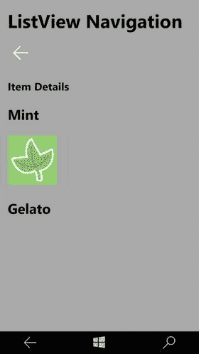

图 5-19. 详细信息屏幕

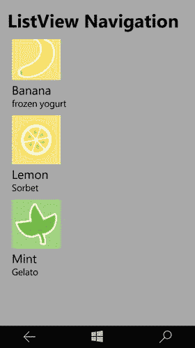

图 5-18. 主屏幕


