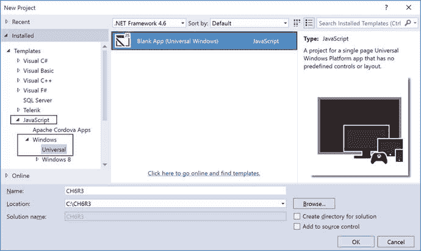
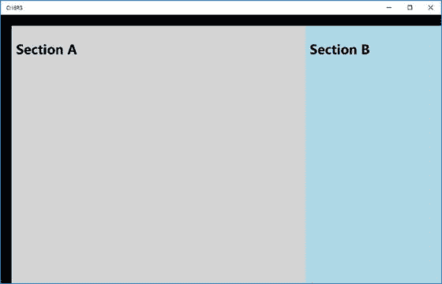
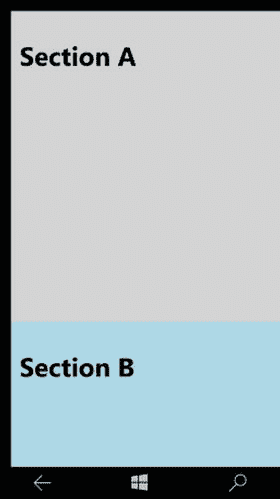
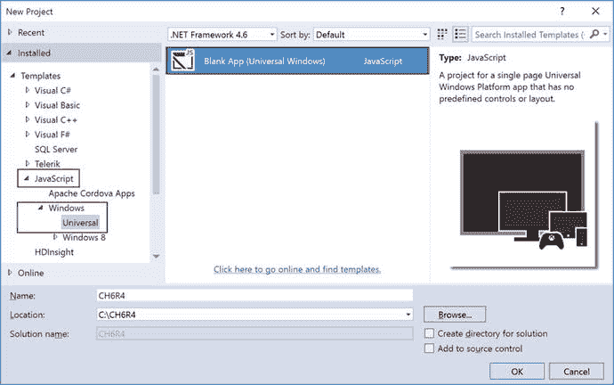
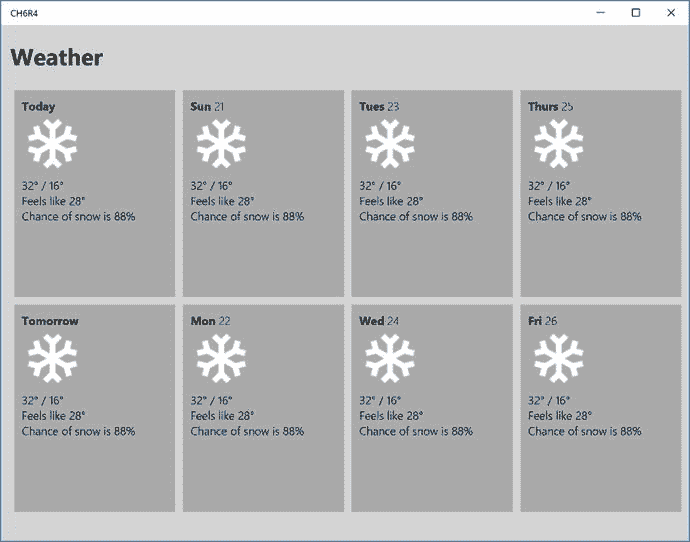
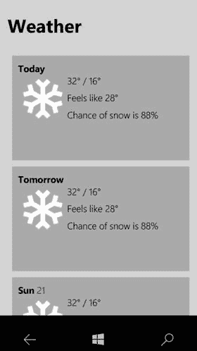

# 第 6 章：针对不同屏幕适配 UI

借助通用 Windows 平台（`UWP`），你的应用可以在 Windows 系列的任何设备上运行。该设备系列包括手机、平板电脑、笔记本电脑、Xbox 等。设备系列中存在不同的屏幕尺寸。该平台会在幕后施展魔法，确保你的应用用户界面在所有设备上都能正常使用。既然平台已经为你处理了底层细节，你无需对应用进行任何自定义设置就能支持不同的屏幕尺寸。但有时你可能希望为特定屏幕尺寸提供特定的 UI。例如，当你的应用在手机上运行时，你可能希望采用单列布局；而同样的应用在平板电脑或 PC 上运行时，你则希望采用双列布局。本章将探讨如何根据不同的屏幕尺寸适配 UI。

如果 `UWP` 应用可以在任何 Windows 10 设备系列的任何屏幕尺寸上运行，那么作为应用开发者，你为什么还需要为特定屏幕尺寸定制 UI 呢？

如前所述，平台负责确保你的应用 UI 在所有屏幕尺寸上都能正常使用，但你可能仍然会遇到需要根据应用运行的屏幕进行自定义的情况。以下几点值得注意，它们解释了为什么你需要进行自定义。

*   **有效利用可用空间并减少导航。** 当应用的 UI 针对小屏幕设计时，该应用在 PC 上也能使用，但可能会浪费一些空间。更好的设计是，当屏幕尺寸超过某个大小时显示更多内容。在较大的屏幕上显示更多内容可以减少用户进行的导航操作量。
*   **设备能力。** 不同设备具有不同的能力。通过为特定设备定制应用，你可以更好地利用该特定设备的可用能力，并据此启用或禁用相关功能。
*   **输入优化。** `UWP` 中的控件库能很好地支持所有输入类型，包括触摸、笔、键盘和鼠标。但你可以针对特定设备优化输入方式。例如，手机应用通常将导航放在屏幕底部；而 PC 用户则期望导航位于屏幕顶部。

## 6.1 不同屏幕的设计断点

### 问题

由于你需要在 Windows 10 设备系列下支持各种屏幕尺寸，你希望了解在应用中应针对哪些具体宽度进行设计。

### 解决方案

`断点` 是 `CSS`（层叠样式表）中使用的术语，用于表示屏幕的大小或宽度，并据此编写样式规则。Windows 10 设备系列中有大量的设备类型和屏幕尺寸。但你无需针对每种设备类型或屏幕尺寸优化 UI。相反，你应该针对关键的屏幕宽度进行设计。这些关键的屏幕宽度也称为断点。让我们看看你需要关注哪些断点。

*   **小屏幕：** `320epx`。这些设备类型/屏幕的有效像素宽度为 `320`。典型屏幕尺寸为 4 到 6 英寸。通常，这些设备是手机。
*   **中屏幕：** `720epx`。这些设备类型/屏幕的有效像素宽度为 `720`。典型屏幕尺寸为 6 到 12 英寸。通常，这些设备是平板电脑和大屏手机。
*   **大屏幕：** `1024epx`。这些设备类型/屏幕的有效像素宽度为 `1024` 或更高。典型屏幕尺寸为 13 英寸及以上。通常，这些设备是 PC、笔记本电脑、Surface Hub 等。

## 6.2 自适应 UI 技术：重新定位

### 问题

你希望你的应用支持所有设备类型/屏幕尺寸。你希望使 UI 具有自适应性，并根据应用运行的屏幕尺寸重新定位屏幕的某些部分。

### 解决方案

让你的应用用户界面适应不同屏幕尺寸的技术之一涉及 `CSS` 媒体查询，但这超出了本书的范围，因此你不会深入探讨它。但你可以在 W3C School 网站上（[`http://www.w3schools.com/cssref/css3_pr_mediaquery.asp`](http://www.w3schools.com/cssref/css3_pr_mediaquery.asp)）阅读并了解更多关于媒体查询的内容。你将编写一条媒体查询规则来针对特定屏幕尺寸。该规则将包含根据应用运行的屏幕重新定位 UI 元素的样式定义。


### 工作原理

打开 `Visual Studio 2015`。选择 **文件** ➤ **新建项目** ➤ **JavaScript** ➤ **Windows** ➤ **通用** ➤ **空白应用（通用 Windows）** 模板。这将创建一个通用 Windows 应用模板（见图 6-1）。



**图 6-1.** 新建项目对话框

打开位于项目根目录下的 `default.html`。在 `<body>` 标签之后，添加以下内容：

```html
<div class="appGrid">
    <div class="sectionA">
        <h1>A</h1>
    </div>
    <div class="sectionB">
        <h1>B</h1>
    </div>
</div>
```

你已经创建了一组 `div`。外层的 `div`（`appGrid`）充当容器。接下来，你创建了两个作为应用一部分显示的区块。在小屏幕上，你希望 `sectionA` 和 `sectionB` 上下堆叠显示。在中屏和大屏上运行时，将 `sectionA` 和 `sectionB` 并排放置。

接下来，为应用创建必要的样式。打开位于 `css` 文件夹中的 `default.css`。将 `default.css` 的内容替换为以下样式规则：

```css
.appGrid {
    display: -ms-grid;
    -ms-grid-columns: 2fr 1fr;
    grid-columns: 2fr 1fr;
    -ms-grid-rows: 1fr;
    grid-rows: 1fr;
    width: 100%;
    height: 100%;
    margin:24px;
}

.sectionA {
    -ms-grid-row: 1;
    -ms-grid-column: 1;
    background-color: lightgray;
    width: 100%;
    height: 100%;
    padding: 10px;
    color: black;
}

.sectionB {
    -ms-grid-row: 1;
    -ms-grid-column: 2;
    background-color: lightblue;
    width: 100%;
    height: 100%;
    padding: 10px;
    color: black;
}
```

我们来过一遍这段代码。你刚刚定义了三条规则。其中一条规则用于外层网格。你使用了基于网格的显示方式，包含两列和一行。`Section A` 放在第 1 列，`Section B` 放在第 2 列。由于尚未应用媒体查询，这些规则将始终生效。

现在，你定义一个媒体查询，用于在屏幕最大宽度为 320 时处理 UI。当应用在小屏幕上运行时，你希望布局变窄——仅有一列和两行。`Section A` 放在第 1 行，`Section B` 放在第 2 行。将 CSS 规则放在同一个 CSS 文件（`default.css`）中。以下是该媒体查询的代码片段：

```css
@media (max-width:320px){
    .appGrid {
        display: -ms-grid;
        -ms-grid-columns: 1fr;
        grid-columns: 1fr;
        -ms-grid-rows: 2fr 1fr;
        grid-rows: 2fr 1fr;
        width: 100%;
        height: 100%;
        margin:12px;
    }
    .sectionA {
        -ms-grid-row: 1;
        -ms-grid-column: 1;
        background-color: lightgray;
        width: 100%;
        height: 100%;
    }
    .sectionB {
        -ms-grid-row: 2;
        -ms-grid-column: 1;
        background-color: lightblue;
        width: 100%;
        height: 100%;
    }
}
```

这表明当屏幕尺寸为 320px 或更小时，会应用新的样式规则。作为该样式规则的一部分，应用网格变为一列两行。这重新定位了 `Section A` 和 `Section B` 的位置。

接下来，按 `F5` 运行应用。你可以在 Windows 10 Mobile 模拟器上运行应用，也可以在本地计算机上运行。图 6-2 和图 6-3 显示了在手机和 PC 上的输出结果。



**图 6-3.** Windows PC 上的输出



**图 6-2.** Windows Mobile 上的输出

## 6.3 自适应 UI 技术：流体布局

### 问题

你创建了一个布局，希望在其中显示列表视图中的项目数量。但你希望列表视图能够适应窄屏以及中屏或大屏。你希望列表视图项根据屏幕大小进行响应。

### 解决方案

UWP 中的 `ListView` 控件用于需要显示大量项目的场景。顾名思义，列表视图在屏幕上渲染一个列表，每个项绑定到一个数据项。可以通过提供模板来自定义列表视图的每个项。`ListView` 还有一个称为 `Layout` 的概念。`Layout` 定义了项目在屏幕上的分布方式。它内置支持两种布局：`ListLayout` 和 `GridLayout`。`ListLayout` 用于单列/多行渲染。`GridLayout` 渲染基于网格的布局（即行和列占据屏幕上的可用空间）。

### 工作原理

打开 `Visual Studio 2015`。选择 **文件** ➤ **新建项目** ➤ **JavaScript** ➤ **Windows 通用** ➤ **空白应用（通用 Windows）** 模板。这将创建一个通用 Windows 应用模板（见图 6-4）。



**图 6-4.**


### 新建项目对话框

在`js`文件夹中创建一个名为`weatherData.js`的新文件，并添加一个立即调用的函数表达式（IIFE）。以下是代码片段：

```javascript
(function (undefined) {
    'use strict';
    // 其余代码写在这里
})();
```

接下来，在函数体中`'use strict'`语句之后，创建一个天气数据数组，如下所示。为了本示例演示，我们构建虚构的天气数据。以下是代码片段：

```javascript
var weatherData = [
    {
        date: formatDateString(new Date().getDate()),
        imgSrc: "images/tile-snow.png",
        hi: "32°",
        low: "16°",
        temp: "24°",
        feelsLike: "28°",
        chanceOfSnow: "88%"
    }
    // 在此添加更多项目
];
```

接下来，创建一个格式化日期的函数。您希望以“Sun 10”的模式显示日期。您需要自定义日期字符串以便显示。以下是`formatDateString`函数的代码片段：

```javascript
function formatDateString(date) {
    var daysOfWeek = ["Sun","Mon","Tues","Wed","Thurs","Fri","Sat"];
    var nearDays = ["Yesterday","Today","Tomorrow"];
    var dayDelta = date - new Date().getDate() + 1;
    var dateString = "";
    if (dayDelta < 3) {
        dateString = nearDays[dayDelta];
    }
    else {
        dateString = daysOfWeek[date % 7] +
        " <span class='day'>" + date + "</span>";
    }
    return dateString;
};
```

您需要暴露这个`weatherData`数组，以便在`default.html`中使用它并将其绑定到列表视图。创建一个命名空间并暴露`weatherData`，如下所示：

```javascript
var weatherDataList = new WinJS.Binding.List(weatherData);
WinJS.Namespace.define("FluidApp.Data", {
    weatherData : weatherDataList
})
```

您已经创建了一个名为`FluidApp.Data`的命名空间，并将`weatherData`作为公共属性暴露出来，该属性可以绑定到任何`win`控件上。

您需要添加对`weatherData.js`的引用。在`default.html`的`head`部分中添加以下脚本标签。在`default.js`脚本文件引用之前添加此引用：

```html
<script src="/js/weatherData.js"></script>
```

接下来，您需要创建用户界面。在`default.html`中，移除`<body>`标签内的默认内容。添加以下用于显示列表视图中每个项目的模板：

```html
<div id="weatherTemplate" class="dayTemplate" data-win-
control="WinJS.Binding.Template">
<div class="dayGrid">
    <div class="win-type-x-large dayDate"
                data-win-bind="innerHTML: date">
    </div>
    <div class="dayImg">
        
    </div>
    <div class="win-type-x-large dayHighLow">
        <span class="dayHigh" data-win-bind="innerHTML: hi"></span>
        <span>/</span>
        <span class="dayLow" data-win-bind="innerHTML: low"></span>
    </div>
    <div class="dayFeelsLike">
        <span>体感温度 </span>
        <span data-win-bind="innerHTML: feelsLike"></span>
    </div>
    <div class="dayChanceOfSnow">
        <span>降雪概率 </span>
        <span data-win-bind="innerHTML: chanceOfSnow"></span>
    </div>
</div>
</div>
```

接下来，让我们添加`ListView`控件。将以下代码片段粘贴到上一步创建的模板之后：

```html
<div id="weatherListView" class="weatherListView"
    data-win-control="WinJS.UI.ListView"
    data-win-options="{
      itemDataSource:FluidApp.Data.weatherData.dataSource,
      itemTemplate:select('#weatherTemplate'),
      layout:WinJS.UI.GridLayout}"></div>
```

您已经创建了一个列表视图，并提供了`weatherData`作为项目数据源。您还提供了项目模板。您已将列表视图的布局默认设置为`GridLayout`。您将根据屏幕尺寸调整来更改列表视图的此布局属性。

打开位于`js`文件夹中的`default.js`。使用以下代码片段修改`app.onactivated`函数：

```javascript
app.onactivated = function (args) {
    if (args.detail.kind === activation.ActivationKind.launch) {
        if (args.detail.previousExecutionState !== activation.ApplicationExecutionState.terminated) {
        } else {
        }
        args.setPromise(WinJS.UI.processAll().then(function ready() {
            var listView = document.querySelector("#weatherListView");
            var listViewLayout = new WinJS.UI.GridLayout();
            if (document.body.clientWidth <= 320) {
                listViewLayout = new WinJS.UI.ListLayout();
            }
            listView.layout = listViewLayout;
            window.addEventListener("resize", resizeListView, false)
        }));
    }
};
```

让我们来解读一下这段代码。一旦 UI 处理完成，首先获取列表视图。然后检查当前运行屏幕的宽度。如果宽度小于或等于 320（即您处于小屏幕上），则相应地更改列表视图的布局。如果处于小屏幕，则使用`ListLayout`；否则，将其设置为`GridLayout`。您还注册了一个事件监听器来监听窗口的调整大小事件。接下来，让我们看看调整大小事件处理程序的作用。

在`app.onactivated`函数之后，创建一个新函数`resizeListView`，并粘贴以下代码片段：

```javascript
function resizeListView() {
    var listview = document.querySelector("#weatherListView").winControl;
    if (document.body.clientWidth <= 320) {
        if (!(listview.layout instanceof WinJS.UI.ListLayout)) {
            listview.layout = new WinJS.UI.ListLayout();
        }
    }
    else {
        if (listview.layout instanceof WinJS.UI.ListLayout) {
            listview.layout = new WinJS.UI.GridLayout();
        }
    }
}
```

现在，在移动设备或 PC 上运行应用程序以查看输出。按`F5`运行应用程序。图 6-5 所示的屏幕截图是在 Windows 10 移动版上，而图 6-6 所示的屏幕截图是在 Windows 10 PC 上。



图 6-6. 在 Windows PC 上的输出



图 6-5. 在 Windows 10 移动版上的输出

您刚刚实现的是针对不同屏幕尺寸量身定制的 UI。您使用了`ListView`布局技术，根据屏幕尺寸显示网格或列表布局。

---

