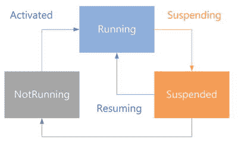
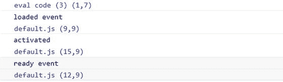
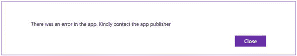
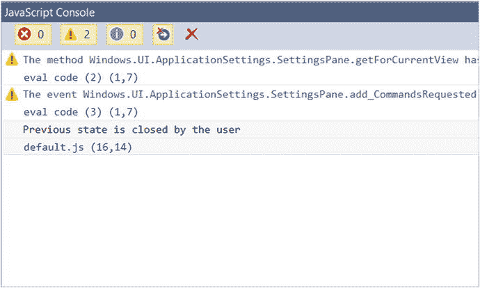
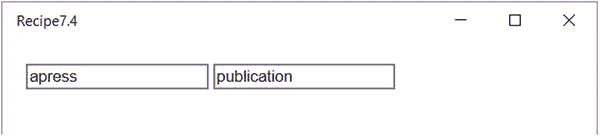
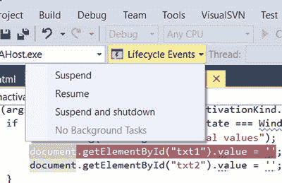
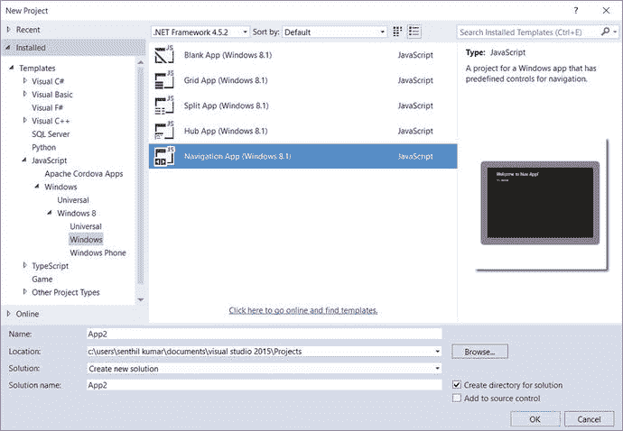
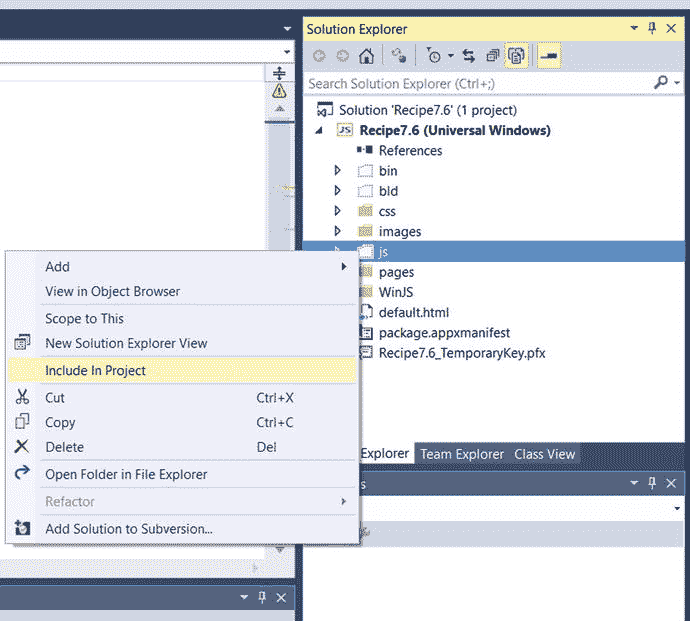
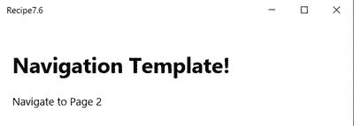
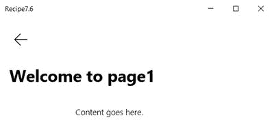

# 第 7 章：应用程序生命周期和导航

本章介绍通用 Windows 应用程序事件和生命周期，涵盖启动 Windows 应用时引发的标准事件集以及如何处理这些事件。本章介绍开发人员如何处理应用程序的挂起和终止。它同时介绍如何在这些事件期间保存和恢复数据，这有助于开发人员提供更好的用户体验。

本章还介绍了导航模型，并解释了如何构建一个可以包含多个虚拟 HTML 页面的单页应用。

## 7.1 应用程序状态和事件

### 问题

您需要在用户启动、关闭或恢复应用程序时识别并订阅应用程序中的各种事件。

### 解决方案

使用通用 Windows 应用项目中的`default.js`文件来订阅和处理应用程序生命周期中的各种事件。


### 工作原理

使用通用 Windows 模板创建一个新的通用 Windows 项目，该模板位于 Microsoft Visual Studio 2015 的“新建项目”对话框中的“JavaScript ➤ Windows ➤ 通用”节点下。这将在 Visual Studio 解决方案中创建一个项目，并附带所需的文件供您开始使用。

从项目的 `js` 文件夹中，通过 Visual Studio 解决方案资源管理器打开 `default.js` 文件。您会看到默认订阅的两个重要事件。

- `app.onactivated`
- `app.oncheckpoint`

这些事件的代码如下所示。

```
app.onactivated = function (args)
{
                if (args.detail.kind === activation.ActivationKind.launch)
             {
                        if (args.detail.previousExecutionState !== activation.ApplicationExecutionState.terminated) {
                        } else {
                        }
                        args.setPromise(WinJS.UI.processAll());
                }
        };
app.oncheckpoint = function (args)
{
};
```

作为开发者，您应处理这些事件，以描述当触发各种执行状态时，应用程序应如何保存和恢复数据。

在通用 Windows 应用中，有三种应用执行状态：

- 未运行
- 运行中
- 已挂起

图 7-1 展示了通用 Windows 应用的生命周期。



图 7-1. 应用程序状态与事件

当通用 Windows 应用启动时，WinJS 应用会按以下顺序触发事件。

`WinJS.Application.loaded` `WinJS.Application.activated` `WinJS.Application.ready` `WinJS.Application.unload`

当您的应用即将被挂起时，会触发 `WinJS.Application.checkpoint` 事件。

表 7-1 提供了应用程序事件的列表。

表 7-1. 应用程序事件列表

| 事件名称 | 描述 |
| --- | --- |
| `WinJS.Application.loaded` | 当 HTML 文档完全加载后，此事件由 `DOMContentLoaded` 事件触发。 |
| `WinJS.Application.activated` | 当您的应用程序被激活时触发此事件。 |
| `WinJS.Application.ready` | 当 `loaded` 和 `activated` 事件执行完成后触发此事件。 |
| `WinJS.Application.unload` | 此事件在页面卸载前由 `beforeunload` 事件触发。 |
| `WinJS.Application.checkpoint` | 当您的应用程序被挂起时触发此事件。 |

开发者应处理 `activated` 事件和 `checkpoint` 事件，以添加自定义逻辑来保存和恢复应用状态。因此，在创建新项目时，您会看到默认包含这两个事件。

其他事件可以使用 `WinJS.Application.addEventListener` 方法进行订阅。

打开 `default.js` 文件，并在 `onactivated` 事件行上方添加以下代码片段。

```
WinJS.Application.addEventListener("loaded", function(event) {
    console.log("loaded event");
});
WinJS.Application.addEventListener("ready", function (event) {
    console.log("ready event");
});
```

此外，在 `onactivated` 事件内部添加 `console.log ("activated");`。

当您使用“本地计算机”选项在 Windows 桌面上运行该应用时，您会看到事件按指定顺序触发，如图 7-2 所示。



图 7-2. JavaScript 控制台窗口中的应用程序事件

注意：在调用 `WinJS.Application.start` 事件之前，这些事件不会被触发。该方法在 `default.js` 文件中被调用。

Windows 应用必须先安装在设备上才能被激活。这通常可以通过从 Windows 应用商店安装应用，或在开发过程中使用 Visual Studio 构建和部署通用应用来实现。

当用户从“开始”屏幕或应用列表中点击应用磁贴时，Windows 应用被激活。在此阶段，应用处于“未运行”状态，需考虑以下条件：

- 应用是首次启动。
- 应用因崩溃而未运行。
- 应用被挂起，随后被系统终止。

应用可以通过多种方式被激活。可以使用 `ActivationKind` 枚举来查明应用是如何被激活的，并确定应用激活的确切原因。

例如，当用户点击应用磁贴时，应用可以被激活。在这种情况下，`ActivationKind` 的值为 `launch`。同样，当通过搜索合约激活应用时，`ActivationKind` 的值为 `search`。

以下代码片段展示了如何在 `onactivated` 事件中处理此情况。

```
if (args.detail.kind === activation.ActivationKind.launch) {
            console.log("launch activation kind");
}
else if (args.detail.kind === activation.ActivationKind.Search) {
            console.log("search activation kind");
}
```

表 7-2 展示了一些最常见的激活方法及其枚举值。

表 7-2. 激活方法

| 枚举成员 | 值 | 描述 |
| --- | --- | --- |
| `launch` | 0 | 当用户启动应用或从应用列表中点击磁贴时接收到此值。 |
| `search` | 1 | 当用户希望使用应用通过搜索合约进行搜索时接收到此值。 |
| `shareTarget` | 2 | 当应用程序通过共享合约被激活时接收到此值。 |
| `file` | 3 | 当设备中的另一个应用启动了一个文件，且该文件的文件类型已由应用注册进行处理时接收到此值。 |
| `protocol` | 4 | 当另一个应用启动了一个 URI，该 URI 的方案名称已注册由该应用处理时接收到此值。 |
| `fileOpenPicker` | 5 | 当用户选取由此应用提供的文件时接收到此值。 |
| `fileSavePicker` | 6 | 当用户尝试保存文件并选择该应用作为位置时接收到此值。 |
| `cachedFileUpdater` | 7 | 当用户尝试保存一个由该应用提供内容管理的文件时接收到此值。 |
| `contactPicker` | 8 | 当用户选取联系人时接收到此值。 |
| `device` | 9 | 该应用处理自动播放。 |
| `voiceCommand` | 16 | 当应用因语音命令而被激活时接收到此值。 |
| `toastNotification` | 1010 | 当用户点击 toast 通知或 toast 通知内的操作后应用被激活时接收到此值。 |

## 7.2 处理应用中的未处理异常

### 问题

您的应用崩溃，用户立即被带到 Windows 开始屏幕，且没有任何信息。您需要处理此场景以提供更好的用户体验。

### 解决方案

您可以在 `default.js` 文件中处理 `WinJS.Application.error` 事件，以记录错误并向用户显示一条消息。


### 工作原理

当通用 Windows 应用中出现未处理的异常时，会调用 `MSApp.terminateApp` 函数，之后应用程序关闭，且不会向用户显示任何信息。

在本教程中，我们将处理 `WinJS.Application.error` 事件，并在应用中出现未处理异常时向用户显示一条消息。

使用通用 Windows 模板创建一个新的通用 Windows 项目，该模板可以在 Microsoft Visual Studio 2015 的“新建项目”对话框中的 JavaScript ➤ Windows ➤ Universal 节点下找到。这将在 Visual Studio 解决方案中创建一个项目，并同时在其中包含必要的文件以开始开发。

从 `js` 文件夹中打开 `default.js` 文件，并将其替换为以下代码片段。

```
(function () {
    "use strict";
    var app = WinJS.Application;
    var activation = Windows.ApplicationModel.Activation;
    WinJS.Application.addEventListener("error", function(eventArgs) {
        var errorMessage = new Windows.UI.Popups.MessageDialog("应用程序中发生错误，请联系应用程序发布者");
        errorMessage.showAsync();
        return true;
    });
    app.onactivated = function (args) {
        args.setPromise(WinJS.UI.processAll());
        throw new WinJS.ErrorFromName();
    };
    app.start();
})();
```

此代码片段从 `onactivated` 事件中抛出一个异常。`WinJS.Application.addEventListener` 函数用于为 error 事件添加侦听器，以处理未处理的异常并向用户显示一条消息。

使用 Visual Studio 2015 中的“本地计算机”选项在 Windows 桌面上运行该应用。您将看到如图 7-3 所示的消息。



**图 7-3.** 在应用出现未处理异常时显示消息

**注意：** 错误处理函数返回 `true`。值 `true` 用于指示错误已被处理，因此不应终止应用。

## 7.3 处理应用的终止和恢复

### 问题

您需要识别应用的先前执行状态，以便在启动时恢复该状态。

### 解决方案

您可以使用激活事件参数的 `detail.previousExecutionState` 属性来识别应用的状态。此属性确定应用是作为新应用启动的，还是之前被用户关闭的，或者是用户在应用被挂起或终止后启动的。

### 工作原理

`previousExecutionState` 包含指示应用程序先前状态的值。您可以在 activated 事件中使用此值，根据此值加载之前的状态值或初始状态值。

使用通用 Windows 模板创建一个新的通用 Windows 项目，该模板可以在 Microsoft Visual Studio 2015 的“新建项目”对话框中的 JavaScript ➤ Windows ➤ Universal 节点下找到。这将在 Visual Studio 解决方案中创建一个项目，并同时在其中包含必要的文件以开始开发。

从 `js` 文件夹中打开 `default.js` 文件，并将 `onactivated` 事件替换为以下代码片段。

```
app.onactivated = function (args) {
    if (args.detail.kind === activation.ActivationKind.launch) {
        if (args.detail.previousExecutionState === activation.ApplicationExecutionState.notRunning) {
            console.log("Previous state is not running");
        }
        if (args.detail.previousExecutionState === activation.ApplicationExecutionState.closedByUser) {
            console.log("Previous state is closed by the user");
        }
        if (args.detail.previousExecutionState === activation.ApplicationExecutionState.terminated) {
            console.log("Previous state is terminated");
        }
        args.setPromise(WinJS.UI.processAll());
    }
};
```

此代码处理 `onactivated` 事件，其中使用 `args.detail.previousExecutionState` 来查找应用的先前状态。`ApplicationExecutionState` 枚举用于检查应用的状态。

当您运行应用时，您会在 JavaScript 控制台窗口中看到显示的先前状态，如图 7-4 所示。



**图 7-4.** 在 JavaScript 控制台窗口中显示的 `PreviousExecutionState`

`ApplicationExecutionState` 枚举包含的值如表 7-3 所示。

**表 7-3.** `ApplicationExecutionState` 及其枚举值

| 状态 | 描述 |
| --- | --- |
| `notRunning` | 当用户首次启动应用、关闭应用并在 10 秒内重新启动应用，或应用崩溃时，应用的先前状态为 "notRunning"。 |
| `running` | 如果应用已在运行，并且用户通过合约或辅助磁贴启动应用，则应用的先前状态为 "running"。 |
| `suspended` | 如果应用被挂起，之后通过辅助磁贴或合约激活，则应用的先前状态为 "suspended"。 |
| `terminated` | 如果应用之前被操作系统终止，则应用的先前状态为 "terminated"。 |
| `closedByUser` | 如果应用被用户关闭且未在 10 秒内重新启动，则应用的先前状态为 "closedByUser"。应用可以通过 `Alt`+`F4` 快捷键或使用关闭手势来关闭。 |

## 7.4 使用 SessionState 存储状态

### 问题

您需要在应用程序生命周期内存储应用的状态，以便在应用激活时恢复该值。

### 解决方案

使用 `WinJS.Application.sessionState` 将数据存储到应用的状态中，该状态可用于在应用挂起或终止后恢复应用。


### 工作原理

`WinJS.Application.sessionState` 对象用于存储应用程序信息，以便在应用程序被挂起或终止后恢复其状态。

当应用程序被挂起然后重新启动时，它不会丢失状态。但是，当应用程序被挂起，随后操作系统因内存不足或其他原因终止该应用程序时，其状态会丢失。应用程序再次启动时将从头开始。

`WinJS.Application.sessionState` 有助于解决此问题。

让我们通过一些代码来演示 `SessionState` 的用法。

使用通用 Windows 模板创建一个新的通用 Windows 项目，该模板位于 Microsoft Visual Studio 2015 中“新建项目”对话框的 `JavaScript ➤ Windows ➤ Universal` 节点下。这会在 Visual Studio 解决方案中创建一个项目，并在其中包含必要的文件。从 Visual Studio 解决方案资源管理器中打开 `default.html` 页面，并将其替换为以下代码片段。

```html
<!DOCTYPE html>
<html>
<head>
    <meta charset="utf-8" />
    <title>Recipe7.4</title>
    <!-- WinJS references -->
    <link href="WinJS/css/ui-light.css" rel="stylesheet" />
    <script src="WinJS/js/base.js"></script>
    <script src="WinJS/js/ui.js"></script>
    <!-- Recipe7.4 references -->
    <link href="/css/default.css" rel="stylesheet" />
    <script src="/js/default.js"></script>
</head>
<body class="win-type-body" style="margin: 20px">
<div>
    <input id="txt1"/>
    <input id="txt2"/>
</div>
</body>
</html>
```

上面的代码片段在页面上添加了两个输入控件，以便用户可以输入数据。

打开 `js` 文件夹中的 `default.js` 文件，并将 `onactivated` 和 `oncheckpoint` 事件替换为以下代码片段。

```javascript
app.onactivated = function (args) {
                if (args.detail.kind === activation.ActivationKind.launch) {
                    if (args.detail.previousExecutionState === Windows.ApplicationModel.Activation.ApplicationExecutionState.notRunning) {
                        console.log("setting the initial values");
                        document.getElementById("txt1").value = '';
                        document.getElementById("txt2").value = '';
                    }
                    if (args.detail.previousExecutionState === Windows.ApplicationModel.Activation.ApplicationExecutionState.closedByUser) {
                        console.log("setting the initial values");
                        document.getElementById("txt1").value = '';
                        document.getElementById("txt2").value = '';
                    }
                    if (args.detail.previousExecutionState === Windows.ApplicationModel.Activation.ApplicationExecutionState.terminated) {
                        console.log("setting the previous state values");
                        document.getElementById("txt1").value = WinJS.Application.sessionState.txt1;
                        document.getElementById("txt2").value = WinJS.Application.sessionState.txt2;
                    }
                        args.setPromise(WinJS.UI.processAll());
                }
        };
        app.oncheckpoint = function (args) {
            WinJS.Application.sessionState.txt1 = document.getElementById("txt1").value;
            WinJS.Application.sessionState.txt2 = document.getElementById("txt2").value;
        };
```

该代码片段处理 `onactivated` 和 `oncheckpoint` 事件。当应用程序被挂起时，会触发 `oncheckpoint` 事件。在此阶段，用户在两个文本框中输入的值会被保存到 `sessionState` 中。

如果应用程序的上一个状态是 `terminated`，那么当应用程序重新激活时，将从 `sessionState` 中恢复值并更新到页面上的文本框中。如果上一个状态是 `notRunning` 或 `closedByUser`，则恢复默认值。

当你运行一个已被挂起并终止的应用程序时，你会看到应用程序数据在页面中恢复，如图 7-5 所示。



**图 7-5.** 显示从 `sessionState` 恢复的数据的页面

你可以测试应用程序状态，并模拟 Visual Studio 2015 中的挂起和终止事件。为此，需要使用“调试位置”工具栏中的“生命周期事件”下拉列表，如图 7-6 所示。



**图 7-6.** 用于测试 Visual Studio 中应用程序生命周期事件的工具

可以通过单击 `Suspend` 选项来挂起正在运行的应用程序，然后点击 `Resume` 选项来恢复应用程序，从而模拟挂起和恢复生命周期事件。单击 `Suspend` 选项时，会触发 `onCheckpoint` 事件。可以通过单击 `Suspend and shutdown` 按钮来模拟挂起和终止事件。此时，`onCheckpoint` 事件被触发，并且你的应用程序终止。当你再次运行应用程序时，`previousExecutionState` 包含值 `terminated`。

## 7.5 使用超链接在页面之间导航

### 问题

你需要以最简单的方式之一在通用 Windows 应用程序中的页面之间进行导航。

### 解决方案

使用 HTML 在应用程序内进行页面导航的最简单方法之一是使用超链接。

### 工作原理

假设你的应用程序中有 `default.html` 和 `newpage.html` 文件，如果你想从 `default.html` 导航到 `newpage.html`，在 `default.html` 中添加以下代码即可实现。

```html
<p><a href="newpage.html">Navigate to page 2</a></p>
```

代码中的 `href` 是一个指向 `newpage.html` 的相对链接。这是一个属于你通用 Windows 应用程序的 HTML 页面，并且应位于项目的根目录。

或者，如果你想指定应用程序中本地文件的 URI，可以使用新的包内容 URI 方案，称为 `ms-appx`。

上述代码可以重写如下：

```html
<p><a href="ms-appx:///newpage.html">Navigate to New page</a></p>
```

**注意**

尽管此示例执行了顶级导航，但你应该避免在 Windows 应用程序中这样做。这对于网页来说是理想的，但不适用于移动或平板电脑应用程序。有时，当应用程序加载下一页时，屏幕可能会变空白。

微软建议使用单页导航，与顶级导航相比，它提供了更好的性能和更像应用程序的体验。

## 7.6 使用单页导航在页面之间导航

### 问题

你需要使用单页导航模型在通用 Windows 应用程序中的页面之间进行导航。

### 解决方案

在通用 Windows 应用程序中实现单页导航的最简单解决方案之一，是将 Windows 8.1 导航应用模板中执行导航逻辑所需的文件导入到 Windows 10 项目中。

**注意**

在撰写本文时，Windows 10 不提供像 Windows 8.1 中那样的等效导航模板。


### 工作原理

Visual Studio 2015 并未为 UWP 应用提供导航模板，它只提供了 `Blank App` 模板。幸运的是，VS 2015 还包含 Windows 8.1 应用的模板，其中有一个模板包含大量导航逻辑。接下来，我们将必要的文件从 Windows 8.1 项目添加到通用 Windows 应用中。

启动 Visual Studio 2015，使用 `Navigation App` 模板创建一个新的 Windows 8.1 项目，如图 7-7 所示。



**图 7-7.** 使用 `Navigation App` 模板创建 Windows 8.1 项目

该模板会添加 `navigator.js` 文件，并更新 `default.js` 文件以包含导航逻辑。这些文件位于项目的 `js` 文件夹下。

该模板还会创建一个名为 `pages` 的文件夹，并在其中包含一个 `home` 子文件夹，内含三个文件：`home.css`、`home.html` 和 `home.js`。

`pages` 文件夹包含所有页面控件，它们就像是 Windows 应用中的页面。当你启动 `Navigation App` 模板时，默认会加载 `pagecontrol home.html` 文件。此设置在 `default.html` 页面中定义。

所有加载页面控件的细节均由 `PageControlNavigator` 处理，它是 `navigator.js` 文件的一部分。

下一步是创建一个新的通用 Windows 应用，并更新它，使其包含从使用 Windows 8.1 `Navigation` 模板创建的项目中获取的文件。



**图 7-8.** 在 Visual Studio 2015 中将 `js` 文件夹和 `pages` 文件夹包含到 UWP 应用中

使用 `Universal Windows` 模板创建一个新的通用 Windows 项目，该模板位于 Microsoft Visual Studio 2015 新建项目对话框的 **JavaScript** > **Windows** > **Universal** 节点下。这会在 Visual Studio 解决方案中创建一个单独的项目，并在其中包含启动所需的必要文件。

将先前创建的 Windows 8.1 `Navigation App` 中的整个 `js` 文件夹和 `pages` 文件夹复制并粘贴到新通用项目的根目录下。然后，通过 Visual Studio 解决方案资源管理器将它们包含到项目中，如图 7-8 所示。

现在，你已准备好修改通用 Windows 应用，以实现在页面之间进行导航。

从 Visual Studio 解决方案资源管理器中打开 `default.html` 页面，并将 body 部分替换为以下代码。

```
<div id="contenthost" data-win-control="Application.PageControlNavigator" data-win-options="{home: '/pages/home/home.html'}"></div>
```

同时，在 `default.html` 页面中包含对 `navigator.js` 的引用。

```
<script src="/js/navigator.js"></script>
```

`default.html` 页面充当一个外壳，用于加载 `pages` 文件夹中的不同页面控件。默认情况下，它会加载 `pages`/`home` 文件夹中的 `home.html` 页面。

`PageControlNavigator` 控件有一个 `id` 为 `content host` 的元素，它充当从页面控件加载的内容的宿主。

下一步是向项目添加一个新的页面控件，以便用户可以从 `home.html` 文件导航到该新页面控件。

Microsoft Visual Studio 提供了 `Page Control` 项模板，使开发者能够轻松创建页面控件。

在 Visual Studio 解决方案资源管理器中右键单击 `pages` 文件夹，然后从上下文菜单中选择 **添加** > **新建项**。在 **添加新项** 对话框中，选择 `Page Control`，并将名称指定为 `page2.html`。点击 **添加** 按钮。

这会将三个文件添加到项目中：

*   `page1.html`
*   `page1.css`
*   `page1.js`

`page1.html` 的内容如下所示。

```
<!DOCTYPE html>
<html>
<head>
<meta charset="utf-8" />
<title>page1</title>
<link href="page1.css" rel="stylesheet" />
<script src="page1.js"></script>
</head>
<body>
<div class="page1 fragment">
<header class="page-header" aria-label="Header content" role="banner">
<button class="back-button" data-win-control="WinJS.UI.BackButton"></button>
<h1 class="titlearea win-type-ellipsis">
<span class="pagetitle">Welcome to page1</span>
</h1>
</header>
<section class="page-section" aria-label="Main content" role="main">
<p>The content of page 2</p>
</section>
</div>
</body>
</html>
```

`page1.js` 文件的内容如下所示：

```
// For an introduction to the Page Control template, see the following documentation:
// http://go.microsoft.com/fwlink/?LinkId=232511
(function () {
"use strict";
WinJS.UI.Pages.define("/pages/page1.html", {
// This function is called whenever a user navigates to this page. It
// populates the page elements with the app's data.
ready: function (element, options) {
},
unload: function () {
},
updateLayout: function (element) {
}
});
})();
```

你只需修改 `page1.html` 的 body 标签，以表明导航到页面 1 成功。

现在，通用应用中包含两个 HTML 页面。第一个页面是 `home.html`，第二个页面是 `page1.html`。如何在两个页面之间导航？

你可以使用 `WinJS.Navigate.navigate()` 方法在页面之间导航。

让我们修改 `home.html`，通过添加以下代码片段来包含一个指向页面 1 的超链接。

```
<a id="lnkPage2"> Navigate to Page 2</a>
```

请注意，该超链接包含 `id` 属性，但没有 `href` 属性。

打开 `home.js` 文件，并将其内容替换为以下代码片段。

```
(function () {
"use strict";
WinJS.UI.Pages.define("/pages/home/home.html", {
// This function is called whenever a user navigates to this page. It
// populates the page elements with the app's data.
ready: function (element, options) {
var page2link = document.getElementById('lnkPage2');
page2link.addEventListener('click', function(eventargs) {
eventargs.preventDefault();
WinJS.Navigation.navigate("/pages/page1.html");
});
}
});
})();
```

该代码在页面的 `ready` 事件中为超链接设置了点击事件处理程序。点击事件处理程序首先调用 `preventDefault` 函数来阻止常规的链接导航，然后调用 `WinJS.Navigation.navigate` 方法导航到 `page1.html`。

当你使用 **本地计算机** 选项在 Windows 桌面运行该应用时，会看到显示有超链接的主页，如图 7-9 所示。



**图 7-9.** `home.html` 页面，包含一个导航到页面 2 的超链接

当你点击 **Navigate to Page 2** 链接时，用户将被带到页面 2，如图 7-10 所示。查看 `page2.html` 时，请注意 **返回** 按钮，它可以将你带回到上一个页面。



**图 7-10.** 包含 **返回** 按钮的 `Page1.html`

表 7-4 显示了 `WinJS.Navigation` 类中可用的部分方法。

**表 7-4.** `WinJS.Navigation` 类

| 方法名称 | 说明 |
| --- | --- |
| `WinJS.Navigation.back()` | 该方法导航用户返回历史记录中的上一个页面。 |
| `WinJS.Navigation.forward()` | 该方法使开发者能够在历史记录中向前导航。 |
| `WinJS.Navigation.navigate()` | 该方法使开发者能够导航到指定的页面。 |


