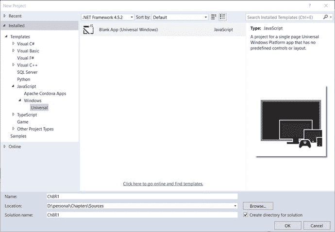
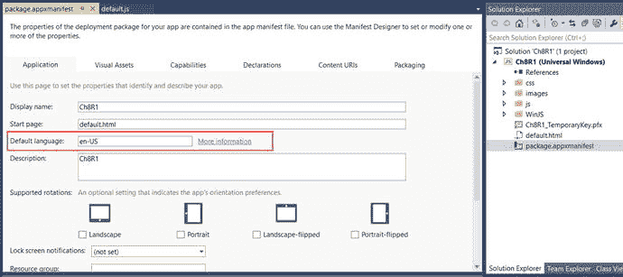
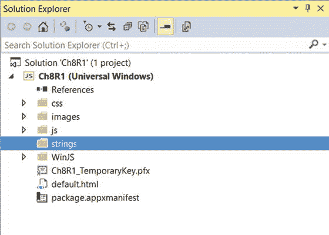
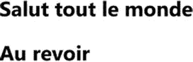
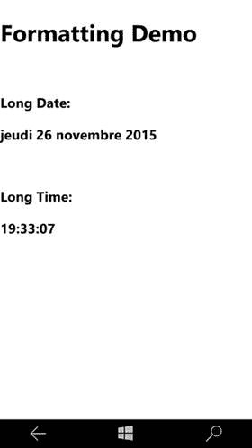
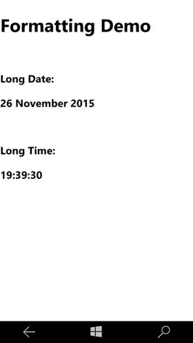
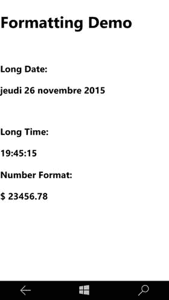
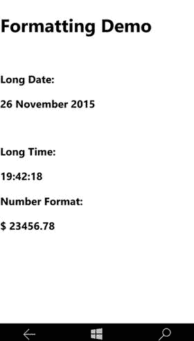
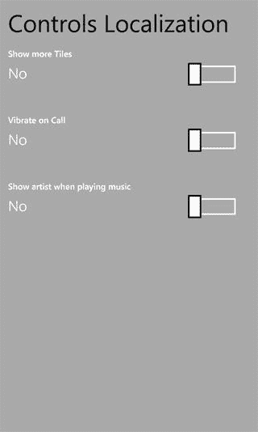
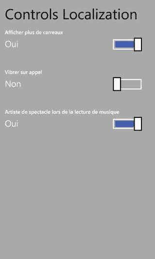

# 第 8 章：全球化和本地化

你的 Windows 应用可以在近 240 个 Windows 市场中销售。目标受众在文化、地域和语言上各不相同。你的应用用户可能遍布世界各地，他们可能说不同的语言，甚至多种语言。作为应用程序开发者，你需要让你的应用适配多种语言、市场、文化和区域。全球化意味着让应用感知文化、语言和区域。本地化则是将应用的某些方面适配到其所运行的文化中的能力，例如日期、数字或货币格式等。在本章中，你将学习如何对应用进行全球化和本地化的方法。

## 8.1 使用资源字符串

### 问题

当应用在非英语文化环境下使用时，文本无法适配新的文化和语言，用户看到的仍然是英语文本。

### 解决方案

为了实现应用的全球化，必须使用资源字符串来代替静态文本。例如，应用程序中的任何标签文本都不应硬编码为静态文本。相反，应该为你需要支持的文化/语言创建一个资源文件。添加能够将文本翻译成对应语言的字符串。标签文本也应使用资源字符串，而非硬编码。

### 工作原理

让我们看看资源字符串在应用程序中的用法，以及如何添加它们。

打开 Visual Studio 2015。选择文件 ➤ 新建项目 ➤ JavaScript ➤ Windows ➤ 通用，然后选择空白应用（通用 Windows）模板。这将创建一个包含必要文件的通用应用，可在运行 Windows 10 的设备上运行。



图 8-1. 在“新建项目”窗口中选择“空白应用（通用 Windows）”模板

在 Visual Studio 解决方案资源管理器中，从项目中打开 `package.appxmanifest` 文件。转到“应用程序”选项卡，检查默认语言是否设置为 en-US。创建新项目时，语言默认设置为 en-US（见图 8-2）。



图 8-2. 应用程序清单中的默认语言设置

按如下方式创建一个资源文件夹：



图 8-3. Windows 项目中的 Strings 文件夹

在解决方案资源管理器中，选择通用 Windows 项目并右键单击它。从上下文菜单中选择添加 ➤ 新建文件夹。将新文件夹命名为 `strings`。你将在此文件夹内创建不同文化/语言的资源文件（见图 8-3）。

按如下方式创建一个子文件夹和一个英语资源文件：在 `strings` 文件夹（在步骤 3 中创建）中创建一个名为 `en-US` 的文件夹。右键单击 `en-US` 文件夹并选择添加 ➤ 新建项。从模板中选择文本文件，并将文件命名为 `resources.resjson`。建议在命名资源文件时使用这个默认名称。将文件内容替换为以下内容：

```
{
    "greeting"          : "Hello World!",
    "_greeting.comment" : "Hello World Text comment",
    "farewell"          : "Goodbye",
    "_farewell.comment" : "A farewell comment."
}
```

资源文件本质上是一个包含键值对的 JSON 文件。这里，`"greeting"` 和 `"farewell"` 标识了将要显示的字符串。其他键——`"_greeting.comment"` 和 `"_farewell.comment"` 是描述这些字符串本身的注释。为所有字符串添加有意义的注释是一个好习惯。

使用字符串资源标识符执行以下操作：从 Visual Studio 解决方案资源管理器中打开项目中的 `default.js` 文件。该文件位于项目的 `js` 文件夹中。将以下代码行添加到 `app.onactivated` 函数中：`WinJS.Resources.processAll();` 完成后的代码如下所示：

```
app.onactivated = function (args) {
    if (args.detail.kind === activation.ActivationKind.launch) {
        if (args.detail.previousExecutionState !== activation.ApplicationExecutionState.terminated) {
            WinJS.Resources.processAll();
        } else {
        }
        args.setPromise(WinJS.UI.processAll());
    }
};
```

要使用标记中的资源字符串，请打开 `default.html` 文件，并在 body 中添加以下内容：

```
<h2>
 <span data-win-res="{textContent: 'greeting'}"></span></h2>
<h2>
 <span data-win-res="{textContent: 'farewell'}"></span>
</h2>
```

添加其他语言资源文件：在项目的 `strings` 文件夹中，添加一个名为 `de-DE` 的文件夹。这用于德语文化。在 `de-DE` 文件夹中添加一个资源文件。将资源文件命名为 `resources.resjson`。将文件内容替换为以下代码：

```
{
    "greeting"          : "Hallo Welt!",
    "_greeting.comment" : " Hello World Text comment.",
    "farewell"          : "Auf Wiedersehen",
    "_farewell.comment" : "A farewell comment."
}
```

在项目的 `strings` 文件夹中添加另一个文件夹，命名为 `fr-FR`。这用于法语文化。在 `fr-FR` 文件夹中添加一个资源文件。该资源文件名也应为 `resources.resjson`。将文件内容替换为以下代码：

```
{
    "greeting"          : "Salut tout le monde",
    "_greeting.comment" : "Hello World Text comment.",
    "farewell"          : "Au revoir",
    "_farewell.comment" : "A farewell comment."
}
```

按如下方式运行应用：按 F5 生成并运行应用。问候和告别消息将以用户在设备上设置的首选语言显示。图 8-4 显示了使用本地计算机选项在 Windows 屏幕上运行的输出。


图 8-4. 英语文化资源字符串显示

更改设备上的语言设置并再次运行应用。图 8-5 显示了将设备语言设置为法语时显示的相同文本。



图 8-5. 法语文化资源字符串显示

请注意，在 Windows 移动设备上更改语言设置时，必须重新启动设备。

## 8.2 格式化日期、时间、数字和货币

### 问题

当语言更改为非英语文化/语言时，日期、时间、数字和货币仍显示英语文化设置。

### 解决方案

应用程序中的静态文本内容可以通过使用资源字符串进行本地化。但如果你的应用程序需要显示日期、时间、数字或货币，则无法使用资源字符串。相反，你需要使用 `WinJS.Globalization` 命名空间，它提供了 DateTime、Number 和 Currency 格式化辅助方法的功能。

### 工作原理


### 格式化日期和时间

以下步骤说明如何格式化日期和时间。

使用 `Windows.Globalization.DateTimeFormatting` 命名空间中的 `DateTimeFormatter`。通过模板格式创建一个 `DateTimeFormatter` 实例。有关模板格式的列表，可以查看 MSDN 文档：[`http://msdn.microsoft.com/en-us/library/windows/apps/windows.globalization.datetimeformatting.datetimeformatter.aspx`](http://msdn.microsoft.com/en-us/library/windows/apps/windows.globalization.datetimeformatting.datetimeformatter.aspx)。

将以下标记添加到 `default.html` 文件的 body 元素内：

```
<h1>Formatting Demo</h1> <br /> <h3>Long Date:</h3> <h3 id="spnDate"></h3> <br /> <h3>Long Time:</h3> <h3 id="spnTime"></h3>
```

按如下方式修改 `default.js` 中的 `onactivated` 方法：

```
app.onactivated = function (args) {
    if (args.detail.kind === activation.ActivationKind.launch) {
        if (args.detail.previousExecutionState !== activation.ApplicationExecutionState.terminated) {
            var lang = Windows.System.UserProfile.GlobalizationPreferences.languages[0];
            var shortDateFmt = new Windows.Globalization.DateTimeFormatting.DateTimeFormatter("longdate", [lang]);
            var shortTimeFmt = new Windows.Globalization.DateTimeFormatting.DateTimeFormatter("longtime",[lang]);
            var currentDateTime = new Date();
            var shortDate = shortDateFmt.format(currentDateTime);
            var shortTime = shortTimeFmt.format(currentDateTime);
            document.getElementById("spnDate").innerHTML = shortDate;
            document.getElementById("spnTime").innerHTML = shortTime;
        } else {
            // TODO: 此应用程序已从挂起状态重新激活。
            // 在此处恢复应用程序状态。
        }
        args.setPromise(WinJS.UI.processAll());
    }
};
```

运行应用并验证输出（参见图 8-6 和图 8-7）。



**图 8-7.** 法语区域设置的格式化输出



**图 8-6.** 英语区域设置的格式化输出

图 8-6 显示针对英语区域设置格式化的日期，图 8-7 显示针对法语区域设置格式化的日期。

### 格式化数字和货币

以下步骤说明如何格式化数字和货币：

应使用 `NumberFormatting` 来显示小数、百分比数字和货币。

将以下标记添加到 `default.html` 的 body 末尾：

```
<h3>Number Format:</h3> <h3 id="spnCurrency"></h3>
```

修改 `default.js` 中的 `onactivated` 方法，并追加以下代码：

```
var userCurrency = Windows.System.UserProfile
                    .GlobalizationPreferences.currencies;
var number = 23456.78
var currFmt = new Windows.Globalization.NumberFormatting
                    .CurrencyFormatter(userCurrency[0],[lang]);
var formattedCurrency = currFmt.format(number);
document.getElementById("spnCurrency").innerHTML =
                formattedCurrency;
```

按 F5 运行应用。更改手机或平板电脑的语言设置，以查看数字和货币格式的效果（参见图 8-8 和图 8-9）。



**图 8-9.** 法语区域设置的日期和货币格式化输出



**图 8-8.** 英语区域设置的日期和货币格式化输出

## 8.3 本地化 WinJS 控件

### 问题

当更改区域设置或语言时，WinJS 控件不显示本地化字符串。

### 解决方案

通常，控件的属性（如 `label` 或 `title`）是在标记中设置的。这有点像对字符串值进行硬编码。因此，当更改区域设置或语言时，控件不会自适应，而是原样显示硬编码的字符串。通过使用资源文件，可以将 WinJS 控件属性绑定到本地化字符串。WinJS 提供了灵活性，可以直接将控件属性绑定到资源文件中的资源键。

### 工作原理

以下步骤说明如何本地化 WinJS 控件：

打开 Visual Studio 2015。选择 **文件** ➤ **新建项目** ➤ **JavaScript** ➤ **Windows** ➤ **空白应用(通用 Windows)**。这将创建一个通用应用，它是一个可以在 Windows 10 驱动设备上运行的单一项目。

向项目添加资源文件（有关如何添加资源文件，请参阅配方 8.1）。

添加以下字符串键：

```
{
    "ShowMoreTilesTitle"            : "显示更多磁贴",
    "_ShowMoreTilesTitle.comment"   : "显示更多磁贴切换标题",
    "VibrateOnCallTitle"            : "来电时振动",
    "_VibrateOnCallTitle.comment"   : "来电时振动切换标题",
    "ShowArtistTitle"            : "播放音乐时显示艺术家",
    "_ShowArtistTitle.comment"   : "播放音乐时显示艺术家切换标题",
    "ToggleOn"              : "是",
    "_ToggleOn.comment"     : "显示更多磁贴开启标签",
    "ToggleOff"             : "否",
    "_ToggleOff.comment"    : "显示更多磁贴关闭标签"
}
```

类似地，我还为其他语言添加了字符串。

将以下代码添加到 `default.js` 的 `onactivated` 方法中：

```
WinJS.UI.processAll().then(function(){
    WinJS.Resources.processAll();
});
```

你需要调用 `WinJS.Resource` 类上的 `processAll()`，因为你将在标记中引用资源字符串。

将以下标记添加到 `default.html` 文件的 body 元素内：

```
<div>
    <h1>控件本地化</h1>
    <br />
    <div class="toggle" data-win-control="WinJS.UI.ToggleSwitch"
        data-win-res="{winControl: {labelOn:'ToggleOn',
                                    labelOff:'ToggleOff',
                                    title:'ShowMoreTilesTitle'}}"
        data-win-options="">
    </div>
    <br />
    <div class="toggle" data-win-control="WinJS.UI.ToggleSwitch"
        data-win-res="{winControl: {labelOn:'ToggleOn',
                                    labelOff:'ToggleOff',
                                    title:'VibrateOnCallTitle'}}"
        data-win-options="">
    </div>
    <br />
    <div class="toggle" data-win-control="WinJS.UI.ToggleSwitch"
        data-win-res="{winControl: {labelOn:'ToggleOn',
                                    labelOff:'ToggleOff',
                                    title:'ShowArtistTitle'}}"
        data-win-options="">
    </div>
</div>
```

注意，你使用了 `data-win-res` 并通过键名引用资源字符串，并将其分配给控件的属性。通常，其模式如下：

```
data-win-res="{winControl: {propertyName1:'resourceID1',
                            propertyName2:'resourceID2'}}"
```

按 F5 并运行应用。最初，你会看到控件使用的英文字符串。更改设备的语言，然后再次运行应用。现在它将选取适当的资源文件并使用适当的资源字符串（参见图 8-9 和图 8-10）。



**图 8-11.** 英语区域设置的格式化输出



**图 8-10.** 法语区域设置的格式化输出


