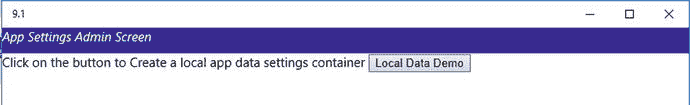
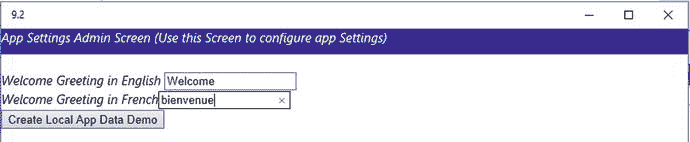
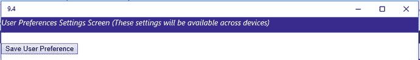
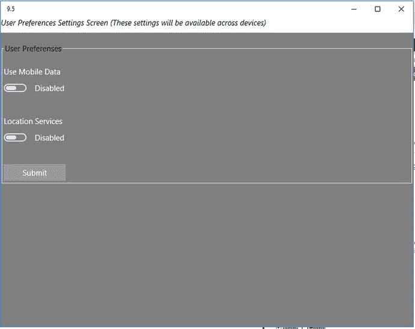
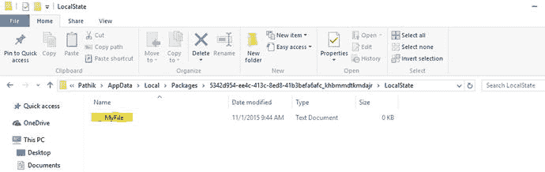
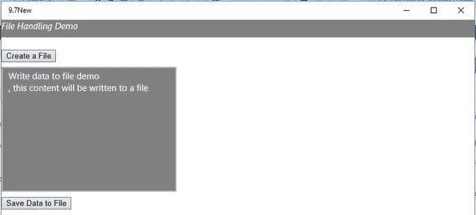
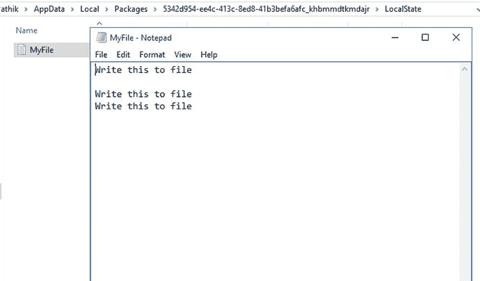

# 第 9 章：数据存储与应用数据

本章概述了在 Windows 10 应用中存储应用数据的技术。你将学习应用设置、如何将应用设置作为应用数据进行存储和检索，以及如何使用应用数据文件夹。

那么什么是应用数据呢？简单来说，特定于某个应用的数据被称为应用数据。通常，应用数据包括用户偏好、应用配置、应用状态等可变信息。

当你在设备上安装应用时，该应用会创建应用数据。但如果你从设备上移除或卸载该应用会发生什么呢？当应用被卸载时，其应用数据也会从设备上被删除。因此，建议不要将用户数据（如用户照片）存储为应用数据。

你的应用创建的另一种数据类型是用户数据。用户数据是由用户创建的，例如文档、图片、视频文件、音频文件等。

## 9.1 如何创建和删除本地应用数据设置容器

### 问题

你需要在 Windows 10 应用的本地应用数据存储中创建和删除一个容器。

### 解决方案

使用`Windows.Storage.ApplicationData.current.LocalSettings.createContainer`在本地应用数据存储中创建本地应用设置容器。

### 工作原理

容器可以让你组织应用数据设置；例如，你可以创建一个名为`Greeting_Data_Container`的容器来存储应用的所有问候语。再创建另一个名为`UserPreference_Container`的容器来存储应用用户的所有偏好设置。你可以将容器添加到本地设置和漫游设置中。一个容器内部还可以包含另一个容器。通用 Windows 应用允许你创建最多 32 层嵌套的容器。

在 Microsoft Visual Studio 2015 中使用 Windows 通用（空白应用）模板创建一个新项目。这将创建一个可以在运行 Windows 10 的 PC、平板电脑和 Windows Phone 上运行的 Windows 通用应用。在 Visual Studio 解决方案资源管理器中打开项目中的`default.html`页面。在`default.html`的`<body>`标签内定义一个按钮的 HTML 标签。

```html
<div id="titleBarContent" style="width: 100%;height:30px; background:border-box darkblue; overflow: hidden; z-index: 3">
    <i>应用设置管理界面</i>
</div>
<span>点击按钮创建本地应用数据设置容器</span>
<input type="button" value="本地数据演示" id="btnLocalData" />
<h3><span id="msgspan"></span></h3>
```

完整的`default.html`代码如下所示：

```html
<!DOCTYPE html>
<html>
<head>
    <meta charset="utf-8" />
    <title>示例 9.1</title>
    <!-- WinJS 引用 -->
    <link href="WinJS/css/ui-dark.css" rel="stylesheet" />
    <script src="WinJS/js/base.js"></script>
    <script src="WinJS/js/ui.js"></script>
    <!-- 示例 9.1 引用 -->
    <link href="/css/default.css" rel="stylesheet" />
    <script src="/js/default.js"></script>
</head>
<body class="win-type-body">
    <div id="titleBarContent" style="width: 100%;height:30px; background:border-box darkblue; overflow: hidden; z-index: 3">
        <i>应用设置管理界面</i>
    </div>
    <span>点击按钮创建本地应用数据设置容器</span>
    <input type="button" value="本地数据演示" id="btnCreateContainer" />
    <h3><span id="msgspan"></span></h3>
</body>
</html>
```

在解决方案资源管理器中右键点击项目的`js`文件夹，选择添加 ➤ 新建 JavaScript 文件，在项目的`js`文件夹中添加一个`js`文件。为文件命名。在此示例中，我们将文件命名为`DatastorageDemo.js`。通过在`default.html`的`<head>`标签中添加以下代码来引用该文件：

```html
<script src="js/DatastorageDemo.js"></script>
```

将以下代码添加到新创建的`js`文件中：

```javascript
(function () {
    "use strict";
    function GetControl() {
        WinJS.UI.processAll().done(function () {
            var localSettingsButton = document.getElementById("btnCreateContainer");
            localSettingsButton.addEventListener("click", btnCreateContainerClick, false);
        });
    }
    document.addEventListener("DOMContentLoaded", GetControl);
})();
```

这段代码获取按钮元素，并为按钮绑定一个事件监听器，当用户点击按钮时触发该监听器。现在，在`DatastorageDemo.js`文件中使用以下代码片段添加一个事件方法或函数。

```javascript
function btnCreateContainerClick(mouseEvent) {
    var applicationData = Windows.Storage.ApplicationData.current;
    var localSettings = applicationData.localSettings;
    // 创建一个本地设置容器
    var localSettingscontainer = localSettings.createContainer("App_GreetingDataContainer", Windows.Storage.ApplicationDataCreateDisposition.Always);
    document.getElementById("msgspan").innerText = "容器已创建，容器名称为：" + localSettingscontainer.name;
}
```

这段代码声明了一个名为`applicationData`的变量。它被赋值为`Windows.Storage.ApplicationData.current`，这允许你访问应用数据存储。应用数据存储可以保存应用设置和文件。下一行从`ApplicationData`中检索`localSettings`并将其赋值给变量`localSettings`。

然后调用`createContainer`方法创建一个设置容器。上述示例创建了一个名为`App_greetingData`的设置容器。`createContainer`方法接受两个参数：设置容器的名称和`Windows.Storage.ApplicationDataCreateDisposition.Always`，后者表示始终检查容器是否存在。如果存在，则返回指定的容器；否则，创建一个新的容器。

你也可以使用`localSettingscontainer.deleteContainer("<<名称>>")`方法删除一个容器。`deleteContainer`方法用于从应用数据存储中删除容器。

删除代码片段使用`hasKey`函数检查容器是否存在，然后通过传递容器键使用`deleteContainer`函数删除容器。

`DataStorageDemo.js`的完整代码如下：

```javascript
(function () {
    "use strict";
    function GetControl() {
        WinJS.UI.processAll().done(function () {
            var localSettingsButton = document.getElementById("btnCreateContainer");
            localSettingsButton.addEventListener("click", btnCreateContainerClick, false);
        });
    }
    document.addEventListener("DOMContentLoaded", GetControl);
})();

function btnCreateContainerClick(mouseEvent) {
    var applicationData = Windows.Storage.ApplicationData.current;
    var localSettings = applicationData.localSettings;
    // 创建一个本地设置容器
    var localSettingscontainer = localSettings.createContainer("App_GreetingDataContainer", Windows.Storage.ApplicationDataCreateDisposition.Always);
    document.getElementById("msgspan").innerText = "容器已创建，容器名称为：" + localSettingscontainer.name;
}
```

现在，让我们生成应用并在 Windows 10 中运行它。

图 9-1 展示了一个按钮和`h2`标签的外观。当你点击本地数据演示按钮时，它会执行`btnSaveClick`方法，该方法创建容器并显示一条包含容器名称的消息。



**图 9-1.** 创建本地应用数据设置容器

## 9.2 如何创建和读取本地应用数据设置

### 问题

你需要在应用数据存储的应用数据设置容器中创建本地应用数据设置。

### 解决方案

使用`ApplicationDataContainer.values`在 Windows 10 应用的本地应用数据存储的应用数据设置容器中创建本地应用数据设置。


### 工作原理

应用设置是应用中的个性化数据或自定义设置。用户偏好——例如用户是否希望启用或禁用定位服务——即是一种应用设置。通用 Windows 应用开发公开了相关 API，允许您将应用设置作为应用数据存储和检索到应用数据存储中。

应用数据存储包含两个不同的设置位置：本地设置和漫游设置。

在 Microsoft Visual Studio 2015 中使用 Windows 通用（空白应用）模板创建一个新项目。在 Visual Studio 解决方案资源管理器中打开项目中的 `default.html` 页面。在 `default.html` 的 `<body>` 标签内，为两个文本框、一个按钮和一个 `<span>` 标签定义 HTML 标签。

```
<div id="titleBarContent" style="width: 100%;height:30px; background:border-box darkblue; overflow: hidden; z-index: 3">
    <i>应用设置管理界面（使用此界面配置应用设置）</i>
</div>
<br />
<i>英文欢迎语</i> <input type="text" value="" id="txtWelcomeGreetingseng" /><br />
<i>法文欢迎语</i><input type="text" value="" id="txtWelcomeGreetingsfr" /><br />
<input type="button" value="创建本地应用数据演示" id="btnLocalData" />
```

完整的 `default.html` 应如下所示：

```html
<!DOCTYPE html>
<html>
<head>
    <meta charset="utf-8" />
    <title>Recipe9.2</title>
    <!-- WinJS references -->
    <link href="WinJS/css/ui-dark.css" rel="stylesheet" />
    <script src="WinJS/js/base.js"></script>
    <script src="WinJS/js/ui.js"></script>
    <!-- Recipe9.2 references -->
    <link href="/css/default.css" rel="stylesheet" />
    <script src="/js/default.js"></script>
</head>
<body class="win-type-body">
    <div id="titleBarContent" style="width: 100%;height:30px; background:border-box darkblue; overflow: hidden; z-index: 3">
        <i>应用设置管理界面（使用此界面配置应用设置）</i>
    </div>
    <br />
    <i>英文欢迎语</i> <input type="text" value="" id="txtWelcomeGreetingseng" /><br />
    <i>法文欢迎语</i><input type="text" value="" id="txtWelcomeGreetingsfr" /><br />
    <input type="button" value="创建本地应用数据演示" id="btnLocalData" />
</body>
</html>
```

右键单击解决方案资源管理器中项目的 `js` 文件夹，选择“添加” ➤ “新建 JavaScript 文件”。为文件命名。在本例中，我们将文件命名为 `DataStorageDemo.js`。

```javascript
(function () {
    "use strict";
    function GetControl() {
        WinJS.UI.processAll().done(function () {
            var submitbutton = document.getElementById("btnLocalData");
            submitbutton.addEventListener("click", btnLocalDataClick, false);
        });
        GetCurrentSettingValues();
    }
    document.addEventListener("DOMContentLoaded", GetControl);
})();
```

现在，添加一个函数，用于从容器中检索当前欢迎语设置：

```javascript
function GetCurrentSettingValues() {
    var applicationData = Windows.Storage.ApplicationData.current;
    var localSettings = applicationData.localSettings;
    // 创建一个本地设置容器
    var containerExists = localSettings.containers.hasKey("App_GreetingDatalocalContainer");
    if (containerExists) {
        document.getElementById("txtWelcomeGreetingseng").value = localSettings.containers.lookup("App_GreetingDatalocalContainer").values["App_Heading_English"];
        document.getElementById("txtWelcomeGreetingsfr").value = localSettings.containers.lookup("App_GreetingDatalocalContainer").values["App_Heading_French"];
    }
}
```

此代码在应用加载时执行；它从容器中检索本地欢迎语设置。首次运行此应用时，您不会看到任何填充的值，但下次运行时，它将显示存储在容器中的设置。

现在，在 `DataStorageDemo.js` 文件中使用以下代码片段添加一个事件方法或函数：

```javascript
function btnLocalDataClick(mouseEvent) {
    var applicationData = Windows.Storage.ApplicationData.current;
    var localSettings = applicationData.localSettings;
    // 创建一个本地设置容器
    var localSettingscontainer = localSettings.createContainer("App_GreetingDatalocalContainer", Windows.Storage.ApplicationDataCreateDisposition.Always);
    if (!localSettingscontainer.values.hasKey("App_Heading_English")) {
        localSettingscontainer.values["App_Heading_English"] = document.getElementById("txtWelcomeGreetingseng").value;
    }
    if (!localSettingscontainer.values.hasKey("App_Heading_French")) {
        localSettingscontainer.values["App_Heading_French"] = document.getElementById("txtWelcomeGreetingsfr").value;
    }
} //btnLocalDataClick 函数结束
```

此代码创建 `applicationData` 和 `localSettings` 变量以引用 `localSettings`。之后，使用 `createContainer` 函数创建一个名为 `App_GreetingDatalocalContainer` 的容器。然后，使用 `localSettingscontainer.values.hasKey("App_Heading_English")` 确保名为 `App_Heading_English` 的设置存在于应用数据的 `localSettings` 容器中。如果设置不存在，则通过 `localSettingscontainer.["name"]` 函数创建一个。它还使用以下代码行将文本框中的字符串值赋给它：

```
localSettingscontainer.values["App_Heading_English"] = document.getElementById("txtWelcomeGreetingseng").value;
```

它对法文应用标题执行相同的操作。

在 Windows 10 上运行应用程序时，您将看到如图 9-2 所示的界面。



图 9-2. 为欢迎语设置创建本地应用数据设置

## 9.3 如何创建和检索本地复合设置

### 问题

您需要在 Windows 10 应用的应用数据存储中创建和读取本地复合值。

### 解决方案

使用 `ApplicationDataCompositeValue` 类创建和读取本地复合值。

### 工作原理

`Windows.Storage.ApplicationDataCompositeValue` 类允许您创建可存储在本地设置或漫游设置中的复合设置。复合值类允许您将名称/值对作为应用数据存储在应用数据存储中。假设您想将书籍信息存储为：

```
book["ISBN"] = 12345;
book["BookTitle"] = "Windows 10 开发";
```

要存储复合信息，您可以使用如下代码：

```javascript
var applicationData = Windows.Storage.ApplicationData.current;
var localSettings = applicationData.localSettings;
// 创建一个 BookInfo 复合设置
var bookInfo = new Windows.Storage.ApplicationDataCompositeValue();
bookInfo["ISBN"] = 12345;
bookInfo["Title"] = "Windows 10 开发";
localSettings.values["AppLocalSettings"] = bookInfo;
```

要从复合设置中读取数据，您可以使用如下代码：

```javascript
var bookInfo = localSettings.values["AppLocalSettings"];
if (bookInfo) {
    var ISBN = bookInfo["ISBN"];
    var Title = bookInfo["Title"];
}
```

## 9.4 如何创建漫游应用数据存储容器

### 问题

您需要在 Windows 10 应用的应用数据存储中创建一个漫游应用数据存储容器。

### 解决方案

使用 `roamingSettings.createContainer` 在应用数据存储中创建漫游应用设置容器。


### 工作原理

这与你在应用数据存储中看到的本地设置非常相似，但这里使用的是 `Windows.Storage.ApplicationData.current.roamingSettings`，而非 `Windows.Storage.ApplicationData.current.LocalSettings`。

在 Microsoft Visual Studio 2015 中使用 Windows 通用（空白应用）模板创建一个新项目。在 Visual Studio 解决方案资源管理器中，从项目中打开 `default.html` 页面。在 `default.html` 的 body 标签内添加以下 HTML 标记：

```
<body class="win-type-body" style="background-color:goldenrod">
<div id="titleBarContent" style="width: 100%;height:30px; background:border-box darkblue; overflow: hidden; z-index: 3">
    <i>用户偏好设置屏幕（这些设置将在设备间同步）</i>
</div>
<br />
<input type="button" value="保存用户偏好" id="btnUserPreferenceRoamingData" />
<br />
<span id="spantoDisplayRoamingData" style="color:white"></span>
</body>
```

右键单击解决方案资源管理器中的项目 `js` 文件夹，选择“添加” ➤ “新建 JavaScript 文件”。为文件命名。在本示例中，我们将文件命名为 `DatastorageDemo.js`。

```
(function () {
    "use strict";
    function GetControl() {
        WinJS.UI.processAll().done(function () {
            var submitbutton = document.getElementById("btnUserPreferenceRoamingData");
            submitbutton.addEventListener("click", btnCreateRoamingContainerClick, false);
        });
    }
    document.addEventListener("DOMContentLoaded", GetControl);
})();
```

现在，在 `Datastoragedemo.js` 文件中使用以下代码片段添加一个事件方法或函数：

```
function btnCreateRoamingContainerClick(mouseEvent) {
    var ApplicationData = Windows.Storage.ApplicationData.current;
    var roamingSettings = ApplicationData.roamingSettings;
    // 创建本地设置容器
    if (!roamingSettings.containers.hasKey("UserPreference_RoamingProfile")) {
        var roamingSettingscontainer = roamingSettings.createContainer("UserPreference_RoamingProfile", Windows.Storage.ApplicationDataCreateDisposition.Always);
        document.getElementById("spantoDisplayRoamingData").innerText = roamingSettingscontainer.name + " 用户偏好漫游应用数据容器已创建！！";
    }
}
```

这段代码声明了一个名为 `ApplicationData` 的变量。它被赋值为 `Windows.Storage.ApplicationData.current`，该值表示应用数据存储中用于应用设置的容器。下一行则从 `ApplicationData` 中检索 `roamingSettings` 并将其存储在 `roamingSettings` 变量中。

接着，它调用 `roamingSettings.containers.hasKey` 函数来检查容器是否存在。如果不存在，则使用 `createContainer` 方法创建一个设置容器。前面的示例创建了一个名为 `App_GreetingDataRoamingContainer` 的设置容器，并将其存储在 `roamingSettingscontainer` 中。`createContainer` 方法接受两个参数：设置容器的名称和 `Windows.Storage.ApplicationDataCreateDisposition.Always`，后者指示始终检查容器是否存在；如果存在，则返回指定容器；否则，创建一个新容器。

当你在 Windows 10 模拟器或 Windows Mobile 上运行该应用时，界面应如图 9-3 所示。



**图 9-3.** 使用漫游应用数据设置保存用户偏好设置的表单

很好。在前面的代码片段中，你学习了 `roamingSettings` 对象的 `createContainer` 和 `deleteContainer` 方法。

## 9.5 如何创建和读取漫游应用数据设置

### 问题

你需要在 Windows 10 应用的应用数据存储中，于漫游应用数据设置容器内创建和读取漫游应用数据设置。

### 解决方案

使用 `ApplicationDataContainer.values` 在 Windows 10 应用的应用数据存储内的应用数据设置容器中创建漫游应用数据设置。


### 工作原理

在 Microsoft Visual Studio 2015 中使用 Windows 通用（空白应用）模板创建一个新项目。在 Visual Studio 解决方案资源管理器中打开项目中的 `default.html` 页面。向页面主体部分添加一个表单控件。该表单包含几个用于显示标题栏的 `div` 控件，一个用于电子邮件的输入控件，以及一个用于移动数据和定位服务的切换开关控件。

```html
<body class="win-type-body">
    <div id="titleBarContent" style="width: 100%;height:30px; background:border-box darkblue; overflow: hidden; z-index: 3">
        <i>用户偏好设置界面（这些设置将在所有设备上生效）</i>
    </div>
    <br />
    <form id="form1">
        <fieldset class="formSection">
            <legend class="formSectionHeading">用户偏好</legend>
            <div class="twoColumnFormContainer">
                <div id="UserMobileData" data-win-control="WinJS.UI.ToggleSwitch" data-win-options="{title :'使用移动数据',labelOff: '禁用',belOn:'启用',hecked: true}">
                </div>
                <br />
                <div id="LocationServices" data-win-control="WinJS.UI.ToggleSwitch" data-win-options="{title :'定位服务',labelOff: '禁用',belOn:'启用',hecked: true}">
                </div>
                <br />
                <div id="msg" style="color:red"></div>
                <br />
                <div class="buttons">
                    <button type="submit" id="btnSubmit" class="horizontalButtonLayout win-button">
                        提交
                    </button>
                </div>
            </div>
        </fieldset>
    </form>
    <br />
</body>
```

在解决方案资源管理器中右键单击项目，选择“添加”➤“新建 JavaScript 文件”，并为文件命名。在本例中，我们将其命名为 `DataStorageDemo.js`。

将以下代码添加到 `DataStorageDemo.js` 文件中：

```javascript
(function () {
    "use strict";
    function GetControl() {
        WinJS.UI.processAll().done(function () {
            var submitbutton = document.getElementById("btnSubmit");
            submitbutton.addEventListener("click", btnCreateRoamingContainerClick, false);
        });
    }
    document.addEventListener("DOMContentLoaded", GetControl);
})();
```

上述代码为 `btnSubmit` 按钮添加了一个事件接收器。现在添加一个 `btnCreateRoamingContainerClick` 函数，该函数在用户点击偏好表单控件上的“提交”按钮时触发。

```javascript
function btnCreateRoamingContainerClick(mouseEvent) {

    var ApplicationData = Windows.Storage.ApplicationData.current;

    var roamingSettings = ApplicationData.roamingSettings;

    // 创建本地设置容器
    if (roamingSettings.containers.hasKey("UserPreference_RoamingProfile")) {

        var roamingSettingscontainer = roamingSettings.createContainer("UserPreference_RoamingProfile", Windows.Storage.ApplicationDataCreateDisposition.Always);

        var toggleMobileDataButton = document.getElementById("UserMobileData").winControl;

        if (toggleMobileDataButton.checked) {
            roamingSettingscontainer.values["UseMobileData"] = "Yes";
        }
        else {
            roamingSettingscontainer.values["UseMobileData"] = "No";
        }

        var toggleLocationDataButton = document.getElementById("LocationServices").winControl;

        if (toggleLocationDataButton.checked) {
            roamingSettingscontainer.values["LocationServices"] = "Yes";
        }
        else {
            roamingSettingscontainer.values["LocationServices"] = "No";
        }

        document.getElementById("msg").innerText = "数据已保存！";
    }

}//end of function btnCreateRoamingContainerClick
```

这段代码声明了一个名为 `ApplicationData` 的变量，并将其赋值为 `Windows.Storage.ApplicationData.current`，它表示应用数据存储中的应用设置容器。下一行从 `ApplicationData` 中检索 `roamingSettings`，并将其存储在 `roamingSettings` 变量中。

然后，它会调用 `roamingSettings.containers.hasKey` 函数来检查容器是否存在。如果不存在，则使用 `createContainer` 方法创建一个设置容器。上面的示例创建了一个名为 `App_GreetingDataRoamingContainer` 的设置容器，并将其存储在 `roamingSettingscontainer` 中。`createContainer` 方法接受两个参数：设置容器的名称和 `Windows.Storage.ApplicationDataCreateDisposition.Always`，后者指示始终检查容器是否存在。如果存在，则返回指定的容器；否则，创建一个新的容器。

下一行代码根据切换开关控件是否被选中来检查其值。如果切换开关被选中（"是"），则使用 `roamingSettingscontainer.values["UseMobileData"]` 函数存储漫游数据应用设置，该函数使用 `container.value` 方法来设置值。对于定位服务切换开关，也执行相同的操作。

`DataStorageDemo.js` 文件中的完整代码如下所示：

```javascript
(function () {
    "use strict";

    function GetControl() {
        WinJS.UI.processAll().done(function () {
            var submitbutton = document.getElementById("btnSubmit");
            submitbutton.addEventListener("click", btnCreateRoamingContainerClick, false);
        });
    }

    document.addEventListener("DOMContentLoaded", GetControl);

    function btnCreateRoamingContainerClick(mouseEvent) {
        var ApplicationData = Windows.Storage.ApplicationData.current;
        var roamingSettings = ApplicationData.roamingSettings;

        // 创建本地设置容器
        if (roamingSettings.containers.hasKey("UserPreference_RoamingProfile")) {
            var roamingSettingscontainer = roamingSettings.createContainer("UserPreference_RoamingProfile", Windows.Storage.ApplicationDataCreateDisposition.Always);
            var toggleMobileDataButton = document.getElementById("UserMobileData").winControl;

            if (toggleMobileDataButton.checked) {
                roamingSettingscontainer.values["UseMobileData"] = "Yes";
            } else {
                roamingSettingscontainer.values["UseMobileData"] = "No";
            }

            var toggleLocationDataButton = document.getElementById("LocationServices").winControl;

            if (toggleLocationDataButton.checked) {
                roamingSettingscontainer.values["LocationServices"] = "Yes";
            } else {
                roamingSettingscontainer.values["LocationServices"] = "No";
            }

            document.getElementById("msg").innerText = "数据已保存！！";
        }
    }//end of function btnCreateRoamingContainerClick
})();
```

就是这样了。漫游数据将在用户访问此 Windows 10 应用的所有设备上可用。

当你在 Windows 10 仿真器或 Windows Mobile 上运行该应用程序时，它将如图 9-4 所示。



**图 9-4.** 使用漫游应用数据设置保存用户偏好设置的表单

## 9.6 如何注册数据更改事件

### 问题

您需要注册并实现一个数据更改事件处理程序。

### 解决方案

您可以使用 `ApplicationData.DataChanged` 事件为漫游数据注册数据更改事件。


### 工作原理

当设备上的漫游数据发生更改时，通用 Windows 应用会将这些漫游数据复制到云端，然后同步到用户安装了该应用的其他设备。假设同步后，您需要确保基于漫游数据的应用数据得到更新。例如，您将用户首选项存储在漫游数据中，当用户首选项发生更改时，您希望根据新首选项更新用户设备上的设置。通用 Windows 应用允许您注册一个事件，该事件将在应用数据完成从云端同步后执行。

您可以使用 `ApplicationData.DataChanged` 事件来注册事件。接下来，让我们实现这个功能。

使用 Microsoft Visual Studio 2015 中的 Windows 通用（空白应用）模板创建一个新项目。这将创建一个可在运行 Windows 10 的 Windows 平板电脑和 Windows Phone 上运行的 Windows 通用应用。
在 Visual Studio 解决方案资源管理器中打开项目中的 `default.html` 页面。
为应用标题栏定义一个 HTML `div` 标签。

```html
<body class="win-type-body">

    <div id="titleBarContent" style="width: 100%;height:30px; background:border-box darkblue; overflow: hidden; z-index: 3">

        <i>自定义标题栏</i>

    </div>

</body>
```

完整的 `default.html` 代码如下所示：

```html
<!DOCTYPE html>
<html>
<head>
    <meta charset="utf-8" />
    <title>_9.7</title>
    <!-- WinJS 引用 -->
    <link href="WinJS/css/ui-dark.css" rel="stylesheet" />
    <script src="WinJS/js/base.js"></script>
    <script src="WinJS/js/ui.js"></script>
    <!-- _9.7 引用 -->
    <link href="/css/default.css" rel="stylesheet" />
    <script src="/js/default.js"></script>
    <script src="/js/DatastorageDemo.js"></script>
</head>
<body class="win-type-body">
    <div id="titleBarContent" style="width: 100%;height:30px; background:border-box darkblue; overflow: hidden; z-index: 3">
        <i>自定义标题栏</i>
    </div>
</body>
</html>
```

右键单击解决方案资源管理器中的项目，然后选择“添加” ➤ “新建 JavaScript 文件”。为文件提供一个名称。在此示例中，我们将文件命名为 `DatastorageDemo.js`。

在 `js` 文件中添加以下代码。该代码首先使用 `applicationData` 对象注册一个数据更改事件。

```javascript
(function () {
    "use strict";
    function GetControl() {
        WinJS.UI.processAll().done(function () {
        });
    }
    document.addEventListener("DOMContentLoaded", GetControl);
    var applicationData = Windows.Storage.ApplicationData.current;
    applicationData.addEventListener("datachanged", datachangeHandler);
    function datachangeHandler(eventArgs) {
        var applicationData = Windows.Storage.ApplicationData.current;
        var roamingSettings = applicationData.roamingSettings;
        // 创建一个漫游设置容器
        var roamingSettingscontainer = roamingSettings.containers ("App_GreetingDataContainer");
        // 重新读取数据
        document.getElementById("titleBarContent").innerText = roamingSettingscontainer.values["App_Heading_English"];
    }
})();
```

这段代码还在同一个 `js` 文件中定义了数据更改事件处理程序。`datachangeHandler` 事件通过使用 `loopup` 函数从 `applicationData` 对象中检索漫游容器。然后，它读取名为 `App_Heading_English` 的漫游设置，并将其分配给标题栏的 `div` 标签。

## 9.7 如何创建、写入和读取本地文件

### 问题

您需要在 Windows 10 应用的应用数据存储中创建文件、写入文件以及从文件中读取数据。

### 解决方案

使用 `Windows.Storage.StorageFile` 类进行文件处理。

### 工作原理

`Windows.Storage.StorageFile` 类为通用 Windows 应用中的文件处理提供了必要的方法。您创建的文件可以存储在文件夹、库（图片库）中，并且通用 Windows 应用支持网络位置，例如 OneDrive 等。

#### 本地文件夹

如您所知，通用 Windows 应用可以在多种设备上运行：Windows Mobile、运行 Windows 10 的 PC、Microsoft Surface 平板电脑等。因此，当您在 Windows 商店中部署应用时，您的应用用户可以在一个或多个设备上下载并运行该应用。那么，如何管理特定设备上特定于应用的设置呢？您可以使用本地文件夹来实现。本地文件夹可用于在特定设备上存储本地应用数据。本地文件夹数据仅在其存储的设备上可用，无法与其他设备同步。通用 Windows 应用将应用数据存储在应用包的 `LocalState` 中。

#### 漫游文件夹

现在，假设您希望存储应用的用户首选项，并确保同一用户首选项在特定用户的所有设备上均可用。您可以使用漫游文件夹来实现这一点。漫游文件夹将应用数据存储在应用包的 `RoamingState` 中。当应用用户在多个设备上运行应用时，存储在漫游文件夹中的应用数据会在设备之间同步。


#### 临时文件夹

第三种位置类型是临时文件夹，它允许您短期存储应用数据。存储在临时文件夹中的应用数据在数据不再使用时会被删除。因此，请始终使用此文件夹存储不太重要的数据。通用 Windows 应用在应用包的 `TemporaryState` 中存储应用数据。

`StorageFolder` 类提供了许多用于创建文件、读取文件内容以及向文件中写入内容的方法。我们来逐一了解这些方法。

`createFileAsync` 方法在指定位置创建一个新文件。如果文件已存在，则会覆盖该文件。

该函数的使用语法如下：

```
storageFolder.createFileAsync(desiredName).done(function CreationSuccess(newFileObj))
{
    /* 成功回调函数 */
}, CreationFailed(error))
{
    /* 失败回调函数 */
});
```

如您所见，`createFileAsync` 方法必须使用成功回调函数和失败回调函数来定义。

在本地文件夹中创建文件的完整代码如下：

```
function btnDataToFileClick(mouseEvent) {
    var ApplicationData = Windows.Storage.ApplicationData.current;
    var localFolder = ApplicationData.localFolder;
    var newFilePromise = localFolder.createFileAsync("MyFile.txt");
    newFilePromise.done(
        function (file) {
            // WinJS.log("The file MyFile.txt was created.", "sample", "status");
            WinJS.log && WinJS.log("The file MyFile.txt was created.", "sample", "status");
        },
        function (error) {
        });
}
```

当您在 Windows 10 本地设备上运行此应用时，会在本地文件夹中创建一个名为 `MyFile.txt` 的文件，如图 9-5 所示。



图 9-5.

在本地文件夹中创建的文件

本地文件夹的位置是 `C:\Users\<<UserName>>\AppData\Local\Packages\5342d954-ee4c-413c-8ed8-41b3befa6afc_khbmmdtkmdajr\LocalState`。该文件是空的，因为我们尚未向其中写入内容。

很好。现在我们编写代码来向文件中写入内容。为此，我们首先在 `default.html` 文件中添加一个文本区域框。`default.html` 文件的 body 标签如下所示：

```
<body class="win-type-body" style="background-color:goldenrod">
    <div id="titleBarContent" style="width: 100%;height:30px; background:border-box darkblue; overflow: hidden; z-index: 3">
        <i>文件处理演示</i>
    </div>
    <br />
       <input type="button" value="保存数据到文件" id="btnCreateAFile" />
    <textarea rows="10" cols="100" id="textarea" class="win-textarea"></textarea>
    <input type="button" value="保存数据到文件" id="btnDataToFile" />
</body>
```

此代码向 `default.html` 文件添加了一个文本区域，以及名为 `btnDataToFile` 和 `btnCreateaFile` 的按钮。

在解决方案资源管理器中右键点击项目的 js 文件，然后选择添加 ➤ 新建 JavaScript 文件。为文件提供一个名称。在本示例中，我们将文件命名为 `DatastorageDemo.js`。

```
(function () {
    "use strict";
    function GetControl() {
        WinJS.UI.processAll().done(function () {
            var submitbutton = document.getElementById("btnCreateAFile");
            submitbutton.addEventListener("click", btnCreateAFileClick, false);
            var submitbutton = document.getElementById("btnDataToFile");
            submitbutton.addEventListener("click", btnDataToFileClick, false);
        });
    }
    document.addEventListener("DOMContentLoaded", GetControl);
})();
```

此代码为两个按钮控件都添加了事件接收器。现在在 `DatastorageDemo.js` 文件中添加事件代码。

```
function btnCreateAFileClick(mouseEvent) {
    var ApplicationData = Windows.Storage.ApplicationData.current;
    var LocalFolder = ApplicationData.localFolder;
    var newFilePromise = LocalFolder.createFileAsync("MyFile.txt");
    newFilePromise.done(
        function (file) {
            // WinJS.log("The file MyFile.txt was created.", "sample", "status");
            WinJS.log && WinJS.log("The file MyFile.txt was created.", "sample", "status");
        },
        function (error) {
        });
    }
```

此代码用于在本地文件夹上创建一个新文件。您不会在 `DataStorageDemo.js` 文件中为 `btnDataToFile` 的点击事件添加另一个事件。

```
function btnDataToFileClick(mouseEvent) {
    var ApplicationData = Windows.Storage.ApplicationData.current;
    var LocalFolder = ApplicationData.localFolder;
    // 打开示例文件。
    var FilePromise = LocalFolder.getFileAsync("MyFile.txt");
    FilePromise.then(function (file) {
        // 如果找到文件 …
        if (file) {
            // 写入文件。
            var txtarea = document.getElementById("textarea").innerText;
            Windows.Storage.FileIO.writeTextAsync(file, txtarea).then(function (contents) {
                WinJS.log && WinJS.log("The text was wrttien to file MyFile.txt.", "sample", "status");
            });
        }
    }, function (error) {
        // 处理错误。
    });
}
```

此代码使用本地文件夹的 `getFileAsync` 方法获取文件。如果文件存在，则接下来使用 `Windows.Storage.FileIO.writeTextAsync.writeTextAsync` 方法向文件中写入内容。

当您在 Visual Studio 中使用本地设备运行此应用时，您会看到默认屏幕，如图 9-6 所示。



图 9-6.

文件处理演示的默认屏幕

“创建文件”按钮会在运行应用的设备的本地文件夹中创建一个文件。文件创建后，在文本区域中键入一些文本。点击“保存数据到文件”会将数据保存到文件中。当您在记事本中打开该文件时，会看到文件的内容，如图 9-7 所示。



图 9-7.

本地文件夹中包含内容的文件

类似地，您可以使用 `readTextAsync` 方法来读取文件内容。从文件中读取内容的代码如下：

```
// 从文件中读取。
    Windows.Storage.FileIO.readTextAsync(file).then(function (contents) {
            document.getElementById("textarea1").innerText = contents;
      });
```

您可以通过引用正确的位置（例如本地文件夹、漫游文件夹等）以类似方式在任何位置创建文件。

