# 共享合约

为了实现数据共享或接收数据，每个应用都需要作为源应用或目标应用来实现一份共享合约。数据共享涉及以下三个组件：

- **源应用**：源应用作为数据共享方实现共享合约。该应用注册数据传输管理器，并填充需要共享的数据包。
- **共享代理**：共享代理是 `Share` 魅力组件，负责实现源应用与目标应用之间的通信。
- **目标应用**：目标应用作为数据接收方实现共享合约，用于接收其他应用共享的数据。

## 10.1 为源应用的共享选项设置事件处理程序

### 问题

你需要为源应用的共享选项设置一个事件处理程序。

### 解决方案

你需要使用 `Windows.ApplicationModel.DataTransfer.DataTransferManager` 的 `datarequested` 事件监听器。

### 工作原理

当用户触发共享操作时，`Windows.ApplicationModel.DataTransfer.DataTransferManager` 类的 `datarequested` 事件监听器方法会被触发。该事件可以由用户的操作触发，也可以在特定场景下自动触发；例如，当用户完成一项调查，并且应用想要共享调查结果时。

要使用 `DataTransferManager` 对象注册事件处理程序，你可以使用以下代码：

```
var dataTransferManager = Windows.ApplicationModel.DataTransfer.DataTransferManager.getForCurrentView();
dataTransferManager.addEventListener("datarequested", dataRequested_Share);
```

在上述代码中，首先通过 `DataTransferManager.getForCurrentView()` 函数获取当前页面的 `DataTransferManager` 对象。

接下来，第二行代码为 `DataTransferManager` 对象的 `datarequested` 事件添加了一个事件监听器。在上述代码中，`dataRequested_Share` 是监听器，`datarequested` 是事件。然后你可以像下面的代码所示定义接收器：

```
function dataRequested_Share () {
   // 用于共享数据的代码
}
```

让我们使用上述代码创建一个通用 Windows 应用，为源应用的共享选项设置事件处理程序。

在 Microsoft Visual Studio 2015 中使用 Windows 通用（空白应用）模板创建一个新项目。

在解决方案资源管理器中右键单击项目的 `js` 文件夹，选择添加 ➤ 新建 JavaScript 文件。为文件命名。在此示例中，我们将文件命名为 `DataSharingDemo.js`。

```
(function () {
    "use strict";
    function GetControl() {
        WinJS.UI.processAll().done(function () {
            var dataTransferManager = Windows.ApplicationModel.DataTransfer.DataTransferManager.getForCurrentView();
            dataTransferManager.addEventListener("datarequested", shareDataHandler);
        });
    }
    document.addEventListener("DOMContentLoaded", GetControl);
})();

function shareDataHandler(e) {
    // 用于共享文本、图片等的代码
}
```

上述代码通过 `DataTransferManager.getForCurrentView()` 函数获取当前页面的 `DataTransferManager` 对象，然后为其添加一个事件监听器，如前所述。

现在，将 `DataSharingDemo.js` 的引用添加到 `default.html` 中，如下所示：

```
<!DOCTYPE html>
<html>
<head>
    <meta charset="utf-8" />
    <title>_10.1</title>
    <!-- WinJS 引用 -->
    <link href="WinJS/css/ui-dark.css" rel="stylesheet" />
    <script src="WinJS/js/base.js"></script>
    <script src="WinJS/js/ui.js"></script>
    <!-- _10.1 引用 -->
    <link href="/css/default.css" rel="stylesheet" />
    <script src="/js/default.js"></script>
    <script src="/js/DataSharingDemo.js"></script>
</head>
<body class="win-type-body">
    <p>内容放在此处</p>
</body>
</html>
```

## 10.2 将纯文本数据共享到其他应用

### 问题

你需要开发一个功能，允许用户将纯文本数据共享到其他 Windows 10 应用。

### 解决方案

使用 `request.data.setText` 和 `request.Data.Properties.description` 来共享数据。`request.data.title` 是必填字段。


### 工作原理

在之前的教程中，你了解到当用户使用“共享”超级按钮启动共享会话时，会触发 `datarequested` 事件监听器。因此，我们现在将在此监听器中编写代码来共享数据。该监听器接受一个参数，即事件参数。首先，你需要从事件参数中检索请求对象，如下所示：

```javascript
function shareDataHandler(e) {
    //开始编写共享数据的代码
    var request = e.request;
}
```

你需要为请求对象设置属性。若要共享纯文本，你需要填充以下属性：

```javascript
request.Data.Properties.Title = "数据的标题";
request.Data.Properties.Description = "数据的描述";
```

太棒了，看起来很简单，不是吗？让我们实现此功能，并观看一个在应用之间共享数据的实时演示。

使用 Microsoft Visual Studio 2015 中的 Windows 通用（空白应用）模板创建一个新项目。

首先，将以下代码添加到 `default.html` 中。你需要用以下代码替换 body 标签：

```html
<body class="win-type-body" style="background-color:white">
    <div>
        <p style="color:black">输入项目标题：</p>
        <input class="text-box" id="txttitle" value="项目标题" size="40"/>
        <p style="color:black">输入项目描述：</p>
        <input class="text-box" id="txtdesc" value="项目描述" size="40" />
        <p style="color:black">输入项目周报摘要：</p>
        <textarea id="txttext" maxlength="1000" style="width:50%">周状态：这是本周状态</textarea>
        <br />
        <br />
    </div>
</body>
```

此代码定义了共享数据演示的用户界面。该用户界面如图 10-1 所示。

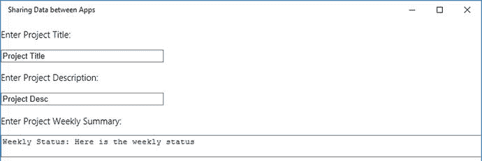

**图 10-1.** 共享数据用户界面

现在，在解决方案资源管理器中右键单击项目的 `js` 文件夹，然后选择**添加** > **新建 JavaScript 文件**。提供文件名。在此示例中，我们将文件命名为 `DataSharingDemo.js`。

```javascript
(function () {
    "use strict";
    function GetControl() {
        WinJS.UI.processAll().done(function () {
            var dataTransferManager = Windows.ApplicationModel.DataTransfer.DataTransferManager.getForCurrentView();
            dataTransferManager.addEventListener("datarequested", shareDataHandler);
        });
    }
    document.addEventListener("DOMContentLoaded", GetControl);
})();
```

同时，将以下代码添加到 `default.html` 中以引用 `DataSharingDemo.js` 文件：

```html
<script src="/js/DataSharingDemo.js"></script>
```

现在，你已经拥有了要共享的数据的用户界面。并且，你已为 `datarequested` 事件添加了事件监听器。共享数据功能最重要的部分是实现填充请求对象的代码。因此，将以下 `shareDataHandler` 函数的代码添加到 `DataSharingDemo.js` 文件中。

```javascript
function shareDataHandler(e) {
    var request = e.request;
    // request.data.properties.title 是必填项
    var ShareInfoTitle = document.getElementById("txttitle").value;
    if (ShareInfoTitle !== "") {
        var ShareInfoDesc = document.getElementById("txtdesc").value;
        if (ShareInfoDesc !== "") {
            request.data.properties.title = ShareInfoTitle;
            request.data.properties.description = ShareInfoDesc;
            var ShareInfoFullText = document.getElementById("txttext").value;
            if (ShareInfoFullText !== "") {
                request.data.setText(ShareInfoFullText);
            }
        } else {
            request.failWithDisplayText("请输入您想要共享的项目详情。");
        }
    } else {
        request.failWithDisplayText("发生错误！！");
    }
}
```

上述代码首先从事件参数中检索请求对象。此函数填充如下：

```javascript
request.data.properties.title = ShareInfoTitle;
request.data.properties.description = ShareInfoDesc;
```

最后，添加以下代码：

```javascript
request.data.setText(ShareInfoFullText);
```

此函数检查标题是否为空，因为请求的标题属性是必填项。

在 Windows 10 上运行应用程序时，你将看到如图 10-2 所示的屏幕。

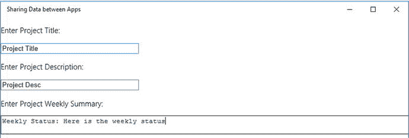

**图 10-2.** 共享数据演示

现在，单击“共享”超级按钮或按 Windows 徽标键  + H。你将看到如图 10-3 所示的屏幕。

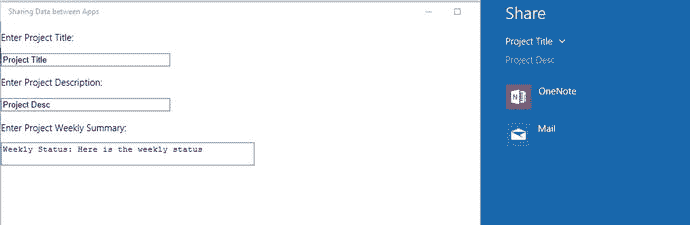

**图 10-3.** 显示项目标题作为共享数据对象的“共享”超级按钮窗口

现在，从列表中单击 OneNote。你将看到如图 10-4 所示的屏幕。

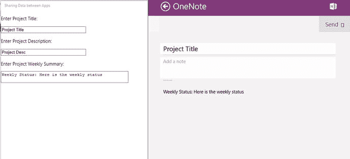

**图 10-4.** OneNote 显示来自通用 Windows 应用的共享数据

## 向其他应用共享 Web 链接

### 问题

你需要开发一项功能，允许用户向其他 Windows 10 应用共享 Web 链接。

### 解决方案

使用 `request.data.setWebLink` 以及标题和描述字段。


### 工作原理

要共享网页链接，你需要使用 `request` 对象的 `request.data.setWebLink()` 方法。

在 Microsoft Visual Studio 2015 中使用 Windows 通用（空白应用）模板创建一个新项目。

首先，将以下代码添加到 `default.html`。你需要用以下代码替换 body 标签：

```
<!DOCTYPE html>
<html>
<head>
    <meta charset="utf-8" />
    <title>_10.3</title>
    <!-- WinJS 引用 -->
    <link href="WinJS/css/ui-dark.css" rel="stylesheet" />
    <script src="WinJS/js/base.js"></script>
    <script src="WinJS/js/ui.js"></script>
    <!-- _10.3 引用 -->
    <link href="/css/default.css" rel="stylesheet" />
    <script src="/js/default.js"></script>
    <script src="/js/DataSharingDemo.js"></script>
</head>
<body class="win-type-body" style="background-color:white">
    <div>
        <p style="color:black">输入项目标题：</p>
        <input class="text-box" id="txttitle" value="项目标题" size="40" />
        <p style="color:black">输入项目描述：</p>
        <input class="text-box" id="txtdesc" value="项目描述" size="40" />
        <p>输入项目站点 URL</p>
        <input class="text-box" id="txtURL" value="输入项目站点 URL" size="40" />
        <br />
        <br />
    </div>
</body>
</html>
```

现在，在解决方案资源管理器中右键单击项目的 `js` 文件夹，然后选择添加 ➤ 新建 JavaScript 文件。为文件命名。在此示例中，我们将文件命名为 `DataSharingDemo.js`。

```
(function () {
    "use strict";
    function GetControl() {
        WinJS.UI.processAll().done(function () {
            var dataTransferManager = Windows.ApplicationModel.DataTransfer.DataTransferManager.getForCurrentView();
            dataTransferManager.addEventListener("datarequested", shareDataHandler);
        });
    }
    document.addEventListener("DOMContentLoaded", GetControl);
})();
```

另外，将以下代码添加到 `default.html` 以引用 `DataSharingDemo.js` 文件：

```
<script src="/js/DataSharingDemo.js"></script>
```

向 `DataSharingDemo.js` 添加一个新的 `shareDataHandler` 函数。完整的 `shareDataHandler` 函数如下所示。以下使用 `request.data.setWebLink()` 函数来设置正在共享的网页链接。

```
function shareDataHandler(e) {
    var request = e.request;
    // request.data.properties.title 是必填项
    var ShareInfoTitle = document.getElementById("txttitle").value;
    if (ShareInfoTitle !== "") {
        var ShareInfoDesc = document.getElementById("txtdesc").value;
        if (ShareInfoDesc !== "") {
            request.data.properties.title = ShareInfoTitle;
            request.data.properties.description = ShareInfoDesc;
            var ShareURL = document.getElementById("txtURL").value;
            if (ShareURL !== "") {
                request.data.setWebLink(new Windows.Foundation.Uri(ShareURL));
            }
        } else {
            request.failWithDisplayText("请输入您要共享的项目详情。");
        }
    } else {
        request.failWithDisplayText("发生错误！！");
    }
}
```

`request.data.setWebLink()` 方法接受一个 URI 类型的参数，这就是为什么在将其传递给函数之前，需要将字符串转换为 `Windows.Foundation.Uri`。

## 10.4 向其他应用共享图像

### 问题

你需要开发一项功能，允许用户与其他 Windows 10 应用共享图像。

### 解决方案

使用 `request.data.setStorageItems` 或 `request.data.setBitmap`，同时附带标题和描述字段。你也可以同时使用这两种方法来共享图像，因为你无法确定目标应用支持哪种方法。


### 工作原理

通用 Windows 应用还允许你与其他应用共享图像。你可以允许用户从本地设备中选择一张图像，然后使用“共享”超级按钮与其他应用共享。让我们看看图像共享的实际操作。

首先，将以下代码添加到 `default.html` 中。你需要用以下代码替换 body 标签：

```
<body class="win-type-body" style="background-color:white">
    <div>
        <p style="color:black">输入项目标题：</p>
        <input class="text-box" id="txttitle" value="项目标题" size="40" />
        <p style="color:black">输入项目描述：</p>
        <input class="text-box" id="txtdesc" value="项目描述" size="40" />
        <p>选择要共享的图像</p>
        <button class="action" id="selectImageButton">选择图像</button>
        <br />
        <br />
    </div>
<div class="imageDiv">
        
    </div>
</body>
```

上述代码定义了一个用于共享图像的用户界面，并包含一个图像选择器按钮。

现在，将以下函数添加到 `DataSharingDemo.js` 文件中。

```
(function () {
    "use strict";
    var objimgFile;
    function GetControl() {
        WinJS.UI.processAll().done(function () {
            var objimgFile = null;
            var dataTransferManager = Windows.ApplicationModel.DataTransfer.DataTransferManager.getForCurrentView();
            dataTransferManager.addEventListener("datarequested", shareDataHandler);
            document.getElementById("selectImageButton").addEventListener("click", selectImage, false);
        });
    }
    document.addEventListener("DOMContentLoaded", GetControl);
})();
```

上述代码为 `selectImageButton` 控件添加了一个侦听器，如粗体行所示。

除了添加侦听器之外，它还声明了一个名为 `objimgFile` 的变量，该变量保存着你将在以下函数中使用的图像对象。

添加一个 `selectImage` 函数，它是“选择图像”按钮点击事件的侦听器。此函数使用 `FileOpenPicker` 方法，允许用户从设备中选择图像。

```
function selectImage() {
    var picker = new Windows.Storage.Pickers.FileOpenPicker();
    picker.fileTypeFilter.replaceAll([".jpg", ".bmp", ".gif", ".png"]);
    picker.viewMode = Windows.Storage.Pickers.PickerViewMode.thumbnail;
    picker.pickSingleFileAsync().done(function (file) {
        if (file) {
// 向用户显示图像
document.getElementById("imageHolder").src = URL.createObjectURL(file, { oneTimeOnly: true });
// 当用户点击“设置”时，imageFile 变量将被设置为 shareValue
         objimgFile = file;
        }
    });
}
```

一旦选择器成功选择了单个文件，它就会调用 `async` 方法，然后设置 `src` 属性。

现在，让我们将 `shareDataHandler()` 方法添加到 `js` 文件中，如下所示：

```
function shareDataHandler(e) {
    var request = e.request;
    // request.data.properties.title 是必需的
    var ShareInfoTitle = document.getElementById("txttitle").value;
    if (ShareInfoTitle !== "") {
        var ShareInfoDesc = document.getElementById("txtdesc").value;
        if (ShareInfoDesc !== "") {
            request.data.properties.title = ShareInfoTitle;
            request.data.properties.description = ShareInfoDesc;
            if (objimgFile != null) {
//创建一个流变量，并使用 randomStreamReference.createFromFile //函数为图像文件对象 "objimgFile" 创建流
                var imageStream = Windows.Storage.Streams.RandomAccessStreamReference.createFromFile(objimgFile);
                request.data.setStorageItems([objimgFile]);
                // setBitmap 方法需要一个流对象
                request.data.setBitmap(imageStream);
            }
        } else {
            request.failWithDisplayText("请输入您要共享的项目详细信息。");
        }
    } else {
        request.failWithDisplayText("发生错误！！");
    }
}
```

`shareDataHandler` 函数首先设置 `request.data` 对象的标题和描述。为了设置图像，它使用了流对象，代码如下：

```
var imageStream = Windows.Storage.Streams.RandomAccessStreamReference.createFromFile(objimgFile);
```

这行代码创建了一个流变量，并使用 `createFromFile` 函数为图像文件 `objimgFile` 对象创建了流。

下一行代码通过传递图像对象来调用 `request.data` 对象的 `setStorageItems` 函数。`objimgfile` 对象已在 `selectImage()` 文件夹中被设置为一个文件。

```
request.data.setStorageItems([objimgFile]);
```

前面代码中的下一行是 `request.data` 对象的 `setBitMap` 方法，它将图像设置到正在共享的数据对象中：

```
// 将流 imageStream 传递给 setBitMap 方法
request.data.setBitmap(imageStream);
```

当你在 Windows 10 上使用“共享”超级按钮功能运行该应用程序时，你会看到“选择图像”按钮，如图 10-5 所示。

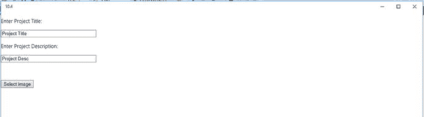

图 10-5.

共享图像演示

点击“选择图像”按钮，从设备相机文件夹或照片文件夹中选择一张图像。选择照片后，你可以在 `default.html` 文件中看到该图像，如图 10-6 所示。

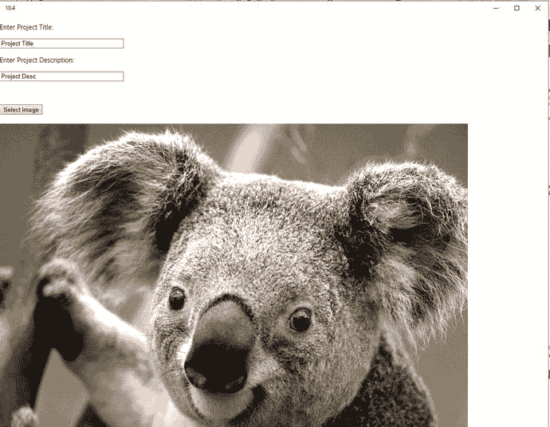

图 10-6.

共享图像演示

现在点击“共享”超级按钮或按 Windows 徽标键  + H。当你从列表中选择 OneNote 时，该应用将与 OneNote 共享数据，你将看到类似图 10-7 所示的屏幕。

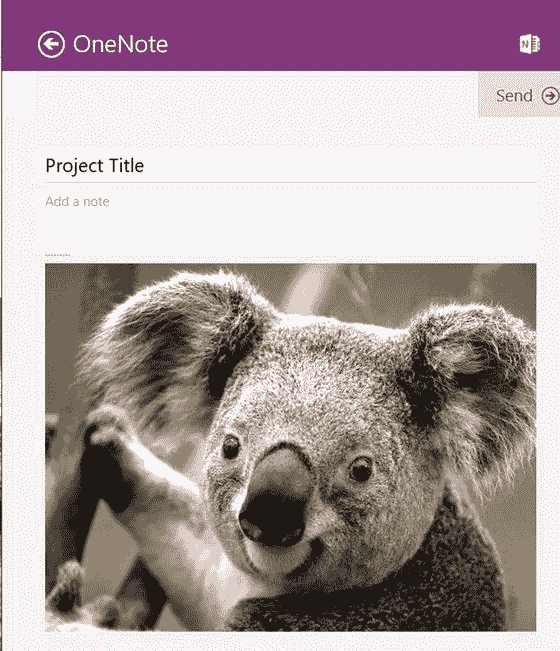

图 10-7.

图像与项目标题一起共享

## 10.5 将应用声明为共享目标

### 问题

你需要将应用声明为当用户使用“共享”超级按钮功能时，列表中显示的一个共享目标。

### 解决方案

在 `package.appxmanifest` 文件中配置共享目标，这会将共享合约启用为共享目标应用。


### 工作原理

当用户使用“共享”超级按钮调用共享功能时，Windows 10 会显示一个可能的目标应用列表。目标共享应用是能够接收其他应用所共享数据的应用。您需要将您的应用声明为目标应用，并实现接收数据、将其存储在正确位置或在屏幕上显示的功能。例如，您有两个应用：一个用于时间管理报告，另一个用于组织内的项目列表。如果您想要将数据从时间管理报告应用共享到项目列表应用，会发生什么？此时，时间管理报告应用将成为源应用，而项目列表应用则是目标应用。

当您将应用声明为可以接收其他应用共享数据的目标应用时，您的应用就遵循了共享合约。通过将应用声明为目标应用，您能为应用的用户提供良好的体验，从而增强与其他应用之间的社交连接性。

如果您想通过共享选项接收其他应用的数据或支持共享合约，则需要将您的应用声明为共享目标。

要将您的应用声明为共享目标，请遵循以下指南：

- 打开清单文件（`package.appxmanifest`），该文件位于项目的根文件夹中。
- 点击“声明”选项卡。
- 在可用的声明中，选择“共享目标”。
- 在屏幕右侧，输入共享描述。
- 点击“新增”来选择数据格式。
- 定义两种数据格式：文本和图像。

声明设置窗口应如图 10-8 所示。

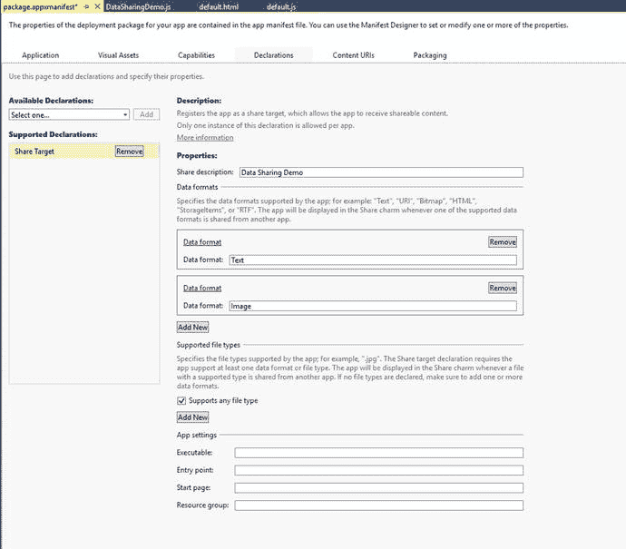

图 10-8.

与项目标题一起共享的图像

当您在 Windows 10 中运行该应用程序并使用“共享”超级按钮功能时，您会看到您的应用出现在列表中，如图 10-9 所示。

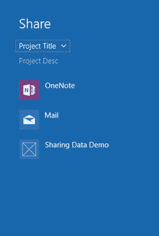

图 10-9.

共享超级按钮窗口

接下来，让我们了解一下共享合约支持的数据类型。表 10-1 列出了使用共享合约进行共享数据时所支持的数据类型。

**表 10-1.** 共享合约中的数据类型

| 数据类型 | 描述 |
| --- | --- |
| 文本 | 纯文本字符串 |
| URI | 一个网页链接（例如 `http://www.apress.com`） |
| 图像 | 位图图像 |
| HTML | HTML 内容 |
| 文件 | 作为存储项目的文件 |
| 自定义数据 | 使用 JSON 格式的自定义数据 |
| 富文本 | 富文本格式化的字符串 |

## 10.6 处理共享激活并接收纯文本

### 问题

您需要作为共享目标应用来处理共享激活。

### 解决方案

当您的应用出现在“共享”超级按钮的目标应用列表中时，用户可以从列表中选择您的应用来共享数据。当用户选择您的应用来共享数据时，会触发 `Application.OnShareTargetActivated` 事件。


### 工作原理

当你的应用被选为数据共享目标时，会触发 [`Application.OnShareTargetActivated`](https://msdn.microsoft.com/en-us/library/windows/apps/windows.ui.xaml.application.onsharetargetactivated.aspx) 事件。你的应用需要实现此事件来接收用户从其他应用共享的数据。

让我们在通用 Windows 应用中实现此事件，以接收来自其他应用的数据。在 Microsoft Visual Studio 2015 中使用 Windows 通用（空白应用）模板创建一个新项目。

首先，将以下代码添加到 `default.html` 中。你需要用以下代码替换 body 标签：

```html
<body class="win-type-body">
    <div>
        <br /><br />
        <div>以下数据来自源应用：</div>
        <br />
        <h3>数据属性</h3>
        <strong>标题：</strong><span id="txttitle" data-win-automationId="Title">（无标题）</span><br />
        <strong>描述：</strong><span id="txtdescription" data-win-automationId="Description">（无描述）</span><br />
        <strong>数据：</strong><span id="txtdata" data-win-automationId="Description">（无数据）</span><br />
    </div>
</body>
```

此代码定义了共享数据演示的用户界面。该用户界面外观如图 10-10 所示。

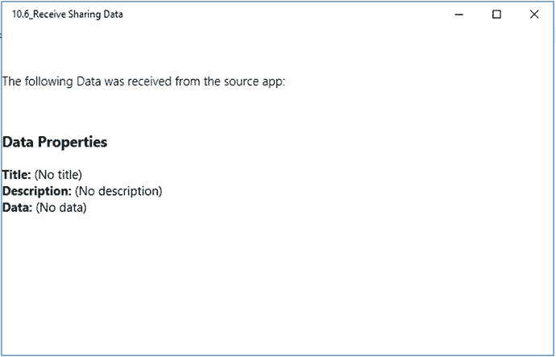

**图 10-10.** 共享超级按钮窗口

现在，在解决方案资源管理器中右键单击项目，然后选择 **添加 ➤ 新建 JavaScript 文件**。为文件命名。在本示例中，我们将文件命名为 `DataSharingDemo.js`。

```javascript
(function () {
    "use strict";
    function GetControl() {
        WinJS.UI.processAll().done(function () {
            // 初始化激活处理程序
            WinJS.Application.addEventListener("activated", activatedShareHandler, false);
        });
    }
    document.addEventListener("DOMContentLoaded", GetControl);
})();
```

上述代码为应用程序对象添加了一个 `activated` 事件侦听器。名为 `activatedShareHandler` 的事件侦听器函数如下所示；请将此函数添加到 `js` 文件中。

```javascript
/// <summary>
/// 处理激活的函数
/// </summary>
/// <param name="eventArgs">
/// 事件参数。对于共享合约，它包含 ShareOperation
/// </param>
function activatedShareHandler(eventObject) {
    // 检查本次共享是否由共享合约触发
    if (eventObject.detail.kind === Windows.ApplicationModel.Activation.ActivationKind.shareTarget) {
        eventObject.setPromise(WinJS.UI.processAll());
        // 使用 eventObject 事件参数初始化 ShareOperation 对象
        shareOperation = eventObject.detail.shareOperation;
        // 检查 shareOperation 是否启用了文本共享，或是否使用了文本共享数据
        if (shareOperation.data.contains(Windows.ApplicationModel.DataTransfer.StandardDataFormats.text)) {
            shareOperation.data.getTextAsync().done(function (text) {
                dispReceivedContent(text);
            }, function (e) {
                displayError("文本：", "检索数据时出错：" + e);
            });
        }
    }
}
```

上述代码接收 `activatedShareHandler` 事件侦听器的共享数据。此代码首先检查共享是否由共享合约触发。然后，它从事件参数创建一个 `shareOperation` 对象，如下所示：

```javascript
// 使用 eventObject 事件参数初始化 ShareOperation 对象
        shareOperation = eventObject.detail.shareOperation;
```

接着，代码使用 `shareOperation.data.getTextAsync` 函数异步获取文本。在异步调用的成功方法中，接收到的文本被传递给 `dispReceivedContent()` 函数，该函数随后在目标应用上显示文本。以下是显示共享内容函数的代码：

```javascript
function dispReceivedContent(content) {
    document.getElementById("txttitle").innerText = shareOperation.data.properties.title;
    document.getElementById("txtdescription").innerText = shareOperation.data.properties.description;
    document.getElementById("txtdata").innerText = content;
}
```

`DataSharingDemo.js` 文件的完整代码如下所示：

```javascript
(function () {
    "use strict";
    function GetControl() {
        WinJS.UI.processAll().done(function () {
            // 初始化激活处理程序
            WinJS.Application.addEventListener("activated", activatedShareHandler, false);
        });
    }
    document.addEventListener("DOMContentLoaded", GetControl);
})();

/// <summary>
/// 处理激活的函数
/// </summary>
/// <param name="eventArgs">
/// 事件参数。对于共享合约，它包含 ShareOperation
/// </param>
function activatedShareHandler(eventObject) {
    // 检查本次共享是否由共享合约触发
    if (eventObject.detail.kind === Windows.ApplicationModel.Activation.ActivationKind.shareTarget) {
        eventObject.setPromise(WinJS.UI.processAll());
        // 使用 eventObject 事件参数初始化 ShareOperation 对象
        shareOperation = eventObject.detail.shareOperation;
        // 检查 shareOperation 是否启用了文本共享，或是否使用了文本共享数据
        if (shareOperation.data.contains(Windows.ApplicationModel.DataTransfer.StandardDataFormats.text)) {
            shareOperation.data.getTextAsync().done(function (text) {
                dispReceivedContent(text);
            }, function (e) {
                displayError("文本：", "检索数据时出错：" + e);
            });
        }
    }
}

function dispReceivedContent(content) {
    document.getElementById("txttitle").innerText = shareOperation.data.properties.title;
    document.getElementById("txtdescription").innerText = shareOperation.data.properties.description;
    document.getElementById("txtdata").innerText = content;
}
```

当你在 Windows 10 中运行源应用时（我们正在运行我们在 10.2 节中开发的另一个应用），你会看到如图 10-11 所示的界面。

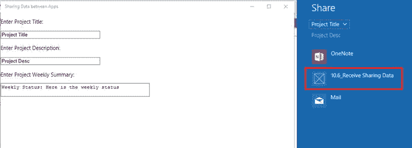

**图 10-11.** 显示目标应用的共享超级按钮窗口

如图 10-11 所示，应用 **10.6_ 接收共享数据** 被列在应用的共享超级按钮共享目标列表中。当你选择该应用时，你会看到从源应用共享的数据（标题、描述和文本），如图 10-12 中突出显示的部分。

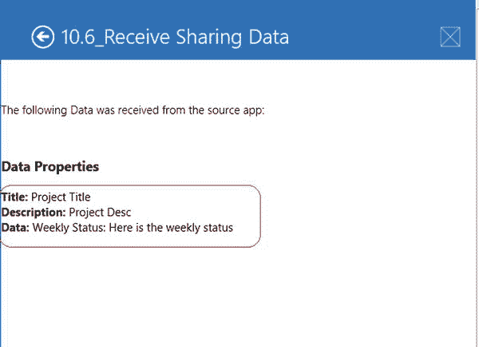

**图 10-12.** 显示目标应用的共享超级按钮窗口

## 10.7 接收其他应用共享的图像

### 问题

你需要开发一个功能，允许用户接收另一个 Windows 10 应用共享的图像。

### 解决方案

使用 `shareOperation.data.getBitmapAsync` 接收其他应用共享的图像。


### 工作原理

如配方 10.4 所示，源应用也可以与其他应用共享图像。要共享位图图像，源应用使用 `request.data.setBitmap(imageStream)` 方法，通过传递图像流将位图图像设置到要共享的请求对象中。

为了接收位图图像，目标应用使用数据包视图的 `shareOperation.data.getBitmapAsync()` 方法。接收位图图像的完整代码如下所示：

```
// 使用 eventObject 事件参数初始化 ShareOperation 对象
shareOperation = eventObject.detail.shareOperation;

if (shareOperation.data.contains(Windows.ApplicationModel.DataTransfer.StandardDataFormats.bitmap)) {
    shareOperation.data.getBitmapAsync().done(function (bitmapStreamReference) {
        bitmapStreamReference.openReadAsync().done(function (bitmapStream) {
            if (bitmapStream) {
                document.getElementById("imageHolder").src = URL.createObjectURL(bitmapStream, { oneTimeOnly: true });
            }
        }, function (e) {
            displayError("Bitmap: ", "读取图像流时出错: " + e);
        });
    }, function (e) {
        displayError("Bitmap: ", "获取数据时出错: " + e);
    });
}
```

此代码首先检查 `shareOperation` 对象是否包含位图图像。然后调用 `getBitmapAsync()` 方法从请求对象接收图像。最后，在异步调用的成功方法中，调用另一个异步方法 `bitmapStreamReference.openReadAsync()` 来读取流对象。`openReadAsync` 返回流对象。`URL.createObjectURL(bitmapStream, { oneTimeOnly: true })` 这行代码随后创建该对象的 URL，并将其分配给 `imageHolder` 作为 HTML `img` 标签的源。

现在，我们在一个通用 Windows 应用中实现这个事件，以接收来自其他应用的位图。

在 Microsoft Visual Studio 2015 中使用 Windows 通用（空白应用）模板创建一个新项目。

首先，将以下代码添加到 `default.html` 中。你需要用以下代码替换 body 标签：

```
<body class="win-type-body" style="background-color:white" >
    <div>
        <br /><br />
        <div><p style="color:black">以下数据来自源应用:</p></div>
        <br />
        <h3 style="color:black">数据属性</h3>
        <strong style="color:black">标题: </strong><span id="txttitle" data-win-automationId="Title" style="color:black">(无标题)</span><br />
        <strong style="color:black">描述: </strong><span id="txtdescription" data-win-automationId="Description" style="color:black">(无描述)</span><br />
        <strong style="color:black">数据: </strong><span id="txtdata" data-win-automationId="Description" style="color:black">(无数据)</span><br />
        <div class="imageDiv">
            
        </div>
    </div>
</body>
```

现在，在解决方案资源管理器中右键单击项目，选择添加 ➤ 新建 JavaScript 文件。为文件命名。在本例中，我们将文件命名为 `DataSharingDemo.js`。

```
(function () {
    "use strict";
    function GetControl() {
        WinJS.UI.processAll().done(function () {
            // 初始化激活处理程序
            WinJS.Application.addEventListener("activated", activatedHandler, false);
        });
    }
    document.addEventListener("DOMContentLoaded", GetControl);
})();
```

上述代码为应用程序对象添加了一个名为 `activated` 的事件侦听器。以下是名为 `activatedShareHandler` 的事件侦听器函数。将此代码添加到 `js` 文件中。

```
/// <summary>
/// 处理激活的函数
/// </summary>
/// <param name="eventArgs">
/// 事件参数。在共享合约的情况下，它包含 ShareOperation
/// </param>
function activatedShareHandler(eventObject) {
    // 检查共享合约是否是此次共享的原因
    if (eventObject.detail.kind === Windows.ApplicationModel.Activation.ActivationKind.shareTarget) {
        eventObject.setPromise(WinJS.UI.processAll());
        // 使用 eventObject 事件参数初始化 ShareOperation 对象
        shareOperation = eventObject.detail.shareOperation;
        if (shareOperation.data.contains(Windows.ApplicationModel.DataTransfer.StandardDataFormats.bitmap)) {
            shareOperation.data.getBitmapAsync().done(function (bitmapStreamReference) {
                bitmapStreamReference.openReadAsync().done(function (bitmapStream) {
                    if (bitmapStream) {
                        document.getElementById("imageHolder").src = URL.createObjectURL(bitmapStream, { oneTimeOnly: true });
                    }
                }, function (e) {
                    displayError("Bitmap: ", "读取图像流时出错: " + e);
                });
            }, function (e) {
                displayError("Bitmap: ", "获取数据时出错: " + e);
            });
        }
    }
}
```

最后，使用 `package.appxmanifest` 将此应用声明为目标应用，如图 10-13 所示。

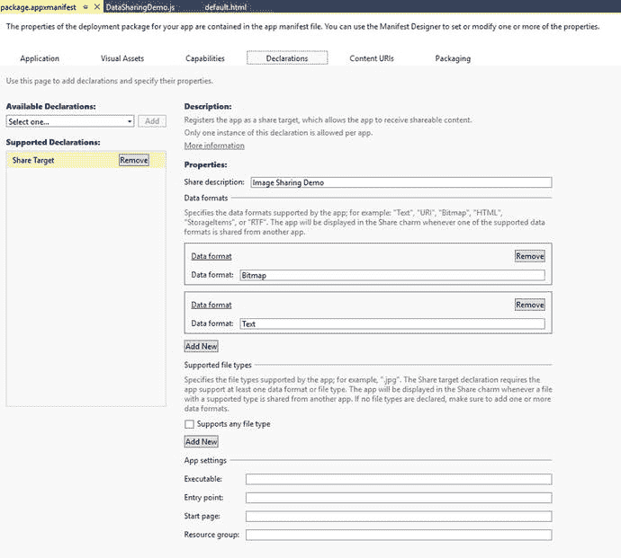

图 10-13. 显示目标应用的共享超级按钮窗口

就是这样。现在，使用 Visual Studio 中的项目部署菜单部署该应用。

你无需运行此应用即可接收图像，因为它是一个已注册的目标应用。共享超级按钮会在共享超级按钮窗口中将此应用列为目标应用，当用户从列表中选择该应用时，将为此应用激活一个新实例。激活事件将被调用，进而接收源应用共享的图像。

## 10.8 共享自定义数据类型

### 问题

你需要开发一个功能，允许用户共享自定义数据格式，例如人物的姓名和职位。

### 解决方案

使用 `request.data.setData` 函数，如下所示：

```
request.data.setData("Schema", "ObjectName");
```


### 工作原理

共享合约还允许开发者构建应用来共享自定义格式的数据，例如用于书籍（书名、出版商、作者姓名等）或人物（包含姓名、职位、头像等属性）的数据格式。

在 Windows 10 通用 Windows 应用中支持的自定义格式，可以基于 [`http://schema.org`](http://schema.org) 定义的架构，例如 [`http://schema.org/person`](http://schema.org/person) 或 [`http://schema.org/Book`](http://schema.org/Book)。`setData` 方法接受两个参数，如下所示：

`request.data.setData("http://schema.org/Person", person);`

第一个参数是架构格式 ID，第二个参数是对象本身。

接下来，让我们在一个通用 Windows 应用中实现共享自定义数据。

使用 Microsoft Visual Studio 2015 中的 Windows 通用（空白应用）模板创建一个新项目。

首先，在 `default.html` 中添加以下代码。你需要用以下代码替换 `body` 标签：

```html
<body class="win-type-body" style="background-color:white">
    <div>
        <p style="color:black">输入人物姓名：</p>
        <input class="text-box" id="txttitle" value="姓名" size="40" />
        <p style="color:black">输入人物职位：</p>
        <input class="text-box" id="txtjobtitle" value="职位" size="40" />
        <p style="color:black">输入电话号码：</p>
        <input class="text-box" id="txtphone" value="电话" size="40" />
        <br />
        <br />
    </div>
</body>
```

现在，在解决方案资源管理器中右键单击项目，然后选择 **添加 > 新建 JavaScript 文件**。为文件提供名称。在此示例中，让我们将文件命名为 `DataSharingDemo.js`。

```javascript
(function () {
    "use strict";

    function GetControl() {
        WinJS.UI.processAll().done(function () {
            var dataTransferManager = Windows.ApplicationModel.DataTransfer.DataTransferManager.getForCurrentView();
            dataTransferManager.addEventListener("datarequested", shareDataHandler);
        });
    }

    document.addEventListener("DOMContentLoaded", GetControl);
})();
```

通过复制以下代码来实现 `shareDataHandler` 函数：

```javascript
function shareDataHandler(e) {
    var request = e.request;
    
    // request.data.properties.title 是必需的
    var name = document.getElementById("txttitle").value;
    var person = {
        "type": "http://schema.org/Person",
        "properties":
        {
            "name": name,
            "jobtitle": document.getElementById("txtjobtitle").value
        }
    };
    person = JSON.stringify(person);
    request.data.properties.title = name;
    request.data.properties.description = name;
    request.data.setData("http://schema.org/Person", person);
}
```

前面函数中的代码实现了自定义数据的共享。`person` 对象被定义为一个 JSON 字符串，用于设置姓名和职位等属性，因为 `schema.org` 同时支持 JSON 和 XML 格式。

现在让我们创建另一个项目，并实现接收自定义数据的代码。

使用 Microsoft Visual Studio 2015 中的 Windows 通用（空白应用）模板创建一个新项目。

首先，将以下代码添加到 `default.html` 中。你需要用以下代码替换 `body` 标签。

```html
<body class="win-type-body">
    <textarea class="text-box" id="txtconent" rows="4" cols="50" />
    <br />
    <br />
</body>
```

现在，在解决方案资源管理器中右键单击项目，然后选择 **添加 > 新建 JavaScript 文件**。为文件提供名称。在此示例中，让我们将文件命名为 `DataSharingDemo.js`。

```javascript
(function () {
    "use strict";

    function GetControl() {
        WinJS.UI.processAll().done(function () {
            // 初始化激活处理程序
            WinJS.Application.addEventListener("activated", activatedShareHandler, false);
        });
    }

    document.addEventListener("DOMContentLoaded", GetControl);
})();
```

通过复制以下代码来实现 `activatedShareHandler` 函数：

```javascript
function activatedShareHandler(eventObject) {
    if (eventObject.detail.kind === Windows.ApplicationModel.Activation.ActivationKind.shareTarget) {
        eventObject.setPromise(WinJS.UI.processAll());
        
        // ShareOperation 对象使用 eventObject 事件参数进行初始化
        shareOperation = eventObject.detail.shareOperation;
        
        if (shareOperation.data.contains("http://schema.org/Person")) {
            shareOperation.data.getTextAsync("http://schema.org/Person").done(function (customFormatString) {
                var customFormatObject = JSON.parse(customFormatString);
                if (customFormatObject) {
                    // 此示例期望自定义格式的类型为 http://schema.org/Person
                    if (customFormatObject.type === "http://schema.org/Person") {
                        customFormatString = "类型: " + customFormatObject.type;
                        if (customFormatObject.properties) {
                            customFormatString += "\n 姓名: " + customFormatObject.properties.name;
                            customFormatString += "\n 职位: " + customFormatObject.properties.jobtitle;
                        }
                    }
                }
                document.getElementById("txtconent").value = customFormatString;
            }, function (e) {
            });
        }
    }
}
```

此代码首先检查事件是否是为共享操作触发的。然后它初始化 `shareOperation = eventObject.detail.shareOperation`。接着检查 `shareOperation.data.contains("http://schema.org/Person")`。如果包含 Person 对象，则调用 `shareOperation.data.getTextAsync` 方法来检索自定义数据属性。在成功方法中，它将 JSON 字符串解析到一个变量中，如下所示：

`var customFormatObject = JSON.parse(customFormatString);`

最后，它读取这些属性并将其显示在文本区域中。你需要使用 Visual Studio 的部署选项来部署此应用。

现在运行共享自定义数据的应用。你将看到一个屏幕，如图 10-14 所示。

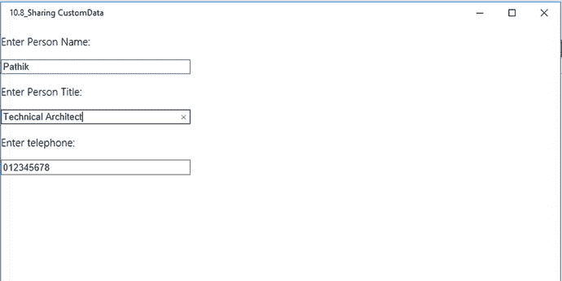

**图 10-14.** 共享自定义数据格式的应用 UI

现在点击 **共享** 超级按钮或按 Windows 徽标键  + H。当你从列表中选择 **10.7B_ReceiveCustom_data** 应用时，你会看到如图 10-15 所示的屏幕。

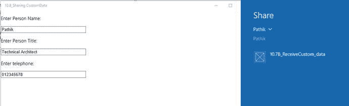

**图 10-15.** 共享超级按钮中用于接收自定义数据的接收器应用

当你选择该应用时，你会在共享超级按钮窗口中看到接收器应用的用户界面，如图 10-16 所示。

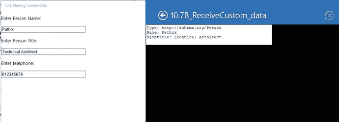

**图 10-16.** 显示了接收到的自定义数据的接收器应用

---

