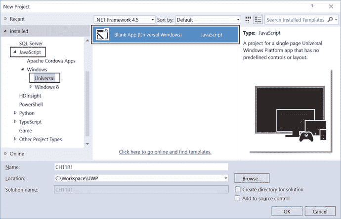
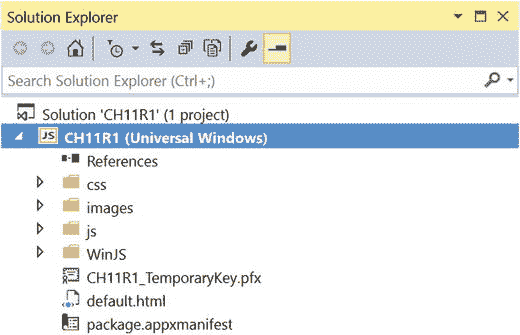

# 第 11 章：后台任务

在任何应用中，你可能都需要在后台静默地执行某些任务。通用 Windows 平台提供了 **后台任务** 功能，让你可以在后台运行代码。后台任务本质上就是一个由操作系统在后台运行的 JavaScript 文件。后台任务通常针对你可以订阅的系统触发器来运行。后台任务需要在应用的任务清单中声明。后台任务可以通过特定事件向应用报告进度、完成和取消状态。

## 11.1 用于后台任务的系统事件触发器

### 问题

你已经决定在你的应用中实现一个后台任务。你想了解可以订阅哪些不同的系统事件触发器，并在该触发器发生时运行后台任务。


### 解决方案

系统事件通过一个名为 `SystemTrigger` 的系统级触发器对象提供。创建新的后台任务时，你需要让操作系统知道要订阅哪个系统触发器。创建 `SystemTrigger` 的新实例，并在构造函数中传递触发器类型。触发器类型在 `SystemTriggerType` 枚举中定义。表 11-1 列出了这些触发器及其描述。

表 11-1. 系统触发器类型

| 触发器名称 | 描述 |
| --- | --- |
| `InternetAvailable` | 网络变为可用 |
| `NetworkStateChange` | 网络状态发生变化 |
| `OnlineIdConnectedStateChange` | 与账户关联的在线 ID 发生变化 |
| `SmsReceived` | 收到新的短信 |
| `TimeZoneChange` | 设备上的时区发生变化 |

## 创建并注册后台任务

### 问题

你想为应用创建一个后台任务，并在操作系统中注册它。

### 解决方案

使用 `Windows.ApplicationModel.Background` 命名空间中的 `BackgroundTaskBuilder` 来创建新的后台任务并注册它。


### 工作原理

打开 Visual Studio 2015 Community 版本。选择“文件” ➤ “新建项目”。在“新建项目”对话框中，从“已安装模板”区域选择“模板” ➤ “JavaScript” ➤ “Windows” ➤ “通用”（参见图 11-1）。从可用的项目模板中选择“空白应用（通用 Windows）”。为应用提供名称和位置，然后单击“确定”。



图 11-1.

“新建项目”对话框 Visual Studio 会准备项目，完成后将如图 11-2 所示。



图 11-2.

解决方案资源管理器 在你的 `js` 文件夹中创建一个新的 JavaScript 文件。让我们将文件命名为 `mytask.js`。此 `js` 文件包含你想要执行的后台工作/任务的逻辑。你将使用此 `js` 文件的文件名来注册任务，因此请记下该文件名。

以下是 `mytask.js` 文件的骨架代码：

```
(function () {
    "use strict";
    //获取后台任务的当前实例
    var backgroundTaskInstance = Windows.UI.WebUI.WebUIBackgroundTaskInstance.current;
    var canceled = false,
        settings = Windows.Storage.ApplicationData.current.localSettings,
        key = backgroundTaskInstance.task.name;
    backgroundTaskInstance.addEventListener("canceled", OnCanceled);
    //检查后台任务是否被用户取消。
    if (!canceled) {
        doWork();
    }
    else {
        settings.values[key] = "Canceled";
        close();
    }
    //作为后台任务一部分执行主要工作的函数
    function doWork() {
        settings.values[key] = "Starting"
        //你的后台工作代码
        //...
        settings.values[key] = "Succeeded";
        settings.values[key] = "Closing";
        //任务完成后调用 close
        close();
    }
    function OnCanceled(sender, reason) {
        canceled = true;
    }
})();
```

让我们过一遍代码。你使用 `WebUIBackgroundTaskInstance.current` 属性获取后台任务的一个实例。然后，你为后台任务的取消附加一个已取消事件处理程序。接着，你定义一个 `doWork()` 函数，该函数作为后台任务的一部分执行实际工作。你利用 `localSettings` 并更新任务的状态，以便主应用可以读取该状态并在 UI 上执行任何更新。请注意对 `close()` 函数的调用；后台任务应在完成工作后调用此函数。接下来，你注册刚刚创建的任务。

在 `default.js` 中，应用激活后，注册你刚刚创建的 `mytask.js` 后台任务。以下是注册任务所涉及的步骤。使用 `BackgroundTaskRegistration.allTasks` 属性遍历所有任务。检查你的任务是否已注册非常重要。如果你不检查这一点而盲目注册，后台任务将被多次注册，这可能导致意外结果。以下是执行此操作的代码片段：

```
var task = null,
    taskRegistered = false,
    background = Windows.ApplicationModel.Background,
    iter = background.BackgroundTaskRegistration.allTasks.first();
while (iter.hasCurrent) {
    task = iter.current.value;
    if (task.name === exampleTaskName) {
        taskRegistered = true;
        break;
    }
    iter.moveNext();
}
```

如果任务尚未注册，则使用 `BackgroundTaskBuilder` 类执行注册。你需要设置触发任务的系统触发器。在此示例中，你监听 `timeZoneChange` 作为后台任务的触发器。以下是代码片段：

```
if (taskRegistered != true)
{
    var builder = new
    Windows.ApplicationModel.Background.BackgroundTaskBuilder();
    var trigger = new Windows.ApplicationModel.Background.SystemTrigger(
    Windows.ApplicationModel.Background.SystemTriggerType.timeZoneChange, false);
    builder.name = exampleTaskName;
    builder.taskEntryPoint = "js\\mytask.js";
    builder.setTrigger(trigger);
    task = builder.register();
}
```

接下来，你需要处理任务完成。在任务本身上添加一个已完成事件处理程序。以下是代码片段：

```
task.addEventListener("completed", function (args) {
    var settings = Windows.Storage.ApplicationData.current.localSettings;
    var key = args.target.name;
    settings.values[key] = "Completed";
});
```

以下是注册后台任务的完整代码片段：

```
app.onactivated = function (args) {
    if (args.detail.kind === activation.ActivationKind.launch) {
        if (args.detail.previousExecutionState !==
            activation.ApplicationExecutionState.terminated) {
            var task = null,
                taskRegistered = false,
                background = Windows.ApplicationModel.Background,
                iter = background.BackgroundTaskRegistration.allTasks.first();
            while (iter.hasCurrent) {
                task = iter.current.value;
                if (task.name === exampleTaskName) {
                    taskRegistered = true;
                    break;
                }
                iter.moveNext();
            }
            if (taskRegistered != true) {
                var builder = new Windows.ApplicationModel.Background.BackgroundTaskBuilder();
                var trigger = new Windows.ApplicationModel.Background.SystemTrigger(
                Windows.ApplicationModel.Background.SystemTriggerType.timeZoneChange, false);
                builder.name = exampleTaskName;
                builder.taskEntryPoint = "js\\mytask.js";
                builder.setTrigger(trigger);
                task = builder.register();
            }
            task.addEventListener("completed", function (args) {
                var settings = Windows.Storage.ApplicationData.current.localSettings;
                var key = args.target.name;
                settings.values[key] = "Completed";
            });
        } else {
        }
        args.setPromise(WinJS.UI.processAll());
    }
};
```

接下来，你需要在应用程序清单文件中为后台任务添加声明。双击位于应用程序根目录的 `package.appxmanifest` 以打开清单文件。

单击“声明”选项卡。从可用的声明下拉列表中选择“后台任务”。单击“添加”按钮添加声明。

在“支持的任务类型”区域，选择“系统事件”。

在“应用设置”区域，在“起始页”条目下，添加 `js\mytask.js` 作为值。

保存包清单文件。

通过上述代码，你创建了一个自定义后台任务并将其注册到操作系统。你使用了一个系统触发事件，即时区更改事件，来运行该任务。按 F5 运行应用，然后更改系统的时区设置。时区更改后，后台任务将立即触发。

## 11.3 设置后台任务的运行条件

### 问题

你想要创建并注册一个自定义后台任务。但你希望仅当满足特定条件时才运行后台任务；例如，用户存在或用户不存在，等等。


### 解决方案

后台任务仅在设定的触发器触发时运行。如前一则解决方案所示，你在创建任务时提供了触发器。如果你的任务需要满足特定条件（即使系统触发器已被触发），你可以创建一个系统条件，并在任务注册期间将其提供给任务生成器。条件通过 `SystemConditionType` 枚举提供。表 11-2 描述了 UWP 上可用的系统条件类型。

**表 11-2.** 系统条件类型

| 触发器名称 | 值 | 描述 |
| --- | --- | --- |
| `invalid` | 0 | 非有效的条件类型 |
| `userPresent` | 1 | 仅当用户在场时任务可运行 |
| `userNotPresent` | 2 | 仅当用户不在场时任务可运行 |
| `InternetAvailable` | 3 | 仅当互联网可用时任务可运行 |
| `internetNotAvailable` | 4 | 仅当互联网不可用时任务可运行 |
| `sessionConnected` | 5 | 仅当用户会话已连接时任务可运行 |
| `sessionDisconnected` | 6 | 仅当用户会话已断开时任务可运行 |
| `freeNetworkAvailable` | 7 | 仅当免费网络（非按流量计费）可用时任务可运行 |
| `backgroundWorkCostNotHigh` | 8 | 仅当后台工作成本较低时任务可运行 |

### 实现原理

让我们学习如何在任务上设置系统条件。

创建一个 `SystemCondition` 对象。在注册任务之前，需要构建后台任务运行所需的应用条件。你需要创建一个 `SystemCondition` 对象来表示该条件。`SystemCondition` 对象的构造函数需要 `SystemConditionType` 枚举值，该值表示在运行任务前需要满足的条件。以下是提供条件的代码片段：

```
var internetConditionType = Windows.ApplicationModel.Background.SystemConditionType.InternetAvailable;
var internetCondition = new Windows.ApplicationModel.Background.SystemCondition(internetConditionType);
```

将 `SystemCondition` 对象添加到后台任务。构建系统条件后，下一步是将其添加到任务生成器中。`BackgroundTaskBuilder` 提供了一个用于设置条件的 `AddCondition()` 方法。以下是添加条件的代码片段：

```
taskBuilder.AddCondition(internetCondition);
```

接下来，使用 TaskBuilder 的 `Register()` 方法注册任务。以下是任务注册的代码片段：

```
var task = builder.Register();
```

## 11.4 监控后台任务进度与完成

### 问题

你的应用创建并注册了一个后台任务。你希望监控该任务在应用中的进度和完成情况。

### 解决方案

已在系统中注册的任务会触发进度和完成事件。你的应用需要提供事件处理程序，并订阅任务公开的事件。

### 实现原理

处理任务完成。首先，你需要创建一个函数，用于附加到后台任务的 `Completion` 事件上。该函数接收一个 `BackgroundTaskCompletedEventArgs` 类型的参数。以下是函数的基本结构：

```
function onCompleted(args){
    //处理任务完成的代码
}
```

接下来，你需要将该函数注册到后台任务中。以下是实现此操作的代码片段：

```
task = builder.register();
task.addEventListener("completed", onCompleted);
```

将所有需要在任务完成时执行的代码放入 `onCompleted` 函数中。

处理任务进度。与完成事件类似，任务也会触发进度事件。你需要编写一个函数，用于附加到后台任务的进度事件上。通过订阅进度事件，每当任务触发进度事件时，都会调用附加到该事件的函数。任何进度报告流程都可以在该函数中编写。该函数接收两个参数：一个 `IBackgroundTaskRegistration` 对象和一个 `BackgroundTaskProgressEventArgs` 对象。以下是处理进度事件的函数基本结构：

```
function onProgress(task, args){
    //在此处添加执行进度相关流程的代码
}
```

接下来，你需要将该函数注册到后台任务的进度事件上。以下是注册函数的代码片段：

```
task = builder.register();
task.addEventListener("progress", onProgress);
```

