# 第 12 章：Windows 应用中的位置与地图

构建 Windows 应用的开发者可以利用 Windows 设备的功能，将位置和地图集成到其应用中。在本章中，你将学习如何在通用 Windows 运行时应用中使用位置 API 的解决方案。

## 12.1 获取当前位置

### 问题

你不知道自己在哪里。Windows 应用需要确定并显示你的当前位置。

### 解决方案

使用 `Windows.Devices.Geolocation` 命名空间中定义的 `Geolocator` 类的 `getGeopositionAsync` 方法，从基于 Windows 10 的设备获取当前位置。


### 工作原理

使用通用 Windows 模板创建一个新的通用 Windows 项目，该模板位于 Microsoft Visual Studio 2015 的新建项目对话框中的 **JavaScript ➤ Windows ➤ Universal** 节点下。这会在 Visual Studio 解决方案中创建一个项目，其中包含开始所需的必要文件。

在应用中集成定位功能的第一步是在项目的 `package.appxmanifest` 文件中声明定位功能。在 Visual Studio 解决方案资源管理器中，双击 `package.appxmanifest` 文件。在 GUI 设计器中，单击“功能”选项卡并选择“位置”，如图 12-1 所示。

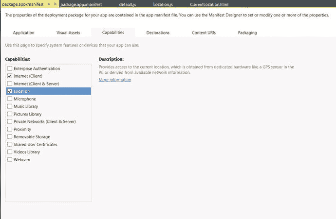

图 12-1. Visual Studio 中的“功能”选项卡

打开项目中的 `default.html` 文件，并在每个文件的 `body` 标签下添加以下代码：

```
<div>
    <p>获取当前位置</p>
    <br />
    <button id="btnLocation">获取位置</button> <br />
</div>
<br />
<div>
    <table>
        <tr>
            <td>
                纬度
            </td>
            <td >
                <div id="latitude">
                </div>
            </td>
        </tr>
        <tr>
            <td>
                经度
            </td>
            <td>
                <div id="longitude">
                </div>
            </td>
        </tr>
        <tr>
            <td>
                精度
            </td>
            <td>
                <div id="accuracy">
                </div>
            </td>
        </tr>
    </table>
</div>
```

打开项目中的 `default.js` (`/js/default.js`) 文件，并将文件中的代码替换为以下内容：

```
// 有关空白模板的简介，请参阅以下文档：
// http://go.microsoft.com/fwlink/?LinkID=392286
(function () {
    "use strict";
    var app = WinJS.Application;
    var activation = Windows.ApplicationModel.Activation;
    app.onactivated = function (args) {
        if (args.detail.kind === activation.ActivationKind.launch) {
            if (args.detail.previousExecutionState !== activation.ApplicationExecutionState.terminated) {
            } else {
            }
            args.setPromise(WinJS.UI.processAll().
               done(function ()
               {
                   // 为按钮添加事件处理程序。
                   document.querySelector("#btnLocation").addEventListener("click",
                       getLocation);
               }));
        }
    };
    var geolocation = null;
    function getLocation()
    {
        if (geolocation == null) {
            geolocation = new Windows.Devices.Geolocation.Geolocator();
        }
        if (geolocation != null) {
            geolocation.getGeopositionAsync().then(getPosition);
        }
    }
    function getPosition(position)
    {
        document.getElementById('latitude').innerHTML = position.coordinate.point.position.latitude;
        document.getElementById('longitude').innerHTML = position.coordinate.point.position.longitude;
        document.getElementById('accuracy').innerHTML = position.coordinate.accuracy;
    }
    app.oncheckpoint = function (args) {
    };
    app.start();
})();
```

`document.querySelector` 用于为 `btnLocation` 元素添加点击事件处理程序。点击该按钮时，将调用 `getLocation` 方法。

要获取当前位置信息，请创建在 `Windows.Devices.Geolocation` 命名空间中定义的 `Geolocator` 类的实例，然后调用 `Geolocator` 类的 `getGeopositionAsync` 方法。获取位置后，需要定义一个操作方法，以便执行一组特定的操作。如上述代码片段所示，`getPosition` 方法负责此操作。参数 `position` 的类型是 `Geolocation`，可用于获取当前位置信息，例如纬度、经度、精度等。

下一步是构建项目并在模拟器或本地计算机上运行它。选择“生成”菜单，然后从 Visual Studio 中选择“生成解决方案”来构建项目。在 Visual Studio 标准工具栏上，从“运行”下拉菜单中选择“移动设备模拟器”。

当你在 Windows 上首次运行该应用时，系统会提示你确认是否允许使用你的位置。单击“允许”，以便应用可以使用位置信息。

在应用程序中，单击“获取位置”按钮以显示当前位置的纬度和经度，如图 12-2 所示。

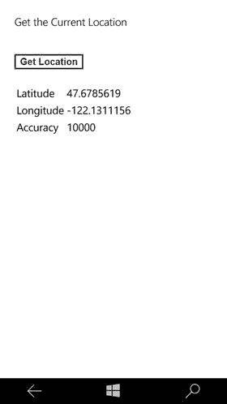

图 12-2. Windows 移动应用中的当前位置

当你在本地计算机上点击该应用时，会收到一条消息提示，如图 12-3 所示。单击“允许”按钮。这将显示当前位置（见图 12-4）。

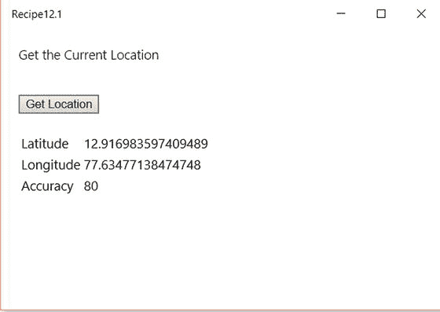

图 12-4. Windows 桌面系列应用中的当前位置

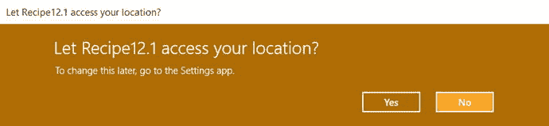

图 12-3. Windows 桌面系列应用中的允许当前位置提示

**注意**  
请确保在您的 Windows 设备上启用了定位服务，以便获取当前位置。

## 12.2 响应地理定位器位置更新

### 问题

您希望频繁检查应用内位置是否发生变化。

### 解决方案

使用在 `Windows.Devices.Geolocation` 命名空间中定义的 `Geolocator` 类的 `getGeopositionAsync` 方法。订阅 `PositionChanged` 和 `LocationChanged` 事件，以跟踪位置变化，并从 Windows 移动版或桌面系列应用做出响应。


### 工作原理

使用通用 Windows 模板创建一个新的通用 Windows 项目，该模板可在 Microsoft Visual Studio 2015 的“新建项目”对话框中的 `JavaScript` > `Windows` > `Universal` 节点下找到。这会在 Visual Studio 解决方案中创建一个单一项目，其中包含入门所需的必要文件。

在项目中的 `package.appxmanifest` 文件中启用 `Location` 功能。

从 Visual Studio 解决方案资源管理器中打开 `default.html` 文件，然后在每个文件的 `body` 标签下添加以下代码。

```html
<div>
    <button id="start">开始追踪</button><br />
    <br />
    <button id="stop">停止追踪</button><br />
</div>
<br />
<div>
    <table>
        <tr>
            <td>
                纬度
            </td>
            <td>
                <div id="latitude">
                </div>
            </td>
        </tr>
        <tr>
            <td>
                经度
            </td>
            <td>
                <div id="longitude">
                </div>
            </td>
        </tr>
        <tr>
            <td>
                精确度
            </td>
            <td>
                <div id="accuracy">
                </div>
            </td>
        </tr>
        <tr>
            <td>
                <div id="Status"></div>
            </td>
        </tr>
    </table>
</div>
```

上述 HTML 代码与方案 12.1 中的代码类似，但增加了一个用于显示状态的 `div` 标签。

从 Visual Studio 解决方案资源管理器中打开项目中的 `default.js` (`/js/default.js`) 文件，并将文件中的代码替换为以下内容：

```javascript
(function () {
    "use strict";
    var app = WinJS.Application;
    var activation = Windows.ApplicationModel.Activation;
    app.onactivated = function (args) {
        if (args.detail.kind === activation.ActivationKind.launch) {
            if (args.detail.previousExecutionState !== activation.ApplicationExecutionState.terminated) {
            } else {
            }
            args.setPromise(WinJS.UI.processAll().
                 done(function () {
                     // 为按钮添加事件处理程序。
                     document.querySelector("#start").addEventListener("click",
                         Starttracking);
                     // 为按钮添加事件处理程序。
                     document.querySelector("#stop").addEventListener("click",
                         Stoptracking);
                 }));
        }
    };
    var geolocation = null;
    // 开始追踪
    function Starttracking() {
        if (geolocation == null)
        {
            geolocation = new Windows.Devices.Geolocation.Geolocator();
            geolocation.reportInterval = 100;
        }
        if (geolocation != null)
        {
            geolocation.addEventListener("positionchanged", onPositionChanged);
            geolocation.addEventListener("statuschanged", onStatusChanged);
        }
    }
    // 当地理位置改变时，更新用户界面
    function onPositionChanged(args) {
        document.getElementById('latitude').innerHTML = args.position.coordinate.point.position.latitude;
        document.getElementById('longitude').innerHTML = args.position.coordinate.point.position.longitude;
        document.getElementById('accuracy').innerHTML = args.position.coordinate.accuracy;
    }
    // 停止追踪
    function Stoptracking()
    {
        if (geolocation != null) {
            geolocation.removeEventListener("positionchanged", onPositionChanged);
        }
    }
    // 状态改变方法的事件处理程序。
    function onStatusChanged(args) {
        var Status = args.status;
        document.getElementById('Status').innerHTML =
            getStatus(Status);
    }
    // 获取状态
    function getStatus(Status) {
        switch (Status) {
            case Windows.Devices.Geolocation.PositionStatus.ready:
                return "就绪";
                break;
            case Windows.Devices.Geolocation.PositionStatus.initializing:
                return "正在初始化";
                break;
            case Windows.Devices.Geolocation.PositionStatus.disabled:
                return "位置功能已禁用。请检查您的设备或 Appxmanifest 文件中的位置设置";
                break;
            case Windows.Devices.Geolocation.PositionStatus.notInitialized:
                return "未初始化";
            default:
                return "状态未知";
        }
    }
    app.oncheckpoint = function (args) {
    };
    app.start();
})();
```

第一步是添加“开始追踪”和“停止追踪”按钮的点击事件处理程序。使用 `document.querySelector` 来添加事件监听器。

```javascript
document.querySelector("#start").addEventListener("click",Starttracking);
document.querySelector("#stop").addEventListener("click",Stoptracking);
```

在 `Starttracking` 方法中创建了一个新的 `Geolocator` 类实例，并设置了 `reportInterval`。`reportInterval` 定义了位置更新之间的最小时间间隔，单位为毫秒。

```javascript
geolocation = new Windows.Devices.Geolocation.Geolocator();
geolocation.reportInterval = 100;
```

将 `positionchanged` 和 `statuschanged` 事件监听器添加到 `geolocation` 实例：

```javascript
geolocation.addEventListener("positionchanged", onPositionChanged);
geolocation.addEventListener("statuschanged", onStatusChanged);
```

当位置发生变化时，会引发 `positionchanged` 事件。当 `Geolocator` 提供更新位置的能力发生变化时，会引发 `statuschanged` 事件；例如，如果位置被禁用或初始化等。`getStatus` 方法根据 `Windows.Devices.Geolocation.PositionStatus` 返回相应的消息。

当您不再需要追踪位置时，只需移除 `positionchanged` 事件监听器，如下所示：

```javascript
geolocation.removeEventListener("positionchanged", onPositionChanged);
```

现在，生成并在模拟器中运行该项目。

在应用中，单击“开始追踪”按钮。应用通过 `Geolocator` 的 `Onpositionchanged` 事件订阅位置更新，并显示位置信息（见图 12-5）。

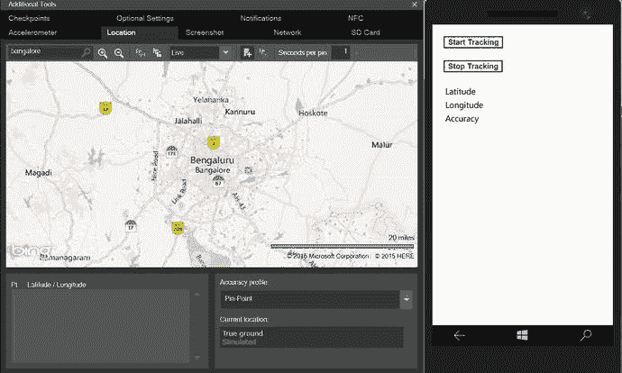

**图 12-5.** 使用 Windows Mobile 模拟器的附加工具进行位置更新

当使用“本地计算机”选项在 Windows 桌面上运行该应用时，您将看到如图 12-6 所示的屏幕。

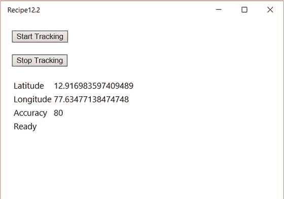

**图 12-6.** 使用“本地计算机”选项在 Windows 桌面进行位置更新

> **注意**  
> 如图 12-5 所示，Windows Mobile 模拟器提供了附加工具，让开发者在开发期间测试基于位置的应用。

## 12.3 使用 HTML5 检测用户位置

### 问题

您不知道自己身在何处。Windows 应用需要确定并显示您当前的位置。

### 解决方案

除了 Windows 运行时 API 之外，WinJS 应用还可以利用 W3C Geolocation API，通过 HTML5 从 Windows 应用中检测用户的当前位置。


### 工作原理

创建一个新的通用 Windows 项目，使用可以在 Microsoft Visual Studio 2015 的新建项目对话框中的 JavaScript ➤ Windows ➤ Universal 节点下找到的通用 Windows 模板。这会在 Visual Studio 解决方案中创建一个单一项目，其中包含开始所需的必要文件。在应用中集成位置功能的第一步是在 Windows 应用的 `package.appxmanifest` 文件中声明位置功能。在 Visual Studio 解决方案资源管理器中，双击 `package.appxmanifest` 文件。在 GUI 设计器中，点击“功能”选项卡并选择“位置”。

打开 Windows 应用的 `default.html` 文件，并在文件的 `body` 标签下添加以下代码。

```
<h1>使用 HTML5 获取当前位置</h1>
<button id="btnLocation">获取位置</button> <br />
<label>纬度</label> <div id="latitude"></div><br />
<label>经度</label> <div id="longitude"> </div><br />
<div id="status"> </div><br />
```

打开项目中的 `default.js`（`/js/default.js`）。将文件中的代码替换为以下内容：

```
(function () {
    "use strict";
    var app = WinJS.Application;
    var activation = Windows.ApplicationModel.Activation;
    app.onactivated = function (args) {
        if (args.detail.kind === activation.ActivationKind.launch) {
            if (args.detail.previousExecutionState !== activation.ApplicationExecutionState.terminated) {
            } else {
            }
            args.setPromise(WinJS.UI.processAll().
                done(function () {
                    // 为按钮添加事件处理程序。
                    document.querySelector("#btnLocation").addEventListener("click",
                        GetLocation);
                }));
        }
    };
    var nav = null;
    function GetLocation() {
        if (nav == null) {
            nav = window.navigator;
        }
        var geoloc = nav.geolocation;
        if (geoloc != null) {
            geoloc.getCurrentPosition(Onsuccess, Onerror);
        }
    }
    // 获取位置信息后
    function Onsuccess(position) {
        document.getElementById("latitude").innerHTML =
            position.coords.latitude;
        document.getElementById("longitude").innerHTML =
            position.coords.longitude;
    }
    // 尝试获取位置时出错
    function Onerror(error) {
        var errorMessage = "";
        switch (error.code) {
            case error.PERMISSION_DENIED:
                errorMessage = "位置已禁用";
                break;
            case error.POSITION_UNAVAILABLE:
                errorMessage = "数据不可用";
                break;
            case error.TIMEOUT:
                errorMessage = "超时错误";
                break;
            default:
                break;
        }
        document.getElementById("status").innerHTML = errorMessage;
    }
    app.oncheckpoint = function (args) {
    };
    app.start();
})();
```

为“获取位置”按钮添加点击事件处理器。使用 `document.querySelector` 获取按钮控件，并使用 `addEventListener` 方法添加点击事件并将其映射到 `GetLocation` 方法。

```
document.querySelector("#btnLocation").addEventListener("click",
                         GetLocation);
```

使用 `window.navigator.geolocation` 类的 `getCurrentPosition` 方法获取用户当前的位置。

```
if (nav == null) {
            nav = window.navigator;
        }
        var geoloc = nav.geolocation;
        if (geoloc != null) {
            geoloc.getCurrentPosition(Onsuccess, Onerror);
        }
```

成功获取当前位置后，控制权移交给 `Onsuccess` 方法来处理坐标并显示它。如果发生错误，则调用 `Onerror` 方法，该方法在获取位置信息出现问题时显示错误消息。

在本地计算机上生成并运行项目。

点击应用中的“获取位置”按钮，如图 12-7 所示。应用会立即提示用户允许应用使用位置 API。点击“允许”后，您应该会立即看到当前位置的纬度和经度。

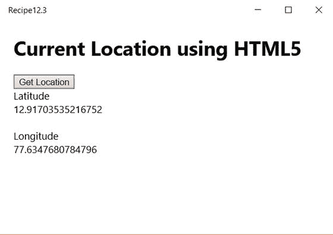

**图 12-7.** 使用 HTML5 获取 Windows 应用商店应用中的当前位置

**注意**

W3C 地理定位 API 目前仅适用于 Windows 桌面设备系列应用。当您在 Windows Mobile 模拟器上运行时，状态将显示为“已禁用”。

## 12.4 使用 HTML5 检测位置更新

### 问题

您希望频繁检查应用中的位置是否有任何变化。

### 解决方案

您可以在 HTML5 中使用 W3C 地理定位 API 来检测 Windows 应用中的位置变化。


### 工作原理

使用通用 Windows 模板创建一个新的通用 Windows 项目，该模板位于 Microsoft Visual Studio 2015 的“新建项目”对话框中的 JavaScript ➤ Windows ➤ Universal 节点下。这会在 Visual Studio 解决方案中创建一个单一项目，其中包含开始所需的必要文件。

在应用中集成定位功能的第一步是在 Windows 应用的 `package.appxmanifest` 文件中声明位置功能。从 Visual Studio 解决方案资源管理器中，双击 `package.appxmanifest` 文件。在 GUI 设计器中，点击“功能”选项卡，然后勾选“位置”。

打开 Windows 应用的 `default.html` 文件，并在文件的 body 标签下添加以下代码：
```
<h1>使用 HTML5 获取当前位置</h1>
<button id="btnstart">开始</button> <button id="btnstop">停止</button> <br />
<label>纬度</label> <div id="latitude"></div><br />
<label>经度</label> <div id="longitude"> </div><br />
<div id="status"> </div><br />
```

打开 Windows 项目中的 `default.js`（`/js/default.js`）文件，并将文件中的代码替换为以下内容：
```
(function () {
    "use strict";
    var app = WinJS.Application;
    var activation = Windows.ApplicationModel.Activation;
    app.onactivated = function (args) {
        if (args.detail.kind === activation.ActivationKind.launch) {
            if (args.detail.previousExecutionState !== activation.ApplicationExecutionState.terminated) {
            } else {
            }
            args.setPromise(WinJS.UI.processAll().
                done(function () {
                    document.querySelector("#btnstart").addEventListener("click",
                        starttracking);
                    document.querySelector("#btnstop").addEventListener("click",
                        stoptracking);
                }));
        }
    };
    var geolocation = null;
    var positionInstance;
    // 点击开始追踪按钮时
    function starttracking() {
        if (geolocation == null) {
            geolocation = window.navigator.geolocation;
        }
        if (geolocation != null) {
            positionInstance = geolocation.watchPosition(onsuccess, onerror);
        }
    }
    // 点击停止追踪按钮时
    function stoptracking() {
        geolocation.clearWatch(positionInstance);
    }
    // 获取位置成功时
    function onsuccess(pos) {
        document.getElementById('latitude').innerHTML = pos.coords.latitude;
        document.getElementById('longitude').innerHTML = pos.coords.longitude;
    }
    // 尝试获取位置出错时
    function Onerror(error) {
        var errorMessage = "";
        switch (error.code) {
            case error.PERMISSION_DENIED:
                errorMessage = "位置功能已禁用";
                break;
            case error.POSITION_UNAVAILABLE:
                errorMessage = "数据不可用";
                break;
            case error.TIMEOUT:
                errorMessage = "超时错误";
                break;
            default:
                break;
        }
        document.getElementById("status").innerHTML = errorMessage;
    }
    app.oncheckpoint = function (args) {
    };
    app.start();
})();
```

为“开始追踪”和“停止追踪”按钮添加点击事件处理程序。使用 `document.querySelector` 获取按钮控件，并使用 `addEventListener` 方法为追踪按钮添加点击事件。追踪由 `window.navigator.geolocation` 类的 `watchPosition` 方法处理，如下所示：
```
if (geolocation == null) {
    geolocation = window.navigator.geolocation;
}
if (geolocation != null) {
    positionInstance = geolocation.watchPosition(onsuccess, onerror);
}
```
当获取到坐标时，会调用 `Onsuccess` 方法，该方法用于处理结果并显示。如果获取位置时出现任何问题，则会调用 `Onerror` 方法，并附带相应的错误代码，开发者可以利用该错误代码为每个错误代码显示用户友好的消息。要停止追踪，需要通过提供最初使用 `watchPosition` 函数获取的 `watchid` 参数来调用 `geolocation` 的 `clearWatch` 方法。
```
geolocation.clearWatch(positionInstance);
```

在本地计算机上生成并运行该项目。

在应用中，点击“开始”按钮。应用会立即提示用户允许该应用使用位置 API。一旦点击“允许”，您应立即看到当前位置的纬度和经度，并且位置追踪开始，如图 12-8 所示。

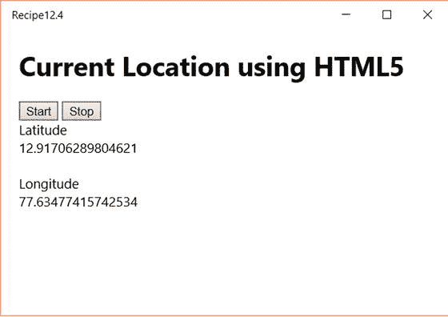

**图 12-8.** 使用 HTML5 在 Windows 应用商店应用中检测位置更新

> **注意**
> W3C Geolocation API 目前仅适用于 Windows 桌面设备系列。它不受 Windows 10 Mobile 支持。

## 12.5 在内置地图应用中显示地图

### 问题

您希望在内置地图应用中显示地图并绘制位置。

### 解决方案

使用通用 Windows 应用中的 `bingmaps` `:` URI 方案在内置地图应用中显示地图。


### 工作原理

使用通用 Windows 模板创建一个新的通用 Windows 项目，该模板可在 Microsoft Visual Studio 2015 的“新建项目”对话框中的“JavaScript ➤ Windows ➤ Universal”节点下找到。这将在 Visual Studio 解决方案中创建一个单一项目，其中包含开始项目所需的必要文件。

打开项目中的 `default.html` 文件，并在文件的 `<body>` 标签下添加以下代码：

```html
<h1>显示地图</h1>
<button id="btnDisplayMap">显示地图</button> <br />
```

打开项目中的 `default.js`（`/js/default.js`）文件，并将文件中的代码替换为以下内容：

```javascript
(function () {
    "use strict";
    var app = WinJS.Application;
    var activation = Windows.ApplicationModel.Activation;
    app.onactivated = function (args) {
        if (args.detail.kind === activation.ActivationKind.launch) {
            if (args.detail.previousExecutionState !== activation.ApplicationExecutionState.terminated) {
            } else {
            }
            args.setPromise(WinJS.UI.processAll().done(function () {
                // 为按钮添加事件处理程序。
                document.querySelector("#btnDisplayMap").addEventListener("click", DisplayMap);
            }));
        }
    };
    // 显示内置地图的方法。
    function DisplayMap() {
        var latitude = "12.917264";
        var longitude = "77.634786";
        var uri = "bingmaps:?cp=" + latitude + "∼" + longitude + "lvl=10";
        Windows.System.Launcher.launchUriAsync(new Windows.Foundation.Uri(uri));
    }
    app.oncheckpoint = function (args) {
    };
    app.start();
})();
```

`bingmaps:` URI 方案可用于从你的 Windows 应用启动地图应用。`LaunchUriAsync` 方法通常用于通过 URI 方案从 Windows 应用商店应用启动另一个应用。在此例中，`bingmaps:` URI 方案用于启动地图应用。

> **注意**  
> 使用 `LaunchUriAsync` 方法时，用户会被带到设备上的另一个应用，并且在使用完地图应用后，必须手动返回你的应用。

开发者可以为 URI 方案提供适当的参数来显示位置，甚至在地图上显示路线。例如，以下 URI 方案会打开必应地图应用，并显示以印度班加罗尔市为中心的地图：

```
Bingmaps:? Cp=12.917264∼77.634786
```

开发者可以将表 12-1 中显示的一些参数与 `bingmaps:` URI 方案一起使用。

**表 12-1.** 与 `bingmaps:` URI 一起使用的不同参数示例

| 参数 | 示例 |
| --- | --- |
| `cp` (中心点) | `cp=40.726966∼-74.006076` |
| `bb` (边界框) | `bb=39.719_-74.52∼41.71_-73.5` |
| `q` (查询词或搜索词) | `q=mexican%20restaurants` |
| `lvl` (缩放级别) | `lvl=10.50` |
| `trfc` (指定在地图中包含交通信息) | `trfc=1` |
| `rtp` (路线) | `rtp=adr.One%20Microsoft%20Way,%20Redmond, %20WA∼pos.45.23423_-122.1232` |

> **注意**  
> 必应地图包含许多参数；表 12-1 仅显示了其中的一部分。有关必应地图参数的更多信息，请访问 [`http://msdn.microsoft.com/en-us/library/windows/apps/xaml/jj635237.aspx`](http://msdn.microsoft.com/en-us/library/windows/apps/xaml/jj635237.aspx)。

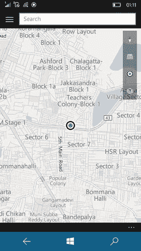

**图 12-9.** Windows 移动应用中的内置地图

现在，生成项目并运行它。单击屏幕上的 **显示地图** 按钮。如果你在 Windows 移动模拟器上运行 Windows 应用，应该会看到内置地图显示定位的位置，如图 12-9 所示。

如果使用 **本地计算机** 选项在 Windows 桌面上运行应用，地图应用会显示该位置（参见图 12-10）。

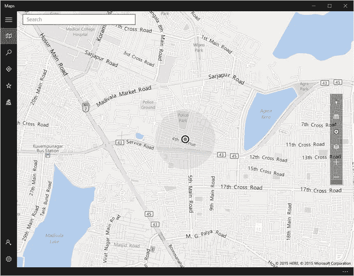

**图 12-10.** Windows 桌面系列中的内置地图

> **注意**  
> `bingmaps:` URI 方案是 Windows Phone 8.1 及更早版本中可用的 `MapsTask` 启动器的替代方案。

## 12.6 在内置地图应用中显示路线

### 问题

你希望在 Windows 设备的内置地图应用中显示从一个位置到另一个位置的路线或方向。

### 解决方案

可以从你的 Windows 应用中使用带有 `rtp` 参数的 `bingmaps:` URI 方案，在内置地图应用中显示地图，并显示从一处到另一处的点对点驾驶路线。


### 工作原理

使用通用 Windows 模板创建一个新的通用 Windows 项目，该模板位于 Microsoft Visual Studio 2015“新建项目”对话框的 `JavaScript ➤ Windows ➤ Universal` 节点下。这会在 Visual Studio 解决方案中创建一个单项目，其中包含入门所需的文件。

使用 Visual Studio 解决方案资源管理器打开项目中的 `default.html` 文件，并在每个文件的 `body` 标签下添加以下代码：`<h1>显示地图</h1>` `<button id="btnDisplayRoute">显示路线</button> <br />`

打开项目中的 `default.js` (`/js/default.js`)，并将文件中的代码替换为以下内容：

```
(function () {
    "use strict";
    var app = WinJS.Application;
    var activation = Windows.ApplicationModel.Activation;
    app.onactivated = function (args) {
        if (args.detail.kind === activation.ActivationKind.launch) {
            if (args.detail.previousExecutionState !== activation.ApplicationExecutionState.terminated) {
            } else {
            }
            args.setPromise(WinJS.UI.processAll().
                 done(function () {
                     // 为按钮添加事件处理程序。
                     document.querySelector("#btnDisplayRoute").addEventListener("click",
                         DisplayRoute);
                 }));
        }
    };
    function DisplayRoute() {
        var fromAddress = "adr.HSR Layout 5th sector, Bangalore";
        var toAddress = "adr.Microsoft India,Signature Building,Bangalore";
        var uri = "bingmaps:?rtp=" + fromAddress + "∼"+ toAddress;
        Windows.System.Launcher.launchUriAsync(new Windows.Foundation.Uri(uri));
        //Windows.Services.Maps.MapManager.showDownloadedMapsUI()
    }
    app.oncheckpoint = function (args) {
    };
    app.start();
})();
```

`bingmaps:` URI 方案可用于从 Windows 应用启动地图应用。`LaunchUriASync` 方法通常用于通过 URI 方案从 Windows 应用启动另一个应用。在此例中，使用带有 `rtp` 参数的 `bingmaps:` URI 方案来启动内置地图，然后显示从指定地址到指定位置的驾驶路线。

> **注意**  
> 使用 `LaunchUriAsync` 方法时，用户将被带到设备上的另一个应用；用户在使用地图应用后必须手动返回到你的应用。

开发者可以在 URI 中包含 `trfc=1` 参数来显示交通信息。

```
"bingmaps:?rtp=adr.HSR Layout 5th sector, Bangalore∼adr.Microsoft India,Signature Building,Bangalore&trfc=1";
```

在前面的 URI 方案中，`adr.` 定义了地址。`rtp` 使用两个途经点来查找路线。提供 `trfc` 参数也是为了显示交通信息。

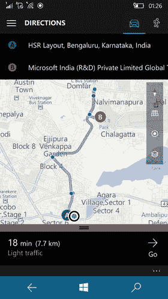

**图 12-11.** Windows Mobile 中的导航路线

生成项目并运行它。单击屏幕上的 `Display Route`（显示路线）按钮。如果你在 Windows Mobile 模拟器上运行 Windows 应用，你应该会看到内置地图上绘制了位置，如图 12-11 所示。

如果 Windows 应用在桌面系列上运行，则会使用“地图”应用来显示位置，如图 12-12 所示。

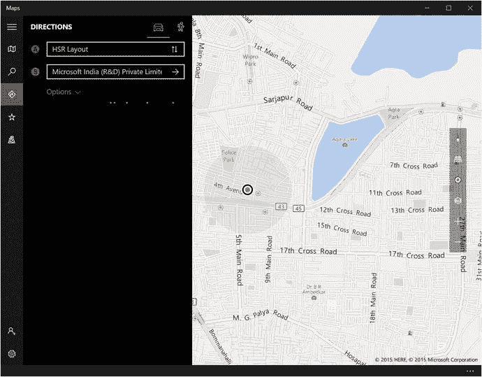

**图 12-12.** Windows 应用中的导航路线

> **注意**  
> `bingmaps:` URI 方案是 Windows Phone 8 中 `MapsDirectionsTask` 启动器的替代方案。

## 12.7 Windows 应用商店应用中的必应地图控件

### 问题

你希望在 Windows 应用中使用地图，而不是启动内置的地图应用。

### 解决方案

使用 Bing Maps AJAX Control 7.0 为使用 WinJS 开发的通用 Windows 应用添加地图功能。

### 工作原理

必应地图是微软提供的一项在线地图服务，它允许用户使用微软的地图解决方案，并利用必应地图的各种功能。Bing Maps AJAX Control 7.0 和 Bing Maps REST Services 为开发者提供了独特的机会，可以轻松地将位置和搜索功能集成到他们的移动和 Web 应用中。

要使用 Bing Maps AJAX Control 7.0，请遵循以下步骤：

1. 从 [`http://go.microsoft.com/fwlink/?LinkID=322092`](http://go.microsoft.com/fwlink/?LinkID=322092) 下载并安装适用于 Windows 应用商店应用的必应地图 SDK（适用于 Windows 8.1，也适用于 Windows 10）。

2. 获取必应地图密钥。转到 [`https://www.bingmapsportal.com`](https://www.bingmapsportal.com) 的必应地图帐户中心，并为该应用创建一个密钥。你必须在 Windows 应用商店应用中使用此密钥。

3. 在 Microsoft Visual Studio 2013 中使用 Windows 应用商店应用模板创建一个新项目，这将创建一个 Windows 应用商店应用。

4. 将适用于 JavaScript 的必应地图引用添加到项目中。在解决方案资源管理器中，右键单击项目引用，然后选择“添加引用”和“适用于 JavaScript 的必应地图”。单击“确定”，如图 12-13 所示。

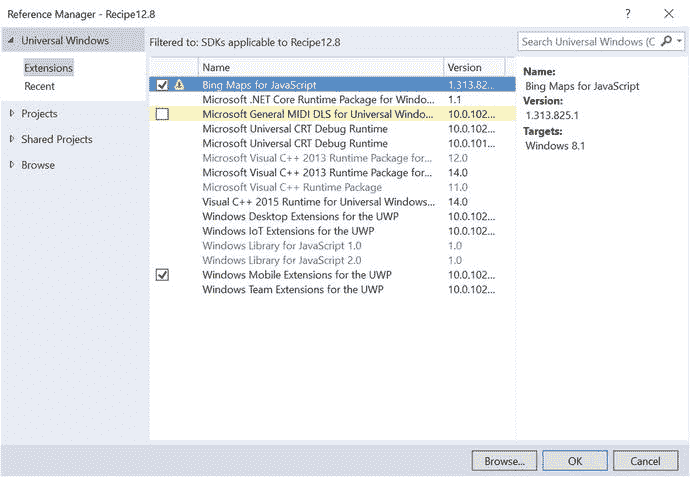

**图 12-13.**


### Visual Studio 中必应地图的引用管理器

打开项目中的 `default.html` 文件，并在文件的 `body` 标签中添加以下代码：`<div id="myMap"></div>`

在 `default.html` 文件中，同时添加对必应地图 JavaScript 文件的引用：

```html
<!-- Bing Maps references -->
<script type="text/javascript" src="ms-appx:///Bing.Maps.JavaScript//js/veapicore.js"></script>
<script type="text/javascript" src="ms-appx:///Bing.Maps.JavaScript//js/veapimodules.js"></script>
```

打开 `default.js`（`/js/default.js`）并用以下代码替换文件中的内容：

```javascript
(function () {
    "use strict";
    var app = WinJS.Application;
    var activation = Windows.ApplicationModel.Activation;
    app.onactivated = function (args) {
        if (args.detail.kind === activation.ActivationKind.launch) {
            if (args.detail.previousExecutionState !== activation.ApplicationExecutionState.terminated) {
            } else {
            }
            args.setPromise(WinJS.UI.processAll().
                done(function () {
                    Microsoft.Maps.loadModule('Microsoft.Maps.Map', { callback: GetMap });
                }));
        }
    };
    var map;
    function GetMap() {
        //   Microsoft.Maps.loadModule('Microsoft.Maps.Map', { callback: GetMap });
        var loc = new Microsoft.Maps.Location(13.0220, 77.4908);
        // Initialize the map
        map = new Microsoft.Maps.Map(document.getElementById("myMap"), {
            credentials: "Bing Map Key",
            zoom: 10
        });
        var pin = new Microsoft.Maps.Pushpin(loc);
        map.entities.push(pin);
        // Center the map on the location
        map.setView({ center: loc, zoom: 10 });
    }
    app.oncheckpoint = function (args) {
    };
    app.start();
})();
```

首先需要调用 `Microsoft.Maps` 函数的 `loadModule` 来加载地图。 `loadModule` 有一个可选的 `culture` 参数，可用于指定本地化语言和区域。为 `loadModule` 指定了 `GetMap` 回调函数：`Microsoft.Maps.loadModule('Microsoft.Maps.Map', { callback: GetMap });`

通过指定容器 `div` 元素和必应地图 API 密钥来创建 `Microsoft.Maps.Map` 的实例：

```javascript
// Initialize the map
map = new Microsoft.Maps.Map(document.getElementById("myMap"), {
    credentials: "Bing Map API Key",
});
```

使用 `map.entities.push` 方法标识地图上要添加图钉的位置：

```javascript
var loc = new Microsoft.Maps.Location(13.0220, 77.4908);
var pin = new Microsoft.Maps.Pushpin(loc);
map.entities.push(pin);
```

最后，通过将地图中心设置在指定位置并将缩放级别设置为 10 来显示地图。

构建应用程序并在 Windows 模拟器中运行它。您应该能够看到地图以及添加到地图上的图钉，如图 12-14 所示。

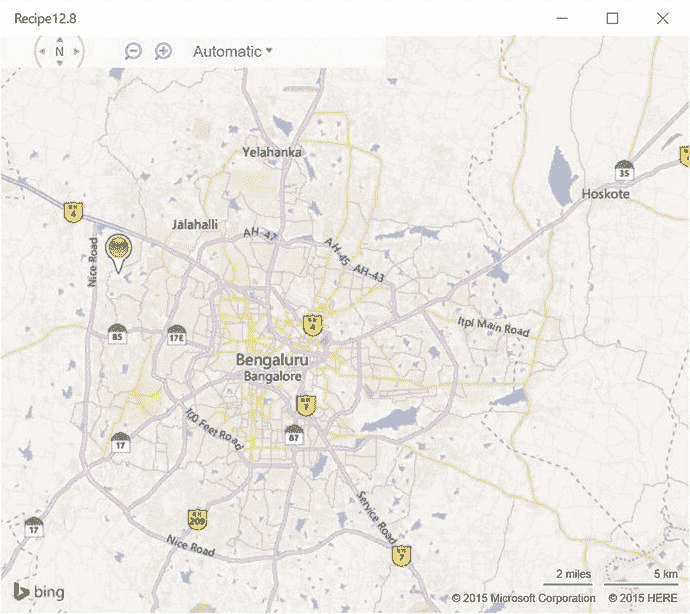

**图 12-14.** Windows 应用中的必应地图

必应地图 AJAX 控件提供了额外的 API，让开发者能够集成更多地图功能，例如显示交通信息、路线等。

目前，WinJS 库在 SDK 中并未直接提供地图控件，因此必应地图 AJAX 控件是一个很好的替代解决方案。

