# 第 13 章：构建连接到云的应用

Microsoft Azure 移动服务为开发者提供了一种最简单的方式，将 Windows 应用中的数据存储到云中的 SQL Azure 数据库。通过使用 Microsoft Azure 移动服务，开发者无需担心创建和托管自己的 Web 服务。大多数事情都由 Microsoft Azure 移动服务处理。

本章涵盖了一些关于在 Universal Windows 应用中设置和使用 Microsoft Azure 移动服务进行数据存储和检索的食谱。

## 13.1 在 Microsoft Azure 中创建新的移动服务

### 问题

您需要在 Microsoft Azure 移动服务中创建一个新的移动服务，以便您的 Universal Windows 应用可以使用它。

### 解决方案

登录到 Microsoft Azure 管理门户，使用移动服务部分创建一个新的移动服务。


### 工作原理

Microsoft Azure 移动管理门户为开发者提供了必要的选项来管理虚拟机、移动服务、云服务等各种资源。

请按照以下步骤在 Microsoft Azure 中创建新的移动服务：

登录 Microsoft Azure 管理门户，访问 [`http://manage.windowsazure.com`](http://manage.windowsazure.com/) 并提供你的登录凭据。你可以通过单击底部栏中的 `+New` 按钮，然后依次选择 `Compute` ➤ `Mobile Service` ➤ `Create` 来创建新的移动服务，如图 13-1 所示。

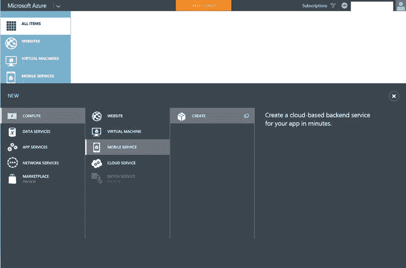

图 13-1.

用于创建新移动服务的 Microsoft Azure 仪表板

提供移动服务的详细信息。这包括用于访问移动服务的 URL、订阅、区域、后端等。你可以将移动服务名称设置为 `winjsrecipes`。目前，Microsoft Azure 支持 JavaScript 和 .NET 后端。在此方案中选择 `JavaScript`，然后单击 `Next` 按钮，如图 13-2 所示。

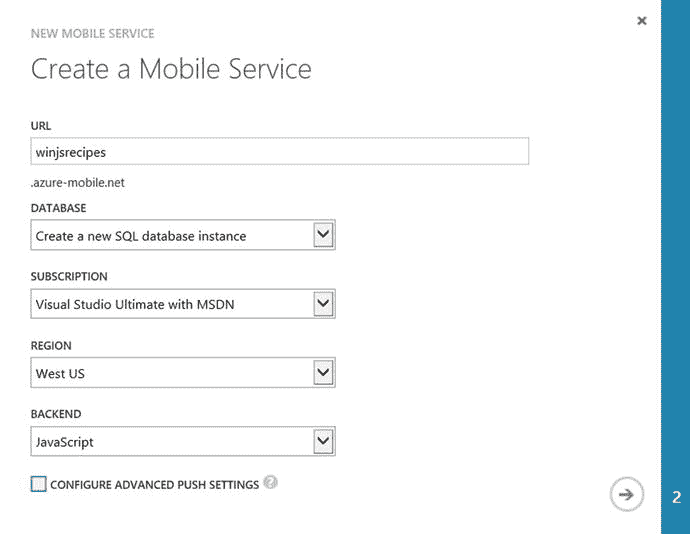

图 13-2.

新移动服务对话框

如果你选择了 `Create a new SQL database instance`，则必须提供现有的数据库设置信息，如图 13-3 所示。完成移动服务的创建。

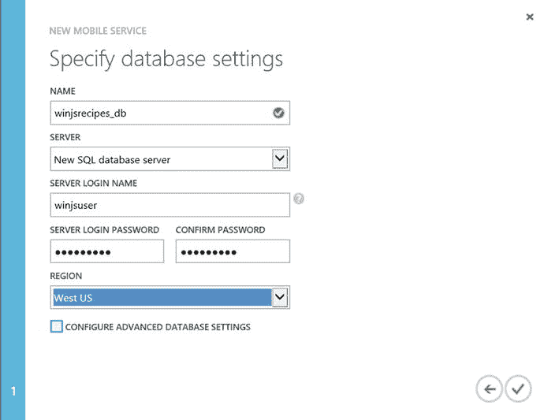

图 13-3.

新移动服务数据库设置对话框

几分钟后，移动服务即可就绪，并显示在移动服务概览屏幕中。

你也可以使用 Visual Studio 2015 在 Microsoft Azure 中创建移动服务。要从 Visual Studio 2015 创建移动服务，请按照以下步骤操作：

启动 Visual Studio 2015，打开 `Server Explorer` 窗口。在 `Server Explorer` 窗口中，右键单击 `Azure`，然后在上下文菜单中选择 `Connect to Microsoft Azure…`，如图 13-4 所示。提供你的 Microsoft Azure 登录凭据。这会将 Azure 订阅导入到 Visual Studio。

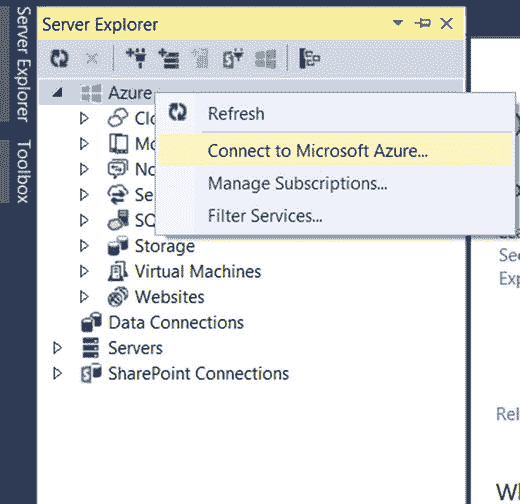

图 13-4.

从 Visual Studio 服务器资源管理器窗口连接到 Azure

下一步是从 `Server Explorer` 创建移动服务。右键单击 `Mobile Services`，然后选择 `Create Service`，如图 13-5 所示。

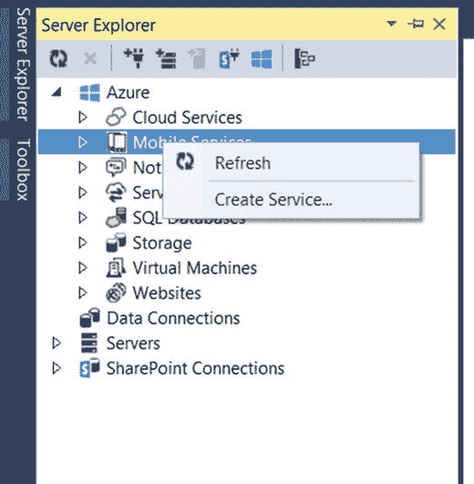

图 13-5.

从 Visual Studio 2015 创建服务

在 `Create Mobile Service` 对话框中，提供要创建的移动服务的必要信息，包括 URL、区域、数据库信息等。将方案命名为 `winjs`，如图 13-6 所示。

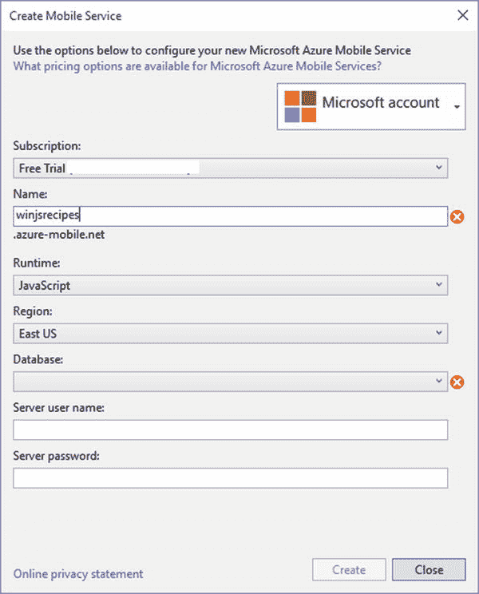

图 13-6.

Visual Studio 2015 中的新移动服务对话框

> **注意**  
> 你需要拥有一个 Microsoft Azure 订阅。如果你尚未订阅，则需要访问 [`http://azure.microsoft.com/en-us/`](http://azure.microsoft.com/en-us/)。如果你想试用 Microsoft Azure，可以获得一个免费试用帐户。

## 13.2 在移动服务中创建数据库表

### 问题

你需要创建一个表来存储 Microsoft Azure 中的待办事项，这些事项将由你的通用 Windows 应用使用。

### 解决方案

你可以使用 Microsoft Azure 管理门户或 Visual Studio 2015 在 Microsoft Azure 移动服务中创建数据库表。

### 工作原理

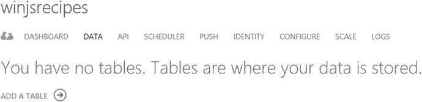

图 13-7.

Azure 移动服务仪表板

要从 Microsoft Azure 移动服务创建表，请使用你的登录凭据登录 Azure 管理门户。在移动服务概览屏幕中，选择你想要在其中创建新表的移动服务。在选定的移动服务中（见图 13-7），选择 `DATA` 选项卡，然后单击 `ADD A TABLE` 开始创建新表。

在 `Create New Table` 对话框中，输入表名（将其命名为 `todo`），并为插入、更新、删除和读取操作保留默认权限 `Anybody with the Application Key`，如图 13-8 所示。单击 `Submit` 按钮。

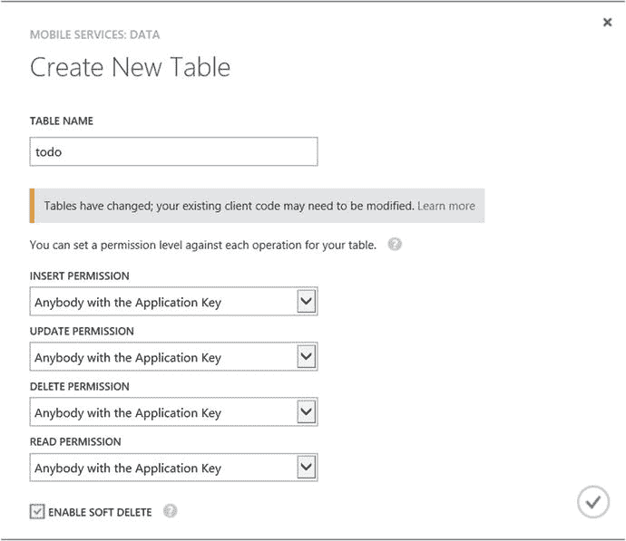

图 13-8.

在 Microsoft Azure 的移动服务中创建表

请注意，你并未为 `todo` 表指定列。一种选择是直接从仪表板向表中添加列，这是推荐的做法。另一种选择是使用 `Dynamic` 架构，该架构会根据你插入的数据动态创建列（这使得开发新的移动服务更加容易）。本方案采用第二种做法。开发者可以随时在仪表板中禁用 `Dynamic` 架构。

## 13.3 为 WinJS 客户端库安装移动服务

### 问题

你需要为 WinJS 客户端库安装移动服务，以使你的 Windows 应用能够与 Microsoft Azure 移动服务交互。

### 解决方案

使用 NuGet 包管理器控制台，在通用 Windows 项目中执行以下命令，以将移动服务添加到 WinJS 客户端库：

```
Install-Package WindowsAzure.MobileServices.Winjs
```

### 工作原理

NuGet 包管理器控制台让开发者能够快速安装库。要添加适用于 WinJS 客户端库的移动服务，请按照以下步骤操作。

启动 Visual Studio 2015，并使用 JavaScript 模板创建一个新的通用 Windows 应用。在 Visual Studio 中，依次选择 `Tools` ➤ `Library package manager` ➤ `Package Manager Console`，然后输入以下命令：

```
install-package WindowsAzure.MobileServices.WinJS
```

在运行此命令之前，请确保在包管理器控制台中已将正确的项目选为 `Default project`（见图 13-9）。

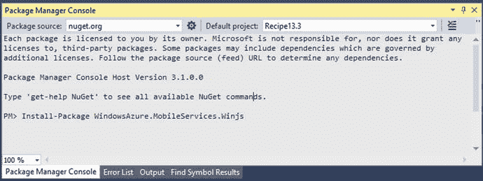

图 13-9.

包管理器控制台中的项目选择

安装成功后，你将在解决方案资源管理器中的项目 `JS` 文件夹下看到新的 JavaScript 文件，如图 13-10 所示。

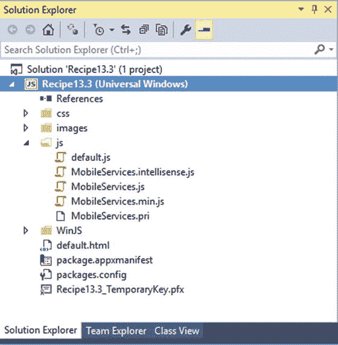

图 13-10.

安装库后解决方案资源管理器中的通用项目

要使用移动服务的 WinJS 库，你必须在 HTML 页面中添加对 `MobileServices.min.js` 脚本的引用。

```html
<script src="js/MobileServices.min.js"></script>
```

现在，你可以从你的 Windows 应用商店项目访问移动服务客户端库。

## 13.4 执行 CRUD 操作

### 问题

你需要从 Windows 应用对 `todo` 表执行创建、读取、更新和删除（CRUD）操作。（`todo` 表的创建已在上一方案中演示过。）

### 解决方案

你可以使用移动服务库公开的方法，对在移动服务中创建的表执行基本的 CRUD 操作。


### 工作原理

在前一篇教程中，你创建了一个名为 `winjsrecipes` 的移动服务和一个名为 `todo` 的数据表。在本篇教程中，你将学习如何在 Windows 应用中与 `todo` 数据库表进行交互。  
**Microsoft Azure 移动服务：CRUD 操作：**

在 Windows 应用中打开 `default.html` 页面，并在 head 部分添加以下对移动服务库的引用：

```
<script src="js/MobileServices.min.js"></script>
```

在同一文件中，将以下代码添加到 `body` 标签中：

```
<div style="margin:38px 18px 18px 18px">
    <h4 style="margin-bottom:18px">winjsrecipes</h4>
    <div>在下方输入一些文本，然后点击“保存”以向数据库插入一个新的 TodoItem 项</div>
    <input type="text" id="textInput" style="width:240px;vertical-align:middle;margin-right:10px;" />
    <button id="buttonSave" style="vertical-align:middle">保存</button>
    <div>点击下方的“刷新”以从数据库加载未完成的 TodoItems。使用复选框来完成和更新你的 TodoItems</div>
    <button id="buttonRefresh" style="width:100%">刷新</button>
    <div id="TemplateItem" data-win-control="WinJS.Binding.Template">
        <input type="checkbox" style="margin-right:5px" data-win-bind="checked: complete; dataContext: this; innerText: text" />
    </div>
    <div id="listItems"
         data-win-control="WinJS.UI.ListView"
         data-win-options="{ itemTemplate: TemplateItem, layout: {type: WinJS.UI.ListLayout} }">
    </div>
</div>
```

从 `JS` 文件夹中打开 `default.js` 文件，并将其替换为以下代码：

```
// 有关空白模板的简介，请参阅以下文档：
// http://go.microsoft.com/fwlink/?LinkID=392286
(function () {
    "use strict";
    var app = WinJS.Application;
    var activation = Windows.ApplicationModel.Activation;
    app.onactivated = function (args) {
        if (args.detail.kind === activation.ActivationKind.launch) {
            if (args.detail.previousExecutionState !== activation.ApplicationExecutionState.terminated) {
            } else {
            }
            args.setPromise(WinJS.UI.processAll());
            var client = new WindowsAzure.MobileServiceClient(
                                "https://winjsrecipes.azure-mobile.net/",
                                "<应用程序密钥 2>"
                        );
            var todoTable = client.getTable('todo');
            var todoItems = new WinJS.Binding.List();
            var insertTodoItem = function (todoItem) {
                todoTable.insert(todoItem).done(function (item) {
                    todoItems.push(item);
                });
            };
            var refreshTodoItems = function () {
                todoTable.where({ complete: false })
                    .read()
                    .done(function (results) {
                        todoItems = new WinJS.Binding.List(results);
                        listItems.winControl.itemDataSource = todoItems.dataSource;
                    });
            };
            var updateCheckedTodoItem = function (todoItem) {
                todoTable.update(todoItem).done(function (item) {
                    todoItems.splice(todoItems.indexOf(item), 1);
                });
            };
            buttonSave.addEventListener("click", function () {
                insertTodoItem({
                    text: textInput.value,
                    complete: false
                });
            });
            buttonRefresh.addEventListener("click", function () {
                refreshTodoItems();
            });
            listItems.addEventListener("change", function (eventArgs) {
                var todoItem = eventArgs.target.dataContext.backingData;
                todoItem.complete = eventArgs.target.checked;
                updateCheckedTodoItem(todoItem);
            });
            refreshTodoItems();
        }
    };
    app.oncheckpoint = function (args) {
    };
    app.start();
})();
```

使用 **本地计算机** 选项在 Windows 桌面上运行应用程序。你应该会看到如图 13-11 所示的屏幕。你应该能够通过应用程序向移动服务添加、删除或更新数据。

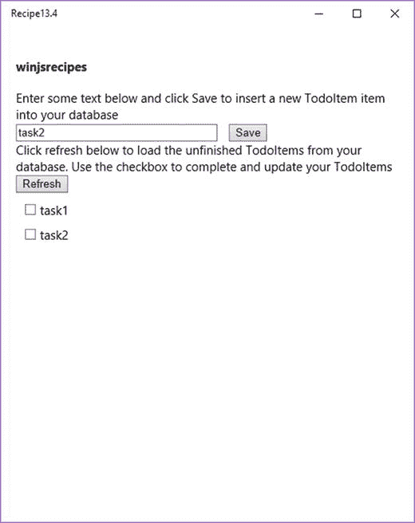

**图 13-11.** 带有插入和刷新选项的 Windows 应用

在从 Windows 应用对 Microsoft Azure 移动服务执行任何操作之前，你必须首先连接到该服务并获取对远程服务的访问权限。通过使用 `MobileServiceClient` 对象可以获取对远程服务客户端的访问。同样，通过使用 `MobileServiceTable` 对象可以获取对远程数据表的访问。

以下是获取 `MobileServiceClient` 和数据表引用的方法：

```
var client = new WindowsAzure.MobileServiceClient(
                "https://winjsrecipes.azure-mobile.net/",
                "<输入应用程序密钥>"
            );
var todoTable = client.getTable('todo');
```

`MobileServiceClient` 构造函数接受两个参数。第一个参数是你的移动服务的 URL，第二个参数是应用程序密钥。

**注意：**  
要获取你的移动服务的应用程序密钥，你需要登录到 Microsoft Azure 管理门户，导航到你的移动服务的仪表板，并使用 **管理密钥** 选项来获取应用程序密钥。你需要将此密钥用作移动服务客户端的第二个参数。

可以通过调用 `MobileServiceTable` 对象的 `insert` 方法来执行插入操作。以下代码将新文本插入到 `todo` 数据表中：

```
insertTodoItem({
    text: textInput.value,
    complete: false
});

var insertTodoItem = function (todoItem) {
    // 此代码向数据库插入一个新的 TodoItem。当操作完成时
    todoTable.insert(todoItem).done(function (item) {
        todoItems.push(item);
    });
};
```

`insert` 方法的返回类型是 promise。你可以包含 success 和 error 函数来处理 `insert` 方法的操作结果。在前面的示例中，一旦插入成功，`todoItems` 列表就会在 UI 中更新。

可以使用 `MobileServiceTable` 类中定义的 `update` 方法来更新移动服务中的现有记录。例如，以下演示了如何更新 `todo` 数据表中的一条记录：

```
var todoItem = { id:1 };
todoItem.complete = true;
updateCheckedTodoItem(todoItem);

var updateCheckedTodoItem = function (todoItem) {
    // 此代码获取一个刚刚完成的 TodoItem 并更新数据库。当移动服务
    // 响应时，该条目将从列表中移除
    todoTable.update(todoItem).done(function (item) {
        todoItems.splice(todoItems.indexOf(item), 1);
    });
};
```

更新记录时，必须在待更新的记录中包含主键。在此示例中，`id` 字段是主键。当创建新的 Azure 移动服务时，会自动创建 `id` 列并将其设为主键。此字段是一个自增列。

可以通过调用 `MobileServiceTable` 类的 `del()` 方法来执行记录的删除。例如，以下示例演示了如何从 `todo` 数据表中删除一条记录：

```
var deleteItem = { id:1 };
todoTable.del(deleteItem);
```

与 `update` 方法类似，`del` 方法也需要传递对象的主键。


## 13.5 使用分页检索数据

### 问题

你需要控制从 Microsoft Azure 移动服务返回到通用 Windows 应用程序的数据量。

### 解决方案

在客户端使用 `take` 和 `skip` 查询方法，从移动服务中获取指定数量的记录。

### 工作原理

本节将以上一篇教程作为起点。

在应用中更改文本并点击保存按钮，再添加六项待办事项。打开 `default.js` 文件，将 `refreshTodoItems` 方法替换为以下代码。

```
var refreshTodoItems = function () {
    // 定义一个过滤查询，返回前两项
    todoTable.where({ complete: false })
        .take(2)
        .read()
        .done(function (results) {
            todoItems = new WinJS.Binding.List(results);
            listItems.winControl.itemDataSource = todoItems.dataSource;
        });
};
```

此示例返回待办事项表中未标记为已完成的前两项。

使用“本地计算机”选项在 Windows 桌面上运行应用程序。你应该会看到服务中的前三项待办事项，如图 13-12 所示。

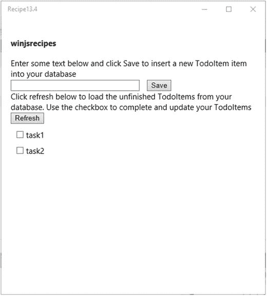

图 13-12. Windows 应用程序使用分页仅显示两条记录

如果你想要跳过表中一定数量的项目，然后返回之后的记录，该怎么办？你可以使用 `skip` 方法来实现。

以下是一个代码片段，它跳过前四条记录，并返回之后的四条记录。这类似于可以显示更多四条记录的第二页。

```
var refreshTodoItems = function () {
                todoTable.where({ complete: false })
                    .skip(4)
                    .take(4)
                    .read()
                    .done(function (results) {
                        todoItems = new WinJS.Binding.List(results);
                        listItems.winControl.itemDataSource = todoItems.dataSource;
                    });
            };
```

**注意：** 移动服务的每个响应自动限制最多 50 个项目。`skip`/`take` 方法有助于在单个响应中检索更多记录（如果需要）。

## 13.6 对来自移动服务的返回数据进行排序

### 问题

你需要对从移动服务返回到通用 Windows 应用程序的数据进行排序。

### 解决方案

你可以在查询中使用 `orderBy` 或 `orderByDescending` 函数。

### 工作原理

本节将以上一篇教程作为起点。你将更新 `refreshTodoItems` 方法以对记录进行排序。

打开 `default.js` 文件，将 `refreshTodoItems` 方法替换为以下代码，以按文本降序排序。

```
var refreshTodoItems = function () {
                todoTable.where({ complete: false }).orderByDescending("text")
                    .read()
                    .done(function (results) {
                        todoItems = new WinJS.Binding.List(results);
                        listItems.winControl.itemDataSource = todoItems.dataSource;
                    });
            };
```

当你使用“本地计算机”选项在 Windows 桌面上运行应用程序时，你会注意到列表现在按降序排列，如图 13-13 所示。

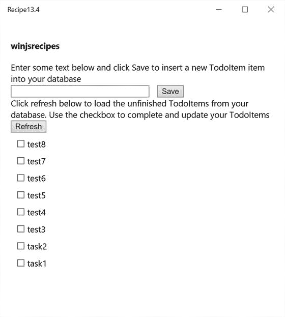

图 13-13. Windows 应用程序显示来自移动服务的排序数据

若要按升序排序数据，可以使用 `orderBy` 方法指定要对其排序的列。以下示例演示如何按 `"text"` 列对待办事项表进行升序排序。

```
todoTable.where({ complete: false }).orderBy("text")
                    .read()
```

## 13.7 在服务器脚本中执行验证

### 问题

你希望在 Microsoft Azure 移动服务的服务器端 JavaScript 中执行验证。

### 解决方案

你可以在服务器脚本（插入、更新、删除等）中定义验证。这可以通过 Visual Studio 2015 或移动服务仪表板进行修改。

### 工作原理

让我们使用上一篇教程的示例来演示如何在 Azure 移动服务中执行验证，然后在 Windows 应用程序中显示消息。

假设你希望验证插入新记录时提交的数据长度。你需要注册一个脚本来验证少于六个字符的数据。如果文本长度小于或等于六个字符，你需要显示一条错误消息。

在 Visual Studio 中打开服务器资源管理器窗口，展开移动服务表。双击 `insert.js` 文件，开始在 Visual Studio 中修改它。你也可以右键单击并选择“编辑脚本”选项来编辑文件，如图 13-14 所示。请注意，当你修改并保存文件时，该文件会在 Microsoft Azure 中自动更新。

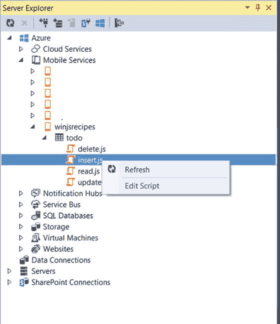

图 13-14. Visual Studio 2015 中用于移动服务的脚本文件

将 `insert.js` 文件替换为以下代码片段。

```
function insert(item, user, request) {
    if (item.text.length <= 6) {
        request.respond(statusCodes.BAD_REQUEST, '文本长度必须大于 6 个字符');
    } else {
        request.execute();
    }
}
```

从项目中打开 `default.js` 文件，并将 `insertTodoItem` 函数替换为以下内容：

```
var insertTodoItem = function (todoItem) {
                todoTable.insert(todoItem).done(function (item) {
                    todoItems.push(item);
                }, function (error) {
                    // 显示错误消息
                    var msg = new Windows.UI.Popups.MessageDialog(
                        error.request.responseText);
                    msg.showAsync();
                });
            };
```

使用“本地计算机”选项在 Windows 桌面上运行该应用，并尝试添加一个少于六个字符的待办事项。点击“保存”按钮。应用程序应显示如图 13-15 所示的消息。

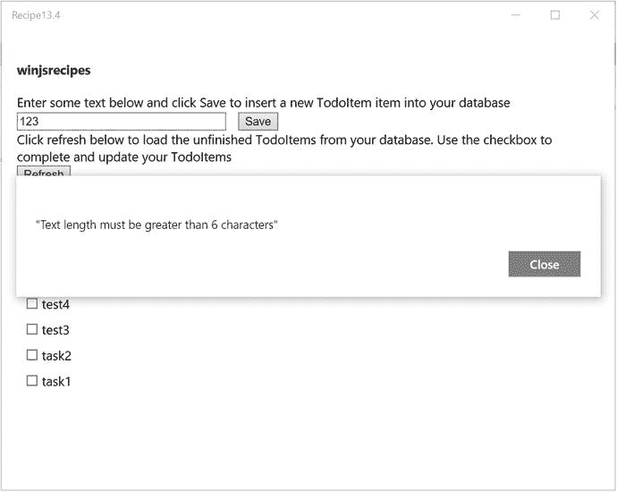

图 13-15. Windows 应用程序显示来自移动服务的验证消息

或者，你也可以从“脚本”选项卡修改脚本，该选项卡可以通过在 Azure 管理门户的“数据”选项卡中选择表来找到。

