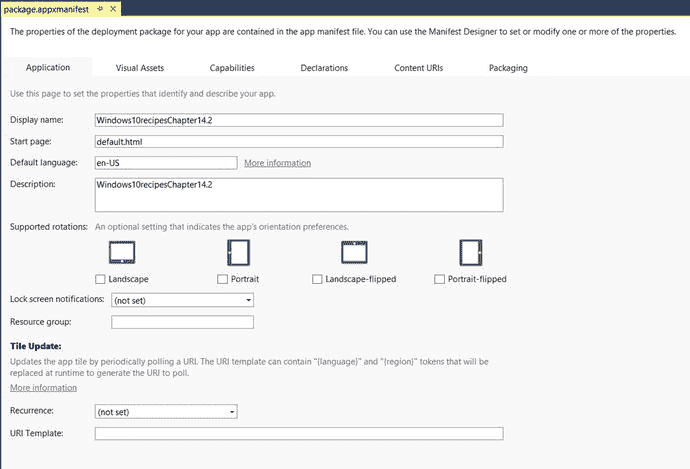
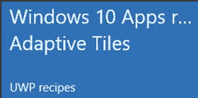
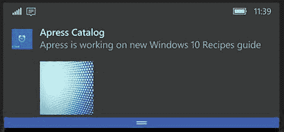
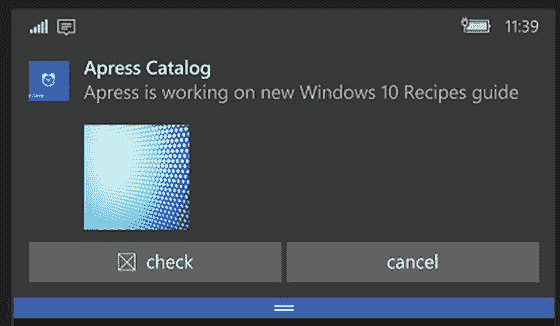
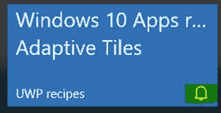

# 第 14 章：磁贴和通知

众所周知，在 Windows 8 中，微软引入了一种使用磁贴启动应用程序的新方式，磁贴是用户体验的标志性组成部分。在 Windows 10 中，还有一些令人兴奋且不同的附加功能。本章概述了 Windows 10 中可用的磁贴和通知。你将探索如何创建不同类型的磁贴和通知。

## 14.1 创建默认磁贴

### 问题

你需要在应用程序中添加一个默认磁贴。

### 解决方案

使用 `package.appxmanifest` 为 UWP 应用磁贴和显示提供信息。


### 工作原理

在 Visual Studio 2015 中创建一个新的通用 Windows 应用项目。打开项目的 `package.appxmanifest` 文件。这将打开清单编辑器窗口，如图 14-1 所示。



图 14-1. 应用程序的 `package.appmanifest` 文件

如果尚未选中，请选择 **应用程序** 选项卡。根据需要更改 **显示名称** 的值。显示名称是应用名称，会列在应用列表的已安装/可用应用中，并显示在应用的标题栏里。

在应用清单中，单击 **视觉资产** 选项卡。在 **磁贴和徽标** 部分，更换为徽标提供的图像，并在 Windows 清单中选择徽标。更改或输入应用的新 **短名称**，其长度应为 13 个字符，否则将被截断。选择显示短名称的合适磁贴尺寸。您可以以 W3DC 格式（例如 `#FFFFFF`）输入首选的背景颜色，或使用默认背景颜色。

编译项目并运行应用，以测试通过应用创建的磁贴标题和图像徽标。

## 创建自适应磁贴

自适应磁贴是 Windows 10 的新增功能。对于自适应磁贴，有新的轻量级 XML 模板，允许开发者根据自身需求设计磁贴通知内容，以支持不同的设备和显示器。

### 问题

您想为 UWP 应用创建自适应磁贴。

### 解决方案

与标准磁贴类似，使用自适应磁贴模板提供磁贴内容。要创建自适应磁贴，可使用自适应磁贴模板来创建不同类型的磁贴。

通知可视化工具 (`https://www.microsoft.com/store/apps/9nblggh5xsl1`) 可帮助开发者设计自适应磁贴。它提供即时的视觉预览，帮助您快速设计和测试自适应磁贴。它还提供了一种简便的方法来配置磁贴属性，如文本、字体、显示颜色、显示名称、背景图像、徽章值等。

自适应模板适用于不同类型的通知和不同外形规格。自适应磁贴的外观取决于应用安装所在的设备以及通知的类型（磁贴或 Toast）。

自适应磁贴的 XML 模式语法如下：

```
<tile>
  <visual>
    <binding template="TileMedium">
      ...
    </binding>
    <binding template="TileWide">
      ...
    </binding>
    <binding template="TileLarge">
      ...
    </binding>
  </visual>
</tile>
```

`binding` 元素是关键，其中指定了每个磁贴尺寸的内容。在一个 XML 负载中，您可以指定多个绑定。以下是可以指定在 `binding` 的 `template` 参数中的不同磁贴尺寸类型：

- `TileSmall`
- `TileMedium`
- `TileWide`
- `TileLarge`（仅限桌面版）

### 工作原理

自适应磁贴模板基于 XML。让我们使用通知可视化工具生成自适应磁贴的 XML。

在 Visual Studio 2015 中创建一个新的通用 Windows 应用项目。这将创建一个新的 Windows 应用项目。在 Visual Studio 解决方案资源管理器中，从项目中打开 `default.html` 页面。在 `default.html` 的 `body` 标签内添加以下 HTML 标记。

```
<input type="button" value="更新自适应磁贴" id="btnUpdateAdaptiveTile" />
```

此 HTML 在 `default.html` 页面上添加了一个简单的 HTML 按钮，其文本为“更新自适应磁贴”。

现在，右键单击解决方案资源管理器中的项目，然后选择 **添加 ➤ 新建 JavaScript 文件**。为文件命名：`LoadTileandNotifications.js`。添加以下代码：

```
function GetControl() {
        WinJS.UI.processAll().done(function () {
            var adaptiveTilebutton = document.getElementById("btnUpdateAdaptiveTile");
            adaptiveTilebutton.addEventListener("click", AddAdaptiveTiles, false);
    }
document.addEventListener("DOMContentLoaded", GetControl);
```

在上述代码中，您为 `btnUpdateAdaptiveTile` HTML 按钮添加了一个事件处理程序 `AddAdaptiveTiles()`。然后在 `default.html` 加载时添加了 `GetControl` 方法。

重新打开 `default.html`，并添加对 `LoadTileandNotifications.js` 文件的引用。

```
<script src="/js/LoadTileandNotifications.js"></script>
```

现在，让我们使用 `LoadTileandNotifications.js` 文件中的以下代码片段添加一个 `AddAdaptiveTiles()` 事件处理程序方法。

```
    function AddAdaptiveTiles() {
        var adaptivetileXml = "<tile><visual displayName=\"UWP 食谱\" branding=\"name\">"
        + "<binding template=\"TileSmall\"><group><subgroup><text hint-style=\"subtitle\"> Windows 10 应用食谱 </text><text hint-style=\"subtitle\">自适应磁贴</text></subgroup></group></binding>"
        + "<binding template=\"TileMedium\"><group><subgroup><text hint-style=\"subtitle\"> Windows 10 应用食谱 </text><text hint-style=\"subtitle\">自适应磁贴</text></subgroup></group></binding>"
        + "<binding template=\"TileLarge\"><group><subgroup><text hint-style=\"subtitle\"> Windows 10 应用食谱 </text><text hint-style=\"subtitle\">自适应磁贴</text></subgroup></group></binding>"
        + "<binding template=\"TileWide\"><group><subgroup><text hint-style=\"subtitle\"> Windows 10 应用食谱 </text><text hint-style=\"subtitle\">自适应磁贴</text></subgroup></group></binding>"
        + "</visual></tile>";

        var adaptivetileDom = Windows.Data.Xml.Dom.XmlDocument();
        adaptivetileDom.loadXml(adaptivetileXml);
        var notifications = Windows.UI.Notifications;
        var tileNotification = new notifications.TileNotification(adaptivetileDom);
        notifications.TileUpdateManager.createTileUpdaterForApplication().update(tileNotification);
    }
```

在此事件监听函数中，您创建了一个 `XmlDocument` 对象 `adaptivetileDom`，用于加载 `adaptivetileXml`。`adaptivetileXml` 包含了 `adaptiveTile` 的 XML 负载，其中包含以下自适应磁贴绑定：

- `TileSmall`
- `TileMedium`
- `TileLarge`
- `TileWide`

上述代码中使用了 `Windows.UI.Notifications` 命名空间。

在 `adaptivetileXml` 中，所有磁贴都具有以下显示名称：UWP 食谱。下一个参数是 `branding`，设置为 `name`。这会在磁贴底部显示名称值。

`<group>` 和 `<subgroup>` 元素用于在语义上对磁贴上显示的内容进行分组。在此例中，先显示“Windows 10 应用食谱”，然后在下一行显示“磁贴中的食谱”。这两个文本元素被组合在一起。

在 `TileLarge` 绑定中，我们还在磁贴中显示了图像以及文本内容。该图像与文本内联显示，但您也可以将其设置为磁贴的背景。

当磁贴中有多列时，`hint-width` 属性用于指定列的宽度。

`XmlDocument` 创建后，创建一个类型为 `Windows.UI.Notifications.TileNotification()` 的 `tileNotification` 对象，并将 `adaptivetileXml` 作为参数传递给 `TileNotification` 类。`tileNotification` 对象用于定义磁贴以及与磁贴相关的视觉元素。

之后，使用 `TileUpdateManager` 类将通知发送到应用的磁贴，该类通过 `createTileUpdaterForApplication().update()` 方法更改更新程序所绑定的指定磁贴的内容。

当您在 Windows 10 设备上运行应用程序时，单击 **更新自适应磁贴** 按钮以动态更新磁贴，如图 14-2 所示。



图 14-2. 使用 `Windows.UI.Notifications.TileNotification()` 更新 Windows 10 自适应磁贴


## 14.3 创建包含视觉内容的 Toast 通知

### 问题

希望创建一个交互式 Toast 通知，使其能够显示图像，并覆盖应用徽标和通知中的内联图像缩略图。

### 解决方案

Windows 10 UWP 提供了使用类似自适应磁贴的 XML 模板开发的 Toast 通知。Toast 通知的 XML 主要包含三个关键元素：视觉（visual）、操作（action）和音频（audio）。`ToastNotificationManager` 用于发送 Toast 通知。请使用 `ToastNotificationManager` 向应用发送新通知。

### 工作原理

在上一节中，您使用 XML Schema 创建了一个自适应磁贴。现在，您将以类似的方式创建一个交互式 Toast 通知，用于在 Apress 目录中有新书添加时通知用户。

使用同一个项目。在 `default.html` 的 `<body>` 标签内添加以下 HTML 标记。

```
<input type="button" value="显示 Toast" id="btnDisplayToast" />
<br />
```

这将在 `default.html` 页面上创建一个简单的“显示 Toast”HTML 按钮。

打开 `LoadTileandNotifications.js`，并在现有的 `GetControl()` 方法中添加以下代码：

```
var toastNotificationbutton = document.getElementById("btnDisplayToast");
toastNotificationbutton.addEventListener("click", DisplayToastNotification, false);
```

在上述代码中，您获取了 `btnDisplayToast` 按钮的引用，并将点击事件处理程序与 `AddToastNotification()` 方法关联。

使用以下代码片段添加一个新的 `AddToastNotification` 事件方法：

```
function AddToastNotification()
  {
      var toastXML = "<toast><visual>"
+ "<binding template=\"ToastGeneric\"><text>Apress 目录</text><text>Apress 正在编写新的 Windows 10 指南</text>"
+ "<image placement=\"appLogoOverride\" src=\"/images/Alarm.png\" /><image placement=\"inline\" src=\"/images/Pattern-Blue-Dots-background.jpg\" /></binding>"
+ " </visual>"
    + "</toast>";
      var toastNotificationDom = Windows.Data.Xml.Dom.XmlDocument();
      toastNotificationDom.loadXml(toastXML);
      var notifications = Windows.UI.Notifications;
      // 获取当前应用的 Toast 通知管理器。
      var notificationManager = notifications.ToastNotificationManager;
      // 从 XML 创建 Toast 通知，然后创建 ToastNotifier 对象
      // 以发送 Toast。
      var toast = new notifications.ToastNotification(toastNotificationDom);
      notificationManager.createToastNotifier().show(toast);
  }
```

在上述事件监听方法中，`adaptivetileXml` 变量包含了 Toast 通知的 XML 内容，这与“自适应磁贴”类似，但在 `<binding>` 元素中，模板值设置为 `ToastGeneric`。

然后创建一个类型为 `ToastNotification` 的新 `toast` 对象，并指定 `toastNotificationDom` `XmlDocument`。之后，使用 `ToastNotificationManager` 类将通知发送到应用的磁贴，该类会发送指定 Toast 的内容。

在模拟器中运行应用，并加载默认页面。点击“显示 Toast”按钮测试输出，如图 14-3 所示。



图 14-3.

来自 UWP 应用的 Toast 通知

您可以创建与应用关联的 Toast 通知，并在应用运行时动态通知用户。在下一个技巧中，您将学习如何为 Toast 通知添加操作。

## 14.4 创建带操作的 Toast 通知

### 问题

希望创建带有可选操作的交互式 Toast 通知，供用户选择。

### 解决方案

在 Toast 通知的 XML 中添加 `<Actions>` 元素。

### 工作原理

在之前的技巧中，您使用 XML Schema 创建了一个自适应 Toast 通知。现在，您将以类似的方式创建一个带有操作的交互式 Toast 通知，当 Apress 目录中有新书时通知用户，并允许用户执行操作。

我们沿用上一个技巧中的项目。打开 `LoadTileandNotifications.js` 文件。添加一个新方法 `AddInteractiveToastNotification()`。

```
function AddInteractiveToastNotification()
    {
        var toastXML = "<toast><visual>"
+ "<binding template=\"ToastGeneric\"><text>Apress 目录</text><text>Apress 正在编写新的 Windows 10 指南</text>"
+ "<image placement=\"appLogoOverride\" src=\"/images/Alarm.png\" /><image placement=\"inline\" src=\"/images/Pattern-Blue-Dots-background.jpg\" /></binding>"
+ " </visual>"
+ "<actions><action content=\"查看\" arguments=\"check\" imageUri=\"/images/storelogo.png\" /><action content=\"取消\" arguments=\"cancel\" /></actions>"
+ " <audio src=\"ms-winsoundevent:Notification.Reminder\"/>"
+ "</toast>";
        var toastNotificationDom = Windows.Data.Xml.Dom.XmlDocument();
        toastNotificationDom.loadXml(toastXML);
        var notifications = Windows.UI.Notifications;
        // 获取当前应用的 Toast 通知管理器。
        var notificationManager = notifications.ToastNotificationManager;
        // 从 XML 创建 Toast 通知，然后创建 ToastNotifier 对象
        // 以发送 Toast。
        var toast = new notifications.ToastNotification(toastNotificationDom);
        notificationManager.createToastNotifier().show(toast);
    }
```

在 `AddInteractiveToastNotification()` 事件处理方法中，唯一的区别在于 XML 内容，您添加了额外的元素以允许用户执行操作。同时，当 Toast 通知发送到应用时，它还会播放一个通知音效。操作在 `<actions><action>` 元素下指定。

在 `default.html` 中，为显示交互式通知事件的新按钮添加以下代码行：

```
<p>
        <input type="button" value="显示交互式 Toast" id="btnDisplayinteractiveToast" />
        <br />
</p>
```

这段代码添加了一个新按钮“显示交互式 Toast”。为了将 `AddInteractiveToastNotification()` 方法与 `btnDisplayinteractiveToast` 按钮关联，我们在现有的 `GetControl()` 方法中添加以下代码行。

```
var toastinteractiveNotificationbutton = document.getElementById("btnDisplayinteractiveToast");
toastinteractiveNotificationbutton.addEventListener("click", AddInteractiveToastNotification, false);
```

上述代码与上一个技巧相同，您将按钮点击事件处理程序与一个方法关联。这里，您将带有 `btnDisplayinteractiveToast` id 的按钮与 `AddInteractiveToastNotification()` 方法关联。

编译项目并在模拟器中运行。当 `default.html` 页面加载后，按下“显示交互式 Toast”按钮。点击按钮后，通知将以两个不同的可选操作展示给用户。同时也会播放一个通知音效，如图 14-4 所示。



图 14-4.

来自应用的交互式 Toast 通知

在本技巧中，您学习了如何通过 Toast 通知与用户进行交互。您还学习了如何让用户根据 Toast 通知执行操作。

## 14.5 创建定时磁贴和 Toast 通知

### 问题

希望创建一个带有提醒功能的交互式 Toast 通知。

### 解决方案

在磁贴和 Toast 通知的 XML 中添加 `<Actions>` 元素。


### 工作原理

在上一节中，你使用 XML 架构创建了一个自适应 Toast 通知。现在，我们以类似的方式，创建一个包含操作按钮的交互式 Toast 通知，用于通知用户 Apress 目录中新增了书籍，并允许用户执行相应操作。

沿用上一节中的项目。打开 `LoadTileandNotifications.js` 文件，并添加以下 `AddScheduledTileNotification()` 方法。

```
function AddScheduledTileNotification() {

        var adaptivetileXml = "<tile><visual displayName=\"Future recipes\" branding=\"name\">"
+ "<binding template=\"TileSmall\"><group><subgroup><text hint-style=\"subtitle\"> Updated Tiles </text><text hint-style=\"subtitle\">Adaptive Tiles</text></subgroup></group></binding>"
+ "<binding template=\"TileMedium\"><group><subgroup><text hint-style=\"subtitle\">  Updated Tiles </text><text hint-style=\"subtitle\">Adaptive Tiles</text></subgroup></group></binding>"
+ "<binding template=\"TileLarge\"><group><subgroup><text hint-style=\"subtitle\">  Updated Tiles </text><text hint-style=\"subtitle\">Adaptive Tiles</text></subgroup></group></binding>"
+ "<binding template=\"TileWide\"><group><subgroup><text hint-style=\"subtitle\">  Updated Tiles </text><text hint-style=\"subtitle\">Adaptive Tiles</text></subgroup></group></binding>"
+ "</visual></tile>";

        var adaptivetileDom = Windows.Data.Xml.Dom.XmlDocument();
        adaptivetileDom.loadXml(adaptivetileXml);

        var currentTime = new Date();
        //notification should appear in 3 seconds
        var startTime = new Date(currentTime.getTime() + 3 * 1000);

        var scheduledTile = new Windows.UI.Notifications.ScheduledTileNotification(adaptivetileDom, startTime);
        //Give the scheduled tile notification an ID
        scheduledTile.id = "Future_Tile";

        var tileUpdater = Windows.UI.Notifications.TileUpdateManager.createTileUpdaterForApplication();
        tileUpdater.addToSchedule(scheduledTile);
    }
```

在此方法中，我们在局部变量 `adaptivetileXml` 中为磁贴设置了新的 XML。然后创建了一个 `XMLDocument` 类型的局部对象 `adaptivetileDom`，并将 `adaptiveXml` 文本加载到其中。

要向磁贴发送计划更新，首先需要设定计划时间。为此，我们创建了一个局部变量 `startTime`，并将其值设置为当前时间加 3 秒。接着，创建一个 `Windows.UI.Notifications.TileUpdateManager.createTileUpdaterForApplication()` 类型的 `tileUpdater` 对象，然后调用 `addToSchedule` 方法，在设定的时间发送更新。

为了执行上述方法，需添加一个 HTML 按钮，并绑定一个事件处理程序来调用该方法。打开 `default.html`，添加以下 HTML 代码片段，以创建一个文本为“Scheduled Adaptive Tile”的 HTML 按钮。

```
<p>
        <input type="button" value="Scheduled  Adaptive Tile" id="btnScheduledAdaptiveTile" />
        <br />
    </p>
```

接下来，打开 `LoadTileandNotifications.js`，用以下代码行更新现有的 `LoadTileandNotifications()` 方法：

```
     var ScheduledAdaptiveTilebutton = document.getElementById("btnScheduledAdaptiveTile");
            ScheduledAdaptiveTilebutton.addEventListener("click", AddScheduledTileNotification, false);
```

这将为 `btnScheduledAdaptiveTile` 按钮添加一个新的 `onclick` 事件处理程序，并将 `AddScheduledTileNotification` 方法与按钮点击事件关联起来，以便在点击“Scheduled Adaptive Tile”按钮时执行该方法。

若要测试此功能，请编译并运行应用程序。当 `default.html` 页面加载后，点击“Scheduled Adaptive Tile”按钮。这会在 3 秒后向磁贴发送一个通知。你可以通过查看磁贴标题和文本来验证效果，它们会在计划时间发生变化。

在本节中，你已成功在计划时间向 UWP 应用磁贴发送了更新。当需要根据内容变化（例如天气应用、邮件应用、旅行日程应用等）发送动态更新时，计划更新非常有用。

## 14.6 在磁贴上创建或更新徽章

### 问题

你想要向磁贴添加一个徽章。

### 解决方案

在磁贴 XML 负载中使用 `<badge>` 元素来显示徽章。使用 `BadgeNotification` 来创建徽章。

### 工作原理

在现有项目中，我们将添加一个额外的方法 `UpdateTileBadge`，以演示如何在磁贴上创建徽章更新。打开 `LoadTileandNotifications.js` 并添加以下方法：

```
  function UpdateTileBadge()
    {
        AddAdaptiveTiles();

        var badgeXml = "<badge value=\"alarm\"/>";
        var badgeDom = Windows.Data.Xml.Dom.XmlDocument();
        badgeDom.loadXml(badgeXml);

        var notifications = Windows.UI.Notifications;
        var badgeNotification = new notifications.BadgeNotification(badgeDom);

        notifications.BadgeUpdateManager.createBadgeUpdaterForApplication().update(badgeNotification);
    }
```

在此方法中，我们调用 `AdaptiveTiles()` 方法来显示自适应磁贴。

然后，我们添加 `badgeXML`，其中包含用于在磁贴上显示闹钟徽章的 XML 负载。在 `badgeXml` 中，我们将徽章的值设置为“Alarm”。

接着，我们创建一个 `Windows.UI.Notifications.BadgeNotification` 类型的 `badgeNotifications` 对象，并传入徽章通知的 XML。

之后，调用 `createBadgeUpdaterForApplication.update()` 方法，用徽章通知更新磁贴。

现在，打开 `default.html` 并添加一个新按钮，用于测试 `UpdateTileBadge()` 方法更新磁贴徽章的功能。

```
<p> <input type="button" value="Update Badge" id="btnUpdateBadge" />
        <br />
    </p>
```

接下来，打开 `LoadTileandNotifications.js`，用以下代码行更新 `GetControl()` 方法：

```
var badgeUpdatebutton = document.getElementById("btnUpdateBadge");
            badgeUpdatebutton.addEventListener("click", UpdateTileBadge, false);
```

这将为 `btnUpdateBadge` 按钮添加一个新的 `onclick` 事件处理程序，并将 `UpdateTileBadge` 方法与按钮点击事件关联起来，以便在点击“Update Badge”按钮时执行该方法。

编译并运行此应用后，在 `default.html` 页面上点击“Update Badge”按钮。这将更新磁贴，应用磁贴会显示一个徽章，并在右下角显示一个 Windows 闹钟图标，如图 14-5 所示。



图 14-5.

在 Windows UWP 自适应磁贴上的徽章通知

徽章 XML 中可以指定不同类型的 Windows 图标，例如 alarm（闹钟）、alert（警报）、available（可用）、error（错误）、paused（暂停）、new message（新消息）等。

**注意：** 在 UWP 应用中，徽章显示在右下角。

在本章中，你已经学习了 UWP 应用磁贴的相关知识、更新磁贴的多种方法、如何通过磁贴添加通知，以及如何动态更新自适应磁贴的内容。

