# 第 15 章：设备功能

本章概述了 Windows 10 应用中的设备功能。你还将学习如何在 UWP 应用中开发蓝牙、文本转语音、语音转文本以及传感器功能。本章还概述了应用中集成 Cortana 的相关内容。

## 15.1 如何在应用包清单中指定设备功能

### 问题

你需要指定 Windows 10 应用所需的不同设备功能。

### 解决方案

使用应用包清单文件来指定 `DeviceCapability` 元素及其相关的子元素。


### 工作原理

在 Visual Studio 2015 中打开你正在开发的 Windows 10 应用项目。在解决方案资源管理器中，找到 `Package.appmanifest` 文件。双击该文件将其打开。点击“功能”选项卡。选择你的应用将使用的设备功能。这将在应用程序中添加功能列表（见图 15-1）。

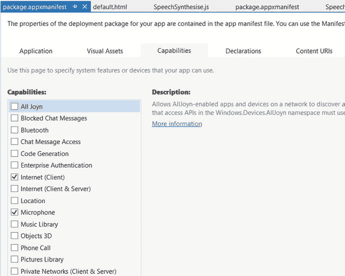

图 15-1. 应用 `Package.appmanifest` 文件中的“功能”选项卡

你也可以在 XML 编辑器中打开应用的 `Package.appmanifest` 文件，并使用 `<Capabilities>` 元素下的 `<Capability>` 元素来添加设备功能。例如：

```
<Capabilities>
    <Capability Name="internetClient" />
    <Capability Name="allJoyn" />
    <Capability Name="codeGeneration" />
    <Capability Name="internetClientServer" />
    <uap:Capability Name="blockedChatMessages" />
    <uap:Capability Name="chat" />
    <uap:Capability Name="videosLibrary" />
    <uap:Capability Name="phoneCall" />
    <uap:Capability Name="removableStorage" />
    <DeviceCapability Name="microphone" />
    <DeviceCapability Name="webcam" />
</Capabilities>
```

在这个例子中，启用了以下供应用使用的功能：聊天、视频库、电话以及可移动数据存储（例如 USB 驱动器、麦克风和网络摄像头）。请注意，有些功能（如网络摄像头）无法通过 `Package.manifest` 的可视化界面来指定，而必须通过代码文件来实现。

## 15.2 如何为 Windows 应用的蓝牙指定设备功能

### 问题

你需要在 Windows 10 应用中访问蓝牙设备。

### 解决方案

使用 `Package.manifest` 中的 `DeviceCapability` 元素来定义访问蓝牙设备的设备功能。此方法同时适用于蓝牙 Rfcomm 和 Gatt API。

### 工作原理

在 Visual Studio 2015 中打开你的 Windows 通用 Windows 应用项目。在解决方案资源管理器中，找到 `Package.appmanifest` 文件。右键单击该文件，在 XML 编辑器中打开 `Package.appmanifest`。找到 `<Capabilities>` 部分。在 `<Capabilities>` 下添加以下元素：

```
<DeviceCapability Name="bluetooth.rfcomm">
  <Device Id="any">
    <Function Type="name:obexObjectPush"/>
    <Function Type="name:serialPort"/>
    <Function Type="name:genericFileTransfer"/>
  </Device>
</DeviceCapability>
```

在上述代码中，`<DeviceCapability>` 元素的 `Name` 属性被指定为 `"bluetooth.rfcomm"`，用于访问蓝牙 RFCOMM 设备。`<Device>` 元素设置为 `"any"`，以允许访问与 `<function>` 元素中指定的功能类型相匹配的任何设备。

`<DeviceCapability>` 也可用于为蓝牙 GATT 设备指定设备功能，如下面的代码片段所示：

```
<DeviceCapability Name="bluetooth.genericAttributeProfile">
  <Device Id="any">
    <Function Type="name:battery"/>
    <Function Type="name:bloodPressure"/>
    <Function Type="serviceId:aaaaaaa"/>
  </Device>
</DeviceCapability>
```

在上述代码中，针对蓝牙 GATT "any" 设备的 `DeviceCapabilities` 支持具有指定服务名称和服务 ID 的所述功能。

## 15.3 如何查找 UWP 应用可用的设备

### 问题

你希望获取连接到系统的设备列表——无论是外部连接的设备还是对 UWP 应用可用的设备。

### 解决方案

使用 `Windows.Devices.Enumeration.DevicePicker` 类来枚举应用可发现的设备。

### 工作原理

使用 Microsoft Visual Studio 2015 中的 Windows 通用（空白应用）模板创建新项目。

在 Visual Studio 解决方案资源管理器中，打开项目中的 `default.html` 页面。添加以下 HTML 标记以显示一个按钮和标签：

```
<body class="win-type-body">
    <div>
        <h2 id="sampleHeader" class="win-type-subheader">描述：</h2>
        <div id="scenarioDescription">
            演示 DevicePicker 的示例，允许你的应用用户选择设备
        </div>
    </div>
    <div id="scenarioContent">
        <button id="showDevicePickerButton" >显示设备选择器</button>
    </div>
</body>
```

在解决方案资源管理器中右键单击 `js` 文件夹。添加一个名为 `DevicePicker.js` 的 JavaScript 文件。在 `default.html` 中添加对此 `js` 文件的引用：

```html
<script src="/js/DevicePicker.js"></script>
```

在 Visual Studio 中打开 `devicePicker.js`，并添加以下脚本：

```javascript
(function () {
    "use strict";
    var DevEnum = Windows.Devices.Enumeration;
    var devicePicker = null;
    var page = WinJS.UI.Pages.define("../default.html", {
        ready: function (element, options) {
            // 挂钩按钮事件处理程序
            document.getElementById("showDevicePickerButton").addEventListener("click", showDevicePicker, false);
        }
    });
```

在上述代码中，我们声明了一个类型为 `Windows.Devices.Enumeration` 的变量。稍后将使用此对象来创建 `DevicePicker` 对象。`page` 变量用于在 DOM 加载完成后，将剩余的 `js` 脚本绑定到默认页面。在 `ready()` 函数中，我们将一个名为 `showDevicePicker` 的事件处理程序绑定到 `showDevicePickerButton` 按钮。

添加以下 `showDevicePicker()` 方法，该方法将获取可用的设备：

```javascript
    function showDevicePicker() {
        var buttonRect;
        devicePicker = new DevEnum.DevicePicker();
        buttonRect = document.getElementById("showDevicePickerButton").getBoundingClientRect();
        var rect = { x: buttonRect.left, y: buttonRect.top, width: buttonRect.width, height: buttonRect.height };
        // 显示选择器
        devicePicker.show(rect);
    }
})();
```

在 `showDevicePicker()` 事件处理程序中（该处理程序在点击 `showDevicePickerButton` 按钮时被调用），我们创建了一个 `Windows.Devices.Enumeration.DevicePicker` 对象，并创建一个矩形对象来显示选择器 UI 输出。

编译此项目并使用移动仿真器运行，以获取所有设备的列表，如图 15-2 所示。

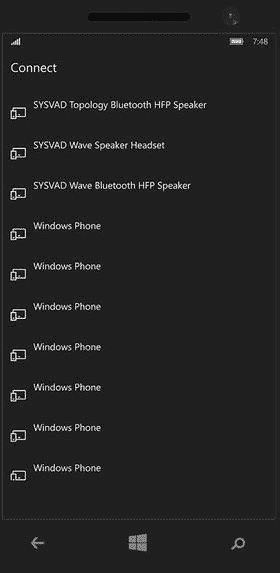

图 15-2. 获取系统上应用可用的所有设备的枚举列表

## 15.4 如何创建音频流并基于纯文本输出语音

### 问题

你需要在应用中添加语音功能，使其能够朗读文本。

### 解决方案

使用 `Windows.Media.SpeechSynthesis.SpeechSynthesizer()` 在你的 UWP 应用中基于文本开发音频/语音输出。


### 工作原理

Microsoft 提供了预定义的语音，可用于合成单一语言的语音。

使用 Microsoft Visual Studio 2015 中的 Windows 通用（空白应用）模板创建一个新项目。在项目 `package.appmanifest` 文件中，单击“功能”选项卡，然后选中“麦克风”和“Internet”复选框。这将允许应用使用音频输入。

在 Visual Studio 的解决方案资源管理器中，打开项目中的 `default.html` 页面。在 `default.html` 的 `<body>` 标签内添加以下 HTML 标记。

```html
<body class="win-type-body">
    <div id="scenarioView">
        <div>
            <h2 id="sampleHeader" class="win-type-subheader">将文本转换为语音。</h2>
        </div>
        <div id="scenarioContent">
            <button id="btnSpeak" class="win-button">朗读</button>
            <select id="voicesSelect" class="win-dropdown"></select>
            <textarea id="textToSynthesize" style="width: 100%" name="textToSynthesize" class="win-textarea"> Hello World! 这是 Windows 10 通用 Windows 应用食谱的一个示例</textarea>
            <p id="errorTextArea"></p>
        </div>
    </div>
    <div id="contentWrapper">
        <div id="contentHost"></div>
        <div id="statusBox">
            状态：
            <div id="statusMessage"></div>
        </div>
    </div>
</body>
```

在调试模式下于移动模拟器中启动该应用时，将显示图 15-3 所示的内容。

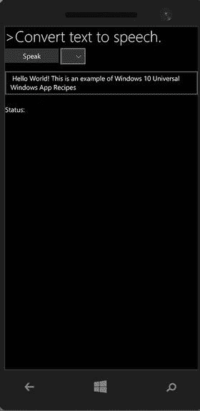

**图 15-3.** 带有用于选择语言的下拉列表的文本转语音图形用户界面

如您所见，添加了四个主要控件：

- 一个**朗读**按钮
- 一个允许用户选择可用语言的下拉列表
- 一个包含预定义文本的文本框。该文本将由应用转换为音频
- 一个**状态**标签，在播放或停止语音时显示消息

在解决方案资源管理器中右键单击项目，然后选择“添加” ➤ “新建 JavaScript 文件”。为文件提供一个名称。在此示例中，我们将文件命名为 `SpeechSynthesise.js`。在文件中添加以下代码：

```javascript
var page = WinJS.UI.Pages.define("../default.html", {
    ready: function (element, options) {
        try {
            synthesizer = new Windows.Media.SpeechSynthesis.SpeechSynthesizer();
            audio = new Audio();
            var btnSpeak = document.getElementById("btnSpeak");
            var voicesSelect = document.getElementById("voicesSelect");
            btnSpeak.addEventListener("click", speakFn, false);
            voicesSelect.addEventListener("click", setVoiceFunction, false);
            var rcns = Windows.ApplicationModel.Resources.Core;
            context = new rcns.ResourceContext();
            context.languages = new Array(synthesizer.voice.language);
            listbox_GetVoices();
            audio_SetUp();
        } catch (exception) {
            if (exception.number == -2147467263) { // E_NOTIMPL
                // 如果未安装媒体播放器组件（例如，使用 Windows N 版本 SKU 时），
                // 实例化 Audio 对象时可能会发生此错误。
                statusMessage.innerText = "媒体播放器组件不可用。";
                statusBox.style.backgroundColor = "red";
                btnSpeak.disabled = true;
                textToSynthesize.disabled = true;
            }
        }
    },
    unload: function (element, options) {
        if (audio != null) {
            audio.onpause = null;
            audio.pause();
        }
    }
});
```

声明以下变量：

```javascript
var synthesizer;
var audio;
// 本地化资源
var context;
var resourceMap;
```

当在加载了应用的设备上，`default.html` 页面的 DOM 加载完成后，`ready()` 函数将被执行。在此函数中，创建一个类型为 `Windows.Media.SpeechSynthesis.SpeechSynthesizer()` 的本地 `synthesizer` 对象，它提供了对 Microsoft 设备上已安装的语音合成引擎功能的访问，并控制该语音合成引擎（语音）。

第二个对象是 `audio`，用于播放音频。然后，我们为**朗读**按钮和 `voicesSelect` 下拉 HTML 控件关联事件侦听器。

我们还创建了一个类型为 `Windows.ApplicationModel.Resources.Core` 的本地 `rcns` 对象。此对象用于枚举设备中的所有可用资源。稍后将用它来获取已安装的语音，并通过下拉控件进行显示。

在上述代码中，我们还声明了在**朗读**按钮和 `voicesSelect` 下拉列表的单击事件中调用的其他方法所使用的局部变量。请注意，我们还捕获了一个异常，以防设备中缺少媒体播放器组件而无法播放音频。如果发生异常，我们会捕获它，并在 HTML `div` 对象中显示 `StatusMessage` 错误信息。

添加以下方法：

```javascript
function audio_SetUp() {
    audio.onplay = function () { // 当语音开始播放时执行
        statusMessage.innerText = "正在播放";
    };
    audio.onpause = function () { // 当用户按下停止按钮时执行
        statusMessage.innerText = " 音频播放完毕";
        btnSpeak.innerText = "朗读";
    };
    audio.onended = function () { // 当语音播放完成时执行
        statusMessage.innerText = "已完成";
        btnSpeak.innerText = "朗读";
        voicesSelect.disabled = false;
    };
}
```

`audio_SetUp()` 方法设置了语音元素的事件，以便应用的用户界面根据语音播放的当前状态进行更新。

接下来，添加以下方法：

```javascript
function speakFn() {
    var btnSpeak = document.getElementById("btnSpeak");
    if (btnSpeak.innerText == "停止") {
        voicesSelect.disabled = false;
        audio.pause();
        return;
    }
    // 更改按钮标签。如果您不希望用户控制，也可以禁用该按钮。
    voicesSelect.disabled = true;
    btnSpeak.innerText = "停止";
    statusBox.style.backgroundColor = "green";
    // 从文本创建流。将使用音频元素播放该流。
    synthesizer.synthesizeTextToStreamAsync(textToSynthesize.value).done(
        function (markersStream) {
            // 设置源并开始播放合成的音频流。
            var blob = MSApp.createBlobFromRandomAccessStream(markersStream.ContentType, markersStream);
            audio.src = URL.createObjectURL(blob, { oneTimeOnly: true });
            markersStream.seek(0);
            audio.play();
        },
        function (error) {
            errorMessage(error.message);
        });
}
```

`speakFn()` 是当用户点击应用上的**朗读/停止**按钮时调用的主要方法。`synthesizer.synthesizeTextToStreamAsync()` 方法用于将文本框中的文本转换为 Blob 流。然后通过音频播放该流。

接下来，添加以下方法，允许用户从资源中选择不同的音频语音选项。

```javascript
function setVoiceFunction() {
    /// <summary>
    /// 当用户从下拉列表中选择语音时调用此方法。
    /// </summary>
    if (voicesSelect.selectedIndex !== -1) {
        var allVoices = Windows.Media.SpeechSynthesis.SpeechSynthesizer.allVoices;
        // 使用所选索引查找语音。
        var selectedVoice = allVoices[voicesSelect.selectedIndex];
        synthesizer.voice = selectedVoice;
        // 更改示例文本的语言。
        context.languages = new Array(synthesizer.voice.language);
    }
}
```

在此方法中，我们使用 `Windows.Media.SpeechSynthesis.SpeechSynthesizer.allVoices()` 来获取 `allVoices` 对象中所有已安装的语音合成引擎（语音）。

接下来，添加以下方法，根据设备已安装的语音创建选项。这些语音随后将显示在 `voicesSelect` 下拉控件中。

```javascript
function listbox_GetVoices() {
    /// <summary>
    /// 这将根据系统已安装的语音创建选项。然后这些语音将显示在列表框中。
    /// 这允许用户根据自己的偏好更改应用中合成器的语音。
    /// </summary>
    // 获取此机器上安装的所有语音的列表。
    var allVoices = Windows.Media.SpeechSynthesis.SpeechSynthesizer.allVoices;
    // 获取当前选中的语音。
    var defaultVoice = Windows.Media.SpeechSynthesis.SpeechSynthesizer.defaultVoice;
    var voicesSelect = document.getElementById("voicesSelect");
    for (var voiceIndex = 0; voiceIndex < allVoices.size; voiceIndex++) {
        var currVoice = allVoices[voiceIndex];
        var option = document.createElement("option");
        option.text = currVoice.displayName + " (" + currVoice.language + ")";
        voicesSelect.add(option, null);
        // 检查是否为当前语音，并设置其为列表框中选中的项。
        if (currVoice.id === defaultVoice.id) {
            voicesSelect.selectedIndex = voiceIndex;
        }
    }
}
```

最后，如果出现任何错误信息，有一个通用的 `errorMessage()` 方法用于在 `errorTextArea` 对象上显示错误。

```javascript
function errorMessage(text) {
    /// <summary>
    /// 使用错误消息的详细信息设置指定的文本区域。
    /// </summary>
    var errorTextArea = document.getElementById("errorTextArea");
    errorTextArea.innerText = text;
}
```

完成创建 `SpeechSynthesise.js` 文件后，请确保在 `default.html` 文件中添加引用。

```html
<script src="/js/SpeechSynthesise.js"></script>
```

当您在 Windows 10 移动模拟器中运行该应用程序时，应用会打开 `default.html` 文件。按下**朗读**按钮，以当前的默认语音播放声音。更新状态 `div` 中的值，如图 15-4 所示。

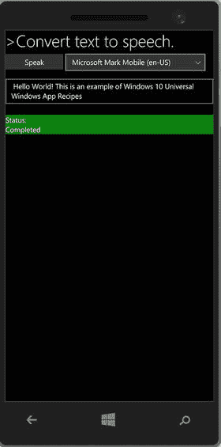

**图 15-4.** 文本转语音应用

在本例程中，您学习了如何使用 `Windows SpeechSynthesizer()` 类将文本转换为音频。请注意，您还可以指定 SSML 语言中的文本，并将其传递给 `Windows.Media.SpeechSynthesis.SpeechSynthesizer()` 的对象，以将指定文本转换为音频。


## 15.5 如何为语音识别指定识别约束

### 问题

你需要创建一个支持语音识别的应用程序。

### 解决方案

使用 `Windows.Media.SpeechRecognition.SpeechRecognizer` 对象创建语音识别器，并使用 `Windows.Media.SpeechRecognition.SpeechRecognitionListConstraint` 指定不同的语音识别约束。

在 UWP 应用中可以使用三种语音约束：

* `SpeechRecognitionTopicConstraint`：基于预定义语法，需要网络连接。
* `SpeechRecognitionListConstraint`：基于预定义的单词和短语列表。
* `SpeechRecognitionGrammarFileConstraint`：添加语音识别语法规范（SRGS）文件，所有约束都在此 XML 文件中指定。

本方案使用 `SpeechRecognitionListConstraint` 将语音转换为文本。

### 工作原理

在 Microsoft Visual Studio 2015 中使用 Windows 通用（空白应用）模板创建新项目。在项目的 `package.appmanifest` 文件中，单击“功能”选项卡，然后勾选“麦克风”和“Internet”复选框。这将允许应用使用音频输入。

打开 `default.html` 文件并复制以下代码：

```html
<body class="win-type-body">
    <div id="scenarioView">
        <div>
            <h2 id="sampleHeader" class="win-type-subheader">语音转文本</h2>
            <div id="scenarioDescription">
                <p>使用基于自定义列表语法的语音识别。</p>
            </div>
        </div>
        <div id="scenarioContent">
            <div>
                <button id="btnSpeak" class="win-button">说话</button>
            </div>
            <p id="errorTextArea"></p>
        </div>
    </div>
</body>
```

在解决方案资源管理器中右键单击项目，选择“添加” ➤ “新建 JavaScript 文件”。为文件命名。在此示例中，我们将其命名为 `Speechrecognisation.js`。

将以下代码添加到 `Speechrecognisation.js` 文件中：

```javascript
(function () {
    "use strict";
    function GetControl() {
        WinJS.UI.processAll().done(function () {
            var btnSpeak = document.getElementById("btnSpeak");
            btnSpeak.addEventListener("click", buttonSpeechRecognizerListConstraintClick, false);
            var resultTextArea = document.getElementById(resultTextArea);
        });
    }
    document.addEventListener("DOMContentLoaded", GetControl);
```

上述代码为 `btnSpeak` 按钮添加了一个事件接收器。现在添加一个 `buttonSpeechRecognizerListConstraintClick` 函数，当用户单击用户偏好表单控件上的“说话”按钮时触发该函数。

```javascript
function buttonSpeechRecognizerListConstraintClick() {
    // 创建 SpeechRecognizer 实例。
    var speechRecognizer =
      new Windows.Media.SpeechRecognition.SpeechRecognizer();
    // 你可以动态创建此数组。
    var responses = ["Yes", "No", "Hello", "Hello World"];
    // 向识别器添加网络搜索语法。
    var listConstraint =
        new Windows.Media.SpeechRecognition.SpeechRecognitionListConstraint(
        responses,
        "YesOrNo");
    speechRecognizer.uiOptions.audiblePrompt = "说出你要搜索的内容...";
    speechRecognizer.uiOptions.exampleText = "例如：'Yes', 'No', 'Hello'";
    speechRecognizer.constraints.append(listConstraint);
    var resultTextArea = document.getElementById(resultTextArea);
    // 编译默认听写语法。
    speechRecognizer.compileConstraintsAsync().done(
      // 成功函数。
      function (result) {
          // 开始识别。
          speechRecognizer.recognizeWithUIAsync().done(
            // 成功函数。
            function (speechRecognitionResult) {
                // 对识别结果进行处理。
                speechRecognizer.close();
            },
            // 错误函数。
            function (err) {
                if (typeof errorTextArea !== "undefined") {
                    errorTextArea.innerText = "语音识别失败。";
                }
                speechRecognizer.close();
            });
      },
      // 错误函数。
      function (err) {
          if (typeof errorTextArea !== "undefined") {
              errorTextArea.innerText = err;
          }
          speechRecognizer.close();
      });
}
})();
```

上述代码声明了一个名为 `speechRecognizer` 的变量。它被赋值给 `Windows.Media.SpeechRecognition.SpeechRecognizer()` 类，该类表示语音识别器对象的容器。下一行创建了 `responses` 静态数组变量，用于存储识别到的语音约束值。

然后，它在类型为 `Windows.Media.SpeechRecognition.SpeechRecognitionListConstraint()` 的对象实例中被引用，该实例加载了 `responses` 数组中指定的所有值。

以下是语音识别器的 UI 设置。将 `SpeechRecognitionListConstraint listcontraint` 传递给 `speechRecognizer` 对象。

接着，我们调用 `speechRecognizer.compileConstraintsAsync()` 方法，以异步方式编译 `constraints` 属性指定的所有约束。该方法执行后提供 `SpeechRecognitionCompilationResult` 类型的输出，该输出通过 `speechRecognitionResult` 成功函数捕获。我们还捕获错误并使用 `errorTextArea` 元素显示它们。

完成 `Speechrecognisation.js` 文件后，请确保在 `default.html` 中添加引用。

```html
<script src="js/Speechrecognisation.js"></script>
```

就这样。语音识别基于预定义的约束，并且可在应用中使用。它可用于捕获用户输入。

当你在 Windows Mobile 模拟器中运行该应用程序时，其外观如图 15-5 所示。单击“开始”并说出特定词语，例如“Yes”、“No”或“Hello”。语音识别器将对其进行验证。

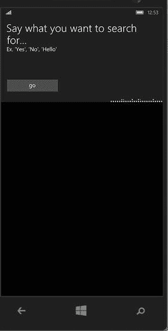

**图 15-5.** 基于自定义词语列表的语音识别

## 15.6 如何使用 Cortana 语音命令在前台启动应用

### 问题

你想要让用户能够使用 Cortana 语音命令在前台启动你的应用。

### 解决方案

使用语音命令定义（VCD）文件来定义包含激活应用命令的语音命令。当应用安装并执行时，VCD 文件将安装到 Cortana 中。

用户可以说出 VCD 文件中指定的命令来启动应用。Cortana 借助 Windows 语音平台和云托管的 Microsoft 语音识别服务来识别用户语音命令。这两种服务都会尝试识别语音，Cortana 接收到文本后，会通过 `onactivated` 事件启动应用程序及其中的语音命令。


### 工作原理

在 Microsoft Visual Studio 2015 中使用 Windows 通用（空白应用）模板创建一个新项目。

在项目中添加一个新的语音命令定义文件 `CortanaVoiceCommands.xml`，并向文件中添加以下 XML 代码：

```
<?xml version="1.0" encoding="utf-8" ?>
<VoiceCommands xmlns="http://schemas.microsoft.com/voicecommands/1.2">
  <CommandSet xml:lang="en-gb" Name="CortanaVoiceCommandSet">
    <AppName>Win10Recipes</AppName>
    <Example> Show Win10 Recipes </Example>
    <Command Name="showDevicesAvailableRecipes">
      <Example>Show</Example>
      <ListenFor RequireAppName="BeforeOrAfterPhrase">{command}</ListenFor>
      <ListenFor RequireAppName="ExplicitlySpecified">Listening to command </ListenFor>
      <Feedback> Recipes available in App </Feedback>
      <Navigate/>
    </Command>
    <PhraseList Label="command">
      <Item>Devices</Item>
      <Item>Text to Speech</Item>
    </PhraseList>
  </CommandSet>
</VoiceCommands>
```

在此语音命令定义文件中，有几个主要元素。`<CommandSet>` 元素定义了用于激活应用和执行命令的命令。`<CommandSet>` 元素还具有 `xml:Lang` 属性，用于指定命令语言。在本示例中，我们使用的是英式英语。

`<CommandPrefix>` 是我们应用的唯一名称。它在语音命令中作为前缀或后缀，用于激活应用。`<Command>` 元素用于指定用户可以说的命令内容。`<ListenFor>` 元素指定了 Cortana 应识别的文本。`<Feedback>` 元素指定了 Cortana 在启动应用时所说的文本。`<Navigate>` 元素表示语音命令用于在前台启动应用。

如果想通过语音命令在后台启动应用，请使用 `<VoiceCommandService>`。

创建 VCD 文件后，需要安装该文件指定的命令。为此，请使用 `installCommandDefinitionsFromStorageFileAsync` 方法。

从解决方案资源管理器中打开 `default.js`。在该文件中调用 `onactivated` 方法，并添加以下代码：

```
//加载 vcd
var storageFile = Windows.Storage.StorageFile;
var wap = Windows.ApplicationModel.Package;
var voiceCommandManager = Windows.ApplicationModel.VoiceCommands.VoiceCommandDefinitionManager;

wap.current.installedLocation.getFileAsync("CortanaVoiceCommands.xml")
  .then(function (file) {
    voiceCommandManager.installCommandDefinitionsFromStorageFileAsync(file);
  });

var activationKind = args.detail.kind;
var activatedEventArgs = args.detail.detail;
```

在上面的代码中，我们通过 `Windows.ApplicationModel.Package.current.installedLocation.getFileAsync` 方法获取对 VCD 文件的引用。然后调用 `installCommandDefinitionsFromStorageFileAsync` 方法来安装文件中指定的命令。现在，我们需要指定应用如何响应与 VCD 文件匹配的语音命令。为此，首先要检查 `IActivatedEventArgs.Kind` 是否为 `VoiceCommand`。在 `default.js` 的标准代码之后替换以下代码，以检查激活参数类型：

```
if (args.detail.kind === activation.ActivationKind.launch) {
  if (args.detail.previousExecutionState !== activation.ApplicationExecutionState.terminated) {
    // TODO: 此应用是刚刚启动的。请在此处初始化您的应用。
  } else {
    // TODO: 此应用之前被挂起，然后被终止。
    // 为了创建流畅的用户体验，请在此处恢复应用状态，使其看起来从未停止运行。
  }
  args.setPromise(WinJS.UI.processAll());
}
else if (activationKind == Windows.ApplicationModel.Activation.ActivationKind.voiceCommand)
{
  var speechRecognitionResult = activatedEventArgs[0].Result;
  // 获取语音命令的名称和所说的文本
  var voiceCommandName = speechRecognitionResult.RulePath[0];
  switch(voiceCommandName)
  {
    case "showDevicesAvailableRecipes":
      var textSpoken = speechRecognitionResult.semanticInterpretation.properties[0];
      var url = "Devices.html";
      nav.history.backStack.push({ location: "/Devices.html" })
      break;
    default:
      break;
  }
};

app.oncheckpoint = function (args) {
  // TODO: 此应用即将被挂起。请在此处保存任何需要在挂起期间持久化的状态。
  // 您可以使用 WinJS.Application.sessionState 对象，该对象会在挂起期间自动保存和恢复。
  // 如果在应用挂起前需要完成异步操作，请调用 args.setPromise()。
};

app.start();
```

前面的代码检查了 `Windows.ApplicationModel.Activation.ActivationKind` 的值，该值指定了激活的类型。检查 `ActivationKind` 是 `voiceCommand` 还是其他方式。如果应用是通过语音命令启动的，则需要将用户所说的内容获取到 `speechRecognitionResult` 变量中；要获取该字符串，请使用 `activatedEventArgs`。

`activatedEventArgs` 有一个名为 `Result` 的属性，它提供了 `SpeechRecognitionResult`。

要获取用户所说的文本，请使用 `speechRecognitionResult.RulePath[0]` 并将其存储在 `voiceCommandName` 局部变量中。

使用这个文本 (`voiceCommandName`)，可以决定需要显示应用的哪个页面。为此，使用 switch case 匹配 `voiceCommandName` 的值与 VCD 文件中指定的命令名称。在 `CortanaVoiceCommands.xml` 中，指定了命令名称 `showDevicesAvailableRecipes`。如果匹配成功，则在 `Devices.html` 中向用户显示应用页面。这样，应用就与 Cortana 集成了。当用户使用语音命令启动应用时，可以进一步增强功能，以启动应用内的各个页面。

> **注意**  
> 您无法使用 Visual Studio Mobile 模拟器测试此方案，因为 Cortana 需要 Microsoft 帐户注册和登录过程，这在 Mobile 模拟器上无法工作。相反，您需要将应用安装到设备上，然后运行 Cortana 来测试应用在前台启动的情况。

## 第 15 章：其他工具

Windows SDK 和 Microsoft Visual Studio 2015 提供了其他工具和功能，让开发人员能够轻松调试和测试其 Windows 应用。本章涵盖其中一些工具，例如 JavaScript 控制台窗口、DOM 资源管理器、诊断工具、Windows 10 Mobile 模拟器其他工具。这些工具在测试应用在各种场景下的表现时，极大地方便了开发人员的工作。

## 16.1 JavaScript 控制台窗口

### 问题

在调试通用 Windows 平台应用时，您希望查看 JavaScript 错误或写入调试消息。

### 解决方案

在 Visual Studio 2015 中使用 JavaScript 控制台窗口，在调试通用 Windows 平台应用时查看 JavaScript 错误或写入调试消息。


### 工作原理

`Microsoft Visual Studio 2015` 提供了一个名为“`JavaScript Console`”窗口的工具，允许开发者执行以下操作：

-   显示和修改变量的值。
-   运行可在当前上下文中执行的 JavaScript 代码。
-   查看 JavaScript 错误、异常和消息。
-   将应用中的消息显示到控制台窗口。

“`JavaScript Console`”窗口在应用运行时显示。或者，您可以从 `Visual Studio 菜单 调试 ➤ 窗口 ➤ JavaScript 控制台` 中打开“`JavaScript Console`”窗口，如图 16-1 所示。

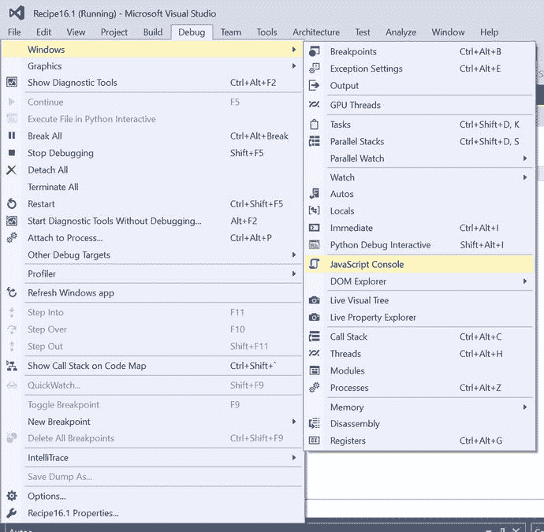

图 16-1. 从 `Visual Studio 2015` 访问“`JavaScript Console`”

要测试此功能，请使用 JavaScript 模板从 `Visual Studio 2015` 创建一个新的通用 Windows 平台应用。

生成解决方案，并使用“`本地计算机`”选项运行它。您应该会看到应用在桌面上运行。在应用仍在运行时切换到 `Visual Studio`。请注意，JavaScript 控制台列出了页面中所有可能的 JavaScript 错误，如图 16-2 所示。

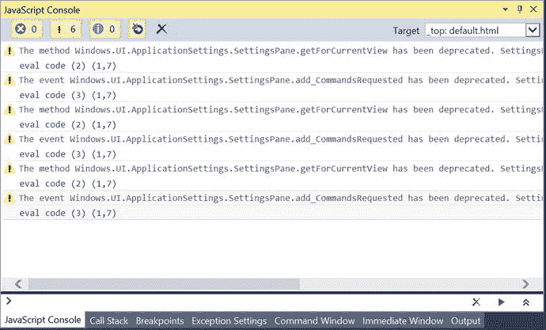

图 16-2. 显示警告和错误列表的“`JavaScript Console`”窗口

JavaScript 控制台提供以下选项：

-   查看错误消息
-   查看警告消息
-   查看消息
-   清除控制台的选项

开发者还可以编写调试消息，这些消息可在应用从 `Visual Studio 2015` 以调试模式运行时显示。这通过使用 `console.log` 方法实现。

让我们从项目的 `js` 文件夹中打开 `default.js` 文件，并将以下代码添加到文件的第一行，紧跟在 `use strict` 选项下方。

```
console.log("This is a custom log message");
```

当您运行应用并查看“`JavaScript Console`”窗口时，您会看到其中的消息，如图 16-3 所示。

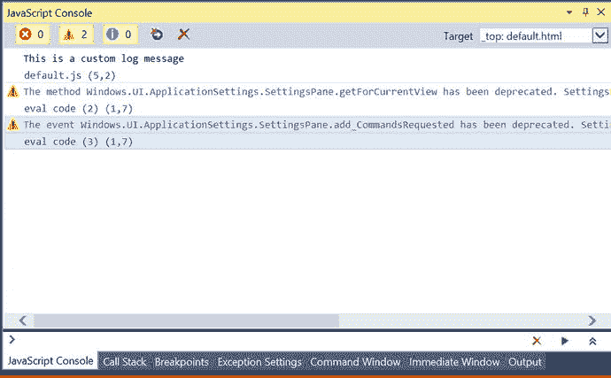

图 16-3. 显示日志消息的“`JavaScript Console`”窗口

表 16-1 列出了一些用于操作控制台窗口中消息的常用命令。

表 16-1. “`JavaScript Console`”窗口命令

| 命令名称 | 描述 |
| --- | --- |
| `assert(expression, message)` | 如果 `expression` 求值为 `false`，则发送一条消息。 |
| `clear()` | 清除控制台窗口中的消息。 |
| `debug(message)` | 向控制台窗口发送一条消息；与 `console.log` 相同。 |
| `error(message)` | 向控制台窗口发送一条错误消息。消息文本为红色，并包含一个错误符号。 |
| `info(message)` | 向控制台窗口发送一条消息；消息前会带有信息符号。 |
| `log(message)` | 向控制台窗口发送一条消息。 |

## 16.2 DOM 资源管理器

### 问题

您需要检查应用 HTML 元素的属性，并调试和修改 HTML 及 CSS 样式元素属性。

### 解决方案

使用 `Visual Studio 2015` 中的“`DOM 资源管理器`”来检查和修改 HTML 和 CSS 元素的值以进行调试。

### 工作原理

Web 开发者和 Internet Explorer 用户应该熟悉“`DOM 资源管理器`”，它是一个流行的调试工具。`Microsoft Edge` 和 `Internet Explorer` 中的 `F12 开发者工具` 也提供了此选项。

由于 UWP 应用支持使用 Web 技术进行开发，UWP 应用以及使用适用于 Apache Cordova 的 `Visual Studio` 工具创建的应用都支持“`DOM 资源管理器`”。

开发者可以在 Windows 中使用 `Visual Studio 菜单 调试 ➤ 窗口 ➤ DOM 资源管理器` 访问“`DOM 资源管理器`”，如图 16-4 所示。

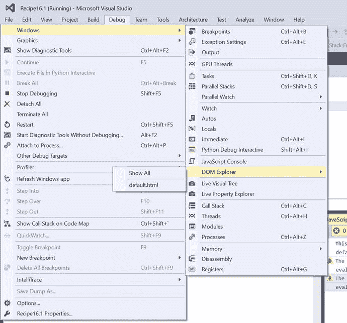

图 16-4. 从 `Visual Studio 2015` 访问“`DOM 资源管理器`”

您可以使用 `Visual Studio` 中的“`DOM 资源管理器`”执行以下操作：

-   检查实时 DOM
-   选择元素
-   调试 CSS 样式
-   调试布局
-   查看 DOM 事件监听器
-   调试 `WebView` 控件

打开一个使用 JavaScript 开发的现有 UWP 应用，并使用“`本地计算机`”选项运行它。

切换到 `Visual Studio` 并选择“`DOM 资源管理器`”选项卡。您可以在应用运行时使用 `F4` 快捷键在 `F12` 开发者工具中显示“`DOM 资源管理器`”，如图 16-5 所示。

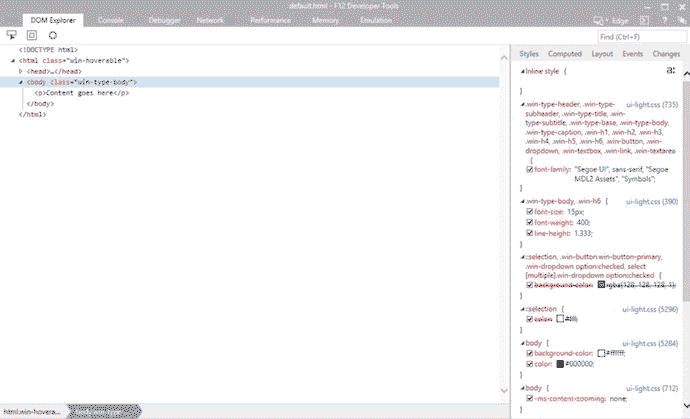

图 16-5. “`DOM 资源管理器`”

在“`DOM 资源管理器`”窗口中，选择 `body` 标签下的段落元素。双击文本以修改消息。您应该会看到文本在 UWP 应用上也实时更新。

“`DOM 资源管理器`”中的“`样式`”选项卡允许开发者修改样式元素的值，并查看其在应用页面上的渲染效果。

“`计算`”选项卡显示所选 DOM 元素每个属性的最终值（见图 16-6）。

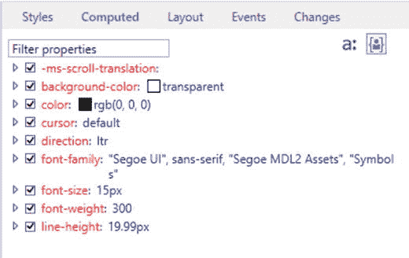

图 16-6. “`DOM 资源管理器`”中的“`计算`”选项卡

“`布局`”选项卡显示元素的盒模型，并展示应用的布局外观，其中考虑了偏移和边距（见图 16-7）。

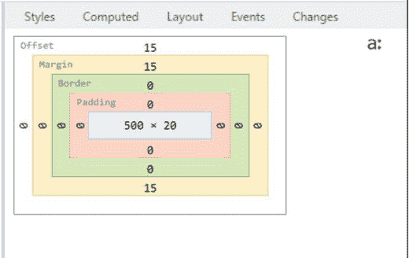

图 16-7. “`DOM 资源管理器`”中的“`布局`”选项卡

您还可以在调试时刷新应用。为此，请按照以下步骤操作。

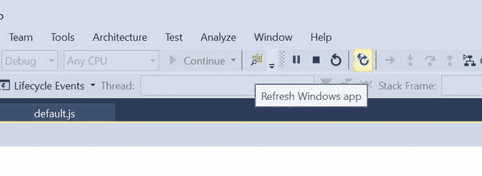

图 16-8. `Visual Studio` 中的“刷新 Windows 应用”按钮

当应用在模拟器中运行时，在 `Visual Studio` 中打开 `default.html` 文件并修改源代码。

单击“`调试`”工具栏中的“`刷新 Windows 应用`”按钮，或按下 `F4` 快捷键（见图 16-8）。

应用页面将重新加载，并显示在模拟器上看到的新更改。

## 16.3 诊断工具

### 问题

您想要分析 Windows 应用的性能，以识别潜在的瓶颈。您想要分析 CPU 使用率、UI 响应能力等。

### 解决方案

使用 `Visual Studio 2015` 中的“`诊断工具`”来执行和分析各种因素，例如 CPU 使用率、GPU 使用率、HTML UI 响应能力、JavaScript 内存和网络。


### 工作原理

Visual Studio 分析器或诊断工具可帮助您查找 Windows 应用中的性能瓶颈。它们会显示应用中代码耗时最多的地方。

您可以通过导航到 `Debug`（调试）菜单并选择 `Start Diagnostic Tools Without Debugging`（启动诊断工具而不进行调试）来启动 Visual Studio 2015 诊断工具，如图 16-9 所示。

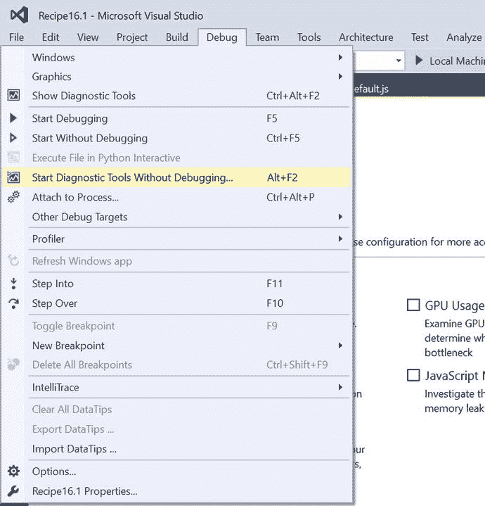

图 16-9. 在 Visual Studio 2015 中启动诊断工具

Visual Studio 诊断工具（见图 16-10）为开发者提供了以下用于测试其应用的选项：

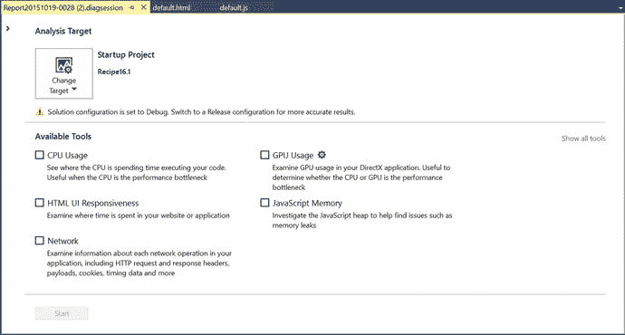

图 16-10. 包含不同选项的诊断工具

*   CPU 使用率
*   GPU 使用情况
*   HTML UI 响应能力
*   JavaScript 内存
*   网络

默认情况下，目标是当前项目。可以通过单击 `Change Target`（更改目标）按钮并从提供的列表中选择选项，将其更改为正在运行的应用或已安装的应用等。

您可以在 `Diagnostic`（诊断）对话框的 `Available Tools`（可用工具）部分中选择要分析的工具。

选择好工具后，单击 `Start`（启动）按钮。这将启动应用，Visual Studio 会自动启动诊断工具并收集数据以进行分析。

一旦工具完成数据收集，便会显示结果，如图 16-11 所示。

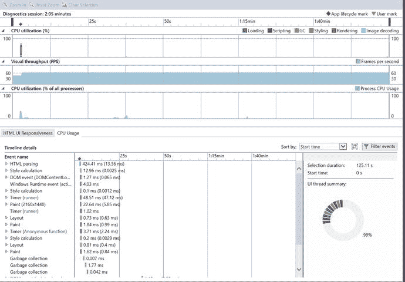

图 16-11. Visual Studio 2015 中诊断工具的结果

了解应用如何使用 CPU 是分析和识别应用中性能问题的一个良好起点。`CPU usage`（CPU 使用率）工具会显示 CPU 在何处花费时间执行您的 JavaScript 代码。

在分析 `CPU Usage`（CPU 使用率）报告时，开发者可以检查 CPU 利用率时间线图表并选择时间线段来查看详细信息。CPU 利用率时间线图表显示设备所有处理器核心的应用 CPU 活动情况。

`UI Responsiveness`（UI 响应能力）工具可以帮助开发者识别以下问题：

*   UI 响应能力。如果 UI 线程被阻塞，应用可能会响应缓慢。可能的原因包括过多的同步 JavaScript 代码、同步 XHR 请求，甚至是处理器密集型 JavaScript 代码。
*   由资源引起的加载缓慢问题。

`GPU Usage`（GPU 使用情况）工具检查 DirectX 应用程序中的 GPU 使用情况。它让开发者能够判断 CPU 还是 GPU 是性能瓶颈的原因。

`JavaScript Memory`（JavaScript 内存）工具检查 JavaScript 堆，以发现内存泄漏等问题。

`Network`（网络）工具让开发者能够检查影响 Windows 应用的各种网络操作信息，包括 HTTP 请求和响应标头、有效负载、Cookie 等。

## 16.4 Windows 10 移动模拟器：附加工具

### 问题

您希望在无需实际设备的情况下，通过模拟与 Windows 10 移动设备的真实交互来测试应用的功能。这些真实交互包括测试位置感知功能、加速度计等。

### 解决方案

使用 Windows 10 移动模拟器，它是通用 Windows 平台工具的一部分。它包括额外的工具，让开发者能够测试与设备的真实交互。

### 工作原理

`Additional Tools`（附加工具）是 Windows 10 移动模拟器的一部分。让我们打开上一个方案中创建的应用，并通过选择其中一个 Windows 移动模拟器（而不是 `Local Machine`（本地计算机））来运行项目。这将在 Windows 10 移动模拟器中启动您的应用。要在模拟器中打开 `Additional Tools`（附加工具），请单击工具按钮（`>>` 图标），如图 16-12 所示。

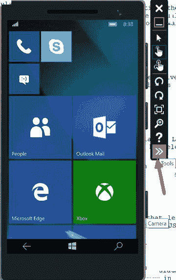

图 16-12. 带有附加工具功能的 Windows 10 移动模拟器

这将打开 `Additional Tools`（附加工具）窗口，开发者可以在其中访问 `Location`（位置）、`Networking`（网络）和 `Accelerometer`（加速度计）等工具，以在模拟器上进行测试（见图 16-13）。

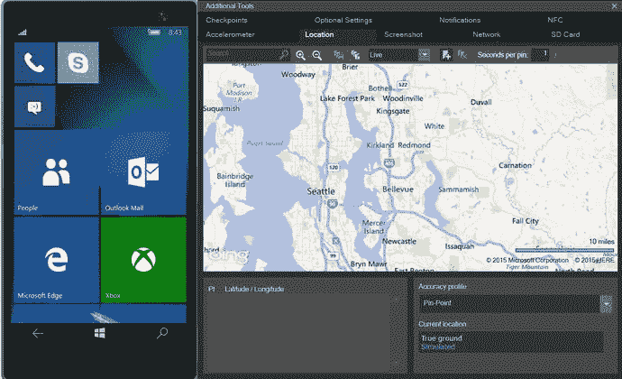

图 16-13. 模拟器中的附加工具窗口

#### 模拟鼠标输入

您可以单击模拟器工具栏上的鼠标输入按钮来启用鼠标输入。这可确保模拟器内的任何鼠标单击都将作为鼠标事件发送到模拟器的操作系统。如果您的应用配对了可用作输入的鼠标，这个功能非常有用。

#### 近场通信 (NFC)

如果您的应用使用近场通信 (NFC)，`NFC`（近场通信）选项卡（见图 16-14）可能是在接近、点击分享、卡模拟等场景中测试应用的有用工具。

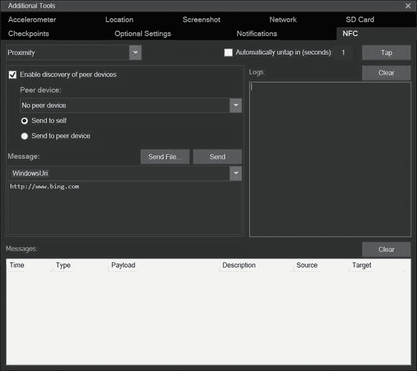

图 16-14. 附加工具中的 NFC 选项卡

您可以通过使用一对模拟器来模拟两部手机相互轻触，从而测试您的应用。

NFC 工具支持以下模式：

*   接近模式
*   HCE（主机卡模拟）模式
*   智能卡读卡器模式

当您测试此功能时，`NFC`（近场通信）选项卡会显示以下内容：

*   选定的模式
*   与轻触和取消轻触事件相关的日志
*   当前连接上发送和接收的所有消息的记录

请注意，当您在 `NFC`（近场通信）选项卡中首次单击 `Tap`（轻触）按钮时，您将收到 Windows 防火墙提示。

您需要从 Visual Studio 启动两个不同分辨率的模拟器，以模拟一对手机相互轻触。

选中 `Enable discovery of peer devices`（启用对等设备发现）复选框。对等设备下拉框会显示 Microsoft 模拟器和运行模拟器驱动程序的 Windows 计算机。

当两个模拟器都在运行时，请按照以下步骤操作：

1. 选择目标模拟器。
2. 选择 `Send to peer device`（发送到对等设备）选项。
3. 单击 `Tap`（轻触）按钮，这模拟了两个设备相互轻触。
4. 单击 `Untap`（取消轻触）按钮断开设备连接。
   要模拟从设备读取消息，请按照以下步骤操作：
5. 选择 `Send to self`（发送到自身）单选选项，以测试仅需要一个支持 NFC 的设备的场景。
6. 单击 `Tap`（轻触）按钮，模拟将设备轻触到标签。您应该会听到通知声音。
7. 单击 `Untap`（取消轻触）按钮断开连接。

#### 多点触控输入

您可以通过使用 Windows 10 模拟器工具栏上的多点触控输入按钮，来模拟用于捏合、缩放和旋转的多点触控输入。

要模拟多点触控功能，请按照以下步骤操作：

1. 单击模拟器工具栏上的 `Multi-touch Input`（多点触控输入）按钮以启用此功能。
2. 模拟器屏幕上会出现两个点。右键单击并拖动其中一个触控点以定位它。左键单击并拖动另一个触控点以模拟捏合、缩放、旋转等操作。
3. 您可以单击模拟器工具栏上的 `Single Point Input`（单点输入）按钮以恢复为正常输入。

#### 加速度计

`Accelerometer`（加速度计）工具让开发者能够测试跟踪手机移动的 Windows 应用（见图 16-15）。它在模拟器中模拟行为。

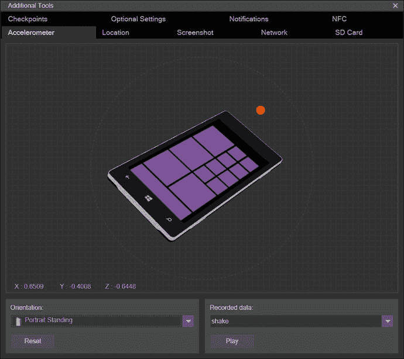

图 16-15. 附加工具中的加速度计工具

加速度计传感器可以使用实时输入或预先录制的输入进行测试。它可以使用录制的数据模拟手机的晃动。

从方向下拉列表中选择所需的方向。在加速度计中间，您会看到一个彩色圆点。拖动它以模拟设备在 3D 平面中的移动。


#### 位置

您可以通过使用`Location`选项卡来测试使用了导航和地理围栏的应用。

您可以模拟在不同速度和精度级别下从一个位置移动到另一个位置。`Location`工具（见图 16-16）目前支持三种模式：

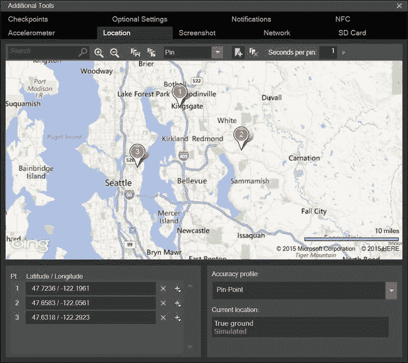

图 16-16. 附加工具中的 Location 选项卡

- **图钉模式**：在地图上放置图钉。然后您可以点击`播放所有点`，模拟器会按照指定的时间间隔，按顺序将每个图钉的位置发送给模拟器。
- **实时模式**：当您在地图上放置图钉时，模拟器会随即将该图钉的位置发送给模拟器。
- **路线模式**：在地图上放置图钉以指示路线点。模拟器会计算路线。

用户还可以在`Location`选项卡中执行以下操作：

- 使用搜索框搜索位置。
- 放大和缩小地图。
- 将当前图钉点集合保存到 XML 文件中，以便日后重新加载。
- 清除所有点。
- 保存路线，以便下次进入`图钉`和`路线`模式时加载。

#### 网络

`Network`选项卡允许开发者在不同网络速度和信号强度下测试应用。

您可以在各种网络速度下（如 2G、3G 和 4G）以及不同信号强度下（如良好、一般和较差）测试您的应用。

当您的应用调用 Web 服务或传输数据时，此功能特别有用。

