# 第 17 章：旁加载和 Windows 应用认证工具包

在您开发完一个应用后，重要的是在上传到应用商店之前，先将其部署到不同机器上进行测试。本章介绍了如何通过命令提示符生成应用包、在机器上旁加载您应用，以及随后使用`Windows 应用认证工具包`来测试该应用是否已达到可发布到 Windows 应用商店的优质标准。第 18 章 包含了如何通过`Visual Studio`交互式生成应用包的方法，因此本章不再赘述。

## 17.1 旁加载您的应用

### 问题

您需要在不将应用提交到 Windows 应用商店的情况下，将其旁加载到 Windows 设备上，以便测试人员能够使用您创建的应用包文件来安装和测试它。

### 解决方案

使用`PowerShell`运行`Add-AppDevPackage`文件（该文件在生成包文件时创建），以将您的应用旁加载到 Windows 设备上。

### 工作原理

您的应用用户不能像安装传统桌面应用那样简单地安装通用 Windows 应用。

通用 Windows 应用只能从应用商店下载，然后安装在设备上。如果您有一个应用想要在不通过商店的情况下安装，您可以在设备上旁加载该应用，这样用户就可以安装和测试它了。

您可以通过以下步骤将应用包旁加载到 Windows 10 设备上。

为您的设备启用旁加载功能。使用`PowerShell`安装您的应用。

旁加载应用的第一步是确保您的设备上已启用旁加载功能。您可以在 Windows 机器上打开`设置`应用，进入`更新和安全`来启用它。选择`开发者模式`按钮，会显示使用开发者功能的各个选项。选择`开发人员模式`以启用设备的旁加载功能（见图 17-1）。

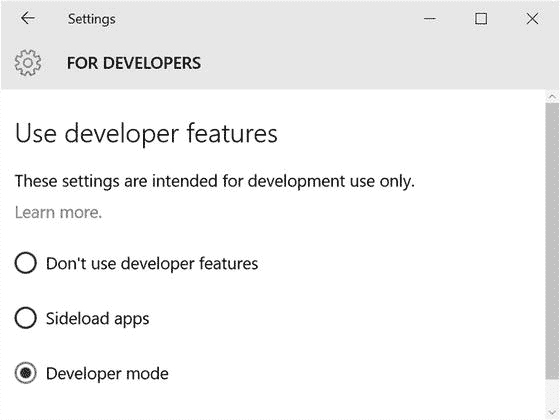

图 17-1. 在 Windows 10 中启用旁加载应用和开发人员模式

一旦您选择了`开发人员模式`，会弹出一个确认对话框（见图 17-2），以确认您要开启应用旁加载功能。`旁加载应用`选项允许您安装`.appx`文件以及使用与包一起创建的`PowerShell`脚本运行该应用所需的证书。此选项比`开发人员模式`更安全，因为您不能安装不受信任的应用。但本教程中，我们选择`开发人员模式`并继续。

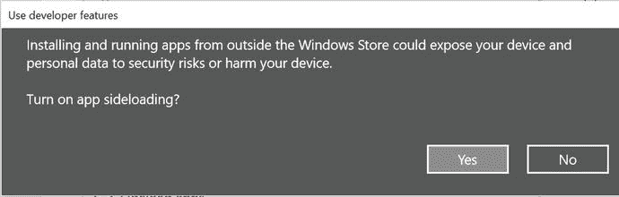

图 17-2. 启用旁加载的确认对话框

下一步是在机器上安装该应用。为此，请遵循以下步骤。

1. 生成用于安装的包文件。这在第 18 章中介绍。
2. 将您要安装的包文件的完整文件夹复制到目标机器上。例如，如果您创建了应用捆绑包，文件夹名称将包含版本号和`_test`。如果版本号是 1.0.0.0，项目名称是`Recipe17.1`，目标是`AnyCPU`，则文件夹名为`Recipe17.1_1.0.0.0_AnyCPU_Debug_Test`。
3. 在您要旁加载应用的目标机器上，打开该文件夹。右键单击`Add-AppDevPackage.ps1`文件，在右键菜单中选择`使用 PowerShell 运行`按钮，如图 17-3 所示。

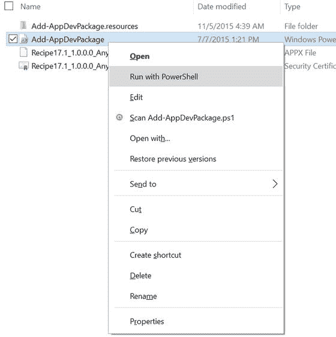

图 17-3. Windows 资源管理器中的`使用 PowerShell 运行`菜单

4. 按照`PowerShell`命令中显示的信息操作。当包成功安装后，您会在命令提示符中看到`您的应用已成功安装`的消息，如图 17-4 所示。

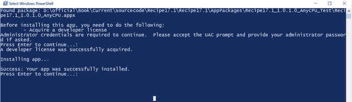

图 17-4. `PowerShell`命令中的应用安装消息

现在，点击 Windows 中的`开始`按钮。找到该应用并启动它。

## 17.2 分别安装证书和包

### 问题

您需要在 Windows 中分别安装包和证书。

### 解决方案

使用`PowerShell`运行`Add-AppDevPackage`文件（该文件在生成包文件时创建），以将您的应用旁加载到 Windows 设备上。

### 工作原理

配方 17.1 演示了如何使用 PowerShell 同时安装应用和证书。但有时你可能希望分别安装证书和包文件。你可以先安装证书，然后使用 `Add-AppDevPackage` PowerShell 命令来实现。

如果你想在 Windows 桌面端分别安装证书和包文件，需要遵循以下步骤。

打开创建应用包所在的文件夹。理想情况下，该文件夹应包含以下内容：

- `Add-AppDevPackage.resources` 文件夹
- `Add-AppDevPackage.resources` PowerShell 脚本文件
- `ProjectName_Version_Platform.appx` 文件
- `ProjectName_Version_Platform.cer` 安全或证书文件

双击证书文件 (`.cer`)，然后在“证书”界面上点击**安装证书**按钮（参见图 17-5）。

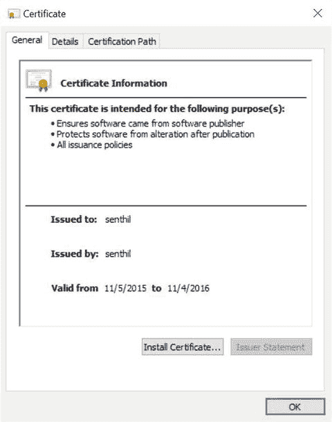

图 17-5. 安装证书界面

在**证书导入向导**界面上，选择**存储位置**组下的**本地计算机**选项，如图 17-6 所示。点击**下一步**。

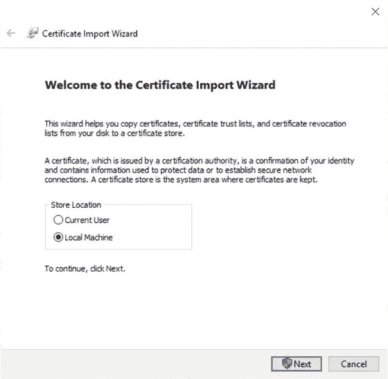

图 17-6. 从证书导入向导中选择存储位置

在 UAC 对话框中，点击**确定**按钮继续。

在下一个证书导入界面中，选中**将所有证书放入下列存储**单选按钮，然后点击**浏览**按钮（参见图 17-7）。

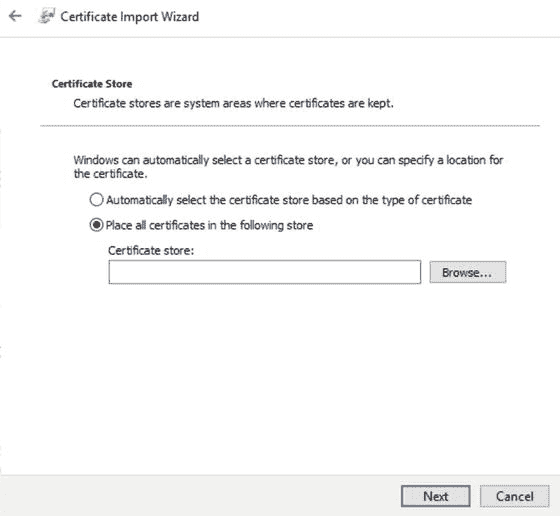

图 17-7. 选择放置证书的证书存储区

在**选择证书存储**弹出窗口中，选择**受信任人**，然后点击**确定**按钮（参见图 17-8）。

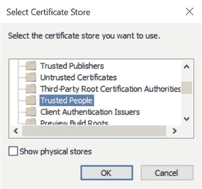

图 17-8. 选择证书存储界面

在**证书导入向导**中点击**下一步**，然后点击**完成**以完成证书导入（参见图 17-9）。

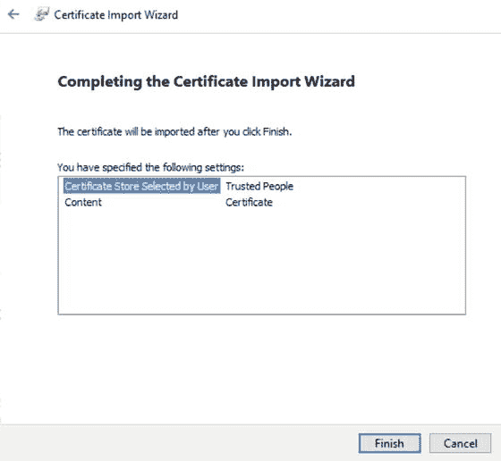

图 17-9. 完成证书导入过程

这将把证书安装到本地计算机的 Windows 证书存储区中。下一步是按照以下说明，使用 PowerShell 的 `add-appxpackage` cmdlet 单独安装应用。

导航到 `AppPackages` 文件夹，找到要安装的包文件 (`.appx`) 的完整路径。

如图 17-10 所示，从“开始”菜单打开 Windows PowerShell，并通过指定以下参数来运行 `Add-appxpackage` 命令。

`Add-appxpackage –Path <appx 文件的路径>`

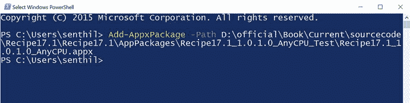

图 17-10. PowerShell 中用于安装应用的 `Add-appxpackage` 命令

输入命令后，按下**回车**键。这会将应用安装到你的 Windows 10 机器上。

现在，你可以从“开始”菜单启动该应用。

---

## 17.3 使用 Windows 应用认证工具包验证你的 Windows 应用

### 问题

你想通过交互式使用 Windows 应用认证工具包来验证你的通用 Windows 平台应用。

### 解决方案

从 Windows“开始”菜单启动 Windows 应用认证工具包，并指定要验证和测试的应用。

### 工作原理

在将应用提交到商店进行认证之前，先在本地进行验证和测试总是更好的。如果包有任何问题，这可以为开发者提供更多信息。

Windows 应用认证工具包是一个很好的工具，可以帮助开发者在本地验证和测试应用。Windows 应用认证工具包包含在适用于 Windows 10 的 Windows 软件开发工具包 (SDK) 中。

以下步骤使用 Windows 应用认证工具包验证和测试 Windows 应用。

从 Windows“开始”菜单中，搜索 **Windows 应用认证工具包**，然后点击 **Windows App Cert Kit** 桌面应用（参见图 17-11）。

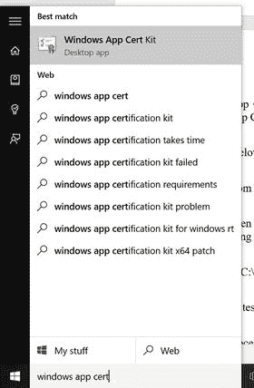

图 17-11. 开始菜单中的 Windows 应用认证工具包

在 Windows 应用认证工具包中，选择你要执行的验证类别。例如，如果你正在验证一个 Windows 应用，请选择**验证商店应用**（参见图 17-12）。

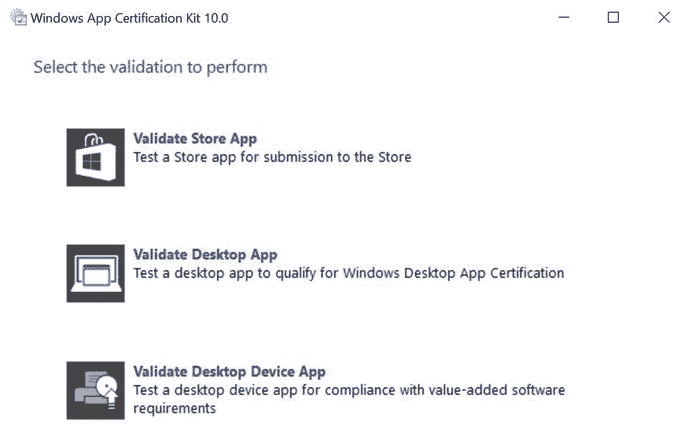

图 17-12. 选择要执行验证的应用类型

选择**商店应用**选项后，你将可以选择已安装在机器上的应用，或选择要验证的包文件。你可以启用**浏览要验证的应用**单选按钮，并点击**浏览**按钮来选择包文件（参见图 17-13）。

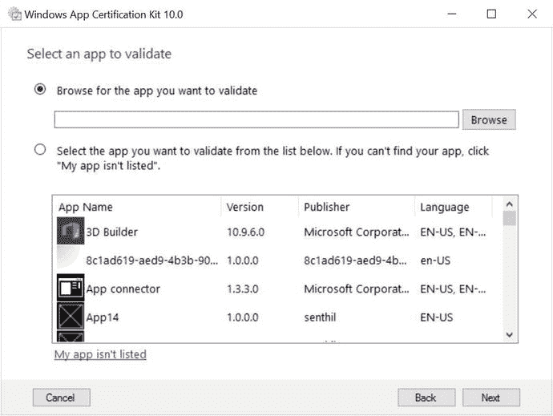

图 17-13. 选择要验证和测试的应用

选择应用或包文件后，点击**下一步**继续。后续屏幕将显示适用于你正在测试的应用的测试工作流程（参见图 17-14）。如果某个测试不适用于你的应用类型，它会被灰显。

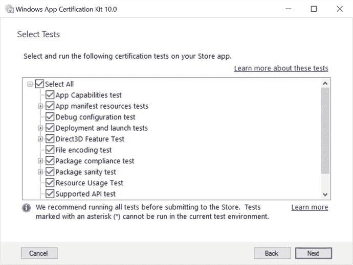

图 17-14. 适用于该应用的测试类型

点击**下一步**。Windows 应用认证工具包开始验证应用，如图 17-15 所示。

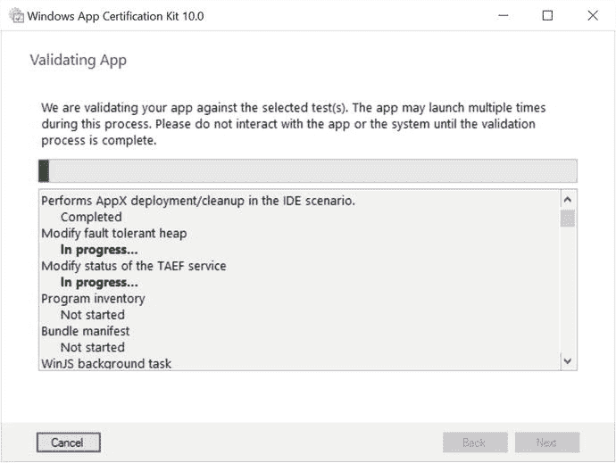

图 17-15. Windows 应用认证工具包正在验证应用

验证完成后，系统会提示你将报告保存为 XML 文件格式，该文件显示结果，如图 17-16 所示。Windows 应用认证工具包会创建一个 HTML 文件和一个 XML 报告，并将它们保存到指定的文件夹中。

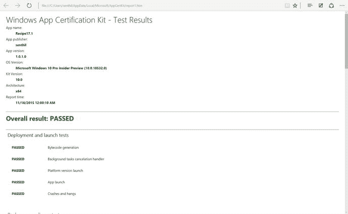

图 17-16. Windows 应用认证工具包的测试结果

---

## 17.4 在远程 Windows 10 设备上验证应用包

### 问题

你需要在远程 Windows 10 机器上验证应用包并对其进行测试。

### 解决方案

在远程机器上安装 Visual Studio 远程工具和 Windows 应用认证工具包，然后使用**远程机器**选项来验证远程机器上的包。

### 工作原理

通过 Visual Studio 生成包文件时，你还可以选择在远程计算机上对其进行验证。

要在远程计算机上验证包，请遵循以下步骤：

1.  在“设置”应用的“使用开发人员功能”中启用**开发人员模式**，以启用你的 Windows 10 远程设备进行开发，如图 17-17 所示。请注意，目前不支持在远程 ARM 设备上对 Windows 10 进行验证。

    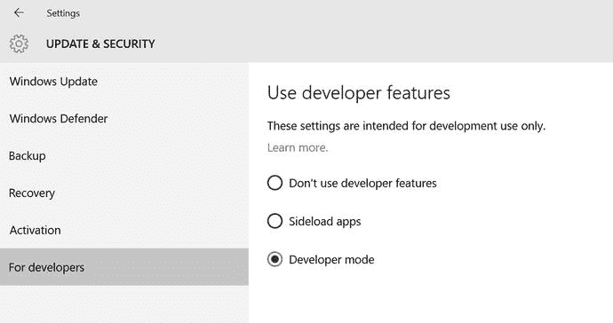  
    *图 17-17. 在“设置”应用中启用开发人员模式*

2.  在远程计算机上下载并安装 Visual Studio 的远程工具。请访问 `http://www.microsoft.com/en-us/download/details.aspx?id=48155&NavToggle=True`。这些远程工具用于运行 Windows 应用认证套件。

3.  从 `https://dev.windows.com/en-us/develop/app-certification-kit` 下载 Windows 应用认证套件，并将其安装在远程计算机上。

4.  现在，开始从你的 Windows 应用创建包。在“包创建完成”向导中，选择“远程计算机”选项，并单击省略号按钮（参见图 17-18）。

    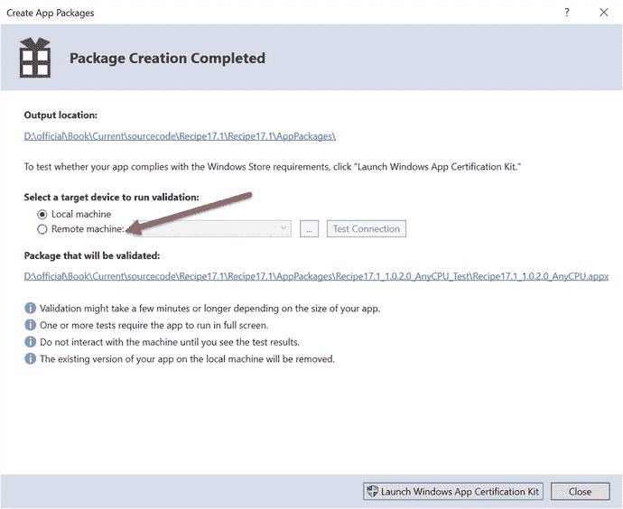  
    *图 17-18. 包创建与远程计算机选项*

5.  输入你的子网/域名服务器 (DNS)/IP 地址。在 Windows 凭据的“身份验证模式”菜单中选择相应的模式（参见图 17-19）。

    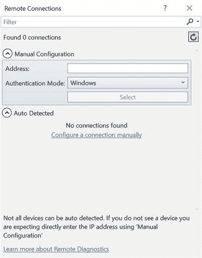  
    *图 17-19. 远程连接屏幕*

6.  单击“选择”按钮，然后单击“启动 Windows 应用认证套件”按钮。如果远程计算机上正在运行远程工具，你将成功连接，验证测试随即开始。

