# 第 18 章：商店与盈利

到目前为止，你应该已经完成了针对 Windows 10 操作系统的通用 Windows 平台应用程序的开发。你需要生成应用程序并将其上传到 Windows 商店，用户在那里搜索和下载应用。在本章中，你将了解将应用上架 Windows 商店所需的事项，以及如何通过应用内广告来盈利。

## 18.1 创建 Windows 应用开发者帐户

### 问题

你需要生成应用程序并将其上传到 Windows 商店。但要做到这一点，你需要首先使用你的开发者帐户登录 Windows 开发人员中心。你需要知道如何创建开发者帐户，然后才能开始上传阶段。

### 解决方案

在线创建一个开发者帐户。有两种方法可以开始此过程。

*   直接访问 `http://dev.windows.com`。
*   通过 Visual Studio 访问帐户注册。

#### 通过 Windows 开发人员中心访问帐户注册

Windows 开发人员中心是 Windows 应用开发的一站式门户。该门户提供了开始 Windows 10 应用程序开发所需的工具。这里有代码示例、关于如何开发 Windows 10 应用的教程，当然，还有提交应用的途径。可以通过 `http://dev.windows.com` 访问 Windows 开发人员中心。导航到该页面时，你会看到一个“获取开发者帐户”链接。单击它并按照屏幕上的说明完成创建你自己的开发者帐户。开发者帐户允许你将应用（适用于所有 Windows 设备）提交到 Windows 商店。它还允许你管理你的应用，并获取关于你的应用在商店中表现的分析数据。

你可以根据以下类别之一进行注册：

*   **个人**：此帐户类型允许你以个人、学生或非法人团体的身份开发和销售应用。此类型帐户的费用为 19 美元。
*   **公司**：此帐户类型适用于拥有注册公司名称以开发和销售应用的公司。此类型帐户的费用为 99 美元。

你需要提供以下信息来获取帐户：

*   你的联系信息
*   你想要显示的发布者名称
*   一种支付方式 (VISA/万事达卡/PayPal)

#### 通过 Visual Studio 访问帐户注册

你也可以通过 Visual Studio 注册成为开发者。

在 Visual Studio 中，从“项目”菜单中，选择“商店” ➤ “打开开发者帐户”（参见图 18-1）。

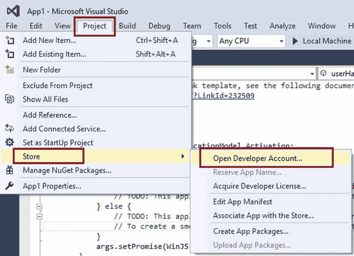  
*图 18-1. 从 Visual Studio 打开开发者帐户*

此操作将打开一个新的浏览器窗口，并直接带你进入帐户注册页面。你需要按照屏幕上的说明完成帐户注册。

## 18.2 为 Windows 10 打包通用 Windows 平台应用程序

### 问题

你已经完成了应用的开发。你已经在 Windows 开发人员中心完成了帐户注册。现在你想打包你的应用，以便将其提交到商店。

### 解决方案

要销售或分发 Windows 应用，你需要创建一个所谓“应用程序包”或技术上称为 `appxupload` 包的文件。使用通用 Windows 平台 (UWP)，你生成一个包 (`.appxupload`)。该包被上传到 Windows 商店。一旦应用上架，它就可以在任何 Windows 10 设备上安装和运行，包括手机、平板电脑、PC 等。

### 工作原理

打包 Windows 10 应用需要分两步完成。首先，使用特定的属性和设置配置包。然后，生成要上传到商店的包。


#### 配置应用包

要创建应用包，首先需要设置一些描述应用的属性和设置。这些应用属性和设置存储在一个名为应用清单文件（`package.appxmanifest`）的文件中，该文件位于项目根目录。清单中可设置的属性/设置包括用于应用程序磁贴的图像或应用支持的屏幕方向等。

应用程序清单文件是一个 XML 文件。Visual Studio 提供了一个基于 GUI 的清单设计器/编辑器来编辑此文件。使用 GUI 设计器/编辑器可以轻松更改应用程序清单。

以下步骤提供了关于如何配置应用包的说明：

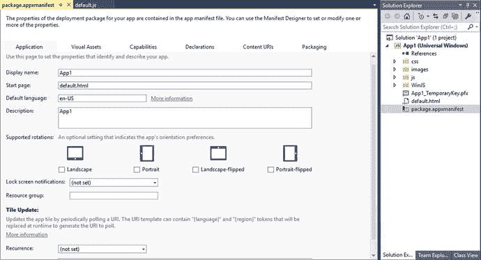

图 18-2.

应用程序包清单编辑 在解决方案资源管理器中，展开应用程序的项目节点。双击 `package.appxmanifest` 文件。Visual Studio 将启动清单设计器/编辑器（见图 18-2）。

清单文件有多个选项卡，用于配置应用的不同方面。

- **应用程序**：配置应用的显示名称、起始页、默认语言、描述、支持的屏幕方向、锁屏通知模式以及磁贴更新信息。
- **视觉资产**：配置应用的视觉资产，例如磁贴图像和徽标、徽章徽标以及初始屏幕（见图 18-3）。

    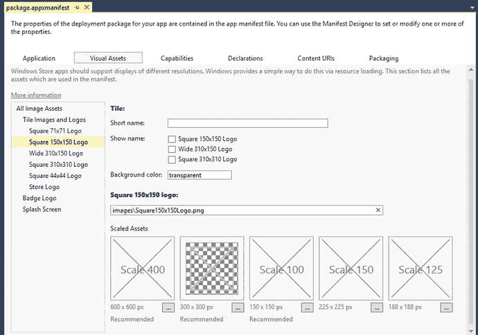

    图 18-3.

    视觉资产

- **功能**：应用所需的任何功能都必须在清单文件的此区域进行声明（见图 18-4）。

    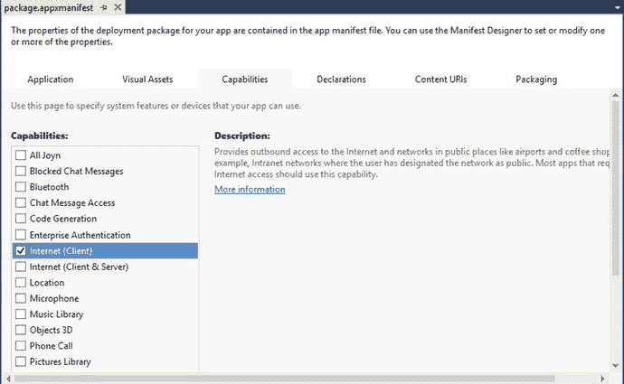

    图 18-4.

    功能

- **声明**：用于为应用添加任何声明（例如，协议或共享目标）并设置其属性（见图 18-5）。

    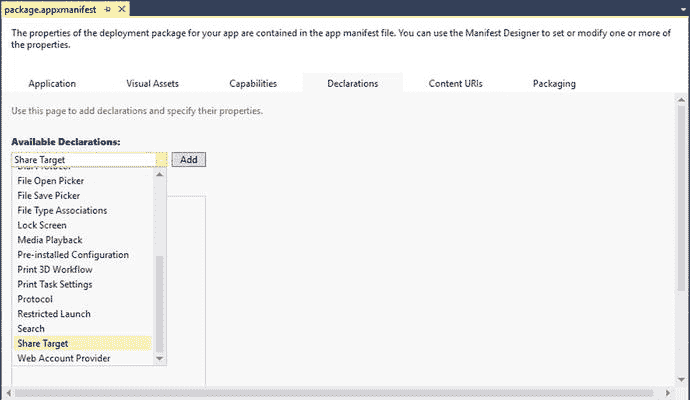

    图 18-5.

    声明

- **内容 URI**：指定应用中哪些页面可以被框架导航到，以及在 Web 视图中加载时可以导航到的 URI（见图 18-6）。

    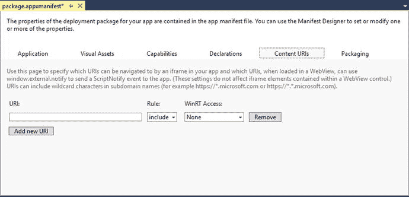

    图 18-6.

    内容 URI

- **打包**：设置包的详细信息，例如包名称（注意：这不是应用程序名称，仅指包名称）、包显示名称、版本详细信息、发布者、发布者显示名称和包系列名称（见图 18-7）。

    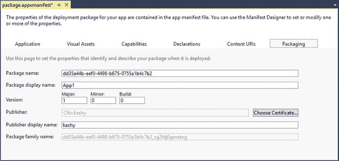

    图 18-7.

    打包

#### 创建应用包

使用清单文件配置完应用程序包后，下一步就是生成或创建包。该包是一个 `appxupload` 文件。Visual Studio 提供了**创建应用包**向导，接下来你将使用它。请按照以下步骤创建包：

在解决方案资源管理器中，打开通用 Windows 应用项目的解决方案。在解决方案资源管理器中打开项目后，右键单击你的项目。从上下文菜单中选择 **应用商店** > **创建应用包**（见图 18-8）。

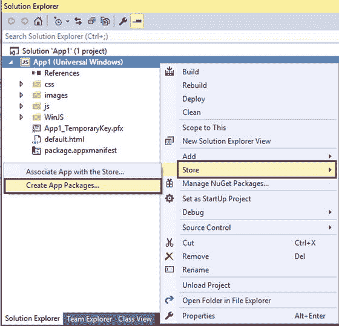

图 18-8.

**创建应用包** 向导将被调用。在**创建你的包**对话框中，选择**是**来生成包并上传到 Windows 应用商店（见图 18-9）。

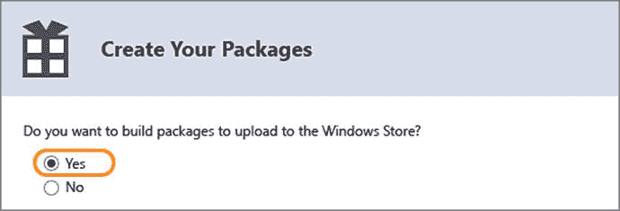

图 18-9.

创建应用包向导 如果你选择**否**，Visual Studio 将不会创建提交到应用商店所需的 `.appxupload` 文件。当您只想旁加载应用使其在内部设备上运行时，应使用此选项。

接下来，你需要登录到 Windows 开发人员中心帐户（见图 18-10）。

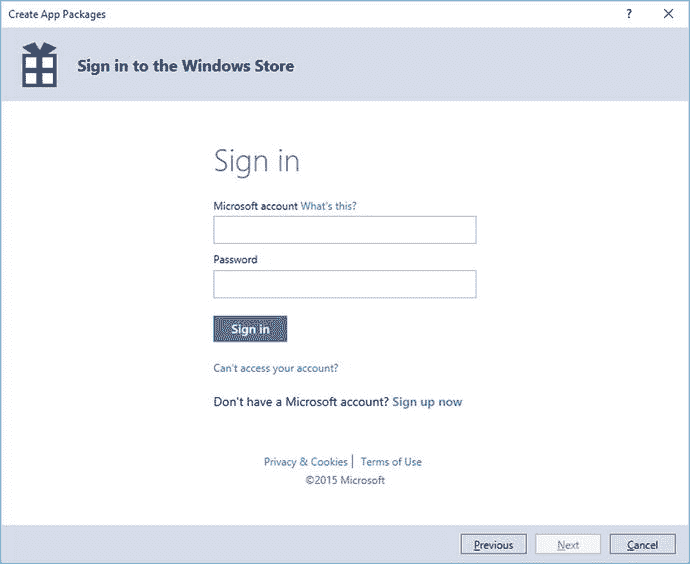

图 18-10.

创建应用包 开发人员中心登录

接下来，你需要为你的包选择一个名称，或者你也可以从向导中为你的包预留一个名称。你选择的名称需要在 Windows 应用商店中是唯一的（见图 18-11）。

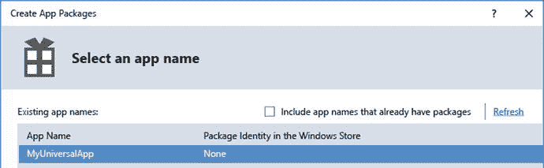

图 18-11.

选择应用名称

接下来，你需要选择并配置包信息：包的输出位置、版本以及生成的体系结构配置。请确保选择所有三个体系结构选项（见图 18-12）。

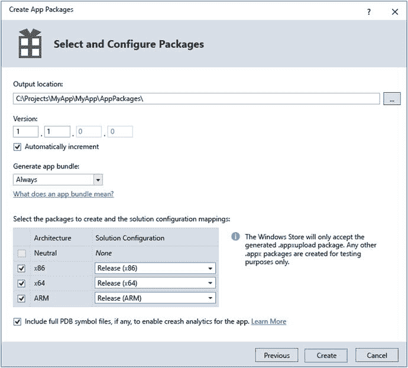

图 18-12.

配置包详细信息

单击**创建**以生成 `appxupload` 包，该包将生成在所选输出位置。然后你可以将 `appxupload` 包提交到应用商店。接下来，你将看到**包创建完成**对话框（见图 18-13）。

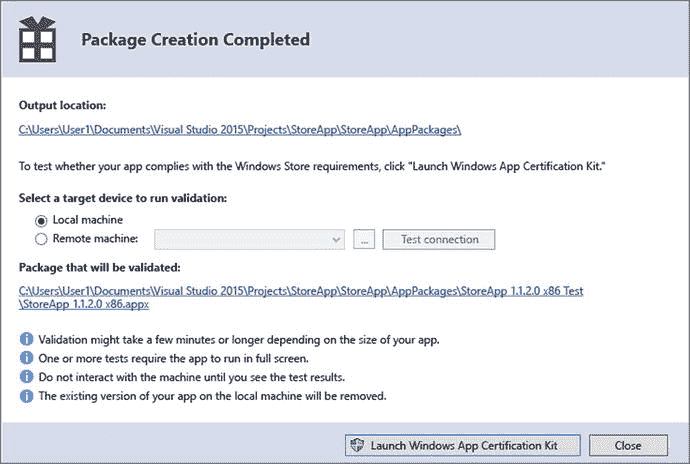

图 18-13.

创建完成对话框

在将应用提交到应用商店进行认证之前，验证应用非常重要。可以通过使用已作为 SDK 一部分安装在机器上的 **Windows 应用认证工具包 (WACK)** 来进行验证。验证可以在本地机器或远程机器上进行。

要本地验证，请在**包创建完成**对话框中选择**本地机器**单选按钮。单击**启动 Windows 应用认证工具包**按钮。Windows 应用认证工具包将执行测试并显示结果。

如果你的应用通过了测试，你就可以将应用提交到应用商店了。

## 18.3 向 Windows 应用商店提交应用

### 问题

你已完成创建包。已为你的应用生成了一个 `appxupload` 包。现在你需要将应用提交到应用商店进行认证。


### 解决方案

为应用创建 `appxupload` 包后，下一步是将其提交至商店进行认证。通过认证后，你的应用便会出现在 Windows 商店中，供用户搜索并下载安装。你可以通过 Windows 开发人员中心仪表板将应用包提交至 Windows 商店。以下概述了提交流程。

使用你的开发人员中心账户凭据登录 Windows 开发人员中心。访问 [`http://dev.windows.com`](http://dev.windows.com) 并登录。点击“仪表板”链接。在仪表板页面，你会看到页面左侧的 `我的应用` 栏目。在该栏目下，你在创建包时预留的应用名称会以`进行中`状态列出。点击该应用名称（见图 18-14）。

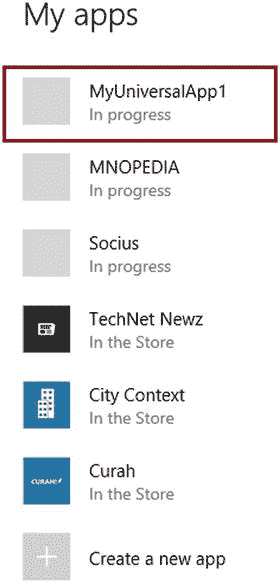

**图 18-14.** Windows 开发人员中心仪表板中的应用列表

接下来，你会进入`应用概览`页面。在此页面，你需要点击`提交`栏目中的`开始提交`按钮。随后，会出现提交屏幕。你需要在此提供与定价、应用属性、应用包、希望应用上架的国家/地区以及任何其他供认证团队参考的说明相关的信息。

- **定价和可用性：** 在此处设置应用定价，或决定将其列为免费应用。你还可以选择希望应用上架的国家/地区。
- **应用属性：** 在此处提供信息，例如应用所属的类别和子类别，以及年龄分级、任何硬件偏好设置和应用声明。
- **包：** 在此处提交由 Visual Studio 生成的 `appxupload` 包。

完成提交过程中的所有步骤后，你可以点击`提交到商店`按钮。你的包随后将经历一系列工作流程。应用会先使用证书进行签名，然后认证团队会执行认证测试。通过认证团队的认证后，你的应用便会发布到 Windows 商店。

## 18.4 在 UWP 应用中使用 Windows Ad Mediation

### 问题

你已经开发了 Windows 10 应用，并考虑通过投放广告来实现盈利。你想要注册多家广告提供商，以在应用中显示它们的广告。你需要为应用添加一个广告中介控件。

### 解决方案

应用内广告是实现应用盈利的方式之一。你可以订阅广告提供商，并在应用内运行它们的广告。你将根据应用中显示的广告展示量获得报酬。不同的提供商与广告展示量相关的经济模式各不相同。但要显示广告，你需要先安装 Windows Ad Mediation，这是一个有助于你显示来自多家提供商广告的控件。让我们来学习如何从 Visual Studio 安装 Ad Mediation 控件。

在解决方案资源管理器中打开你的项目。如果项目尚未展开，请展开它。从菜单栏中选择 **工具** > **扩展和更新**（见图 18-15）。

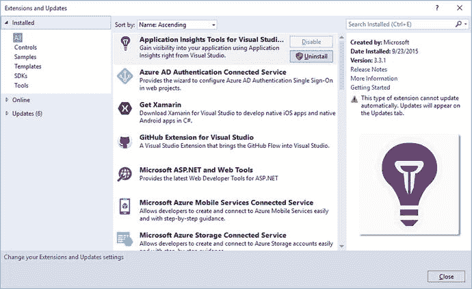

**图 18-15.** 扩展和更新对话框

从左侧树形菜单中选择 `联机`。在对话框的搜索栏中输入 `Windows Ad Mediation`（见图 18-16）。

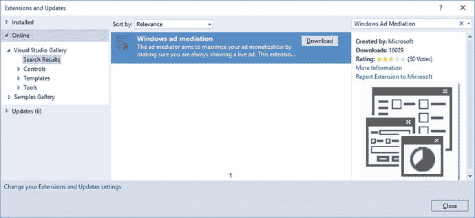

**图 18-16.** Windows 广告中介

点击搜索结果中显示的 Windows 广告中介包上的 `下载`。这会启动浏览器并下载可执行文件。下载完成后，安装 MSI 并按照屏幕指示操作。安装完成后，重启 Visual Studio。

现在，你可以在应用程序中使用 Windows Ad Mediation 控件了。

## 18.5 在应用中显示广告

### 问题

你已经安装了 Windows Ad Mediation SDK，现在想要开始在应用中显示广告。你希望在应用页面中放置广告。

### 解决方案

为了在应用页面中显示广告，你需要添加对 Windows 广告 SDK 的引用，该 SDK 已在之前安装 Windows Ad Mediation 时一起被安装。一旦添加了对 Windows 广告 SDK 的引用，你就可以在任何页面上实例化中介控件并在其中显示广告。以下步骤说明了如何添加中介控件。

在解决方案资源管理器中打开你的项目。如果项目尚未展开，请展开它。右键单击 `引用` 节点，然后从上下文菜单中选择 `添加引用`。在 `引用管理器` 对话框中，选择 `Microsoft Advertising SDK for JavaScript`，然后点击 `确定`（见图 18-17）。

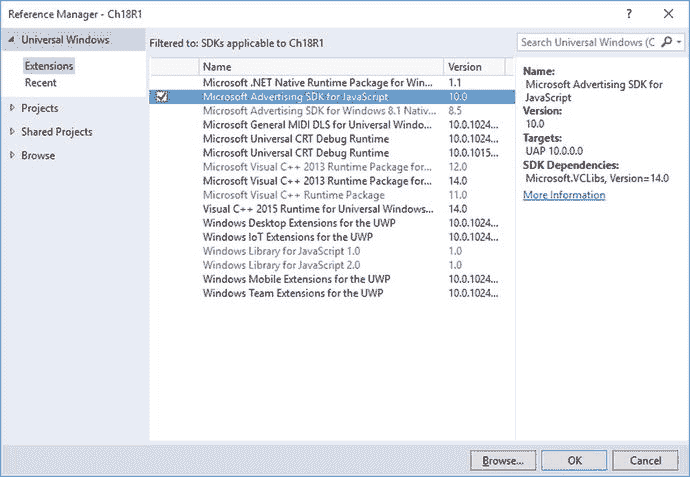

**图 18-17.** 引用管理器对话框

打开 `default.html` 或任何你想要放置广告的其他文件。在 `<head>` 部分中，在项目的 `default.css` 和 `default.js` 的 JavaScript 引用之后，添加对 `ad.js` 的引用。

```
<!-- Microsoft Advertising 所需的引用 -->
<script src="/Microsoft.Advertising.JavaScript/ad.js" ></script>
```

修改 `default.html` 文件（或适合你项目的其他 HTML 文件）中的 `<body>` 部分，以包含以下内容：

```
<div id="myAd" style="position: absolute; top: 50px; left: 0px; width: 300px; height: 250px; z-index: 1"
     data-win-control="MicrosoftNSJS.Advertising.AdControl"
     data-win-options="{applicationId: 'd25517cb-12d4-4699-8bdc-52040c712cab', adUnitId: '10043121'}">
</div>
```

编译并运行应用，即可看到带有广告的应用（见图 18-18）。

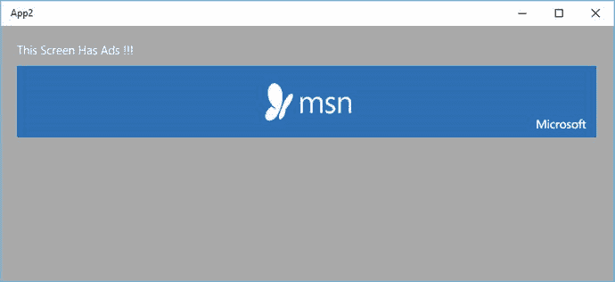

**图 18-18.** 带有广告的通用 Windows 应用

**注意：** 上面代码片段中提供的 `applicationId` 和 `adUnitId` 是微软提供的测试值，供你在开发期间测试使用。对于测试目的，`applicationId` 保持不变，但有多个不同的测试广告单元可用于测试不同尺寸的广告。微软文档页面 [`https://msdn.microsoft.com/en-US/library/mt313178(v=msads.30).aspx`](https://msdn.microsoft.com/en-US/library/mt313178(v=msads.30).aspx) 提供了关于测试广告单元 ID 的更多信息。


要在生产应用中生成`ApplicationID`和`AdUnitId`，请按照以下步骤操作：

1.  在 Windows 开发人员中心启动商店提交流程。
2.  确保在“应用属性”部分设置了应用类别。
3.  接下来，从页面左侧部分的选项中选择“盈利”➤“通过广告盈利”。
4.  在“通过广告盈利”页面的“Microsoft 广告单元”部分下，点击“显示选项”。
5.  为你的广告单元输入一个名称。选择广告单元类型以及将展示广告的设备系列。
6.  点击“创建广告单元”按钮。
7.  现在，你已经创建了一个广告单元。复制应用程序 ID 和广告单元 ID，并将其粘贴到你应用中的广告控件里。
8.  重新生成包，并在提交流程中使用新的包。

