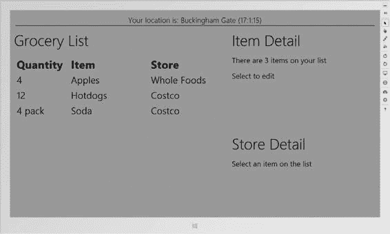

# 排版结果

我还向您展示了如何处理 Windows 8 的*贴靠*和*填充*布局，这些布局允许 Windows 8 用户同时并排使用两个 Windows 应用商店应用。您可以通过 CSS 或 JavaScript 来适应这些布局，我将为您展示这两种方法。

## 第 5 章：生命周期事件

Windows 对 Windows 应用商店应用应用了一种非常特定的生命周期模型。在本章中，我将解释该模型的工作原理，向您展示如何接收和响应关键的生命周期事件，并描述如何管理挂起和运行中应用之间的转换。我还将演示如何创建和管理异步任务，以及当您的应用被挂起时如何控制这些任务。最后，我将向您展示如何支持 Windows 8 *合约*，这能让您的应用无缝集成到更广泛的 Windows 8 体验中。

## 关于示例 Windows 8 应用的更多信息

本书的示例应用是一个简单的购物清单管理器，名为 `MetroGrocer`。

作为一个独立的应用，`MetroGrocer` 非常简单，但它是一个很好的平台，可以用来演示最重要的 Windows 8 功能。您可以在图 1-1 中看到该应用在本书末尾时的样子。

[www.it-ebooks.info](http://www.it-ebooks.info/)



## 第 1 章 ■ 入门

***图 1-1 .** 示例应用*

这是一本关于编程而非设计的书。`MetroGrocer` 不是一个漂亮的应用，我甚至没有实现它的所有功能。它纯粹只是一个演示编码技巧的载体。

## 这本书里代码多吗？

是的。事实上，代码非常多，如果不进行一些编辑，我根本无法全部收录。因此，当我介绍一个新主题或进行大量更改时，我会向您展示一个完整的 HTML 或 JavaScript 文件。当我进行小幅修改或想强调几行关键的代码或标记时，我会向您展示一个代码片段，例如清单 1-1 中的那个，它取自第 5 章。

***清单 1-1.*** 一个代码片段

```
. . .
if (e.kind == actNS.ActivationKind.search) {
  Search.searchAndSelect(e.queryText);
}
. . .
```

这些片段让我能够在书中塞入更多代码，但这也使得您通过将它们单独输入到 Visual Studio 中来跟随示例变得更加困难。如果您确实想跟着示例操作，最好的方法是从 `Apress.com` 下载本书的源代码。这些代码是免费提供的，并且包含本书每一章的完整 Visual Studio 项目，这意味着您将始终能够看到全貌。

[www.it-ebooks.info](http://www.it-ebooks.info/)

## 第 1 章 ■ 入门

我专注于介绍新技术，并避免向您展示您已经知道的内容。这种做法的一个牺牲品是 CSS 样式表。CSS 类非常重复且冗长，我不希望在我可以展示更有趣的内容时，浪费时间去列举无尽的样式。如果您想让您的项目看起来与示例项目一模一样，您可以在下载的源代码中找到所有 CSS 代码。

## 启动和运行

在本节中，我将为将在全书中逐步构建的示例 Windows 8 应用创建项目。该应用是一个简单的购物清单追踪器；它是一个简单到足以在这本短书中完成，但又具备足够功能来演示 Windows 应用商店开发最重要方面的工具。

**注意**
■
微软使用的术语是 *Windows 应用商店应用*。我无法让自己使用这个别扭的术语，所以我将只称呼 *Windows 应用商店应用*，并且通常仅称为*应用*。我将留给您在需要时自行在脑海中插入官方术语。

### 创建项目

要创建示例项目，请启动 Visual Studio，然后从“文件”菜单或“起始页”上的链接中选择“新建项目”。在“新建项目”对话框中，导航到 `已安装 ➤ 模板 ➤ JavaScript`。选择“空白应用”模板，将项目名称设置为 `MetroGrocer`，然后单击“确定”按钮创建项目，如图 1-2 所示。

**T**


