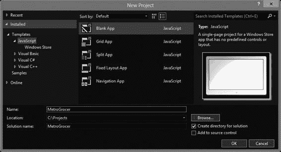
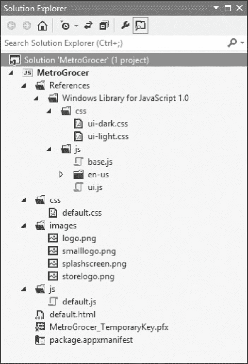

# 第 1 章 ■ 入门指南

**提示** 如果你是第一次使用 Visual Studio，系统会提示你获取开发者许可证并执行一些其他初始配置步骤。

[www.it-ebooks.info](http://www.it-ebooks.info/)



***图 1-2 .** 创建示例项目* **T**

**提示** Visual Studio 包含针对一些基本项目场景预配置的模板。这些模板用处不大，而且至少在我看来，它们会引导程序员走上一条无法体现 HTML5 和 JavaScript 优势的道路。我建议从一个空白项目开始，从头构建你的应用程序，这也是本书所采用的方法。

解决方案资源管理器显示了项目的内容，如图 1-3 所示。`References` 文件夹包含 Windows 8 开发所需的 Microsoft JavaScript 和 CSS 文件。`default.html` 文件是应用程序启动时加载的页面，而 `css`、`images` 和 `js` 文件夹则包含应用程序所依赖的资源。

[www.it-ebooks.info](http://www.it-ebooks.info/)



***图 1-3 .** 解决方案资源管理器中显示的空白示例项目* 核心文件是 `default.html`、`default.css` 和 `default.js`。这些文件定义了布局的结构、应用于布局的样式，以及管理数据和用户交互的代码。这些文件与你在 Web 应用开发中通常看到的文件相同，这反映了 Windows 8 应用开发对 Web 开发技术和工具的融合方式。

在接下来的几节中，我将向你展示项目中最重要的文件，解释它们的作用，并做一些初步修改，以创建本书后续所需的结构。

### 探索 default.html 文件

`default.html` 文件是 Windows 8 启动时加载的文件。你可以通过打开 `package.appxmanifest` 文件并更改“起始页”设置的值来更改启动文件，但我将坚持使用默认设置。

不用担心 `package.appxmanifest` 文件的其余部分；我将在后面的章节中回过头来介绍。Windows 8 HTML 文件就像常规的 HTML 文件一样，Internet Explorer 10 中提供的所有 HTML5 特性和支持都可以在你的 Windows 应用商店应用中使用。清单 1-2 显示了 Visual Studio 创建的 `default.html` 文件的初始内容。

***清单 1-2.*** `default.html` 文件的初始内容

```
<!DOCTYPE html>
<html>
<head>
<meta charset="utf-8" />
<title>MetroGrocer</title>
<!-- WinJS references -->
<link href="//Microsoft.WinJS.1.0/css/ui-dark.css" rel="stylesheet" />
<script src="//Microsoft.WinJS.1.0/js/base.js"></script>
<script src="//Microsoft.WinJS.1.0/js/ui.js"></script>
<!-- MetroGrocer references -->
<link href="/css/default.css" rel="stylesheet" />
<script src="/js/default.js"></script>
</head>
<body>
<p>Content goes here</p>
</body>
</html>
```

当 Visual Studio 创建该文件时，它会添加 `link` 和 `script` 元素，以导入 Windows 8 应用所需的核心文件。`default.js` 和 `default.css` 文件用于存放项目的 JavaScript 和 CSS 样式，我稍后会介绍这些文件。你可以根据需要重命名或替换这些文件（只要同时更改 `link` 或 `script` 元素即可），但为了简单起见，我将坚持使用默认名称。

Visual Studio 还添加了一些带有非标准 URL 的 `link` 和 `script` 元素，如下所示：

```
<link href="//Microsoft.WinJS.1.0/css/ui-dark.css" rel="stylesheet" />
<script src="//Microsoft.WinJS.1.0/js/base.js"></script>
<script src="//Microsoft.WinJS.1.0/js/ui.js"></script>
```

`base.js` 和 `ui.js` 文件包含 WinJS API 的 JavaScript 代码，用于创建 JavaScript Windows 应用商店应用。我将在后面的章节中介绍 WinJS 的一些最有用的部分。

### WINDOWS 8 API 的世界

在编写 Windows 应用商店应用时，你可以访问多个不同的 API。有 Windows API，它在所有 Windows 应用商店应用中共享，无论编写它们使用何种语言。还有 WinJS API，它仅适用于 JavaScript Windows 应用商店应用，充当 HTML/JavaScript 与 Windows 功能之间的桥梁。最后，你还有标准的文档对象模型 API，你可以用它来导航应用中的 HTML 标记、注册事件处理程序等。JavaScript 在 Windows 8 世界中是“一等公民”，你的 Web 应用开发知识将在你开始开发项目时非常有用。

在大多数情况下，WinJS API 将是你投入大部分开发时间的地方，这也是本书前半部分的重点。当你希望将应用集成到更广泛的 Windows 8 平台时，Windows API 才会发挥其作用，我将在第 4 章和第 5 章中对此进行描述。

`ui-dark.css` 文件包含 Windows 8 用于 Windows 应用商店应用的样式，这些样式针对深色配色方案进行了调整（即在深色背景上显示白色文本）。还有一个对应的文件叫 `ui-light.css`，如果你想在浅色背景上显示深色文本，可以使用它。这些 CSS 文件为所有常见的 HTML 元素提供了样式，以便它们融入 Windows 8 的视觉主题，并与使用其他语言（如 C#/XAML）编写的 Windows 应用商店应用保持一致。你可以通过在应用中覆盖这些样式来自定义它们，但大多数情况下，保持与其他 Windows 应用商店应用的一致性非常重要。

**提示** 值得打开并阅读这些文件。使用 Web 技术开发 Windows 应用商店应用的好处之一是，你可以阅读 WinJS 库和 CSS 文件的源代码。你无法编辑这些文件，但可以了解其内部原理，并且最有用的地方在于，使用调试器时可以在 WinJS 代码中设置断点（我将在本章后面演示这一点）。

`default.html` 文件中的 `body` 元素创建时带有一个简单的占位符元素。在清单 1-3 中，你可以看到我如何用应用的真正内容替换了这个元素。我的新增内容以粗体显示，我将使用这些元素为内容布局提供基本结构。

***清单 1-3.*** 修订后的 `default.html` 文件内容

```
<!DOCTYPE html>
<html>
<head>
<meta charset="utf-8" />
<title>MetroGrocer</title>
<!-- WinJS references -->
<link href="//Microsoft.WinJS.1.0/css/ui-dark.css" rel="stylesheet" />
<script src="//Microsoft.WinJS.1.0/js/base.js"></script>
<script src="//Microsoft.WinJS.1.0/js/ui.js"></script>
<!-- MetroGrocer references -->
<link href="/css/default.css" rel="stylesheet" />
<script src="/js/default.js"></script>
</head>
<body>
<div id="contentGrid">
<div id="leftContainer" class="gridLeft">
<h1 class="win-type-xx-large">左容器</h1>
</div>
<div id="topRightContainer" class="gridRight">
<h1 class="win-type-xx-large">右上容器</h1>
</div>
<div id="bottomRightContainer" class="gridRight">
<h1 class="win-type-xx-large">右下容器</h1>
</div>
</div>
</body>
</html>
```

我添加了一个 `id` 为 `contentGrid` 的 `div` 元素。这将是示例应用中大部分内容的容器，它包含另外三个 `div` 元素：`leftContainer`、`topRightContainer` 和 `bottomRightContainer`。随着本书的深入，我将向这些元素中添加内容。


好的，作为高级文档工程师和翻译员，我将遵循您提供的注意事项和示例格式，对给定的英文文档进行翻译。


