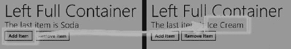

# 数据与绑定

在 Windows 应用商店应用中使用 Internet Explorer 专属特性时，我经历了一段时间才得心应手，但其中有些特性确实能节省大量时间，而我自己也一直在使用这个特定功能。不过需要提醒一句：如果 HTML 中有多个元素的 `id` 属性值相同，那么对应全局变量的值将是一个包含所有匹配元素的数组。

添加处理函数的效果是，用户可以在输入元素中输入新邮政编码，点击按钮后，视图模型中的邮政编码值就会更新。由于这个更新作用于可观察属性，`span` 元素的内容会通过绑定自动更新以显示新值，如图 2-2 所示。

**图 2-2.** *更新视图模型中的可观察值*

**提示** 如果你使用过 Knockout.js 等 Web 应用视图模型库，可能习惯通过调用方法来更新视图模型值，例如：`ViewModel.UserData.homeZipCode(myNewValue)`。Knockout 使用这种方法是为了兼容不支持 getter 和 setter 的旧版浏览器（包括多数旧版 Internet Explorer）。而用于显示 HTML5 Windows 应用商店应用的 Internet Explorer 10 *确实* 支持 getter 和 setter，这意味着你可以像示例中那样直接赋值。

## 创建可观察数组

让数组变得可观察需要多费些功夫。首先，必须使用 `WinJS.Binding.List` 类为要操作的数组创建一个包装器。

清单 2-9 展示了在 `viewmodel.js` 文件中将 `List` 类应用于我的视图模型。

**清单 2-9.** *使用 List 类创建可观察数组*

```javascript
/// <reference path="//Microsoft.WinJS.1.0/js/base.js" />
/// <reference path="//Microsoft.WinJS.1.0/js/ui.js" />
(function () {
    "use strict";

    var shoppingItemsList = new WinJS.Binding.List();
    var preferredStoresList = new WinJS.Binding.List();

    WinJS.Namespace.define("ViewModel", {
        UserData: WinJS.Binding.as({
            homeZipCode: null,
            getStores: function () {
                return preferredStoresList;
            },
            addStore: function (newStore) {
                preferredStoresList.push(newStore);
            },
            getItems: function () {
                return shoppingItemsList;
            },
            addItem: function (newName, newQuantity, newStore) {
                shoppingItemsList.push({
                    item: newName,
                    quantity: newQuantity,
                    store: newStore
                });
            }
        })
    });

    // 为简洁起见，省略了添加测试数据的语句
})();
```

创建 `List` 很简单，但如果试图在已传递给 `WinJS.Binding.as` 方法的对象作用域内创建它，就会遇到问题（因为对特殊变量 `this` 的假设存在冲突）。为避免此问题，应像示例中那样在视图模型外部定义列表。

使用 `List` 对象与使用数组并不相同。最重要的区别在于，不能使用数组索引器来读取或写入数据值。相反，必须使用 `getAt` 和 `setAt` 方法。`List` 支持其他数组成员，如 `push` 和 `pop`，并且还提供了一些用于排序和投影 `List` 对象内容的有用附加功能。

另一个重要区别是，不能通过声明式绑定访问数组值。相反，必须使用 JavaScript 在 DOM 中设置值，并处理 `List` 对象发出的事件以保持这些值的最新状态。清单 2-10 展示了 `default.html` 文件中的元素，这些元素显示视图模型列表中某一列表的项目数量，以及一些用于添加和删除项目的按钮。

**清单 2-10.** *用于与 List 对象交互的元素*

```html
<div id="leftContainer" class="gridLeft">
    <h1 class="win-type-xx-large">左侧全容器</h1>
    <div class="win-type-x-large">
        最后一项是 <span id="listInfo"></span>
    </div>
    <div class="win-type-x-large">
```


<button id="addItemButton">添加项目</button>

<button id="removeItemButton">移除项目</button>

</div>

</div>

. . .

这些元素中没有特殊的数据属性，只是普通的 HTML。所有操作都在 `default.js` 文件中完成，如清单 2-11 所示。

[www.it-ebooks.info](http://www.it-ebooks.info/)



## 第 2 章 ■ 数据与绑定

**清单 2-11.** 使用 JavaScript 桥接 HTML 元素和 `WinJS.Binding.List`

. . .

```
function performInitialSetup(e) {

WinJS.Utilities.query(‘button’).listen("click", function (e) {

if (this.id == "addItemButton") {

ViewModel.UserData.addItem("Ice Cream", 1, "Vanilla", "Walmart");

} else {

ViewModel.UserData.getItems().pop();

}

});

var setValue = function () {

var list = ViewModel.UserData.getItems();

listInfo.innerText = list.getAt(list.length - 1).item;

};

var eventTypes = ["itemchanged", "iteminserted",

"itemmoved", "itemremoved"];

eventTypes.forEach(function (type) {

ViewModel.UserData.getItems().addEventListener(type, setValue);

});

setValue();

}
```

. . .

`List` 对象定义了四个在数据项发生变化时触发的事件。这些事件包括 `itemchanged`、`iteminserted`、`itemmoved` 和 `itemremoved`。`List` 对象定义了一个 `addEventListener` 方法，用于注册这些事件的事件处理函数。在清单中，我为所有四个事件注册了同一个处理函数；该函数更新 `span` 元素的 `innerText` 属性，以显示 `List` 中第一个元素的 `item` 属性。

两个按钮元素分别用于向 `List` 中添加和移除项目。我将 `addItem` 方法保留在视图模型中，因为我倾向于使用这样的小型辅助函数来使数据对象的结构更加一致，但我也可以直接调用 `List` 对象的 `push` 方法来达到同样的效果。结果如图 2-3 所示。

**图 2-3.** 在 HTML 元素中显示 `List` 对象的详细信息 37

[www.it-ebooks.info](http://www.it-ebooks.info/)

## 第 2 章 ■ 数据与绑定

**提示** 我可以从该清单中移除对 `WinJS.Binding.processAll` 方法的调用，因为 HTML 文档中没有声明式绑定。

## 使用模板

`WinJS.Binding.List` 对象在与*绑定模板*一起使用时才能真正发挥其作用，绑定模板允许为一系列数据值重复生成标记区域。模板在 HTML 文档中定义，并使用 `data-win-control` 属性进行标记，如清单 2-12 所示。

**清单 2-12.** 向 HTML 文档中添加模板

```
<!DOCTYPE html>
<html>
<head>
<meta charset="utf-8">
<title>MetroGrocer</title>
<!-- WinJS 引用 -->
<link href="//Microsoft.WinJS.1.0/css/ui-dark.css" rel="stylesheet">
<script src="//Microsoft.WinJS.1.0/js/base.js"></script>
<script src="//Microsoft.WinJS.1.0/js/ui.js"></script>
<!-- MetroGrocer 引用 -->
<link href="/css/default.css" rel="stylesheet">
<script src="/js/viewmodel.js"></script>
<script src="/js/default.js"></script>
</head>
<body>
<div id="contentGrid">
<div id="leftContainer" class="gridLeft">
<h1 class="win-type-xx-large">购物清单</h1>
<table id="listTable" class="type-table-header">
<thead>
<tr>
<th>数量</th>
<th class="itemName">项目</th>
<th>商店</th>
</tr>
</thead>
<tbody id="itemBody"></tbody>
</table>
</div>
[www.it-ebooks.info](http://www.it-ebooks.info/)
第 2 章 ■ 数据与绑定
<div id="topRightContainer" class="gridRight">
<h1 class="win-type-xx-large">右上容器</h1>
</div>
<div id="bottomRightContainer" class="gridRight">
<h1 class="win-type-xx-large">右下容器</h1>
</div>
</div>
<!-- 购物清单项目的模板 -->
<table>
<tbody id="itemTemplate" data-win-control="WinJS.Binding.Template">
<tr class="groceryItem">
<td data-win-bind="innerText: quantity"></td>
<td data-win-bind="innerText: item"></td>
<td data-win-bind="innerText: store"></td>
</tr>
</tbody>
</table>
<!-- 购物清单项目模板结束 -->
</body>
</html>
```


