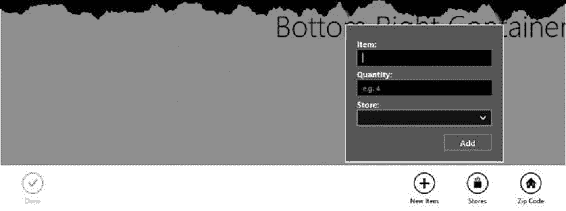
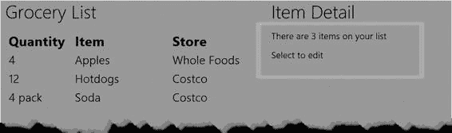
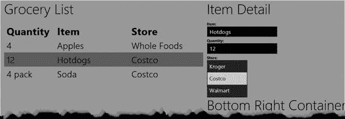
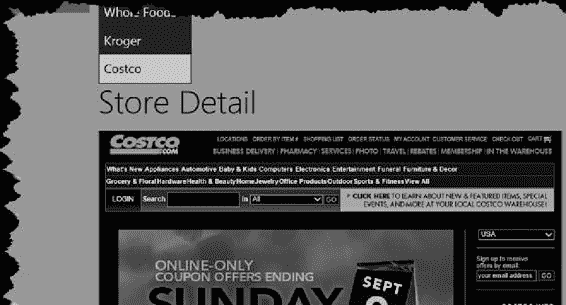

# 第 3 章 ■ 应用程序控件

## **清单 3-1.** 在`appbar.html`文件中定义`AppBar`

```html
<div id="appBar" data-win-control="WinJS.UI.AppBar">
  <button data-win-control="WinJS.UI.AppBarCommand"
          data-win-options="{section: 'global', label: 'New Item', icon: 'add'}">
  </button>
  <button data-win-control="WinJS.UI.AppBarCommand"
          data-win-options="{section: 'global', label: 'Stores', icon: 'shop'}">
  </button>
  <button data-win-control="WinJS.UI.AppBarCommand"
          data-win-options="{section: 'global', label: 'Zip Code', icon: 'home'}">
  </button>
  <button data-win-control="WinJS.UI.AppBarCommand"
          data-win-options="{id: 'done', disabled: true, section: 'selection', label: 'Done', icon: 'accept'}">
  </button>
</div>
```

`AppBar`由一个`div`元素表示，该元素的`data-win-control`属性设置为`WinJS.AppBar`。一个`AppBar`包含一个或多个`button`元素，这些元素的`data-win-control`属性设置为`WinJS.UI.AppBarCommand`。每个按钮都需要配置信息，这些信息通过`data-win-options`属性提供，格式为一个简单的 JavaScript 对象。我稍后将解释这些配置属性的含义。

**提示：** 你也可以使用一系列嵌套的 HTML 元素来指定`AppBar`按钮，这样就不需要类似 JavaScript 的配置对象了。我不喜欢将代码片段嵌入到标记中，但这是 WinJS 普遍存在的方式，所以我倾向于使用清单中所示的方法。它虽然不太美观，但与其他控件的使用方式保持一致。

## **清单 3-2.** 将 HTML 片段导入`default.html`

```html
<!DOCTYPE html>
<html>
<head>
  <meta charset="utf-8">
  <title>MetroGrocer</title>

  <!-- WinJS 引用 -->
  <link href="//Microsoft.WinJS.1.0/css/ui-dark.css" rel="stylesheet">
  <script src="//Microsoft.WinJS.1.0/js/base.js"></script>
  <script src="//Microsoft.WinJS.1.0/js/ui.js"></script>

  <!-- MetroGrocer 引用 -->
  <link href="/css/list.css" rel="stylesheet">
  <link href="/css/default.css" rel="stylesheet">
  <script src="/js/viewmodel.js"></script>
  <script src="/js/ui.js"></script>
  <script src="/js/default.js"></script>
</head>
<body>
  <div id="contentGrid">
    <div id="leftContainer" class="gridLeft">
      <h1 class="win-type-xx-large">购物清单</h1>
      <table id="listTable" class="type-table-header">
        <thead>
          <tr>
            <th>数量</th>
            <th class="itemName">项目</th>
            <th class="store">商店</th>
          </tr>
        </thead>
        <tbody id="itemBody"></tbody>
      </table>
    </div>
    <div id="topRightContainer" class="gridRight">
      <h1 class="win-type-xx-large">右上容器</h1>
    </div>
    <div id="bottomRightContainer" class="gridRight">
      <h1 class="win-type-xx-large">右下容器</h1>
    </div>
  </div>

  <!-- 导入 HTML 片段 -->
  <div data-win-control="WinJS.UI.HtmlControl"
       data-win-options="{uri: '/html/appbar.html'}"></div>
  <!-- HTML 片段结束 -->

  <!-- 购物清单项目模板 -->
  <table>
    <tbody id="itemTemplate" data-win-control="WinJS.Binding.Template">
      <tr class="groceryItem">
        <td data-win-bind="innerText: quantity"></td>
        <td data-win-bind="innerText: item"></td>
        <td data-win-bind="innerText: store"></td>
      </tr>
    </tbody>
  </table>
  <!-- 购物清单项目模板结束 -->

</body>
</html>
```

当你调用`WinJS.UI.processAll`方法时，WinJS 会查找所有`data-win-control`属性设置为`WinJS.UI.HtmlControl`的`div`元素，并将其内容设置为`data-win-options`属性中指定的 HTML 片段。你不能直接指定片段文件，而必须使用清单中所示的类 JSON 格式，将文件名指定为`uri`属性的值。

**提示：** `HTMLControl`仅用于加载不需要执行脚本或定义任何 CSS 的内容片段。这在我们的示例中是可行的，因为从 HTML 片段设置`AppBar`的 JavaScript 代码是`default.js`的一部分，而该文件已经与主 HTML 文档关联。并且，正如我稍后将描述的，我必须采取预防措施，确保在执行`AppBar`设置之前，HTML 片段已被加载。在本章后面，我将向你介绍 WinJS *页面*，它支持自己的 CSS 和 JavaScript。

加载文件的内容会自动处理，WinJS 会查找并配置我的`AppBar`。你无需担心如何让`AppBar`显示和隐藏。这由 WinJS 配置，当用户右键单击或从屏幕底部向上滑动时，`AppBar`会出现。图 3-1 展示了`AppBar`的显示效果。

**图 3-1.** 为示例应用程序添加`AppBar`

我在图中放大了几个按钮，以便更容易地看到应用于每个`AppBar`按钮的配置属性的效果。`id`和`disabled`属性设置了`button`元素上的相应属性，而`label`属性则设置了按钮下方显示的文本。

`AppBar`有两个区域，`section`属性指定按钮出现在哪个区域。如果`section`属性设置为`global`，则按钮将位于`AppBar`的右侧。此区域用于影响整个应用程序的操作。`section`属性为`selection`的按钮执行适用于当前选中项目的操作，并显示在`AppBar`的左侧。

`icon`属性设置按钮图像。你可以为此属性指定自定义 PNG 文件，或使用 Segoe UI Symbol 字体中定义的符号字符之一。你可以通过指定`WinJS.UI.AppBarIcon`枚举中的值，或直接指定其字符代码（可以通过 Windows 8 字符映射表工具获取）来引用这些图标。例如，我为其中一个按钮指定了`add`图标，它对应于`WinJS.UI.AppBarIcon.add`值或字符代码`\uE109`。

**提示：** 可供选择的图标非常多，远多于 API 文档中所列的。打开 References 部分中的`js/ui.js`文件，搜索*icon*即可查看枚举定义的列表。该枚举仅包含常用图标；字体本身定义了更多图标。

### 实现应用栏按钮

在本节中，我将添加代码来实现我添加到`AppBar`中、专用于选择操作的`Done`按钮。为此，我在`ui.js`文件中定义了一个`UI.AppBar`命名空间，并创建了`setupButtons`函数，如清单 3-3 所示。

## **清单 3-3.** 为`AppBar`按钮设置支持

```javascript
/// <reference path="//Microsoft.WinJS.1.0/js/base.js" />
/// <reference path="//Microsoft.WinJS.1.0/js/ui.js" />
(function () {
  "use strict";

  WinJS.Namespace.define("UI.AppBar", {
    setupButtons: function () {
      ViewModel.State.bind("selectedItemIndex",
        function (newValue, oldValue) {
          done.disabled = (newValue == -1);
      });

      done.addEventListener("click", function (e) {
        var selectedIndex = ViewModel.State.selectedItemIndex;
        ViewModel.UserData.getItems().splice(selectedIndex, 1);
        ViewModel.State.selectedItemIndex = -1;
      });
    }
  });

  WinJS.Namespace.define("UI.List", {
    //
    // . . . 为简洁起见，代码已省略 . . .
    //
  });
})();
```

由于`AppBar`按钮是由 HTML 的`button`元素创建的，我可以使用标准的`disabled`属性来控制按钮状态，并通过处理`click`事件来响应用户交互。

我想根据`ViewModel`的变化来控制按钮的状态。


`State.selectedItemIndex`属性在视图模型中。要监视具有可观察属性的对象，您可以使用`bind`方法来注册一个函数，该函数会在属性值变化时执行。在此列表中，我为`selectedItemIndex`属性创建了一个绑定，以便在用户进行选择时更改按钮的状态。这很好地演示了如何使用 WinJS 数据绑定将视图模型数据、事件处理函数和 HTML 元素联系起来。

最后一步是在`default.js`文件的`performInitialSetup`中调用`setupButtons`函数，如列表 3-4 所示。请注意，我再次在`Promise`对象提供的`then`回调中调用该函数，以确保在开始对包含的元素执行操作之前，我的 HTML 片段已被加载并处理。

**列表 3-4.** 调用`setupButtons`函数

. . .

```
function performInitialSetup(e) {
    WinJS.UI.processAll().then(function () {
        UI.List.displayListItems();
        UI.List.setupListEvents();
        UI.AppBar.setupButtons();
    });
}
```

. . .

通过这些添加，我已基本实现了一个`AppBar`。如果您在购物列表中选择一个项目，“完成”按钮将被启用，允许您打开`AppBar`并将该项目标记为已完成，同时将其从列表中移除。我不会为所有`AppBar`按钮实现功能，但在下一节中，我将连接“添加”按钮，以演示如何创建和使用`Flyout`。

## 添加 Flyouts

`Flyout`是弹出窗口，可用于向用户提供信息或收集数据。`Flyout`通常与`AppBar`按钮结合使用，在本节中，我将展示如何使用`Flyout`来完成“添加项目”`AppBar`按钮的功能。

首先，我在`html`文件夹中创建了一个名为`addItemFlyout.html`的新文件，其内容如列表 3-5 所示。

[www.it-ebooks.info](http://www.it-ebooks.info/)

**列表 3-5.** 定义`Flyout`

```
<div id="addItemFlyout" class="flyout" data-win-control="WinJS.UI.Flyout">
    <div>
        <label for="groceryItem">项目：</label>
        <input id="groceryItem" placeholder="例如 苹果">
    </div>
    <div>
        <label for="quantity">数量：</label>
        <input id="quantity" placeholder="例如 4"/>
    </div>
    <div>
        <label for="stores">商店：</label>
        <select id="stores"></select>
    </div>
    <div class="rightAlign">
        <button id="addItemButton">添加</button>
    </div>
</div>
```

**提示** 如果您习惯于开发 Web 应用，通常会围绕 HTML 表单元素构建数据收集交互。在 Windows 8 应用中，`form`元素并不那么重要，因为大多数交互完全在客户端处理，即使数据是通过 Ajax 请求发送到远程服务器的。

`Flyout`由`data-win-control`属性设置为`WinJS.UI.Flyout`的`div`元素表示。这是创建`Flyout`的唯一限制，并且我可以在`div`元素内自由添加任何需要的内容以支持与用户的交互。在此示例中，我使用了一些标准的 HTML 表单控件来收集用户的新项目详细信息。为了设置`Flyout`中元素的样式，我在 Visual Studio 项目的`css`文件夹中添加了一个名为`flyout.css`的文件。您可以在列表 3-6 中查看该文件的内容。

**列表 3-6.** `/css/flyouts.css`文件的内容

```
#addItemFlyout { background-color: #85C54C; font-weight: bold;}
div.flyout input { margin-bottom: 5px; width: calc(100% - 5px); }
div.flyout select { margin-top: 0px; width: 100% }
div.rightAlign { margin-top: 10px; float: right;}
```

我已将`link`元素添加到`default.html`文件的`head`部分，以将`flyout.css`文件纳入作用域，如列表 3-7 所示。

[www.it-ebooks.info](http://www.it-ebooks.info/)

**列表 3-7.** 将`flyout.css`文件引入`default.html`文件

. . .

```
<head>
    <meta charset="utf-8">
    <title>MetroGrocer</title>
```


<!-- WinJS 引用 -->

<link href="//Microsoft.WinJS.1.0/css/ui-dark.css" rel="stylesheet">
<script src="//Microsoft.WinJS.1.0/js/base.js"></script>
<script src="//Microsoft.WinJS.1.0/js/ui.js"></script>

<!-- MetroGrocer 引用 -->
<link href="/css/list.css" rel="stylesheet">
<link href="/css/flyout.css" rel="stylesheet">
<link href="/css/default.css" rel="stylesheet">
<script src="/js/viewmodel.js"></script>
<script src="/js/ui.js"></script>
<script src="/js/default.js"></script>
</head>

...

### 将浮出控件与应用栏命令关联

定义好浮出控件后，我现在可以将其与我的应用栏关联起来。为此，我需要在 `appbar.html` 文件中为“新建项目”按钮元素添加配置属性，如清单 3-8 所示。

***清单 3-8.*** 将浮出控件与应用栏按钮关联

```
<div id="appBar" data-win-control="WinJS.UI.AppBar">
<button data-win-control="WinJS.UI.AppBarCommand"
data-win-options="{section: 'global', label: 'New Item', icon: 'add', type:'flyout', flyout: 'addItemFlyout'}">
</button>
<button data-win-control="WinJS.UI.AppBarCommand"
data-win-options="{section: 'global', label: 'Stores', icon: 'shop'}">
</button>
<button data-win-control="WinJS.UI.AppBarCommand"
data-win-options="{section: 'global', label: 'Zip Code', icon: 'home'}">
</button>
<button data-win-control="WinJS.UI.AppBarCommand"
data-win-options="{id: 'done', disabled: true,
section: 'selection', label: 'Done', icon: 'accept'}">
</button>
</div>
```

[www.it-ebooks.info](http://www.it-ebooks.info/)



第 3 章 ■ 应用程序控件

**T**

■ **提示** 除了 `flyout` 值，你还可以将 `type` 属性设置为 `toggle`，以创建一个用户可开启或关闭的应用栏按钮。`button` 值相当于完全不设置 `type` 属性，此时应用栏按钮的工作方式与常规 HTML 按钮相同（本章前面已有演示）。

为了指定与按钮关联的浮出控件，我将 `type` 属性设置为 `flyout`，并将 `flyout` 属性设置为浮出控件元素的 `id`。

### 导入浮出控件内容

要将我的浮出控件 HTML 片段引入应用程序，我需要更新 `default.html` 并再次使用 `HTMLControl`：

```
...
<!-- 导入 HTML 片段 -->
<div data-win-control="WinJS.UI.HtmlControl"
data-win-options="{uri: '/html/appbar.html'}"></div>
<div data-win-control="WinJS.UI.HtmlControl"
data-win-options="{uri: '/html/addItemFlyout.html'}"></div>
<!-- HTML 片段结束 -->
...
```

当用户点击按钮时，我的浮出控件会自动显示，如图 3-2 所示。

***图 3-2.*** 将浮出控件与应用栏按钮关联

[www.it-ebooks.info](http://www.it-ebooks.info/)

第 3 章 ■ 应用程序控件

### 连接浮出控件中的控件

点击“新建项目”应用栏命令按钮会显示浮出控件，但它包含的元素尚未与应用程序的其余部分连接。为了完成浮出控件，我需要用视图模型中商店的详细信息填充 `select` 元素，并处理“添加”按钮的点击事件，以便将新项目添加到列表中。

清单 3-9 展示了 `ui.js` 文件中 `UI` 命名空间新增的代码，用于处理这两个任务。

***清单 3-9.*** 为 UI 命名空间添加浮出控件支持

```
/// <reference path="//Microsoft.WinJS.1.0/js/base.js" />
/// <reference path="//Microsoft.WinJS.1.0/js/ui.js" /> (function () {
"use strict";

WinJS.Namespace.define("UI.Flyouts", {
setupAddItemFlyout: function () {

WinJS.Utilities.empty(stores);

var list = ViewModel.UserData.getStores();

list.forEach(function (item) {
var newOption = document.createElement("option"); newOption.text = item;
stores.add(newOption);
});

addItemButton.addEventListener("click", function () {
ViewModel.UserData.addItem(groceryItem.value, quantity.value, stores.value);
addItemFlyout.winControl.hide();
appBar.winControl.hide();
});
}
});

//
... *为简洁起见，省略了其他命名空间定义*
})();
```

我创建了一个 `UI.Flyouts` 对象，其中定义了 `setupAddItemFlyout` 函数。

该函数从视图模型中填充 `select` 控件，当点击“添加”按钮时，它会读取 `input` 和 `select` 元素的值，并使用它们在购物清单中创建一个项目。

当我处理完浮出控件后，我定位到 `div` 元素并使用 `winControl` 属性来获取 WinJS 中特定于浮出控件的成员。`hide` 方法会关闭浮出控件，并将用户返回到主布局。我对 `AppBar` 元素也执行了相同的操作，否则当浮出控件关闭时，应用栏仍会保持可见。

有关 `AppBar` 和 `Flyout` 元素的 `winControl` 属性提供的其他方法的详细信息，请参阅 WinJS API 文档。

当然，仅仅定义这段代码是不够的；我还需要从 `default.js` 文件中调用该函数，如清单 3-10 所示。

***清单 3-10.*** 调用代码设置浮出控件

```
...
function performInitialSetup(e) {
WinJS.UI.processAll().then(function () {
UI.List.displayListItems();
UI.List.setupListEvents();
UI.AppBar.setupButtons();
UI.Flyouts.setupAddItemFlyout();
});
}
...
```

这些添加的效果是为用户提供一个可供选择的商店下拉列表，当用户点击“添加”按钮时，他们添加的详细信息将用于在视图模型中创建一个新的数据项。你可以在图 3-3 中看到填充后的 `select` 元素的效果。

***图 3-3.*** 在浮出控件中填充 select 元素

## 使用页面

在本章前面，我使用了 `HTMLControl` 将片段导入到我的主 HTML 文档中。使用 `HTMLControl` 的主要限制在于，你无法安排在内容加载时收到通知。对于只是利用片段来重用标记区域的场景来说，这没问题，但如果你想要根据用户输入动态加载内容片段，`HTMLControl` 就没什么太大帮助了。

`HTMLControl` 是围绕一个更复杂的 WinJS 功能（称为*页面*）的简单声明式封装。页面必须在 JavaScript 中进行设置和管理，但它们提供了一组更丰富的函数，并且关键的是，它们支持回调，这些回调可用于在应用程序生命周期的任何点集成内容。

为了演示页面功能，我将实现布局的右上角区域，允许用户编辑当前选中项目的内容，并在未进行任何选择时显示一条有用的消息。

我需要做三件事来使用一个页面。第一是定义 HTML，第二是编写加载 HTML 时将执行的 JavaScript，第三是加载并显示该 HTML 作为应用程序的一部分。

### 定义 HTML

第一步，我在项目的 `html` 文件夹中创建了一个名为 `noSelection.html` 的文件。清单 3-11 显示了该文件的内容。这是当用户未选择任何购物清单项目时将显示给用户的标记。

***清单 3-11.*** noSelection.html 文件

```
<div id="noselectionContainer" class="win-type-x-large">
<p>你的清单上有 <span id="numberCount"></span> 个项目</p>
<p>选择以编辑</p>
</div>
```

这就是 HTML 文件的完整内容；它只包含我想要插入到文档中的元素，这与之前使用 `HTMLControl` 功能时的方法相同。我稍后会向你展示如何使用完整的 HTML 文档，但我想强调的是，页面功能可以非常轻松地处理标记片段，这也是我分解应用程序的常用方式。

### 创建 JavaScript 回调

第二步是定义 HTML 加载时将执行的代码。


记住，这是使用`pages`特性的主要好处；我可以依赖于每次显示片段时执行指定的代码，从而配置元素以匹配应用的当前状态。`Listing 3-12`显示了我在`js`文件夹中创建的`pages.js`文件的内容。

***Listing 3-12.*** 定义页面片段加载时执行的代码

```
/// <reference path="//Microsoft.WinJS.1.0/js/base.js" />
/// <reference path="//Microsoft.WinJS.1.0/js/ui.js" /> (function () {

"use strict";

[www.it-ebooks.info](http://www.it-ebooks.info/)

CHAPTER 3 ■ APPLICATION CONTROLS

WinJS.UI.Pages.define("/html/noselection.html", {

ready: function (targetElement) {

numberCount.innerText = ViewModel.UserData.getItems().length;

}

});

})();
```

回调函数通过`WinJS.UI.Pages.define`方法设置。参数是待加载的 HTML 文件的 URL 和一个对象，该对象的属性定义了在此过程中执行的函数。支持多个属性名称，但最有用的是`ready`，分配给此属性的函数将在 HTML 加载并由 Windows 8 运行时处理后执行。

在此示例中，我的`ready`回调函数定位`noSelection.html`标记中`id`属性值为`numberCount`的`span`元素，并将其内容设置为购物清单中的项目数量。我已在`default.html`文件中添加了一个`script`元素来加载`pages.js`：

```
. . .

<head>
<meta charset="utf-8">
<title>MetroGrocer</title>

<!-- WinJS references -->
<link href="//Microsoft.WinJS.1.0/css/ui-dark.css" rel="stylesheet">
<script src="//Microsoft.WinJS.1.0/js/base.js"></script>
<script src="//Microsoft.WinJS.1.0/js/ui.js"></script>

<!-- MetroGrocer references -->
<link href="/css/list.css" rel="stylesheet">
<link href="/css/flyout.css" rel="stylesheet">
<link href="/css/default.css" rel="stylesheet">
<script src="/js/viewmodel.js"></script>
<script src="/js/ui.js"></script>
<script src="/js/pages.js"></script>
<script src="/js/default.js"></script>
</head>

. . .
```

**提示：** 我将此功能的 HTML 和 JavaScript 定义放在不同文件中，以便能在一个地方构建 JavaScript 功能。另一种流行的做法是将调用`WinJS.UI.Pages.define`方法的代码放在与 HTML 相同的文件的`script`元素中。

---

### 加载和显示 HTML

`define`方法不会加载 HTML；它仅设置回调。我的下一步是在`default.html`文件中添加一个目标元素，我将使用`pages`特性向其中加载内容。您可以在`Listing 3-13`中看到我添加的元素。占位符不需要特殊属性；一个普通的`div`元素即可，最好带有`id`属性以便稍后轻松定位。

***Listing 3-13.*** 在`default.html`中添加页面占位符元素

```
. . .

<div id="topRightContainer" class="gridRight">
    <h1 class="win-type-xx-large">Item Detail</h1>
    <div id="itemDetailTarget"></div>
</div>

. . .
```

最后一步是在目标元素中显示页面。您可以在`Listing 3-14`中看到对`default.js`文件的添加内容。

***Listing 3-14.*** 加载 WinJS 页面

```
. . .

function performInitialSetup(e) {
    WinJS.UI.processAll().then(function () {
        UI.List.displayListItems();
        UI.List.setupListEvents();
        UI.AppBar.setupButtons();
        UI.Flyouts.setupAddItemFlyout();
        WinJS.Utilities.empty(itemDetailTarget)
        WinJS.UI.Pages.render("/html/noSelection.html", itemDetailTarget);
    });
}

. . .
```

第一个新语句移除目标元素中已存在的任何子元素。第二个新语句是关键：我通过调用`WinJS.UI.Pages.render`方法来显示页面。该方法的参数是 HTML 文档的 URL 和内容将被插入的占位符元素。


当我调用 `render` 方法时，`WinJS` 不仅会将指定文件中的 HTML 插入文档，还会确保我的 `ready` 回调函数（即在 `pages.js` 中定义的函数）得到执行。这让我能够处理这些元素——在此例中，即插入关于购物清单上物品数量的详细信息，如图 3-4 所示。

[www.it-ebooks.info](http://www.it-ebooks.info/)



## 第 3 章 ■ 应用程序控件

**图 3-4.** *使用页面将回调函数与 HTML 片段关联*

现在，我正在向布局中右上角的元素添加内容，为此我已注释掉在第 1 章中添加的 CSS `background-color` 属性，以演示如何在 Visual Studio 中重新加载应用程序。您可以在清单 3-15 中看到我对 `/css/default.css` 文件所做的修改，即将该元素恢复为应用程序中其他地方使用的默认背景颜色。

**清单 3-15.** 注释掉 `default.css` 文件中的 `background-color` 属性

```
. . .

#topRightContainer {
  -ms-grid-column: 2;
  -ms-grid-row: 1;
  /*background-color: #808080;*/
}

. . .
```

### 加载完整的 HTML 文档

页面示例的一个变体是处理完整的 HTML 文档，而非片段。基本方法相同，但我可以包含 `script` 和 `link` 元素来加载特定于此文档的 JavaScript 和 CSS 文件。这意味着我可以将回调定义代码和 CSS 样式与应用程序的其他部分分离开。首先，我创建一个名为 `pages` 的新文件夹，并在其中创建另一个名为 `itemDetail` 的文件夹。然后，我添加一个名为 `itemDetail.html` 的新 HTML 文件，如清单 3-16 所示。

**清单 3-16.** `itemDetail.html` 文件

```
<!DOCTYPE html>
<html>
<head>
  <title></title>
  <script src="itemDetail.js"></script>
  <link href="itemDetail.css" rel="stylesheet">
</head>
<body>
<div id="itemEditor">
  <div>
    <label for="itemInput">Item:</label><input id="itemInput">
  </div>
  <div>
    <label for="quantityInput">Quantity:</label>
    <input id="quantityInput">
  </div>
  <div>
    <label for="storeSelect">Store:</label>
    <select id="storeSelect" size="3"></select>
  </div>
</div>
</body>
</html>
```

此文件中的标记提供了一个 `select` 元素和两个 `input` 元素，允许用户编辑购物清单项目的详细信息。与上一个示例的不同之处在于，这是一个完整的 HTML 文档，其中包含一个导入 `itemDetail.js` 文件的 `script` 元素和一个导入 `itemDetail.css` 文件的 `link` 元素，我已将这两个文件与 `itemDetail.html` 一同创建在 `pages/itemDetail` 文件夹中。

`/pages/itemDetail/itemDetail.css` 文件包含一些基本样式，用于布局 HTML 文件中的元素。您可以在清单 3-17 中看到该文件的内容。这只是标准的 CSS，该文件不包含任何 Windows 8 特定的功能。

**清单 3-17.** `itemDetail.css` 的内容

```
#itemEditor {font-weight: bold;margin-top: 20px;}
#itemEditor input {margin-bottom: 5px;display: block; font-size: 16pt;}
#itemEditor select {font-size: 16pt;}
#itemEditor select, #itemEditor textarea {margin-top: 0px;display: block;}
#buttons {margin-top: 20px;}
iframe {width: calc(100% - 10px);margin-top: 20px;height: 100%;}
#storeDetailTarget, #storeSelectionContainer {height: 100%;}
```

`/pages/itemDetail/itemDetail.js` 文件包含页面加载时的回调，如清单 3-18 所示。

**清单 3-18.** 为 `itemDetail.html` 页面定义页面回调

```
/// <reference path="//Microsoft.WinJS.1.0/js/base.js" />
/// <reference path="//Microsoft.WinJS.1.0/js/ui.js" />
(function () {
  "use strict";

  WinJS.UI.Pages.define("/pages/itemDetail/itemDetail.html", {
    ready: function (targetElement) {
      var selectedIndex = ViewModel.State.selectedItemIndex;
      var selectedItem = ViewModel.UserData.getItems()
        .getAt(selectedIndex);
      itemInput.value = selectedItem.item;
      quantityInput.value = selectedItem.quantity;
      WinJS.Utilities.empty(storeSelect);
      var list = ViewModel.UserData.getStores();
      list.forEach(function (item) {
        var newOption = document.createElement("option");
        newOption.text = item;
        if (selectedItem.store == item) {
          newOption.selected = true;
        }
        storeSelect.add(newOption);
      });
      WinJS.Utilities.query('#itemEditor input, #itemEditor select')
        .listen("change", function () {
          ViewModel.UserData.getItems().setAt(selectedIndex, {
            item: itemInput.value,
            quantity: quantityInput.value,
            store: storeSelect.value
          });
        });
    }
  })
})();
```

当我调用 `define` 方法时，必须指定想要被通知的 HTML 文档的*完整*路径。这意味着要写 `pages/itemDetail/itemDetail.html`，而不仅仅是 `itemDetail.html`。这与 `itemDetail.html` 内部定义的 CSS 和 JavaScript 文件的链接不同，那些链接是相对路径（即仅 `itemDetail.js`）。

由于用于 JavaScript 应用的 Windows 8 运行时本质上是一个常规浏览器，因此一旦 `script` 元素被处理，JavaScript 代码就会立即执行。这意味着回调函数在文档完全加载之前就已注册，并且在文档处理完成后会被调用。这为保持页面自包含提供了一种很好的方式，并且您不需要将回调定义与主应用代码放在一起。

此示例中的回调函数非常简单，只是使用 `input` 和 `select` 元素中的值，通过 `WinJS.Binding.List.setAt` 方法来修改购物清单项目。`setAt` 方法完全替换列表中的项目，并触发一个 `itemchanged` 事件，我在第 2 章中向您展示过。此事件会导致显示列表项目的 `table` 元素根据用户所做的更改进行更新。

### 在页面之间切换

现在我有两个页面，我可以在主布局中切换它们。我想在未选择任何项目时显示 `noSelection.html` 页面，并在做出选择时显示 `itemDetail.html` 页面。实现此目的最简单的方法是绑定到 `ViewModel.State.selectedItemIndex` 属性。清单 3-19 显示了 `default.js` 文件中的更改。

**清单 3-19.** 响应视图模型更新，在两个页面之间切换

```
. . .
function performInitialSetup(e) {
  WinJS.UI.processAll().then(function () {
    UI.List.displayListItems();
    UI.List.setupListEvents();
    UI.AppBar.setupButtons();
    UI.Flyouts.setupAddItemFlyout();
    ViewModel.State.bind("selectedItemIndex", function (newValue) {
      WinJS.Utilities.empty(itemDetailTarget)
      var url = newValue == -1 ? "/html/noSelection.html" :
        "/pages/itemDetail/itemDetail.html"
      WinJS.UI.Pages.render(url, itemDetailTarget);
    });
  });
}
. . .
```

我通过改变传递给 `WinJS.UI.Pages.render` 方法的 URL 参数的值来响应 `selectedItemIndex` 属性的更改。每次显示一个页面时，都会执行相应的回调函数，我的内容会更新并呈现给用户。

**提示** 请注意，当您使用 `bind` 方法时，您的回调函数将使用您正在监视的属性的当前值来执行。这确保即使尚未进行选择，也能显示正确的页面。

这些添加的结果是，单击列表中的项目允许用户编辑其详细信息，而将项目标记为完成或添加新项目则会清除选择并隐藏详细信息页面。您可以在图 3-5 中看到效果。

[www.it-ebooks.info](http://www.it-ebooks.info/)



## 第 3 章 ■ 应用程序控件


### 图 3-5：允许用户编辑购物清单项目的详细信息

页面回调中的代码会在该页面*每次*显示时执行。你需要确保代码不会对页面元素的状态做出假设，除非它们已被加载并添加到主布局中。由于页面是在主布局的上下文中加载的，你可以安全地使用主 HTML 文档中 JavaScript 代码定义的函数。在我的示例中，这包括视图模型。同样，你的元素将受到主文档定义的 CSS 样式影响。

**提示** 请注意，我在 `select` 元素上使用了 `size` 属性，以便一次性显示多个选项。这是 Windows 8 中属于主应用程序布局的 `select` 元素的约定。然而，对于浮出控件（例如我在本章前面创建的），约定是使用单行 `select`，它会打开一个下拉选项列表。

## 显示外部内容

WinJS 页面功能仅适用于属于应用程序的内容。如果你使用 `WinJS.UI.Pages.render` 方法请求外部 URL，将会产生错误。相反，如果你想显示外部 HTML 文档，则必须使用 `iframe` 元素，但如果你希望将应用程序分解为可管理的小块以获取益处，可以将此元素与 WinJS 页面功能结合使用。为了演示这一点，我在 `html` 目录中创建了一个名为 `storeDetail.html` 的新文件。清单 3-20 显示了此文件的内容。

### 清单 3-20：`storeDetail.html` 文件

```html
<!DOCTYPE html>
<html>
<head>
<title></title>
</head>
<body>
<div id="noStoreSelectionContainer" class="win-type-x-large">
<p>在列表中选择一个项目</p>
</div>
<div id="storeSelectionContainer">
<iframe id="storeFrame" seamless sandbox=""></iframe>
</div>
</body>
</html>
```

这是一个简单的文档，充当 `iframe` 元素和占位元素（当未选择列表项时显示）的包装器。当然，最重要的元素是 `iframe`。`seamless` 属性指定不应在 `iframe` 周围绘制边框，而将 `sandbox` 属性设置为空字符串可防止嵌入的内容运行任何脚本、导航到新页面以及提交表单。我将使用 `iframe` 显示与所选项目关联的杂货店主页。这些页面包含各种跟踪脚本和一些极易出错的代码，我希望我的用户不必处理这些。

## 添加回调

我将采用与加载片段时相同的方法来定义回调。我已将回调函数添加到 `pages.js` 文件中，你可以在清单 3-21 中看到这些添加的内容。

### 清单 3-21：为页面定义回调

```javascript
/// <reference path="//Microsoft.WinJS.1.0/js/base.js" />
/// <reference path="//Microsoft.WinJS.1.0/js/ui.js" />
(function () {
    "use strict";
    WinJS.UI.Pages.define("/html/noselection.html", {
        ready: function (targetElement) {
            numberCount.innerText = ViewModel.UserData.getItems().length;
        }
    });
    WinJS.UI.Pages.define("/html/storeDetail.html", {
        ready: function (targetElement) {
            ViewModel.State.bind("selectedItemIndex", function (newValue) {
                noStoreSelectionContainer.style.display =
                    (newValue != -1 ? "none" : "");
                storeSelectionContainer.style.display =
                    (newValue == -1 ? "none" : "");
                if (newValue != -1) {
                    var store = ViewModel.UserData.getItems()
                        .getAt(newValue).store;
                    var url = "http://" + store.replace(" ", "") + ".com";
                    document.getElementById("storeFrame").src = url;
                }
            });
        }
    })
})();
```

在此页面的 `ready` 回调中，我绑定到 `selectedItemIndex` 属性。当用户选择一个项目时，我使用 `iframe` 显示相关商店的主页。更改 `style.display` 属性的值让我可以在占位元素和当前商店的详细信息之间切换。我根据商店名称创建 URL 的技术非常基础。我只是删除所有空格，并在名称末尾添加 `.com`。这对于实际项目来说是不够的，但对于我的简单示例来说已经足够了。

**注意** 请注意，我使用 `document.getElementById` 方法获取 `iframe` 元素。如果你通过全局变量引用该元素，则在尝试设置 `src` 属性时会引发安全异常。如果你通过 DOM API 获取该元素，则不会出现此问题。

## 显示页面

你必须避免使用 `ready` 回调为不总是显示的页面设置绑定，因为 JavaScript 代码每次加载页面时都会执行。随着时间的推移，你最终会得到一系列执行相同任务的绑定。WinJS 并没有提供在页面内容从布局中移除时进行清理的机制，因此最好的方法是将绑定移到应用程序的主 JavaScript 文件中。

对于 `storeDetails.html` 页面来说，这不是问题，因为它只加载一次，并且永远不会从文档中移除。在这种情况下，我使用 WinJS 页面功能只是为了将我的 Windows 8 应用分解为独立的模块，以便于开发和维护。如你在清单 3-22 中所见，我只显示 `storeDetails.html` 页面一次，这意味着我可以预期回调中的代码也只会执行一次。

### 清单 3-22：显示页面

```javascript
...
function performInitialSetup(e) {
    WinJS.UI.processAll().then(function () {
        UI.List.displayListItems();
        UI.List.setupListEvents();
        UI.AppBar.setupButtons();
        UI.Flyouts.setupAddItemFlyout();
        ViewModel.State.bind("selectedItemIndex", function (newValue) {
            WinJS.Utilities.empty(itemDetailTarget)
            var url = newValue == -1 ? "/html/noSelection.html" :
                "/pages/itemDetail/itemDetail.html"
            WinJS.UI.Pages.render(url, itemDetailTarget);
        });
        WinJS.UI.Pages.render("/html/storeDetail.html", storeDetailTarget);
    });
}
...
```

最后一步是更新 `default.html` 中的布局元素，如下所示：

```html
...
<div id="bottomRightContainer" class="gridRight">
    <h1 class="win-type-xx-large">商店详情</h1>
    <div id="storeDetailTarget"></div>
</div>
...
```

最终结果是，选择主列表中的某个项目将显示相关商店的主页，如图 3-6 所示。



### 图 3-6：显示外部内容

**警告** 我在本例中使用的网站内容经常变化，并且我发现有时会有一段时间内容无法在应用中显示，因为网页上的 JavaScript 代码干扰了 Windows 应用的安全策略。如果是这种情况，你可以通过使用“更安全”的网站来查看效果。我发现 Apress.com 是一个很好的替代品。

## 检查清单权限

Windows 8 应用受到安全沙盒的限制。要获得对外部内容的访问权限，你的应用必须在其清单文件中获得一个或多个权限。为确保你拥有所需的访问权限，请从解决方案资源管理器打开 `package.appxmanifest` 文件，然后转到“功能”选项卡。

你将看到可以请求的功能列表。当用户在 Windows 8 商店中查看你的应用时，会向他们显示这些信息，以便他们能够就授予你应用哪些访问权限做出明智的选择。（嗯，理论上是这样；在实践中，用户通常不会关注这些声明，直到应用做出一些让他们感到意外的事情。）


