# 第 4 章：布局与磁贴

在本章中，我将介绍两种让应用融入 Windows 8 更广泛用户体验的功能。第一个功能是应用可以被*贴靠*和*填充*，从而让两个应用可以并排查看。我将展示当你的应用被置于这些布局之一时如何进行适配，以及当你的交互操作不符合布局限制时如何更改布局。

第二个功能是 Windows 8 的*磁贴*模型。磁贴是 Windows 8 取代“开始”屏幕的核心。在最简单的形式下，它们是用于启动应用的静态按钮，但稍加处理，它们就能为用户提供应用状态的一个宝贵快照，让用户无需运行应用本身即可获得概览。在本章中，我将展示如何通过应用更新以及使用一个相关功能——*徽章*，来创建*动态磁贴*。表 4-1 提供了本章的摘要。

**表 4-1.** 章节摘要

| 问题 | 解决方案 | 清单编号 |
|------|----------|----------|
| 当应用被置于贴靠或填充布局时，调整其布局。 | 使用带有 Windows 8 特定属性的 CSS 媒体查询。 | 1, 2 |
| 在代码中检测应用布局的变化。 | 使用`Windows.UI.ViewManagement`命名空间。 | 3, 4 |
| 从贴靠视图脱离出来。 | 调用`tryUnsnap()`方法。 | 5–7 |
| 更新磁贴。 | 使用 XML 磁贴模板和`Windows.UI.Notifications`命名空间。 | 8–11 |
| 更新方形和宽形磁贴。 | 填充并组合两个 XML 磁贴模板。 | 12, 13 |
| 为磁贴应用徽章。 | 填充并应用一个 XML 徽章模板。 | 14–16 |

[www.it-ebooks.info](http://www.it-ebooks.info/)

## 处理 Windows 8 的屏幕方向与视图

Windows 8 应用支持一系列*屏幕方向*和*布局*，以响应设备配置的变化。当设备旋转时，屏幕方向会发生改变，这在配备有方向传感器的设备上很常见，包括大多数平板电脑以及一些笔记本电脑和混合设备。屏幕方向有两种：*横向*和*纵向*。

此外，Windows 8 应用还支持*视图*。默认视图是*全屏*，这也是本书中示例迄今为止你所看到的样子。应用占据整个屏幕，其他应用不可见。Windows 8 应用也可以被*贴靠*到一个 320 像素宽的屏幕条中，这样用户就能同时看到两个应用。另一个应用则占据除那 320 像素之外的所有显示区域，这被称为*填充*状态。

确保你的应用能够适应不同的屏幕方向和视图，对于向用户提供完整的 Windows 8 体验至关重要。

**注意** 屏幕方向和视图的更改由用户负责，而应用则负责进行适配。这意味着你不能通过编程方式进入新的屏幕方向，也不能强制你的应用进入填充或贴靠视图。同样，你也不能编写一个拒绝进入填充或贴靠视图的 Windows 8 应用。你可以选择在某些视图中不向用户提供任何有用的功能，但这会严重限制你应用的价值，我不建议采用这种方法。

## 模拟屏幕方向与视图的更改

了解屏幕方向和视图更改的最佳起点是学习如何在 Visual Studio 模拟器中创建它们。这让你无需配备方向传感器的设备（出于显而易见的原因，开发 PC 上很少配备此类传感器）就能测试应用的反应。

### 模拟屏幕方向更改

Visual Studio 模拟器有两个专用按钮用于模拟屏幕方向更改，如图 4-1 所示。点击这些按钮可模拟按按钮图标所示方向将设备旋转 90 度的效果。

[www.it-ebooks.info](http://www.it-ebooks.info/)

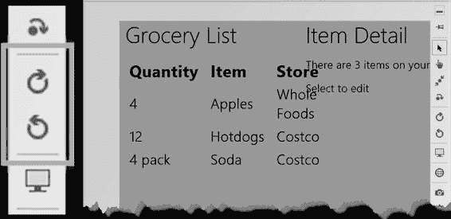

**图 4-1.** Visual Studio 模拟器屏幕方向按钮

该图还显示了示例应用在设备旋转到纵向方向时布局的变化。正如你所见，我分配给 HTML 中各个元素的大小，在累加后占用的空间超过了该方向下可用的空间，这导致了应用部分内容重叠。

### 模拟视图更改

贴靠视图和填充视图仅在横向屏幕方向下、且显示器的水平分辨率达到 1366 像素或更高时可用。这意味着更改视图的第一步是将模拟器旋转至横向，并确保分辨率设置适当（你可以使用屏幕方向更改按钮正下方的按钮来更改模拟器的分辨率）。

更改视图最简单的方法是按下`Win+.`（Windows 键和句点键）。这将激活贴靠视图，应用会显示在 320 像素宽的狭窄条中，如图 4-2 所示。我的示例应用尚未适配视图更改，你可以看到将所有 HTML 元素塞入如此小的空间所产生的影响。

[www.it-ebooks.info](http://www.it-ebooks.info/)

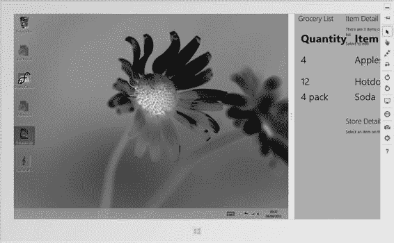

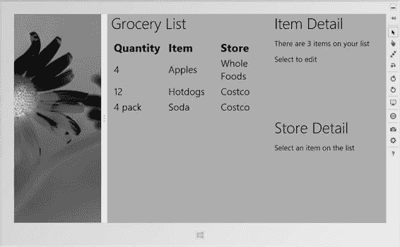

**图 4-2.** 在贴靠视图中显示的示例应用

Windows 会在显示的两个应用之间显示一条分隔条。拖动该条可将应用移至填充视图，如图 4-3 所示。

**图 4-3.** 在填充视图中显示的示例应用

[www.it-ebooks.info](http://www.it-ebooks.info/)

示例应用展示了相当常见的默认行为。在填充视图中损失 320 像素对布局影响不大，尤其是在较大分辨率的屏幕上。如图 4-3 所示，应用布局处理得还算不错，尽管某些元素的内容被折成两行，但应用的基本核心得以保留。

相比之下，贴靠视图使得应用完全失去了作用；当你在编写 HTML 和 CSS 时假设有更多的空间可用时，320 像素的空间确实非常有限。


## 适应方向与视图变化

有两种机制可用于响应方向变化：你可以使用 CSS，也可以使用 JavaScript。如果愿意，还可以混合使用这两种方法，接下来的章节我将同时演示这两种方式。

### 使用 CSS 适配

微软定义了一个自定义 CSS 媒体查询属性和一组值，当方向或视图发生变化时，可用于更改 Windows 8 应用的 CSS 样式。

当 Visual Studio 创建新的 Windows 8 应用程序项目时，这些属性会被添加到 `default.css` 文件中，如代码清单 4-1 所示。

**代码清单 4-1.** 方向与视图媒体查询

```
/*
**...为简洁起见，省略了 MetroGrocer 样式...*
*/

@media screen and (-ms-view-state: fullscreen-landscape) {

}

@media screen and (-ms-view-state: filled) {

}

@media screen and (-ms-view-state: snapped) {

}

@media screen and (-ms-view-state: fullscreen-portrait) {

}
```

该属性名称为 `-ms-view-state`，你可以在代码清单中看到所支持的取值范围，这些值涵盖了方向和视图的各种组合。（请记住，`filled` 和 `snapped` 视图仅在设备处于横向模式时可用。）要适应某个特定的方向或视图，只需在相应的媒体查询中定义 CSS 样式即可。你定义的样式只会在用户更改方向或视图时才会应用。作为演示，代码清单 4-2 展示了如何定义仅在用户将应用切换到 `snapped` 视图时才应用的样式。

[www.it-ebooks.info](http://www.it-ebooks.info/)

**代码清单 4-2.** 为贴靠视图定义样式

```
/*
... *为简洁起见，省略了 MetroGrocer 样式*...
*/

@media screen and (-ms-view-state: fullscreen-landscape) {

}

@media screen and (-ms-view-state: filled) {

}

@media screen and (-ms-view-state: snapped) {

#contentGrid div.gridRight, #listTable td:last-child, #listTable th {

display: none;

}

#listTable td { white-space: nowrap;}

#listTable td:first-child { border-right: thin solid white;}

#contentGrid div.gridLeft { margin-left: 0.5em;}

#contentGrid {-ms-grid-columns: 1fr;}

}

@media screen and (-ms-view-state: fullscreen-portrait) {

}
```

对于我的示例应用来说，贴靠视图提供的空间太小，无法显示完整的布局。如代码清单所示，我使用了 `snapped` 媒体查询来隐藏某些元素，并更改其他元素的显示和行为。你可以在图 4-4 中看到这些样式在贴靠视图中的应用效果，在该图中，我的样式为用户呈现了应用中数据的精简视图。

[www.it-ebooks.info](http://www.it-ebooks.info/)

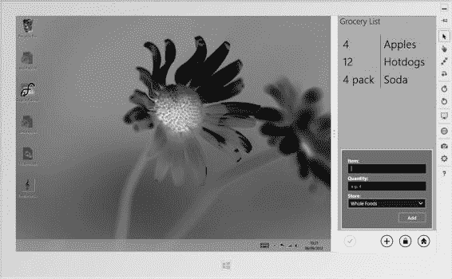

**图 4-4.** 使用 CSS 媒体查询调整应用布局

请注意，Windows 会自动调整 Windows 8 的结构元素，例如在贴靠布局中移除 `AppBar` 按钮上的标签。

> **提示：** 常规的 CSS 优先级规则同样适用于这些查询中定义的样式，这意味着通常应确保 `default.css` 文件的 `<link>` 元素在 `default.html` 文件中最后出现。

### 使用 JavaScript 适配

仅使用 CSS 就能实现相当多的布局适配，但有时也需要在 JavaScript 中进行适配。`Windows.UI.ViewManagement` 命名空间定义了一个名为 `ApplicationView` 的对象，它提供有关当前布局的详细信息。你可以通过处理标准 DOM `resize` 事件来接收方向或视图变化的通知。在代码清单 4-3 中，你可以看到我如何在 `default.js` 文件中为 `resize` 事件添加处理函数。

**代码清单 4-3.** 在 `default.js` 文件中适配变化

```
...
function performInitialSetup(e) {

WinJS.UI.processAll().then(function () {

UI.List.displayListItems();

[www.it-ebooks.info](http://www.it-ebooks.info/)

UI.List.setupListEvents();

UI.AppBar.setupButtons();

UI.Flyouts.setupAddItemFlyout();

...
```


`ViewModel.State.bind("selectedItemIndex", function (newValue) {`

`WinJS.Utilities.empty(itemDetailTarget)`

`var url = newValue == -1 ? "/html/noSelection.html" : "/pages/itemDetail/itemDetail.html"`

`WinJS.UI.Pages.render(url, itemDetailTarget);`

`});`

`WinJS.UI.Pages.render("/html/storeDetail.html", storeDetailTarget);` 

`function setOrientationClass() {`

`if (Windows.UI.ViewManagement.ApplicationView.value == Windows.UI.ViewManagement.ApplicationViewState.fullScreenPortrait) {`

`WinJS.Utilities.addClass(contentGrid, "flex");`

`} else {`

`WinJS.Utilities.removeClass(contentGrid, "flex");`

`}`

`};`

`window.addEventListener("resize", setOrientationClass);` 
`setOrientationClass();`

`});`

`}`

我定义了一个名为 `setOrientationClass` 的函数，该函数读取 `Windows.UI.ViewManagement` 命名空间中 `ApplicationView` 对象的 `value` 属性。

该属性返回 `ApplicationViewState` 对象中定义的值之一（该对象同样位于 `Windows.UI.ViewManagement` 命名空间中）；这些值对应于 CSS 媒体查询属性，分别是 `fullScreenLandscape`、`filled`、`snapped` 和 `fullScreenPortrait`。在我的 `setOrientationClass` 函数中，如果 `value` 属性返回 `fullScreenPortrait`，我会为 `contentGrid` 元素添加一个名为 `flex` 的 CSS 类。对于所有其他方向和视图值，我会移除 `flex` 类。

我使用 `setOrientationClass` 作为 `resize` 事件的处理函数，该事件由 DOM 的 `window` 对象触发。只有在应用更改后用户更改视图或方向时，你才会收到 `resize` 事件。因此，我也会直接调用 `setOrientationClass` 函数，以确保如果设备在纵向模式下启动应用，我能应用我的 CSS `flex` 类。为了支持此代码，我已在 `/css/default.css` 文件中添加了清单 4-4 中所示的 CSS 样式。你可以用任何对你的应用有意义的方式来响应 `resize` 事件，但通常情况下，控制 Windows 8 应用布局的最简单方法与常规 Web 应用一样：通过添加和移除 CSS 类和样式。

[www.it-ebooks.info](http://www.it-ebooks.info/)

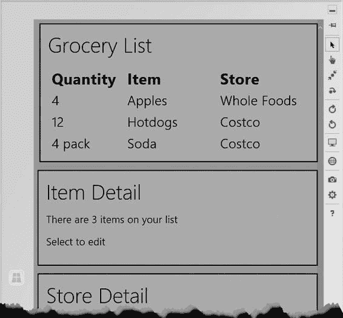

## 第 4 章 ■ 布局与磁贴

### ***清单 4-4.*** 为支持 JavaScript 方向变化而添加到 `/css/default.css` 文件的样式

```
...

#contentGrid.flex {
    display: -ms-flexbox;
    -ms-flex-direction: column;
    -ms-flex-align: stretch;
    -ms-flex-pack: start;
}

#contentGrid.flex > * {
    background-color: gray;
    padding: 20px;
    margin: 10px;
    border: medium solid white;
}

...
```

在此示例中，我依赖于弹性盒布局特性，我将在“CSS3 弹性盒布局快速入门”侧边栏中进行描述。你可以在图 4-5 中看到以这种方式适应方向的效果，该图展示了当我将 Visual Studio 模拟器置于纵向模式时发生的情况。

### ***图 4-5.** 使用 JavaScript 适应纵向方向*

如你所见，我应用的 CSS 改变了应用的布局，使得功能区垂直堆叠——这是一种特别适合纵向方向的布局。

[www.it-ebooks.info](http://www.it-ebooks.info/)

## 第 4 章 ■ 布局与磁贴

## CSS3 弹性盒布局快速入门

在清单 4-4 中，我应用了 CSS3 *弹性盒* 布局，其更准确的名称是弹性盒布局。这是 CSS3 中尚未最终确定的另一部分，需要通过 `–ms` 供应商前缀来访问，在此处是 `–ms-flexbox`。

与第 1 章中描述的网格布局所提供的精确性相比，弹性盒布局使得创建流畅且适应性强的布局变得容易。在这个侧边栏中，我将为你非常快速地介绍 CSS3 弹性盒布局的基本特性。

要创建弹性盒布局，你必须将 `display` 属性设置为 `–ms-flexbox`，并指定子元素将如何布局，如下所示：

```
#contentGrid.flex {
    display: -ms-flexbox;
    -ms-flex-direction: column;
    -ms-flex-align: stretch;
    -ms-flex-pack: start;
}
```

`–ms-flex-direction` 属性指定元素布局的方向。最常用的值是 `column`（将元素从上到下布局）和 `row`（将元素从左到右布局）。

`–ms-flex-pack` 属性指定元素将如何沿你通过 `–ms-flex-direction` 属性设置的主轴进行布局。我使用了 `start` 值，它会将元素在主轴起始处彼此相邻堆叠。其他常用值包括 `end`（将元素堆叠在主轴末端）、`distribute`（沿主轴均匀分布元素）和 `justify`（调整元素大小使其完全占据可用空间）。

`–ms-flex-align` 属性指定元素在另一方向（交叉轴）上的定位方式。我使用了 `stretch` 值，它会调整元素大小以填满可用空间。其他常用值包括 `start`、`end` 和 `center`，它们将元素定位到容器的起始边缘、结束边缘或居中位置。

理解这些属性效果的最佳方法是进行实验；稍加练习，你就能创建出非常灵活且适应性强的布局。有关完整详细信息，请参阅完整规范：<http://www.w3.org/TR/css3-flexbox>，请注意这仍是一个草案标准。

[www.it-ebooks.info](http://www.it-ebooks.info/)

## 第 4 章 ■ 布局与磁贴

## 以编程方式退出贴靠视图

在本节中，我将向你展示如何以编程方式退出贴靠视图。为了演示此功能，我首先需要向示例应用添加一些内容，以便仅在应用实际处于贴靠视图时向用户显示一个按钮。我将使用 HTML 和 CSS 定义该按钮并设置其样式。首先，我向 `default.html` 文件添加了一些新元素，如清单 4-5 所示。

### ***清单 4-5.** 向 `default.html` 文件添加元素*

```
...
<div id="contentGrid">
    <div id="leftContainer" class="gridLeft">
        <h1 class="win-type-xx-large">购物清单</h1>
        <table id="listTable" class="type-table-header">
            <thead>
                <tr>
                    <th>数量</th>
                    <th class="itemName">项目</th>
                    <th class="store">商店</th>
                </tr>
            </thead>
            <tbody id="itemBody"></tbody>
        </table>
    </div>
    <div class="buttonContainer">
        <button id="unsnapButton">取消贴靠</button>
    </div>
    <div id="topRightContainer" class="gridRight">
        <h1 class="win-type-xx-large">项目详情</h1>
        <div id="itemDetailTarget"></div>
    </div>
    <div id="bottomRightContainer" class="gridRight">
        <h1 class="win-type-xx-large">商店详情</h1>
        <div id="storeDetailTarget"></div>
    </div>
</div>
...
```

新增内容包括一个 `button` 元素（用户将单击它以退出贴靠视图），该按钮包含在一个 `div` 元素中，我将用它来更轻松地管理按钮的布局和可见性。你可以在清单 4-6 中看到我为配置新元素而对 `/css/default.css` 文件所做的添加。

[www.it-ebooks.info](http://www.it-ebooks.info/)

## 第 4 章 ■ 布局与磁贴

### ***清单 4-6.** 向 `default.css` 文件添加新样式以支持按钮*

```
body {
    background-color: #4A8C43;
}

/*
... *为简洁起见，省略了其他样式*...
*/

div.buttonContainer {visibility: collapse;-ms-grid-row: 2; width: 100%; text-align:center;}
div.buttonContainer button {font-size: 20pt; margin: 20px;}

@media screen and (-ms-view-state: fullscreen-landscape) {
}

@media screen and (-ms-view-state: filled) {
}

@media screen and (-ms-view-state: snapped) {
    #contentGrid div.gridRight, #listTable td:last-child, #listTable th {
        display: none;
    }
    #listTable td { white-space: nowrap;}
    #listTable td:first-child { border-right: thin solid white;}
    #contentGrid div.gridLeft { margin-left: 0.5em;}
    #contentGrid {-ms-grid-columns: 1fr;}
    div.buttonContainer {visibility: visible;}
}

@media screen and (-ms-view-state: fullscreen-portrait) {
}
```


这些样式通过应用 `visibility` 属性，确保按钮的容器元素仅在应用处于布局视图时可见。媒体查询中定义的值仅在捕捉视图生效时应用，并会覆盖 CSS 文件主体中设置的值。图 4-6 展示了按钮的显示效果。在所有其他视图和方向下，按钮及其容器均被隐藏。

[www.it-ebooks.info](http://www.it-ebooks.info/)

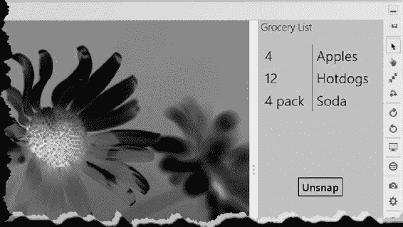

第 4 章 ■ 布局与磁贴

***图 4-6.** 在捕捉视图中显示按钮元素*

现在，我可以为 `/js/default.js` 文件中的按钮元素 click 事件添加一个处理函数，该函数将退出捕捉视图，如代码清单 4-7 所示。

***代码清单 4-7.** 添加退出捕捉视图的代码*

```
...

function performInitialSetup(e) {

WinJS.UI.processAll().then(function () {

UI.List.displayListItems();

UI.List.setupListEvents();

UI.AppBar.setupButtons();

UI.Flyouts.setupAddItemFlyout();

ViewModel.State.bind("selectedItemIndex", function (newValue) {

WinJS.Utilities.empty(itemDetailTarget)

var url = newValue == -1 ? "/html/noSelection.html" :

"/pages/itemDetail/itemDetail.html"

WinJS.UI.Pages.render(url, itemDetailTarget);

});

WinJS.UI.Pages.render("/html/storeDetail.html", storeDetailTarget); function setOrientationClass() {

if (Windows.UI.ViewManagement.ApplicationView.value ==

Windows.UI.ViewManagement.ApplicationViewState

.fullScreenPortrait) {

WinJS.Utilities.addClass(contentGrid, "flex");

} else {

[www.it-ebooks.info](http://www.it-ebooks.info/)

第 4 章 ■ 布局与磁贴

WinJS.Utilities.removeClass(contentGrid, "flex");

}

};

window.addEventListener("resize", setOrientationClass); setOrientationClass();

unsnapButton.addEventListener("click", function (e) {

Windows.UI.ViewManagement.ApplicationView.tryUnsnap();

});

});

}

...
```

`Windows.UI.ViewManagement.ApplicationView` 对象定义了一个名为 `tryUnsnap` 的方法，该方法尝试将应用从捕捉视图中释放出来。如果应用视图成功更改，则此方法返回 `true`，否则返回 `false`。您可以随时调用此方法，但仅当您的应用对用户可见且处于捕捉视图时，它才会生效。这看似显而易见，但返回 `false` 通常是由于未满足这些条件之一。

**注意**

■

`tryUnsnap` 的效果取决于填充视图中是否有其他应用。如果有，则两个屏幕应用的视图将会互换，使您的应用处于填充视图，而另一个应用处于捕捉视图。如果填充视图中没有应用，则您的应用将扩展以填满屏幕。

## 使用磁贴和锁屏提醒

磁贴是您的应用程序在“开始”屏幕上的表现形式。在最简单的情况下，磁贴只是用于启动应用的静态图标。然而，稍加努力，您就可以利用磁贴向用户展示应用状态的有用摘要，并吸引他们注意可能希望执行的活动。

在接下来的几节中，我将演示如何通过我的示例 Windows 8 应用的磁贴来呈现信息。创建动态磁贴时，有两个可能相互矛盾的目标：要么鼓励用户运行您的应用，要么劝阻他们运行它。如果您想吸引用户，那么您的磁贴就成为了您所提供的体验、洞察或内容的广告。这适用于娱乐类应用或呈现外部内容（如新闻）的应用。

[www.it-ebooks.info](http://www.it-ebooks.info/)

第 4 章 ■ 布局与磁贴

劝阻用户运行应用似乎是一个奇怪的目标，但它可以显著改善用户体验。以生产力应用为例。我不敢想象有多少小时浪费在等待日历或待办事项应用加载，仅仅是为了查看下一个约会时间或最紧急的任务是什么。通过在应用磁贴中显示用户所需的信息，可以减少用户使用应用时的摩擦和挫败感，从而营造更愉悦、更即时的体验。

这两个目标都需要深思熟虑。Windows 8 的整体体验简洁而内敛。如果您将磁贴用作广告，Windows 8 的柔和特性使得创建醒目的磁贴变得容易。但是，如果做得太过分，您将创造出不协调、刺眼的东西，与其说是吸引，不如说是碍眼。

如果您的目标是减少用户运行应用的次数，那么您需要在正确的时间呈现正确的信息。这需要深入理解是什么促使您的用户采用您的应用，并具备定制所呈现数据的能力。适应性至关重要；例如，在周六早上向我显示任务列表中最紧急的工作任务毫无意义。每次您向用户展示错误的信息时，都会迫使他们运行您的应用来获取他们真正需要的东西。

## 改进静态磁贴

改善应用程序在“开始”屏幕外观的最简单方法是更改用于应用磁贴的图像。即使您不使用任何其他磁贴功能，也应该自定义应用的图像。

为此，您需要一组三个特定尺寸的图像：30x30 像素、150x150 像素和 310x150 像素。这些图像应包含您要显示的徽标或文本，但其他部分应为透明。我为我的示例应用使用了条形码图案，创建了名为 `tile30.png`、`tile150.png` 和 `tile310.png` 的图像，并将它们放置在 Visual Studio 项目的 `images` 文件夹中，如图 4-7 所示。`tile620.png` 文件是 620x300 像素的图像，我将其用作应用启动时显示的闪屏。这不是磁贴相关的功能，但通过相同的机制应用，因此我将在此处演示其用法。

[www.it-ebooks.info](http://www.it-ebooks.info/)

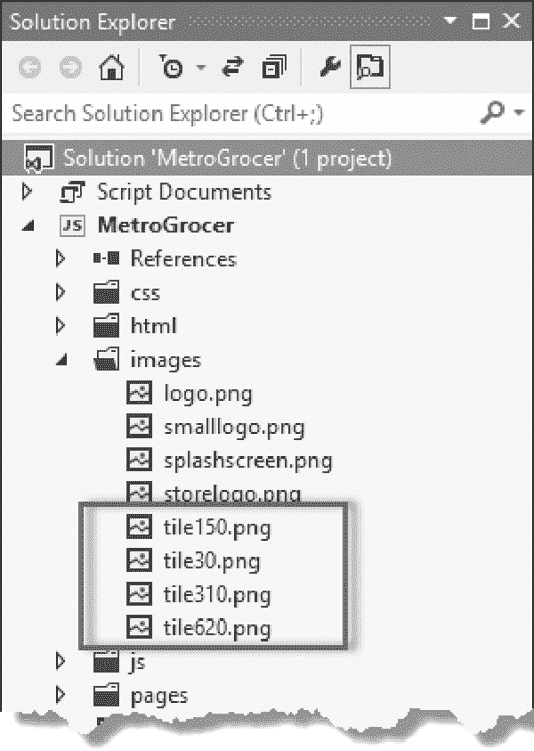

第 4 章 ■ 布局与磁贴

***图 4-7.** 将磁贴图像添加到示例项目的 images 文件夹*

### 应用图像

要应用新图像，请从“解决方案资源管理器”窗口打开 `package.appxmanifest` 文件。“应用程序 UI”选项卡上有一个“磁贴”部分，其中包含设置“徽标”、“宽徽标”和“小徽标”的选项。有提示说明每个选项所需的尺寸。在图 4-8 中，您可以看到我如何应用图像来填充清单中的字段，包括文件字段和闪屏字段。

[www.it-ebooks.info](http://www.it-ebooks.info/)

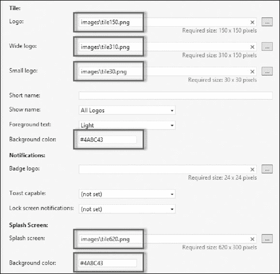

第 4 章 ■ 布局与磁贴

***图 4-8.** 填充清单字段*

您还需要设置将用于磁贴和闪屏的背景色；我将颜色设置为与应用 `body` 元素相同的颜色。

**提示**

■

在清单中设置背景色很重要，而不是在图像中包含背景。当您更新磁贴时（我将在下一节中演示），图像将被动态信息替换，并显示在清单中指定颜色的背景上。

您可能需要从“开始”屏幕卸载您的应用，磁贴图像才能生效。下次从 Visual Studio 启动您的应用时，您应该会看到新的磁贴。

您可以通过选择磁贴并选择 89

[www.it-ebooks.info](http://www.it-ebooks.info/)

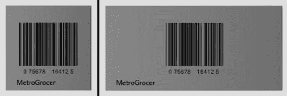

第 4 章 ■ 布局与磁贴


### 更大或更小的按钮

通过 `AppBar` 上的**更大**或**更小**按钮，您可以查看图 4-9 中示例应用程序的方形和宽磁贴格式。

**图 4-9.** 更新后的静态普通宽磁贴

## 更新磁贴

对于我的示例应用程序，我将显示购物清单中的前几个项目。磁贴更新基于预配置的模板，这些模板包含图形和文本的混合，并针对标准或宽磁贴设计。您首先要做的是选择所需的模板。最简单的方法是查看 `Windows.UI.Notifications.TileTemplateType` 枚举的 API 文档，该文档位于 `http://msdn.microsoft.com/en-us/library/windows/apps/windows.ui.notifications.tiletemplatetype.aspx`。

模板系统基于 XML 片段。我选择了 `tileSquareText03` 模板。这是一个方形磁贴，包含四行不换行文本，没有任何图像。您可以在清单 4-8 中看到表示该磁贴的 XML 片段。

**清单 4-8.** `tileSquareText03` 磁贴模板的 XML 片段

```
<tile>
<visual lang="en-US">
<binding template="TileSquareText03">
<text id="1">Text Field 1</text>
<text id="2">Text Field 2</text>
<text id="3">Text Field 3</text>
<text id="4">Text Field 4</text>
</binding>
</visual>
</tile>
```

其思路是用应用程序中的信息填充 `text` 元素，并将结果传递给 Windows 通知系统。为了演示此功能，我向项目中添加了一个名为 `tiles.js` 的新 JavaScript 文件，其内容如清单 4-9 所示。

**清单 4-9.** `tiles.js` 文件

```
/// <reference path="//Microsoft.WinJS.1.0/js/base.js" />
/// <reference path="//Microsoft.WinJS.1.0/js/ui.js" />
(function () {
"use strict";
WinJS.Namespace.define("Tiles", {
sendTileUpdate: function () {
var tn = Windows.UI.Notifications;
var xmlFragment = tn.TileUpdateManager
.getTemplateContent(tn.TileTemplateType.tileSquareText03);
var textNodes = xmlFragment.getElementsByTagName("text");
var items = ViewModel.UserData.getItems();
for (var i = 0; i < textNodes.length; i++) {
var listItem = items.getAt(i);
if (listItem) {
textNodes[i].innerText = listItem.item;
}
}
for (var i = 0; i < 5; i++) {
tn.TileUpdateManager.createTileUpdaterForApplication()
.update(new tn.TileNotification(xmlFragment));
}
}
});
var eventTypes = ["itemchanged", "iteminserted",
"itemmoved", "itemremoved"];
var itemsList = ViewModel.UserData.getItems();
eventTypes.forEach(function (type) {
itemsList.addEventListener(type, Tiles.sendTileUpdate);
});
})();
```

**注意：** `Windows.UI.Notifications` 命名空间的长度足以导致印刷页面上代码的布局问题，因此我创建了一个名为 `tn` 的变量作为简写，并将该命名空间分配给它。

**提示：** 请注意，模板名称的第一个字母是小写的。如果您使用大写字母，则您将获得默认模板，而不是您想要的模板。

### 填充 XML 模板

为了获取模板 XML 片段，我调用了 `TileUpdateManager.getTemplateContent` 方法，并使用 `TileTemplateType` 中的值指定所需的模板。

这会给我一个 `Windows.Data.Xml.Dom.XmlDocument` 对象，我可以对其应用标准 DOM 方法来设置模板中 `text` 元素的值。嗯，差不多是这样——因为 `XmlDocument` 对象的 `getElementById` 实现不起作用，我必须使用 `getElementsByTagName` 方法来获取包含 XML 中所有 `text` 元素的数组。这些元素按照它们在 XML 片段中定义的顺序返回，因此我可以遍历并将每个元素的 `innerText` 属性设置为我购物清单中的一个项目。

**提示：** XML 模板定义的四个 `text` 元素中，只有三个在"开始"菜单上对用户可见。最后一个元素被应用程序名称或图标遮挡。


许多磁贴模板都是如此。

### 创建磁贴更新

设置好 XML 文档的内容后，我使用它来为应用程序磁贴创建更新。我需要从 XML 创建一个`TileNotification`对象，然后将其传递给`TileUpdateManager.createTileUpdaterForApplication`方法返回的`TileUpdater`对象的更新方法：

```
for (var i = 0; i < 5; i++) {
  tn.TileUpdateManager.createTileUpdaterForApplication()
    .update(new tn.TileNotification(xmlFragment));
}
```

并非所有磁贴更新都能正确处理，因此我使用`for`循环重复发送通知。五次似乎是保证更新能显示在“开始”屏幕上的最少重复次数。

### 应用磁贴更新

我的磁贴更新在两个地方应用。正如你在代码清单 4-9 中所见，`tiles.js`文件设置了事件处理程序，当购物清单内容发生变化时，这些处理程序会调用`sendTileUpdate`函数。这确保了磁贴始终反映用户对列表所做的更改。我还从`default.js`中的`performInitialSetup`函数调用了`sendTileUpdate`方法，如代码清单 4-10 所示。

[www.it-ebooks.info](http://www.it-ebooks.info/)

#### 代码清单 4-10。在应用程序设置期间更新磁贴

```
function performInitialSetup(e) {
  WinJS.UI.processAll().then(function () {
    UI.List.displayListItems();
    UI.List.setupListEvents();
    UI.AppBar.setupButtons();
    UI.Flyouts.setupAddItemFlyout();
    ViewModel.State.bind("selectedItemIndex", function (newValue) {
      WinJS.Utilities.empty(itemDetailTarget)
      var url = newValue == -1 ? "/html/noSelection.html" :
        "/pages/itemDetail/itemDetail.html"
      WinJS.UI.Pages.render(url, itemDetailTarget);
    });
    WinJS.UI.Pages.render("/html/storeDetail.html", storeDetailTarget);
    function setOrientationClass() {
      if (Windows.UI.ViewManagement.ApplicationView.value ==
        Windows.UI.ViewManagement.ApplicationViewState
          .fullScreenPortrait) {
        WinJS.Utilities.addClass(contentGrid, "flex");
      } else {
        WinJS.Utilities.removeClass(contentGrid, "flex");
      }
    };
    window.addEventListener("resize", setOrientationClass);
    setOrientationClass();
    unsnapButton.addEventListener("click", function (e) {
      Windows.UI.ViewManagement.ApplicationView.tryUnsnap();
    });
    Tiles.sendTileUpdate();
  });
}
```

当然，由于我创建了一个新的 JavaScript 文件，我需要将其链接到`default.html`，如代码清单 4-11 所示。

#### 代码清单 4-11。将`tiles.js`文件添加到`default.html`

```
<head>
  <meta charset="utf-8">
  <title>MetroGrocer</title>
  [www.it-ebooks.info](http://www.it-ebooks.info/)
  <!-- WinJS 引用 -->
  <link href="//Microsoft.WinJS.1.0/css/ui-dark.css" rel="stylesheet">
  <script src="//Microsoft.WinJS.1.0/js/base.js"></script>
  <script src="//Microsoft.WinJS.1.0/js/ui.js"></script>
  <!-- MetroGrocer 引用 -->
  <link href="/css/list.css" rel="stylesheet">
  <link href="/css/flyout.css" rel="stylesheet">
  <link href="/css/default.css" rel="stylesheet">
  <script src="/js/viewmodel.js"></script>
  <script src="/js/ui.js"></script>
  <script src="/js/pages.js"></script>
  <script src="/js/tiles.js"></script>
  <script src="/js/default.js"></script>
</head>
```

### 测试磁贴更新

在测试我的更新磁贴之前，需要完成几个准备步骤。首先，Visual Studio 模拟器不支持更新磁贴，这意味着我将不得不直接在开发机器上进行测试。为此，我需要将 Visual Studio 的部署目标更改为“本地计算机”，如图 4-10 所示。

**图 4-10.** 选择本地计算机进行调试

第二步是从“开始”屏幕卸载我的示例应用程序（通过从应用栏中选择“卸载”来完成）。似乎存在某种“粘性”，即之前依赖静态磁贴的应用程序无法正确处理更新。


完成排版后的内容如下：

完成上述两个步骤后，我就可以通过从“调试”菜单中选择“启动调试”，在 Visual Studio 中启动我的应用程序。应用程序启动后，我可以对购物清单进行修改，而前三个项目的简短摘要将显示在开始磁贴上，如图 4-11 所示。

[www.it-ebooks.info](http://www.it-ebooks.info/)

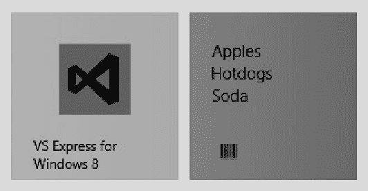

## 第 4 章 ■ 布局与磁贴

**图 4-11.** *更新应用程序磁贴*

**提示** 如果你一直在使用模拟器，可能无法在开始屏幕上找到该磁贴。如果遇到这种情况，请通过输入应用名称的前几个字母来搜索该应用。
点击较小的搜索结果图标，磁贴便会显示。如果该方法无效，请重启并在本地启动应用程序，确保不要启动模拟器。

### 更新宽磁贴

如果你希望仅更新应用程序的方形*或*宽磁贴，上一节介绍的技术非常有用。但是，除非你对数据的呈现有非常特殊的需求，否则你应该同时提供方形和宽磁贴的更新，因为你不知道用户会选择哪一种。

要更新两种尺寸的磁贴，你需要将两个 XML 模板合并成一个包含两个更新内容的片段。在本节中，我将合并 `tileSquareText03` 和 `tileWideBlockAndText01` 模板。宽模板有几个额外的字段，我将用它们来显示用户为了获取购物清单上的所有商品需要访问的商店数量。你可以在**清单 4-12** 中看到我想要生成的内容——一个遵循单一模板格式但合并了两个 `binding` 元素的片段。

**清单 4-12.** *编写一个单一的 XML 片段*

```xml
<tile>
<visual lang="en-US">
<binding template="TileSquareText03">
<text id="1">Apples</text>
<text id="2">Hotdogs</text>
<text id="3">Soda</text>
<text id="4"></text>
</binding>
<binding template="TileWideBlockAndText01">
<text id="1">Apples (Whole Foods)</text>
<text id="2">Hotdogs (Costco)</text>
<text id="3">Soda (Costco)</text> 95
<text id="4"></text>
<text id="5">2</text>
<text id="6">Stores</text>
</binding>
</visual>
</tile>
```

没有现成的便捷 API 用于合并模板。我所采用的方法是使用 XML 处理支持来分别填充模板，然后在过程的最后将它们合并。你可以在**清单 4-13** 中看到我是如何做到这一点的，该清单显示了我对 `tiles.js` 文件所做的修改。

**清单 4-13.** *为方形和宽磁贴生成一个单一更新*

```javascript
/// <reference path="//Microsoft.WinJS.1.0/js/base.js" />
/// <reference path="//Microsoft.WinJS.1.0/js/ui.js" /> (function () {
"use strict";
WinJS.Namespace.define("Tiles", {
sendTileUpdate: function () {
var storeCounter = { count: 0 };
ViewModel.UserData.getItems().forEach(function (listItem) {
if (!storeCounter[listItem.store]) {
storeCounter[listItem.store] = true;
storeCounter.count++;
}
});
var tn = Windows.UI.Notifications;
var squareXmlFragment = tn.TileUpdateManager
.getTemplateContent(tn.TileTemplateType.tileSquareText03); var wideXmlFragment = tn.TileUpdateManager
.getTemplateContent(tn.TileTemplateType.tileWideBlockAndText01); var squareTextNodes =
squareXmlFragment.getElementsByTagName("text"); var wideTextNodes =
wideXmlFragment.getElementsByTagName("text"); var items = ViewModel.UserData.getItems();
for (var i = 0; i < squareTextNodes.length; i++) {
var listItem = items.getAt(i);
if (listItem) {
squareTextNodes[i].innerText = listItem.item;
wideTextNodes[i].innerText = listItem.item + " ("
+ listItem.store + ")";
}
}
wideTextNodes[4].innerText = storeCounter.count;
wideTextNodes[5].innerText = "Stores";
var wideBindingElement =
wideXmlFragment.getElementsByTagName("binding")[0]; var importedNode = squareXmlFragment.importNode(wideBindingElement, true);
```


```javascript
var squareVisualElement =
    squareXmlFragment.getElementsByTagName
    ("visual")[0];
squareVisualElement.appendChild(importedNode);
for (var i = 0; i < 5; i++) {
    tn.TileUpdateManager.createTileUpdaterForApplication()
        .update(new tn.TileNotification(squareXmlFragment))
}
}
});
var eventTypes = ["itemchanged", "iteminserted",
    "itemmoved", "itemremoved"];
var itemsList = ViewModel.UserData.getItems();
eventTypes.forEach(function (type) {
    itemsList.addEventListener(type, Tiles.sendTileUpdate);
});
})();
```

宽格式的磁贴让我有机会在每一行向用户展示更多信息。在此示例中，除了显示所需访问商店的总次数外，我还加入了关于应从哪家商店购买商品的信息。

组合模板并非难以掌握的技巧，但合并两个 XML 片段时需格外谨慎。我以方形磁贴的模板为基础进行组合更新。当需要添加来自宽模板的绑定元素时，我必须先将其导入方形 XML 文档中，具体操作如下：

```javascript
var importedNode = squareXmlFragment.importNode(wideBindingElement, true);
```

`importNode` 方法会在方形文档的上下文中创建宽绑定元素的新副本。该方法的参数包括：要导入的元素，以及指示是否同时导入子节点的布尔值（显然我需要导入子节点）。创建新元素后，我通过 `appendChild` 方法将其插入方形 XML 中：

```javascript
squareVisualElement.appendChild(importedNode);
```

[www.it-ebooks.info](http://www.it-ebooks.info/)

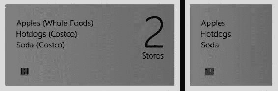

## 第 4 章 ■ 布局与磁贴

最终得到的组合文档如清单 4-12 所示。图 4-12 展示了两种磁贴尺寸的外观。（你可以在 Windows 开始屏幕中选择磁贴，右键单击或滑动以显示应用栏，从而在方形和宽版本之间切换。通过"缩小"和"放大"按钮可将磁贴切换为宽配置或恢复原状。）

***图 4-12.** 更新宽磁贴*

### 应用徽章

Windows 8 在磁贴中集成了许多功能，包括支持*徽章*——即磁贴上的小图标或数字覆盖层。后者属于"磁贴即广告"的范畴，因为除引导用户启动应用外，数字标识几乎别无他用。为演示徽章功能，我将基于购物清单中的商品数量显示一个简单指示器。清单 4-14 展示了 `tiles.js` 文件的修改内容。

***清单 4-14.** 添加对磁贴徽章的支持*

```javascript
/// <reference path="//Microsoft.WinJS.1.0/js/base.js" />
/// <reference path="//Microsoft.WinJS.1.0/js/ui.js" />
(function () {
    "use strict";
    WinJS.Namespace.define("Tiles", {
        sendBadgeUpdate: function () {
            var itemCount = ViewModel.UserData.getItems().length;
            var tn = Windows.UI.Notifications;
            var templateType = itemCount ? tn.BadgeTemplateType.badgeGlyph
                : tn.BadgeTemplateType.badgeNumber;
            var badgeXml =
                tn.BadgeUpdateManager.getTemplateContent(templateType);
            var badgeAttribute = badgeXml.getElementsByTagName("badge")[0];
            badgeAttribute.setAttribute("value",
                itemCount > 3 ? "alert" : itemCount);
            for (var i = 0; i < 5; i++) {
                var badgeNotification = new tn.BadgeNotification(badgeXml);
                tn.BadgeUpdateManager.createBadgeUpdaterForApplication()
                    .update(badgeNotification);
            }
        },
        sendTileUpdate: function () {
            //
            // *...为简洁起见已省略代码...*
            // *
        }
    });
    var eventTypes = ["itemchanged", "iteminserted",
        "itemmoved", "itemremoved"];
    var itemsList = ViewModel.UserData.getItems();
    eventTypes.forEach(function (type) {
        itemsList.addEventListener(type, function () {
            Tiles.sendTileUpdate();
            Tiles.sendBadgeUpdate();
        });
    });
})();
```

徽章的工作方式与磁贴通知类似：获取 XML 模板，填充内容，然后通过开始菜单向用户展示信息。


