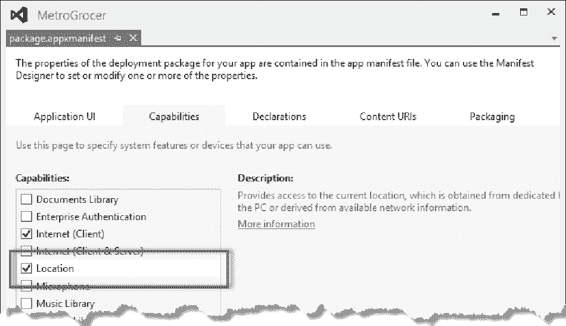
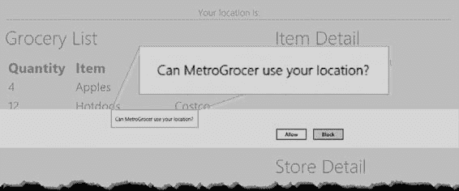
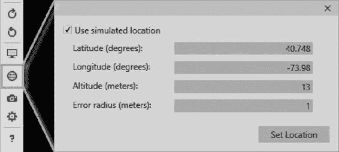
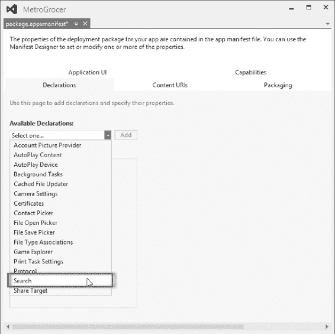

# 采购清单

[www.it-ebooks.info](http://www.it-ebooks.info/)

## 第 5 章 ■ 生命周期事件

**提示** 使用 HTML5 和 JavaScript 开发 Windows 8 的一个乐趣在于，某些关键功能领域（包括地理位置服务）你可以选择使用 HTML5 API 还是 Windows API。本示例中我使用了 Windows API，但采用 HTML5 等效 API 同样能完美运行。

为了管理新元素的布局，我在`/css/default.css`文件中新增了属性，如代码清单 5-4 所示。

***代码清单 5-4*** 向`default.css`文件添加新属性

```css
div.midtitle {
  text-align: center;
  margin: 20px;
  padding-bottom: 5px;
  border-bottom: thin solid white;
}
```

## 控制任务

对于地理定位和 Ajax 请求，这里仅作简要说明，因为本示例的重点是创建周期性重复的后台任务。任务的具体功能并不重要。`location.js`文件中最重要的部分是`startTracking`和`stopTracking`函数。当调用`startTracking`函数时，我会创建一个新的`Promise`对象来代表整个后台任务。

**提示** 我使用`Promise`对象作为两个内部`Promise`对象的包装器，这两个内部`Promise`分别代表位置数据请求和后续的 Ajax 请求。当两个内部`Promise`对象都完成后，我会调用`complete`函数，该函数作为回调参数传入我创建`Promise`对象时所使用的回调函数。关于`WinJS.Promise`对象的更多信息，请参阅 API 参考文档。

每次请求完成后，我会创建另一个封装新请求的`Promise`，只要`tracking`变量为`true`，就会重复此过程。我每五秒启动一个新的请求周期。

当调用`stopTracking`函数时，我将`tracking`变量设置为`false`，并返回代表当前请求周期的`Promise`。我返回的`Promise`表示两种状态之一的请求周期：第一种状态是请求处于活动状态，意味着我正在等待地理定位数据或 Ajax 请求完成，或者在向 DOM 应用更新。如果对活动`Promise`调用`then`方法，回调函数将直到周期完成后才会执行。第二种状态是请求已完成，并且在下一个周期开始前处于间歇期。对已完成的`Promise`调用`then`方法将导致回调函数立即执行。

基于此，我能够利用不同生命周期事件的处理程序将后台任务集成到`default.js`中，如代码清单 5-5 所示。

***代码清单 5-5*** 使用生命周期事件控制后台任务

```javascript
(function () {
  "use strict";

  Windows.UI.WebUI.WebUIApplication.addEventListener("activated", performInitialSetup);
  Windows.UI.WebUI.WebUIApplication.addEventListener("resuming", performResume);
  Windows.UI.WebUI.WebUIApplication.addEventListener("suspending", performSuspend);

  function performInitialSetup(e) {
    WinJS.UI.processAll().then(function () {
      UI.List.displayListItems();
      UI.List.setupListEvents();
      UI.AppBar.setupButtons();
      UI.Flyouts.setupAddItemFlyout();
      ViewModel.State.bind("selectedItemIndex", function (newValue) {
        var targetElement = document.getElementById("itemDetailTarget");
        WinJS.Utilities.empty(targetElement);
        var url = newValue == -1 ? "/html/noSelection.html"
                                  : "/pages/itemDetail/itemDetail.html";
        WinJS.UI.Pages.render(url, targetElement);
      });
      WinJS.UI.Pages.render("/html/storeDetail.html", document.getElementById("storeDetailTarget"));
      //Tiles.sendTileUpdate();
      //Tiles.sendBadgeUpdate();
      Location.startTracking();
    });
  }

  function performResume(e) {
    Location.startTracking();
  }

  function performSuspend(e) {
    var promise = Location.stopTracking();
    if (promise) {
      var deferral = e.suspendingOperation.getDeferral();
```

[www.it-ebooks.info](http://www.it-ebooks.info/)


```javascript
promise.then(function () {
    deferral.complete();
});
})();
```

针对激活（activated）和恢复（resuming）事件的改动很简单：在这两种情况下，我都希望启动后台任务，因此只需调用 `Location.startTracking` 方法即可。这段代码中最为有趣的部分，也是我将此示例纳入本章的原因，在于我如何处理挂起（suspending）事件。

**提示** 请注意，我已注释掉了应用磁贴和徽章更新的代码行。这样做是为了让示例应用能在模拟器中运行。同时，我也禁用了 `tiles.js` 文件中的事件处理程序。

我的问题是，当 Windows 挂起我的应用时，任何正在活动的后台任务都会在应用恢复时自动继续执行。根据任务在被挂起时所处请求周期的位置，我可能会遇到错误（例如，尝试读取在挂起期间已超时的网络请求数据），或获取到过期数据（因为我的任务在应用被挂起前正准备更新 DOM）。

为帮助解决这些问题，`suspending` 事件定义了一个名为 `suspendingOperation` 的属性，该属性返回一个 `Windows.ApplicationModel.SuspendingOperation` 对象。调用此对象的 `getDeferral` 方法，是请求 Windows 为你的应用提供更多时间来准备挂起。当完成后台任务的收尾工作后，你在 `getDeferral` 方法返回的对象上调用 `complete` 方法，向 Windows 发出信号，表明你的应用现在已准备好被挂起。

请求延迟操作会额外获得五秒钟的时间来准备挂起。这听起来可能不多，但考虑到 Windows 可能承受着很大的压力来让你的应用让出系统资源，这已经是相当宽裕的时间了。

**警告** 如果应用未能在五秒的允许时间内调用延迟对象上的 `complete` 方法，Windows 将终止该应用。

[www.it-ebooks.info](http://www.it-ebooks.info/)



## 第 5 章 ■ 生命周期事件

### 声明位置功能

应用必须在其清单中声明需要使用位置服务。在运行更新后的应用前，打开 `package.appxmanifest`，切换到“功能”选项卡，确保已勾选“位置”功能，然后保存文件，如图 5-4 所示。

***图 5-4.** 在清单中声明位置功能*

### 测试后台任务

剩下的工作就是测试后台任务是否与生命周期事件正确集成。最简单的方法是使用支持模拟位置数据的模拟器。你按照前面几节的内容对示例进行修改后，首次启动时，系统会提示你允许应用访问位置数据，如图 5-5 所示。点击“允许”按钮，以确保示例中的代码能够正常运行。

[www.it-ebooks.info](http://www.it-ebooks.info/)





## 第 5 章 ■ 生命周期事件

***图 5-5.** 授予位置数据访问权限*

**提示** 你可能还需要授予模拟器访问你开发 PC 位置数据的权限。有一个自动化过程会检查所需设置，并提示你对系统配置进行必要的更改。

模拟器会尝试使用你开发 PC 的位置信息，但对于此示例，我希望使用模拟位置，以便演示应用挂起期间设备移动所产生的影响。你可以点击模拟器的“设置位置”按钮并填写表单字段来输入位置，如图 5-6 所示。

***图 5-6.** 在 Visual Studio 模拟器中设置模拟位置*

在此示例中，我使用了帝国大厦的坐标，其纬度为 `40.748`，经度为 `-73.98`。点击“设置位置”按钮，即可更改模拟器向应用报告的位置。

[www.it-ebooks.info](http://www.it-ebooks.info/)


## 第 5 章 ■ 生命周期事件

稍等片刻，你会看到新的位置显示在应用布局的顶部。

对于我在“设置位置”对话框中输入的坐标，Web 服务将街道地址报告为“Park Avenue”，你可以在图 5-7 中看到该地址以及指示上次更新时间的时间戳。

***图 5-7.** 应用显示的当前位置的街道地址*

下一步是挂起应用，可以通过 Visual Studio 的模拟事件，也可以将应用置于后台来实现。在应用挂起期间，更改位置，然后恢复应用。在本示例中，我将模拟纬度更改为 `51.50`，经度更改为 `-0.14`（这些是白金汉宫的坐标）。

恢复应用，你会看到后台任务响应恢复事件而重新启动，并使用新的位置数据和更新的时间戳更新布局，如图 5-8 所示。

***图 5-8.** 应用显示的修改后的街道地址*

## 实现搜索合约

挂起和恢复事件很重要，但我想回到激活事件，向你展示如何利用它让你的应用与 Windows 8 的其余部分实现更紧密的集成。为此，我将实现一个*合约*，这是 Windows 8 向应用表达用户体验某些关键方面的方式。我将实现搜索合约，该合约告诉 Windows，我的示例应用能够支持操作系统级的搜索机制。在接下来的几节中，我将向你展示如何声明对合约的支持并实现合约条款。

### 声明对合约的支持

实现合约的第一步是更新清单。打开 `package.appxmanifest` 文件，切换到“声明”选项卡。如果你打开“可用声明”菜单，将会看到你可以声明支持的合约列表。

选择“搜索”并点击“添加”按钮。“搜索”合约将出现在“支持的声明”列表中，如图 5-9 所示。忽略合约的属性；它们对 JavaScript 应用不起作用。

[www.it-ebooks.info](http://www.it-ebooks.info/)



## 第 5 章 ■ 生命周期事件

***图 5-9.** 声明对搜索合约的支持*

### 处理搜索

搜索合约的目的是将操作系统的搜索系统与应用程序内部的某种搜索功能连接起来。对于我的示例应用，我将通过遍历购物清单上的项目并查找第一个包含用户所搜索字符串的项目来处理搜索请求。这不会是最复杂的搜索实现，但它能让我专注于合约本身，而无需陷入创建大量处理搜索的新代码的泥潭。我已向项目添加了一个名为 `search.js` 的新 JavaScript 文件，其内容见清单 5-6。

[www.it-ebooks.info](http://www.it-ebooks.info/)

## 第 5 章 ■ 生命周期事件

***清单 5-6.*** 实现基本搜索功能

```javascript
/// <reference path="//Microsoft.WinJS.1.0/js/base.js" />
/// <reference path="//Microsoft.WinJS.1.0/js/ui.js" />
(function () {
    "use strict";

    WinJS.Namespace.define("Search", {
        searchAndSelect: function (searchTerm) {
            var searchTerm = searchTerm.toLowerCase();
            var items = ViewModel.UserData.getItems();
            var matchedIndex = -1;

            for (var i = 0 ; i < items.length; i++) {
                if (items.getAt(i).item.toLowerCase()
                    .indexOf(searchTerm) > -1) {
                    matchedIndex = i;
                    break;
                }
            }

            ViewModel.State.selectedItemIndex = matchedIndex;
        }
    });
})();
```


在本文中，我定义了一个名为`Search`的命名空间，其中包含`searchAndSelect`函数。该函数接受用户正在搜索的术语，并通过视图模型对项目执行基本的不区分大小写搜索。如果找到匹配项，则设置视图模型中的`selectedItemIndex`属性，通过绑定的魔力，这将使匹配项高亮显示并显示其详细信息。为了将此代码引入应用，我在`default.html`文件的`head`部分添加了一个`script`元素，如**清单 5-7**所示。

**清单 5-7.** 为`search.js`文件在`default.html`文件中添加`script`元素

```html
<head>
    <meta charset="utf-8">
    <title>MetroGrocer</title>
    <!-- WinJS references -->
    <link href="//Microsoft.WinJS.1.0/css/ui-dark.css" rel="stylesheet">
    <script src="//Microsoft.WinJS.1.0/js/base.js"></script>
    <script src="//Microsoft.WinJS.1.0/js/ui.js"></script>
    <!-- MetroGrocer references -->
    <link href="/css/list.css" rel="stylesheet">
    <link href="/css/flyout.css" rel="stylesheet">
    <link href="/css/default.css" rel="stylesheet">
    <script src="/js/viewmodel.js"></script>
    <script src="/js/ui.js"></script>
    <script src="/js/pages.js"></script>
    <script src="/js/tiles.js"></script>
    <script src="/js/location.js"></script>
    <script src="/js/search.js"></script>
    <script src="/js/default.js"></script>
</head>
```

## 实现`Activated`事件处理程序

如前所述，Windows 使用`activated`事件来指示一系列指令。先前，我将所有`activated`事件视为启动应用的指令，但为了支持搜索合约，我必须检查`activated`事件以确定我的应用被要求做什么。您可以在`/js/default.js`文件中看到我如何更新了`activated`事件的事件处理程序，如**清单 5-8**所示。

**清单 5-8.** 在事件中确定激活详细信息

```javascript
(function () {
    "use strict";

    Windows.UI.WebUI.WebUIApplication.addEventListener("activated", function (e) {
        var actNS = Windows.ApplicationModel.Activation;

        if (e.previousExecutionState != actNS.ApplicationExecutionState.suspended) {
            performInitialSetup(e);
        }

        if (e.kind == actNS.ActivationKind.search) {
            Search.searchAndSelect(e.queryText);
        }
    });

    Windows.UI.WebUI.WebUIApplication.addEventListener("resuming", performResume);
    Windows.UI.WebUI.WebUIApplication.addEventListener("suspending", performSuspend);

    function performInitialSetup(e) {
        WinJS.UI.processAll().then(function () {
            UI.List.displayListItems();
            UI.List.setupListEvents();
            UI.AppBar.setupButtons();
            UI.Flyouts.setupAddItemFlyout();

            ViewModel.State.bind("selectedItemIndex", function (newValue) {
                WinJS.Utilities.empty(itemDetailTarget)
                var url = newValue == -1 ? "/html/noSelection.html" : "/pages/itemDetail/itemDetail.html"
                WinJS.UI.Pages.render(url, itemDetailTarget);
            });

            WinJS.UI.Pages.render("/html/storeDetail.html", storeDetailTarget);

            function setOrientationClass() {
                if (Windows.UI.ViewManagement.ApplicationView.value == Windows.UI.ViewManagement.ApplicationViewState.fullScreenPortrait) {
                    WinJS.Utilities.addClass(contentGrid, "flex");
                } else {
                    WinJS.Utilities.removeClass(contentGrid, "flex");
                }
            };

            window.addEventListener("resize", setOrientationClass);
            setOrientationClass();

            unsnapButton.addEventListener("click", function (e) {
                Windows.UI.ViewManagement.ApplicationView.tryUnsnap();
            });

            //Tiles.sendTileUpdate();
            //Tiles.sendBadgeUpdate();

            Location.startTracking();
        });
    }

    function performResume(e) {
        Location.startTracking();
    }

    function performSuspend(e) {
        var promise = Location.stopTracking();
        if (promise) {
            var deferral = e.suspendingOperation.getDeferral();
            promise.then(function () {
                deferral.complete();
            });
        }
    }
})();
```

Windows 通过传递给处理函数的事件对象的`kind`属性提供有关应用被发送`activated`事件原因的信息。可能值的范围由`Windows.ApplicationModel.Activation.ActivationKind`枚举定义。不同的合约有不同的激活类型，例如打印、打开文件、使用设备摄像头以及处理搜索请求。通过检查`kind`属性的值，我可以发现`activated`事件是否因搜索请求而发送：

```javascript
if (e.kind == actNS.ActivationKind.search) {
    Search.searchAndSelect(e.queryText);
}
```

用户提供的搜索词可通过事件的`queryText`属性获得。如果我的`activated`事件是因搜索请求而发送的，则调用`searchAndSelect`函数，并传入`queryText`值。这将定位并选中购物清单中第一个匹配项。

## 确保应用设置

我处理搜索请求的方法依赖于在调用`searchAndSelect`之前先调用`performInitialSetup`函数，因为我依赖视图模型及其相关的绑带来将`selectedItemIndex`属性的变化转换为显示界面的变化。

问题在于，与搜索相关的`activated`事件可能有两种含义。如果我的应用已经在运行，那么搜索`activated`事件仅意味着“执行此搜索”。但如果我的应用尚未运行，则该事件意味着“启动应用*并*执行此搜索”。

弄清我正在处理哪种含义非常重要。即使应用在用户发起搜索时未运行，您也只会收到一个`activated`事件。如果我的应用已在运行，而我却调用了`performInitialSetup`，则会创建重复的绑定和事件处理程序。这会导致各种奇怪的行为，但最明显的问题是布局中的右列会包含两套内容，因为最终调用了太多次`WinJS.Pages.render`方法。相比之下，如果我的应用未在运行，而我却未能调用`performInitialSetup`，那么将没有任何绑定和事件处理程序，也就不会显示任何内容。

我需要小心操作：当我的应用之前未运行时调用`performInitialSetup`函数，而如果它已在运行则避免调用该函数。我通过查看传递给`activated`处理函数的事件对象的`previousExecutionState`属性来实现这一点，该属性报告了我的应用在`activated`事件发送前一刻的执行状态。此属性的可能值范围由`Windows.ApplicationModel.Activation.ApplicationExecutionState`枚举定义，但为了解决这个问题，我唯一关心的值是`suspended`，它告诉我应用设置已经执行过：

```javascript
if (e.previousExecutionState != actNS.ApplicationExecutionState.suspended) {
    performInitialSetup(e);
}
```

## 测试搜索合约

要测试此合约，请启动您的应用。无论是否使用调试器启动，以及启动后是退出还是挂起应用都无关紧要。关键是要确保应用出现在模拟器上。

接下来，切换到“开始”屏幕。如果您的应用仍在运行，它将被切换到后台，并在几秒钟后挂起。要开始搜索，只需开始输入。您希望搜索可以匹配的内容，因此请输入`hot`（这样您的搜索将匹配购物清单中的热狗项目）。

当您输入时，Windows 会自动开始标准搜索，查找名称中包含`hot`的应用。您将看到类似于图 5-10 的画面，因为默认的 Windows 8 安装中没有此类应用。

**图 5-10.** 发起搜索


