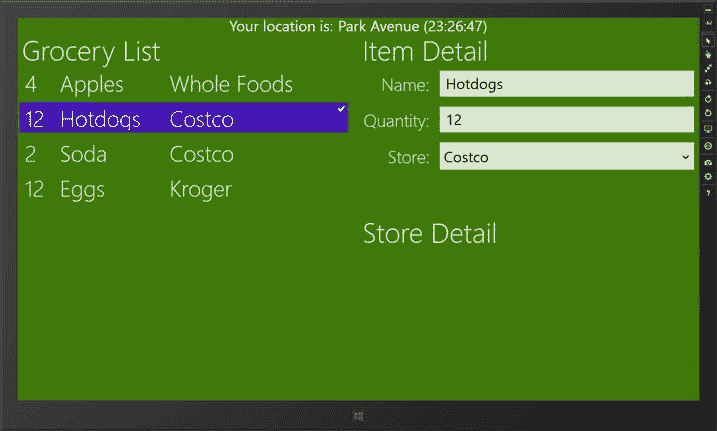
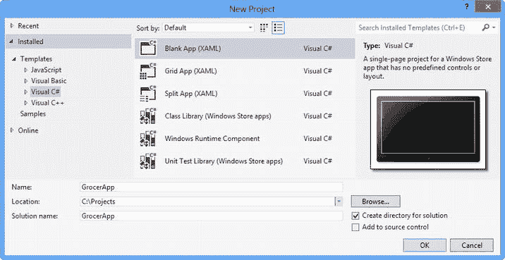
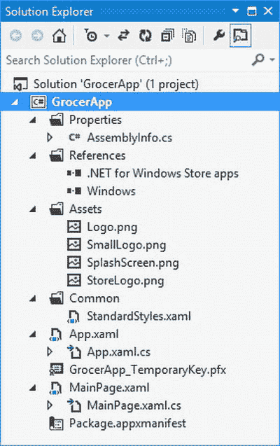
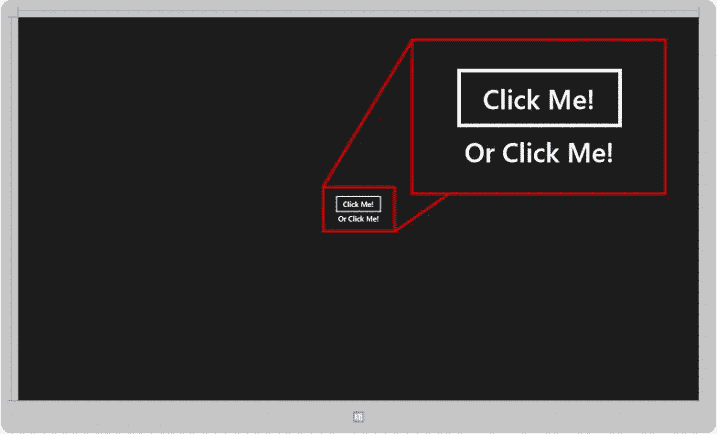
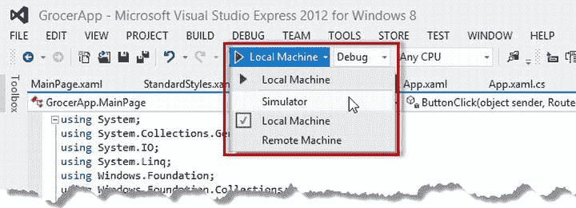
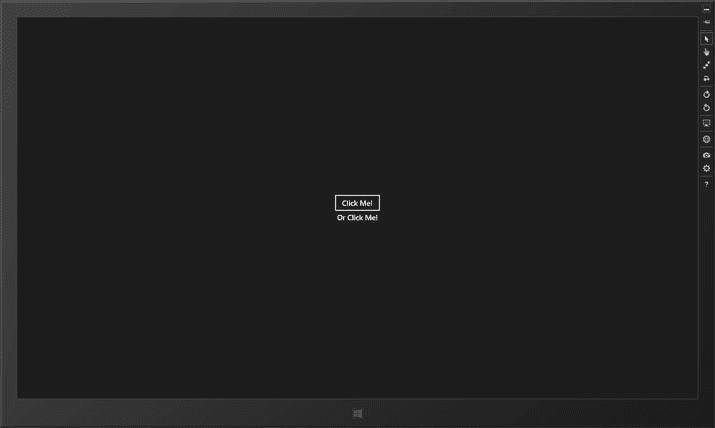
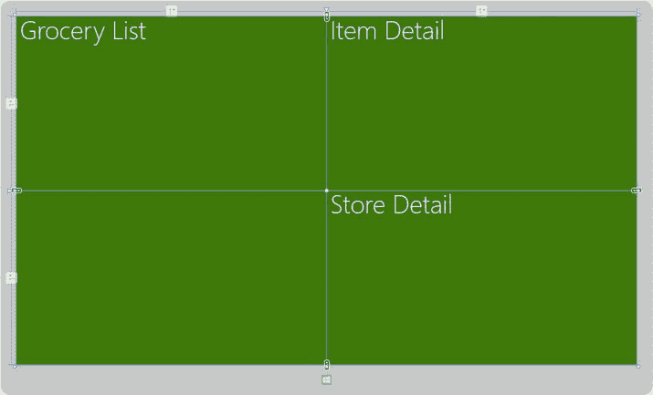
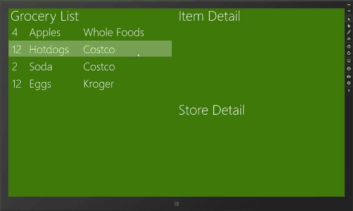
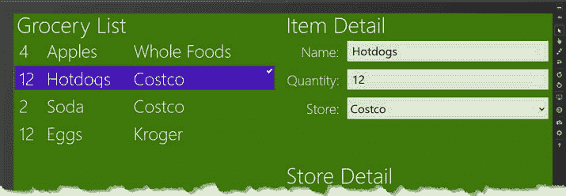

# 第 2 章：数据、绑定和页面

数据是任何 `Windows` 应用的核心，在本章中，我将向您展示如何定义视图模型以及如何使用数据绑定将数据引入您的应用布局。这些技术对于构建易于扩展、易于测试和易于维护的应用至关重要。在此过程中，我将向您展示如何使用页面将您的应用分解成可管理的 `XAML` 和 `C#` 代码块。

### 第 3 章：应用栏、浮出控件和导航栏

某些用户界面控件是所有 `Windows` 应用共有的，无论使用哪种语言创建它们。在本章中，我将向您展示如何创建和配置 `AppBars`（应用栏）、`Flyouts`（浮出控件）和 `NavBars`（导航栏），它们是这些通用控件中最重要的；它们共同构成了与用户交互的骨干。

### 第 4 章：布局和磁贴

`Windows` 应用的功能延伸到了 `Windows 8` 开始屏幕，它提供了多种方式向用户呈现附加信息。在本章中，我将向您展示如何创建和更新动态开始磁贴，以及如何为这些磁贴应用*徽章*。

我还将向您展示如何处理*贴靠*和*填充*布局，这些布局允许 `Windows 8` 用户并排使用两个 `Windows` 应用。您可以使用纯 `C#` 代码或代码与 `XAML` 混合的方式来适应这些布局。我将向您展示这两种方法。

### 第 5 章：应用生命周期和协定

`Windows` 对应用应用了一个非常特定的生命周期模型。在本章中，我将解释该模型的工作原理，向您展示如何接收和响应大多数生命周期事件，并解释如何管理*挂起*和*运行中*应用之间的转换。我将演示如何创建和管理异步任务，以及当您的应用被挂起时如何控制它们。最后，我将向您展示如何支持协定，这允许您的应用无缝集成到更广泛的 `Windows 8` 体验中。

## 关于示例 Windows 应用的更多信息

本书的示例应用是一个简单的购物清单管理器，名为 `GrocerApp`。作为一个独立的应用，`GrocerApp` 相当乏味，但它是演示最重要应用功能的绝佳平台。在图 1-1 中，您可以看到本书结束时应用的外观。



图 1-1。 示例应用

这是一本关于编程而非设计的书。`GrocerApp` 不是一个漂亮的应用程序，我甚至没有实现它的所有功能。它纯粹是一个演示编码技术的工具。

## 本书代码多吗？

是的。事实上，代码非常多，如果不做删减，我无法将它们全部放入书中。因此，当我介绍一个新主题或进行大量更改时，我会向您展示一个完整的 `C#` 或 `XAML` 文件。当我进行小的更改或想强调几行关键代码或标记时，我会向您展示一个代码片段并突出显示重要的更改。您可以在代码清单 1-1 中看到它的样子，该代码摘自第 5 章。

***代码清单 1-1.***  一个代码片段

```
...
protected override void OnNavigatedTo(NavigationEventArgs e) {
    viewModel = (ViewModel)e.Parameter;

    ItemDetailFrame.Navigate(typeof(NoItemSelected));
    viewModel.PropertyChanged += (sender, args) => {
        if (args.PropertyName == "SelectedItemIndex") {
            groceryList.SelectedIndex = viewModel.SelectedItemIndex;
            if (viewModel.SelectedItemIndex == −1) {
                ItemDetailFrame.Navigate(typeof(NoItemSelected));
                AppBarDoneButton.IsEnabled = false;
            } else {
                ItemDetailFrame.Navigate(typeof(ItemDetail), viewModel);
                AppBarDoneButton.IsEnabled = true;
            }
        }
    };
}
...
```

这些片段让我能够将更多代码塞进这本薄薄的书里，但它们使得在 `Visual Studio` 中跟随示例变得更加困难。如果您确实想跟随示例，最好的方法是从 `Apress.com` 下载本书的源代码。这些代码是免费提供的，并且包含本书每一章的完整 `Visual Studio` 项目。

## 启动与运行

在本节中，我将为示例应用创建项目，并向您展示 `Visual Studio` 生成的每个项目元素。我将逐步分解此过程，以便您可以跟着操作。如果您愿意，也可以从 `Apress.com` 下载现成的项目。

### 创建项目

要创建示例项目，请启动 `Visual Studio` 并选择 `文件`  `新建项目`。在`新建项目`对话框中，从屏幕左侧的`模板`部分选择 `Visual C#`，然后从可用的项目模板中选择`空白应用`，如图 1-2 所示。



图 1-2。 创建示例项目


好的，作为高级文档工程师和翻译员，我将严格遵循您提供的注意事项和示例格式，完成以下翻译任务。


将项目名称设置为 `GrocerApp`，然后点击“确定”按钮创建项目。Visual Studio 将会创建项目并用一些初始文件填充它。

 **提示** Visual Studio 为 C# Windows 应用提供了一些基本模板。我不喜欢这些模板，我认为它们在 XAML 和 C# 代码之间取得了一种奇怪的平衡。因此，我将使用“空白应用”模板，该模板创建的项目只包含应用开发所需的最基本元素。

图 1-3 展示了 Visual Studio 解决方案资源管理器中显示的新项目内容。在接下来的章节中，我将描述项目中最重要的文件。



图 1-3. 使用“空白应用”模板创建的 Visual Studio 项目的内容

 **提示** 如果这些文件的用途或内容不立即显而易见，请不要担心。在我构建示例应用的过程中，我会解释您需要了解的一切。在这个阶段，我只想让您感受一下 Visual Studio 应用项目是如何组合在一起的，以及哪些是重要的文件。

Windows 应用使用的是 .NET Framework 库的精简版。您可以通过双击解决方案资源管理器 `引用` 部分的 `.Net for Windows Store apps` 条目来查看哪些命名空间可用。

## 探索 App.xaml 文件

`App.xaml` 文件及其代码隐藏文件 `App.xaml.cs` 用于启动 Windows 应用。XAML 文件的主要用途是将 `Common` 文件夹中的 `StandardStyles.xaml` 与应用关联起来，如清单 1-2 所示。

***清单 1-2.*** App.xaml 文件

```xml
<Application
    x:Class="GrocerApp.App"
    xmlns="http://schemas.microsoft.com/winfx/2006/xaml/presentation"
    xmlns:x=" http://schemas.microsoft.com/winfx/2006/xaml"
    xmlns:local="using:GrocerApp">

<Application.Resources>
        <ResourceDictionary>
            <ResourceDictionary.MergedDictionaries>

<!--
                    Styles that define common aspects of the platform look
                        and feel
                    Required by Visual Studio project and item templates
                 -->
                <ResourceDictionary Source="Common/StandardStyles.xaml"/>
            </ResourceDictionary.MergedDictionaries>

</ResourceDictionary>
    </Application.Resources>
</Application>
```

我稍后会讨论 `StandardStyles.xaml` 文件，在本章后面，我将更新 `App.xaml` 以引用我自己的资源字典。代码隐藏文件更有趣，如清单 1-3 所示。（为简洁起见，我删除了 Visual Studio 添加到该文件中的一些注释。）

***清单 1-3.*** App.xaml.cs 文件

```csharp
using System;
using System.Collections.Generic;
using System.IO;
using System.Linq;
using Windows.ApplicationModel;
using Windows.ApplicationModel.Activation;
using Windows.Foundation;
using Windows.Foundation.Collections;
using Windows.UI.Xaml;
using Windows.UI.Xaml.Controls;
using Windows.UI.Xaml.Controls.Primitives;
using Windows.UI.Xaml.Data;
using Windows.UI.Xaml.Input;
using Windows.UI.Xaml.Media;
using Windows.UI.Xaml.Navigation;

namespace GrocerApp {

sealed partial class App : Application {

public App() {
            this.InitializeComponent();
            this.Suspending += OnSuspending;
        }

protected override void OnLaunched(LaunchActivatedEventArgs args) {
            Frame rootFrame = Window.Current.Content as Frame;

if (rootFrame == null) {
                // Create a Frame to act as the navigation context
                // and navigate to the first page
                rootFrame = new Frame();
                if (args.PreviousExecutionState ==
                    ApplicationExecutionState.Terminated)
{
                    //TODO: Load state from previously suspended application
                }

// Place the frame in the current Window
                Window.Current.Content = rootFrame;
            }

if (rootFrame.Content == null) {

if (!rootFrame.Navigate(typeof(MainPage), args.Arguments)) {
                    throw new Exception("Failed to create initial page");
                }
            }
            // Ensure the current window is active
            Window.Current.Activate();
        }

private void OnSuspending(object sender, SuspendingEventArgs e) {
            var deferral = e.SuspendingOperation.GetDeferral();
            //TODO: Save application state and stop any background activity
            deferral.Complete();
        }
    }
}
```

Windows 应用有一个非常特定的生命周期模型，该模型通过 `App.xaml.cs` 文件表达。理解并掌握这个模型至关重要，我将在第 5 章中解释。目前，您只需要知道 `OnLaunched` 方法在应用启动时被调用，并且会加载 `MainPage` 类的新实例作为应用的主界面。

 **提示** 为简洁起见，我已从这些文件中删除了大部分注释，并移除了该类中代码未使用的命名空间引用。

## 探索 MainPage.xaml 文件

页面是 Windows 应用的基本构建块。当您使用“空白应用”模板创建项目时，Visual Studio 会创建一个空白页面，并将其命名为 `MainPage.xaml`。清单 1-4 显示了 `MainPage.xaml` 文件的内容，其中只包含足够显示……嗯，一个空白页面的 XAML。

***清单 1-4.*** MainPage.xaml 文件的内容

```xml
<Page
    x:Class="GrocerApp.MainPage"
    xmlns=" http://schemas.microsoft.com/winfx/2006/xaml/presentation  "
    xmlns:x=" http://schemas.microsoft.com/winfx/2006/xaml  "
    xmlns:local="using:GrocerApp"
    xmlns:d=" http://schemas.microsoft.com/expression/blend/2008  "
    xmlns:mc=" http://schemas.openxmlformats.org/markup-compatibility/2006  "
    mc:Ignorable="d">

<Grid Background="{StaticResource ApplicationPageBackgroundThemeBrush}">

</Grid>
</Page>
```

如果您以前使用过 XAML，您会认出 `Grid` 控件。Windows 应用 UI 控件的工作方式通常与 WPF 或 Silverlight 中的相同，但数量较少，并且某些高级布局和数据绑定功能不可用。我将在第 2 章开始构建示例项目时创建一个更有用的 `Page` 布局。如果您有 XAML 经验，`MainPage.xaml` 的代码隐藏文件也会看起来很熟悉，如清单 1-5 所示。

 **提示** 暂时不要担心 XAML 和代码隐藏文件；我将在本章后面提供一个快速概述。

***清单 1-5.*** MainPage.xaml.cs 文件的内容

```csharp
using System;
using System.Collections.Generic;
using System.IO;
using System.Linq;
using Windows.Foundation;
using Windows.Foundation.Collections;
using Windows.UI.Xaml;
using Windows.UI.Xaml.Controls;
using Windows.UI.Xaml.Controls.Primitives;
using Windows.UI.Xaml.Data;
using Windows.UI.Xaml.Input;
using Windows.UI.Xaml.Media;
using Windows.UI.Xaml.Navigation;

namespace GrocerApp {
    public sealed partial class MainPage : Page {
        public MainPage() {
            this.InitializeComponent();
        }

protected override void OnNavigatedTo(NavigationEventArgs e) {
        }
    }
}
```


## 探索 `StandardStyles.xaml` 文件

`Common` 文件夹包含 Visual Studio 项目模板使用的文件。当使用空白应用模板时，该文件夹中唯一的文件是 `StandardStyles.xaml`，即 `App.xaml` 文件中引用的资源字典文件（如代码清单 1-2 所示）。`StandardStyles.xaml` 文件包含一些样式和模板，可帮助您更轻松地创建外观与更广泛的 Windows 应用外观和感觉保持一致的应用。我不会列出完整的文件，因为它包含大量内容，但代码清单 1-6 显示了一个与文本相关的样式示例。

***代码清单 1-6.*** 来自 `StandardStyles.xaml` 文件的一个样式

```
...
<Style x:Key="HeaderTextStyle" TargetType="TextBlock"
        BasedOn="{StaticResource BaselineTextStyle}">
    <Setter Property="FontSize" Value="56"/>
    <Setter Property="FontWeight" Value="Light"/>
    <Setter Property="LineHeight" Value="40"/>
    <Setter Property="RenderTransform">
        <Setter.Value>
            <TranslateTransform X="-2" Y="8"/>
        </Setter.Value>
    </Setter>
</Style>
...
```

 **警告**：不要编辑 `Common` 文件夹中的文件。我将在第 2 章中向您展示如何创建和引用自定义资源字典。

## 探索 `Package.appxmanifest` 文件

最后一个值得一提的文件是*清单*，名为 `Package.appxmanifest`。这是一个 XML 文件，用于向 Windows 提供有关您的应用的信息。您可以将其作为原始 XML 文件进行编辑，但 Visual Studio 提供了一个更好的基于属性的编辑器。我将在后面的章节中再次回到这个文件，以配置一些应用设置。

## 极简 XAML 概述

如果您以前从未使用过 XAML，请不要担心。创建 Windows 应用的学习曲线会稍陡一些，但您也有优势，即不会期待其他 XAML 应用程序类型中那些在 Windows 应用开发中不存在的功能。

其核心在于，XAML 以声明方式创建用户界面，而不是通过代码。因此，如果我想要向项目添加几个按钮控件，我会在 XAML 文件中添加一些标记，如代码清单 1-7 所示。

***代码清单 1-7.*** 向 XAML 文档添加控件

```
<Page
    x:Class="GrocerApp.MainPage"
    xmlns=" http://schemas.microsoft.com/winfx/2006/xaml/presentation  "
    xmlns:x=" http://schemas.microsoft.com/winfx/2006/xaml "
    xmlns:local="using:GrocerApp"
    xmlns:d=" http://schemas.microsoft.com/expression/blend/2008  "
    xmlns:mc=" http://schemas.openxmlformats.org/markup-compatibility/2006  "
    mc:Ignorable="d">

<Grid Background="{StaticResource ApplicationPageBackgroundThemeBrush}">
        <StackPanel HorizontalAlignment="Center" VerticalAlignment="Center">
            <Button x:Name="FirstButton" HorizontalAlignment="Center"
                    Click="ButtonClick">Click Me!</Button>
            <Button Style="{StaticResource TextButtonStyle}"
                    HorizontalAlignment="Center"
                    Click="ButtonClick">Or Click Me!</Button>
        </StackPanel>
    </Grid>
</Page>
```

XAML 元素中的标记名称指定将添加到布局中的控件。我向项目中添加了一个 `StackPanel` 和两个 `Button` 控件。`StackPanel` 是一个简单的容器，有助于为布局增加结构；它将其子控件沿水平或垂直线（即*堆叠*）定位。`Button` 控件正是您所期望的那样：一个在用户点击时触发事件的按钮。

XML 的层次结构性质被转化为 UI 控件的层次结构。通过将 `Button` 元素放置在 `StackPanel` 内部，我指定了 `StackPanel` 负责 `Button` 元素的布局。

## 使用 Visual Studio 设计图面

您可以在 Windows 应用项目中完全使用 C# 完成所有操作，而完全不使用 XAML。但采用 XAML 有一些令人信服的理由。主要优势在于 Visual Studio 中对 XAML 的设计支持相当不错，并且在大多数情况下，会实时向您展示 XAML 文件更改的效果。如图 1-4 所示，Visual Studio 在其 XAML 设计图面上反映了 `StackPanel` 和 `Button` 元素的添加。这与运行应用并不完全相同，但它是一个大致忠实的表示，并且此功能对于在 C# 中创建的界面是不可用的。（按钮非常小，所以我在图中放大了它们以便于查看）。



图 1-4。Visual Studio 在其设计图面上反映 XAML 文件的内容

尽管 XAML 往往比较冗长，但 Visual Studio 做了大量工作来简化其创建和编辑；它具有一些出色的自动补全功能，可为标记名称、属性和值提供建议。您还可以通过将控件从工具箱直接拖放到设计图面上，并使用“属性”窗口进行配置来设计界面。如果这两种方法都不适合您，还有支持在 Blend for Visual Studio 中为应用创建 XAML 的功能，该工具已作为 Visual Studio 设置的一部分安装在您的机器上。我倾向于直接在代码编辑器中编写 XAML，但话说回来，我是一个顽固的老派程序员，一直不太信任可视化设计工具，尽管近年来它们已经变得相当不错。您可能没那么抗拒变化，应该尝试不同的 UI 开发风格，看看哪种适合您。出于本书的目的，我将直接向您展示对 XAML 的更改。

## 在 XAML 中配置控件

您通过设置相应 XAML 元素的属性来配置 Windows 应用 UI 控件。例如，我希望 `StackPanel` 居中其子控件。为此，我设置了 `HorizontalAlignment` 和 `VerticalAlignment` 属性的值，如下所示：

```
...
<StackPanel HorizontalAlignment="Center" VerticalAlignment="Center" >
...
```

## 应用样式

属性也用于将样式应用于 UI 控件。例如，我应用了微软在 `StandardStyles.xaml` 文件中定义的 `TextButtonStyle`：

```
...
<Button Style="{StaticResource TextButtonStyle}" HorizontalAlignment="Center"
Click="ButtonClick">Or Click Me!</Button>
...
```

在 XAML 中定义和引用样式有不同的方法。我使用了 `StaticResource` 来指定我想要的样式，但也有从各种来源获取样式信息的选项。在本书中，我将保持简单，尽可能坚持基础，重点关注特定于 Windows 应用的功能。

## 指定事件处理程序

要为事件指定处理方法，您只需使用与所需事件对应的元素属性即可，如下所示：

```
...
<Button x:Name="FirstButton" HorizontalAlignment="Center"
    Click="ButtonClick" >Click Me!</Button>
...
```

我已经指定 `click` 事件（在用户点击按钮时触发）将由 `ButtonClick` 方法处理。当您应用事件属性时，Visual Studio 会为您创建一个事件处理方法；我将在下一节向您展示此关系的另一面。

## 在代码中配置控件

XAML 依赖于一些巧妙的编译器技巧和一个称为*分部*类的 C# 功能。XAML 文件中的标记被转换并与代码隐藏文件合并，以创建一个单独的 .NET 类。这乍一看可能有点奇怪，但它确实允许一种良好的混合模型，您可以在 XAML、代码隐藏 C# 类或两者中定义和配置控件。


展示这种关系的最简单方法是向你展示我在 XAML 文件中为 `Button` 元素指定的事件处理程序的实现。

清单 1-8 展示了 `MainPage.xaml.cs` 文件，即 `MainPage.xaml` 的后台代码文件。

**清单 1-8.**  MainPage.xaml.cs 文件

```
using System;
using System.Collections.Generic;
using System.IO;
using System.Linq;
using Windows.Foundation;
using Windows.Foundation.Collections;
using Windows.UI.Xaml;
using Windows.UI.Xaml.Controls;
using Windows.UI.Xaml.Controls.Primitives;
using Windows.UI.Xaml.Data;
using Windows.UI.Xaml.Input;
using Windows.UI.Xaml.Media;
using Windows.UI.Xaml.Navigation;

namespace GrocerApp {
    public sealed partial class MainPage : Page {
        public MainPage() {
            this.InitializeComponent();
        }

protected override void OnNavigatedTo(NavigationEventArgs e) {
        }

private void ButtonClick(object sender, RoutedEventArgs e) {
            System.Diagnostics.Debug.WriteLine("Button Clicked: "
                + ((Button)e.OriginalSource).Content);
        }
    }
}
```

我可以在 XAML 文件中不加任何限定地引用 `ButtonClick` 方法，这是因为由 XAML 文件生成的代码与后台代码文件中的 C# 代码合并，形成了一个单独的类。结果是，当应用程序布局中的某个 `Button` 元素被点击时，我的 C# `ButtonClick` 方法将被调用。

 **提示**   Windows 应用程序没有可用的控制台，因此如果你想输出消息来帮助了解应用程序中发生了什么，请使用静态的 `System.Diagnostcs.Debug.WriteLine` 方法。这些消息会显示在 Visual Studio 的输出窗口中，但前提是你需要从 Visual Studio 调试菜单中选择“启动调试”来启动应用程序。

这种关系是双向的。请注意，XAML 文件中的某些元素具有 `x:Name` 属性，如下所示：

```
...
<Button x:Name="FirstButton" HorizontalAlignment="Center"
    Click="ButtonClick">Click Me!</Button>
...
```

当你为此属性指定一个值时，编译器会创建一个变量，其值是由 XAML 元素创建的 UI 控件。这意味着你可以通过 C# 代码来补充控件的 XAML 配置，或者以编程方式更改元素的配置。清单 1-9 展示了如何在 `MainPage.xaml.cs` 后台代码文件中定义的 `ButtonClick` 方法中，更改名为 `FirstButton` 的按钮的配置。

**清单 1-9.**  在 MainPage.xaml.cs 文件中响应事件时以代码方式配置控件

```
...
private void ButtonClick(object sender, RoutedEventArgs e) {

FirstButton.Content = "Pressed";
    FirstButton.FontSize = 50;

System.Diagnostics.Debug.WriteLine("Button Clicked: "
        + ((Button)e.OriginalSource).Content);
}
...
```

我不需要以任何方式限定控件名称。在这个示例中，我更改了按钮的内容和字体大小。由于这些新语句位于 `Click` 事件处理函数中，点击任一按钮都会导致 `FirstButton` 的配置发生变化。这就是目前你需要了解的关于 XAML 的全部内容。总结如下：

-   XAML 被转换为代码，并与后台代码文件的内容合并，形成一个单独的 .NET 类。
-   你可以在 XAML 中或在代码中配置 UI 控件。
-   使用 XAML 可以让你利用 Visual Studio 的设计工具，这些工具非常出色。

一开始，XAML 可能会让你觉得冗长且难以阅读，但你很快就会习惯它。我发现使用 XAML 比单纯使用 C# 代码要容易得多，尽管我承认，在决定如此之前，我也花了相当长的时间来学习 XAML。

## 运行和调试 Windows 应用程序

现在，我们已经有了一个非常简单的 Windows 应用程序，是时候专注于如何运行和调试它了。Visual Studio 提供了三种运行应用程序的方式：在本地计算机上、在模拟器上或在远程计算机上。

本地计算机的问题是，开发 PC 的配置很少与用户设备相同。除非你的应用程序针对的是拥有类似规格平台的用户，否则在本地计算机上进行测试并不能让你对应用程序的表现有一个代表性的了解。

在远程计算机上进行测试是最好的方法，但前提是你有一系列具有不同能力的机器来进行测试。我有一台便宜的 Dell Duo 笔记本电脑，它带有触摸屏和一些硬件传感器，对测试很有用，但建立一个稳定的、合适的测试机器集群很快就会变得昂贵。

最佳的折衷方案是 Visual Studio 模拟器，它能真实地呈现 Windows 应用程序的体验，并允许你更改所模拟设备的能力（包括更改屏幕尺寸）、模拟触摸事件以及生成合成的地理位置数据。

要选择模拟器，请找到 Visual Studio 工具栏上当前显示“本地计算机”的按钮，然后单击其右侧的小向下箭头。从弹出菜单中选择“模拟器”，如图 1-5 所示。



图 1-5.  选择 Visual Studio 模拟器来测试应用程序

### 在模拟器中运行 Windows 应用程序

要启动示例应用程序，请单击工具栏按钮（此时将显示“模拟器”），或从调试菜单中选择“启动调试”。Visual Studio 将启动模拟器，并生成和部署应用程序，如图 1-6 所示。



图 1-6.  使用 Visual Studio 模拟器

你可以使用模拟器右侧的按钮来更改屏幕尺寸和方向、在鼠标和触摸输入之间切换，以及合成地理位置数据。目前查看的内容不多，因为示例应用程序非常简单。

点击应用程序布局上的任意一个按钮，以触发事件处理程序方法并更改按钮的配置。图 1-7 显示了结果。


图 1-7.  在示例应用程序中点击任一按钮的结果

你还会在输出窗口中看到一条消息，类似于下面这样：

| `Button Clicked: Pressed` |

默认情况下，输出窗口可能不会显示。你可以通过在 Visual Studio 中选择“调试”  “窗口”菜单中的“输出”项来打开它。

由于应用程序正在调试器中运行，任何异常都会导致调试器中断，从而允许你像常规 C# 项目一样单步执行代码。你可以通过在源代码中设置断点来强制调试器中断；除了使用模拟器之外，运行和调试 Windows 应用程序都使用标准的 Visual Studio 功能。

## 总结

在本章中，我概述了本书，并介绍了使用 XAML 和 C# 编写的 Windows 应用程序的基础知识。我提供了一个关于 XAML 非常基础的概述，并向你展示了如何应用它来创建一个简单的示例应用程序。在下一章中，我将开始构建应用程序，以添加主要的结构组件，从视图模型开始。

## 第 2 章


## 数据、绑定和页面

在本章中，我将向你展示如何定义和使用构成 Windows 应用程序核心的数据。为此，我将大致遵循*视图模型*模式，该模式允许我清晰地将数据与负责显示这些数据和处理用户交互的应用程序部分分离开来。


### 添加 View Model

你可能已经从模型-视图-控制器（MVC）和模型-视图-视图控制器（MVVC）等设计模式中熟悉了`view model`。我不打算在这本书中详细讨论这些模式的细节。关于 MVC 和 MVVC 有很多好的资料，可以从维基百科开始，那里有一些平衡且深刻的描述。

我发现使用`view model`的好处是巨大的，对于除了最简单的应用项目之外的所有项目，都非常值得考虑，并且我强烈建议你认真考虑遵循同样的路径。我不是一个模式狂热者，我坚信应该采纳那些能解决实际问题的模式和技术部分，并使其适应特定的项目。为此，你会发现我对`view model`应该如何使用的看法是开放的。

本章重点介绍应用中的幕后管道，创建一个基础，我可以在其上构建来演示不同的特性。我循序渐进地开始，定义一个简单的`view model`，并演示不同的技术，通过数据绑定将数据从`view model`带入应用显示。然后，我将向你展示如何将应用分解为多个页面，并将这些页面引入主布局，更改所使用的页面以反映应用的状态。表 2-1 提供了本章的总结。

表 2-1. 章节总结

| 问题 | 解决方案 | 列表 |
| --- | --- | --- |
| 创建一个可观察类。 | 实现`INotifyPropertyChanged`接口。 | 1 |
| 创建一个可观察集合。 | 使用`ObservableCollection`类。 | 2 |
| 更改应用启动时加载的页面。 | 更改`App.xaml.cs`中`OnLaunched`方法指定的类型。 | 3 |
| 设置数据绑定值的源。 | 使用`DataContext`属性。 | 4 |
| 创建可重用的样式和模板。 | 创建一个资源字典。 | 5, 6 |
| 将 UI 控件绑定到 view model。 | 使用`Binding`关键字。 | 7 |
| 向应用布局添加另一个页面。 | 向主布局添加一个`Frame`，并使用`Navigate`方法指定要显示的页面。 | 8–10 |
| 动态地将页面插入应用布局。 | 使用`Frame.Navigate`方法，可以选择将上下文对象传递给嵌入的页面。 | 11–14 |

### 添加 View Model

一个好的 Windows 应用的核心是*view model*，使用它可以使应用数据与呈现给用户的方式保持分离。`View model`是创建易于随时间增强和维护的应用的基本基础。将特定 UI 控件中包含的数据视为权威数据可能很诱人，但很快你就会达到无法管理数据位置和更新方式的地步。

首先，我在 Visual Studio 项目中创建了一个名为`Data`的新文件夹，并创建了两个新的类文件。第一个定义了`GroceryItem`类，它表示购物清单上的单个项目。你可以在列表 2-1 中看到`GroceryItem.cs`的内容。

***列表 2-1.** `GroceryItem`类*

```
using System.ComponentModel;

namespace GrocerApp.Data {

public class GroceryItem : INotifyPropertyChanged {
        private string name, store;
        private int quantity;

public string Name {
            get { return name; }
            set { name = value; NotifyPropertyChanged("Name"); }
        }

public int Quantity {
            get { return quantity; }
            set { quantity = value; NotifyPropertyChanged("Quantity"); }
        }

public string Store {
            get { return store; }
            set { store = value; NotifyPropertyChanged("Store"); }
        }

public event PropertyChangedEventHandler PropertyChanged;
        private void NotifyPropertyChanged(string propName) {
            if (PropertyChanged != null) {
                PropertyChanged(this, new PropertyChangedEventArgs(propName));
            }
        }
    }
}
```

这个类定义了要购买物品的名称、数量以及应从哪个商店购买的属性。这个类唯一值得注意的方面是它是*可观察的*。Windows 应用 UI 控件的一个不错特性是它们支持数据绑定，这意味着当它们正在显示的可观察数据发生更改时，它们会自动更新。

你实现`System.ComponentModel.INotifyPropertyChanged`接口以使类可观察，并在任何可观察属性被修改时触发由接口指定的`PropertyChangedEventHandler`。

我在`Data`命名空间中添加的另一个类是`ViewModel`，它包含在`ViewModel.cs`中。这个类包含用户数据和应用状态，你可以在列表 2-2 中看到该类的定义。

***列表 2-2.** `ViewModel`类*

```
using System.Collections.Generic;
using System.Collections.ObjectModel;
using System.ComponentModel;

namespace GrocerApp.Data {

public class ViewModel : INotifyPropertyChanged {
        private ObservableCollection <GroceryItem> groceryList;
        private List <string> storeList;
        private int selectedItemIndex;
        private string homeZipCode;

public ViewModel() {
            groceryList = new ObservableCollection <GroceryItem> ();
            storeList = new List <string> ();
            selectedItemIndex = -1;
            homeZipCode = "NY 10118";
        }

public string HomeZipCode {
            get { return homeZipCode; }
            set { homeZipCode = value; NotifyPropertyChanged("HomeZipCode"); }
        }

public int SelectedItemIndex {
            get { return selectedItemIndex; }
            set {
                selectedItemIndex = value;                 NotifyPropertyChanged("SelectedItemIndex");
            }
        }

public ObservableCollection <GroceryItem> GroceryList {
            get {
                return groceryList;
            }
        }

public List <string> StoreList {
            get {
                return storeList;
            }
        }

public event PropertyChangedEventHandler PropertyChanged;
        private void NotifyPropertyChanged(string propName) {
            if (PropertyChanged != null) {
                PropertyChanged(this, new PropertyChangedEventArgs(propName));
            }
        }
    }
}
```

这个简单`view model`最重要的部分是代表购物清单的`GroceryItem`对象集合。我希望该列表是可观察的，这样对列表的更改会自动更新到应用 UI 中。为此，我使用了来自`System.Collections.ObjectModel`命名空间的`ObservableCollection`。这个类实现了集合的基本功能，并在列表项被添加、移除或替换时发出事件。`ObservableCollection`类在其包含的某个对象的数据值被修改时不会发出事件，但是通过创建可观察的`GroceryList`对象的可观察集合，我确保对购物清单的*任何*更改都会导致 UI 中的更新。

`ViewModel`类也实现了`INotifyPropertyChanged`，因为 view model 中有两个可观察属性。第一个是`HomeZipCode`，它是用户数据，我将在第 3 章演示如何创建*flyouts*时使用它。第二个可观察属性`SelectedItemIndex`是应用状态的一部分，用于跟踪用户选择了购物清单中的哪个项目（如果有的话）。


这是一个非常简单的视图模型，正如我所提到的，我在项目中构建视图模型时采取了灵活的方式。尽管如此，它包含了演示如何使用数据绑定自动更新应用程序 UI 控件所需的所有要素。

### 添加主布局

现在我已经定义了视图模型，就可以开始构建 UI 了。第一步是添加应用程序的主页面。我理解为什么 Visual Studio 会生成一个名为`MainPage`的页面，但我想向你展示我通常如何构建项目，因此我将向项目添加一个新页面。

 **提示** 我不会再使用`MainPage.xaml`，你可以将其从项目中删除。

我喜欢使用大量的项目结构，因此我向项目添加了一个名为`Pages`的新文件夹。我通过右键单击`Pages`文件夹，从弹出菜单中选择添加新项，并选择空白页面模板，添加了一个名为`ListPage.xaml`的新空白页面。Visual Studio 会创建 XAML 文件和代码后置文件`ListPage.xaml.cs`。

 **提示** 如果你是使用 XAML 构建应用程序的新手，那么重要的是要理解，你通常不会按照我描述示例应用程序的顺序来工作。相反，XAML 方法支持一种更迭代的风格，你可以在其中使用 XAML 声明一些控件，添加一些代码来支持它们，并可能定义一些样式来减少标记中的重复。这比我在这里展示的要自然得多，但在书中很难捕捉到基于 XAML 的开发中来回反复的特性。

我希望将`ListPage.xaml`设置为应用程序启动时加载的页面，这需要更新`App.xaml.cs`，如下面的列表 2-3 所示。

***列表 2-3.** 更新`App.xaml.cs`以使用`ListPage`*

```csharp
using System;
using Windows.ApplicationModel;
using Windows.ApplicationModel.Activation;
using Windows.UI.Xaml;
using Windows.UI.Xaml.Controls;

namespace GrocerApp {

    sealed partial class App : Application {

        public App() {
            this.InitializeComponent();
            this.Suspendin += OnSuspending;
        }

        protected override void OnLaunched(LaunchActivatedEventArgs args) {
            Frame rootFrame = Window.Current.Content as Frame;

            if (rootFrame == null) {
                rootFrame = new Frame();

                if (args.PreviousExecutionState == ApplicationExecutionState.Terminated) {
                    //TODO: 从先前挂起的应用程序加载状态
                }

                // 将框架放置在当前窗口中
                Window.Current.Content = rootFrame;
            }

            if (rootFrame.Content == null) {

                if (!rootFrame.Navigate(typeof(Pages.ListPage), args.Arguments)) {
                    throw new Exception("创建初始页面失败");
                }
            }
            // 确保当前窗口处于活动状态
            Window.Current.Activate();
        }

        private void OnSuspending(object sender, SuspendingEventArgs e) {
            var deferral = e.SuspendingOperation.GetDeferral();
            //TODO: 保存应用程序状态并停止任何后台活动
            deferral.Complete();
        }
    }
}
```

暂时不用担心这个类的其余部分。我将在第 5 章中解释如何响应 Windows 应用程序的生命周期时再回到这个话题。

## 编写代码

对我来说，解释如何创建示例应用程序最简单的方式是，以与你在项目中通常创建顺序相反的顺序来呈现内容。为此，我将从`ListPage.xaml.cs`代码后置文件开始。你可以在下面的列表 2-4 中看到此文件的内容，包括我对 Visual Studio 默认内容所做的添加。

***列表 2-4.** `ListPage.xaml.cs`文件*


```csharp
using GrocerApp.Data;
using Windows.UI.Xaml.Controls;
using Windows.UI.Xaml.Navigation;

namespace GrocerApp.Pages {

public sealed partial class ListPage : Page {
        ViewModel viewModel;

public ListPage() {

viewModel=new ViewModel();

viewModel.StoreList.Add("Whole Foods");
            viewModel.StoreList.Add("Kroger");
            viewModel.StoreList.Add("Costco");
            viewModel.StoreList.Add("Walmart");

viewModel.GroceryList.Add(new GroceryItem {
                Name="Apples",
                Quantity=4, Store="Whole Foods"
            });
            viewModel.GroceryList.Add(new GroceryItem {
                Name="Hotdogs",
                Quantity=12, Store="Costco"
            });
            viewModel.GroceryList.Add(new GroceryItem {
                Name="Soda",
                Quantity=2, Store="Costco"
            });
            viewModel.GroceryList.Add(new GroceryItem {
                Name="Eggs",
                Quantity=12, Store="Kroger"
            });

this.InitializeComponent();

this.DataContext=viewModel;
        }

protected override void OnNavigatedTo(NavigationEventArgs e) {
        }

private void ListSelectionChanged(object sender,             SelectionChangedEventArgs e) {
            viewModel.SelectedItemIndex=groceryList.SelectedIndex;
        }
    }
}
```

 **注意**   如果在此时编译应用，将会出现错误，因为我引用了尚未添加的`groceryList`控件。请等到“运行应用”部分；届时所有内容才会就位。

`ListPage`类的构造函数会创建一个新的`ViewModel`对象，并用一些示例数据填充它。该类中最有趣的语句如下：

```
this.DataContext = viewModel;
```

Windows 应用 UI 控件的核心是支持*数据绑定*，通过它我可以将视图模型中的内容显示在 UI 控件中。为此，我必须指定数据的来源。`DataContext`属性指定了 UI 控件及其所有子控件的绑定数据来源。我可以使用`this`关键字为整个布局设置`DataContext`，因为`ListPage`类由代码隐藏文件的内容与 XAML 内容合并而成，这意味着`this`指向包含所有 XAML 声明的控件的`Page`对象。

我做的最后一项添加是定义一个方法，用于处理`ListView`控件的`SelectionChanged`事件。这种控件将用于显示购物清单中的项目。当我定义 XAML 时，我会安排当用户选择其中某一项时调用此方法。该方法根据`ListView`控件的`SelectedIndex`属性，在视图模型中设置`SelectedItemIndex`属性。由于`SelectedItemIndex`属性是可观察的，当用户进行选择时，应用的其他部分可以收到通知。

### 添加资源字典

在第 1 章中，我解释了 Visual Studio 创建的`StandardStyles.xaml`文件定义了一些 Windows 应用中使用的 XAML 样式和模板。像这样定义样式是个好主意，因为这意味着你可以在一个地方应用更改，而不必追踪所有直接对 UI 控件应用颜色或字体设置的地方。我的示例项目需要一些标准样式和模板。为此，我创建了一个名为`Resources`的新文件夹，并使用资源字典项模板创建了一个名为`GrocerResourceDictionary.xaml`的新文件。你可以在清单 2-5 中看到此文件的内容。

 **提示**   正如我在第 1 章中解释的，Microsoft 禁止向`StandardStyles.xaml`添加样式。如果你想创建自定义样式，必须创建自己的资源字典。

***清单 2-5.**  定义资源字典*

```
<ResourceDictionary
    xmlns = "http://schemas.microsoft.com/winfx/2006/xaml/presentation"
    xmlns:x = "http://schemas.microsoft.com/winfx/2006/xaml"
    xmlns:local = "using:GrocerApp.Resources">
    <ResourceDictionary.MergedDictionaries>
        <ResourceDictionary Source = "/Common/StandardStyles.xaml" />
    </ResourceDictionary.MergedDictionaries>

<SolidColorBrush x:Key = "AppBackgroundColor" Color = "#3E790A"/>

<Style x:Key = "GroceryListItem" TargetType = "TextBlock"
           BasedOn = "{StaticResource BasicTextStyle}" >
        <Setter Property = "FontSize" Value = "45"/>
        <Setter Property = "FontWeight" Value = "Light"/>
        <Setter Property = "Margin" Value = "10, 0"/>
        <Setter Property = "VerticalAlignment" Value = "Center"/>
    </Style>

<DataTemplate x:Key = "GroceryListItemTemplate">
        <StackPanel Orientation = "Horizontal">
            <TextBlock Text = "{Binding Quantity}"
                       Style = "{StaticResource GroceryListItem}" Width = "50"/>
            <TextBlock Text = "{Binding Name}"
                       Style = "{StaticResource GroceryListItem}"  Width = "200"/>
            <TextBlock Text = "{Binding Store}"
                       Style = "{StaticResource GroceryListItem}"  Width = "300"/>
        </StackPanel>
    </DataTemplate>
</ResourceDictionary>
```

本书不会深入探讨样式和模板的细节，但我会解释这个文件中的内容，以便为后续的清单提供一些上下文。最简单的声明如下：

```
...
<SolidColorBrush x:Key = "AppBackgroundColor" Color = "#3E790A"/>
...
```

应用默认的配色方案是白底黑字，我想进行更改。更改的第一步是定义一种不同的颜色，这正是此元素所做的，它将一种绿色与键`AppBackgroundColor`关联起来。稍后当我创建 XAML 布局时，你将看到我使用此键来应用该颜色。

下一个声明是关于样式的，它包含多个属性的值：

```
...
<Style x:Key = "GroceryListItem" TargetType = "TextBlock"
    BasedOn = "{StaticResource BasicTextStyle}" >
    <Setter Property = "FontSize" Value = "45"/>
    <Setter Property = "FontWeight" Value = "Light"/>
    <Setter Property = "Margin" Value = "10, 0"/>
    <Setter Property = "VerticalAlignment" Value = "Center"/>
</Style>
...
```

这个名为`GroceryListItem`的样式定义了多个属性的值：`FontSize`、`FontWeight`等。但请注意，在声明样式时，我使用了`BasedOn`属性。这允许我继承另一个样式中定义的所有值。在此例中，我继承了 Microsoft 在`StandardStyles.xaml`文件中定义的`BasicTextStyle`样式。在派生此类新样式之前，我必须先将其他资源字典文件纳入作用域，这通过以下声明实现：

```
<ResourceDictionary.MergedDictionaries>
    <ResourceDictionary Source = " /Common/StandardStyles.xaml " />
</ResourceDictionary.MergedDictionaries>
```

你可以通过这种方式导入任意数量的文件，但导入操作必须在从文件内容派生样式之前进行。

最后一个声明是关于数据模板的，通过它我可以定义一个元素层次结构，该层次结构将用于表示数据源中的每个项。如你所猜，我的数据来源将是视图模型中的杂货项目集合。集合中的每个项都将由一个包含三个`TextBlock`控件的`StackPanel`表示。请注意标记为粗体的两个属性：


```
...
<DataTemplate x:Key = "GroceryListItemTemplate">
    <StackPanel Orientation = "Horizontal">
        <TextBlock Text = "{Binding Quantity}"
            Style = "{StaticResource GroceryListItem}" Width = "50"/>
        <TextBlock Text = "{Binding Name}"
            Style = "{StaticResource GroceryListItem}"  Width = "200"/>
        <TextBlock Text = "{Binding Store}"
            Style = "{StaticResource GroceryListItem}"  Width = "300"/>
    </StackPanel>
</DataTemplate>
...
```

`Text` 属性的值很重要。`Binding` 关键字告知运行时，我希望从控件的 `DataContext` 中获取 `Text` 属性的值。在上一节中，我已将视图模型指定为此数据的来源，而指定 `Quantity` 则告知运行时，我希望使用模板正在显示的对象中的 `Quantity` 属性。通过在代码隐藏文件中设置 `DataContext` 属性，我定义了宏观方向（“使用我的视图模型作为绑定数据的源”），而 `Binding` 关键字则让我指定具体细节（“显示这个特定属性的值”）。稍后，在主 XAML 文件中，我将能够将两者连接起来，使运行时知道应使用视图模型的哪部分来获取各个属性的值。

我标注的另一个属性虽然不太引人注目，但同样有用。对于 `Style` 属性，我指定了一个名为 `GroceryList` 项的 `StaticResource`。`StaticResource` 关键字告知运行时，我正在查找的资源已经定义完毕。我使用了刚才指定的 `GroceryListItem` 样式。这样做的好处是，我可以在一处更改三个 `TextBlock` 控件的外观，并且可以轻松地为那些希望具有相似外观的控件派生新的样式。最后一步是将自定义资源字典添加到 `App.xaml` 中，使其在应用中可用，具体操作如清单 2-6 所示。

**清单 2-6.** 将自定义资源字典添加到 `App.xaml` 文件

```
<Application
    x:Class = "GrocerApp.App"
    xmlns = " http://schemas.microsoft.com/winfx/2006/xaml/presentation "
    xmlns:x = " http://schemas.microsoft.com/winfx/2006/xaml "
    xmlns:local = "using:GrocerApp">
    <Application.Resources>
        <ResourceDictionary>
            <ResourceDictionary.MergedDictionaries>
               <!--
                    定义平台外观和感受通用方面的样式
                    Visual Studio 项目和项模板所需
                -->
                <ResourceDictionary Source = "Common/StandardStyles.xaml"/>
                <ResourceDictionary Source = "Resources/GrocerResourceDictionary.xaml"/>
            </ResourceDictionary.MergedDictionaries>
        </ResourceDictionary>
    </Application.Resources>
</Application>
```

## 编写 XAML

现在，代码隐藏文件和资源字典都已就位，我可以转向 XAML 来声明构成应用布局的控件。清单 2-7 显示了 `ListPage.xaml` 文件的内容。

**清单 2-7.** `ListPage.xaml` 文件

```
<Page
    x:Class = "GrocerApp.Pages.ListPage"
    xmlns = "http://schemas.microsoft.com/winfx/2006/xaml/presentation"
    xmlns:x = "http://schemas.microsoft.com/winfx/2006/xaml"
    xmlns:local = "using:GrocerApp.Pages"
    xmlns:d = "http://schemas.microsoft.com/expression/blend/2008"
    xmlns:mc = "http://schemas.openxmlformats.org/markup-compatibility/2006"
    mc:Ignorable = "d">
    <Grid Background = "{StaticResourceAppBackgroundColor}">
        <Grid.RowDefinitions>
            <RowDefinition/>
            <RowDefinition/>
        </Grid.RowDefinitions>
        <Grid.ColumnDefinitions>
            <ColumnDefinition/>
            <ColumnDefinition/>
        </Grid.ColumnDefinitions>
        <StackPanel Grid.RowSpan = "2">
            <TextBlock Style = "{StaticResource HeaderTextStyle}" Margin = "10"
                       Text = "购物清单"/>
            <ListView x:Name = "groceryList" Grid.RowSpan = "2"
                ItemsSource = "{Binding GroceryList}"
                ItemTemplate = "{StaticResource GroceryListItemTemplate}"
                SelectionChanged = "ListSelectionChanged" />
        </StackPanel>
        <StackPanel Orientation = "Vertical" Grid.Column = "1">
            <TextBlock Style = "{StaticResource HeaderTextStyle}" Margin = "10"
                       Text = "商品详情"/>
        </StackPanel>
        <StackPanel Orientation = "Vertical" Grid.Column = "1" Grid.Row = "1">
            <TextBlock Style = "{StaticResource HeaderTextStyle}" Margin = "10"
                       Text = "店铺详情"/>
        </StackPanel>
    </Grid>
</Page>
```

可以看到，我将 `Grid` 控件的 `Background` 属性设置为了资源字典中指定的颜色。此外，我还配置了 Visual Studio 定义的 `Grid` 控件，并使用 `Grid.RowDefinitions` 和 `Grid.ColumnDefinitions` 元素将其划分为两个等宽的列，每列各有两行等高。

对于布局的左侧，我添加了一个 `StackPanel`，并将其配置为跨两行并填充布局的左半部分：

```
...
<StackPanel Grid.RowSpan = "2" >
...
```

此 `StackPanel` 包含一个用于显示标题的 `TextBlock`，以及一个稍后我将详细说明的 `ListView`。对于屏幕的右侧，我添加了两个 `StackPanel`，每行一个。我通过 `Grid.Row` 和 `Grid.Column` 属性指定了每个控件所属的行和列。这些属性使用从零开始的索引，而未设置这些属性的控件则默认放在第一行第一列。在图 2-1 中，你可以看到该布局在 Visual Studio 设计图面上的显示效果。



**图 2-1.** 显示在 Visual Studio 设计图面上的 XAML 布局静态部分

设计图面无法显示动态生成的内容，这就是图中看不到视图模型数据的原因。动态内容将在 `ListView` 控件中显示。顾名思义，`ListView` 以列表形式显示一组项。有三个 XAML 属性规定了具体实现方式：

```
...
<ListView x:Name = "groceryList" Grid.RowSpan = "2"
    ItemsSource = "{Binding GroceryList}"
    ItemTemplate = "{StaticResource GroceryListItemTemplate}"
    SelectionChanged = "ListSelectionChanged"/>
...
```

我使用这些属性来弥合宏观层面的 `DataContext` 属性与模板中微观层面的属性之间的差距。`ItemSource` 属性告知 `ListView` 控件应从何处获取其必须显示的项集。值为 `GroceryList` 的 `Binding` 关键字告知 `ListView`，它应显示我在代码隐藏文件中设置的 `DataContext` 对象的 `GroceryList` 属性的内容。


`ItemTemplate`属性告诉`ListView`如何显示`ItemSource`中的每个项目。关键字`StaticResource`和值`GroceryListItemTemplate`意味着将使用我在资源字典中指定的数据模板，这会为`ViewModel.GroceryList`集合中的每个项目生成一个包含三个`TextBlock`元素的新`StackPanel`。

最后一个属性与我在代码隐藏文件中定义的事件处理方法相关联，该方法处理`ListView`控件发出的`SelectionChanged`事件。

 **提示** 你可以通过 Visual Studio 属性窗口或查阅 Microsoft API 文档来获取控件定义的事件列表。创建具有正确参数的处理方法的最简单方法是让 XAML 编辑器在自动完成过程中为你创建它们。

## 运行应用程序

Visual Studio 设计图面只能显示布局中静态的部分。查看动态内容的唯一方法是运行应用程序。因此，要想看到 XAML 和 C#如何协同工作，请从 Visual Studio 的调试菜单中选择“开始调试”。Visual Studio 将生成项目并将应用程序推送到模拟器。你可以在图 2-2 中看到结果。



图 2-2. 在模拟器中运行示例应用程序

你可以看到数据绑定如何将视图模型中的项目添加到`ListView`控件，以及我如何在资源字典中定义的模板被用来格式化它们。

Windows 应用 UI 控件有很多内置行为。例如，当鼠标移动到项目上时，项目会以较浅的阴影显示（你可以在图 2-2 中看到），当用户单击选择项目时，则会以不同的阴影显示。控件使用的所有样式都可以更改，但为简单起见，我将坚持使用默认设置。

## 将其他页面插入布局

你不必将所有控件和代码放在一个 XAML 文件及其代码隐藏文件中。为了使项目更易于管理，你可以创建多个页面并将它们整合到你的应用程序中。作为简单的演示，我在`Pages`项目文件夹中创建了一个名为`NoItemSelected.xaml`的新`Blank Page`。清单 2-8 显示了此文件的内容，我对默认内容的添加部分以粗体显示。

 **提示** 在 Visual Studio 允许你向项目添加新项之前，你必须先停止调试器。

***清单 2-8.** `NoItemSelected.xaml`文件*

```
<Page
    x:Class = "GrocerApp.Pages.NoItemSelected"
    xmlns = "http://schemas.microsoft.com/winfx/2006/xaml/presentation"
    xmlns:x = "http://schemas.microsoft.com/winfx/2006/xaml"
    xmlns:local = "using:GrocerApp.Pages"
    xmlns:d = "http://schemas.microsoft.com/expression/blend/2008"
    xmlns:mc = "http://schemas.openxmlformats.org/markup-compatibility/2006"
    mc:Ignorable = "d">
    <Grid Background = "{StaticResourceAppBackgroundColor}">
        <TextBlock Style = "{StaticResource HeaderTextStyle}"
                   FontSize = "30" Text = "No Item Selected"/>
    </Grid>
</Page>
```

这是一个非常简单的页面，简单到你通常不需要创建这样的页面，因为它只显示一些静态文本。但它有助于演示一个重要的应用程序功能，使我能够将应用程序分解为可管理的部分。将页面添加到我的主应用程序布局的关键是`Frame`控件，我已将其添加到`ListPage.xaml`布局中，如清单 2-9 所示。

***清单 2-9.** 向应用程序布局添加`Frame`控件*

```
<Page
    x:Class = "GrocerApp.Pages.ListPage"
    xmlns = "http://schemas.microsoft.com/winfx/2006/xaml/presentation"
    xmlns:x = "http://schemas.microsoft.com/winfx/2006/xaml"
    xmlns:local = "using:GrocerApp.Pages"
    xmlns:d = "http://schemas.microsoft.com/expression/blend/2008"
    xmlns:mc = "http://schemas.openxmlformats.org/markup-compatibility/2006"
    mc:Ignorable = "d">
    <Grid Background = "{StaticResource AppBackgroundColor}">
        <Grid.RowDefinitions>
            <RowDefinition/>
            <RowDefinition/>
        </Grid.RowDefinitions>
        <Grid.ColumnDefinitions>
            <ColumnDefinition/>
            <ColumnDefinition/>
        </Grid.ColumnDefinitions>
        <StackPanel Grid.RowSpan = "2">
            <TextBlock Style = "{StaticResource HeaderTextStyle}" Margin = "10"
                       Text = "Grocery List"/>
            <ListView x:Name = "groceryList" Grid.RowSpan = "2"
                ItemsSource = "{Binding GroceryList}"
                ItemTemplate = "{StaticResource GroceryListItemTemplate}"
                SelectionChanged = "ListSelectionChanged" />
        </StackPanel>
        <StackPanel Orientation = "Vertical" Grid.Column = "1">
            <TextBlock Style = "{StaticResource HeaderTextStyle}" Margin = "10"
                       Text = "Item Detail"/>
            <Frame x:Name = "ItemDetailFrame"/>
        </StackPanel>
        <StackPanel Orientation = "Vertical" Grid.Column = "1" Grid.Row = "1">
            <TextBlock Style = "{StaticResource HeaderTextStyle}" Margin = "10"
                       Text = "Store Detail"/>
        </StackPanel>
    </Grid>
</Page>
```

`Frame`是`Page`的占位符，我在`ListPage.xaml.cs`代码隐藏文件中使用`Navigate`方法告诉`Frame`我希望它显示哪个页面，如清单 2-10 所示。

***清单 2-10.** 在`ListPage.xaml.cs`文件中指定`Frame`显示的页面*

```
using GrocerApp.Data;
using Windows.UI.Xaml.Controls;
using Windows.UI.Xaml.Navigation;
namespace GrocerApp.Pages {
    public sealed partial class ListPage : Page {
        ViewModel viewModel;
        public ListPage() {
            viewModel = new ViewModel();
            // ... test data removed for brevity
            this.InitializeComponent();
            this.DataContext = viewModel;
            ItemDetailFrame.Navigate(typeof(NoItemSelected));
        }
        protected override void OnNavigatedTo(NavigationEventArgs e) {
        }
        private void ListSelectionChanged(object sender,             SelectionChangedEventArgs e) {
            viewModel.SelectedItemIndex = groceryList.SelectedIndex;
        }
    }
}
```

`Navigate`方法的参数是一个`System.Type`，表示你想要加载的`Page`类，获取`System.Type`最简单的方法是使用`typeof`关键字。`Navigate`方法实例化`Page`对象（请记住，XAML 和代码隐藏文件被组合起来以创建`Page`的单个子类），结果被插入到布局中，如图 2-3 所示。


图 2-3. 将另一个页面插入布局

## 动态地将页面插入布局

你还可以使用`Frame`根据应用程序的状态动态地将不同的页面插入布局。为了演示这一点，我在`Pages`文件夹中创建了一个名为`ItemDetail.xaml`的新`Blank Page`，其内容如清单 2-11 所示。（此文件依赖于我自定义字典中的样式；你可以在本章的源代码下载中查看我是如何定义它们的。）

***清单 2-11.** `ItemDetail.xaml`页面*


```xml
<Page
    x:Class = "GrocerApp.Pages.ItemDetail"
    xmlns = "http://schemas.microsoft.com/winfx/2006/xaml/presentation"
    xmlns:x = "http://schemas.microsoft.com/winfx/2006/xaml"
    xmlns:local = "using:GrocerApp.Pages"
    xmlns:d = "http://schemas.microsoft.com/expression/blend/2008"
    xmlns:mc = "http://schemas.openxmlformats.org/markup-compatibility/2006"
    mc:Ignorable = "d">
    <Grid Background = "{StaticResourceAppBackgroundColor}">
        <Grid.RowDefinitions>
            <RowDefinition Height = "Auto" />
            <RowDefinition Height = "Auto"/>
            <RowDefinition Height = "Auto"/>
        </Grid.RowDefinitions>
        <Grid.ColumnDefinitions>
            <ColumnDefinition Width = "Auto"/>
            <ColumnDefinition Width = "*"/>
        </Grid.ColumnDefinitions>

<TextBlock Text = "名称：" Style = "{StaticResource ItemDetailText}" />
        <TextBlock Text = "数量：" Style = "{StaticResource ItemDetailText}"
                   Grid.Row = "1"/>
        <TextBlock Text = "商店：" Style = "{StaticResource ItemDetailText}"
                   Grid.Row = "2"/>

<TextBox x:Name = "ItemDetailName"
                 Style = "{StaticResource ItemDetailTextBox}"
                 TextChanged = "HandleItemChange"
                 Grid.Column = "1"/>

<TextBox x:Name = "ItemDetailQuantity"
                 Style = "{StaticResource ItemDetailTextBox}"
                 TextChanged = "HandleItemChange"
                 Grid.Row = "1" Grid.Column = "1"/>

<ComboBox x:Name = "ItemDetailStore"
                  Style = "{StaticResource ItemDetailStore}"
                  Grid.Column = "1" Grid.Row = "2"
                  ItemsSource = "{Binding StoreList}"
                  SelectionChanged = "HandleItemChange"
                  DisplayMemberPath = "" />
    </Grid>
</Page>
```

此 `Page` 的布局基于一个网格，包含文本标签和输入控件，允许用户编辑购物清单上某个项目的详细信息。稍后我将在代码隐藏文件中设置这些详情。

**提示** 我使用 `ComboBox` 控件向用户显示商店列表，并直接从视图模型中填充数据。我设置了 `ItemSource` 属性，使控件绑定到视图模型中的 `StoreList` 属性，但 `ComboBox` 控件需要被告知应显示其操作对象集合中的哪个属性。由于我的商店列表只是一个字符串数组，我必须通过将 `DisplayMemberPath` 属性设置为空字符串来解决这个问题。

我需要在 `Resources/GrocerResourceDictionary.xaml` 文件中定义一些新样式，如清单 2-12 所示。

***清单 2-12.*** *向资源字典添加样式*

```
<ResourceDictionary
    xmlns = "http://schemas.microsoft.com/winfx/2006/xaml/presentation"
    xmlns:x = "http://schemas.microsoft.com/winfx/2006/xaml"
    xmlns:local = "using:GrocerApp.Resources">
    <ResourceDictionary.MergedDictionaries>
        <ResourceDictionary Source = "/Common/StandardStyles.xaml" />
    </ResourceDictionary.MergedDictionaries>
    <!-- ...为简洁起见，省略了之前的样式...-->
    <Style x:Key = "ItemDetailText" TargetType = "TextBlock"
           BasedOn = "{StaticResource GroceryListItem}" >
        <Setter Property = "FontSize" Value = "35"/>
        <Setter Property = "HorizontalAlignment" Value = "Right"/>
    </Style>

<Style x:Key = "ItemDetailTextBox" TargetType = "TextBox" >
        <Setter Property = "FontSize" Value = "30"/>
        <Setter Property = "Margin" Value = "10"/>
    </Style>

<Style x:Key = "ItemDetailStore" TargetType = "ComboBox">
        <Setter Property = "Foreground" Value = "Black"/>
        <Setter Property = "Height" Value = "55"/>
        <Setter Property = "FontSize" Value = "30"/>
        <Setter Property = "VerticalAlignment" Value = "Top"/>
        <Setter Property = "Margin" Value = "10"/>
    </Style>
</ResourceDictionary>
```

## 在页面之间切换

现在我有两个页面，可以根据应用状态的变化在它们之间切换。当用户未从 `ListView` 中选择项目时，我将显示 `NoItemSelected` 页面；当用户做出选择时，则显示 `ItemDetail` 页面。清单 2-13 展示了 `ListPage.xaml.cs` 文件中实现此功能的添加内容。

***清单 2-13.** 根据应用状态显示页面*

```
...
public ListPage() {
    viewModel = new ViewModel();
    // ...为简洁起见，删除了测试数据
    this.InitializeComponent();
    this.DataContext = viewModel;
    ItemDetailFrame.Navigate(typeof(NoItemSelected));

viewModel.PropertyChanged + = (sender, args) = >{
        if (args.PropertyName == "SelectedItemIndex") {
            if (viewModel.SelectedItemIndex == -1) {
                ItemDetailFrame.Navigate(typeof(NoItemSelected));
            } else {
                ItemDetailFrame.Navigate(typeof(ItemDetail), viewModel);
            }
        }
    };
}
...
```

我仍然默认显示 `NoItemSelected` 页面，因为这反映了应用的初始状态。应用首次启动时，用户尚未做出选择。

添加的代码为视图模型定义的 `PropertyChanged` 事件注册了一个处理程序。这与 XAML 控件数据绑定功能使用的事件相同，通过直接注册处理程序，我能够在代码隐藏文件中响应视图模型中的属性更改。处理此事件时接收到的事件参数通过 `PropertyName` 属性告知我哪个属性发生了更改。如果 `SelectedItemIndex` 属性发生了更改，则使用 `Frame.Navigate` 方法显示 `NoItemSelected` 或 `ItemDetail` 页面。

请注意，在显示 `ItemDetail` 页面时，我将视图模型对象作为参数传递给 `Navigate` 方法：

```
ItemDetailFrame.Navigate(typeof(ItemDetail), viewModel);
```

此参数是将上下文传递给正在显示的页面的方式。我将在下一节中展示如何使用此对象。

## 实现嵌入页面

当然，仅为 `ItemDetail` 页面定义 XAML 是不够的。我还需要编写代码来显示所选项目的详细信息，并允许用户进行更改。清单 2-14 展示了 `ItemDetail.xaml.cs` 代码隐藏文件，这正是实现此功能的代码。

***清单 2-14.** ItemDetail.xaml.cs 代码隐藏文件*

```
using GrocerApp.Data;
using System;
using Windows.UI.Xaml;
using Windows.UI.Xaml.Controls;
using Windows.UI.Xaml.Navigation;
namespace GrocerApp.Pages {
    public sealed partial class ItemDetail : Page {
        private ViewModel viewModel;
        public ItemDetail() {
            this.InitializeComponent();
        }
        protected override void OnNavigatedTo(NavigationEventArgs e) {

viewModel=e.Parameter as ViewModel;
            this.DataContext=viewModel;
```


```csharp
viewModel.PropertyChanged += (sender, eventArgs) =>
{
    if (eventArgs.PropertyName == "SelectedItemIndex")
    {
        if (viewModel.SelectedItemIndex == -1)
        {
            SetItemDetail(null);
        }
        else
        {
            SetItemDetail(viewModel.GroceryList[viewModel.SelectedItemIndex]);
        }
    }
};
SetItemDetail(viewModel.GroceryList[viewModel.SelectedItemIndex]);

private void SetItemDetail(GroceryItem item)
{
    ItemDetailName.Text = (item == null) ? "" : item.Name;
    ItemDetailQuantity.Text = (item == null) ? "" : item.Quantity.ToString();
    if (item != null)
    {
        ItemDetailStore.SelectedItem = item.Store;
    }
    else
    {
        ItemDetailStore.SelectedIndex = -1;
    }
}

private void HandleItemChange(object sender, RoutedEventArgs e)
{
    if (viewModel.SelectedItemIndex > -1)
    {
        GroceryItem selectedItem = viewModel.GroceryList[viewModel.SelectedItemIndex];
        if (sender == ItemDetailName)
        {
            selectedItem.Name = ItemDetailName.Text;
        }
        else if (sender == ItemDetailQuantity)
        {
            int intVal;
            bool parsed = Int32.TryParse(ItemDetailQuantity.Text, out intVal);
            if (parsed)
            {
                selectedItem.Quantity = intVal;
            }
        }
        else if (sender == ItemDetailStore)
        {
            string store = (String)((ComboBox)sender).SelectedItem;
            if (store != null)
            {
                viewModel.GroceryList[viewModel.SelectedItemIndex].Store = store;
            }
        }
    }
}
```

`SetItemDetail` 方法用于设置 UI 控件的内容，以显示所选购物清单项目的详细信息；而 `HandleItemChange` 方法则在用户更改某个控件内容时更新该项目。

该代码段中值得关注的部分是 `OnNavigatedTo` 方法（已在代码段中加粗标记）。当显示 `ItemDetail` 页面时，调用此方法，通过事件参数的 `Parameter` 属性可以获取传递给 `Frame.Navigate` 方法的对象。您可以在图 2-4 的布局中看到 `ItemDetail` 页面。



图 2-4 显示 ItemDetail 页面

通过这种方式传递视图模型对象，我能够确保所有页面使用相同的数据，同时将应用分解为可管理的部分。

## 总结

在本章中，我向您展示了如何在 Windows 应用中创建视图模型并使其可观察，以便使用数据绑定使应用布局与视图模型数据保持同步。这是创建健壮且易于维护的应用的基本技术。我还展示了如何通过创建页面将应用分解为可管理的块，以及如何使用 `Frame` 将这些页面作为主布局的一部分显示。在下一章中，我将向您展示如何创建 Windows 应用最重要的控件：AppBar、NavBar 和浮出控件。

