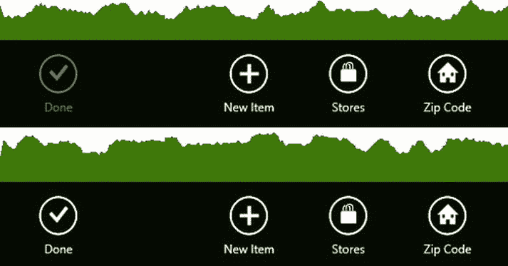
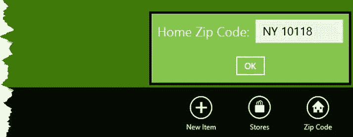
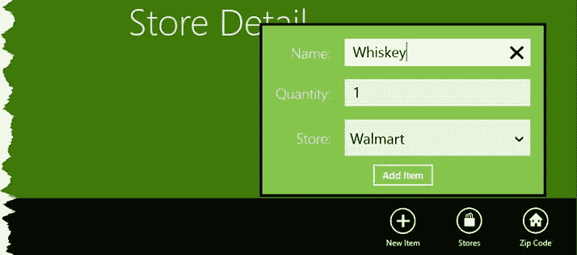
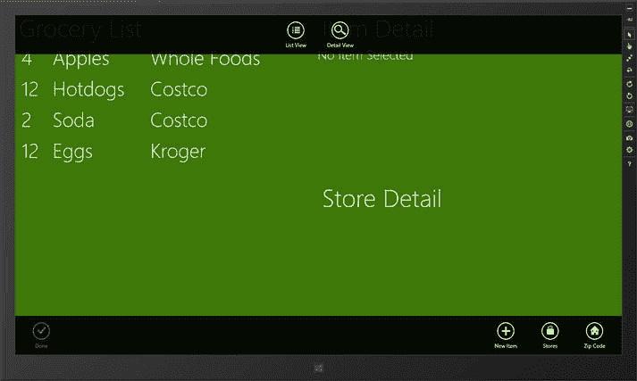
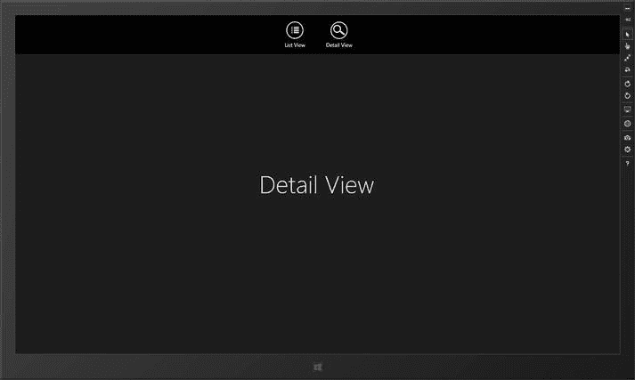

# 第三章


## AppBars、浮出控件和导航

在本章中，我将向您展示如何创建和使用 Windows 应用用户体验中必不可少的用户交互。应用程序栏（AppBar）和导航栏（NavBar）提供了用户与内容和功能交互以及在应用内导航的方式。我还将展示如何创建浮出控件，这些弹出窗口通常用于响应用户与 AppBar 的交互来捕获用户信息。表 3-1 提供了本章的总结。

表 3-1 章节总结

| 问题 | 解决方案 | 代码清单 |
| --- | --- | --- |
| 添加 AppBar | 在 XAML 的 `Page.BottomAppBar` 属性中声明一个 `AppBar` 控件 | 1 |
| 向 AppBar 添加按钮 | 使用预定义样式或自定义样式格式化的 `Button` 控件 | 2-5 |
| 添加浮出控件 | 声明一个 `Popup` 控件，并将 `IsLightDismissEnabled` 属性设置为 `True` | 6, 8 |
| 显示浮出控件 | 将 `Popup` 相对于导致其显示的 AppBar `Button` 进行定位 | 9-11 |
| 轻松访问浮出控件的视图模型 | 使用 `DataContext` 属性 | 12-15 |
| 添加 NavBar | 创建一个包装器 `Page`，在 XAML 的 `Page.TopAppBar` 属性中声明一个 `AppBar` 元素 | 16, 18 |
| 在应用内导航 | 在包装器 `Page` 中添加一个 `Frame` 控件，并在点击 NavBar 按钮时使用 `Navigate` 方法显示其他 `Page` 控件 | 19 |

## 添加上下文菜单（AppBar）

*AppBar* 出现在屏幕底部，当用户向上滑动或右键单击鼠标时显示。Windows 8 应用 UI 的重点是主布局中尽量少用多余的控件，而依赖 AppBar 作为交互机制，这些交互不是关于立即可用的功能，而是与当前显示的布局*相关*的。在本节中，我将向您展示如何定义和填充 AppBar。

 **提示** 屏幕顶部有一个类似的控件，称为导航栏（NavBar），用于在应用的不同部分之间导航。我将在本章后面向您展示如何创建和使用 NavBar。

### 声明 AppBar

创建 AppBar 最简单的方法是在 XAML 文件中声明它。代码清单 3-1 展示了示例项目中 `ListPage.xaml` 文件的添加内容。

***代码清单 3-1** 定义 AppBar*

```xml
<Page
    x:Class="GrocerApp.Pages.ListPage"
    xmlns="http://schemas.microsoft.com/winfx/2006/xaml/presentation"
    xmlns:x="http://schemas.microsoft.com/winfx/2006/xaml"
    xmlns:local="using:GrocerApp.Pages"
    xmlns:d="http://schemas.microsoft.com/expression/blend/2008"
    xmlns:mc="http://schemas.openxmlformats.org/markup-compatibility/2006"
    mc:Ignorable="d">

    <Grid Background="{StaticResource AppBackgroundColor}">

        <Grid.RowDefinitions>
            <RowDefinition/>
            <RowDefinition/>
        </Grid.RowDefinitions>
        <Grid.ColumnDefinitions>
            <ColumnDefinition/>
            <ColumnDefinition/>
        </Grid.ColumnDefinitions>

        <StackPanel Grid.RowSpan="2">

            <TextBlock Style="{StaticResource HeaderTextStyle}" Margin="10"
                       Text="Grocery List"/>
            <ListView x:Name="groceryList" Grid.RowSpan="2"
                ItemsSource="{Binding GroceryList}"
                ItemTemplate="{StaticResource GroceryListItemTemplate}"
                SelectionChanged="ListSelectionChanged" />
        </StackPanel>

        <StackPanel Orientation="Vertical" Grid.Column="1">
            <TextBlock Style="{StaticResource HeaderTextStyle}" Margin="10"
                       Text="Item Detail"/>
            <Frame x:Name="ItemDetailFrame"/>
        </StackPanel>
```


<StackPanel Orientation="Vertical" Grid.Column="1" Grid.Row="1">
    <TextBlock Style="{StaticResource HeaderTextStyle}" Margin="10"
               Text="商店详情"/>
</StackPanel>

<Page.BottomAppBar>
    <AppBar>
        <Grid>
            <Grid.ColumnDefinitions>
                <ColumnDefinition />
                <ColumnDefinition />
            </Grid.ColumnDefinitions>

            <StackPanel Orientation="Horizontal" Grid.Column="0"
                        HorizontalAlignment="Left">
                <Button x:Name="AppBarDoneButton"
                        Style="{StaticResource DoneAppBarButtonStyle}"
                        IsEnabled="false"
                        Click="AppBarButtonClick"/>
            </StackPanel>

            <StackPanel Orientation="Horizontal" Grid.Column="1"
                        HorizontalAlignment="Right">
                <Button x:Name="AppBarAddButton"
                        Style="{StaticResource AddAppBarButtonStyle}"
                        AutomationProperties.Name="新建项目"
                        Click="AppBarButtonClick"/>
                <Button x:Name="AppBarStoresButton"
                        Style="{StaticResource StoresAppBarButton}"
                        Click="AppBarButtonClick"/>
                <Button x:Name="AppBarZipButton"
                        Style="{StaticResource HomeAppBarButtonStyle}"
                        AutomationProperties.Name="邮政编码"
                        Click="AppBarButtonClick"/>
            </StackPanel>
        </Grid>
    </AppBar>
</Page.BottomAppBar>

要创建 `AppBar`，我必须在 `Page.BottomAppBar` 属性中声明一个 `AppBar` 控件，如清单所示。这样便会创建 `AppBar` 及其内容，并将它们分配给包含页面的 `BottomAppBar` 属性。

 **提示** 可以通过在 `Page.TopAppBar` 属性中声明一个 `AppBar` 控件来创建导航栏。

`AppBar` 控件包含按钮，按照惯例，与当前选中项相关的按钮显示在 `AppBar` 左侧，而应用全局按钮显示在右侧。为遵循此惯例，我在 `AppBar` 控件中添加了一个 `Grid`。该 `Grid` 有一行两列，每列包含一个 `StackPanel`。

向 `AppBar` 添加按钮有两种方式：可以选择并调整 `StandardStyles.xaml` 中已定义的按钮，也可以创建自己的按钮。清单中同时使用了这两种方法，我将在后续章节中进行说明。

## 调整预定义的 AppBar 按钮

`/Common/StandardStyles.xaml` 文件中的大部分内容是 `AppBar` 中 `Button` 控件的样式，该文件会在创建 Visual Studio 项目时自动添加，如清单 3-2 所示。

 **注意** `StandardStyles.xaml` 文件中包含大量此类按钮样式，并且默认情况下它们被注释掉了。这意味着你需要取消注释需要使用的样式。在本章中，你需要搜索 `HomeAppBarButtonStyle` 和 `AddAppBarButtonStyle` 并取消注释；否则，在示例应用中将无法使用它们。

**清单 3-2.** *添加 AppBar 按钮的样式*

```
<Style x:Key="AddAppBarButtonStyle" TargetType="ButtonBase"
        BasedOn="{StaticResource AppBarButtonStyle}">
    <Setter Property="AutomationProperties.AutomationId" Value="AddAppBarButton"/>
    <Setter Property="AutomationProperties.Name" Value="Add"/>
    <Setter Property="Content" Value=""/>
</Style>
```

所有预定义的 `Button` 样式都派生自 `AppBarButtonStyle`，该样式定义了 `AppBar` 按钮的基本特征。在下一节创建自己的按钮时，我将使用此样式。

区分各个按钮的两个属性是 `AutomationProperties.Name` 和 `Content`。`AutomationProperties.Name` 属性指定按钮下方显示的文本，而 `Content` 属性指定将使用的图标。此属性的值是 Segoe UI Symbol 字体中的字符代码。你可以使用 Windows 8 附带的字符映射表工具查看此字体定义的图标；值 `E109` 对应一个加号。

清单中显示的样式并不完全符合我的需求。我喜欢这个图标，但我想更改文本。为了在 `ListPage.xaml` 文件中调整按钮以满足我的需求，我只需使用预定义样式并覆盖我想要更改的部分，如清单 3-3 所示。

**清单 3-3.** *在 ListPage.xaml 文件中调整预定义的 AppBar 按钮*

```
<Button x:Name="AppBarAddButton"
    Style="{StaticResource AddAppBarButtonStyle}"
    AutomationProperties.Name="新建项目"
    Click="AppBarButtonClick"/>
```

## 创建自定义 AppBar 按钮样式

另一种方法是为你的 `AppBar` 按钮定义自己的样式。清单 3-4 展示了我为此目的添加到资源文件 `/Resources/GrocerResourceDictionary.xaml` 中的一个样式。

**清单 3-4.** *定义自定义 AppBar 按钮样式*

```
<Style x:Key="StoresAppBarButton" TargetType="Button"
        BasedOn="{StaticResource AppBarButtonStyle}">
    <Setter Property="AutomationProperties.Name" Value="商店"/>
    <Setter Property="Content" Value=""/>
</Style>

<Style x:Key="DoneAppBarButtonStyle" TargetType="Button"
        BasedOn="{StaticResource AppBarButtonStyle}">
    <Setter Property="AutomationProperties.Name" Value="完成"/>
    <Setter Property="Content" Value=""/>
</Style>
```

我基于 `AppBarButtonStyle` 创建了这些样式，因此获得了 `AppBar` 按钮的基本外观和感觉，并设置了 `AutomationProperties.Name` 和 `Content` 属性的值。你可以更进一步，重新定义底层样式的某些核心特征，但这可能会偏离用户期望的标准 Windows 8 应用外观和体验。

## 实现 AppBar 按钮操作

目前，`AppBar` 上的 `Button` 控件不执行任何操作。为了解决这个问题，我将实现“完成”按钮，以便你了解其实现方式。

当用户从杂货项目列表中进行选择时，我将激活此 `Button`。当用户单击该按钮时，我将从列表中移除当前选中的项目，从而允许用户指示他们已购买了某个项目。清单 3-5 显示了 `ListPage.xaml.cs` 代码后置文件中的更改。

**清单 3-5.** *实现“完成”AppBar 按钮*

```
using GrocerApp.Data;
using Windows.UI.Xaml;
using Windows.UI.Xaml.Controls;
using Windows.UI.Xaml.Navigation;

namespace GrocerApp.Pages {

public sealed partial class ListPage : Page {
    ViewModel viewModel;

    public ListPage() {
        viewModel = new ViewModel();

        // ...测试数据已删除以保持简洁

        this.InitializeComponent();
        this.DataContext = viewModel;

        ItemDetailFrame.Navigate(typeof(NoItemSelected));

        viewModel.PropertyChanged += (sender, args) => {
            if (args.PropertyName == "SelectedItemIndex") {
                if (viewModel.SelectedItemIndex == -1) {
                    ItemDetailFrame.Navigate(typeof(NoItemSelected));
                    AppBarDoneButton.IsEnabled = false;
                } else {
                    ItemDetailFrame.Navigate(typeof(ItemDetail), viewModel);
                    AppBarDoneButton.IsEnabled = true;
                }
            }
        };
    }

    protected override void OnNavigatedTo(NavigationEventArgs e) {
    }
}
```


```csharp
private void ListSelectionChanged(object sender, SelectionChangedEventArgs e) {
    viewModel.SelectedItemIndex = groceryList.SelectedIndex;
}

private void AppBarButtonClick(object sender, RoutedEventArgs e) {
    if (e.OriginalSource == AppBarDoneButton
            && viewModel.SelectedItemIndex > -1) {
        viewModel.GroceryList.RemoveAt(viewModel.SelectedItemIndex);
        viewModel.SelectedItemIndex = -1;
    }
}
```

此清单中有两点值得注意。第一点在于，对于简单任务而言，为`AppBar`上的`Button`实现操作只需响应`Click`事件即可。

第二点是，你可以开始看到视图模型在代码中显现的优势。我在`AppBarButtonClick`方法中的代码无需将`Frame`的内容切换到`NoItemSelected`页面，也无需在项目完成时禁用“完成”按钮。我只需更新视图模型，应用的其他部分便会自动适应这些变化，为用户呈现正确的布局和整体体验。

你可以在图 3-1 中看到添加`AppBar`及其`Button`控件后的效果。如果想亲自体验`AppBar`，可以启动示例应用，从屏幕顶部或底部滑动，或者使用鼠标右键单击。该图展示了“完成”按钮的两种状态，你可以通过从列表中选择一个项目来重现这些状态。



图 3-1 向示例应用添加`AppBar`

## 创建 Flyout

“完成”`AppBar`按钮关联了一个简单操作，该操作可直接在与`Click`事件关联的事件处理代码中执行。然而，大多数`AppBar`按钮需要某种额外的用户交互，这通常通过使用*flyout*来实现。

Flyout 是一个弹出窗口，显示在被点击的`AppBar`按钮附近，当用户点击或触摸屏幕上的其他位置时，它会自动关闭。针对 JavaScript 版 Windows 8 应用，有现成的`Flyout`控件，但若要用 XAML 和 C# 实现相同的效果，则需要使用`Popup`并编写精心的定位代码。

### 创建用户控件

XAML 文件可能会变得冗长且难以管理。我喜欢将 flyout 定义为*用户控件*，它们类似于 XAML 元素的片段加一个代码隐藏文件。（此处我跳过了一些 XAML 细节，但当你阅读本章节时就会明白我的意思。）我在示例项目中创建了一个名为`Flyouts`的文件夹，并使用`UserControl`模板创建了一个名为`HomeZipCodeFlyout.xaml`的新项，其内容见清单 3-6。

**清单 3-6** `HomeZipCodeFlyout.xaml`文件

```
<UserControl
    x:Class="GrocerApp.Flyouts.HomeZipCodeFlyout"
    xmlns="http://schemas.microsoft.com/winfx/2006/xaml/presentation"
    xmlns:x="http://schemas.microsoft.com/winfx/2006/xaml"
    xmlns:local="using:GrocerApp.Flyouts"
    xmlns:d="http://schemas.microsoft.com/expression/blend/2008"
    xmlns:mc="http://schemas.openxmlformats.org/markup-compatibility/2006"
    mc:Ignorable="d"
    d:DesignHeight="300"
    d:DesignWidth="400">

    <Popup x:Name="HomeZipCodePopup"
           IsLightDismissEnabled="True" Width="350" Height="130">
        <StackPanel Background="Black">
            <Border Background="#85C54C" BorderThickness="4">
                <StackPanel>
                    <StackPanel Orientation="Horizontal" Margin="10">
                        <TextBlock Style="{StaticResource PopupTextStyle}"
                                   Text="家庭邮编："
                                   VerticalAlignment="Center"
                                   Margin="0,0,10,0" />
                        <TextBox Height="40" Width="150" FontSize="20"
                                 Text="{Binding Path=HomeZipCode,
                                      Mode=TwoWay}" />
                    </StackPanel>
                    <Button Click="OKButtonClick"
                            HorizontalAlignment="Center"
                            Margin="10">确定</Button>
                </StackPanel>
            </Border>
        </StackPanel>
    </Popup>
</UserControl>
```

文件名已经指明，这个 flyout 将允许用户更改视图模型中`HomeZipCode`属性的值。在本示例中，该属性除了提供一些有用的示例机会外，本身不执行任何操作。

用户控件的工作方式类似于模板。在`UserControl`元素内部，你定义代表你想要创建的控件的 XAML 元素。创建 flyout 时必须使用`Popup`控件，但其中放置的内容则由你自行决定。清单中我的布局包含一个`TextBox`，用于收集用户输入的新值；一个`Button`，以便用户告知已输入新值；以及一些用于提供上下文和结构的周围元素。

你必须为`Popup`元素设置三个重要属性，我在清单中均以粗体标出。`IsLightDismissEnabled`属性指定当用户点击或触摸`Popup`之外的任何位置时，弹出窗口是否会被关闭；当将`Popup`用作 flyout 时，必须将此属性设置为`True`，因为这是 flyout 用户体验的关键部分。

必须设置`Width`和`Height`属性，使`Popup`的大小恰好能容纳其内容。在定位`Popup`时，我需要这些属性的显式值，稍后将进行演示。

 **注意** 如果你使用我的定位代码（稍后会介绍）来管理 flyout，那么*必须*提供显式且准确的`Width`和`Height`值。如果省略这些值或提供不准确的尺寸，flyout 将无法正确定位。

你会看到我在清单中引用了`PopupTextStyle`样式。我在`/Resources/GrocerResourceDictionary`文件中定义了该样式以及本章需要的其他一些样式，如清单 3-7 所示。

**清单 3-7** 为 Flyout 定义自定义样式

```
<ResourceDictionary
    xmlns="http://schemas.microsoft.com/winfx/2006/xaml/presentation"
    xmlns:x="http://schemas.microsoft.com/winfx/2006/xaml"
    xmlns:local="using:GrocerApp.Resources">

    <ResourceDictionary.MergedDictionaries>
        <ResourceDictionary Source="/Common/StandardStyles.xaml" />
    </ResourceDictionary.MergedDictionaries>

    <!-- ...为简洁起见，省略了其他样式... -->

    <Style x:Key="PopupTextStyle" TargetType="TextBlock"
           BasedOn="{StaticResource BasicTextStyle}">
        <Setter Property="FontSize" Value="22" />
    </Style>

    <Style x:Key="AddItemText" TargetType="TextBlock"
           BasedOn="{StaticResource GroceryListItem}">
        <Setter Property="FontSize" Value="22"/>
        <Setter Property="HorizontalAlignment" Value="Right"/>
        <Setter Property="VerticalAlignment" Value="Center"/>
    </Style>
```


<Style x:Key="AddItemTextBox" TargetType="TextBox"
    BasedOn="{StaticResource ItemDetailTextBox}">
    <Setter Property="FontSize" Value="22"/>
</Style>

<Style x:Key="AddItemStore" TargetType="ComboBox"
    BasedOn="{StaticResource ItemDetailStore}">
    <Setter Property="FontSize" Value="22"/>
</Style>

</ResourceDictionary>

## 编写用户控件代码

尽管用户控件呈现的是 XAML 片段，但它们仍然包含代码隐藏文件。清单 3-8 展示了 `HomeZipCodeFlyout.xaml.cs` 文件的内容。

**清单 3-8. `HomeZipCodeFlyout.xaml.cs` 文件**

```
using Windows.UI.Xaml;
using Windows.UI.Xaml.Controls;

namespace GrocerApp.Flyouts {
    public sealed partial class HomeZipCodeFlyout : UserControl {

        public HomeZipCodeFlyout() {
            this.InitializeComponent();
        }

        public void Show(Page page, AppBar appbar, Button button) {
            HomeZipCodePopup.IsOpen = true;
            FlyoutHelper.ShowRelativeToAppBar(HomeZipCodePopup, page, appbar, button);
        }

        private void OKButtonClick(object sender, RoutedEventArgs e) {
            HomeZipCodePopup.IsOpen = false;
        }
    }
}
```

我需要为弹出窗口解决的主要问题是定位 `Popup`。对于响应 `AppBar` 按钮而出现的弹出窗口，其惯例是将 `Popup` 显示在点击的 `Button` 元素的正上方。

## 定位 Popup 控件

Windows 应用控件没有提供简单的方法来计算布局中元素的相对位置，因此需要使用一些间接技术。清单 3-9 展示了 `FlyoutHelper` 类的内容，该类定义了静态的 `ShowRelativeToAppBar` 方法，我将其添加到了 `Flyouts` 文件夹中。此方法负责将 `Popup` 正确定位到 `AppBar` 按钮的相对位置，但要做到这一点，它需要 `Popup` 控件、包含 `AppBar` 的 `Page`、`AppBar` 控件以及被点击的 `Button`。这并非理想方案，但这是我所找到的能够可靠定位弹出窗口的唯一方法。

**清单 3-9. 将 `Popup` 控件相对于 `AppBar` 按钮进行定位**

```
using System;
using Windows.Foundation;
using Windows.UI.Xaml;
using Windows.UI.Xaml.Controls;
using Windows.UI.Xaml.Controls.Primitives;

namespace GrocerApp.Flyouts {
    class FlyoutHelper {

        public static void ShowRelativeToAppBar(Popup popup, Page page,
                AppBar appbar, Button button) {

            Func<UIElement, UIElement, Point> getOffset =
                delegate(UIElement control1, UIElement control2) {
                    return control1.TransformToVisual(control2)
                        .TransformPoint(new Point(0, 0));
                };

            Point popupOffset = getOffset(popup, page);

            Point buttonOffset = getOffset(button, page);
            popup.HorizontalOffset = buttonOffset.X - popupOffset.X
                - (popup.ActualWidth / 2) + (button.ActualWidth / 2);
            popup.VerticalOffset = getOffset(appbar, page).Y
                - popupOffset.Y - popup.ActualHeight;

            if (popupOffset.X + popup.HorizontalOffset
                    + popup.ActualWidth > page.ActualWidth) {

                popup.HorizontalOffset = page.ActualWidth
                    - popupOffset.X - popup.ActualWidth;
            }
            else if (popup.HorizontalOffset + popupOffset.X < 0) {
                popup.HorizontalOffset = -popupOffset.X;
            }
        }

    }
}
```

这段代码将 `Popup` 定位在它所关联的 `AppBar` 按钮的正上方，并且如果这会导致 `Popup` 消失在屏幕的左边缘或右边缘之外，则会重新定位。我不会深入探讨这段代码的细节，因为它相当复杂。相反，我建议你直接使用这段代码，仅在遇到问题时才深入研究。如果你遇到问题，最可能的原因是你没有为 `Popup` 设置 `Width` 和 `Height` 属性。

## 显示和隐藏 Popup 控件

我的 `HomeZipCodeFlyout` 类负责的另一项功能是显示和隐藏 `Popup`。为了让代码更简洁，我的弹出窗口工作方式采用了一些技巧。如果你回头查看清单 3-6 中的 XAML，你会看到我为数据绑定指定了一个 `Mode`，如下所示：

```
...
<TextBox Height="40" Width="150" Text=" {Binding Path=HomeZipCode,
    Mode=TwoWay} " />
...
```

数据绑定默认是单向的，这意味着视图模型中的更改会更新控件。我指定了双向绑定，这意味着，除此之外，用户在 `TextBox` 控件中输入的值将用于更新相应的视图模型属性。

**提示** 请注意，我无需设置 `DataContext` 即可使绑定生效。用户控件将被添加到主 XAML 布局中，这意味着它会从顶层的 `Page` 对象继承 `DataContext` 的值。

这使我能够通过简单地隐藏 `Popup` 来处理 OK 按钮的点击事件；我无需担心从 `TextBox` 获取值并显式更新视图模型。这种方法的缺点是，在弹出窗口被关闭之前，视图模型可能会被更新多次，如果你的应用在其他地方监听受影响属性的更改，这可能会引发问题。对于 `HomeZipCode` 属性来说这不是问题，并且我想向你展示这种技术，它可以是一种非常简洁的处理用户输入的方法。

## 向应用添加 Flyout

我费心创建用户控件的原因是，我希望尽可能保持主布局 XAML 的专注性。不过，我仍然需要将用户控件添加到 XAML 中。你可以在清单 3-10 中看到我是如何做到这一点的，该清单展示了我对 `ListPage.xaml` 文件所做的更改。

**清单 3-10. 向 `ListPage` XAML 添加 Flyout 控件**

```
<Page
    x:Class="GrocerApp.Pages.ListPage"
    xmlns="http://schemas.microsoft.com/winfx/2006/xaml/presentation"
    xmlns:x="http://schemas.microsoft.com/winfx/2006/xaml"
    xmlns:local="using:GrocerApp.Pages"
    xmlns:flyouts="using:GrocerApp.Flyouts"
    xmlns:d="http://schemas.microsoft.com/expression/blend/2008"
    xmlns:mc="http://schemas.openxmlformats.org/markup-compatibility/2006"
    mc:Ignorable="d">

    <Grid Background="{StaticResource AppBackgroundColor}">

        <Grid.RowDefinitions>
            <RowDefinition/>
            <RowDefinition/>
        </Grid.RowDefinitions>
        <Grid.ColumnDefinitions>
            <ColumnDefinition/>
            <ColumnDefinition/>
        </Grid.ColumnDefinitions>

        <StackPanel Grid.RowSpan="2">
            // ...为简洁起见，内容已移除
        </StackPanel>

        <StackPanel Orientation="Vertical" Grid.Column="1">
            // ...为简洁起见，内容已移除
        </StackPanel>

        <StackPanel Orientation="Vertical" Grid.Column="1" Grid.Row="1">
            // ...为简洁起见，内容已移除
        </StackPanel>

        <flyouts:HomeZipCodeFlyout x:Name="HomeZipFlyout"/>
    </Grid>

    <Page.BottomAppBar>
        // ...为简洁起见，内容已移除
    </Page.BottomAppBar>
</Page>
```

我必须定义一个新的 XAML 命名空间，以便能够在 `Flyouts` 文件夹中使用用户控件，因此我向 XAML 添加了以下一行：

```
xmlns: flyouts ="using: GrocerApp.Flyouts"
```

重要部分是我在 `xmlns` 部分之后分配的名称，在本例中是 `flyouts`。在声明用户控件时，我必须使用相同的名称，如下所示：

```
< flyouts :HomeZipCodeFlyout x:Name="HomeZipFlyout"/>
```


注意，声明浮出控件必须放在`Grid`*内部*；即使它不立即显示，浮出控件用户控件也必须声明为主应用布局的一部分，而`Page`控件只能包含常规的子元素（这就是为什么`AppBar`控件必须声明在`Page.BottomAppBar`属性内部）。

**显示浮出控件**

剩下的工作就是挂接浮出控件，以便用户在点击`AppBar`按钮时显示它。清单 3-11 展示了为`ListPage.xaml.cs`文件添加的代码，以实现此功能。

***清单 3-11。** 响应 `AppBar` 按钮点击事件显示浮出控件*

```
...
private void AppBarButtonClick(object sender, RoutedEventArgs e) {
    if (e.OriginalSource == AppBarDoneButton
            && viewModel.SelectedItemIndex > -1) {

viewModel.GroceryList.RemoveAt(viewModel.SelectedItemIndex);
        viewModel.SelectedItemIndex = -1;

} else if (e.OriginalSource == AppBarZipButton) {
        HomeZipFlyout.Show(this, this.BottomAppBar, (Button)e.OriginalSource);
    }
}
...
```

我调用了在用户控件中定义的`Show`方法，并传入需要正确定位`Popup`的控件集合。您可以在图 3-2 中看到结果。



图 3-2。在相关的 `AppBar` 按钮旁边显示一个浮出控件

**创建更复杂的浮出控件**

现在我已经演示了基础知识，可以构建一个允许用户向购物清单添加新项目的浮出控件了。此浮出控件的不同之处在于，它不能依赖双向绑定技巧来处理视图模型。这并非特别复杂的技术；我只是想向您展示这两种方法，以便您可以根据项目需求选择合适的一种。我向您展示的浮出控件示例越多，您在创建自己的浮出控件时就会感到越轻松。

首先，我使用`UserControl`模板在`Flyouts`项目文件夹中创建了`AddItemFlyout.xaml`文件。然后，我遵循相同的基本方法，在`Popup`中布局内容，如清单 3-12 所示。

***清单 3-12。** 添加项目浮出控件的 XAML*

```
<UserControl
    x:Class="GrocerApp.Flyouts.AddItemFlyout"
    xmlns=" http://schemas.microsoft.com/winfx/2006/xaml/presentation "
    xmlns:x=" http://schemas.microsoft.com/winfx/2006/xaml "
    xmlns:local="using:GrocerApp.Flyouts"
    xmlns:d=" http://schemas.microsoft.com/expression/blend/2008 "
    xmlns:mc=" http://schemas.openxmlformats.org/markup-compatibility/2006 "
    mc:Ignorable="d"
    d:DesignHeight="300"
    d:DesignWidth="400">

<Popup x:Name="AddItemPopup" IsLightDismissEnabled="True" Width="435" Height="265" >
        <StackPanel Background="Black">
            <Border Background="#85C54C" BorderThickness="4">
                <Grid Margin="10">
                    <Grid.RowDefinitions>
                        <RowDefinition/>
                        <RowDefinition/>
                        <RowDefinition/>
                        <RowDefinition/>
                    </Grid.RowDefinitions>
                    <Grid.ColumnDefinitions>
                        <ColumnDefinition Width="Auto"/>
                        <ColumnDefinition Width="300"/>
                    </Grid.ColumnDefinitions>

<TextBlock Text="名称:" Style="{StaticResource AddItemText}"  />
                    <TextBlock Text="数量:" Grid.Row="1"
                               Style="{StaticResource AddItemText}" />
                    <TextBlock Text="商店:" Grid.Row="2"
                               Style="{StaticResource AddItemText}" />

<TextBox x:Name="ItemName" Grid.Column="1"
                             Style="{StaticResource AddItemTextBox}" />
                    <TextBox x:Name="ItemQuantity" Grid.Row="1" Grid.
                             Column="1"
                             Style="{StaticResource AddItemTextBox}" />
                    <ComboBox x:Name="ItemStore" Grid.Column="1" Grid.
                             Row="2"
                              Style="{StaticResource AddItemStore}"
                              ItemsSource="{Binding StoreList}"
                              DisplayMemberPath="" />
                    <StackPanel Orientation="Horizontal" Grid.Row="3"
                                HorizontalAlignment="Center"
                                Grid.ColumnSpan="2">
                        <Button Click="AddButtonClick">添加项目</Button>
                    </StackPanel>
                </Grid>
            </Border>
        </StackPanel>
    </Popup>
</UserControl>
```

`Popup`的布局与我在第 2 章中创建的`ItemDetail`页面的布局非常相似。可以将`Frame`控件（以及`Page`）嵌入到浮出控件的`Popup`中，但调整样式和修改代码隐藏行为所需的工作量，往往使得简单地复制元素更具吸引力。对于简单的项目，我很乐意这样做，尽管我隐约觉得将来某个时候会重新审视这个项目，以消除重复并正确地实现它。

**编写代码**

我希望您关注此浮出控件的代码部分，如清单 3-13 所示。

***清单 3-13。** `AddItemFlyout.xaml.cs` 文件*

```
using System;
using GrocerApp.Data;
using Windows.UI.Xaml;
using Windows.UI.Xaml.Controls;

namespace GrocerApp.Flyouts {
    public sealed partial class AddItemFlyout : UserControl {

public AddItemFlyout() {
            this.InitializeComponent();
        }

public void Show(Page page, AppBar appbar, Button button) {
            AddItemPopup.IsOpen = true;
            FlyoutHelper.ShowRelativeToAppBar(AddItemPopup, page, appbar, button);
        }

private void AddButtonClick(object sender, RoutedEventArgs e) {

((ViewModel)DataContext) .GroceryList.Add(new GroceryItem {
                Name = ItemName.Text,
                Quantity = Int32.Parse(ItemQuantity.Text),
                Store = ItemStore.SelectedItem.ToString()
            });

AddItemPopup.IsOpen = false;
        }
    }
}
```

我需要获取视图模型对象，以便向其中添加新项目。有几种方法可以实现，但最简单的方法是读取`DataContext`属性的值，如清单所示。需要特别注意，因为我假定此属性的值将是我的`ViewModel`对象，该对象是在`ListPage`类（在`ListPage.xaml.cs`文件中）的构造函数中设置的。正如我之前提到的，`DataContext`属性是继承的，这意味着为`Page`对象设置的对象可以从我的`UserControl`中检索到，但前提是布局层次结构中的中间控件没有被分配另一个对象到其`DataContext`属性。

一旦我有了`ViewModel`对象，向`GroceryList`集合添加一个新的`GroceryItem`就是一个简单的操作。由于该集合是可观察的，添加操作将自动反映在应用的其他部分。

**向应用添加浮出控件**

剩下的工作就是按照与前一个浮出控件相同的模式，将新的浮出控件添加到`ListPage`布局和代码中。清单 3-14 展示了浮出控件的 XAML 声明。

***清单 3-14。** 在 XAML 中声明添加项目浮出控件*

```
...
<flyouts:HomeZipCodeFlyout x:Name="HomeZipFlyout"/>
<flyouts:AddItemFlyout x:Name="AddItemFlyout"/>
...
```


清单 3-15 展示了在`ListPage`类的`AppBarButtonClick`中添加的代码，该代码在点击“添加项目”AppBar 按钮时显示浮出控件。

**清单 3-15.** 响应 AppBar 按钮显示浮出控件

```
...
private void AppBarButtonClick(object sender, RoutedEventArgs e) {
    if (e.OriginalSource == AppBarDoneButton
            && viewModel.SelectedItemIndex > -1) {

viewModel.GroceryList.RemoveAt(viewModel.SelectedItemIndex);
        viewModel.SelectedItemIndex = -1;

} else if (e.OriginalSource == AppBarZipButton) {
        HomeZipFlyout.Show(this, this.BottomAppBar, (Button)e.OriginalSource);
    } else if (e.OriginalSource == AppBarAddButton) {
        AddItemFlyout.Show(this, this.BottomAppBar, (Button)e.OriginalSource);
    }
}
...
```

你可以在图 3-3 中看到浮出控件的外观。与 AppBar 关联的浮出控件`Popup`所采用的“轻触关闭”样式，意味着同一时间只会显示一个浮出控件。



图 3-3. “添加项目”浮出控件

## 在 Windows 应用内导航

如果你的应用包含多个不同的功能部分，那么你需要提供一个导航栏（`NavBar`），以便用户能够在这些部分之间轻松切换。提供一致导航的最简单方法是重构应用，使功能区域呈现在一个包装页面的`Frame`控件中。

### 创建包装器

我在`Pages`文件夹中创建了`MainPage.xaml`文件作为包装器。你可以从清单 3-16 中看到这个文件的内容，它是使用`Blank Page`模板创建的。

**清单 3-16.** `MainPage.xaml`文件

```
<Page
    x:Class="GrocerApp.Pages.MainPage"
    xmlns=" http://schemas.microsoft.com/winfx/2006/xaml/presentation "
    xmlns:x=" http://schemas.microsoft.com/winfx/2006/xaml "
    xmlns:local="using:GrocerApp.Pages"
    xmlns:d=" http://schemas.microsoft.com/expression/blend/2008 "
    xmlns:mc=" http://schemas.openxmlformats.org/markup-compatibility/2006 "
    mc:Ignorable="d">

<Page.TopAppBar>
        <AppBar>
            <StackPanel Orientation="Horizontal"             HorizontalAlignment="Center">
                <Button x:Name="ListViewButton"
                    Style="{StaticResource AppBarButtonStyle}"
                    AutomationProperties.Name="List View"
                    Content="" Click="NavBarButtonPress"/>

<Button x:Name="DetailViewButton"
                    Style="{StaticResource AppBarButtonStyle}"
                    AutomationProperties.Name="Detail View"
                    Content="" Click="NavBarButtonPress"/>
            </StackPanel>
        </AppBar>
    </Page.TopAppBar>

<Grid Background="{StaticResource ApplicationPageBackgroundThemeBrush}">
        <Frame x:Name="MainFrame" />
    </Grid>
</Page> 
```

为了添加导航栏，我在`Page.TopAppBar`属性中声明了一个`AppBar`控件。导航栏的机制与（底部）AppBar 相同，并且我添加了两个`Button`控件来支持在应用包含的两个视图之间导航。

除了导航栏之外，`MainPage`的布局还包含一个`Frame`，我将用它来显示不同的视图。

支持此布局的代码非常简单，如清单 3-17 所示。我通过导航到相应的`Page`并更改按钮的`IsChecked`属性来响应任一`Button`控件的点击。另外，我在此类中创建了`ViewModel`对象，以便在整个应用中只有一个实例。该对象通过`Frame.Navigate`方法传递给各个页面。

**清单 3-17.** `MainPage.xaml.cs`

```
using System;
using GrocerApp.Data;
using Windows.UI.Xaml;
using Windows.UI.Xaml.Controls;
using Windows.UI.Xaml.Controls.Primitives;
using Windows.UI.Xaml.Navigation;

namespace GrocerApp.Pages {

public sealed partial class MainPage : Page {
        private ViewModel viewModel;

public MainPage() {
            this.InitializeComponent();

viewModel = new ViewModel();

viewModel.StoreList.Add("Whole Foods");
            viewModel.StoreList.Add("Kroger");
            viewModel.StoreList.Add("Costco");
            viewModel.StoreList.Add("Walmart");

viewModel.GroceryList.Add(new GroceryItem {
                Name = "Apples",
                Quantity = 4, Store = "Whole Foods"
            });
            viewModel.GroceryList.Add(new GroceryItem {
                Name = "Hotdogs",
                Quantity = 12, Store = "Costco"
            });
            viewModel.GroceryList.Add(new GroceryItem {
                Name = "Soda",
                Quantity = 2, Store = "Costco"
            });
            viewModel.GroceryList.Add(new GroceryItem {
                Name = "Eggs",
                Quantity = 12, Store = "Kroger"
            });

this.DataContext = viewModel;

MainFrame.Navigate(typeof(ListPage), viewModel);
        }

protected override void OnNavigatedTo(NavigationEventArgs e) {
        }

private void NavBarButtonPress(object sender, RoutedEventArgs e) {
            Boolean isListView = (Button)sender == ListViewButton;
            MainFrame.Navigate(isListView ? typeof(ListPage)
                : typeof(DetailPage), viewModel);
        }
    }
} 
```

我在构造函数中导航到应用的默认视图，即前面示例中一直使用的`ListPage`。

 **提示** `ListPage`已被重构，以便视图模型从`OnNavigatedTo`方法的参数中获取。这些更改非常简单，因此我不在此列出，但你可以在本书附带的源代码下载中看到修改后的类，该下载文件可从`Apress.com`获取。

我需要更新`App.xaml.cs`文件，将包装器视图投入使用，如清单 3-18 所示。

**清单 3-18.** 将`MainPage`设为示例应用的默认页面

```
...
if (rootFrame.Content == null) {

if (!rootFrame.Navigate(typeof( Pages.MainPage ), args.Arguments)) {
        throw new Exception("Failed to create initial page");
    }
}
...
```

### 创建另一个视图

我需要使用`Blank Page`模板向应用程序添加另一个页面。我在`Pages`项目文件夹中创建了一个名为`DetailPage.xaml`的占位页面；其布局如清单 3-19 所示。

**清单 3-19.** `DetailPage.xaml`文件

```
<Page
    x:Class="GrocerApp.Pages.DetailPage"
    xmlns=" http://schemas.microsoft.com/winfx/2006/xaml/presentation "
    xmlns:x=" http://schemas.microsoft.com/winfx/2006/xaml "
    xmlns:local="using:GrocerApp.Pages"
    xmlns:d=" http://schemas.microsoft.com/expression/blend/2008 "
    xmlns:mc=" http://schemas.openxmlformats.org/markup-compatibility/2006 "
    mc:Ignorable="d">

<Grid Background="{StaticResource ApplicationPageBackgroundThemeBrush}">
        <StackPanel VerticalAlignment="Center" HorizontalAlignment="Center">
            <TextBlock Style="{StaticResource HeaderTextStyle}" Text="Detail
                View"/>
        </StackPanel>
    </Grid>
</Page>
```

这个页面不包含任何功能；它只是为了演示如何在应用内处理导航而存在。

### 测试导航

剩下的就是测试导航了。如果你启动示例应用并调出 AppBar，你会看到导航栏也会自动出现，如图 3-4 所示。




图 3-4. 页面特定的`NavBar`与`AppBar`一同显示

点击`NavBar`中的`Detail View`按钮，你将看到另一种视图，如图 3-5 所示。



图 3-5. 在应用中显示另一个内容视图

这是一个很棒的功能，页面特定的`AppBar`与全应用范围的导航控件无缝集成。你可以通过在包装页面中声明一个`AppBar`，为整个应用实现统一的`AppBar`。如果这样做，你就需要负责确保根据需要从`AppBar`中添加或移除按钮。

## 本章小结

在本章中，我向你展示了如何创建`AppBar`、`NavBar`和浮出控件，它们是构成 Windows 8 应用用户体验的关键部分。实现这些交互对于让你的应用与更广泛的用户体验保持一致非常重要，我建议你花些时间确保所显示的控件始终与用户当前面对的内容和视图相关。在下一章中，我将介绍一些让你的应用能够集成到 Windows 系统中的功能：*磁贴*和*徽章*。

