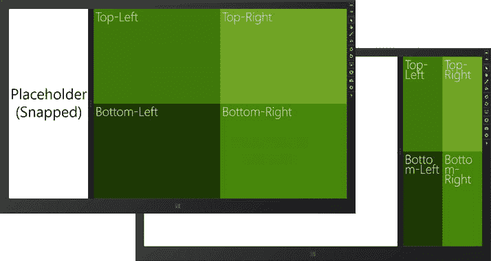
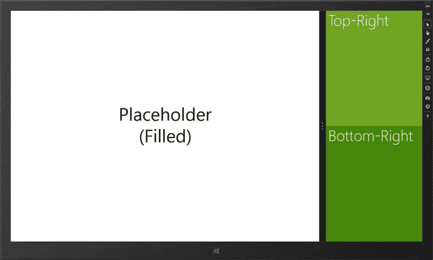
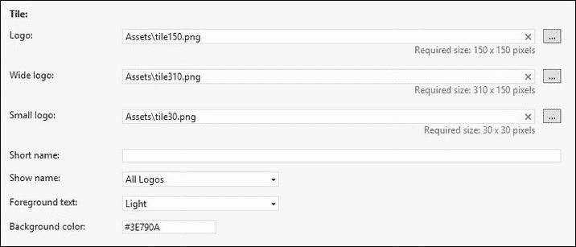
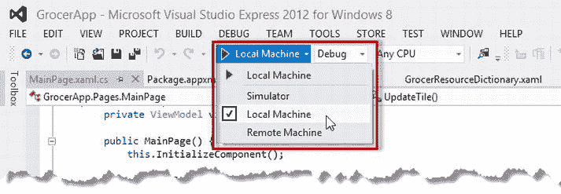
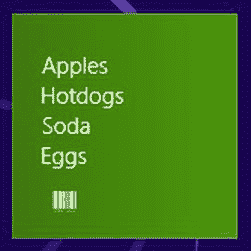
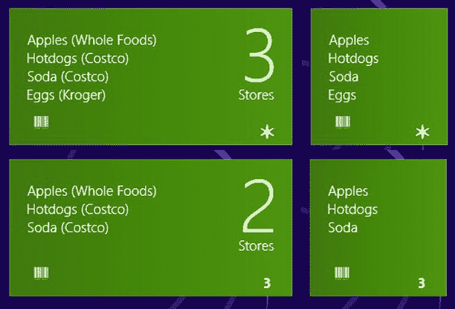

# 第 4 章


## 视图与磁贴

在本章中，我将介绍两种让应用能够融入 Windows 8 所提供的更广泛用户体验的功能。第一个功能是应用可以*贴靠*和*填充*，从而让两个应用并排显示。我将展示当你的应用被置于这些布局之一时如何进行调整，以及当你的交互操作不适合视图限制时如何更改布局。

第二个功能是*磁贴*模型。磁贴是 Windows 8 取代“开始”菜单的核心。简单来说，它们是用于启动应用的静态按钮，但稍加处理，它们就能为用户提供应用状态的宝贵快照，让用户无需运行应用即可大致了解情况。在本章中，我将展示如何通过应用更新以及使用相关功能*徽章*来创建动态磁贴。表 4-1 提供了本章的总结。

表 4-1. 本章总结

| 问题 | 解决方案 | 代码清单 |
| --- | --- | --- |
| 当应用被置于贴靠或填充视图时，调整其布局。 | 通过修改控件的布局来处理`ViewStateChanged`事件。 | 1–3 |
| 使用 XAML 声明视图变化所需的调整。 | 使用`VisualStateManage`。 | 4, 5 |
| 退出贴靠视图。 | 使用`TryUnsnap`方法。 | 6, 7 |
| 为应用创建动态磁贴。 | 修改 XML 模板的内容，并使用`Windows.UI.Notification`命名空间中的类。 | 8–10 |
| 更新方形和宽形磁贴。 | 为两个模板准备更新并将它们合并在一起。 | 11, 12 |
| 为磁贴应用徽章 | 填充并应用一个 XML 徽章模板 | 13, 14 |

## 支持视图

到目前为止，我的应用一直假设它可以独占整个显示屏。然而，应用可以通过鼠标手势进行排列，使其处于*贴靠*或*填充*状态。贴靠的应用会占据屏幕左边缘或右边缘一个 320 像素的条带。填充的应用则与贴靠的应用并排显示，占据除 320 像素条带之外的整个屏幕。为了演示不同的视图，我在`DetailPage.xaml`文件中添加了一些内容，如代码清单 4-1 所示。（这是我在上一章中添加的用于演示导航的文件，但之前除了显示一条简单消息外，它没有任何其他功能。）

**代码清单 4-1.** 向`DetailPage.xaml`文件添加内容

```
<Page
    x:Class="GrocerApp.Pages.DetailPage"
    xmlns="http://schemas.microsoft.com/winfx/2006/xaml/presentation"
    xmlns:x="http://schemas.microsoft.com/winfx/2006/xaml"
    xmlns:local="using:GrocerApp.Pages"
    xmlns:d="http://schemas.microsoft.com/expression/blend/2008"
    xmlns:mc="http://schemas.openxmlformats.org/markup-compatibility/2006"
    mc:Ignorable="d">

<Grid x:Name="GridLayout" Background="#71C524">
        <Grid.RowDefinitions>
            <RowDefinition/>
            <RowDefinition/>
        </Grid.RowDefinitions>
        <Grid.ColumnDefinitions>
            <ColumnDefinition/>
            <ColumnDefinition/>
        </Grid.ColumnDefinitions>

<StackPanel x:Name="TopLeft" Background="#3E790A">
            <TextBlock x:Name="TopLeftText"
                       Style="{StaticResource DetailViewLabelStyle}"
                       Text="左上"/>
        </StackPanel>

<StackPanel x:Name="TopRight" Background="#70a524" Grid.Column="1"
                    Grid.Row="0">
            <TextBlock x:Name="TopRightText"
                       Style="{StaticResource DetailViewLabelStyle}"
                       Text="右上"/>
        </StackPanel>

<StackPanel x:Name="BottomLeft" Background="#1E3905" Grid.Row="1">
            <TextBlock x:Name="BottomLeftText"
                       Style="{StaticResource DetailViewLabelStyle}"
                       Text="左下"/>
        </StackPanel>

<StackPanel x:Name="BottomRight" Background="#45860B" Grid.
                    Column="1" Grid.Row="1">
            <TextBlock x:Name="BottomRightText"
                       Style="{StaticResource DetailViewLabelStyle}"
                       Text="右下"/>
        </StackPanel>
    </Grid>
</Page>
```

我在`/Resources/GrocerResourceDictionary.xaml`文件中为这个页面定义了一个名为`DetailViewLabelStyle`的新样式，如代码清单 4-2 所示。

**代码清单 4-2.** 添加`DetailViewLabelStyle`样式

```
. . .
<Style x:Key="DetailViewLabelStyle" TargetType="TextBlock"
        BasedOn="{StaticResource HeaderTextStyle}">
    <Setter Property="FontSize" Value="50"/>
    <Setter Property="Margin" Value="10"/>
    <Setter Property="HorizontalAlignment" Value="Left"/>
</Style>
. . .
```

这个布局创建了一个简单的彩色网格。你可以通过启动应用，并使用我在上一章中添加的`NavBar`，点击`Detail View`按钮进行导航，来查看这个新内容。

图 4-1 显示了应用处于填充和贴靠视图下的状态。剩余空间部分是一个用于报告其自身视图的简单应用。我将其用于测试，并已包含在本书的源代码下载包中，你可以从 Apress.com 获取。



图 4-1. 示例应用在填充视图和贴靠视图下的显示

 **注意：** 应用仅在横向视图下才能贴靠，并且只有当显示屏的水平分辨率为 1366 像素或更高时，Windows 8 才支持贴靠功能。如果你想尝试贴靠操作，必须确保在模拟器中选择了正确的方向和分辨率。

为容纳贴靠应用而损失 320 像素，对大多数应用来说不会造成太大干扰。问题开始出现是当你的应用从填充视图移动到贴靠视图时，你可以在图的右侧看到这一点。显然，应用需要适应新的视图，在接下来的章节中，我将向你展示可用于实现这一点的不同机制。

 **提示：** 你可以按`Win+.`（Windows 键和句点键）来切换应用的不同视图。每次按下这些键，应用将循环进入一个新视图。

### 在代码中响应视图变化


您可以通过 `Page.SizeChanged` 事件来监视视图中发生的变化。通过处理此事件，您可以利用 `Windows.UI.ViewManagement.ApplicationView.Value` 属性确定当前视图，并根据需要重新配置您的应用。清单 4-3 展示了 `DetailPage` 页面的代码，其中添加了处理此事件的相关代码。

**清单 4-3.** *在 `DetailPage` 的代码隐藏类中控制视图*

```
using Windows.UI.ViewManagement;
using Windows.UI.Xaml;
using Windows.UI.Xaml.Controls;
using Windows.UI.Xaml.Navigation;

namespace GrocerApp.Pages {
    public sealed partial class DetailPage : Page {

        public DetailPage() {
            this.InitializeComponent();
            SizeChanged += DetailPage_SizeChanged;
        }

        void DetailPage_SizeChanged(object sender, SizeChangedEventArgs e) {
            if (ApplicationView.Value == ApplicationViewState.Snapped) {
                GridLayout.ColumnDefinitions[0].Width
                    = new GridLength(0);
            } else {
                GridLayout.ColumnDefinitions[0].Width
                    = new GridLength(1, GridUnitType.Star);
            }             
        }

        protected override void OnNavigatedTo(NavigationEventArgs e) {
        }
    }
}
```

`ApplicationView.Value` 属性从 `ApplicationViewState` 枚举中返回一个值，用于描述当前视图。此枚举包含的值有 `Snapped`、`Filled`、`FullScreenPortrait` 和 `FullScreenLandscape`；最后两个值允许您在应用全屏显示时区分横向和纵向模式。

在我的示例中，`DetailPage_SizeChanged` 方法判断当前正在使用的视图类型，并相应地调整应用布局。如果应用以贴靠视图显示，那么我将网格中第一列的宽度设为零。当应用恢复到全屏视图时，您的应用状态不会被自动重置，因此您还必须定义代码来处理其他事件状态。在这种情况下，对于除贴靠视图外的任何其他视图，我都会重置该列的宽度。（处理列的语法有些笨拙，但您应该能明白其意。）您可以在图 4-2 中看到贴靠视图下的变化。



**图 4-2.** *适应贴靠视图的限制*

我没有将所有内容都塞进一个小窗口，而是仅显示了应用的一部分。对于贴靠应用能够使用的相对较小的屏幕空间，最明智的处理方式是展示精简后的功能。您会惊讶于能在这么小的空间里塞进多少内容，但这与拥有完整的全屏访问权限毕竟不同。

## 在 XAML 中响应视图更改

您可以使用 XAML 来规划要对应用进行的更改。XAML 中用于此操作的语法冗长、难以阅读且处理起来更困难——以至于我强烈建议您坚持使用代码方式。但为完整起见，清单 4-4 展示了如何使用 XAML 指定我想要的更改。

 **注意** 此 XAML 所使用的 `VisualStateManager` 功能是标准的 WPF 和 Silverlight 功能。它具有许多特性，我无法在本书中对其予以充分关注。我的建议是采用基于代码的方法，但如果您是真正的 XAML 爱好者，可以查阅 WPF 或 Silverlight 文档，以了解有关可用元素的更多详细信息。

**清单 4-4.** *在 XAML 中定义视图更改*

```
<Page
    x:Class="GrocerApp.Pages.DetailPage"
    xmlns=" http://schemas.microsoft.com/winfx/2006/xaml/presentation "
    xmlns:x=" http://schemas.microsoft.com/winfx/2006/xaml "
    xmlns:local="using:GrocerApp.Pages"
    xmlns:d=" http://schemas.microsoft.com/expression/blend/2008 "
    xmlns:mc=" http://schemas.openxmlformats.org/markup-compatibility/2006 "
    mc:Ignorable="d">

    <Grid x:Name="GridLayout" Background="#71C524">

        <VisualStateManager.VisualStateGroups>
            <VisualStateGroup x:Name="OrientationStates">
                <VisualState x:Name="Snapped">
                    <Storyboard>
                        <ObjectAnimationUsingKeyFrames
                                Storyboard.TargetProperty="Grid.
                                ColumnDefinitions[0].Width"
                                Storyboard.TargetName="GridLayout">
                            <DiscreteObjectKeyFrame KeyTime="0">
                                <DiscreteObjectKeyFrame.Value>
                                    <GridLength>0</GridLength>
                                </DiscreteObjectKeyFrame.Value>
                            </DiscreteObjectKeyFrame>
                        </ObjectAnimationUsingKeyFrames>
                    </Storyboard>
                </VisualState>

                <VisualState x:Name="Others">
                    <Storyboard>
                        <ObjectAnimationUsingKeyFrames
                                Storyboard.TargetProperty="Grid.
                                ColumnDefinitions[0].Width"
                                Storyboard.TargetName="GridLayout">
                            <DiscreteObjectKeyFrame KeyTime="0">
                                <DiscreteObjectKeyFrame.Value>
                                    <GridLength>*</GridLength>
                                </DiscreteObjectKeyFrame.Value>
                            </DiscreteObjectKeyFrame>
                        </ObjectAnimationUsingKeyFrames>
                    </Storyboard>
                </VisualState>
            </VisualStateGroup>
        </VisualStateManager.VisualStateGroups>

        <Grid.RowDefinitions>
            <RowDefinition/>
            <RowDefinition/>
        </Grid.RowDefinitions>
        <Grid.ColumnDefinitions>
            <ColumnDefinition/>
            <ColumnDefinition/>
        </Grid.ColumnDefinitions>

        // ...为简洁起见，省略了 StackPanel 元素...
    </Grid>
</Page>
```

在此清单中，我声明了两个 `VisualState` 元素。第一个 `Snapped` 将第一列的宽度设置为零像素。当应用处于贴靠状态时，我将进入此状态。第二个称为 `Others`，用于恢复列的宽度。当应用未处于贴靠状态时，我将进入此状态。您可以看到我所指出的冗长之处：我用了 31 行 XAML 来替换 8 行代码。

而且，我仍然需要处理 `SizeChanged` 事件，以便能够进入我定义的 XAML 状态。清单 4-5 展示了代码隐藏文件所需的更改。

**清单 4-5.** *响应 `SizeChanged` 事件调用 `VisualStateManager`*

```
using Windows.UI.ViewManagement;
using Windows.UI.Xaml;
using Windows.UI.Xaml.Controls;
using Windows.UI.Xaml.Navigation;

namespace GrocerApp.Pages {
    public sealed partial class DetailPage : Page {

        public DetailPage() {
            this.InitializeComponent();
            SizeChanged += DetailPage_SizeChanged;
        }

        void DetailPage_SizeChanged(object sender, SizeChangedEventArgs e) {
            //if (ApplicationView.Value == ApplicationViewState.Snapped) {
            //    GridLayout.ColumnDefinitions[0].Width
            //        = new GridLength(0);
            //} else {
            //    GridLayout.ColumnDefinitions[0].Width
            //        = new GridLength(1, GridUnitType.Star);
            //}

            string stateName = ApplicationView.Value ==
                ApplicationViewState.Snapped ? "Snapped" : "Others";
            VisualStateManager.GoToState(this, stateName, false);
        }

        protected override void OnNavigatedTo(NavigationEventArgs e) {
        }
    }
}
```


我调用静态方法`VisualStateManager.GoToState`在 XAML 定义的状态之间切换。该方法的参数是当前`Page`对象、要进入的状态名称以及是否显示中间状态。最后一个参数应设置为`true`，因为 Windows 提供了视图切换动画。

**脱离贴靠视图**

如果你在贴靠视图中向用户提供精简功能，当用户以特定方式与你的应用交互时，你可能需要恢复到更宽的视图。为了演示这一点，我在`DetailPage`页面的布局中添加了一个`Button`，如清单 4-6 所示。

***清单 4-6。** 向布局中添加按钮*

```
. . .
<StackPanel x:Name="TopRight" Background="#70a524" Grid.Column="1"
     Grid.Row="0">
    <TextBlock x:Name="TopRightText"
                Style="{StaticResource DetailViewLabelStyle}"
                Text="Top-Right"/>
    <Button Click="HandleButtonClick">Unsnap</Button>
</StackPanel>
. . .
```

清单 4-7 显示了`Click`事件的处理程序，该处理程序使用`TryUnsnap`方法取消应用的贴靠状态。

***清单 4-7。** 取消应用贴靠*

```
using Windows.UI.ViewManagement;
using Windows.UI.Xaml;
using Windows.UI.Xaml.Controls;
using Windows.UI.Xaml.Navigation;

namespace GrocerApp.Pages {
    public sealed partial class DetailPage : Page {

public DetailPage() {
            this.InitializeComponent();

SizeChanged += DetailPage_SizeChanged;
        }

void DetailPage_SizeChanged(object sender, SizeChangedEventArgs e) {
            //if (ApplicationView.Value == ApplicationViewState.Snapped) {
            //    GridLayout.ColumnDefinitions[0].Width
            //        = new GridLength(0);
            //} else {
            //    GridLayout.ColumnDefinitions[0].Width
            //        = new GridLength(1, GridUnitType.Star);
            //}

string stateName = ApplicationView.Value ==
                ApplicationViewState.Snapped ? "Snapped" : "Others";
            VisualStateManager.GoToState(this, stateName, false);

}

private void HandleButtonClick(object sender, RoutedEventArgs e) {
            Windows.UI.ViewManagement.ApplicationView.TryUnsnap();
        }

protected override void OnNavigatedTo(NavigationEventArgs e) {
        }
    }
}
```

`TryUnsnap`方法将更改视图，但仅响应于用户交互。例如，如果应用处于后台，则无法更改视图。

**使用磁贴和徽章**

磁贴是应用在“开始”屏幕上的表示。最简单的形式是，磁贴是启动应用的静态图标。然而，只需稍加努力，你就可以利用磁贴向用户呈现应用状态的有用摘要，并吸引他们注意可能想要执行的操作。

在接下来的小节中，我将演示如何通过示例应用的磁贴呈现信息。在创建动态磁贴时，存在两个可能相互冲突的目标：要么是鼓励用户运行你的应用，要么是劝阻他们不要运行它。如果你试图吸引用户，那么你的磁贴就成为你对体验、洞察或内容的一个广告。这适用于娱乐应用或呈现外部内容（如新闻）的应用。

劝阻用户运行应用可能看起来像是一个奇怪的目标，但它可以显著改善用户体验。以生产力应用为例。我简直不敢想象为了查看下一个约会或最紧急的任务，我浪费了多少时间等待日历或待办事项应用加载。你可以通过在应用磁贴中显示用户需要的信息，来减少用户在使用应用时遇到的摩擦和挫败感，并创造更令人愉悦和即时的体验。

这两个目标都需要仔细思考。整个 Windows 8 的体验是扁平、简单且柔和的。如果你将磁贴用作广告，Windows 的这种柔和特性使得创建脱颖而出的磁贴变得容易。然而，如果做得太过分，你会创造出不协调、刺眼的东西，与其说是吸引力，不如说是视觉污染。

如果你的目标是减少用户需要运行应用的次数，那么你需要在正确的时间呈现正确的信息。这需要充分理解是什么驱动用户采用你的应用，并且具备定制所呈现数据的能力。适应性至关重要；例如，在周六早上向我显示任务列表中最紧急的工作事项是毫无意义的。每次你向用户呈现错误的信息时，都会迫使他们运行应用来获取他们真正需要的东西。

 **提示** 应用只能在运行时更新其磁贴。在第 5 章中，我将详细介绍应用生命周期，你会了解到当用户切换到另一个应用时，应用会进入挂起状态。这意味着你无法在后台提供更新。Windows 8 支持一种推送模型，可以从云端发送 XML 更新，但这需要设置服务器基础架构来支持你的应用。

**改进静态磁贴**

改善应用在“开始”屏幕外观的最简单方法是更改用于应用磁贴的图像。即使你不使用任何其他磁贴功能，也应该为应用自定义图像。

为此，你将需要一组三个特定尺寸的图像：30×30 像素、150×150 像素和 310×150 像素。这些图像应包含你想要显示的徽标或文本，但其他部分应为透明。我为示例应用使用了条形码主题，创建了名为`tile30.png`、`tile150.png`和`tile310.png`的图像，并将它们放置在 Visual Studio 项目的`Assets`文件夹中。

要应用新图像，请从“解决方案资源管理器”中打开`Package.appxmanifest`文件。在“应用程序 UI”选项卡上有一个“磁贴”部分，其中包含设置徽标、宽徽标和小徽标的选项。有提示说明每个选项所需的尺寸。你还必须设置将用于磁贴的背景颜色；我将其设置为与应用背景相同的颜色（十六进制 RGB 值`#3E790A`），如图 4-3 所示。



图 4-3。 在应用清单中应用图像

 **提示** 在清单中设置背景颜色很重要，而不是在图像中包含背景。当你更新磁贴时（我将在下一节中演示），图像将被替换为基于清单中指定颜色背景的动态信息。

你可能需要从“开始”屏幕卸载应用，磁贴图像才能生效。下次从 Visual Studio 启动应用时，你应该会看到新的静态磁贴；你可以通过选择磁贴、右键单击并从应用栏中选择“更大”或“更小”按钮，在标准和宽视图之间切换。你可以在图 4-4 中看到示例应用的方形和宽磁贴格式。


图 4-4。 更新后的静态宽磁贴

请注意，单词`GrocerApp`显示在磁贴底部。此文本被指定为“应用程序 UI”选项卡中“短名称”选项的值。“显示名称”的“所有徽标”选项意味着它同时应用于常规磁贴和宽磁贴。


 **提示** 你也可以替换应用加载时向用户显示的启动画面。在“应用程序 UI”选项卡底部有一个“启动画面”区域，你可以在其中指定要显示的图像及其背景颜色。用于启动画面的图像尺寸必须为 630 × 300 像素。

## 创建动态磁贴

动态磁贴可向用户提供应用的相关信息。在我的示例应用中，我将显示购物清单中的前几个项目。磁贴更新基于预配置的模板，这些模板包含图形和文本的混合内容，并针对标准磁贴或宽磁贴进行了设计。你首先必须选择所需的模板。最简单的方法是查看 `Windows.UI.Notifications.TileTemplateType` 枚举的 API 文档，该文档位于 [`msdn.microsoft.com/en-us/library/windows/apps/windows.ui.notifications.tiletemplatetype.aspx`](http://msdn.microsoft.com/en-us/library/windows/apps/windows.ui.notifications.tiletemplatetype.aspx)。模板系统基于 XML 片段，你可以在 API 文档中查看每个模板的 XML 结构。我选择了 `TileSquareText03` 模板。此模板适用于方形磁贴，包含四行不换行文本，且没有任何图像。你可以在代码清单 4-8 中查看表示该磁贴的 XML 片段。

**代码清单 4-8.** TileSquareText03 磁贴模板的 XML 片段

```
<tile>
  <visual lang="en-US">
    <binding template="TileSquareText03">
      <text id="1">Text Field 1</text>
      <text id="2">Text Field 2</text>
      <text id="3">Text Field 3</text>
      <text id="4">Text Field 4</text>
    </binding>
  </visual>
</tile>
```

其思路是用应用中的信息填充 `text` 元素，并将结果传递给 Windows 通知系统。我打算在 `MainPage` 类中设置磁贴更新，但这意味着需要重构我的应用，以便在该类中创建 `ViewModel` 对象，而不是在 `ListPage` 类中创建。代码清单 4-9 显示了为支持视图模型和更新磁贴而在 `MainPage` 类中所需的更改。

**代码清单 4-9.** 重构 MainPage 类

```
using GrocerApp.Data;
using System;
using Windows.Data.Xml.Dom;
using Windows.UI.Notifications;
using Windows.UI.Xaml;
using Windows.UI.Xaml.Controls;
using Windows.UI.Xaml.Navigation;

namespace GrocerApp.Pages {

public sealed partial class MainPage : Page {
        private ViewModel viewModel;

public MainPage() {
            this.InitializeComponent();

viewModel = new ViewModel();

// ...为简洁起见，测试数据已移除...

this.DataContext = viewModel;

MainFrame.Navigate(typeof(ListPage), viewModel);

viewModel.GroceryList.CollectionChanged += (sender, args) => {
                UpdateTile();
            };

UpdateTile();
        }

private void UpdateTile() {

XmlDocument tileXml = TileUpdateManager.
                GetTemplateContent(TileTemplateType.TileSquareText03);

XmlNodeList textNodes =
                tileXml.GetElementsByTagName("text");

for (int i = 0; i < textNodes.Length &&
                    i < viewModel.GroceryList.Count; i++) {
                textNodes[i].InnerText = viewModel.GroceryList[i].Name;
            }

for (int i = 0; i < 5; i++) {
                TileUpdateManager.CreateTileUpdaterForApplication()
                    .Update(new TileNotification(tileXml));
            }
        }

protected override void OnNavigatedTo(NavigationEventArgs e) {
        }

private void NavBarButtonPress(object sender, RoutedEventArgs e) {
            Boolean isListView = (Button)sender == ListViewButton;
            MainFrame.Navigate(isListView ? typeof(ListPage)
                : typeof(DetailPage), viewModel);

}
    }
} 
```

我还需要更新 `ListPage.xaml.cs` 文件，以便使用从 `MainPage` 类传递的视图模型对象，如代码清单 4-10 所示。

**代码清单 4-10.** 更新 ListPage.xaml.cs 文件中的 ListPage 类

```
using GrocerApp.Data;
using Windows.UI.Xaml;
using Windows.UI.Xaml.Controls;
using Windows.UI.Xaml.Navigation;

namespace GrocerApp.Pages {

public sealed partial class ListPage : Page {
        ViewModel viewModel;

public ListPage() {
            this.InitializeComponent();
        }

protected override void OnNavigatedTo(NavigationEventArgs e) {
            viewModel = (ViewModel)e.Parameter;

ItemDetailFrame.Navigate(typeof(NoItemSelected));
            viewModel.PropertyChanged += (sender, args) => {
                if (args.PropertyName == "SelectedItemIndex") {
                    if (viewModel.SelectedItemIndex == -1) {
                        ItemDetailFrame.Navigate(typeof(NoItemSelected));
                        AppBarDoneButton.IsEnabled = false;
                    } else {
                        ItemDetailFrame.Navigate(typeof(ItemDetail),                        viewModel);
                        AppBarDoneButton.IsEnabled = true;
                    }
                }
            };
        }

private void ListSelectionChanged(object sender,                SelectionChangedEventArgs e) {
            viewModel.SelectedItemIndex = groceryList.SelectedIndex;
        }

private void AppBarButtonClick(object sender, RoutedEventArgs e) {
            if (e.OriginalSource == AppBarDoneButton
                    && viewModel.SelectedItemIndex > -1) {

viewModel.GroceryList.RemoveAt(viewModel.SelectedItemIndex);
                viewModel.SelectedItemIndex = -1;

} else if (e.OriginalSource == AppBarZipButton) {
                    HomeZipFlyout.Show(this, this.BottomAppBar,                     (Button)e.OriginalSource);
            } else if (e.OriginalSource == AppBarAddButton) {
                AddItemFlyout.Show(this, this.BottomAppBar,                     (Button)e.OriginalSource);
            }

}
    }
}
```

这几行代码中包含了很多内容，因此我将在后续部分中进行详细说明。

## 填充 XML 模板

要获取模板 XML 片段，我调用 `TileUpdateManager.GetTemplateContent` 方法，并使用 `TileTemplateType` 枚举中的值指定所需的模板。这会给我一个 `Windows.Data.Xml.Dom.XmlDocument` 对象，我可以对其应用标准的 DOM 方法来设置模板中 `text` 元素的值。嗯，差不多是这样——因为 `XmlDocument` 对象实现的 `GetElementById` 不起作用，所以我必须使用 `GetElementsByTagName` 方法来获取一个包含 XML 中所有 `text` 元素的数组：

```
...
XmlNodeList textNodes = tileXml.GetElementsByTagName("text");
...
```

`text` 节点按照它们在 XML 片段中定义的顺序返回，这意味着我可以遍历它们，并将每个元素的 `innerText` 属性设置为我的购物清单项目之一：

```
...
for (int i = 0; i < textNodes.Length && i < viewModel.GroceryList.Count; i++) {
    textNodes[i].InnerText = viewModel.GroceryList[i].Name;
}
...
```

 **提示** XML 模板定义的四个文本元素中，用户在“开始”屏幕上只能看到三个。最后一个元素会被应用名称或图标遮挡。许多磁贴模板都有这个特点。

## 应用磁贴更新

设置好 XML 文档的内容后，我使用它来为应用磁贴创建更新。我需要从 XML 创建一个 `TileNotification` 对象，然后将其传递给从静态方法 `TileUpdateManager.CreateTileUpdaterForApplication` 返回的 `TileUpdater` 对象的 `Update` 方法。


```csharp
. . .
for (int i = 0; i < 5; i++) {
    TileUpdateManager.CreateTileUpdaterForApplication()
        .Update(new TileNotification(tileXml));
}
. . .
```

在 Windows 8 中，并非所有磁贴更新都能正确处理，这就是我使用 `for` 循环重复发送通知的原因。五次似乎是保证更新能显示在“开始”屏幕上的最小重复次数。

## 调用磁贴更新方法

我在两种情况下调用我的 `UpdateTile` 方法。第一种情况是直接从构造函数中调用，这确保了应用启动时磁贴能反映视图模型中的当前数据。第二种情况是集合内容发生变化时：

```csharp
. . .
viewModel.GroceryList.CollectionChanged += (sender, args) => {
    UpdateTile();
};
. . .
```

当从杂货清单项目集合中添加、替换或移除项目时，会触发 `CollectionChanged` 事件。但当修改单个 `GroceryList` 对象的属性时，*不会*触发该事件。要实现这一点，我需要在集合中的每个对象上添加处理程序。本章没有专门的应用技巧来展示如何做到这一点，因此我仅聚焦于磁贴的更改。

## 测试磁贴更新

在测试更新磁贴之前，需要完成几个准备步骤。首先，Visual Studio 模拟器不支持更新磁贴，这意味着我将直接在开发机器上进行测试。为此，我需要将 Visual Studio 的部署目标更改为本地计算机，如图 4-5 所示。



图 4-5.  选择本地计算机进行调试

第二步是从“开始”屏幕卸载我的示例应用（通过从 AppBar 中选择“卸载”来完成）。之前依赖静态磁贴的应用似乎存在某种“粘性”，导致它们无法正确处理更新。

完成这两个步骤后，我现在可以从 Visual Studio 的“调试”菜单中选择“开始调试”来启动应用。当应用启动后，我可以对杂货清单进行更改，前三个项目的简明摘要将显示在“开始”磁贴上，如图 4-6 所示。



图 4-6.  更新应用磁贴

要让更新磁贴最初显示出来可能比较困难。以下是一些我发现可能有帮助的方法：

*   关闭模拟器
*   重新启动 Visual Studio
*   从“开始”屏幕卸载另一个（不相关的）应用
*   使用“开始”屏幕搜索 `GrocerApp` 应用
*   在“开始”屏幕周围移动一些其他磁贴
*   重启

起初让磁贴显示出来可能会让人沮丧，但一旦显示，一切都会按预期工作，并且后续对应用的更新很少会让磁贴再次消失。当用户从 Windows 应用商店安装应用时，这些问题不会发生；正是从静态文件切换到动态文件导致了这些问题。

## 更新宽磁贴

如果你希望为应用更新方形*或*宽磁贴，上一节向你展示的技术很有用。但是，除非你的数据有非常特定的展示需求，否则你应该同时为方形和宽磁贴提供更新，因为你不知道用户会选择哪一种。

要同时更新两种磁贴尺寸，你需要组合两个 XML 模板，创建一个包含两个更新的单一片段。在本节中，我将组合 `TileSquareText03` 和 `TileWideBlockAndText01` 模板。宽模板有几个额外的字段，我将用它们来显示用户购买杂货清单上所有商品需要访问的商店数量。你可以在清单 4-11 中看到我打算生成的内容：一个遵循与单个模板相同格式但组合了两个 `binding` 元素的片段。

***清单 4-11.**  组合单个 XML 片段*

```xml
<tile>
    <visual lang="en-US">
        <binding template="TileSquareText03">
            <text id="1">苹果</text>
            <text id="2">热狗</text>
            <text id="3">汽水</text>
            <text id="4"></text>
        </binding>
        <binding template="TileWideBlockAndText01">
            <text id="1">苹果（全食超市）</text>
            <text id="2">热狗（好事多）</text>
            <text id="3">汽水（好事多）</text>
            <text id="4"></text>
            <text id="5">2</text>
            <text id="6">家商店</text>
        </binding>
     </visual>
</tile>
```

没有方便的 API 用于组合模板。我采用的方法是使用 XML 处理支持分别填充模板，然后在流程结束时将它们组合起来，你可以在清单 4-12 中看到这一点。

***清单 4-12.**  为方形和宽磁贴生成单一更新*

```csharp
. . .
private void UpdateTile() {

int storeCount = 0;
    List<string> storeNames = new List<string>();

for (int i = 0; i < viewModel.GroceryList.Count; i++) {
        if (!storeNames.Contains(viewModel.GroceryList[i].Store)) {
            storeCount++;
            storeNames.Add(viewModel.GroceryList[i].Store);
        }
    }

XmlDocument narrowTileXml = TileUpdateManager
        .GetTemplateContent(TileTemplateType.TileSquareText03);
    XmlDocument wideTileXml = TileUpdateManager
        .GetTemplateContent(TileTemplateType.TileWideBlockAndText01);

XmlNodeList narrowTextNodes = narrowTileXml.GetElementsByTagName("text");
    XmlNodeList wideTextNodes = wideTileXml.GetElementsByTagName("text");

for (int i = 0; i < narrowTextNodes.Length
        && i < viewModel.GroceryList.Count; i++) {

GroceryItem item = viewModel.GroceryList[i];
        narrowTextNodes[i].InnerText = item.Name;
        wideTextNodes[i].InnerText = String.Format("{0} ({1})", item.Name,             item.Store);
    }

wideTextNodes[4].InnerText = storeCount.ToString();
    wideTextNodes[5].InnerText = "家商店";

var wideBindingElement = wideTileXml.GetElementsByTagName("binding")[0];
    var importedNode = narrowTileXml.ImportNode(wideBindingElement, true);
    narrowTileXml.GetElementsByTagName("visual")[0]        .AppendChild(importedNode);
    for (int i = 0; i < 5; i++) {
        TileUpdateManager.CreateTileUpdaterForApplication()
            .Update(new TileNotification(narrowTileXml));
    }
}
. . .
```

宽格式的磁贴让我有机会在每行向用户展示更多信息；在此例中，除了所需的商店总数之外，我还包含了关于每个商品应从哪家商店购买的信息。

组合模板并非难以掌握的技巧，但在尝试合并两个 XML 片段时需要小心。我使用方形磁贴的模板作为组合更新的基础。当我从宽模板添加 `binding` 元素时，必须首先将其导入到方形 XML 文档中，如下所示：

```csharp
var importedNode = narrowTileXml. ImportNode (wideBindingElement, true);
```


### `ImportNode` 方法

`ImportNode` 方法会在方形文档的上下文中，为我现有的宽 `binding` 元素创建一个新的副本。该方法的参数是我要导入的元素，以及一个 `bool` 值，用于指示是否同时导入子节点（显然，我需要这样做）。创建好这个新元素后，我使用 `AppendChild` 方法将其插入到方形 XML 中：

```
narrowTileXml.GetElementsByTagName("visual")[0].AppendChild(importedNode);
```

最终结果就是我之前在清单 4-11 中展示的合并文档。你可以在图 4-7 中看到宽磁贴的外观。（你可以通过选择磁贴并使用“开始”屏幕应用栏，在方形和宽版本之间切换。）


图 4-7 更新宽磁贴

## 应用徽章

Windows 8 在磁贴中集成了许多功能，包括对*徽章*的支持，徽章是磁贴上的小型图标或数字覆盖层。后者属于“磁贴即广告”的范畴，因为在极少数情况下，数字表示除了促使用户启动应用外，别无他用。

 **提示** 尽管我展示了磁贴和徽章同时使用，但你也可以直接将徽章应用于静态磁贴。

为了演示徽章，我将根据杂货清单中的项目数量来显示一个简单的指示器。清单 4-13 展示了添加到 `MainPage` 类的代码。

**清单 4-13 添加对磁贴徽章的支持**

```
using GrocerApp.Data;
using System;
using Windows.Data.Xml.Dom;
using Windows.UI.Notifications;
using Windows.UI.Xaml;
using Windows.UI.Xaml.Controls;
using Windows.UI.Xaml.Navigation;
using System.Collections.Generic;

namespace GrocerApp.Pages {

public sealed partial class MainPage : Page {
    private ViewModel viewModel;

    public MainPage() {
        this.InitializeComponent();
        viewModel = new ViewModel();

        // ...为简洁起见，已移除测试数据...
        this.DataContext = viewModel;
        MainFrame.Navigate(typeof(ListPage), viewModel);

        viewModel.GroceryList.CollectionChanged += (sender, args) => {
            UpdateTile();
            UpdateBadge();
        };

        UpdateTile();
        UpdateBadge();
    }

    private void UpdateBadge() {
        int itemCount = viewModel.GroceryList.Count;
        BadgeTemplateType templateType = itemCount > 3
            ? BadgeTemplateType.BadgeGlyph : BadgeTemplateType.BadgeNumber;

        XmlDocument badgeXml = BadgeUpdateManager.GetTemplateContent(templateType);
        ((XmlElement)badgeXml.GetElementsByTagName("badge")[0]).SetAttribute("value",
            (itemCount > 3) ? "alert" : itemCount.ToString());

        for (int i = 0; i < 5; i++) {
            BadgeUpdateManager.CreateBadgeUpdaterForApplication()
                .Update(new BadgeNotification(badgeXml));
        }
    }

    private void UpdateTile() {
        // ...为简洁起见，已移除代码...
    }

    protected override void OnNavigatedTo(NavigationEventArgs e) {
    }

    private void NavBarButtonPress(object sender, RoutedEventArgs e) {
        Boolean isListView = (Button)sender == ListViewButton;
        MainFrame.Navigate(isListView ? typeof(ListPage)
            : typeof(DetailPage), viewModel);
    }
}
}
```

徽章的工作方式类似于磁贴通知。你获取一个 XML 模板，填充内容，然后通过“开始”屏幕向用户展示一些信息。有两种类型的徽章模板可用：第一种是数字模板，它会显示 1 到 99 之间的数值；第二种是字形模板，它会显示来自 Windows 定义的一小组小图像。

数字模板和字形模板是相同的，并且如清单 4-14 所示，它们比我用于磁贴的模板要简单得多。

**清单 4-14 数字和图像徽章的模板**

```
<badge value=""/>
```

目标是设置 `value` 属性，其值可以是一个数值或一个字形的名称。如果杂货清单上的物品数量小于等于三个，我会显示一个数字徽章。如果物品数量超过三个，那么我会使用一个图标来提示用户应该关注其购物清单的庞大了。

创建徽章的过程从选择模板开始。两种模板类型都属于 `Windows.UI.Notifications.BadgeTemplateType`；对于数字徽章，使用 `BadgeNumber` 模板；对于图标，使用 `BadgeGlyph` 模板。在这两种情况下，你可以使用相同的模板，因为它们返回相同的 XML。这可能在未来的版本中发生变化，因此即使内容相同，明智的做法是选择正确的模板。

下一步是在 XML 中找到 `value` 属性，并为其分配一个数值或图标的名称。徽章的数字范围非常具体：从 1 到 99。如果设置的值小于 1，则徽章根本不会显示。任何大于 99 的值都会导致徽章显示为 99。

图标列表同样是指定的。你不能使用自己的图标，而必须从 Windows 支持的十个图标中选择。有关图标列表，请参阅 `goo.gl/YoYee`。在此示例中，我选择了 `alert` 图标，它看起来像一个星号。填充好 XML 后，创建一个新的 `BadgeNotification` 对象并使用它来发布更新。与磁贴一样，我发现并非所有徽章更新都会被处理，因此我会重复更新五次以确保成功：

```
. . .
for (int i = 0; i < 5; i++) {
    BadgeUpdateManager.CreateBadgeUpdaterForApplication()
        .Update(new BadgeNotification(badgeXml));
}
. . .
```

剩下要做的就是确保创建了徽章更新。为此，我更改了杂货清单事件的事件处理程序，以便磁贴和徽章同时更新。你可以在图 4-8 中看到四种不同的徽章/磁贴配置：宽磁贴和方形磁贴，分别带有数字徽章和图标徽章。



图 4-8 在磁贴上显示徽章

## 总结

在本章中，我向你展示了如何适应贴靠视图和填充视图，以及如何使用磁贴为用户提供启动应用的诱因或他们所需的数据以避免启动应用。这些功能对于交付一个能与更广泛的 Windows 8 体验融为一体的应用至关重要。

你可能会觉得贴靠布局中可用的空间过于有限，无法提供任何重要的功能，但通过仔细考量，聚焦于你所提供服务的本质并省略其他一切是可能的。如果所有方法都失败了，你可以呈现一个仅包含摘要信息的应用界面，并显式地跳出该布局。

要从磁贴和徽章中获得最大收益，也需要仔细考量。精心设计的徽章可以显著提升应用的吸引力或实用性，而考虑不周的磁贴则令人厌烦或毫无用处。

