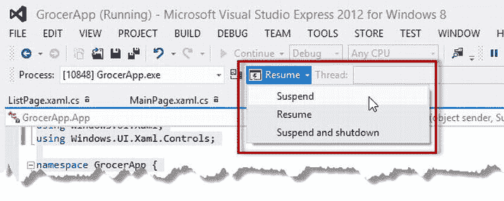
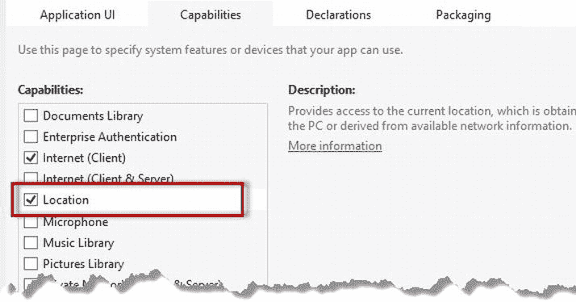
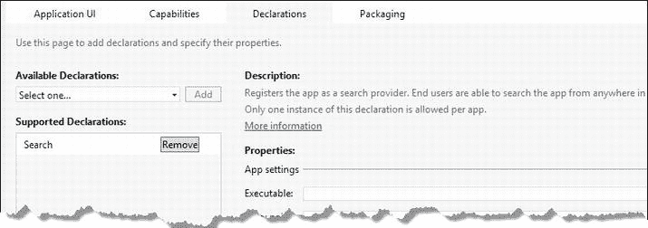
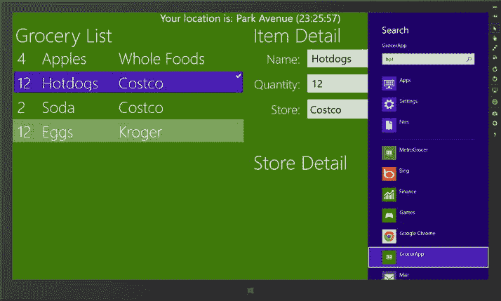

# 我的应用目前没有执行任何会受到应用挂起和恢复影响的任务，但我想向您展示如何测试这些事件

为此，我通过更改视图模型中 `GroceryList` 集合前两个项目的 `Name` 属性来响应 `Suspending` 和 `Resuming` 事件，以指示何时收到这些事件。

## 模拟生命周期事件

模拟生命周期事件最简单的方法是使用 Visual Studio。当您使用调试器启动应用时，Visual Studio 会在工具栏上显示一个菜单，允许您将生命周期事件发送到应用，我在图 5-1 中高亮显示了该菜单。



图 5-1。向应用发送生命周期事件的 Visual Studio 按钮

如果您选择菜单项来挂起然后恢复应用，您将看到视图模型数据的变化，如图 5-2 所示。（直到您恢复应用后，您才会看到这些变化；一旦应用被挂起，将不再处理任何 UI 更新。）


图 5-2。指示已收到生命周期事件

## 测试生命周期事件

模拟生命周期事件的问题在于，您得到的结果与事件自然发生时并不完全相同。要模拟实际情况，您需要在不使用调试器的情况下启动应用，这正是通过视图模型指示已收到事件非常有用的原因。创建触发事件的条件需要一些特定操作，我将在以下部分逐步说明。

### 激活应用

要触发 `activated` 事件，请从 Visual Studio 的 **调试** 菜单中选择 **启动但不调试** 来启动应用。您也可以从 **开始** 屏幕启动应用，无论是在模拟器中还是在本地机器上。关键点在于不要使用调试器启动应用。

### 挂起应用

挂起应用最简单的方法是按下 `Win+D` 切换到桌面。打开 **任务管理器**，右键单击您的应用对应的项目，然后从弹出菜单中选择 **转到详细信息**。**任务管理器** 将切换到 **详细信息** 选项卡，并选中 `WWAHost.exe` 进程，该进程负责运行应用。几秒钟后，**状态** 列中显示的值将从 **正在运行** 变为 **已挂起**，这告诉您 Windows 已挂起该应用。应用将已收到 `Suspending` 事件（但在应用恢复之前，您不会看到相关证据）。

### 恢复应用

切换回应用将恢复它。您将看到视图模型项目显示已收到事件。恢复后的应用状态与挂起时的状态完全相同。您的布局、数据、事件处理程序以及其他所有内容都将保持不变。

您的应用可能已被挂起较长时间，尤其是当设备进入低功耗状态（如睡眠状态）时。网络连接将被您之前通信的任何服务器关闭（因此，当您收到 `Suspending` 事件时，应显式关闭它们），并且在应用恢复时必须重新打开。您还需要刷新可能已过时的数据；这包括位置数据，因为在应用挂起期间设备可能已被移动。

> **提示** Windows 允许用户通过按下 `Alt+F4` 终止应用。没有有用的警告事件让您有机会整理您的数据和操作。相反，Windows 只会终止您的应用进程。

## 添加后台活动

既然我已确认我的应用能够接收并响应 `Resuming` 和 `Suspending` 事件，我可以添加一些需要定期后台任务的功能。在本例中，我将使用地理定位服务来报告当前设备位置。首先，我在 `Data` 项目文件夹中创建了一个名为 `Location.cs` 的新类文件。该文件的内容如清单 5-3 所示。

**清单 5-3.** `Location.cs` 文件

```
using System;
using System.Net.Http;
using System.Threading.Tasks;
using Windows.Data.Json;
using Windows.Devices.Geolocation;

namespace GrocerApp.Data {
    class Location {

        public static async Task<string> TrackLocation() {
            Geolocator geoloc = new Geolocator();
            Geoposition position = await geoloc.GetGeopositionAsync();

            HttpClient httpClient = new HttpClient();
            httpClient.BaseAddress = new Uri("http://nominatim.openstreetmap.org");
            HttpResponseMessage httpResult = await httpClient.GetAsync(
                String.Format("reverse?format=json&lat={0}&lon={1}",
                position.Coordinate.Latitude, position.Coordinate.Longitude));

            JsonObject jsonObject = JsonObject
                .Parse(await httpResult.Content.ReadAsStringAsync());

            return jsonObject.GetNamedObject("address")
                .GetNamedString("road") + DateTime.Now.ToString("' ('HH:mm:ss')'");
        }
    }
}
```

此类使用 Windows 8 的地理定位功能来获取设备位置。此功能通过 `Windows.Devices.Geolocation` 命名空间中的 `Geolocator` 类公开，`GetGeopositionAsync` 方法获取位置的单个快照（而非通过事件提供位置更新，这是 `Geolocator` 类支持的另一种方法）。

> **注意** 新的 C# `await` 关键字表明我已进入并行/异步编程领域。这是一个高级示例，使用任务并行库 (TPL) 来创建和管理后台任务。我不会在这本小书中深入介绍 TPL 和 .NET 并行编程的细节。如果您想了解更详细信息，我建议您参考我的 *Pro .NET 4 Parallel Programming in C#* 一书，其中提供了完整的详细信息。`await` 关键字是 C# 4.5 的新增功能，意思是“等待此异步任务完成。”

一旦获取了设备位置，我会向反向地理编码服务发出 HTTP 请求，这使我能够将地理定位服务中的纬度和经度信息转换为街道地址。地理编码服务返回一个 JSON 字符串，我将其解析为 C# 对象，以便读取街道信息。`TrackLocation` 方法的结果是一个字符串，其中列出了设备所在街道的名称以及指示位置更新时间的时间戳。

> **提示** 我使用了 `OpenStreetMap` 地理编码服务，因为它不需要唯一的帐户令牌。这意味着您无需创建 Google Maps 或 Bing Maps 开发人员帐户即可运行此示例。

## 扩展视图模型

我将扩展视图模型，使其能够跟踪 `TrackLocation` 方法生成的位置数据。这将使我能够使用数据绑定向用户显示数据。清单 5-4 显示了我对 `ViewModel` 类所做的添加。

**清单 5-4.** 更新视图模型以捕获位置数据

```
using System.Collections.Generic;
using System.Collections.ObjectModel;
using System.ComponentModel;


```csharp
namespace GrocerApp.Data {
    public class ViewModel : INotifyPropertyChanged {
        private ObservableCollection<GroceryItem> groceryList;
        private List<string> storeList;
        private int selectedItemIndex;
        private string homeZipCode;
        private string location;

        public ViewModel() {
            groceryList = new ObservableCollection<GroceryItem>();
            storeList = new List<string>();
            selectedItemIndex = -1;
            homeZipCode = "NY 10118";
            location = "Unknown";
        }

        public string Location {
            get { return location; }
            set { location = value; NotifyPropertyChanged("Location"); }
        }

        // ...为简洁起见，省略了其他属性...

        public event PropertyChangedEventHandler PropertyChanged;
        private void NotifyPropertyChanged(string propName) {
            if (PropertyChanged != null) {
                PropertyChanged(this, new PropertyChangedEventArgs(propName));
            }
        }
    }
}
```

## 显示位置数据

我已更新`MainPage.xaml`文件，添加了向用户显示位置数据的控件。数据绑定确保使用视图模型中的当前信息，这意味着无需修改代码隐藏文件。清单 5-5 展示了新增的控件。

**清单 5-5 在 XAML 文件中添加控件以显示位置数据**

```xml
<Page
    x:Class="GrocerApp.Pages.MainPage"
    xmlns=" http://schemas.microsoft.com/winfx/2006/xaml/presentation "
    xmlns:x=" http://schemas.microsoft.com/winfx/2006/xaml "
    xmlns:local="using:GrocerApp.Pages"
    xmlns:d=" http://schemas.microsoft.com/expression/blend/2008 "
    xmlns:mc=" http://schemas.openxmlformats.org/markup-compatibility/2006 "
    mc:Ignorable="d">

    <Page.TopAppBar>
        <AppBar>
            <StackPanel Orientation="Horizontal" HorizontalAlignment="Center">
                <Button x:Name="ListViewButton"
                    Style="{StaticResource AppBarButtonStyle}"
                    AutomationProperties.Name="List View"
                    Content="" Click="NavBarButtonPress"/>

                <Button x:Name="DetailViewButton"
                    Style="{StaticResource AppBarButtonStyle}"
                    AutomationProperties.Name="Detail View"
                    Content="" Click="NavBarButtonPress"/>
            </StackPanel>
        </AppBar>
    </Page.TopAppBar>

    <Grid Background="{StaticResource AppBackgroundColor}">
        <Grid.RowDefinitions>
            <RowDefinition Height="Auto"/>
            <RowDefinition Height="*"/>
        </Grid.RowDefinitions>

        <StackPanel Orientation="Horizontal" HorizontalAlignment="Center" >
            <TextBlock FontSize="30" Text="Your location is:" Margin="0,0,10,0" />
            <TextBlock FontSize="30" Text="{Binding Path=Location}" />
        </StackPanel>

        <Frame x:Name="MainFrame" Grid.Row="1" />
    </Grid>
</Page>
```

## 声明应用功能

应用必须在其清单中声明访问位置服务的需求。在运行更新后的应用之前，请打开`package.appxmanifest`，切换到“功能”选项卡，确保已勾选“位置”功能（如图 5-3 所示），然后保存文件。你的应用还需要“Internet（客户端）”功能，但 Visual Studio 创建项目时默认已声明该功能。



图 5-3 在清单中启用功能

## 控制后台任务

所有基础工作就绪后，我可以转向后台任务的管理以及与生命周期事件的集成——毕竟这些才是本例的核心。清单 5-6 展示了我对`App.xaml.cs`文件所做的更改。

 **注意** 再次强调，这是一个高级示例。如果你不熟悉 .NET 并行编程模型，请跳转到下一节，我将演示如何在应用中实现 Windows 协定。

**清单 5-6 为后台任务更新 App.xaml.cs 文件**

```csharp
using GrocerApp.Data;
using System;
using System.Threading;
using System.Threading.Tasks;
using Windows.ApplicationModel;
using Windows.ApplicationModel.Activation;
using Windows.UI.Core;
using Windows.UI.Xaml;
using Windows.UI.Xaml.Controls;

namespace GrocerApp {

    sealed partial class App : Application {
        private ViewModel viewModel;
        private Task locationTask;
        private CancellationTokenSource locationTokenSource;

        public App() {
            this.InitializeComponent();

            viewModel = new ViewModel();

            // ...为简洁起见，删除了测试数据...

            this.Suspending += OnSuspending;
            this.Resuming += OnResuming;
        }

        protected override void OnLaunched(LaunchActivatedEventArgs args) {
            Frame rootFrame = Window.Current.Content as Frame;

            if (rootFrame == null) {
                rootFrame = new Frame();
                Window.Current.Content = rootFrame;
            }

            if (rootFrame.Content == null) {

                if (!rootFrame.Navigate(typeof(Pages.MainPage), viewModel)) {
                    throw new Exception("创建初始页面失败");
                }
            }
            Window.Current.Activate();
            StartLocationTracking(rootFrame);
        }

        private void OnResuming(object sender, object e) {
            viewModel.Location = "Unknown";
            StartLocationTracking(Window.Current.Content as Frame);
        }

        private void OnSuspending(object sender, SuspendingEventArgs e) {
            StopLocationTracking();
            SuspendingDeferral deferral = e.SuspendingOperation.GetDeferral();
            locationTask.Wait();
            deferral.Complete();
        }

        private void StartLocationTracking(Frame frame) {
            locationTokenSource = new CancellationTokenSource();
            CancellationToken token = locationTokenSource.Token;

            locationTask = new Task(async () => {
                while (!token.IsCancellationRequested) {
                    await frame.Dispatcher.RunAsync(CoreDispatcherPriority.
                    Normal,
                        async () => {
                            viewModel.Location = await Location.
                            TrackLocation();
                        });
                    token.WaitHandle.WaitOne(5000);
                }
            });
            locationTask.Start();
        }

        private void StopLocationTracking() {
            locationTokenSource.Cancel();
        }
    }
}
```

对此类的更改代表了两种不同的活动。第一种是以后台任务的形式追踪用户位置，包含在`StartLocationTracking`和`StopLocationTracking`方法中。我希望你将这两个方法视为黑盒，因为我无法深入探讨我所依赖的 TPL 概念和特性。关键信息是：`StartLocationTracking`方法启动一个后台活动，每五秒报告一次位置；而`StopLocationTracking`方法则取消该任务。

我*真正*想讨论的是如何将这个后台任务与生命周期事件集成。响应应用启动或`Resuming`事件很简单；只需调用`StartLocationTracking`方法即可。

对于`Suspending`事件，我希望确保后台任务在应用挂起前已完成。如果不采取这一步，我就面临两种风险：要么在应用恢复时显示过期数据，要么因尝试读取网络请求（该请求可能已在应用挂起期间被服务器关闭）而导致错误。


# 为了解决这个问题，`SuspendingEventArgs.SuspendingOperation.GetDeferral` 方法会告知 Windows 运行时：我尚未准备好让应用被挂起，还需要一些额外时间。这为我提供了一个短暂的时间窗口来完成任务的等待。`GetDeferral` 方法返回一个 `SuspendingDeferral` 对象，当应用准备好被挂起时，我会调用它的 `Complete` 方法。

请求延迟执行可以为准备挂起状态争取额外的五秒钟时间。这听起来似乎不多，但考虑到 Windows 可能正承受巨大压力，需要让您的应用让出系统资源，这已经显得相当慷慨了。

## 分发 UI 更新

清单 5-6 中另一个值得注意的方面是：

```
. . .
await frame.Dispatcher.RunAsync(CoreDispatcherPriority.Normal,
    async () => {
        viewModel.Location = await Location.TrackLocation();
});
. . .
```

Windows 只允许通过指定的线程来更新 UI 控件；该线程正是用于实例化应用的线程。如果我在后台任务中更新视图模型，由此触发的事件最终会导致错误的线程尝试更新数据绑定并向用户显示位置信息。这将会引发一个异常，并显示如下详细消息：

```
The application called an interface that was marshalled for a different thread
```

我需要确保使用 `Dispatcher` 在正确的线程上推送更新。然而，我的 `App` 类所派生的 `Application` 类中并没有可用的 `Dispatcher` 属性。为了解决这个问题，我使用了在 `OnLaunched` 方法中创建的 `Frame` 控件中的 `Dispatcher`。

## 测试后台任务

剩下的工作就是测试后台任务是否与生命周期事件正确配合。最简单的方法是使用模拟器，它支持模拟位置数据。

首先，在模拟器中定义一个位置（模拟器窗口右侧的某个按钮可以打开“设置位置”对话框，您可以在其中输入位置）。

指定位置后，启动应用，请务必在不使用调试器的情况下启动。几秒钟后，您将看到应用窗口顶部显示的位置信息，如图 5-4 所示。

 **提示** 我在本示例中使用了帝国大厦的坐标。如果您也想这样做，请使用“设置位置”对话框，指定纬度值 40.748 和经度值 -73.98。


图 5-4. 向用户显示位置信息

切换到桌面，使用任务管理器监控应用，直到其被挂起。在应用挂起期间，使用模拟器的“设置位置”对话框更改位置。

恢复示例应用。`Resuming` 事件将重新启动后台任务，确保显示最新数据。

 **提示** 您可能需要授予模拟器和应用访问您位置数据的权限。系统会自动检查所需设置并提示您对系统配置进行必要的更改。

## 实现协定

`Suspending` 和 `Resuming` 并非唯一的生命周期事件。还有其他事件，这些事件被 Windows 用作*协定*体系的一部分，这些协定能让您的应用与操作系统的其他部分更紧密地集成。在本节中，我将演示*搜索*协定，它告诉 Windows 我的应用愿意并且能够使用平台范围的搜索功能。

### 声明对协定的支持

实现协定的第一步是更新清单文件。打开 `Package.appxmanifest` 文件并切换到“声明”选项卡。如果打开“可用声明”菜单，您将看到可以声明支持的协定列表。选择“搜索”并点击“添加”按钮。“搜索”协定将出现在“支持的声明”列表中，如图 5-5 所示。



图 5-5. 声明对搜索协定的支持

忽略该协定中的 `Properties` 部分；这些设置允许您将搜索协定下的义务委托给另一个应用，不过我不会这么做。

### 实现搜索功能

搜索协定的目的是将操作系统搜索系统与您应用中的某种搜索功能连接起来。以我的示例应用为例，我将通过遍历购物清单上的项目，并选择第一个包含用户正在搜索的字符串的项目来处理搜索请求。这不会是最复杂的搜索实现，但它能让我专注于协定本身，而不会被创建大量新代码来处理搜索所困扰。我在 `ViewModel` 类中添加了一个名为 `SearchAndSelect` 的方法，如清单 5-7 所示。

***清单 5-7.** 向视图模型添加搜索支持*

```
using System.Collections.Generic;
using System.Collections.ObjectModel;
using System.ComponentModel;

namespace GrocerApp.Data {
    public class ViewModel : INotifyPropertyChanged {
        private ObservableCollection<GroceryItem> groceryList;
        private List<string> storeList;
        private int selectedItemIndex;
        private string homeZipCode;
        private string location;

public ViewModel() {
            groceryList = new ObservableCollection<GroceryItem>();
            storeList = new List<string>();
            selectedItemIndex = -1;
            homeZipCode = "NY 10118";
            location = "Unknown";
        }

public void SearchAndSelect(string searchTerm) {
            int selIndex = -1;
            for (int i = 0; i < GroceryList.Count; i++) {
                if (GroceryList[i].Name.ToLower().Contains(searchTerm.
                ToLower())) {
                    selIndex = i;
                    break;
                }
            }
            SelectedItemIndex = selIndex;
        }

// ...为简洁起见，省略了属性...

public event PropertyChangedEventHandler PropertyChanged;
        private void NotifyPropertyChanged(string propName) {
            if (PropertyChanged != null) {
                 PropertyChanged(this, new PropertyChangedEventArgs(propName));
            }
        }
    }
}
```

此方法将接收用户正在搜索的字符串。它会查找购物清单中的项目，并将选中项设置为找到的第一个匹配项，如果未找到匹配项，则设置为 `-1`。由于 `SelectedItemIndex` 属性是可观察的，这意味着搜索某个项目将选中它，并在应用布局中显示其详细信息。

我希望 `ListPage` 中的 `ListView` 控件能够选中匹配的项目，因此我对 `ListPage.xaml.cs` 代码隐藏类做了一个小改动，如清单 5-8 所示。

***清单 5-8.** 确保正确显示选中项*

```
. . .
protected override void OnNavigatedTo(NavigationEventArgs e) {

viewModel = (ViewModel)e.Parameter;
```


`ItemDetailFrame.Navigate(typeof(NoItemSelected));<br>    viewModel.PropertyChanged += (sender, args) => {<br>        if (args.PropertyName == "SelectedItemIndex") {<br>            groceryList.SelectedIndex = viewModel.SelectedItemIndex;<br>            if (viewModel.SelectedItemIndex == -1) {<br>                ItemDetailFrame.Navigate(typeof(NoItemSelected));<br>                AppBarDoneButton.IsEnabled = false;<br>            } else {<br>                ItemDetailFrame.Navigate(typeof(ItemDetail), viewModel);<br>                AppBarDoneButton.IsEnabled = true;<br>            }<br>        }<br>    };<br>}`

## 响应搜索生命周期事件

`Application` 类通过为每个协定提供可重写的方法，使得实现协定变得非常容易。清单 5-9 展示了我对 `OnSearchActivated` 方法的实现，当用户通过搜索指定我的应用作为目标时，就会调用该方法。

***清单 5-9.** 响应搜索*

```
using GrocerApp.Data;
using System;
using System.Threading;
using System.Threading.Tasks;
using Windows.ApplicationModel;
using Windows.ApplicationModel.Activation;
using Windows.UI.Core;
using Windows.UI.Xaml;
using Windows.UI.Xaml.Controls;

namespace GrocerApp {

sealed partial class App : Application {
        private ViewModel viewModel;
        private Task locationTask;
        private CancellationTokenSource locationTokenSource;

public App() {
            this.InitializeComponent();

viewModel = new ViewModel();

// ...为简洁起见，省略测试数据...
            this.Suspending += OnSuspending;
            this.Resuming += OnResuming;
        }

protected override void OnLaunched(LaunchActivatedEventArgs args) {
            Frame rootFrame = Window.Current.Content as Frame;

if (rootFrame == null) {
                rootFrame = new Frame();
                Window.Current.Content = rootFrame;
            }

if (rootFrame.Content == null) {

if (!rootFrame.Navigate(typeof(Pages.MainPage), viewModel)) {
                    throw new Exception("无法创建初始页面");
                }
            }
            Window.Current.Activate();
            StartLocationTracking(rootFrame);
        }

protected override void OnSearchActivated(SearchActivatedEventArgs args) {
            viewModel.SearchAndSelect(args.QueryText);
        }

private void OnResuming(object sender, object e) {
            // ...为简洁起见，省略语句...
        }

private void OnSuspending(object sender, SuspendingEventArgs e) {
            // ...为简洁起见，省略语句...
        }

private void StartLocationTracking(Frame frame) {
            // ...为简洁起见，省略语句...
        }

private void StopLocationTracking() {
            locationTokenSource.Cancel();
        }
    }
}
```

这便满足了搜索协定的全部要求；通过重写 `OnSearchActivated` 方法，我使 Windows 能够代表用户搜索我的应用。

### 测试搜索协定

要测试该协定，请启动示例应用。无论是否使用调试器启动都可以。调出超级按钮栏并选择搜索图标。示例应用将自动被选为搜索目标。要开始搜索，只需开始输入。

当您点击文本框右侧的搜索按钮时，Windows 将调用搜索协定并将查询字符串传递给示例应用。您需要搜索能够匹配的内容，因此请输入 `hot`（这样您的搜索将匹配购物清单中的热狗项目）并点击按钮。您将看到类似图 5-6 的内容。



图 5-6。使用协定搜索应用

我确实很喜欢这种协定方式。这是一个非常简单的搜索协定实现，但您可以看到仅用几行代码就能如此轻松地集成到 Windows 中。您可以在我所做的基础上更进一步，完全自定义应用处理和响应搜索的方式。

## 总结

在本章中，我向您展示了如何使用生命周期事件来响应 Windows 管理应用的方式。我描述了关键事件，并向您展示了如何响应这些事件，以确保您的应用能够正确接收和处理它们。

当应用被挂起时，必须特别注意干净利落地结束后台任务，我向您展示了如何通过请求挂起推迟来控制此过程，从而争取额外的几秒钟时间，以最大程度地降低应用恢复时出现潜在错误或陈旧数据的风险。

最后，我向您展示了生命周期事件如何使您能够履行将应用绑定到更广泛的 Windows 平台的协定，以及满足这些协定指定的要求是多么容易。我向您展示了搜索协定，但还有其他几个协定，我建议您花时间全面探索它们。您实现的协定越多，您的应用与 Windows 的其他部分以及其他集成应用的集成度就越高。

在这本书中，我旨在向您展示能够加速您应用开发的核心系统功能。我向您展示了如何使用数据绑定、如何使用主要的结构控件、如何处理贴靠和填充布局、如何自定义应用磁贴，以及在本章中，如何控制应用生命周期。以这些技能为基础，您将能够创建丰富且富有表现力的应用，并在 Windows 8 开发中抢占先机。祝您在应用开发项目中取得圆满成功。

# 索引

 A

- 添加项目浮出控件
- AppBarButtonClick 方法
- 应用程序栏 (AppBar)
    - 添加
    - 按钮样式
    - 字符映射表工具
    - 自定义创建
    - 实现
    - ListPage.xaml 文件
    - StackPanel
    - 向上轻扫手势
    - XAML 文件
    - 弹出窗口
- 应用生命周期事件
    - 后台活动
    - App.xaml.cs 文件
    - Geolocator 类
    - GetDeferral 方法
    - Location.cs 文件
    - 位置数据
    - 清单
    - 恢复和挂起
    - 恢复事件
    - StopLocationTracking 方法
    - 挂起事件
    - 测试
    - TrackLocation 方法
    - 用户界面更新
    - ViewModel 类
    - 地理定位功能
        - 模拟
        - 测试
    - Visual Studio 事件代码
    - Windows 应用
- App.xaml.cs 文件
- AutomationProperties.Name 属性

 B

- BottomAppBar 属性
- ButtonClick 方法


# 索引

- `C`
  - `点击事件处理函数`
  - `合同`
  - `应用程序类`
  - `声明`
  - `定义`
  - `搜索功能`
  - `测试`

- `D`
  - `数据绑定与页面`
  - `动态插入`
  - `ComboBox 控件`
    - `实现`
    - `ItemDetail.xaml 文件`
    - `资源字典`
    - `切换`
    - `功能`
    - `插入`
  - `Frame 控件`
  - `ListPage.xaml.cs 文件`
  - `Navigate 方法`
  - `NoItemSelected.xaml`
    - `主布局`
  - `AppBackgroundColor`
  - `App.xaml.cs`
  - `App.xaml 文件`
    - `构造函数`
    - `数据源`
    - `声明`
    - `定义`
    - `设计图面`
    - `Grid 控件`
    - `GroceryListItem`
    - `ItemTemplate 属性`
    - `ListPage.xaml.cs 文件`
    - `ListPage.xaml 文件`
    - `微观级属性`
    - `资源字典`
    - `SelectedIndex 属性`
    - `StaticResource`
    - `Style 属性`
    - `Text 属性`
    - `Windows 应用`
    - `XAML`
  - `MVC`
  - `MVVC`
  - `模拟器`
  - `视图模型`
    - `类实现`
    - `定义`
    - `GroceryItem 类`
    - `INotifyPropertyChanged`
    - `ObservableCollection 类`
    - `可观察属性`
    - `Windows 应用 UI 控件`
  - `DataContext 属性`
  - `DetailPage_SizeChanged 方法`
  - `DisplayMemberPath 属性`

- `E`
  - `事件处理方法`

- `F`
  - `浮出控件`
    - `AddItemFlyout.xaml.cs 文件`
    - `AddItemFlyout.xaml 文件`
    - `应用栏按钮`
    - `DataContext 属性`
    - `声明`
    - `Frame 控件`
    - `JavaScript Windows 8`
    - `ListPage.xaml.cs 文件`
    - `ListPage.xaml 文件`
    - `弹出控件`
    - `位置`
    - `显示与隐藏`
    - `用户控件`
  - `自定义样式`
    - `定义`


-   `HomeZipCodeFlyout.xaml`
-   `HomeZipCodeFlyout.xaml.cs` 文件
-   `Popup` 控件
-   `Width` 和 `Height` 属性
-   XAML 元素
-   `ViewModel` 对象
-   `Frame.Navigate` 方法
-   `Frame.Navigate` 模型
-   `GetDeferral` 方法
-   `GetGeopositionAsync` 方法
-   `GrocerApp`
-   `HandleItemChange` 方法
-   `HomeZipCode`
-   `HomeZipCodeFlyout` 类
-   `HomeZipCodeFlyout.xaml` 文件
-   `HomeZipCode` 属性
-   `IsChecked` 属性
-   `IsLightDismissEnabled` 属性
-   横屏与竖屏模式
-   `MainPage` 类
-   Microsoft Windows 8
-   AppBars、Flyouts 和 NavBars
-   代码片段
-   数据、绑定和页面
-   特性
-   `GrocerApp`
-   关键技术
-   布局与磁贴
-   生命周期与合约
-   项目元素
-   `App.xaml.cs` 文件
-   `App.xaml` 文件
-   内容
-   创建
-   `MainPage.xaml` 文件
-   `Package.appxmanifest`
-   `StandardStyles.xaml` 文件
-   运行与调试
-   断点
-   按钮
-   本地计算机
-   远程计算机
-   Visual Studio 模拟器
-   所需软件
-   Visual Studio 2012
-   WPF/Silverlight 项目
-   XAML 概述
-   Button 元素
-   C# 类
-   配置
-   事件处理方法
-   特性
-   `MainPage.xaml.cs` 文件
-   .NET 类
-   分部类
-   `StackPanel`
-   样式
-   Visual Studio 设计图面
-   模型-视图-控制器 (MVC)
-   模型-视图-视图控制器 (MVVC)
-   `Navigate` 方法
-   导航栏 (NavBar)
-   `DetailPage.xaml` 文件
-   测试
-   包装器
-   `App.xaml.cs` 文件
-   `MainPage.xaml.cs` 文件
-   `MainPage.xaml` 文件
-   机制
-   `ViewModel` 对象
-   `ObservableCollection` 类
-   `OnLaunched` 方法
-   `OnNavigatedTo` 方法
-   `OnSearchActivated` 方法
-   `Package.appxmanifest` 文件
-   `Page.BottomAppBar` 属性
-   `Page.TopAppBar` 属性
-   `PopupTextStyle` 样式
-   `Resources/GrocerResourceDictionary.xaml` 文件
-   `SelectedItemIndex`
-   `SetItemDetail` 方法
-   `ShowRelativeToAppBar` 方法
-   贴靠与填充功能
-   `StandardStyles.xaml` 文件
-   `StartLocationTracking` 方法
-   静态宽磁贴
-   `StopLocationTracking` 方法
-   `SuspendingEventArgs.SuspendingOperation.GetDeferral` 方法
-   `System.Diagnostcs.Debug.WriteLine` 方法
-   磁贴模型
-   磁贴与锁屏提醒
-   创建
-   API 文档
-   `ListPage` 类
-   本地计算机
-   `MainPage` 类
-   粘性
-   `UpdateTile` 方法
-   XML 片段
-   XML 模板
-   动态创建
-   摩擦与挫折
-   `MainPage` 类
-   数字与图像锁屏提醒
-   静态图标
-   静态改进
-   宽形与方形
-   `TrackLocation` 方法
-   `TryUnsnap` 方法
-   视图
-   代码更改
-   `DetailPage.xaml` 文件
-   `DetailViewLabelStyle`
-   贴靠或填充的应用
-   `TryUnsnap` 方法
-   XAML 更改
-   Visual Studio 事件代码
-   XAML 语法

