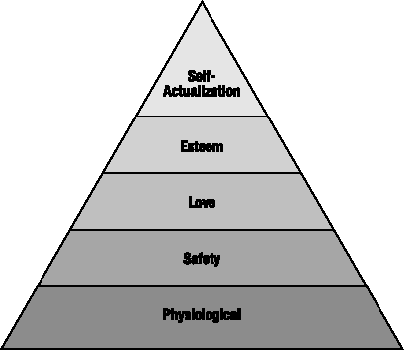
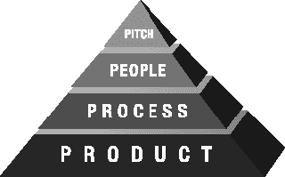
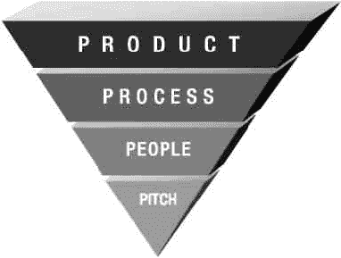

# 第 1.0 章

马克斯当时一团糟。我们在萨拉托加的 Basin 酒吧喝第三杯莫吉托时，他一股脑儿全倒了出来。过去 72 小时里，他经历了这些：

*   在洛杉矶花了两天时间照看客户的数据库。
*   只睡了四个小时。
*   在手机上跟妻子大吵了两架。
*   跟老板开了一场马拉松式的电话会议，结果两天后又要去芝加哥出差。

也许是莫吉托在起作用，但听起来马克斯确信他妻子要离开他；他的公司即将崩溃；距离精神崩溃，他只差 12 小时和一趟航班。

他说：“发布一个 1.0 产品不会要你的命，但它会试图要你的命。”

## 理解 1.0

作为一名软件开发人员，你的职业生涯中总会在某个时刻陷入困境。我的建议是保持思考，不要大喊大叫，善待你的同事，你就会没事。这是宝贵的经验，但跟 1.0 相比，不值一提。

1.0 就是开发一个全新产品的第一个版本。这正是所有初创公司此刻正在忙碌的事情。他们正在某个足够好的 1.0 想法上努力，以至于少数聪明人愿意放弃自己的生活，来支持这个可能正确的机会。*你看，* 我们有个很棒的想法。我们是亿万富翁，我们是对的。

那些初创公司大多数都失败了。

在“操蛋公司”网站出现之前，失败是一件安静而悲哀的事。互联网泡沫的爆发让巨大的失败成为头条新闻，每个人都发现了我们大多数人早已知道的事实。

真的。大多数初创公司都失败了。

为什么？

要理解 1.0 的困难，我需要给你一个模型，来理解一个 1.0 软件产品究竟是如何出现的。我设计了这个模型，它大量借鉴了一个名为 `Maslow's Hierarchy of Needs` 的理论，这个理论本身就值得单独讨论。

`Maslow's` 理论认为，随着人类满足基本需求，他们会寻求满足一个层级结构中逐步更高的需求，如图 Figure 19-1 所示。

Figure 19-1 `Maslow's Hierarchy of Needs`

金字塔最底层是最大的需求区域：生理需求。这些是基本需求：食物、水、空气、睡眠等。其理念是，如果这些需求得不到满足，你就无法专注于层级中的任何其他事物。可以这样理解：如果你无法呼吸，谁还在乎坠入爱河呢？

往上一层，你有安全需求、爱与归属感、尊重，最后是金字塔顶端那个名字奇怪的“自我实现”，这是我们发挥独特本能、充分利用自身能力的内在需求。翻译过来就是：作家写作，歌手歌唱。

如果你对我的介绍感兴趣，维基百科上有一篇关于 `Maslow's hierarchy` 的优秀词条（参见 [`en.wikipedia.org/wiki/Maslow’s_hierarchy_of_needs`](http://en.wikipedia.org/wiki/Maslow's_hierarchy_of_needs)）。就我个人而言，作为人类的管理者，我在处理处于边缘状态的人时会盯着这个层级图。这个层级图让我洞察到一个人究竟在什么地方感到压力。他们需要职业建议吗？（容易。）还是需要婚姻建议？（更难。）

## Rands 的 1.0 层级图

在思考 1.0 的困难时，我意识到 `Maslow's` 模型也适用于发布产品的第一个版本。存在一个层级图，定义了构建和发布 1.0 所需完成的工作，如图 Figure 19-2 所示。

Figure 19-2 `Rands 1.0 Hierarchy`

关于图表和图形的说明：Borland 的创始人菲利普·卡恩讲过一个关于统计的精彩故事，我认为同样适用于图表和图形。故事是：“你知道吗，有一个统计事实是脚大的人拼写更好？[此处应有惊叹] 这是因为脚大的人年龄更大。”

图表以清晰、线性的方式描绘世界，服务于一个目的：支持作者的信息。不要相信图表，但也不要因为缺乏信任而忽略了故事背后的意图。

### 构思

在层级图的顶端，是你的伟大想法。我称之为“构思”，因为我正在玩头韵的把戏。没有绝妙的构思，你在构建产品或公司方面将一事无成。即使你魅力四射也没用；你必须先有想法，因为它定义了其下所有内容的结构和约束。如果你没有想法，你就不知道要雇佣谁，这是第二层——人员。

在讨论第二层之前，我先祝贺你。我欣喜若狂，因为你发现了“下一件大事”，但有些基本事实需要注意。首先是：

*事实 #1：你时间紧迫。别忘了这一点。*

如果你认为你的构思拥有独家权利，那你就是个傻瓜。有太多聪明人正盯着完全相同的、不断演变的海量信息，认为你的创新是原创的。唯一能赋予你这个权利的是交付 1.0，而首先，你需要一些人手。

### 人员

手握你的构思，你要去找人来构建你的想法。这些人就是你的创始人。他们不仅会构建你的 1.0，更重要的是，他们会构建你的工程文化。他们的到来给这个金字塔带来了挑战和转折。

你最初雇佣的几个人面对的是一张白纸。是的，他们相信这个构思——否则他们就不会加入——但现在这也是他们的构思了，这意味着他们会提出尖锐的问题，因为他们也投入了精力。这些尖锐的问题将帮助他们开始为最终产品做出决策。

作为球场管理者，你会努力保持参与感，但不可能事事亲力亲为。你的职责是持续观察与倾听，以便察觉团队成员的决策和行动如何悄然改变你的球场。这引出了我们的转折点。兰德斯 1.0 需求层次比马斯洛需求层次更令人恐惧，因为它看起来确实像图 19-3 所示。

图 19-3 真实的兰德斯 1.0 需求层次

人们不按这种方式搭建金字塔是有充分理由的——它们会倒塌。唯一保持它们不倒的方法，是不断向某一侧施力。这就是你的初创公司。一个不切实际的概念，你的球场位于底层，定义着其上的一切。在 1.0 阶段，最让你头疼的将是花费大量时间维持金字塔平衡，这又将我们带回当前的主题：人员。另一个基本事实：

*事实#2：没有谁是不可替代的。*

我本人很擅长处理人际关系。整本书都在探讨如何确保大家和睦相处并高效完成任务，但这里谈论的并非成熟公司。我们讨论的是 1.0 阶段，规则截然不同，因为你是未知变量，所有人都预期你会失败。

你生过火吗？需要什么？一根火柴、一些纸和易燃的引火柴。你的最初三位员工就是引火柴。他们的职责不是定义产品路线图，而是推动事情运转；如果停滞不前，你就需要添加更多木柴。

在我的初创公司，我是以首位工程经理的身份被引入的。创始人招来了两位性格截然不同的自由电子（详见第 38 章）。一位在夜以继日地制作可运行的原型。他完全清楚我们最终会推倒重来，但他明白，用代码实现想法将改变所有人对所做之事的看法，让球场变得真实。

另一位电子也热爱这个球场，但他却在为未来产品搭建基础架构。*他在干什么？* 是的，我们还没有产品，关键员工却已在投资未来。什么时候投资未来是个坏主意？当"当下"尚未明确时，答案就是这样。第二位自由电子假设 1.0 会成功，虽然我欣赏他的热情，但请记住*事实#0：初创公司几乎注定失败。*

我与第二位自由电子谈过话，正如那些执着的聪明人常有的表现，他显然不为所动，于是我解雇了他。就在当天。与副总裁简短会议后，事情就结束了。

正如你将在第 38 章学到的，这类出色的工程师并不常见。对大多数公司而言解雇一位自由电子相当愚蠢，因为他们潜力巨大，但关键在于：在 1.0 完成之前，你根本不算公司。让初创金字塔摇摇欲坠的一个好方法，就是雇用那些缺乏紧迫感、无法推进产品进度的人。先完成 1.0，再操心后续。

### 流程

没有什么词比*流程*更让工程师恼火了。现在就试试。把所有人叫到办公室说："我定义了一个新流程来辅助缺陷分类。"看看他们垂下的脸。他们听到的是"无用功"。他们想的是"管理层又在刷存在感"。

这并不是定义等级制度第三层的词汇。那个词是*沟通*。

*事实#3：流程定义了沟通。*

流程是团队沟通的方式。无论是通过维基、电子邮件还是走廊交谈，任何大于一人的团队都需要定义信息共享的方式。这不是在鼓吹规格说明、文档或写满注意事项的白板。你只需要就信息共享方式达成一致。

当你的第二位工程师决定"是的，我要在维基中记录设计决策"时，这就是流程。当第三位工程师开始在那块会议室的巨大白板上追踪缺陷时，这也是流程。它不必完美，甚至不必得到普遍认同，只要它固定在一个所有人都能看到的地方即可。

微软的 SourceSafe 是我第一家初创公司时的首选代码库。别笑。对于六人工程师团队而言，它表现得不错，这些人根本没时间操心源码控制。当然，它慢得要命，还因各种小故障时不时丢失一天的工作成果，但我们在做 1.0，谁有空考虑更可靠的方案呢？

罗兰德会。

罗兰德是一位初级工程师，也是 Perforce 的粉丝。罗兰德做了任何优秀初创员工都会做的事。用一个周末时间，他搭建了 Perforce 服务器，重写了所有构建工具，并在下周一上午 10 点安排了会议，承诺提供 Krispy Kreme 甜甜圈。他的信息是："就这样了。一切运行得更好。谢谢，请吃甜甜圈。"

一个周末，罗兰德修复了我们流程中的重大缺陷（糟糕的工具），并揭示了层次结构的另一个事实：

*事实#4：每一层都塑造并影响着其邻近层。*

金字塔健康的明确标志是某一层侵入另一层。想象一下，对人员、流程和球场的每一次改变，都是朝一个方向的一次推动。这种移动需要其他层做出补偿，否则整个结构就会倒塌。罗兰德改变工程流程的决定惹恼了一些人。我们因罗兰德未曾考虑的一些源码管理边缘情况损失了一些时间，但一周内我们就调整过来了。即使是反对最激烈的人，最终也跑到罗兰德办公室争论如何能做得更好。

如果你的组织中，金字塔没有不断调整以保持直立，那就出问题了。如果新员工不检验球场，要么是他们不买账，要么是他们不理解。如果工程师们不*一直*争论开发软件的方式，他们就会停滞不前，这会向下影响你的球场，向上影响你的产品。

1.0 阶段一个重大的停滞预警信号，是有人决定创建一张组织结构图，标明"谁负责什么"。投资者和外部人士需要这张图来判断你是否靠谱，但你的 1.0 团队不需要。角落里那张列出谁在做什么的白板，就是你的组织结构图。组织结构图所描绘的层级定义，是在组织中创造保密文化的第一步。这对苹果也许有效，但你还不是苹果。你是希望与汗水。

### 产品

到某个时候，你需要假装完成了。你需要发布一个看起来几乎不像球场的东西，因为只有在陌生人盯着某个东西时，你才算有了产品。

*事实#5：没有产品，就不算公司。*

产品不是球场。球场是三句话的想法，它让你赢得信任去雇用人员。人员讨论球场，他们创建流程来完善和开发球场，这改变了球场。在这过程中，金字塔摇摇晃晃。也许它完全倒塌，你手忙脚乱地重新堆叠这些层级。干得好。你仍然没有产品。

