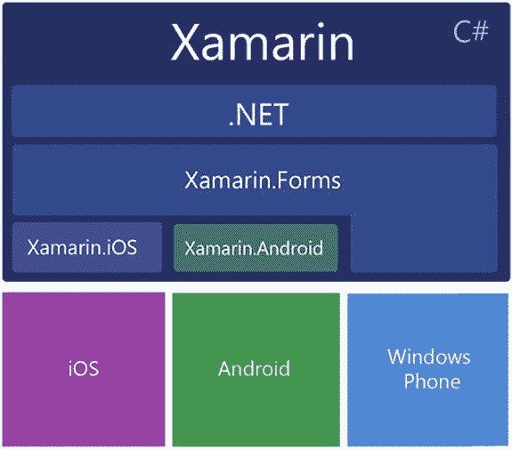

# 使用 Xamarin 进行移动开发

用 C# 进行移动开发与以往大多数人使用该语言的方式截然不同。我们用它来开发非 Windows 平台的应用，即 Android 和 iOS。这既是机遇也是挑战。机遇在于，我们能接触到构成由不同平台和尺寸的手机与平板电脑组成的新业务应用生态系统的丰富技术。挑战在于，这些设备和平台的许多方面对我们来说都是崭新的，需要学习很多知识。当然，我们也可以用 C# 构建 Windows Phone 和平板电脑应用。跨平台开发的本质是构建能在多个移动操作系统上运行的应用：例如，在 Android 和 iOS 上；或在 iOS 和 Windows Phone 上；亦或在 iOS、Android 和 Windows Phone 上。通过运用本书涵盖的跨平台技术，你将具备为所有主流移动平台进行开发的能力！

这段旅程中最令人兴奋/畏惧的部分是掌握多个操作系统的来龙去脉。幸运的是，Xamarin 为我们屏蔽了许多细节，封装了平台特定的 API，并通过 C# 展示了熟悉的 .NET 框架。反过来，我们得以详细了解每个平台由 C# 封装的用户界面（UI）API，从而精确控制应用的可视化设计。关键在于弄清楚在开发过程中，每个操作系统的哪些方面是重要的，哪些可以交由 Xamarin 处理。虽然深入理解总是有益的，但时间有限，最重要的是，我们需要交付可运行的软件。

关键问题如下：我们应如何着手开发跨平台移动应用？鉴于我们在 C# 开发方面已有的经验和背景，如何将这些知识传承并在移动领域加以利用？最后，鉴于需要学习这么多关于这些操作系统的知识，我们需要掌握哪些内容才能入门并帮助解决重要挑战？

在编写跨平台应用时，一个关键目标是代码重用。重用的越多，项目就越快、成本越低，维护成本也越低。Xamarin 将此称为移动开发的独角兽：一次编写，到处部署。任何寻找独角兽的旅程都始于一位能吸引它出现的美丽少女。我们的美丽少女就是跨平台设计。

让我们探索 Xamarin 如何在追求跨平台设计的同时帮助我们解决移动开发难题。

## 什么是 Xamarin？

Xamarin 是一个开发平台，允许我们用 C# 编写原生的、跨平台的 iOS、Android 和 Windows Phone 应用。

它是如何做到的呢？请继续阅读。

### 封装的原生 API

Xamarin 平台源自将 .NET 引入 Linux 的开源 Mono 项目，它将 .NET 移植到 iOS 和 Android 操作系统，并支持 Windows Phone（见图 1-1）。`Xamarin.Android` 底层是 Mono for Android，而 `Xamarin.iOS` 底层是 `MonoTouch`。这些是原生 Android 和 iOS API 的 C# 绑定，用于移动设备和平板电脑的开发。这赋予我们使用 Android 和 iOS 用户界面、通知、图形、动画以及位置和摄像头等电话功能的能力——全部通过 C# 实现。每次 Android 和 iOS 操作系统发布新版本，都会伴随一个包含新 API 绑定的 Xamarin 新版本。Xamarin 的 .NET 端口包含数据类型、泛型、垃圾回收、语言集成查询（LINQ）、异步编程模式、委托以及 Windows Communication Foundation（WCF）子集等功能。库通过链接器进行管理，只包含引用的组件。`Xamarin.Forms` 是构建在其他 UI 绑定和 Windows Phone API 之上的一层，提供了一个完全跨平台的 UI 库。

图 1-1. Xamarin C# 库绑定到原生 OS SDK 以及 .NET

因此，我们拥有了一个包含 iOS 和 Android C# 绑定库并支持 Windows Phone 的 .NET 环境，可运行在我们选择的移动操作系统上。太棒了。那么，我们如何使用这些库构建 UI 并编写代码来创建移动应用呢？当然是使用开发环境和 UI 设计器。

### 开发环境

Xamarin 提供了开发环境和设计器，帮助我们在 Windows 或 Mac 上构建移动应用。Xamarin 开发环境的两个主要选择是：Mac 或 Windows 上的 Xamarin Studio，或者 Windows 上安装了 Xamarin for Windows 插件的 Visual Studio。即使使用 Visual Studio 作为开发环境，编译 iOS 应用也始终需要一台 Mac。

### UI 设计器

用于创建移动用户界面的工具称为设计器。它们会以其各自的专有文件格式生成可扩展标记语言（XML）文件。Xamarin 提供两种设计器：

- Xamarin Designer for Android
- Xamarin Designer for iOS

有了这些设计器，对原始原生 XML 编辑器的需求就降低了。构建 Android 或 iOS UI 所需的任何东西都可以在 Xamarin 的工具中找到。然而，iOS 开发者仍然经常使用 Xcode Interface Builder，而 Android 开发者（较少地）使用诸如 Eclipse 的 Android Development Tools（ADT）插件等 XML 编辑器。XML 布局始终就是 XML 布局，选择何种工具很大程度上取决于品味和个人偏好，甚至是否使用设计器工具本身也是如此。一些 Xamarin 开发者选择完全不用设计器，而是手动用 C# 为所有平台编写 UI 代码。我建议使用设计器来帮助学习文件格式、UI 元素及其属性。至少，像使用辅助轮一样使用设计器工具，直到你准备好自由骑行。

> **注意：** 本书侧重于代码而非工具。有关设计器和开发环境的更多信息，请参考 Xamarin 在线文档：[`developer.xamarin.com`](http://developer.xamarin.com)。

## 熟悉的部分：熟悉的 C# 和 .NET 技术

Xamarin 开发使我们能够利用许多已经了解的 C# 开发知识。我们可以运用以下方面的顶层知识：

- 基于 HTML 的页面
- 可扩展应用程序标记语言（XAML）
- UI 控件
- 事件驱动逻辑
- 视图生命周期
- 状态管理
- 数据绑定
- Web 服务

我们也可以直接、即时地使用许多 .NET 特定的技术，包括：

- .NET 数据类型
- C# 类、方法和属性
- Lambda 表达式
- WCF（子集）
- 泛型（子集）
- 本地文件访问
- 流
- Async/Await
- ADO.NET（子集）

我只列举了一小部分，所以你可以看到，对于 C# 开发者来说，这里有大量熟悉的基础，可以帮助我们成功跨入这个新领域。

