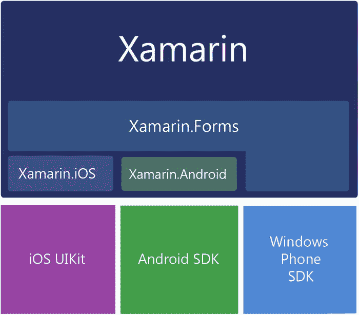
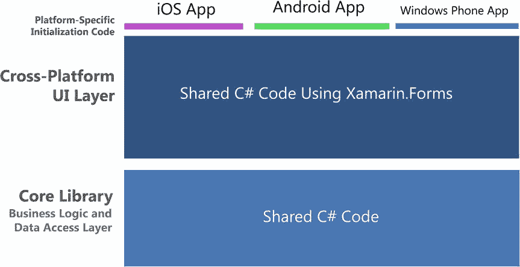
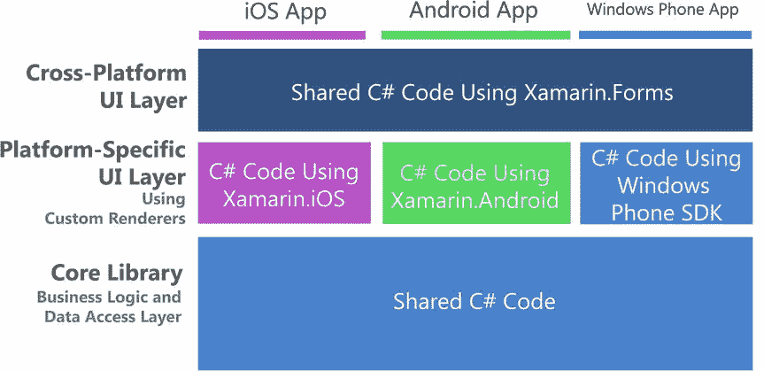

# 构建移动用户界面

在使用 Xamarin 进行移动 UI 开发时，我们的屏幕及其控件、图像、动画和用户交互都在手持设备上原生运行。移动 UI 屏幕有多种同义词，例如视图和页面，这里会互换使用。视图可以指一个屏幕，但在某些上下文中也可以指代一个控件。

使用 Xamarin 构建移动 UI 有两种标准方法：

- Xamarin.Forms 是一个适用于 Android、iOS 和 Windows Phone 的跨平台 UI 库。
- 平台特定（或原生）UI 方法则使用 Xamarin.Android、Xamarin.iOS 和 Windows Phone SDK。

本章将涵盖这两种方法，并定义构成每种方法的平台特定组件。我们将讨论何时使用 Xamarin.Forms 有用，以及何时更平台特定的方法可能更合适。然后，我们将深入探讨如何使用页面、布局和视图来构建 Xamarin.Forms UI。我们将创建一个包含共享项目和平台特定项目的 Xamarin.Forms 解决方案。在向项目添加 Xamarin.Forms 控件时，我们将接触基本的 UI 概念，例如图像处理和在布局中格式化控件。

让我们从讨论 Xamarin.Forms 开始。

## 理解 Xamarin.Forms

Xamarin.Forms 是一套跨平台 UI 类的工具包，构建在更基础的平台特定 UI 类：Xamarin.Android 和 Xamarin.iOS 之上。Xamarin.Android 和 Xamarin.iOS 提供了映射到各自原生 UI SDK（iOS UIKit 和 Android SDK）的类。Xamarin.Forms 也直接绑定到原生的 Windows Phone SDK。这提供了一套跨平台的 UI 组件，可以在三个原生操作系统中各自渲染（见图 2-1）。

图 2-1. Xamarin 库绑定到原生操作系统库

Xamarin.Forms 提供了一套跨平台的页面、布局和控件工具包，是开始快速构建应用的良好起点。这些 Xamarin.Forms 元素是使用可扩展应用程序标记语言（XAML）构建的，或者使用 C# 编码，利用 `Page`、`Layout` 和 `View` 类。该 API 提供了广泛的、内置的跨平台移动 UI 模式。从最高层次的 `Page` 对象开始，它提供了熟悉的菜单页面，例如用于分层级联菜单的 `NavigationPage`、用于选项卡菜单的 `TabbedPage`、用于制作导航抽屉的 `MasterDetailPage`、用于滚动图像页面的 `CarouselPage`，以及用于创建自定义页面的基类 `ContentPage`。布局涵盖了我们在各种平台上使用的标准格式，包括 `StackLayout`、`AbsoluteLayout`、`RelativeLayout`、`Grid`、`ScrollView`，以及作为基础布局类的 `ContentView`。在这些布局中，使用了几十个熟悉的控件或视图，例如 `ListView`、`Button`、`DatePicker` 和 `TableView`。其中许多视图都内置了数据绑定选项。

Xamarin.Forms 包含平台无关的类，这些类会绑定到其原生的平台特定对应物。这意味着我们几乎可以在不了解 iOS 和 Android UI 的情况下，为所有三个平台开发基本的原生 UI。值得庆幸，但也需警惕！纯粹主义者警告说，在不了解原生 API 的情况下尝试为这些平台构建应用是鲁莽之举。让我们注意他们担忧的本质。我们必须对 Android 和 iOS 平台、它们的演变、特性、特质以及版本更新保持浓厚的兴趣。同时，我们也可以尽情享受 Xamarin.Forms 这个令人惊叹的跨平台抽象所带来的便利与天才设计！

> **注意：** 在撰写本文时，像登录屏幕、简单列表和某些业务应用这样的基本页面非常适合直接使用 Xamarin.Forms。可以在 Xamarin.Forms 项目中利用平台特定代码来增加功能，但该库的每个后续版本都将允许我们构建更复杂的屏幕，而无需使用平台特定代码。

### Xamarin.Forms 解决方案架构

Xamarin.Forms 最大的优势之一是它使我们能够同时为多个平台开发原生移动应用。图 2-2 显示了一个为 iOS、Android 和 Windows Phone 开发的跨平台 Xamarin.Forms 应用的解决方案架构。本着良好架构和可重用性的精神，Xamarin.Forms 跨平台解决方案通常使用包含业务逻辑和数据访问层的共享 C# 应用程序代码，如图中底层所示。这通常被称为核心库。跨平台 Xamarin.Forms UI 层同样是 C#，在图中被描绘为中间层。顶部的薄虚线层是平台特定项目中极少量的平台特定 C# UI 代码，用于在每个原生操作系统中初始化和运行应用。

图 2-2. Xamarin.Forms 解决方案架构：一个应用，三个平台

图 2-2 经过简化，以传达 Xamarin.Forms 的基本原理。现实情况是，Xamarin.Forms 和平台特定代码之间的混合是可能的、有用的，并且是受到鼓励的。它可以在多个层面上发生。首先，在 Xamarin.Forms 自定义渲染器中，这是一个用于在 Xamarin.Forms 页面上渲染平台特定功能的平台特定类。混合也可以发生在与 Xamarin.Forms 页面并行运行的平台特定 Android Activity 和 iOS 视图控制器中，或者发生在按需调用的平台特定类中，以处理原生功能，例如位置、相机、图形或动画。这种复杂的方法可能导致更复杂的架构，如图 2-3 所示，必须小心处理。注意已添加的平台特定 UI 层。

图 2-3. 带有自定义渲染器的 Xamarin.Forms 架构

> **注意：** 第 8 章提供更多关于在 Xamarin.Forms 解决方案中使用自定义渲染器和平台特定代码的信息。

何时适合使用 Xamarin.Forms，以及何时考虑其他 Xamarin 选项？我将在本章稍后部分回答这个关键问题，但首先，让我们定义一下 Xamarin 的平台特定 UI 选项。

