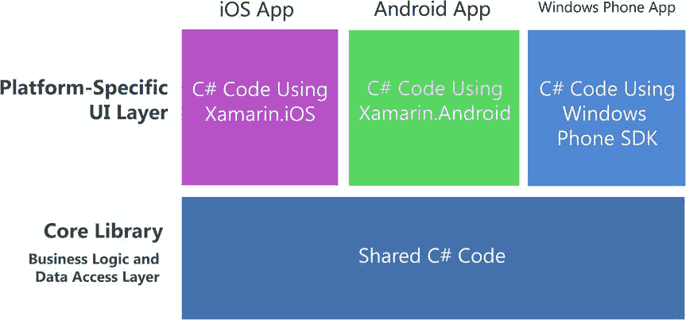
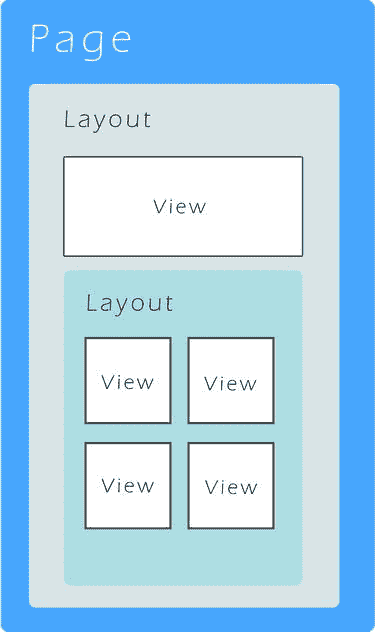
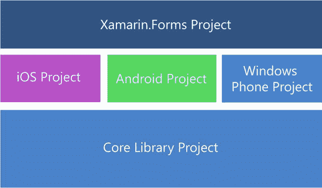
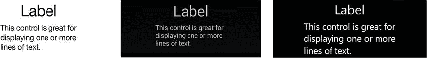
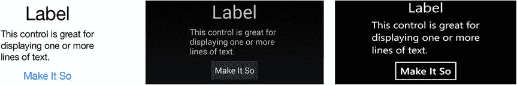
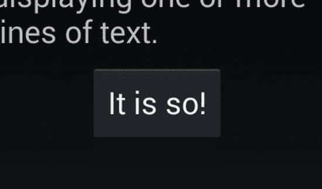
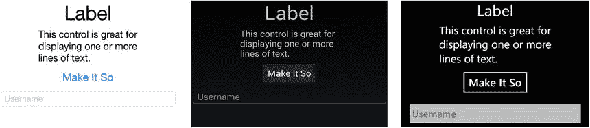
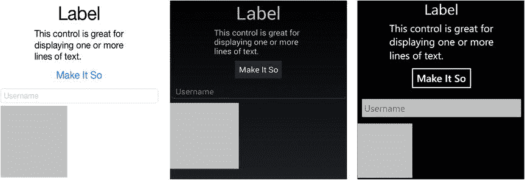
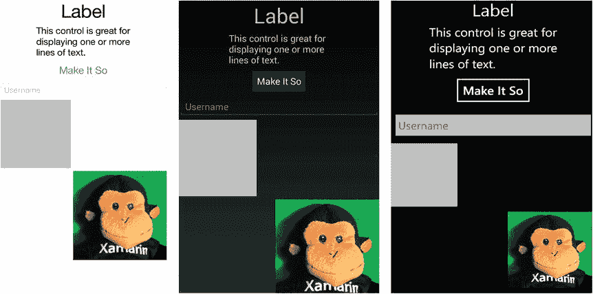
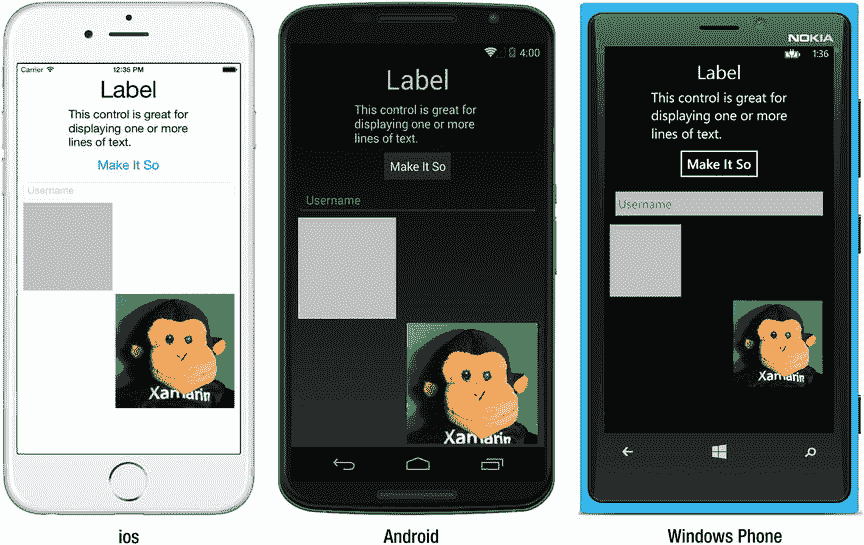

# 理解平台特定 UI 方法

在 Xamarin.Forms 出现之前，存在平台特定（或称原生）UI 选项，其中包括 Xamarin.Android、Xamarin.iOS 和 Windows Phone SDK 库。使用平台特定 UI 构建屏幕需要对这些库所暴露的原生 UI 有一定了解。我们无需直接使用 iOS UIKit 或 Android SDK 进行编码，因为通过 Xamarin 在 C# 中的绑定机制，我们位于其上层。而使用 Windows Phone SDK 则是在 C# 中直接针对 Windows Phone SDK（一个 C# 库）进行原生编码。使用 Xamarin 平台特定 UI 的优势在于，这些库成熟且功能完善。每个原生控件和容器类都拥有大量属性和方法，而 Xamarin 的绑定机制直接暴露了其中许多功能。

**注意：** 此处讨论的不是直接使用 Objective-C 或 Java 进行原生 UI 开发，而是通过 Xamarin C# 平台特定绑定来使用原生 UI 库。为避免混淆，本书在指代 Xamarin 库时偏好使用术语*平台特定*而非*原生*，但 Xamarin 开发者有时也会用*原生*来指代使用 `Xamarin.iOS` 和 `Xamarin.Android` 这类平台特定库的情况。

## 平台特定 UI 解决方案架构

图 2-4 展示了旨在跨平台的平台特定解决方案如何共享包含业务逻辑和数据访问层的 C# 应用程序代码，这与 Xamarin.Forms 解决方案类似。但 UI 层则完全不同：它完全是平台特定的。这些项目中的 UI C# 代码所使用的类都直接绑定到原生 API：即直接（无需额外绑定层地）对接 iOS、Android 或 Windows Phone API。



*图 2-4. 平台特定 UI 解决方案架构*

如果将此图与图 2-2 中的 Xamarin.Forms 图进行比较，你会发现此处需要编写更多的代码：需要为每个平台分别构建 UI，而不是一个 UI 适用于所有平台。为什么有人会选择这种开发方式呢？实际上，有不少充分的理由说明为什么部分甚至全部代码采用这种方式会更好。关于那个迫切的问题*我该选哪个，Xamarin.Forms 还是 Xamarin 平台特定 UI？*，请参阅本章稍后的“选择 Xamarin.Forms 或平台特定 UI”部分。

但首先，让我们深入探讨 Android 和 iOS 的绑定机制，然后再了解 Windows Phone SDK。

### Xamarin.Android

Xamarin.Android C# 绑定让我们能够接入 Android API。Android 应用主要由布局和活动构成，大致可理解为视图和控制器。布局通常是使用 UI 设计器编辑的 XML 文件(`.axml`)，用于定义屏幕上显示的控件。`Activity` 是一个类，通常管理单个布局的生命周期，但更小的布局（称为片段）可以组合起来构成一个屏幕。

在 Android 术语中，控件被称为视图：例如 `Buttons`、`TextViews`、`ListViews` 等。我们将这些控件放置在另一种布局（即包含控件的容器控件）上，其作用类似于 HTML 中的 `<div>`：例如 `LinearLayout`、`RelativeLayout`、`FrameLayout` 和 `WebViews`。这些继承自 `ViewGroup` 类的布局，可以手动组装，或通过称为适配器的数据绑定类动态生成。通过继承 `AdapterView`，诸如 `ListView` 和 `GridView` 这类微件可以通过数据绑定来填充。

**注意：** Android 术语中，“布局”一词有两种不同含义：一是包含 UI 屏幕的 XML 文件(`.axml`)，二是用于容纳和格式化其他控件（如 `LinearLayout`）的容器控件。

构建 Android 布局有两种方法：使用 XML 资源文件，或手动用 C# 编码。XML 文件(`.axml`)具有很高的可读性和优雅性，这鼓励了直接编辑 XML 代码，即使在使用 Xamarin Designer for Android（XML 资源文件编辑器）时也是如此。大多数移动开发者更喜欢使用 Android XML 资源文件(`.axml`)，而不是在 C# 中手动编写 UI。在 C# 中手动编码 Android UI 并不那么顺手，因为开发社区认为必要的方法和参数使用起来笨拙且困难。此外，大多数 Android UI 的在线示例都使用 XML 资源文件，即使在 Xamarin 的官方文档中也是如此。这些原因是大多数 Android 开发社区使用 XML 进行 UI 开发的原因。这种做法也延伸到了 Xamarin 开发社区，更不用说使用 XML 资源文件是 Xamarin 推荐的方法。

### Xamarin.iOS

Xamarin.iOS C# 绑定使我们能够连接到名为 UIKit 的 iOS 原生 UI API。`Views` 和 `ViewControllers` 在 iOS 中分别对应视图和控制器。视图通常使用设计器工具构建，并生成 XML 文件(`.xib` 或 `.storyboard`)。`ViewController` 是一个管理视图的控制器类。在 iOS 中，我们处理各种层次：标签栏视图、导航视图以及覆盖在主视图之上的图像，所有这些都嵌套在 [`UIWindow`](https://developer.apple.com/library/ios/documentation/UIKit/Reference/UIWindow_Class/UIWindowClassReference/UIWindowClassReference.html#//apple_ref/occ/cl/UIWindow%23_self) 内部。控件包括 `UILabel`、`UIButton`、`UITextField` 和 `UISlider`。这些控件位于名为 `UIView` 的视图类中，通过继承该类可以创建有用的数据绑定视图，例如用于列表的 `UITableView` 和用于网格和分组的 `UICollectionView`。iOS 布局是使用称为自动布局的技术构建的，该技术基于视图之间的约束，这些约束会根据显示上下文动态移动和调整大小。较旧的布局方法，自动调整大小，涉及到创建框架并对其进行遮罩，也被称为弹簧和支柱。这些都是 UIKit（iOS 用户界面的开发框架）的一部分。

**提示：** 为什么 `UILabel`、`UIButton`、`UIThis` 和 `UIThat` 中都有 `UI`？iOS 的 Objective-C 没有命名空间，因此使用类名前缀来区分。

在 iOS 中构建屏幕有两种方法：第一种是使用设计器工具，例如 Xamarin Designer for iOS 或 Xcode Interface Builder；第二种是使用 C# 手动编码。设计器工具会创建一个故事板 XML 文件或 `.xib`（发音和写作：nib），而手动编码则直接在 iOS 视图控制器 C# 类中完成（这些类随后被称为无 nib 视图）。故事板和 nib 文件有时难以阅读。这使得它们与用于构建它们的工具紧密耦合，并且不鼓励手动编辑。Nib 文件适用于简单的表单，例如模态窗口和登录页面；而故事板则是原型设计、复杂转场以及多个互连页面的主力工具。动态数据绑定、页面间的数据流以及视觉效果和复杂性，通常最好通过手动编写的 C# 代码来实现。

**重要提示：** 本书的重点是 Xamarin.Forms 和跨平台的代码优先开发，并结合一些最实用的平台特定技术。一本书要涵盖的内容很多，因此，一些 Android 和 iOS 的基础知识以及所有设计器工具都不在讨论范围内。如果你是第一次在 Android 或 iOS 上进行平台特定开发，需要查阅其他资料。请参阅本书引言中的先决条件部分，并查阅 Xamarin、Google 和 Apple 的在线文档，或者众多优秀的平台特定开发书籍来补充相关知识。


### Windows Phone SDK

Windows Phone SDK 是一个包含内置 .NET API 的 C# 类库。屏幕由处理导航并包含页面的 `Frame` 类定义，其加载和卸载方式与传统视图类似。页面内部包含称为面板的布局容器，例如用于绝对定位的 `Canvas`，以及用于自动调整大小的相对布局的 `StackPanel` 和 `Grid`。此外还有常见的控件，例如用于文本编辑的 `TextBox`、用于标签的 `TextBlock`，以及用于视频和音乐的 `Button`、`Image` 和 `MediaElement`。对于列表，有 `LongListSelector` 和较旧的 `ListBox`。我们使用 C#、XAML、Blend 和/或 Visual Studio UI 设计器来构建用户界面。

**提示**

由于 Windows Phone SDK 已经使用 C# 和 .NET，因此无需 Xamarin 平台即可使用 C# 编写 Windows Phone 应用。跨平台开发是将 Xamarin 与 Windows Phone 结合的主要考量因素：一个 Xamarin.Forms 应用可以在 Windows Phone 上运行。

Xamarin.Forms 当前支持 Windows Phone Silverlight，并已宣布支持 WinRT 和 Windows Store。

## 选择 Xamarin.Forms 或平台特定 UI

作为开发者，我们面临这个决策：

我应该使用 Xamarin.Forms 还是 Xamarin 的平台特定 UI？

这需要在 Xamarin.Forms 的可移植性与 Xamarin 平台特定 UI（即 Xamarin.Android 和 Xamarin.iOS）的全面功能之间进行权衡。在撰写本文时，平台特定的 Xamarin API 比 Xamarin.Forms 拥有显著更多的功能。这个问题的答案可能是只用前者、只用后者、或者两者都使用，具体取决于你的需求。以下是建议指南：

**在以下情况下使用 Xamarin.Forms：**

*   **学习 Xamarin：** 如果你刚接触使用 C# 进行移动开发，那么 Xamarin.Forms 是一个绝佳的入门方式！
*   **跨平台框架搭建：** 在构建跨平台应用时，Xamarin.Forms 可用作快速应用开发工具集，帮助你搭建应用的框架。
*   **基础业务应用：** Xamarin.Forms 擅长以下方面：基本数据显示、导航和数据输入。这适用于许多业务应用。
*   **基本设计：** Xamarin.Forms 提供了具有基础设计特性的控件，便于进行基本的视觉格式化。
*   **简单的跨平台屏幕：** Xamarin.Forms 非常适合创建完全功能的基本屏幕。对于更复杂的屏幕，可利用 Xamarin.Forms 的自定义渲染器来处理平台特定的细节。

**在以下情况下使用平台特定 UI（Xamarin.iOS 或 Xamarin.Android）：**

*   **复杂屏幕：** 当整个屏幕（或整个应用）需要精细复杂的设计和 UI 方法，而 Xamarin.Forms 无法胜任时，使用基于 Xamarin.Android 和 Xamarin.iOS 的平台特定 UI。
*   **消费者应用：** 平台特定 UI 提供了开发者创建消费者应用所需的一切，包括复杂的视觉设计、精细的手势敏感度以及高端图形和动画。
*   **高设计要求：** 这种方法提供完整的原生 UI API，可对每个控件的设计属性进行底层访问，从而实现高标准的视觉设计。此方法还提供了原生动画和图形功能。
*   **单一平台应用：** 如果你只为单一平台构建，并且在可预见的未来跨平台方法对你的应用来说不重要（即使你从单一平台起步，这种情况也属罕见），可以考虑使用平台特定 UI。
*   **不支持的平台：** Xamarin.Forms 目前不支持 Mac OS X、Windows Store 和 WinRT 应用。

然而，Xamarin 发展迅速，这些建议很可能会改变。具体变化如下：随着 Xamarin.Forms 的每个新版本发布，绑定中会包含更多属性和方法，使这个库更接近平台特定的库，并让我们对跨平台 UI 拥有更强的控制力。此外，第三方供应商和开源项目（如 Xamarin Forms Labs）正在通过添加控件、图表和数据网格来迅速扩展可用选项。目前 Xamarin.Forms 还没有可视化设计器，但我预计很快就会有。

当 Xamarin.Forms 需要处理复杂任务或高级设计时，几乎任何功能都可以通过自定义渲染器实现。

### 通过自定义渲染器同时使用两种方法

自定义渲染器允许访问底层、平台特定的屏幕渲染类（称为渲染器），这些类使用平台特定控件来创建所有 Xamarin.Forms 屏幕。使用这种方法，任何 Xamarin.Forms 屏幕都可以分解为平台特定的屏幕和类。这意味着我们可以编写一个 Xamarin.Forms 页面或应用，并在必要时按平台进行自定义。更多内容请参见第 8 章。

谨慎使用自定义渲染器，否则可能导致 UI 代码库碎片化，而这种碎片化很可能当初就应该完全以平台特定 UI 的方式编写。

在接下来的每一章中，我们将探究 Xamarin.Forms 的选项，然后检查相同功能的平台特定实现。你将能够看到它们在撰写本文时的对比情况，以及如何使用自定义渲染器将它们结合起来。随着时间的推移，Xamarin.Forms 可能会从一种框架搭建技术发展为功能全面的跨平台应用构建模块。如果没有（或者在此之前），平台特定的方法仍然是构建高功能应用所必需的，而无需严重依赖 Xamarin.Forms 的自定义渲染器。

过去获奖的 Xamarin 应用都是使用平台特定方法创建的，但关键问题是，你今天将创建什么？

让我们探索 C# 移动用户界面的构建模块。

## 探索移动 UI 的构成元素

Xamarin 是一个统一多个平台的工具，这些平台对同一事物的命名可能不同。以下是基于 Xamarin.Forms 视角的统一术语：

*   **屏幕、视图或页面** 在移动应用中由几个基本组件组构成：页面、布局和控件。页面可以是完整或部分屏幕，也可以是控件组。在 Xamarin.Forms 中，它们被称为页面（因派生自 `Page` 类）。在 iOS 中，它们是视图；在 Android 中，它们是屏幕、布局，或者有时被笼统地称为活动（Activity）。
*   **控件** 是独立的 UI 元素，我们用来显示信息或提供选择或导航。Xamarin.Forms 称其为视图（Views），因为控件继承自 `View` 类。某些控件在 Android 中被称为部件（Widgets）。更多内容将在稍后及第 4 章中介绍。
*   **布局** 是控件的容器，决定它们的大小、位置及相互关系。Xamarin.Forms 和 Android 使用这个术语，而在 iOS 中所有东西都是视图。更多内容请见第 3 章。
*   **列表**，通常可滚动且可选择，是移动 UI 中最重要的数据显示和选择工具之一。更多内容请见第 5 章。
*   **导航** 为用户提供遍历应用的方式，通过使用菜单、选项卡、工具栏、列表、可点击图标以及向上和返回按钮实现。更多内容请见第 6 章。
*   **模态框、对话框和提示** 通常是弹出屏幕，用于提供信息并要求用户做出某种响应。更多内容请见第 6 章。

现在我们已经有了相关的背景知识和术语，让我们一起开始使用 Xamarin.Forms 吧！


## 使用 Xamarin.Forms UI

页面、布局和视图构成了 Xamarin.Forms UI 的核心（图 2-5）。页面是主要的容器，每个屏幕都由一个单独的 `Page` 类填充。一个页面可能包含 `Layout` 类的多种变体，这些变体又可以容纳其他布局，用于放置和调整其内容的大小。页面和布局的目的是容纳并呈现视图，这些视图是继承自 `View` 类的控件。



图 2-5. Xamarin.Forms 屏幕上的页面、布局和视图

### 页面

`Page` 类是应用中每个主屏幕的主要容器。`Page` 派生自 `Xamarin.Forms.VisualElement`，是创建其他顶级 UI 类的基类。以下是主要的页面类型：

- `ContentPage`
- `MasterDetailPage`
- `NavigationPage`
- `TabbedPage`
- `CarouselPage`

除了作为布局和视图的容器外，页面还提供了丰富的预制屏幕菜单，具备包括导航和手势响应在内的有用功能。更多内容请参见第 6 章。

### 布局

视图由其容器类 `Layout` 放置和调整大小。布局有多种类型，具有不同的视图格式化特性。这些容器允许视图进行精确或松散的格式化，可以基于坐标系绝对定位，也可以相对于彼此定位。布局是页面的软组织，是将页面中可见的实体部分（视图）结合在一起的“软骨”。以下是主要的布局类型：

- `StackLayout`
- `AbsoluteLayout`
- `RelativeLayout`
- `Grid`
- `ScrollView`
- `Frame`
- `ContentView`

布局的 `Content` 和/或 `Children` 属性包含其他布局和视图。水平和垂直对齐通过 `HorizontalOptions` 和 `VerticalOptions` 属性设置。布局中的行、列和单元格可以添加间距，可以扩展以填充可用空间，也可以收缩以适应其内容。下一章将详细介绍布局。

> **提示：** Xamarin.Forms 的布局继承自 `View` 类，因此页面中包含的所有内容实际上都是某种形式的视图。

### 视图

视图是控件，是页面上可见且可交互的元素。范围涵盖从按钮、标签和文本框等基本视图，到列表和导航等更高级的视图。视图包含决定其内容、字体、颜色和对齐方式的属性。水平和垂直对齐通过 `HorizontalOptions` 和 `VerticalOptions` 属性设置。与布局类似，视图可以添加间距，可以扩展以填充可用空间，也可以收缩以适应其内容。本章稍后我们将编写一些视图的代码，然后在第 4 章及全书后续章节中再次介绍它们。以下是按功能分组的主要视图：

- **基本视图 – 基础视图**
  - `Label`
  - `Image`
  - `Button`
  - `BoxView`
- **列表 – 创建可滚动、可选择的列表**
  - `ListView`
- **文本输入 – 用户通过键盘输入文本字符串**
  - `Entry`
  - `Editor`
- **选择 – 用户从多种字段中选择**
  - `Picker`
  - `DatePicker`
  - `TimePicker`
  - `Stepper`
  - `Slider`
  - `Switch`
- **用户反馈 – 通知用户应用处理状态**
  - `ActivityIndicator`
  - `ProgressBar`

> **提示：** 注意不要将 Xamarin.Forms 的 `View` 类与表示屏幕或表示层的 view 混淆。此外，iOS 将屏幕称为 views。

## 创建 Xamarin.Forms 解决方案

Xamarin 提供了包含创建 Xamarin.Forms 应用所需项目的模板。一个跨平台解决方案通常包含以下项目：

- **Xamarin.Forms**：由平台特定项目调用的跨平台 UI 代码。这可以通过使用共享项目、可移植类库 (PCL) 或共享文件来实现。本章我们将创建的示例使用 PCL。
- **Xamarin.Android**：Android 特定代码，包括 Android 项目启动。
- **Xamarin.iOS**：iOS 特定代码，包括 iOS 项目启动。
- **Windows Phone 应用程序**：Windows Phone 特定代码，包括 Windows Phone 项目启动。
- **核心库**：共享的应用逻辑，如业务逻辑和数据访问层，使用 PCL 或共享项目。

图 2-6 显示了 Xamarin.Forms 解决方案中通常包含的主要项目。



图 2-6. Xamarin.Forms 解决方案

> **提示：** 核心库项目不会由解决方案模板自动添加，必须手动创建，可以是共享项目或 PCL。如果您刚开始接触 Xamarin.Forms，可以暂时跳过核心库，将所有共享文件放在 Xamarin.Forms 项目中。

让我们创建一个简单的演示应用，以帮助我们探索 Xamarin.Forms 的基础及其许多常用功能。

创建一个 Xamarin.Forms 解决方案。在 Visual Studio 中，创建新解决方案并选择项目类型 C# ➤ Mobile Apps ➤ Blank App (Xamarin.Forms Portable)。在 Xamarin Studio 中，选择项目类型 C# ➤ Mobile Apps ➤ Blank App (Xamarin.Forms Portable)。将其命名为 `FormsExample`。

这将创建多个项目：一个用于 Xamarin.Forms 代码，以及平台特定项目，包括 Android、iOS 和/或 Windows Phone。可用的平台特定项目取决于您使用的是 PC 还是 Mac、使用的是 Visual Studio 还是 Xamarin Studio，以及您拥有的许可证。使用 Xamarin Studio 的 Mac 会生成一个 iOS 项目和一个 Android 项目。使用 Xamarin Studio 的 PC 会生成 Android 项目。在 Xamarin Studio 中创建的解决方案不包含 Windows Phone 项目，因为创建该项目需要 Visual Studio，尽管在 Visual Studio 中创建的项目可以在 Xamarin Studio 中浏览但无法在此编译。如果 PC 上安装了 Visual Studio 并且同时激活了 iOS 和 Android 许可证，则会创建四个项目：一个 PCL 和三个平台各一个项目。

> **提示：** Xamarin.Forms 目前适用于除 Starter 许可证外的所有许可证。您需要购买 Indie 或更高级别的许可证，或使用试用许可证才能使用 Xamarin.Forms。

更多关于 PCL、共享项目和其他跨平台解决方案架构选项的内容，请参见第 9 章。

以下各节介绍了解决方案中的每个项目及其包含的代码。


### Xamarin.Forms 共享代码

在使用 Visual Studio 时，Xamarin.Forms 共享代码项目包含 `App.cs`（列表 2-1），它定义并返回应用的主页面。Xamarin.Forms 1.3 引入了 `Application` 对象，该类作为 `App` 的基类，并提供了 `MainPage` 属性以及生命周期事件 `OnStart`、`OnSleep` 和 `OnResume`。

**提示：** 当使用 Xamarin Studio 时，列表 2-1 中的文件名与你的项目名称相同，本例中为 `FormsExample.cs`。

**列表 2-1.** FormsExample 项目中的 `App.cs`

```
namespace FormsExample
{
    public class App : Application
    {
        public App()
        {
            MainPage = new ContentPage
            {
                Content = new StackLayout
                {
                    VerticalOptions = LayoutOptions.Center,
                    Children = {
                        new Label {
                            XAlign = TextAlignment.Center,
                            Text = "Welcome to Xamarin Forms!"
                        }
                    }
                }
            };
        }

        protected override void OnStart()
        {
        }

        protected override void OnSleep()
        {
        }

        protected override void OnResume()
        {
        }
    }
}
```

每个特定于平台的项目都会创建一个 `App` 实例来设置主页，在本例中是一个 `ContentPage` 对象，其 `Content` 属性填充了一个友好的 `Label`，并在水平和垂直方向上居中。`Content` 属性只能包含一个子视图。多个视图必须包含在子 `Layout`（一个视图容器）中，或者使用 `ContentPage`。`MainPage` 属性通过内联的 `ContentPage` 类被设置为应用的根页面。

不久我们将用自定义的 `ContentPage` 类替换这个 `ContentPage`，并在其上放置控件。

**提示：** 静态属性 `Application.Current` 可在应用中的任何位置引用当前的应用对象。

为我们创建的 `OnStart`、`OnSleep` 和 `OnResume` 方法重写用于在应用进入和退出后台时对其进行管理。

#### 应用程序生命周期方法：`OnStart`、`OnSleep` 和 `OnResume`

当用户点击设备上的 `Back` 或 `Home`（或 `App Switcher`）按钮时，应用会进入后台。当他们重新选择应用时，它会恢复并回到前台。应用的启动、从前景状态进入后台状态然后再次回到前景，直到终止，这个过程被称为应用生命周期。`Application` 类包含三个用于处理生命周期事件的虚方法：

* `OnStart` – 在应用首次启动时调用
* `OnSleep` – 在应用每次进入后台时调用
* `OnResume` – 在应用从后台恢复时调用

`OnSleep` 也用于正常的应用终止（非崩溃）。任何应用进入后台状态时，都必须假设它可能永远不会从该状态返回。

**提示：** 当应用进入后台时，在这些方法中使用 `Properties` 字典进行磁盘持久化。关于状态管理的更多信息，请参阅第 6 章。

#### 使用 `ContentPage` 构建页面

`App.cs`（列表 2-1）中的 `ContentPage` 类继承自 `Xamarin.Forms.Page`，是 Xamarin.Forms 中用于自定义构建页面的通用页面。它包含一个子元素，分配给其 `Content` 属性，例如前面的 `Label`。在 `ContentPage` 上放置多个控件需要使用继承自 `ContentPage` 的自定义类，该类包含一个容器，例如 `Layout`。

`ContentPage` 具有影响页面外观的属性。`Padding` 属性可以在页面的边缘创建间距，以提高可读性和设计感。`BackgroundImage` 可以包含一个显示在页面背景上的图像。

`ContentPage` 的多个成员对于导航和状态管理非常有用。`Title` 属性包含文本，`Icon` 属性包含一个图像，当实现 `NavigationPage` 时，它们会显示在页面顶部。可以重写生命周期方法 `OnAppearing` 和 `OnDisappearing` 来处理 `ContentPage` 的初始化和结束操作。`ToolBarItems` 属性对于创建下拉菜单很有用。所有这些导航相关成员将在第 6 章中介绍。

### Xamarin.Android

android

Android 项目包含一个名为 `MainActivity.cs` 的启动文件，它定义了一个继承自 `Xamarin.Forms.Platform.Android.FormsApplicationActivity` 的活动类，如列表 2-2 所示。

**列表 2-2.** FormsExample.Droid 项目中的 `MainActivity.cs`

```
namespace FormsExample.Droid
{
    [Activity(Label = "FormsExample", Icon = "@drawable/icon", MainLauncher = true, ConfigurationChanges = ConfigChanges.ScreenSize | ConfigChanges.Orientation)]
    public class MainActivity : global::Xamarin.Forms.Platform.Android.FormsApplicationActivity
    {
        protected override void OnCreate(Bundle bundle)
        {
            base.OnCreate(bundle);
            global::Xamarin.Forms.Forms.Init(this, bundle);
            LoadApplication(new App());
        }
    }
}
```

在 `OnCreate` 方法中，Xamarin.Forms 被初始化，并且 `LoadApplication` 将 `App` 设置为当前页面。

### Xamarin.iOS

i OS

iOS 项目包含一个名为 `AppDelegate` 的启动文件（列表 2-3），它继承自 `Xamarin.Forms.Platform.iOS.FormsApplicationDelegate`。

**列表 2-3.** FormsExample.iOS 项目中的 `AppDelegate.cs`

```
namespace FormsExample.iOS
{
        [Register("AppDelegate")]
        public partial class AppDelegate : global::Xamarin.Forms.Platform.iOS.FormsApplicationDelegate
        {
            public override bool FinishedLaunching(UIApplication app, NSDictionary options)
            {
                global::Xamarin.Forms.Forms.Init();
                LoadApplication(new App());
                return base.FinishedLaunching(app, options);
            }
        }
}
```

Xamarin.Forms 在 `Init()` 方法中被初始化，并且 `LoadApplication` 将 `App` 设置为当前页面。

### Windows Phone 应用程序

windows

Windows Phone 项目包含一个 `Mainpage.xaml.cs` 类（列表 2-4），它继承自 `Xamarin.Forms.Platform.WinPhone.FormsApplicationPage`：

**列表 2-4.** WinPhone 项目中的 `MainPage.xaml.cs`

```
namespace FormsExample.WinPhone
{
public partial class MainPage : global::Xamarin.Forms.Platform.WinPhone.FormsApplicationPage
{
public MainPage()
{
InitializeComponent();
SupportedOrientations = SupportedPageOrientation.PortraitOrLandscape;
global::Xamarin.Forms.Forms.Init();
LoadApplication(new FormsExample.App());
}
}
}
```

Xamarin.Forms 在 `Init()` 方法中被初始化，并且 `LoadApplication` 将 Xamarin.Forms 的 `App` 设置为当前页面。

**注意：** 由于 Windows Phone 应用程序有自己的 `App` 类，在引用 Xamarin.Forms 的 `App` 对象时，使用应用程序命名空间是一种良好实践。

Windows Phone 应用还需要在 `MainPage.xaml` 中添加一个引用。

```
<winPhone:FormsApplicationPage
...
```


```
`<winPhone:FormsApplicationPage>`  
我们三个特定平台的初始化器，即 Android 的 `MainActivity`、iOS 的 `AppDelegate` 和 Windows Phone 的 `MainPage`，都从 Xamarin.Forms 的 `App` 类中获取起始页面，该类默认返回一个存根的演示页面。

### 核心库

核心库是 Xamarin.Forms 解决方案中为应用的业务层和/或数据层而创建的项目，它应当很大程度上独立于平台。虽然它并未作为 Xamarin.Forms 解决方案模板的一部分被显式创建，但核心库项目是一种标准做法。您可以自行创建一个并将其添加到解决方案中。该库可以包含数据模型、共享文件或资源、数据访问、业务逻辑，或对 PCL 的引用。这是放置独立于平台的中间层或后端非 UI 代码的地方。解决方案中的任何一个或所有其他项目都可以引用它。使用它可以优化代码复用，并将 UI 项目与数据源和业务逻辑解耦。

现在我们需要构建应用的页面。是时候编写代码了！

### 设置应用的主页面

首先，我们在 Xamarin.Forms 核心项目中创建一个自定义页面，并将其设置为应用的主页面。创建一个继承自 `ContentPage` 的类，并将其命名为 `ContentPageExample`：

```
namespace FormsExample
{
        class ContentPageExample : ContentPage
        {
            public ContentPageExample()
            {
            // 视图/控件将放在这里
```

然后，在 Xamarin.Forms 的 `App.cs` 文件中，我们更新 `App` 构造函数，将我们的新 `ContentPageExample` 类的一个实例设置为 `MainPage`：

```
namespace FormsExample
{
        public class App : Application
        {
            public App()
            {
                MainPage = new ContentPageExample ();
            }
```

现在我们已经准备好了自定义页面类，可以向 `ContentPageExample` 构造函数中添加控件了。

## 添加 Xamarin.Forms 视图

`View` 是 Xamarin.Forms 中用于表示控件的术语，是 UI 构建的最小单元。大多数视图继承自 `View` 类，提供基本的 UI 功能，例如标签或按钮。从现在开始，我们将互换使用术语“视图”和“控件”。

> **提示** 所有示例代码解决方案，包括这些 C# 示例的 XAML 版本，都可以在 [Apress.com](http://www.apress.com/9781484202159?gtmf=s) 上本书标题下的“源代码/下载”选项卡中找到，或者在 GitHub 上的 [`github.com/danhermes/xamarin-book-examples`](https://github.com/danhermes/xamarin-book-examples) 中找到。

让我们从简单的开始，将一些视图放入 `ContentPageExample` 类中。

### 标签视图

标签用于显示单行或多行文本。以下是一些示例：

```
Label labelLarge = new Label
{
        Text = "标签",
        FontSize = 40,
        HorizontalOptions = LayoutOptions.Center
};
Label labelSmall = new Label
{
        Text = "这个控件非常适合\n" +
                "显示一行或多行\n" +
                "文本。",
        FontSize = 20,
        HorizontalOptions = LayoutOptions.CenterAndExpand
};
```

当文本足够多以至于需要换行时，或者通过 `\n` 显式指定换行时，多行文本就会隐式产生。

一个 `Label` 视图有两种对齐类型：视图对齐和文本对齐。整个视图在布局中使用 `HorizontalOptions` 和 `VerticalOptions` 属性（通过 `LayoutOptions` 赋值）进行对齐。`Label` 文本在 `Label` 内部使用 `Label` 的 `XAlign` 和 `YAlign` 属性进行对齐，其中 `XAlign` 设置文本的水平对齐，`YAlign` 设置文本的垂直对齐。

```
XAlign = TextAlignment.End
```

`TextAlignment` 枚举有三个值：`Start`、`Center` 和 `End`。在这个例子中我们使用默认值。

接下来，必须将标签分配到一个布局中，以便在页面上进行放置。

### 使用 `StackLayout` 放置视图

一个 `Layout` 视图充当其他视图的容器。由于一个 `ContentPage` 只能有一个子元素，我们页面上的所有视图都必须放在一个容器中，并将该容器作为 `ContentPage` 的子元素。这里我们使用 `StackLayout`，它是 `Layout` 的一个子类，可以垂直“堆叠”子视图：

```
StackLayout stackLayout = new StackLayout
{
        Children =
        {
            labelLarge,
            labelSmall
        },
        HeightRequest = 1500
};
```

我们通过使用 `StackLayout` 的 `Children` 属性将所有子视图放置到父视图上，并使用 `HeightRequest` 设置请求的高度。`HeightRequest` 被设置为比可见页面更大，这样我们稍后可以使其滚动。

> **注意** 除非使用 `Orientation = StackOrientation.Vertical` 指定了水平顺序，否则 `StackLayout` 的子视图是垂直堆叠的。

为了让 `StackLayout` 在我们的页面上显示，我们必须将其赋值给 `ContentPage` 的 `Content` 属性：

```
this.Content = stackLayout;
```

编译并运行代码。图 2-7 分别展示了在 iOS、Android 和 Windows Phone 上，我们的标签位于 `StackLayout` 中的情况。



**图 2-7.** `StackLayout` 上的 Xamarin.Forms `Label`

如果你使用的是 iOS，并希望你的 Xamarin.Forms 项目看起来更像本书中的示例（黑色背景和白色文本），或者你使用其他平台并希望看起来更像 iOS，那么设置背景颜色和字体颜色会有所帮助。

### 背景颜色和字体颜色

页面背景颜色和视图字体颜色可以通过 `ContentPage` 的 `BackgroundColor` 属性和基于文本的 `Views` 上的 `TextColor` 属性来更改。

如果你正在处理 iOS 项目，并希望你的工作看起来更像具有黑色背景的书籍示例，请将这一行添加到你的页面中：

```
this.BackgroundColor = Color.Black;
```

如果你希望它看起来更经典的 iOS 风格，则将其设置为 `Color.White`。

文本颜色随后会自动设置为较浅的颜色。但是，你可以使用 `TextColor` 属性在文本控件上手动控制文本颜色。

```
TextColor =  Color.White,
```

我们在许多控件中使用字体，所以我们快速浏览一下它们。

### 使用字体

通过使用以下属性来格式化控件上的文本：

*   `FontFamily`：在 `FontFamily` 属性中设置字体的名称，否则将使用默认的系统字体。例如，`label.FontFamily = "Courier";`
*   `FontSize`：字体大小和粗细通过使用双精度值或 `NamedSize` 枚举在 `FontSize` 属性中指定。这是一个使用双精度值的示例：`label.FontSize = 40;`。通过使用 `NamedSize` 值（例如 `NamedSize.Large`）来设置相对大小，使用 `NamedSize` 成员 `Large`、`Medium`、`Small` 和 `Micro`。例如，`button.FontSize = Device.GetNamedSize (NamedSize.Large, typeof(Button));`
*   `FontAttributes`：字体样式（如粗体和斜体）使用 `FontAttributes` 属性指定。单个属性的设置方式如下：`label.FontAttributes = FontAttributes.Bold`。`FontAttributes` 选项有 `None`、`Bold` 和 `Italic`。多个属性使用“|”连接，例如，`label.FontAttributes = FontAttributes.Bold | FontAttributes.Italic;`

> **提示** 一些控件支持使用 `FormattedString` 类在字符串的不同部分应用不同的 `FontAttributes`。

> **注意** 使用 `NamedSize` 的 `FontSize` 属性可以通过两种方式声明：

> `button.FontSize = Device.GetNamedSize (NamedSize.Large, button);`

> `button.FontSize = Device.GetNamedSize (NamedSize.Large, typeof(Button));`

> 对于内联声明，使用第二种方式。

### 使用特定平台的字体

确保你的字体名称在你所有的目标平台上都有效，否则你的页面可能会莫名其妙地失败。如果你需要每个平台使用不同的字体名称，可以使用 `Device.OnPlatform` 方法，该方法根据平台设置一个值，如下所示：

```
label.FontFamily = Device.OnPlatform (
        iOS:      "Courier",
        Android:  "Droid Sans Mono",
        WinPhone: "Courier New"
);
label.FontSize = Device.OnPlatform (
        30,
        Device.GetNamedSize (NamedSize.Medium, label),
        Device.GetNamedSize (NamedSize.Large, label)
);
```

> **提示** 使用 `Device.OnPlatform` 是一个方便的跨平台技巧，它返回一个特定平台的值。

运行时加载的自定义字体也可以使用，但这需要特定平台的编码，这在 Xamarin.Forms 在线文档的 "Working With... ➤ Fonts(1.3)" 部分有所介绍。

### 按钮视图

Xamarin.Forms 按钮是矩形的并且可以点击。

让我们添加一个普通的按钮：

```
Button button = new Button
{
        Text = "执行它",
        FontSize = Device.GetNamedSize(NamedSize.Large, typeof(Button)),
        HorizontalOptions = LayoutOptions.Center,
        VerticalOptions = LayoutOptions.Fill
};
```

`Text` 属性包含按钮上可见的文本。`HorizontalOptions` 和 `VerticalOptions`（将在下一节讨论）决定控件的对齐和大小。这个 `NamedSize` 字体设置使字体变为 `Large`。

> **提示** 按钮可以通过 `BorderColor`、`BorderWidth` 和 `TextColor` 属性进行自定义。在 iOS 上，`BorderWidth` 默认为零。

将按钮添加到我们的 `StackLayout` 中。

```
StackLayout stackLayout = new StackLayout
{
        Children =
        {
            labelLarge,
            labelSmall,
            button
        },
        HeightRequest = 1500
};
```

图 2-8 展示了新按钮。



**图 2-8.** Xamarin.Forms 按钮

现在让我们分配一个事件处理器，可以内联编写：

```
button.Clicked += (sender, args) =>
{
       button.Text = "已执行！";
};
```

或者通过分配一个方法：

```
button.Clicked += OnButtonClicked;
```

...该方法在页面构造函数外部调用：

```
void OnButtonClicked(object sender, EventArgs e)
        {
            button.Text = "已执行！";
        };
```

当你点击按钮时，按钮文本会改变，如图 2-9 所示。



**图 2-9.** `button.Clicked` 事件被触发

> **提示** 如果你在页面构造函数外部分配事件处理器，请确保也在构造函数外部定义你的按钮，以避免出现变量未定义的错误。

`BorderWidth` 分配绘制按钮的线条的粗细。

### 设置视图对齐和大小：`HorizontalOptions` 和 `VerticalOptions`

水平和垂直对齐，以及在某种程度上控件的大小，是通过将 `HorizontalOptions` 和/或 `VerticalOptions` 属性设置为 `LayoutOptions` 类的值来管理的，例如：

```
Button button = new Button
{
    HorizontalOptions = LayoutOptions.Center,
        VerticalOptions = LayoutOptions.Fill
}
```

视图布局中需要考虑的因素包括布局和周围元素提供给视图的空间、视图周围的填充空间以及视图本身的大小。这些类型的格式化是通过使用 `LayoutOptions` 和 `AndExpand` 完成的。

#### 使用 `LayoutOptions` 进行对齐

通过将 `HorizontalOptions` 或 `VerticalOptions` 属性设置为 `LayoutOptions` 类之一，可以沿单个轴定义控件布局：

*   `Start` 将控件向左或顶部对齐（取决于布局的 `Orientation`）
*   `Center` 将控件居中。
*   `End` 将控件向右或底部对齐。
*   `Fill` 扩展控件的大小以填充提供的空间。

例如：

```
HorizontalOptions = LayoutOptions.Start,
```

#### `AndExpand` 用空间填充

将 `HorizontalOptions` 或 `VerticalOptions` 设置为这些 `LayoutOptions` 类可以为视图周围提供填充空间：

*   `StartAndExpand` 将控件向左或顶部对齐，并在控件周围填充空间。
*   `CenterAndExpand` 将控件居中，并在控件周围填充空间。
*   `EndAndExpand` 将控件向右或底部对齐，并在控件周围填充空间。
*   `FillAndExpand` 扩展控件的大小，并在控件周围填充空间。

例如：

```
HorizontalOptions = LayoutOptions.StartAndExpand
```

> **提示** 当列中只有一个控件时，`HorizontalOptions` 设置为 `Fill` 和 `FillAndExpand` 看起来是一样的。

> **提示** 只有当垂直空间被显式提供时，`VerticalOptions` 设置为 `Center` 或 `Fill` 才有用。否则，这些选项可能看起来没有任何作用。如果没有空间可以增长，`LayoutOptions.Fill` 不会让控件变得更高。

> **提示** `VerticalOptions` 设置为 `Expand` 和 `CenterAndExpand` 会在 `StackLayout` 中的控件周围施加填充空间。

本章后面还有更多格式化示例，关于控件布局和对齐的更多内容请参阅[第 3 章](http://www.apress.com/9781484202159?gtmf=s)。接下来让我们创建一些用户输入。

### 用于文本输入的 `Entry` 视图

以下代码创建了一个文本框，用于用户输入单行文本。`Entry` 继承自 `InputView` 类，后者是 `View` 类的派生类。

```
Entry entry = new Entry
{
        Placeholder = "用户名",
        VerticalOptions = LayoutOptions.Center,
        Keyboard = Keyboard.Text
};
```

用户输入作为 `String` 类型进入 `Text` 属性。

注意 `Placeholder` 属性的使用，它是字段名称的内联标签，也是移动 UI 中常用的一种技术，通常优于放置在输入控件上方或旁边的占用空间的标签。`Keyboard` 属性是 `InputView` 的一个成员，为出现的用于输入的屏幕键盘提供一系列选项，包括 `Text`、`Numeric`、`Telephone`、`URL` 和 `Email`。记得将输入条目添加到我们的 `StackLayout` 中（请参见本章后面的清单 2-5）。图 2-10 显示了新的用户名输入控件。



**图 2-10.** Xamarin.Forms 用户 `Entry` 视图

> **提示** 使用 `IsPassword` 属性可以将输入的文本字母替换为圆点。

对于多行输入，请使用 `Editor` 控件。

### `BoxView`

`BoxView` 控件创建一个彩色的图形矩形，非常适合用作占位符，之后可以用图像或其他更复杂的控件或控件组替换。当你等待设计师理清思路时，这个控件非常有用。

```
BoxView boxView = new BoxView
{
        Color = Color.Silver,
        WidthRequest = 150,
        HeightRequest = 150,
        HorizontalOptions = LayoutOptions.StartAndExpand,
        VerticalOptions = LayoutOptions.Fill
};
```

`Color` 属性可以设置为任何 `Color` 成员值。默认尺寸是 40×40 像素，可以使用 `WidthRequest` 和 `HeightRequest` 属性进行更改。

> **提示** 小心将 `HorizontalOptions` 和 `VerticalOptions` 设置为 `LayoutOptions.Fill` 和 `LayoutOptions.FillAndExpand`，因为这可能会覆盖你的 `HeightRequest` 和 `WidthRequest` 尺寸。

将 `BoxView` 添加到你的 `StackLayout` 中（请参见本章后面的清单 2-5），并在图 2-11 中查看结果。



**图 2-11.** Xamarin.Forms `BoxView`

最终你的设计师会给你承诺的那些图标，然后你就可以用真正的图像替换你的 `BoxViews` 了。

### Image 视图

`Image` 视图包含一个来自本地或在线文件的图像，用于在你的页面上显示：

```
Image image = new Image
{
        Source = "monkey.png",
        Aspect = Aspect.AspectFit,
        HorizontalOptions = LayoutOptions.End,
        VerticalOptions = LayoutOptions.Fill
};
```

图 2-12 显示了右下角的猴子图像。



**图 2-12.** 图像视图

让我们了解一下图像是如何处理的。

#### `Source` 属性

`Source` 属性通过使用以下 `ImageSource` 类成员来指示图像的位置：

*   `FromFile`：本地图像文件，例如，`ImageSource.FromFile("monkey.png")`。在分配 `Source` 时，这个方法的快捷方式是完全省略该方法：`Source = "monkey.png"`
*   `FromResource`：指向应用或 PCL 中 `EmbeddedResource` 的资源 ID，例如，`ImageSource.FromResource("monkey.png")`。
*   `FromUri`：在线图像的 URI，例如，`ImageSource.FromUri(new Uri("http://yourdomain.com/image.png"))`

> **提示** 你可以使用 `FromFile` 快捷方式来分配本地图像：`Source = "monkey.png"`

#### 本地图像

本地图像文件在其各自的项目中有特定平台的图像文件夹：

*   Android：在 `Resources/drawable` 文件夹中。不要在文件名中使用特殊字符。生成操作必须设置为 `AndroidResource`。
*   iOS：在 `/Resources` 文件夹中。同时为 Retina 显示屏提供图像，在文件名的扩展名之前使用 @2x 后缀的双倍分辨率。生成操作必须设置为 `BundleResource`。
*   Windows Phone：在 Windows Phone 项目的根目录中。生成操作必须设置为 `Content`。

通过在项目中右键单击图像文件来设置生成操作，以配置图像正确编译。

#### 图像大小设置：`Aspect` 属性

`Image.Aspect` 属性决定图像大小，并通过使用 `Aspect` 枚举器来设置——例如，`image.Aspect = Aspect.AspectFit`。以下是 `Aspect` 成员：

*   `AspectFill`：缩放图像以填充视图，必要时进行裁剪。
*   `AspectFit`：缩放图像以适应视图内，保持宽高比，不产生变形，必要时留出空间（letterboxing）。
*   `Fill`：缩放图像以完全且精确地填充视图，可能会扭曲图像。

以上就是图像格式化选项。接下来我们将使我们的图像可点击。

#### 使用 `GestureRecognizer` 使图像可点击

在移动应用中，可点击的图像和图标常用于操作和导航。与许多 Xamarin.Forms 视图一样，`Image` 没有点击或轻触事件，必须使用 `GestureRecognizer` 类进行连接。手势识别器是一个可以添加到许多视图中的类，用于响应用户交互。它目前仅支持轻触手势。在移动 UI 开发中，术语“点击”和“轻触”可以互换使用。

标准的 gesture recognizer 被声明，并创建一个处理器来管理 `Tapped` 事件，然后将 gesture recognizer 添加到目标视图中，这里是一个图像。在处理程序中将图像的 `Opacity` 更改为 0.5，当轻触时图像会稍微变淡。

```
var tapGestureRecognizer = new TapGestureRecognizer();
tapGestureRecognizer.Tapped += (s, e) => {
        image.Opacity = .5;
};
image.GestureRecognizers.Add(tapGestureRecognizer);
```

尝试一下，让你的猴子变淡，这样你就可以看到手势识别器在工作。

> **提示** `GestureRecognizer` 的另一种实现是使用 `Command` 属性。

```
image.GestureRecognizers.Add (new TapGestureRecognizer {
       Command = new Command (()=> { /*处理点击*/ }),
});
```

用户反馈是移动 UI 开发中一个至关重要的概念。每当用户在 UI 中执行操作时，应用都应该有一些微妙的确认。例如，一次轻触应该通过可见的反馈来响应用户。通常，一个图像在被触摸时会变灰或短暂显示白色背景。让我们专业地使用图像的 `Opacity` 属性来实现这一点，但通过添加 `async/await` 来在我们的淡入淡出中创建一个轻微的延迟，而不会影响应用的性能。

用下面这个处理器替换 `Tapped` 处理器，它会使图像轻微变淡并持续几分之一秒。记得在你的文件顶部添加 `using System.Threading.Tasks;` 以使用 `async/await`。

```
tapGestureRecognizer.Tapped +=  async (sender, e) =>
{
        image.Opacity = .5;
        await Task.Delay(200);
        image.Opacity = 1;
};
```

现在轻触图像会使图像轻微变淡，然后恢复正常，提供响应式的用户体验。

在你自己的项目中，你将使用手势识别器（和 `async/await`）在图像被轻触时实际执行某些操作。如果你想在这个示例中看到 `async/await` 的实际效果，可以将 `Delay` 提高到 2000，然后在它 `await` 时点击“执行它”按钮，你会看到应用仍然能够响应。你可以在这个 `Tapped` 处理器中做很多事情，而不会中断应用的流程！通常，当按下按钮或图像时，结果应该使用 `async/await` 在后台进行，以获得最佳用户体验。

> **提示** `Async/await` 是一种标准的 C# 技术，用于使用任务并行库（TPL）在后台排队活动以进行并发操作。许多 Xamarin 方法和函数都配备了使用 `async/await` 进行后台处理的功能。

### 最终确定 `StackLayout`

现在我们所有的控件都已就位，让我们将整个页面整合在一起。检查 `stackLayout` 是否包含了所有视图，如清单 2-5 所示。

**清单 2-5.** 本章 Xamarin.Forms 示例在 `ContentPageExample.cs` 中的最终 `StackLayout`

```
StackLayout stackLayout = new StackLayout
{
        Children =
        {
            labelLarge,
            labelSmall,
            button,
            entry,
            boxView,
            image
        },
        HeightRequest = 1500
};
```

现在，我们可以将 `stackLayout` 赋值给 `ContentPageExample.Content` 并将其称为一个页面，但我们还要再添加一个视图，一个允许我们的视图滚动的容器类。

### `ScrollView`

`ScrollView` 布局包含一个单独的子元素，并使其内容可滚动：

```
ScrollView scrollView = new ScrollView
{
        VerticalOptions = LayoutOptions.FillAndExpand,
        Content = stackLayout
};
```

这里我们将 `stackLayout` 赋值给这个 `ScrollView` 的 `Content` 属性，这样我们的完整的视图布局现在就可以滚动了。

> **提示** `ScrollView` 默认垂直滚动，但也可以使用 `Orientation` 属性横向滚动。例如，`Orientation = ScrollOrientation.Horizontal`

页面上的视图就是这些了。现在让我们在页面级别进行连接。

### 分配 `ContentPage.Content` 属性

在 `ContentPage` 上，我们必须将 `Content` 属性赋值改为新的容器视图 `scrollView`。

```
this.Content = scrollView;
```

最后一步是在整个页面周围添加边距，以避免视图紧贴屏幕边缘。

### 整个页面周围的边距

`ContentPage` 的 `Padding` 属性在整个页面周围创建空间。以下是属性赋值：

```
this.Padding = new Thickness(left, top, right, bottom);
```

这个例子将在左边、右边和底部放置边距，但顶部没有：

```
this.Padding = new Thickness(10, 0, 10, 5);
```

这将在所有四边放置相等的空间：

```
this.Padding = new Thickness(10);
```

这个例子将使页面刚好位于 iOS 状态栏下方，同时对于其他操作系统则保持页面与屏幕顶部齐平。`Device.OnPlatform` 方法根据原生操作系统（iOS、Android、WinPhone）提供不同的值或操作：

```
this.Padding = new Thickness(10, Device.OnPlatform(20, 0, 0), 10, 5);
```

这最后一个 `Padding` 表达式是我们在这个项目以及本书大多数项目中使用的内容。

图 2-13 展示了在所有三个平台上的最终构建和运行结果。



**图 2-13.** `FormsExample` 解决方案的最终构建和运行

### 代码完成：添加 Xamarin.Forms 视图

清单 2-6 提供了在 `FormsExample` 解决方案中添加的 Xamarin.Forms 视图的完整 C# 代码。

> **XAML** 此示例的 XAML 版本可以在 [Apress.com](http://www.apress.com/9781484202159?gtmf=s) 上本书标题下的“源代码/下载”选项卡中找到，或者在 GitHub 上的 [`github.com/danhermes/xamarin-book-examples`](https://github.com/danhermes/xamarin-book-examples) 中找到。第 2 章的 Xamarin.Forms 解决方案是 `FormsExample.Xaml`，文件是 `ContentPageExample.xaml` 和 `ContentPageExample.cs`。

**清单 2-6.** `FormsExample` 项目中的 `ContentPageExample.cs`

```
using System;
using Xamarin.Forms;
using System.Threading.Tasks;

namespace FormsExample
{
        class ContentPageExample : ContentPage
        {
            public ContentPageExample()
            {
               Label labelLarge = new Label
                {
                    Text = "标签",
                    FontSize = 40,
                    HorizontalOptions = LayoutOptions.Center
                };
                Label labelSmall = new Label
                {
                    Text = "这个控件非常适合\n" +
                            "显示一行或多行\n" +
                            "文本。",
                    FontSize = 20,
                    HorizontalOptions = LayoutOptions.CenterAndExpand
                };
                Button button = new Button
                {
                    Text = "执行它",
                    FontSize = Device.GetNamedSize(NamedSize.Large,typeof(Button)),
                    HorizontalOptions = LayoutOptions.Center,
                    VerticalOptions = LayoutOptions.Fill
                };
                button.Clicked += (sender, args) =>
                {
                    button.Text = "已执行！";
                };
                Entry entry = new Entry
                {
                    Placeholder = "用户名",
                    VerticalOptions = LayoutOptions.Center,
                    Keyboard = Keyboard.Text
                };
                BoxView boxView = new BoxView
                {
                    Color = Color.Silver,
                    WidthRequest = 150,
                    HeightRequest = 150,
                    HorizontalOptions = LayoutOptions.StartAndExpand,
                    VerticalOptions = LayoutOptions.Fill
                };
                Image image = new Image
                {
                    Source = "monkey.png",
                    Aspect = Aspect.AspectFit,
                    HorizontalOptions = LayoutOptions.End,
                    VerticalOptions = LayoutOptions.Fill
                };
                var tapGestureRecognizer = new TapGestureRecognizer();
                tapGestureRecognizer.Tapped +=  async (sender, e) =>
                {
                    image.Opacity = .5;
                    await Task.Delay(200);
                    image.Opacity = 1;
                };
                image.GestureRecognizers.Add(tapGestureRecognizer);
                StackLayout stackLayout = new StackLayout
                {
                    Children =
                    {
                        labelLarge,
                        labelSmall,
                        button,
                        entry,
                        boxView,
                        image
                    },
                    HeightRequest = 1500
                };
                ScrollView scrollView = new ScrollView
                {
                    VerticalOptions = LayoutOptions.FillAndExpand,
                    Content = stackLayout
                };
                // 适配 iPhone 状态栏。
                this.Padding = new Thickness(10, Device.OnPlatform(20, 0, 0), 10, 5);
                this.Content = scrollView;
            }
        }
}
```

## 总结

Xamarin.Forms 为跨平台移动应用 UI 开发提供了一个起点，它充满了标准且可自定义的页面、布局和视图。一个 Xamarin.Forms 解决方案通常为这三个平台（Android、iOS 和 Windows Phone）分别提供一个单独的项目。Xamarin.Forms 项目适用于容纳跨平台 UI，而核心库项目则包含业务逻辑和数据层（都可以是共享项目或 PCL）。

开发者面临着 Xamarin.Forms 与使用 Xamarin.Android、Xamarin.iOS 和 Windows Phone SDK 的特定平台 UI 方法之间的选择。随着越来越多的 Xamarin.Forms 版本发布，这个选择可能变得不那么关键，因为 Xamarin.Forms 正在接近原生 UI API 的功能。目前，我们需要掌握所有可用的选项，并为我们应用的每个页面仔细权衡选择，以确保工具集能够支持我们的需求。Xamarin.Forms 自定义渲染器帮助我们结合这两种方法。

特定平台 UI 选项为详细且精妙的原生 UI 开发提供了功能齐全的工具集。这不是一种针对表示层的跨平台方法，它要求 UI 完全分离到特定平台的项目中，且没有共享的 UI 组件。Xamarin.iOS 提供了对名为 UIKit 的 iOS UI API 的绑定。Xamarin.Android 绑定到 Android SDK，暴露了最重要的类及其成员，为开发者和用户提供了原生 UI 体验。

View 是 Xamarin.Forms 中用于表示控件的术语，我们深入研究了一些最常用的视图：`Label`、`Entry`、`BoxView`、`Image`、`StackLayout` 和 `ScrollView`。

由于布局是开发者设计应用时可以使用的最强大工具之一，接下来让我们探讨移动 UI 布局。

# 使用布局进行 UI 设计

布局是控件、图像、文本和其他布局的容器。作为创建移动 UI 的核心，布局通过使用视图的放置以及嵌套布局（用于更多视图）来帮助我们设计页面。如果你使用过 HTML `<div>`、`<table>` 或 `<form>` 元素，那么布局应该会让你感到熟悉。布局的目的是指定其每个子元素的位置和大小。这通常通过三种方式完成：相对于布局中的各个控件、相对于布局的原点，或者使用覆盖结构（如网格）。每种布局类型都有一种机制，用于在其中放置子视图，指定每个视图的大小和位置，以及在视图之间和周围创建空间。

在本章中，你将构建小型项目来处理每种布局类型及其特性。首先，你将了解各种类型的布局并探索自定义控件。Xamarin.Forms、Xamarin.Android 和 Xamarin.iOS 使用不同类型的布局。以下是这些类型的概述。

## Xamarin.Forms 布局

Xamarin.Forms 布局继承自 `View` 类，并且可以包含视图或其他布局。Xamarin.Forms 布局包括以下内容：

*   `StackLayout`：垂直或水平堆叠子视图
*   `RelativeLayout`：使用在元素之间创建关系的约束来定义子视图的位置和大小
*   `AbsoluteLayout`：通过使用边界矩形或相对于整体布局的比例来设置子视图的位置和大小
*   `Grid`：创建一个类似表格的容器，具有行和列来容纳视图
*   `Frame`：在容器周围绘制一个类似框架的边框

## Android 布局

Android 布局继承自 `ViewGroup` 类，并且可以包含视图或其他布局。Android 布局包括以下内容：

*   `LinearLayout`：垂直或水平排列子视图
*   `RelativeLayout`：使用在元素之间创建关系的约束来定义子视图的位置和大小
*   `TableLayout`：创建一个类似表格的容器，具有行和列来容纳视图
*   `GridLayout`：创建另一个类似表格的容器，具有行和列来容纳视图，并提供几个用于视图流的选项：行优先、列优先或特定行/列分配
*   `FrameLayout`：垂直排列子视图，并提供嵌套、交换、滑动和填充功能，很像传统的 .NET 面板，以及对 Z 轴顺序（图层深度）的控制

## iOS 布局

大多数 iOS 布局是使用设计师工具创建的，例如 Xcode Interface Builder 和 Xamarin Designer for iOS。iOS 布局从类角度采用了一种简单的方法，使用一个名为 `UIView` 的单一类以及两种技术。iOS 布局技术包括以下内容：

*   AutoLayout：使用在元素之间创建灵活、相对关系的约束来定义子视图的位置和大小
*   Frames：使用称为 frame 的边界矩形来指示子视图的绝对位置和大小（可以根据上下文使用 masks 调整大小，这种技术称为 AutoSizing）

在构建布局时，出现的一个相关主题是创建自定义控件，用作构建布局的组件。

## 理解自定义控件

Xamarin 中的自定义控件是可以根据需要包含在较大布局中的部分布局，可以在所有平台上创建，并且可以使其类似于 .NET 中的用户控件、自定义控件或面板。本书几乎不涉及自定义控件，但在讨论构建专业级布局的上下文中，有必要提及此主题。

在 Xamarin.Forms 中，`ContentView` 是用于创建自定义视图以实现嵌套、填充和复用的基类。自定义控件不应与自定义化控件混淆，后者通常是使用自定义渲染器构建的、具有增强特定平台功能的单个 Xamarin.Forms 视图（请参阅第 8 章）。即便如此，开发者有时也会将单个自定义化控件称为自定义控件。此外，自定义化控件有能力包含多个控件，这时它实际上可能成为一个自定义控件。

在 Android 中，我们有两个选项用于创建自定义控件：子类化视图和片段。子类化视图允许我们创建可以作为子视图添加到 `ViewGroups`（例如布局）的自定义视图。子类化视图轻量级且易于实现。然而，有时我们需要在我们的自定义控件中访问活动功能，例如导航堆栈和生命周期事件。片段是动态的小型布局，具有使用基类 `Android.App.Fragment` 构建的活动特性。由于它们作为构建块 UI 类的强度和多功能性，许多 Android 应用完全使用片段构建。它们通常用于构建必须在手机和平板电脑上都能良好运行的应用，因为它们有助于根据屏幕尺寸自定义布局。

在 iOS 中，自定义控件通常使用设计师工具创建，不过子类化 `UIView` 也可以。

> **注意** 本章探讨一种静态的手动布局方法。其中许多布局（例如 Xamarin.Forms 布局）包含可绑定属性，可以绑定到数据源并在运行时动态构建。你将在后面的章节（第 5 章和第 7 章）中学习数据绑定。

## 使用 Xamarin.Forms 布局

Xamarin.Forms 中的布局是容纳和格式化视图的容器。每个布局
